Immigration has been in the news a lot lately. Anti-immigrant rhetoric has been filling the news and political debates. Immigrants are being describe in sub-human terms and not being given the same protections as others.

Some facts:

  * Immigrants are less likely to commit crimes than native born citizens.

  * Immigrants are more likely to bring money in than take it out.

  * Immigrants are more likely to give you a job than take yours.

  * Immigrants bring in so much tax you would be poorer if they weren’t here.

  * Borders are artificial, people such as immigrants are not.

Ask yourself then why do the rich and powerful and their media corporations want you to hate immigrants?

It is in the interests of a few members of the ruling class to convince many people that they live in an imaginary place called a country, and that there are these magical unviable lines called borders that they must stay behind – even if there might be somewhere better to go. If immigrants do come then the ruling class demonises them to draw attention from how much the rich are stealing from workers to divide workers against people who could be their allies.

## Immigration

### Where you are born is a matter of luck

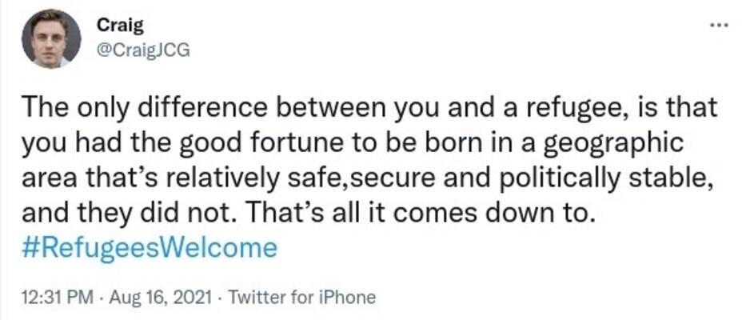

### We couldn’t exist without the rest of the world

### Borders divide those oppressed by Capitalism

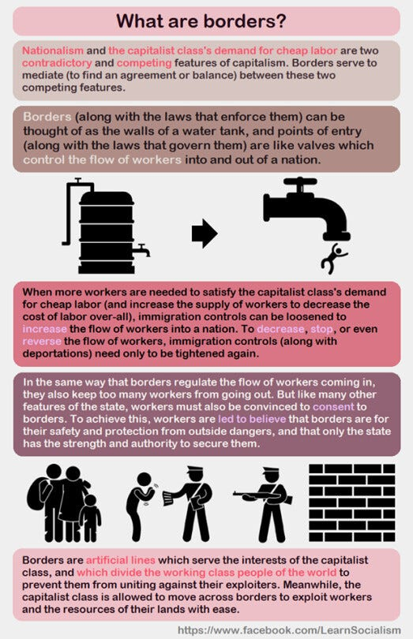

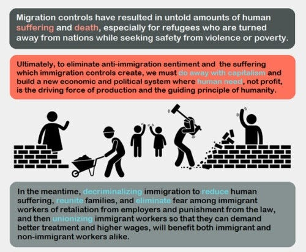

## America - Land Of Immigrants

### Immigration doesn’t cause unemployment - Corporations do

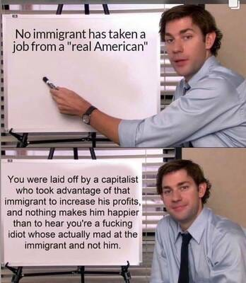

### America is a land built on immigration

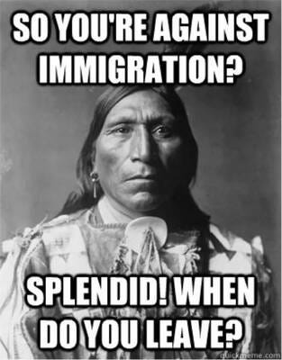

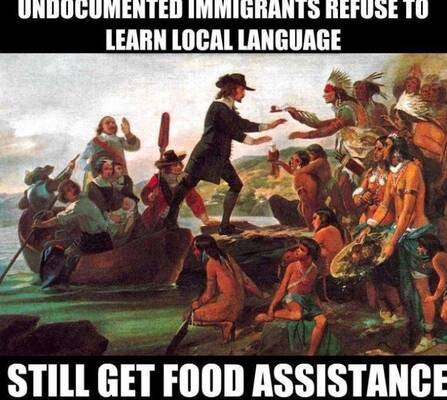

### Schrodinger's immigrants -   
Supposedly lazy but taking your job

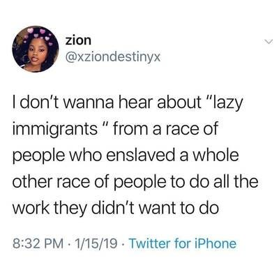

### Immigrants bring more in than they take out

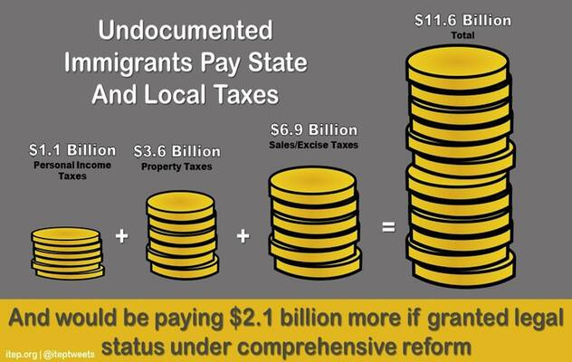

## The U.K. - Coloniser Of The World

### The right creates fear through lies about immigrants

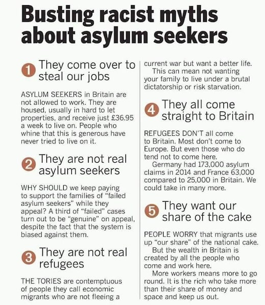

### Every persecuted minority has been an ‘unwanted’ immigrant at some point

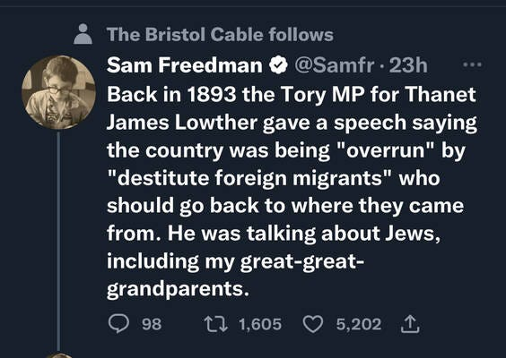

Next time it might be your group!

## Conclusion

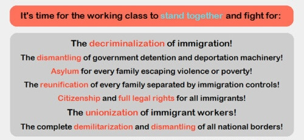

 **Further Reading -**

[Countries And Borders](https://peacefulrevolutionary.substack.com/p/countries-and-borders) \- Imaginary Lines On A Map (my article)

Books -

  * [Against Borders - The Case For Abolition](https://www.versobooks.com/en-gb/products/2655-against-borders)

  * [Border Abolition Now](https://www.plutobooks.com/9780745348988/border-abolition-now/)

  * [The Case For Open Borders](https://www.haymarketbooks.org/books/2199-the-case-for-open-borders)

  * [Border And Rule](https://www.haymarketbooks.org/books/1553-border-and-rule)

Subscribe

[Share](https://peacefulrevolutionary.substack.com/p/immigration-and-borders?utm_source=substack&utm_medium=email&utm_content=share&action=share)

