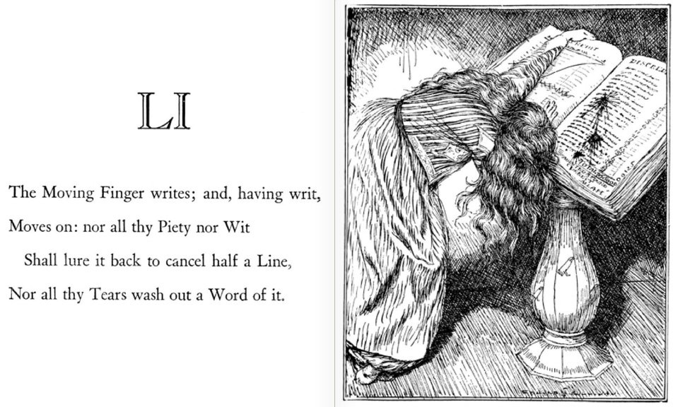

Text within this block will maintain its original spacing when published
    
    
    ‘Send me a postcard, drop me a line
    Stating point of view
    Indicate precisely what you mean to say
    Yours sincerely, wasting away’
    _(When I'm Sixty-Four, Lennon & McCartney)_

## Comments & Criticisms

Every day people comment on my notes and posts. Many of the comments are encouraging, some are critiquing what I’ve written, with a few are saying negative things about me personally, or making derogatory remarks about the ideas they associate with me.

I appreciate all of the encouraging comments, and wish I could personally thank everyone who writes something positive. But, I’m also grateful for many of the critical comments when they are written in good faith and expressed reasonably. They encourage me to double check the facts of what I’ve said or the assumptions I’ve made, which is something we all need to be prepared to do if finding and accepting the truth is important to us.

Several of my posts began as responses in my daily notes:

  * [Organising Without Rulers](https://peacefulrevolutionary.substack.com/p/organising-without-rulers) \- Is society possible without hierarchy?

  * [Society And Shoulds](https://peacefulrevolutionary.substack.com/p/society-and-shoulds) \- What is society responsible for?

  * [Hierarchy and Revolution](https://peacefulrevolutionary.substack.com/p/hierarchy-and-revolution) \- Can authoritarianism lead to freedom?

  * [Are We Property](https://peacefulrevolutionary.substack.com/p/are-we-property) \- Do we own ourselves?

  * [Capitalism vs Socialism](https://peacefulrevolutionary.substack.com/p/capitalism-vs-socialism) \- What is the more moral system?

I enjoy engaging with different people and learning their unique perspective, especially when. discussing interesting and controversial topics. When I’m have a conversation in person I try to start with points of agreement, to see what values we share, and to build upon this. It is easier to do in person than in short chats, where disagreements can quickly devolve into trying to prove each other wrong with ‘what about this?’ gotcha sentences.

Sadly, I often spend so much of my time responding to similar remarks I have put together this Frequently Asked Questions post for those interested in my thoughts and answers.

To try and free up some more time for my writing, from now on I’ll be sending a link to the F.A.Q. section of this page when I feel it is relevant and addresses the questions or criticism I’ve gotten, or direct others to articles that may address the question better than I can do in a short reply.

But I will begin ignoring anyone who says anything offensive. It is just silly and childish. I’ll also be banning anyone who writes any racist remarks, while others may have the patience and time to try and help such people see their errors I currently do not.

## Why I Write

 _As there are often assumptions about my intentions and reasons for writing:_

No organisation pays me to write any of the things I do, and I do not write for money. I am not financial independent, and so I write in my spare time about topics I am interested in or feel are important to share.

Some people assume I have something against them personally when I criticise their beliefs, but it is the beliefs I am critical of not them. If I am critical of a belief it is because I believe it is misleading or harmful, and that there is a better way that could bring more peace or happiness.

I have changed my own beliefs over time as I have learnt more because I have tried to understand others points of view, and I ask this of others too. Everything I share is me thinking out loud, it is a rough and imperfect and refining process, and this is my place to learn and to be humble enough to be corrected. Telling me I am wrong does nothing to help me in that process, but showing me where I am wrong, ideally with some logic and evidence, will be appreciated.

## What I Am Not

 _As there are often presumptions about my background and position:_

I am not an American, I am not a Democrat, or a Liberal, or a Leninist. I will not defend the policies of any political party, nor do I have any loyalty to any country or religion. If you want to label me an Anarchist or Socialist that’s fine, but I am definitely not a Capitalist or Nationalist.

I’m often told by people who don’t know me, who disagree with me, that I must be lazy, unemployed, young, inexperienced, and living in a basement. Okay, the lazy part may have some merit, as I like to be lazy sometimes, but I work for a living, pay my bills, have been around a while, and have a nice roof over my head. I’ve been quite privileged in life, which I try not to take it for granted, and to realise that it hasn’t just come from my hard work but also from luck.

I do have strong beliefs which are not popular with everyone. I am against all forms of hierarchy and almost all my political views stem from the belief that no one ever should or has the right to rule over another person. I also strongly believe that everyone should have the dignity of having their basic needs met, without someone else being able to prevent this, or it being based on how much money they have.

I am for compassion, science, love, happiness and being respectful of nature. I enjoy learning, sharing time with family and friends, and working on creative projects. I like good food and desserts too much, but luckily have a quick metabolism. This is who I am, and what I stand for.

 _Now on to the questions and comments I get most often:_

## Frequently Answered Queries

### ‘Why Did You Say That?’ _(Blaming The Messenger)_

People often mistake me for being the author of the quotes or memes that accompany my ‘Reasons’ notes. These notes are just short messages - I’m sympathetic to the ideas that go with then, but I didn’t create them and can’t speak for them. If you’d like to know why I personally dislike Capitalism you can read more about that in this post: [Reasons To Hate Capitalism](https://peacefulrevolutionary.substack.com/p/reasons-to-hate-capitalism?r=25vj2b)

### ‘Why Are You So Filled With Hate?’ _(Assuming Intentions)_

My daily notes take about a minute to post, they are my little way of expressing frustration (or sharing in the frustrations others have) with Capitalism, because I believe that there would be less pain and injustice in the world if we had a better system. Hate is a strong word, but it can sometimes be an appropriate one, and I give my reasons for why I think the word ‘hate’ fits this purpose in a longer post on the subject: [Why Hate Capitalism](https://peacefulrevolutionary.substack.com/p/why-hate-capitalism?r=25vj2b)

### ‘That’s Not Capitalism!’ _(Changing Definitions)_

Although I try to stick to the classic dictionary definition of Capitalism, some people define the word Capitalism differently. I believe that crony, corporate and regulated (or unregulated) Capitalism is still Capitalism: All of these variations have people who own capital (Capitalists) and an economic system which uses capital (Capitalism). It may not be others ideal of Capitalism, but it still looks like Capitalism to me. I go further into the historical definition and use of the word Capitalism in my article, [What Is Capitalism](https://peacefulrevolutionary.substack.com/p/what-is-capitalism)

### ‘Capitalism Is Great!’ _(Broad Claims)_

I’m not convinced that Capitalism has been better for the world, or – even if it has been – that we can’t do much better now without it. Many of the advances of science and even technology were made at universities by scientists and researchers, and only capitalised upon by corporations who limited access to who could afford them. But there are examples of better ways of organising society: [A Better World Is Possible](https://peacefulrevolutionary.substack.com/p/a-better-world-is-possible) without Capitalism.

### ‘Back In The USSR …’ _(Guilt By Association)_

People are often telling me how awful the Soviet Union (or Marx or Lenin or Stalin) were or China is, because they presume I’ll defend those authoritarian states and its leaders. However, I rarely say anything about the USSR or Marxism, and when I do it is often negative. I’m not a Marxist and the Soviet Union is not relevant to my own position. Nor do I think that the U.S. and the U.S.S.R. are not the only ways of society being organised, but I have written several articles against Leninism if you are interested in learning my views: [Lenin’s Justification For Hierarchy](https://peacefulrevolutionary.substack.com/p/justification-for-hierarchy-under)

### ‘That’s Not Socialism!’ _(Straw Men & Systems)_

When someone tells Socialists they don’t know what Socialism is, it may be that we are defining Socialism differently. I’m happy to be referred to as a Socialist, just like [Einstein](https://peacefulrevolutionary.substack.com/p/einstein-the-socialist) and George Orwell were, but I realise it is often used on the right-wing as a synonym for all sorts of nasty things. The Oxford Political Dictionary defines it this way: ‘Socialism is a large and diverse political tradition, unified by opposition to capitalism. Economically, socialists also typically support common ownership or some form of social, democratic control over the bulk of the means of production.’ _(Oxford Encyclopaedia Of Politics)_ If you agree with this then Socialism must meet these tests to meet the definition: It must ‘support common ownership’ and it must have ‘democratic control over … the means of production’. I realise that authoritarian statists have sometimes used the word Socialism as a label, but I cannot understand how anyone can look at the USSR and think it met that definition. I give a brief overview of what Socialism is (and isn’t) here: [What Is Socialism](https://peacefulrevolutionary.substack.com/p/what-is-socialism)

### ‘Why Are You Against Freedom?’ _(Wild Assumptions)_

People sometimes accuse me of fighting against freedom and of supporting the removal of their freedoms. Nothing could be further from the truth. But then we probably have different expectations of what freedom involves. To me freedom is when workers freely organise, freely own their workplace which they own, and freely share what they produce for need instead of profit. Some call this Socialism. Whereas Capitalism is when a few have capital and use it to put people’s needs (and wants) behind paywalls. This situation coerces people into working for less than they are worth, and paying more to meet their needs, all to make and maintain profits. I see Capitalist freedom as ‘buy or die’. That’s not my idea of freedom. I believe that to have full freedom we need to be free to make choices without coercion or fear from threats or starvation or homelessness. This to me is part of what makes a [Free Society](https://peacefulrevolutionary.substack.com/p/a-free-society)

### ‘It’s The Illuminati!’ _(Conspiracy Claims)_

People love to tell me about their conspiracy theories. But, I’m sorry I just don’t believe that scientists or academics are all conspiring against us. There are good and bad scientists and scholars, but I do think that people who have studied a subject for years are usually more likely to have an informed opinion than someone who has watched some Youtube videos, and if we feel such authorities are wrong then we need to be able to give an intelligent reason and real evidence as to why. I agree that there is a lot of propaganda in the world, however, there is usually a substantial money trail that leads to those funding it, and it is always someone very wealthy wanting to influence politics or society (including sometimes to believe in crazy conspiracy theories). [The Real Conspiracy Is Capitalism](https://peacefulrevolutionary.substack.com/p/the-real-conspiracy-capitalism)

### ‘You’re Wrong About This!’ _(Skipping Reading)_

It still amazes me how often people see a heading or read the first line of something I’ve written and make a huge set of presumptions based on this and then reply to those instead what I’ve actually written about. What they are really saying is, ‘I am going to ignore what you said and use my comment as an opportunity to attack what I think you might be associated with (but haven’t taken the time to check).’ But why do they feel so sure and confident? It may have something to do with being brought up watching and listening to hundreds of thousands of hours of [Pro-Capitalist Propaganda](https://peacefulrevolutionary.substack.com/p/the-capitalist-empire-strikes-back-284)

### ‘Have You Considered?’ _(Rational Enquiry)_

I like when people tell me (words to the effect of), ‘I sincerely think you are mistaken about this.’ My reply to this is: Thanks for your concern about me. I’d be happy to read your critique to anything I’ve stated as true that you believe isn’t. Please write a post detailing the errors in what I have written about this, pointing out the problems in my reasoning and the evidence you have for your position. Give me the link and I’ll share it with those who follow this blog, and I will consider responding to it with another post. It is important to [Speak Up](https://peacefulrevolutionary.substack.com/p/speaking-up) and make your case, but we can do it respectfully too.

## Debates

In the past I’ve challenged many people to a debate via an exchange of posts. I’ve suggested debates on:

  * Organising society without rulers is impossible / possible?

  * Freedom Is Only / Isn’t Possible Under Capitalism?

  * Human Nature will / wont always lead to the same negative outcomes in society?

  * Which has killed more people over the last four-hundred years - Socialism or Capitalism?

  * You can / can’t judge Socialism by the example of the Soviet Union?

I suggest to them -

  * You can start by writing a blog article about why you think it is false

  * I will respond by saying why I believe it is true

  * You can respond saying why you think I’m incorrect - others who agree with you can respond on their blogs too

  * And - if I still disagree - I will respond as to why I think my point still has merit

  * We could then go another round if you wish if you don’t feel the subject has been exhausted

Wouldn’t that - from their point of view - if it is so obvious they are right and the evidence is on their side - be an easy win for them?

But no-one has ever taken me up on the offer, even when they say the evidence is on their side and insist I am wrong. The moment I challenge them to a debate they usually go away.

## Lack Of Listening

Lastly, I have to express how often I’m disappointed by the lack of listening and engaging that goes on in the exchanges that happen in chat threads. I expressed this recently to someone like this:

> If you want to converse or even convince with people who disagree with you then please don’t ignore what they are saying - attacking something they don’t believe in just shows you aren’t listening, and why should they listen to you if you don’t listen to them?
> 
> Don’t ignore their questions, especially if they are addressed to you personally - you might not be able to answer them, but it is rude if you don’t acknowledge them, and why should they address your points if you don’t address theirs?
> 
> Try to understand what they are saying and engage directly with what they are saying - no progress in any discussion can progress without this. Making completely irrelevant remarks does not support your position, it only undermines it.
> 
> Finally, if you don’t think it is worth the effort to read and understand and engage with someone on their level then don’t comment, because otherwise it is just like name calling in the school yard and then running away when someone comes to confront you about it. It leaves people without respect for you, and often having less respect for your position.

At such times I wish I’d just asked earlier on:

> I am interested in what you think is at the heart of our different perspectives - what do you feel is the fundamental difference between our world views? (What major thing do you think I believe that is wrong, and what do you believe the truth is)

Or just said:

> If you believe I am in error I’d encourage you to write a post about it and let me know the link so I can respond there if I want to, or to discuss it on a Reddit forum such as - [CapitalismVsSocialism](https://www.reddit.com/r/CapitalismVSocialism/) or [DebateAnarchism](https://www.reddit.com/r/DebateAnarchism/)

## Substantial Conversations

But I keep hoping for more substantial conversations and exchanges of ideas. I realise that people are very invested in their beliefs and don’t like them being challenged, that it also takes a lot of time to respond, and not everyone has that.

Likewise me responding and researching and replying can take a lot of time too, and as the blog has grown and the replies with it I can’t spend as much time as I used to, hence this post. Yet I will miss the chats and hope some will take me up on the offer of a friendly debate one of these days.

Subscribe

[Share](https://peacefulrevolutionary.substack.com/p/frequently-answered-queries?utm_source=substack&utm_medium=email&utm_content=share&action=share)
