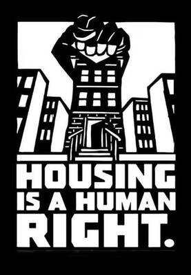

Some people claim the homeless bring it on themselves, that they are homeless because they are lazy or addicted to illegal drugs. In saying this those people may be telling us more about themselves than they are about the homeless. It at least tells us that they believe pro-Capitalist anti-homeless propaganda over the evidence.

If homelessness was just down to laziness then there would be no such thing as the working homeless, of which there are many, and if it was just due to using illegal drugs then the percentage of homeless people would be primarily rising and falling with such drug use, instead of mostly rising with increases in the cost of rent and falling when the the rate of unemployment goes down.

Undoubtedly there are people who struggle with addictions among the homeless, and maybe even some who struggle with working, perhaps due to mental health problems (although homeless is more likely to create and make mental health problems worse than be the cause of the homelessness), but the idea that denying them shelter and food is the best way to help them is not only cruel it isn’t effective, and leads to other social problems that cost more than if they were simply given housing. 

But some governments would rather be seen as tough (or fear being seen as soft) to the point that they expect us to pay more in taxes for dealing with the problems of homelessness than it would cost to actually solve the problem.

The politicians though are largely responding to fear and anger whipped up by newspaper and television news stories put out by rich owners who would rather have us focus on the homeless, and would rather have us fearful of the marginalised than to turn our attention to how much they taxes they are getting away without paying. Yet people keep falling for it, and the homeless keep missing out on much of the help they could be getting.

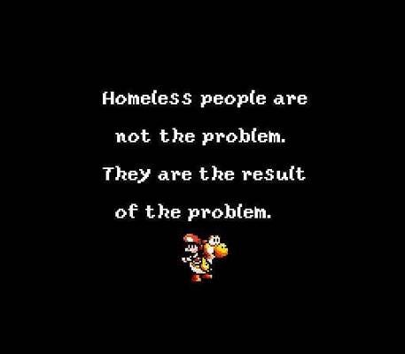

 _Quotes, memes, and questions posted by those passionate about this subject can teach us a lot about this subject and dispel many of the myths._

## Housing Inequality Under Capitalism

### Housing Access and Distribution

  *  **Under Capitalism there are 27 more empty homes (in the U.S.) than homeless people -**

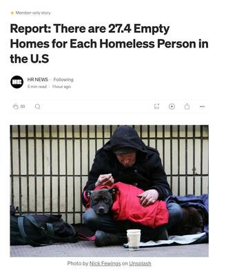

  * **This makes Capitalism the least efficient system at fulfilling the most important need -**

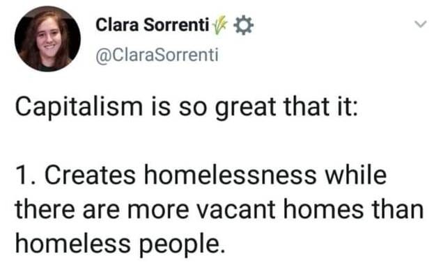

  *  **But Capitalism considers property more important than people -**

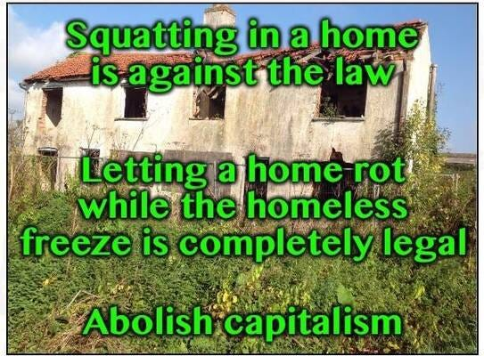

  *  **There isn't a lack of available homes there are rich people hoarding them to maintain high prices -**

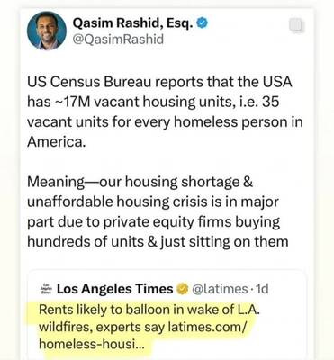

  * **Housing under Capitalism vs under Communism -**

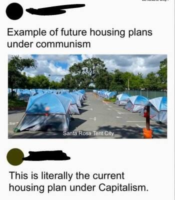

  * **It would actually be cheaper to house the homeless, but fear of homelessness keeps people in bad jobs -**

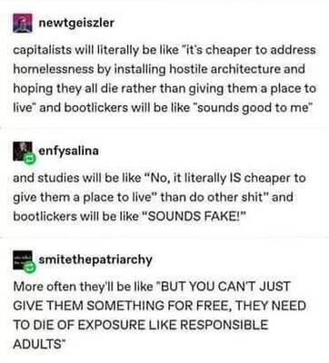

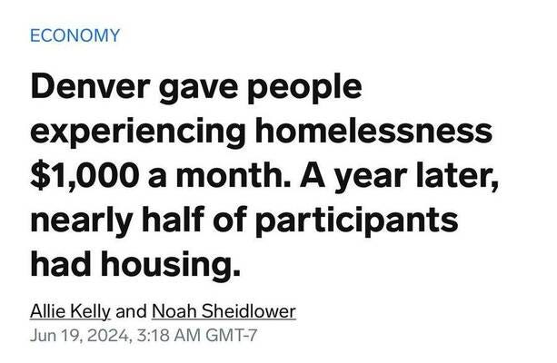

### Landlords and Exploitation

  *  **Now corporations are buying housing to become landlords and profit from the rent and keep us from having a home of our own -**

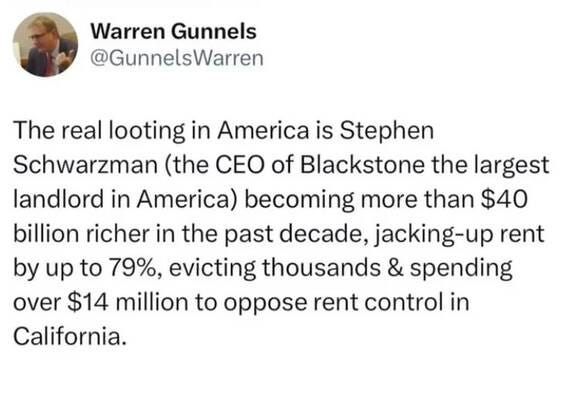

  * **When renters pay over 32% of income in rent, homelessness explodes - so its not laziness or drug use - it's landlords! -**   

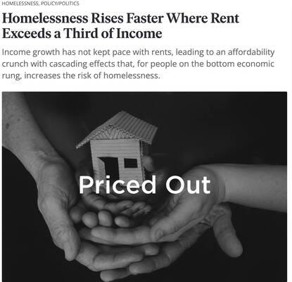

## Homelessness in Society

### Causes of Homelessness

  *  **A substantial number of younger homeless people are foster kids who aged out of the system found themselves homeless -**

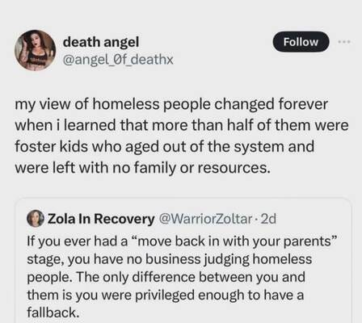

  * **What we sometimes call mental health issues is a lack of housing issue -**

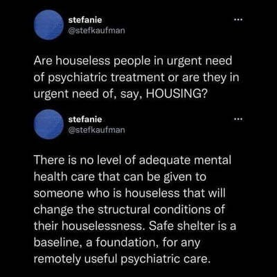

### Governmental Responses

  *  **Japan, Greece, Finland and South Korea have a few homeless because they help the homeless - its a choice -**

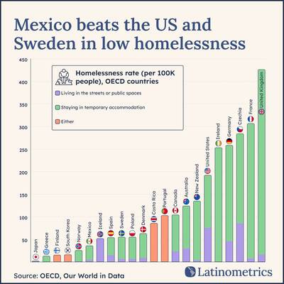

  * **They criminalise the homeless so they don't have to deal with wealth inequality -**

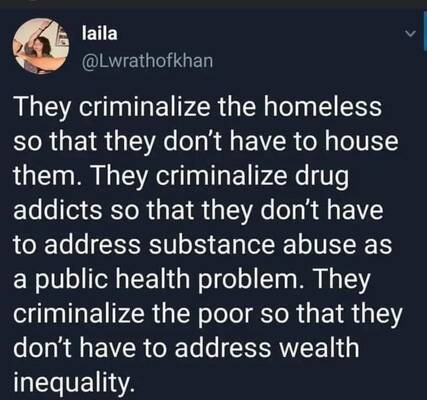

  * **When homelessness is criminalised, people without homes become criminals and go to jail, making it harder to find work when they get out, so they end up homeless which leads to them going to jail -**

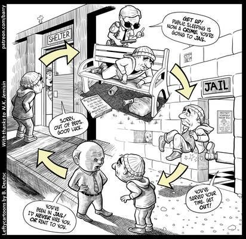

## Economic Control and Coercion

### Homelessness as Economic Control

  *  **Homelessness sets the floor for everyone's wages -**

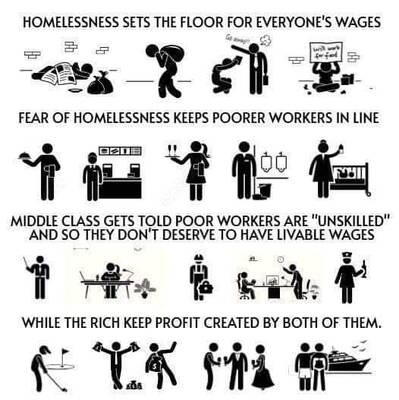

  * **Capitalism needs the threat of homelessness to motivate people to work at jobs they hate for low wages -**

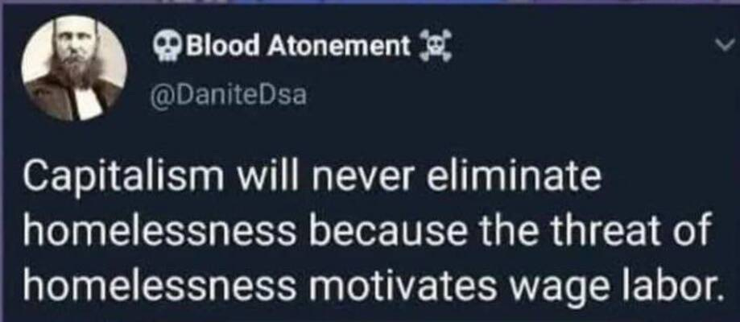

### Economic Narratives

  *  **Capitalism Blames Lack of Affordable Housing On Immigrants (When They Are Really The Ones Responsible) -**

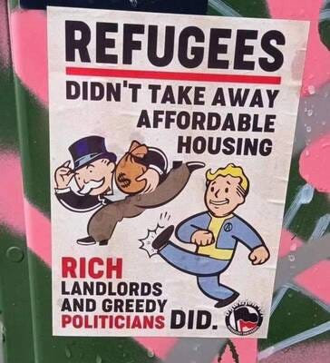

  * **Elon Musk says homelessness is a lie -**  
 _(If he is against the homeless that’s a pretty good reason to be supportive of them)_

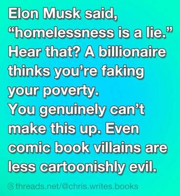

  * **Mortgages are a recent invention - we had housing 180,000 years before mortgages -**

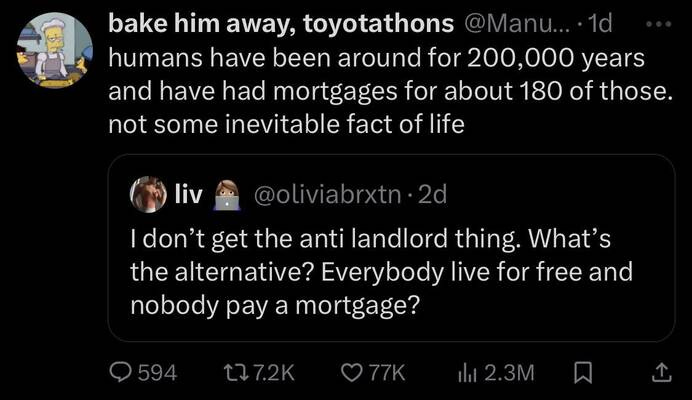

  * **The homeless are people, they are our neighbours - they could be us if we hit hard times -**

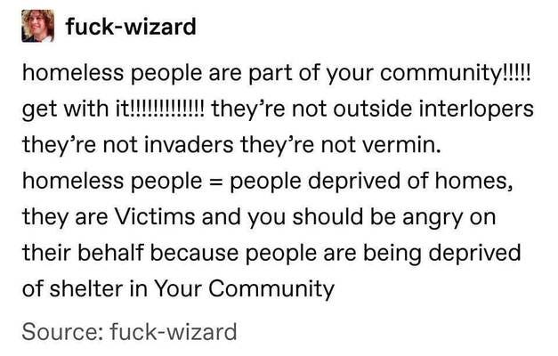

Subscribe

[Share](https://peacefulrevolutionary.substack.com/p/homelessness-and-capitalism?utm_source=substack&utm_medium=email&utm_content=share&action=share)

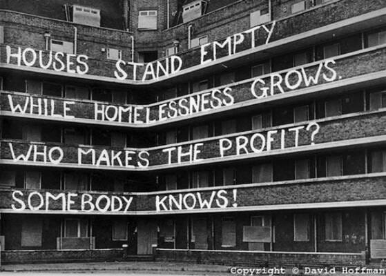
