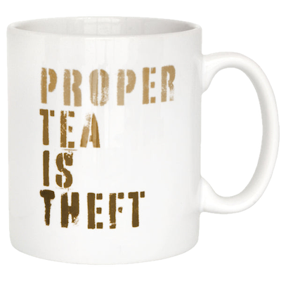
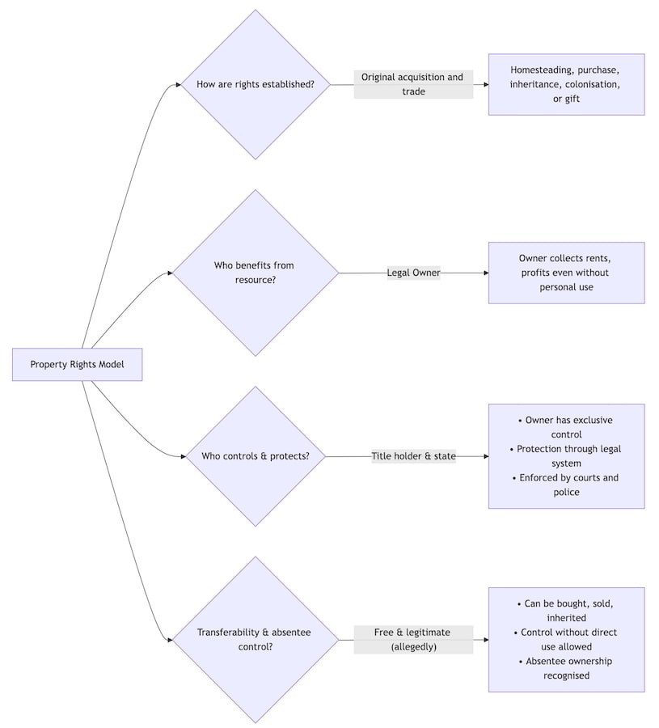
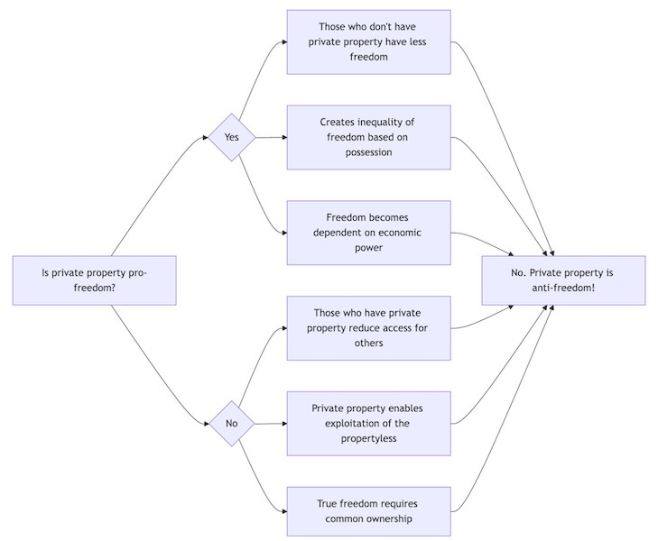
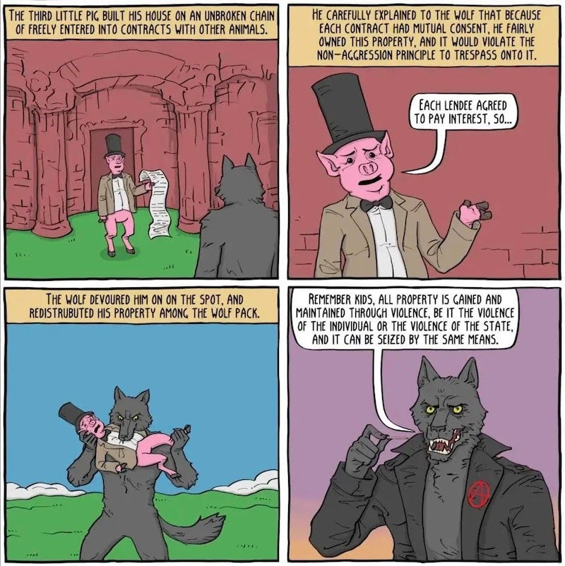

## Personal Property

If you are lucky, you have a house, a home that keeps you sheltered and warm. Under its roof you have lots of personal items that hold special memories for you, as well as all the comfortable furniture you enjoy relaxing on, knowing you are safe. You may have a little garden in which you can enjoy your own little bit of nature, with some lovely flowers and a few vegetables. You may even have a garage or shed where you have tools and enjoy making things.

Chance are that you are safe and secure behind your walls. At least unless you live in a war zone, on disputed land, or are being invaded. But if you live in a ‘developed’ country it is most likely that you will keep your house as long as you can pay your rent, mortgage or property fees on it, and will be able to stay in such a home your whole life.

Despite what some may have told you: No one on the Left wants to take your home away from you. They are happy you have somewhere to call home, and happy for that home to belong to you. This kind of personal property has always and will always exist under most Left-wing ideologies.

Yet, you may have heard, that the Socialists are after your private property. They are even reported to have been saying crazy sounding things like ‘property is theft’. Here is the point at which I have to disappoint the conspiracy theorists who imagine some secret cabal planning to airdrop their troops into suburbia to round you up and send you off to internment camps, while they turn your home into a pigsty. That’s not going to happen. No-one on the Left wants that.

But it is true that Communists have criticised what they call ‘private’ property, and this has led to a lot of misunderstandings because of the way the word ‘private’ has changed over time. You see, there is more than one kind of property: Public property is what belongs to everyone. For most of human history all land was public or common, it had no walls or borders. These days that’s the air, the ocean, the Moon, and little else.

Personal property is what a person has and uses for themselves and the people close to them. In the past there were limits on property, and on how much you could claim for yourself. If your tribe shared a waterhole and one person started claiming ownership of it, and limited access to it, they could cause great hardship to those who could no longer get water there. In such cases the water hoarder would probably be ignored, told off, removed from guarding the water hole, or exiled completely.

At some point this changed and a few people began owning more than they needed and charging others for access to it. If this were a fairy story and the place they were guarding was bridge across a river we’d call such people trolls, and we’d call their payment to cross a toll.

But it was millennia before we reached our current concept of property. Even under ancient Biblical law property rights were not absolute. Land couldn’t be sold or owned indefinitely , it couldn’t be used as collateral, and some of the farming land had to be set aside for the poor.1

The custom among my Celtic ancestors was that they could keep as much land as they could plough in a day. This continued for a few thousand years until kings sprang up and gave ownership of that land to lords. But the lords didn’t want to plough, so they let the peasants stay as long as they worked one day per week for them. Some of the peasants didn’t want to do even that much and lived instead on common land for free, which made up a quarter of all land at the time.

## Private Property

This situation continued for about fifteen-hundred years until industrialisation became a thing, and the lords invested in businesses that needed cheap labour for their new factories. Fortunately for them (not so much for the peasants) they realised they could get these workers by kicking the peasants off the land, because the lords had a piece of paper saying they owned that land. Past kings told their ancestors this and that still made it so, and even after the monarchy was gone their claim on that property lived on, despite the fact that they had stolen the land in the first place. A similar process repeated throughout the world into whatever country the empire invaded and ‘colonised’.

This is what makes private property a different thing from personal property entirely, it is private in the same way that a private school or private club is private, it excludes the many for the privilege of the few.2 When we privatise something we make it profit-producing, when something is personal it belongs to us personally and meets our own personal needs.

Whereas personal property is a relationship between people and things, private property is a relationship between people and people, using things to extract profit or power from others. Thus private property becomes the means through which some humans are denied access to the means of living by the ownership of private property by others.3

This is why Pierre-Joseph Proudhon made his famous statement that ‘property is theft’. He wasn’t saying that the peasant farmers and their homes were thieves for having personal property, but that those who assumed ownership of the peasants farms and homes for their private enrichment were thieves, and had no moral right to own them, no matter what a king had once said.

Private property created a system for perpetuating unearned privilege by passing wealth and property from one generation to the next, with the inheritors receiving advantages they did nothing to earn. Unlike the original Celtic farmer who claimed only what they could plough in a day generational wealth severed the direct relationship between work and its rewards.

Children of wealthy owners begin life with vast resources that others born without such privilege can never access. They receive better education, superior healthcare, more opportunities, and ownership of income-generating assets that work for them while they sleep. Meanwhile, those born without such advantages must work continuously just to survive. Even when working harder and longer hours, they rarely accumulate enough to escape the trap of propertylessness.

The same families who controlled land through feudal title later controlled banks, factories, and corporations. This unbroken chain of privilege extends from medieval lords to modern billionaires (with only relatively minor changes), with each new generation of owners maintaining control over resources produced by the collective labour of society.

## Propertarians

In contrast to this, however, one particular idealogical group considers private property to be the source of all freedom, at least for those who have such private property. You may know them as right-wing Libertarians or Anarcho-Capitalists, as they have self-styled themselves, but I think it is more accurate to call them Propertarians.4

The Propertarian believes that true freedom is the freedom to do what you want with your private property. Of course not everyone has private property and so – if private property actually is actually freedom – then some have less freedom because they do not own anything. This also means that those with private property have more freedom than those without, and because power is often proportional to wealth then those with a lot of private property are able to exercise a lot of that power over those with little or no private property, and yet this is still somehow the Propertarian ideal of freedom. So maybe Forbes is right, he who dies with the most toys wins, at least under such a system.5

Even the father of Capitalism, Adam Smith, was quick to see the danger of this, whatever other merits he thought such an economic system might have: ‘Wherever there is great property there is great inequality. For one very rich man there must be at least five hundred poor, and the affluence of the few supposes the indigence of the many.’ (Adam Smith, _The Wealth of Nations_ )

## Non-Agression?

Propertarians believe that property is so important that violence against property is the worst of all crimes, but as people are included in their definition of property6 it would be disingenuous to characterise the Propertarian view as not also claiming to produce a better situation for those with little or no property. They argue that even the wealthiest capitalist should never have the power to deprive anyone else of their property or life, a concept they call the Non-Aggression Principle. However, this concept quickly breaks down when we apply it to the history of property

Propertarians often justify their claims through John Locke's notions of ‘improvement,’ arguing that land becomes rightfully owned when someone improves it through labor.7 Yet this philosophy conveniently ignores whose labour typically performs these improvements. It wasn't lords who cleared forests, built irrigation systems, or harvested crops. It was peasants, servants, and (eventually) wage labourers who did the actual improving. If improvement through work creates legitimate ownership, then logically the workers who built railways, factories, and office buildings should own them, not the distant investors who merely supplied capital.

Furthermore, this logic presupposes that uncultivated land was ‘unused’ or ‘wasted,’ a fundamentally colonial perspective that erased indigenous relationships with land. Indigenous peoples often maintained complex, sustainable relationships with their territories, which preserved biodiversity and ecological balance across generations, but these practices were dismissed as ‘non-use’ to justify appropriation.

Although ‘Libertarian’ Murray Rothbard stated that ‘no man or group of men may aggress against the person or property of anyone else,’8 the indigenous inhabitants were conspicuously forgotten in the question of land ownership. The reality is that Rothbard and his ideological heirs speak eloquently about non-aggression and property rights while standing on stolen land. Their non-aggression principle conveniently begins after the most massive property theft in human history was already complete.

When pressed about the massive theft of indigenous territories, Propertarians' responses range from awkward silence to convoluted justifications. Some, like Rothbard himself, resort to racist assumptions about indigenous people using land ‘inefficiently’ or not having ‘proper’ concepts of property, thus excluding native peoples from the protection of Propertarian principles.

This selective application reveals the true purpose of these principles: not to protect all people from aggression, but to protect the existing distribution of land, wealth and power from redistribution. The Non-Aggression Principle serves as a one-way ratchet, legitimising historical conquest while forbidding any correction of its outcomes. For indigenous peoples and others dispossessed through violence, the message is clear: property is sacred, but only after we took yours.

Indeed, property is theft, but in our Capitalist world property is a legitimised, honourable, enforceable, profitable theft, and to encroach upon the right of the rich thieves to keeping their ill-gotten property is a worse crime under the Capitalist legal system than the poor starving and being homeless.

 _But there are many other crimes against society which property enables as I will detail in[my next article](https://peacefulrevolutionary.substack.com/p/property-wrongs)._

Subscribe

[Share](https://peacefulrevolutionary.substack.com/p/property-rights-and-wrongs?utm_source=substack&utm_medium=email&utm_content=share&action=share)

A couple of my fellow Substack authors have written articles good on the subject of property:

  * [Property Is Despotism](https://judgesabo.substack.com/p/property-is-despotism) (Judge Sabo)

  * [Property And Poverty](https://audiopervert.substack.com/p/property-and-poverty) (Counter Intuitive)

1

Leviticus 25, 19 & Deuteronomy 24.

2

In the U.K. private schools are called public schools because they are paid for by individual members of the public.

3

Paraphrasing - <https://www.reddit.com/r/Anarchy101/comments/13tcq1r/comment/jlvw5kh>

4

See my article, [Taking Back Libertarianism](https://peacefulrevolutionary.substack.com/p/taking-back-libertarianism), for a history of the word.

5

Toles, Tom. (October 24, 2016). ["He who dies with the most toys now loses!"](https://web.archive.org/web/20200902130231/https://www.washingtonpost.com/news/opinions/wp/2016/10/24/he-who-dies-with-the-most-toys-now-loses/). _[The Washington Post](https://en.wikipedia.org/wiki/The_Washington_Post)_.

6

See my article, [Are We Property](https://peacefulrevolutionary.substack.com/p/are-we-property), for a refutation of this idea.

7

<https://en.wikipedia.org/wiki/Labor_theory_of_property>

8

<https://en.wikipedia.org/wiki/For_a_New_Liberty>
