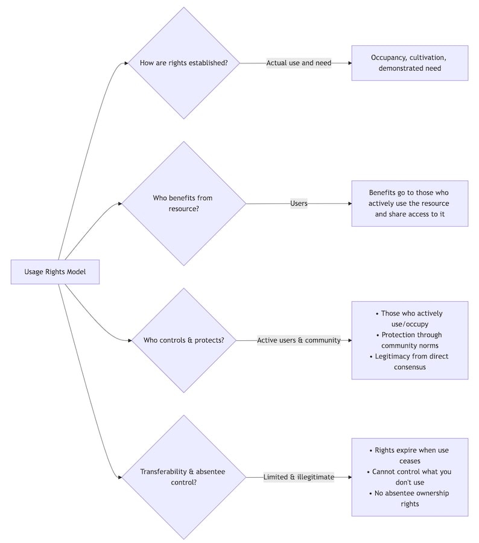
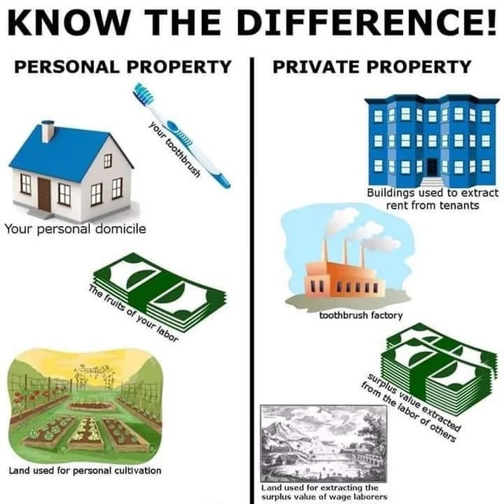
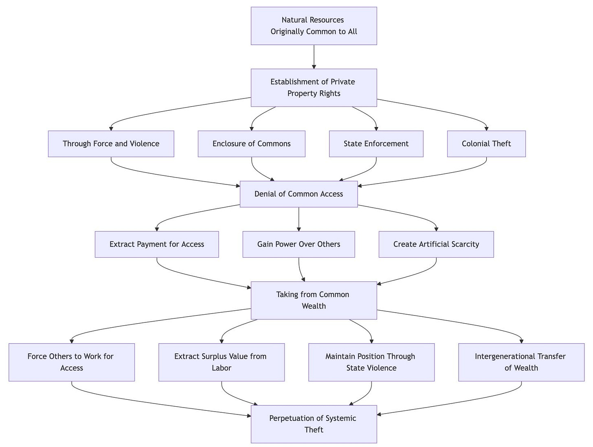
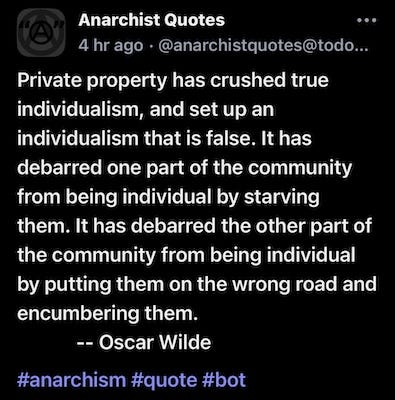
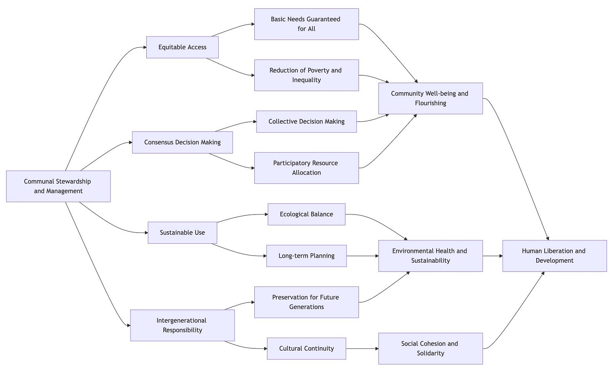

## Ancient Property Origins

You may have been brought up with the story that prior to the invention of property humanity lived in fragmented small tribes living cruel short lives. It is a popular portrayal of pre-history and has long been the most widely accepted one, up until recently. The idea that people will always inevitably set up borders, hoard resources, raid and kill their neighbours, and leave the defenceless to die, has had a profound effect on the world and its assumptions about human nature, education, work, crime and punishment.

But due to relatively new discoveries we now know, that the reality is that for most of human history, people not only lacked any formal property concepts, but lived in networks of communes that looked after the disabled and elderly. That even hunter-gatherers emphasised sharing over accumulating, while early agricultural societies practiced collective stewardship over the land rather than ownership.

Recent research:

  * [The Dawn Of Everything, David Graeber & David Wengrow](https://www.penguin.co.uk/books/314162/the-dawn-of-everything-by-wengrow-david-graeber-and-david/9780141991061), 2021

  * [Radical Antiquity, Christopher B. Zeichmann](https://www.plutobooks.com/9780745350394/radical-antiquity/), 2025

  * [The Prehistory Of Private Property, Karl Widerquist & Grant S. McCall](https://edinburghuniversitypress.com/book-the-prehistory-of-private-property.html), 2021

  * [Against The Grain, James C. Scott](https://yalebooks.co.uk/book/9780300240214/against-the-grain/), 2017

Earlier research:

  * [Anarchy In Action, Colin Ward](https://anarchyinaction.org/index.php?title=Anarchy_in_Action), 1996

  * [People without Government: An Anthropology of Anarchy](https://www.kahnandaverill.co.uk/product/people-without-government/), 1982

  * [The Original Affluent Society](https://www.fifthestate.org/archive/298-june-19-1979/the-original-affluent-society/), Marshall Sahlins, 1972

  * [The Gift, Marcel Mauss](https://files.libcom.org/files/Mauss%20-%20The%20Gift.pdf), 1925 

  * [Mutual Aid: A Factor Of Evolution](https://theanarchistlibrary.org/library/petr-kropotkin-mutual-aid-a-factor-of-evolution), 1902

This began to change with the Neolithic era, not everywhere, nor for everyone, nor all at once, but eventually wise elders became chiefs and warlike chiefs became kings, and kingdoms became the norm over thousands of years. Yet property was still relatively ill defined, until the the ancient Mesopotamian societies arose and institutionalised property through religion around 3500-3000 B.C. The Sumerian priests declared gods owned the land, making temples powerful economic centres administering ‘divine’ holdings. This religious concept of sacred property established patterns which have endured to the present day: the divine origin of property rights, the concentration of power in institutions (initially religions and then states), and punishments (supernatural or legal) for crossing borders without permission.

This continued through to the Middle Ages. Medieval European property derived from the doctrine of the land being God's creation entrusted to earthly authorities. The Catholic Church advanced the idea kings had a divine right to their dominion from God, and so could grant land to lords through Feudalism. This still wasn’t absolute ownership, because the king (or the church) could challenge rights to that land. But also because the system only functioned as long as the peasants worked the land, and there was also common land which belonged to everyone, albeit sometimes still subject to the whims of the monarchy, which over time took more and more of that land away in a process called ‘the enclosures’.

## Living In A Lockean World

As the Feudal economy began to give way to the mercantile one, and as the power of the church over states began to wain, so too came a new theory of property courtesy of British philosopher John Locke (1632-1704), the father of Liberalism. Locke's labour theory of property claimed that property rights emerged from mixing labour with nature. Although somehow the peasants working the land didn’t grant them any rights over it, as those rights belonged to the lord they worked under instead. Locke established this idea when most new ‘virgin’ land was violently conquered, colonised, and cleared of it’s indigenous inhabitants. He himself was an investor in such colonial ventures, including slavery, and believed his theory somehow justified such a system. He also extended his concepts to human relationships, assigning wives, children, and servants as man's ‘property’ too, which still forms the legal basis for much of modern property, relationship and employment law.

Although indigenous peoples tried to challenged Locke’s theories by protecting their lands and themselves with their lives, the greater firepower of the Europeans ultimately made their lands (and often them) the property of corporations such as The East India and East Africa Trading Company (and The Virginia Company, The Massachusetts and Hudson Bay Companies, and the Plymouth Company, amongst others in North America). Thus idea of corporations owning people isn’t just the fiction of the movie _The Truman Show_ , but was the reality of many people through relatively recent human history.

Not everyone agreed that this was right, fair or just, however, and in 1840 French economist Pierre-Joseph Proudhon (1809-1865) took direct aim at the assumptions made behind these claims to private property. To him personal property – what we have, need and use for ourselves and our families – was good and necessary, and should be protected. But having witnessed the failure of the 1830 French Revolution to deliver meaningful progress for workers, he believed that the key to permanent change was to address the causes of such inequality in power and money: private property and hierarchy. Proudhon didn’t pull any punches when he declared ‘property is theft’ and, although he explained clearly that he wasn’t after anyones toothbrush, the phrase has been misunderstood and misused by those who believe in capitalist property systems ever since.

## Nine Negatives Of Private Property

 _Note: The kind of property referred to in this list is only exclusively owned profit-making private or commercial property, which is used to extract money or work from others. This is not personal property, such as the items we use and inhabit, nor is it public, community or common property._

### 1\. Property Is Theft?

So, what did Proudhon mean when he made his famous and controversial statement said ‘Property is theft’? Was he just trying to get attention, was it just hyperbole, or was he making a more serious point?

If we start from the assumption that all natural resources (land, water, minerals) originally belonged to everyone in common, since no one created them and they were once available to everyone, then this raises the question of what happened to change this situation?

If we believe John Locke, then the people worked the land, dug irrigation ditches and mined the ores, then this work meant that the person who staked a claim on this property (and convinced others to make these improvements) owned it from that point onwards until eternity. However, as we now know this isn’t the way ancient peoples treated such land for most of their history, until some began to claim ownership of behalf of gods or kings.

The true story of the original accumulation of property is often one of conquering, occupying and stealing areas indigenous people once shared co-operatively between them. Some of them might have been offered a few beads in exchange, but as they had no concept of currency it was not a fair trade. With Europe this process continued with throwing peasants off of their land as other industries became more profitable than farming. In both of these cases this change in property relations relied on soldiers, police or a threat of damnation to legalise or sanctify the ownership and protect the owners from the people they made newly homeless.

But, some private property defenders (Propertarians) will argue that was the past, and we aren’t responsible for what our ancestors did, so surely it isn’t still theft today when people own and profit from property? Is it? Even if the action of taking this land was originally immoral why would it still be today?

#### Private Property Still Is Theft

Even generations after this original land was stolen, the theft inherent in property still continues today. When someone claims exclusive ownership of natural resources or means of production, they effectively deny others access to what was originally common to all humanity. They may not have carried out the original theft, but they are still depriving others of what nature offers everyone. Because of this they can then extract payment from people for using what should rightfully be freely available, gaining power over those who need access to these resources simply to survive.

By claiming private property rights, the owner essentially takes from the common wealth of humanity. They steal the natural right of others to use these resources, and create an artificial scarcity where abundance might otherwise exist, all under the pretence of the law. So Property rights were created for those feudal lords who stole the commons, not for those peasants who were using it.1

The property owners then leveraged their position to force others to work for them just to access these resources. They extract surplus value from workers' labor, maintaining their privileged position through state violence, and passing on this accumulated wealth (originally obtained through theft) to their heirs, perpetuating inequality across generations.

Therefore, the entire system of private property is built upon and maintains this fundamental theft. It represents not just a historical injustice but an ongoing one. To paraphrase one commentator, ‘To Anarchists property is theft, for Propertarians theft is property.’2 This contradiction highlights how our perspective determines whether one sees the current system as legitimate or fundamentally unjust.

 _Most Anarchists don’t believe in property rights, they believe in usage rights, so you keep what you are using for yourself, but when you stop using it then it returns to the commons where it came from. It could also be argued that Propertarians believe in a limited form of usage based rights, but the difference in their view is: If you use it first you keep it forever, and if anyone uses it after you then you can charge them for access to it (or to whatever it produces) indefinitely._

In Proudhon's analysis, property rights don't emerge from natural justice but from power dynamics that allow some to claim what originally belonged to all, creating systems of exploitation that persist long after the original act of appropriation. The theft isn't merely historical, it's structural and ongoing, embedded in the very concept of exclusive ownership of what nature provided freely. As the song says, ‘This land was made for you and me.’ Yet it is the rich which own it and prevent us from access to it.

### 2\. Property Is Inequality

 _Private Property leads to extreme differences in outcomes_

It's impossible to have private property without facing extreme wealth inequality, which often includes generational wealth and privilege. Private property leads to shocking disparities where hardworking individuals create immense value but receive meagre pay, while owners rake in billions. Take a garment worker, for instance, who might spend twelve hours a day crafting clothing worth thousands, yet earns just enough to scrape by. In contrast, shareholders who have never even touched a sewing machine pocket the profits as ‘returns on investment.’ This disconnect between what people contribute and what they earn is staggering, and directly due to private property.

### 3\. Property Is Poverty

 _Private Property leads to differences in the ability to exploit_

Private property allows owners to take advantage of monopolistic positions, extracting wealth through rent-seeking instead of genuine value creation. When essential resources like housing, medicine, or water are privately owned, those owners can charge far more than what it costs to provide them. For example, a pharmaceutical company that holds a patent on a life-saving drug can set prices as high as they want, regardless of the suffering it may cause.

This issue permeates the entire economy: the more crucial and irreplaceable a resource is, the more likely it is to be priced exploitatively. People need shelter, food, and healthcare to survive, so demand stays high even as prices skyrocket. This isn’t the efficient allocation of resources that Propertarians boast about; it’s a systematic extraction from those who create value to those who simply own the means of production. You cannot have private property and not have poverty.

### 4\. Property Is Corruption

 _Private Property leads to differences in influence over others_

Private property leads to significant gaps in social and political power. Those who own large property holdings can bankroll political campaigns, set up think tanks, buy media outlets, and steer public conversations in ways that the average person simply can't. A single billionaire can make their voice heard far above the crowd, not because their ideas are better or more ethical, but because they wield the sheer force of wealth. This skews democracy, turning the principle of ‘one person, one vote’ into ‘one dollar (or pound), one vote; a million dollars, a million votes.’

When political parties and candidates rely on affluent donors to support their ever-growing campaign costs, they naturally start catering more to the interests of property owners than to the everyday voter. The result is a political system that consistently favours the wealthy over the people, reinforcing and widening the very inequalities that threaten even the concept of democracy. You cannot have private property and be free of political corruption.

### 5\. Property is Hierarchal

 _Private property leads to differences in power dynamics_

Private property grants its owners power to control and coerce others, much like the feudal lords of the past. Likewise, a modern landlord has the authority to dictate how tenants live in their homes. A factory owner doesn't just oversee what workers produce, they also control how workers move, when they can speak, and even when they can take a bathroom break. An owner of intellectual property can stop others from using knowledge or culture, even if it could save lives.

This power goes beyond formal authority and seeps into everyday life. Workers often put up with unsafe conditions, sexual harassment, or wage theft because the alternative is facing homelessness and hunger. While proponents of property rights like to call these situations ‘voluntary contracts’, the reality is that choosing between submission and destitution isn't really a choice at all. The ability to deny others access to basic necessities creates a dynamic of domination that is fundamentally at odds with true freedom. You cannot have private property and be free of rulers.

### 6\. Property Is Injustice

 _Private property leads to differences in administering justice_

Private property sets up a justice system that’s stacked against those without wealth. When it comes to legal battles, the rich can afford skilled lawyers, pay bail, and have the financial stability to fight their charges. On the poorer side, those who are struggling often have to settle for bad plea deals simply because they can’t afford a proper defence.

Large corporations that cause harm to countless people might just get slapped with fines that represent a mere fraction of their huge profits, while someone who steals out of desperation can end up behind bars for years. Property owners can leverage their resources to drag critics, whistleblowers, or competitors into long, drawn-out civil lawsuits, effectively turning the legal system into a weapon.

What we end up with isn’t the fair rule of law, but rather a system where those with land and money can twist the law to their advantage, a serious perversion of justice that maintains existing hierarchies of power while pretending to be neutral.

### 7\. Property Is Ecological Destruction

 _Private property leads to different effects on the environment_

Private property fundamentally reshapes our relationship with the natural world, turning vibrant ecosystems into mere commodities to be exploited for quick profits. When forests, rivers, and soil are just items on a balance sheet, their long-term health takes a backseat to quarterly earnings. The owner of a coal mine has every incentive to extract and sell as quickly as possible, often pushing the costs of pollution and climate change onto society.

Indigenous and traditional communities, who have nurtured sustainable relationships with the land for generations, understood that we belong to the earth, not the other way around. They acted as stewards, not owners. Private property reverses this relationship, flipping it on its head, breaking nature into pieces where each owner chases their own narrow self-interests, resulting in collective ecological suicide. The real tragedy is not of the commons – community stewardship over shared land – but of privatisation, which cuts us off from our connection to and responsibility for the living systems that sustain us. You cannot have private property without eventually destroying the world

### 8\. Property Is Violence

 _Private property leads to differences in the ability to threaten and exercise violence_

 _(Having already treated in the last article the imperialist violence used to seize land overseas and the ‘enclosures’ which seized land from peasants in the past I’ll look into how that pattern of violence continues in the present.)_

Private property relies on threat and use of force upon us. Every ‘No Trespassing’ sign carries an implicit warning: cross this line and face forcible removal, fines, or imprisonment. When someone asserts exclusive rights to land or resources that others desperately need, this claim is meaningless without the backing of force. Property owners delegate this violence to authorities, but the dynamic remains, exclusive claims prevent others from meeting basic needs.

This reality becomes painfully clear during evictions, strikes, or protests when the violent roots of property rights emerge. The homeless seeking shelter in empty buildings or hungry people taking discarded food face the same choice: compliance or violence. Property isn't a natural right, it’s a power dynamic upheld through force against those who would use those resources for human needs.

Private property represents a structural violence that permeates society. Resources that could support everyone are enclosed behind ownership paywalls, forcing deprivation. A child going hungry while food rots in warehouses experiences a violently painful situation. A person who shivers on the street while buildings stand empty is facing a violently dangerous situation. A patient who dies because medicine exists but is priced out of reach is suffering the effects of a violent system.

This violence isn't just about deprivation, it includes coercion: workers forced to accept poor conditions to avoid starvation, tenants enduring intrusions and indignities to avoid homelessness. Citizens must follow laws that prioritise property over people because the alternative could lead to imprisonment. Each of these situations represents a limitation on human freedom through the threat of violence.

Without police, courts, and prisons enforcing exclusive claims, property as we know it would disappear. Every fence, every border, every property line symbolises potential violence against individuals whose needs could otherwise be met by crossing those boundaries.

### 9\. Property is Imprisonment

 _Private property leads to differences in degrees of freedom_

In exploring the history and effects of private property, we’ve uncovered not the foundation of freedom that Propertarians claim, but rather a system of exclusion and control that actually undermines real liberty for the majority.

The artificial scarcity fostered by private property benefits a select few at a significant cost to the many and to our planet. It relies on violence, breeds inequality, corrupts democracy, and disconnects us from the natural world. Perhaps most insidiously, it warps our perception of freedom itself, reducing it from the full realisation of human potential to merely the right of owners to do as they please with their belongings.

True freedom comes not from accumulating private property, but from ensuring everyone has what they need to thrive, not as a privilege granted by owners, but as a right inherent to being human. This vision of collective flourishing, rather than individualistic accumulation, points toward a society where freedom is not measured by the toys we possess when we die, but by the lives we help each other fully live.3

### A Better World Without Private Property

The challenge we face isn’t about eliminating personal belongings or taking away homes; it’s about rethinking our relationship with the earth and one another. We need to ask ourselves some fundamental questions: What is property for? What purpose does property serve? Who should control the resources we all need to live? How might we organise production and distribution to benefit everyone, not just those who own?

Private property leads to theft, inequality, poverty, corruption, hierarchy, injustice, environmental destruction, violence, and loss of freedom. So if we want a world in which we are safe, where life is fair, our needs are met, our systems are trustworthy, others don’t rule over us, we are treated fairly, we can enjoy nature, the world is at peace, and we are free then we must get rid of private property.

But another way is possible. Throughout history, people have devised numerous ways to engage with land and resources that don’t hinge on private ownership — from indigenous stewardships to commons shared by peasants, to modern collectives. These alternatives show us that we can fulfil human needs while preserving ecological balance, all without resorting to the deprivation, loss of power, and violence associated with exclusive private property.

Communal Property Concepts

Subscribe

[Share](https://peacefulrevolutionary.substack.com/p/property-wrongs?utm_source=substack&utm_medium=email&utm_content=share&action=share)

 **Some other articles on I’ve written Property:**

  * [How The World Became This Way](https://peacefulrevolutionary.substack.com/p/how-the-world-became-this-way) \- The Origin Of Property

  * [Are We Property?](https://peacefulrevolutionary.substack.com/p/are-we-property) \- Can We Own Ourselves?

  * [The Key Keeper](https://peacefulrevolutionary.substack.com/p/the-key-keeper) \- How Property Relates To Hierarchy

  * & last week’s article - [Property Rights?](https://open.substack.com/pub/peacefulrevolutionary/p/property-rights-and-wrongs)

1

To paraphrase Iain McKay, A Libertarian Reader, vol. 1, p. 30.

2

Ibid.

3

If I were to add a number ten it would be -  
 **10\. Property is Racism** \- To claim private property you have to think that you or your group is more entitled to it (and thus superior) to those indigenous people who already use (or used) it, or that they somehow owe you the land (or don’t deserve it) because they are inferior or less favoured by the gods. _It is also worth noting that for most of its history private property was also sexist - women were unable to own it in most Western European cultures._
