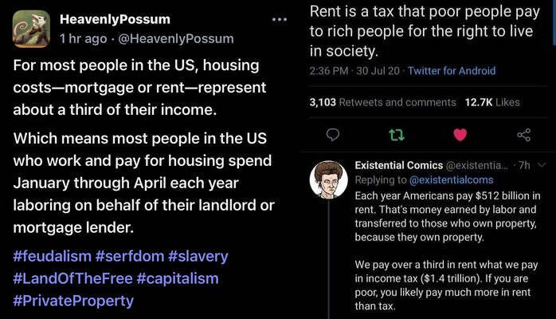
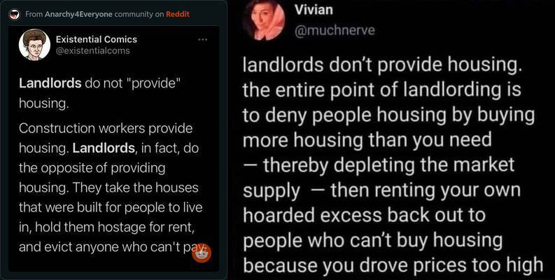
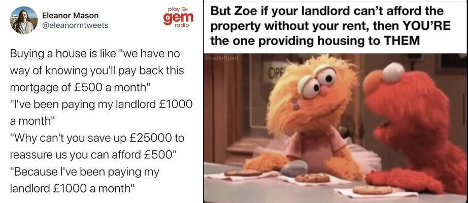
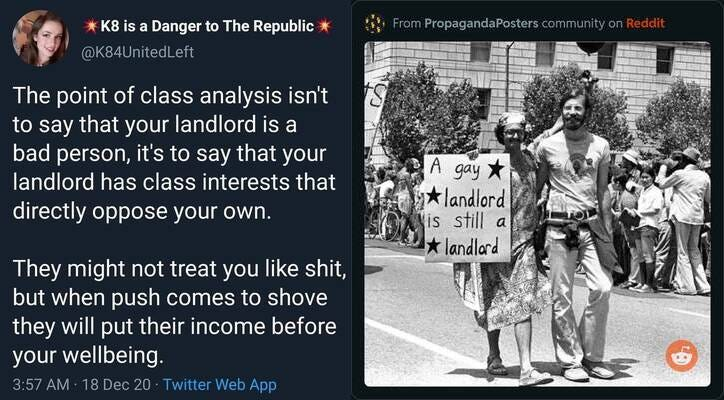
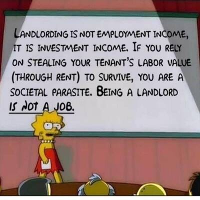
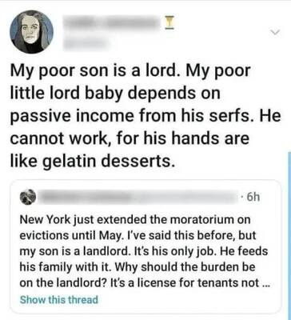
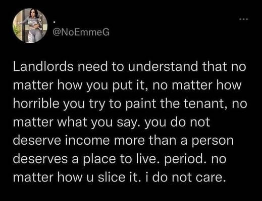
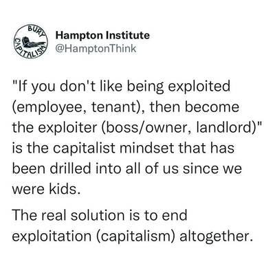
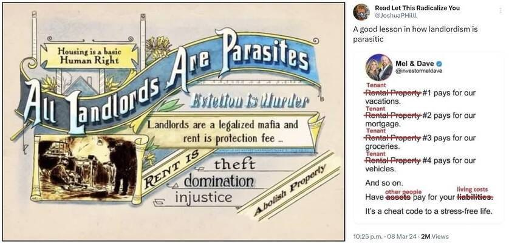
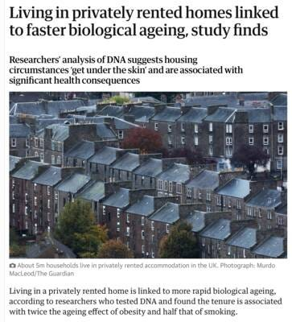

> ‘As soon as the land of any country has all become private property, the landlords, like all other men, love to reap where they never sowed, and demand a rent even for its natural produce.’ - _Adam Smith, The Wealth Of Nations._

 _This is one of my occasional meme smorgasbords, a little zine-like introduction to different political topics. It is specifically about the topic of corporate landlords, the kind for whom it is a business. This isn’t about social / public housing, or about your aunt asking you to pay toward the bills when you stay with her._

## The Origin Of Landlordism

 _To recap the last couple articles:_

  * [Property Rights](https://peacefulrevolutionary.substack.com/p/property-rights-and-wrongs) \- Personal vs Public vs Private Property vs Propertarians

  * [Property Wrongs](https://peacefulrevolutionary.substack.com/p/property-wrongs) \- Locke vs Proudhon - Public vs Private Property

People once lived in their own homes on their own land, then along came feudalism: the king giving lords an area of land and turning the people there into peasants, and the produce of their land into rent in kind.

When trade and factories became more profitable the peasants were evicted and made homeless, so that they would be cheap labour and have to earn wages to survive, much of which went back out in the form of rent, sometimes to the very same people who evicted them of out of their original homes.

The government which sanctioned this was often made up of these lords, or of local members of parliament, who often lived on the lord’s land and were loyal to them.

So landlords of the past literally stole peoples land and homes, and invented homelessness to make more money and make their employees and renters more reliant on them. This has created the system we have today.

## Current Landlording Situation

In the early 2020s, between 64-68% of Americans under 30 were renting their homes, while in the UK, the figure was higher at approximately 71-75%.

In America this made up 30-32% of their income in rural areas, and 40-45% in urban ones. In the UK it was 34-37% in rural areas and 45-50% in urban ones.

This is typically a higher amount than we pay in taxes to the government. We still effectively serve the lords over our land more than we do the state.

## Landlords Don’t Provide Housing

But aren’t these landlords providing a service?

Are they really? The houses already exist before the landlords rent them out. They would have been available to buy if they weren’t being rented, the cost would have been lower because buying houses for rental or investment pushes the prices of houses up, and the banks would be more willing to loan to those who don’t already have a house as collateral. So many renters may have been able to buy houses if it weren’t for landlords, and never would have had to use this ‘service’ at all.

Landlords are creating the scarcity they claim to be solving, and their for-profit service is temporarily removing a problem which they created in the first place.

### Landlords Provide Housing Like …

Landlords providing housing like …

  * Scalpers providing concert tickets - They buy up the supply and then charge a premium for access to something that could have been purchased more cheaply directly.

  * Trolls provide access to bridges - Someone blocking a path and charging a toll who didn't create the path, and are just restricting access to what was built by others (and I would argue should be a right and freely available).

  * Black marketeers hoarding water during a drought - So they can sell it back to desperate people at a markup, who are profiting from restricting access to a basic necessity.

  * Exploiters who put up chairs on a public beach and charge people to sit down - They have privatised something that was previously accessible to all.

Landlords are house hoarders. They aren’t the creators of anything good, they are just buying up what people need and are positioning themselves as paid gatekeepers. In these ways Landlords profit off of others misfortunes or desperation, and create a cycle tenants often can’t get out of in which they can’t afford to save a deposit to buy a house because they are using that money to pay rent, and rent somehow isn't proof they can pay a mortgage.

## What About Good Landlords?

We’ve all heard the story of the elderly landlady who rents out a room at below market rates just to have someone around as it makes it feel safer. But this is the exception not the rule. If you are luckily in that situation that is better than the one most renters are in, but if the landlady’s children inherit that property don’t expect them to be as easy going.

Even ‘good landlords’ are participating in and legitimising an inherently exploitative system that commodifies a basic human need.

### Aren’t Landlords Working For Their Money?

What makes a person a landlord is owning, not working. Many landlords leave the business of management to other companies, and leave most of the caretaking to the tenants.

But even if a landlord is more hands on their income comes from the property ownership, not from their work. Whereas the tenants income comes entirely from their work.

Being a landlord is an investment, if it didn’t give a return on their investment they wouldn’t do it. It is about extracting wealth, not creating it. Whereas a tenant works to perform some function and uses their other money on the cost of living.

### Landlording Is Not A Real Job

Jobs involve creating value: A builder creates buildings, a farmer produces food, a teacher provides education, a landlord merely extracts wealth from existing property.

Jobs involve actual work: Landlords often outsource actual maintenance work to others, property management companies handle admin, any real work involved is separate from the act of being a landlord, and the core ‘work’is simply owning property.

Jobs involve skill or labour: Landlords don't need qualifications, they don't need to develop skills, they don't need to provide labour, all they just need enough capital to buy property.

Being a landlord is a form of exploitation: Real jobs don't involve coercing payment through threat of homelessness, legitimate work doesn't require forcing others into economic dependency, and actual jobs create social value rather than extract it.

## Power Imbalance

The renter and the landlord are not on an equal footing. The contract they have entered into does not given them equal power. The renter starts off at a disadvantage because of their need for housing and the limitations of what they can afford. The landlord starts out at an advantage because they either already own the home or can easily get renters to pay off their mortgage by offering them temporary accommodation at an inflated price.

The power imbalance created by this relationship is revealed in other ways too: Landlords have disproportionate power over tenants' living conditions and stability, the threat of eviction can be used to suppress complaints about conditions, and financial pressure from rent increases forces people to accept deteriorating conditions. According to one study the stress tenants feel from being in this situation actually contributes to them dying earlier than landlords do.

Some landlords point out that not everyone wants to buy a home, and it is true that there may be some people and some times when temporary accommodation is preferable for a limited amount of time from a few months to a few years. But there are other possible solutions for this problem, such as some public housing being set aside for this purpose.

## Morality

Housing was and is a natural right because housing was once universal, because land was. There was common land and people co-operated to build houses rather than let anyone be homeless. This was the norm for most of human history, which was taken away from us so a few could profit.

But even if we didn’t have this historical injustice that created this situation there are many other reasons why Landlordism is morally wrong:

Househoarding is unjust, because it is wrong to profit from restricting access to shelter, a basic human need for survival, just as it would be wrong to charge people for access to air unless they pay.

Househoarding creates a landlord-tenant relationship is inherently coercive. The choice between paying rent or becoming homeless is no real choice at all, making ‘voluntary’ rental agreements effectively made under duress.

Househoarding enables landlords to accumulate wealth through others' need to avoid homelessness, rather than through providing any meaningful service or value to society.

Househoarding creates and perpetuates inequality. Those with property can generate passive income from those without, entrenching class divides across generations.

Househoarding forces many to spend most of their income on rent rather than building their own security and wellbeing, trapping them in cycles of poverty

Househoarding limits housing, a finite resource that everyone needs. Allowing private individuals to accumulate and profit from multiple properties while others lack housing security is ethically indefensible

The househoarders don’t have any more of moral right to their extra housing than we do to have a home of our own, or to stop us from being able to have ours by buying up and renting out the ones we might have had.

## Landlording Divides The Working Class

In those cases where people have inherited a home and rented it out to pay their own mortgage or retirement their ‘good fortune’ risks creating problems for their fellow workers, and it changes the relationship with them from ally to an owner / tenant power dynamic.

In such a situation those ‘one extra property’ landlords may forget that that it was landlords that made it harder for them to buy a house and pay their mortgage in the first place, or that to larger corporate landlords such smaller landlords are competitions they hope to ultimately buy out, and statistically probably will.

## Landlords Are Parasites

When people own other people it is called slavery, when they own another home and rent it out it is called being a lord of the land. They become a a depriver of housing, and an extorter of rent. When they rent that home out they become a lord over the tenants, and they become their serfs, existing to make the landlords wealthy at the expense of their own wealth, losing what they might have invested or saved or owned a home with in the process.

Landlords are parasites, they extract wealth without creating value, profiting from a basic human need. It’s not a nice word, I know, but if something is parasitic it feeds of its host, and that is what a landlord does.

Rent represents a transfer of wealth from working people to property owners, from the workers to owners. Something changes in the minds of some people when others are reliant on them, they feel not only an entitlement to their money, but feel they are doing them a favour, and may expect unreasonable things of them, such as putting up with poorly maintained, sometimes unsafe conditions, and in a few cases may exploit their tenants insecure housing situation in more immoral ways. Tenants often fear asking for help fixing problems with the property, and may put up with all sorts of indignities to ensure they keep a roof over their heads.

 _So, how do we change this? In a future article we’ll look at several potential solutions._

Subscribe

[Share](https://peacefulrevolutionary.substack.com/p/land-hoarders?utm_source=substack&utm_medium=email&utm_content=share&action=share)

