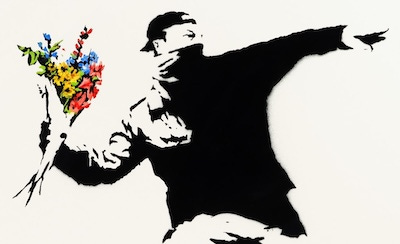
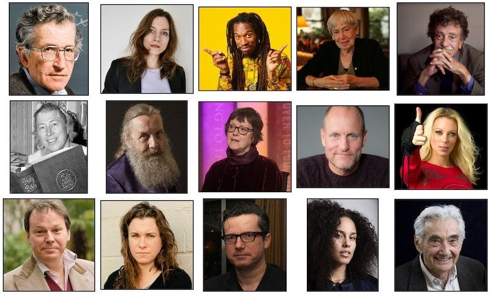
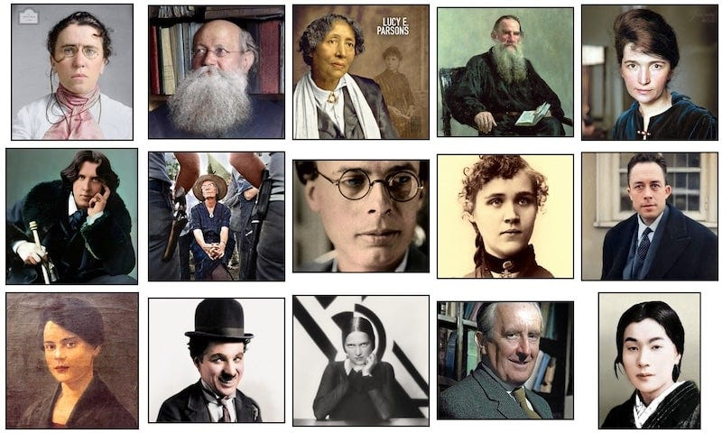
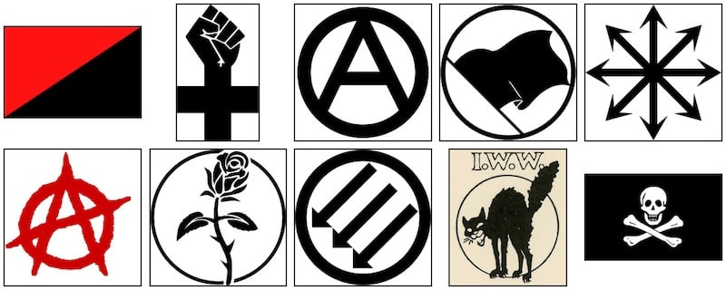
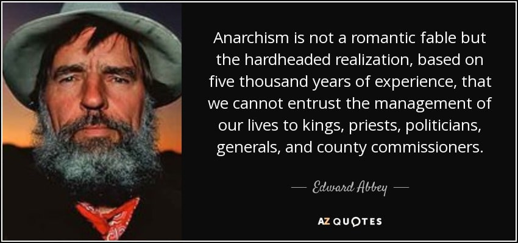
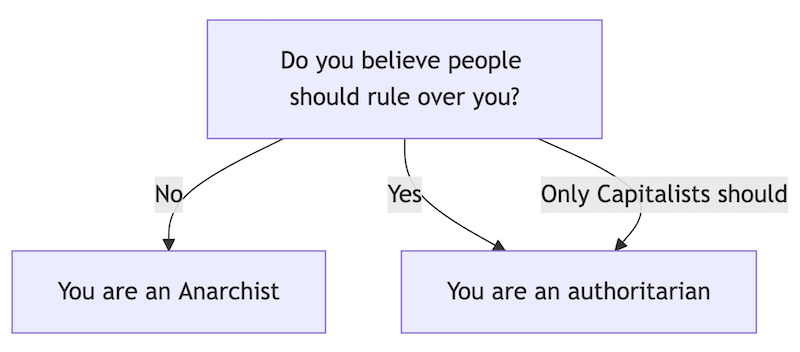
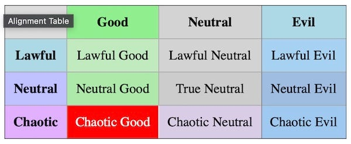
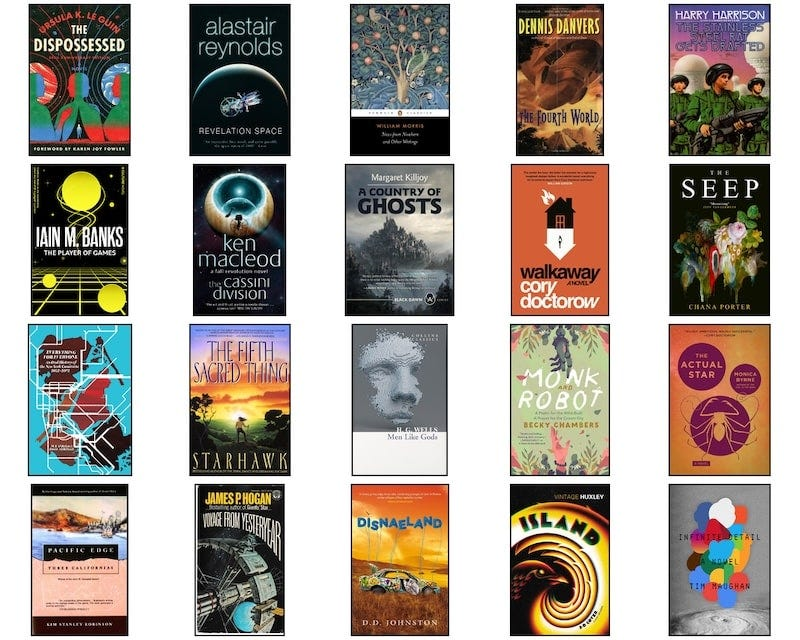
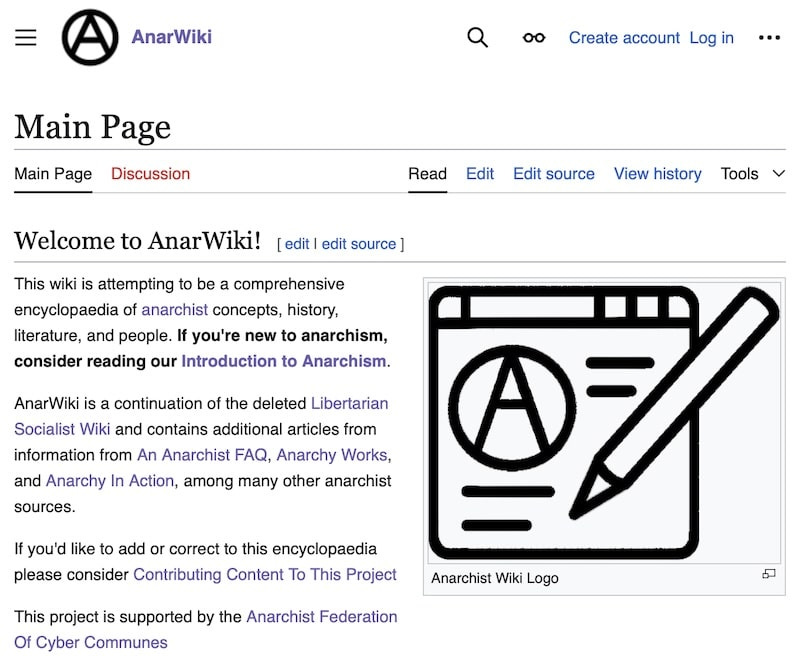

> ‘What are you, an Anarchist?   
> _Why, yes, yes I am._  
>  So you want to blow up the world?  
>  _No, not really. What gave you that impression?_ ’

Anarchism has gone by many different names over time:

  * Egalitarian

  * Autonomist

  * Equalitarian

  * Insurrectionist

  * Anti-Authoritarian

  * Confederalist

  * Libertarian1

  * Decentralist

These are just some of them. But before we can define what Anarchism is we have to address what people often wrongly think it is.

## What Anarchism Is Not

 **Anarchism Is Not Chaos**. It’s not people running around with no clue what to do, although that is an option for you if you really want to. In fact one of the complaints Anarchists have about Anarchism is that it can easily become over-organised and be too obsessed with meetings, discussion and agreements. _Oh the horror!_

 **Anarchism Is Not Violent**. Really! However, this admittedly one takes a bit of qualification. Yes some individual Anarchists have seen themselves as soldiers in wars against oppressors, and some fascists have literally gone to war against Anarchists and they have defended themselves, the Spanish Civil War being an example of this. So there can be violence in protecting yourself, and there can be violence involved in bringing down dictators, but there are also pacifist Anarchists, and the most radical Anarchists prefer to focus on building a peaceful world, if only they’d be allowed to do so.

 **Anarchism Is Not Punk Music**. It’s not mandatory – especially the Sex Pistols (they didn’t even know what the word meant when they sang _Anarchy in the UK_ ), whereas the song _Mack The Knife_ was written by an Anarchist (Berthold Brecht). So crooners can be Anarchists too.

 **Anarchism Is Not Veganism**. Although Anarchist do tend to spend time thinking about the ethics of their actions and what the most moral choices to make are, so they have a higher than average number of vegans and vegetarians amongst them - but there certainly are carnivores among its numbers too.

 **Anarchists are like you and me** , well at least like me, because I’m an Anarchist2. They might be your doctor, teacher, mechanic, or favourite author. For some reason there are a lot of Anarchist sci-fi authors.3

## Anarchists You Might Know

Like me Anarchists come in all kinds, shades and sizes. Here are some more contemporary Anarchist, a few of whom you may be familiar with:4

20th-21st Century Anarchists

See, they really do look like the rest of us. Some well known real-life Anarchists of the past include:5

19th-20th Century Anarchists

But to Anarchists these are just other Anarchists. None of them hold any special position, even if some are admired for their contributions.

Anarchists are also often portrayed in movies and television as the bad guys, but not always:6

Fictional characters are not always the best examples, and the point of Anarchy is to not be ruled or defined by others. However, I thought it would be useful to show (mostly) positively portrayed anarchists as well as some real examples to help dispel the negative images some have about Anarchists.

## What Anarchism Is

David Graeber argued that if we took seriously the advice our mothers gave us that ‘two wrongs don’t make a right’ then we’d all inevitably become Anarchists. In Fact **[You Might Already Be An Anarchist](https://peacefulrevolutionary.substack.com/p/are-you-an-anarchist-the-answer-may)!**

One of the earliest definer of Anarchism called it the marriage of liberty and equality. I myself have argued **[Anarchism Is Love](https://peacefulrevolutionary.substack.com/p/love-is-anarchist)** … in action, love given freely - but I realise it isn’t a broadly accepted definition.

So what is Anarchism then?

  * Anarchism is people making voluntary choices without coercion or fear of violence.

  * Anarchism is people associating and organising with others freely - or not associating with them.

  * Anarchism is free choices without compulsion or coercion - Anarchist are fundamentally against using force to make people do things.

Some positive phrases you might associate with Anarchism include:

  * Mutual Aid

  * Food Not Bombs

  * A Better World Is Possible

  * Free Association

  * Solarpunk

Some symbols you may associate with it include:

When it comes down to it there’s one definition of Anarchism all Anarchists and their detractors agree on: Anarchism is anti-hierarchy - it’s in the meaning of the word.

  * Anarchists don’t want to be forced to do things or force other people to do things.

  * Anarchists don’t want to rule over others or be ruled over by others.

  * Anarchists don’t want people to suffer unnecessarily or to be deprived possible opportunities.

This is why Anarchists reject all enforced domination - whether it be the kind exercised by Kings, Presidents, Prime Ministers or Popes, or the kind that comes from Bosses, Landlords or anyone you have to please, appease or pay to survive or thrive.

## Political Or Not?

This is why Anarchism is anti-state. Far from being representatives of us, politicians end up being mini-rulers looking after the interests of their corporate sponsors, they draw up artificial lines called borders and keep us within them, under their power to decide laws for us, and to order others to enforce them, even when those laws are not in our interests.

Just as politicians always end up serving money, so do the rest of us in order to survive, which is why Anarchists are also anti-Capitalist - they don’t believe meeting peoples needs should be based on affording food or housing, or that others should be able to decide if you eat based on you working for them. That doesn’t mean Anarchists want to sit around and do nothing, only that they don’t want to be forced by fear of hunger or homelessness to work for someone who takes away the value of most of what they produce and uses that wealth to rule over them.

Why do Anarchists hate Capitalism so much? Well, really they’d just like it to be irrelevant – they don’t want people’s worth judged by their monetary value, or peoples needs to be placed behind paywalls – especially as there is enough for all, but as we are likely to destroy the world if we keep up this Capitalism experiment it is about time we found an alternative.

### Anti-Politics

So Is Anarchism a political ideology then?

If you see politics as being about political parties and governments running things then Anarchism is anti-political. However, if you see politics as being about fighting for your rights to party, or anything else you want to do, then it is extremely political.

So where does Anarchism sit in the Left right political spectrum? 

Well that depends on how you define the Left and Right. The traditional left / right line had slave owning aristocrats on the furthest right, conservatives next to them, liberals around the middle, Social Democrats then Socialists to the left, followed by Anarchists, not that many of them were involved in state politics. _Note: Some Anarchists like Post-Left-Anarchists or Anarchist-Without-Adjectives reject the Left-Right spectrum altogether._

On the political compass Anarchist are in the bottom-left as far as you can go, because they want the most freedom with the least authoritarianism. Their mortal enemies are fascists, although they don’t get on with authoritarians (such as Stalinists also known as [Tankies](https://peacefulrevolutionary.substack.com/p/justification-for-hierarchy-under)) because authoritarians like to kill Anarchists, and thats usually not a recipe for a good friendship.

The real question for our more geeky readers is where Anarchism fits in the Dungeons & Dragons character alignment chart?

Anarchist wizards and warriors would be classed as Chaotic Good - us Anarchists - even mythological ones - might baulk at the use of the word chaotic, but the last thing Anarchists want to be called is Neutral.

## The Impossible Dream?

But isn’t Anarchism impossible? A world without rulers? How would that work?

In this area Anarchists have history on their side, the majority of human history, and some specific civilisations of millions of people that lasted longer than Capitalism has or is likely to. It has worked quite well, and it still does in many places. In fact you are probably already practising it in your personal life at least in some areas. Your friendships and relationships aren’t based on hierarchy, but free association and mutual aid to one another

Some **Historical Examples** of non-hierarchal societies include:

  * Medieval Iceland's Commonwealth (930-1262) - decentralised law without state.

  * Pre-colonial Indigenous American societies (Haudenosaunee Confederacy, 1142-1450) - consensus democracy.

  * The Hutterites (1528-present) have maintained successful communal living with shared property and technological adaptation across five centuries and multiple countries, with hundreds of colonies still thriving today.

  * Revolutionary Catalonia (1936-1939) - worker self-management in Revolutionary Spain.

  * Free Territory of Ukraine (1918-1921) - an anarchist society opposed by the Soviet Union.

Some **Current Examples** Include:

  * Zapatista communities (Chiapas, Mexico, 1994-present) - an autonomous self-governing region.

  * Rojava (Northern Syria, 2012-present) - democratic confederalist region.

  * Marinaleda (Spain, 1979-present) - co-operative village economy.

  * Twin Oaks (USA, 1967-present) - income-sharing commune.

What does Anarchism offer the world? A world in which everyone eats, sleeps with a roof over their head, works a hell of a lot less, and has far less reason or incentive to kill eachother, or themselves for that matter. [A Better World Is Possible](https://peacefulrevolutionary.substack.com/p/a-better-world-is-possible).

## Anarchist Utopias

Find it hard to imagine? There are many famous science fiction novels which look at future Anarchist possibilities from the days of H.G. Wells up to more modern award-winning authors like Becky Chambers:7

Anarchist Utopian novels

## Revolution Now (Or Eventually)

So when will this Anarchist utopia happen?

If I was a betting man I’d bet it will happen either in the next five years or the next five hundred. Major rapid social upheaval and revolutionary change can happen quickly, other changes often happen at a more gradual, evolutionary pace.

But one thing seems certain - we are running out of time to do it the ‘easy’ way, the earth isn’t going to put up with us destroying nature indefinitely. Maybe it will be easier to build in the ruins of a wrecked earth, but I’d rather there be a nice peaceful transition in the shorter term. However it happens, there are a lot of ideas on that.

Anarchism is useful now. It helps us to examine our relationship to power and how power is used in our lives and relationships, it helps us to see possibilities outside of treating things and people as capital, and helps us to build something better in the here and now with those who share this vision. After all, what is the worst that could happen if you try and live a life free from domination and capitalism as much as possible, you might just make some friends, show and receive some kindness, and be more at peace. That doesn’t sound so bad does it?

## Anarchism In Other Words

But if you wanted to avoid the Anarchist label there is no compulsion for you to call yourself that. Here are a few other suggestions:

  *  **Acracian** \- It sounds like an inhabitant of a mythical land, Acracia comes from the Greek: ‘a’ = without, ‘kratos’ = rule, or hierarchal authority.

  *  **Solidarityist** \- Because people can only have true solidarity if they are equal in liberty and equality with each other.

  *  **Eutopianist** \- From the latin ‘Eu’ meaning good - literally a belief in a Good Place.

  *  **Equitarian** \- A believe not just in equality but in fairness.

  *  **Liberationist** \- I heard this used recently and it has become one of my favourites. It fits well because Anarchists want people to be liberated from every form of oppression and domination.

## AnarWiki

Want to learn more?

Theres a new Wiki in town - [AnarWiki - the Anarchist Wiki](https://anarwiki.org) \- it is still in it’s early stages, but already has a few hundred articles that may be of interest.

Keep dreaming!

Subscribe

[Share](https://peacefulrevolutionary.substack.com/p/what-is-anarchism?utm_source=substack&utm_medium=email&utm_content=share&action=share)

 _This article is part of the[Whats In A Word](https://peacefulrevolutionary.substack.com/about#§whats-in-a-word-series) series._

1

Anarchists were so crafty they stole the word ‘Libertarian’ about 150 years before the right-wing pro-Capitalist Libertarian party used it - I guess they must have had a time machine or could look into the future, if only they’d trademarked it back then! Modern-day right-wing pro-capitalist so called [Libertarians are not Anarchists](https://peacefulrevolutionary.substack.com/p/taking-back-libertarianism), Most of them are Minarchists at best, that is a believer in a minimal state, because they believe in some form of capital hierarchy and are often willing to accept some power hierarchies to protect their capital.

2

I’m also a Socialist and a Communist. Anarchism is a form of Libertarian Socialism because (stateless) Socialism is workers organising themselves and working for themselves and each other. Anarchism is also (usually) a form of Communism because Communism – despite what you’ve been told – is stateless, it has no nations, rulers or borders. So most (but certainly not all) Anarchists believe in a form of Anarcho-Communism.

3

I’d argue it’s because imagination breeds compassion, and compassion breeds empathy, and empathy breeds a desire for equality, and every other system puts qualifications and limits on the extent of that compassion and equality.

4

Noam Chomsky, Sophie Scott-Brown, Benjamin Zephaniah, Ursula K. Le Guin, Kurt Vonnegut, Madeline Maury O’Hair, Alan Moore, Ruth Kinna, Woody Harrelson, Angela Gossow, David Graeber, Laura Jane Grace, Ross Carne, Alicia Keys, Howard Zinn.

5

Emma Goldman, Peter Kropotkin, Lucy Parsons, Leo Tolstoy, Margaret Sanger, Oscar Wilde, Dorothy Day, Aldous Huxley, Voltairine De Cleyre, Albert Camus, Virgilia-Dandrea, Charlie Chaplin, Ethel Mannin, J.R.R. Tolkien, Itō Noe. I meant to add Berthold Brecht and George Orwell too.

6

V ([V For Vendetta](https://peacefulrevolutionary.substack.com/p/v-speaks-to-madam-justice-on-anarchy)), Tank Girl, Hobie Brown / Spider Punk (Into The Spider-Verse), Flag Smasher ([Marvel](https://peacefulrevolutionary.substack.com/p/the-anarchist-avengers)), Green Arrow (D.C.), Britta Perry (Community), [Saw Gerrera](https://peacefulrevolutionary.substack.com/p/saw-gerrera) (Andor), Judith Lorillard (The Anarchists), Anderson Dawes (The Expanse), Pa'u Zotoh Zhaan (Farscape), Rick Sanchez (Rick & Morty), [Cassian Andor](https://peacefulrevolutionary.substack.com/p/star-wars-radical-origins) (Rogue One), Evey Hammond (V For Vendetta), Elliot Alderson (Mr. Robot), Libertarias. I also meant to include forgot to include the Fraggles from Fraggle Rock, Takeshi Kovacs from Altered Carbon, and Cosmo from Sneakers. Note: I’m not saying all of these are accurate or positive portrayals of Anarchists or Anarchism, but I thought they would be faces some who watch movies and television might be familiar with that they didn’t realise were meant to be Anarchists.

7

[The Dispossessed](https://peacefulrevolutionary.substack.com/p/in-defence-of-the-dispossessed) by Ursula K. Le Guin, Revelation Space by Alastair Reynolds, News From Nowhere by William Morris, The Fourth World by Dennis Danvers, The Stainless Steal Rat Gets Drafted by Harry Harrison, The Culture Series by Iain M. Banks, The Cassini Division by Ken MacCleod, A Country Of Ghost by Margaret Killjoy, Walkaway by Cory Doctorow, The Seep by Chana Porter, Everything For Everyone by Monia Byrne, The Fifth Sacred Thing by Starhawk, Men Like Gods by H.G. Wells, Monk & Robot by Becky Chambers, The Actual Star by, Pacific Edge by Kim Stanley Robinson, Voyage From Yesteryear by James P. Hogan, Disnaeland by D.D. Johnston, Island by Aldous Huxley, Infinite Detail by Tim Maughan.
