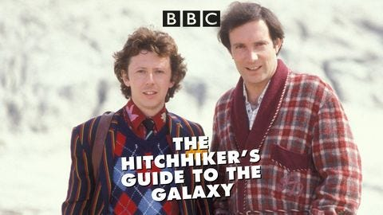
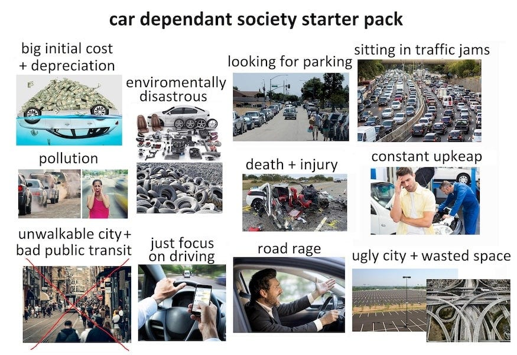
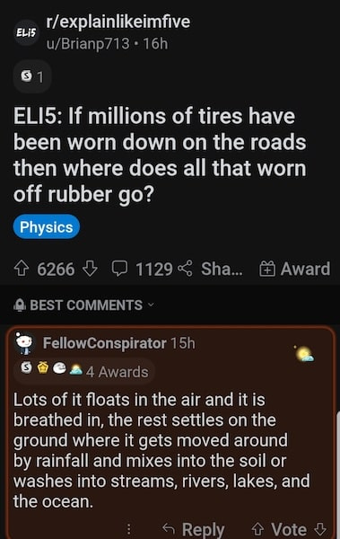
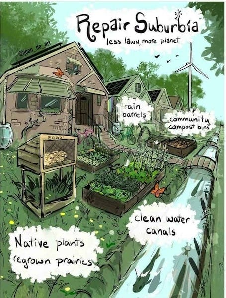
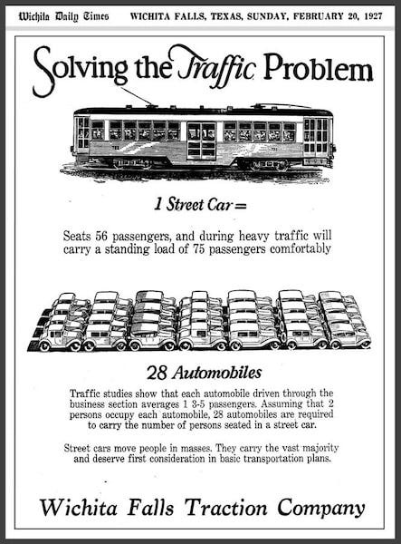
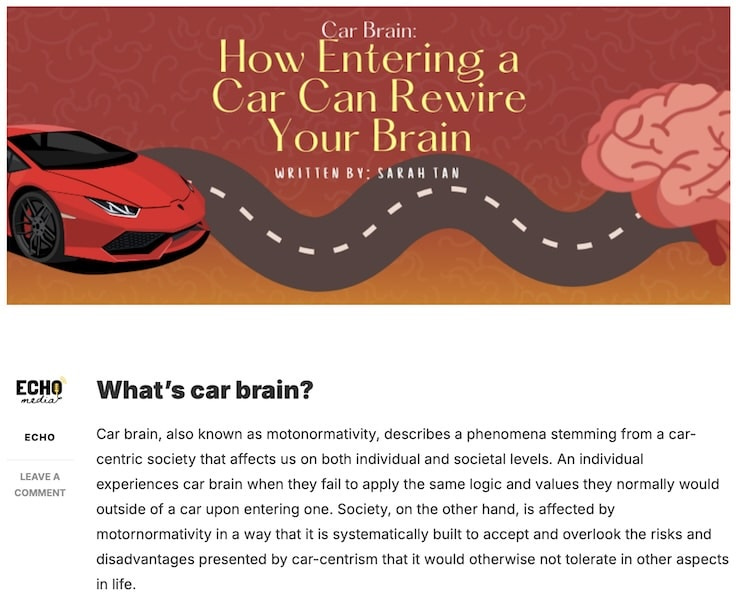

## What Aliens Think Of Us Using Cars

In a scene from the movie adaptation of _Hitchhiker's Guide To The Galaxy_ , just before the earth is about to be destroyed, Ford Prefect finally revealed his alien origins to his skeptical companion Arthur Dent in an attempt to save his life. In the process, he told us something about how aliens might perceive life on our planet:

>  _Ford:_ Arthur. What if I told you I really wasn’t from Guildford? I was from a small planet somewhere in the vicinity of Betelgeuse?
> 
>  _Arthur:_ Is that something you’re likely to say? 
> 
> _Ford:_ Remember when we met? … Wasn’t it strange I was trying to shake hands with a car? 
> 
> _Arthur:_ I assumed you were drunk. 
> 
> _Ford:_ **I thought cars were the dominant life form**. I was trying to introduce myself. You saved my life that day. And now I’m saving yours. Please drink.

Ford's misunderstanding about Earth's ‘dominant life form’ seem less absurd when you consider the billions of cars covering a planet seemingly made for the express purpose of them getting from place to place, only to usually sit idle in parking lots and driveways. Given that humans spend countless hours traveling within cars (or often trapped in traffic jams), his conclusion that the cars were in charge wasn't entirely unreasonable.

After all, our entire civilisation revolves around serving these metal creatures: we build roads for their movement, bridges for their passage, parking lots for their rest, and garages for their shelter, organising our lives around the constant journey between home and wherever these seemingly superior metal beings need to go. It is not unexpected that an alien would think that we are the ones serving the cars, rather than the other way around.

Inspired by this kind of scenario, a year ago I wrote the early draft of a book about the possible destruction of the world, including a part dealing with our odd relationship with such vehicles. In my story, a woman named Fen who works as a U.N. aid worker, meets up with her friend, a reporter named Art, to tell him she is really an alien and has just been meeting with world leaders to tell them how to stop the world from becoming uninhabitable before they run out of time. After she rehearses how humanity got itself into such trouble, Art asks Fen what the first step to avoiding that catastrophe should be, and is surprised by her answer.

>  _Art:_ ‘So, if you were to fix the world you’d start with land and food?’
> 
>  _Fen:_ ‘Actually, We told the leaders of the world they have to start with cars. ’
> 
>  _Art:_ ‘Cars? Really? Just cars?’
> 
>  _Fen:_ ‘Not just cars. All vehicles, anything used to move people and goods, besides public transport. But especially those used for short journeys, or that are highly polluting.’
> 
>  _Art:_ ‘And why that first?’
> 
>  _Fen:_ ‘Vehicle production and use drives the consumption of fossil fuels, the use of steel and cement, and comes at a higher environmental and real cost to humanity than any benefit they get from them.’
> 
>  _Art:_ ‘So the emphasis is being put on the idea of individual responsibility? The idea that everyone has to change, and bear the inconveniences and costs?’
> 
>  _Fen:_ ‘No. Exactly the opposite. Well, when it comes to the individual part anyway, as the inconveniences are inevitable either way. The car, truck, and plane manufacturers need to stop producing any more cars, trucks, and planes.’
> 
>  _Art:_ ‘Except for electric or clean fuels?’
> 
>  _Fen:_ ‘Any and all. Electric included. research and advances in technology will continue, so when the day long in the future comes when more are needed they can be produced then. But for now even electric cars are still made of steel - a tonne in each car, still transported using fossil fuels, and using manufacturing processes that use fossil fuels.’
> 
>  _Art:_ ‘So what is the timescale for this mass culling of cars?’
> 
>  _Fen:_ ‘Fifteen percent per year for the next five years.’
> 
>  _Art:_ ‘Seventy-five percent within five years?’
> 
> Fen: ‘That's the plan, and through that a similar reduction in the use of fossil fuels used to take trips, make vehicles, transport fuel, build roads and parking.’
> 
> Art: ‘And you just expect every car driver to go along with this.’
> 
> Fen: ‘No, not all of them, you don't need to wait on everyone …’
> 
>  _Art:_ ‘And how will people still get places? What about those who can't walk far?’
> 
>  _Fen:_ ‘To start with your second question: Exceptions will be made for the disabled, elderly, etc. But those people often suffer from not having enough human contact, and will now find people being much more friendly to them in the hope of getting lifts or car pooling with them.’
> 
>  _Art:_ ‘And the rest of us?’
> 
>  _Fen:_ ‘Well, cars stand unused 95% of the time already. If you begin by prioritising areas where there is already public transport and increase that, begin with people who are able and capable of biking short distances, and invest in local services – but thats getting on to another subject – then you may just need a car or two per residential street if that.’
> 
>  _Art:_ ‘So turn London in Holland then?’
> 
>  _Art:_ ‘Something like that. It's already far quicker to take the underground in London than a car, sometimes even to bike to somewhere during rush hour, and with less cars on the road the buses will get places substantially faster and more routes can be easily added. So yes Amsterdam and Copenhagen, and even Tokyo are good examples.’
> 
>  _Fen:_ ‘But what about nuclear power? Hydrogen?’
> 
>  _Fen:_ ‘What about it. It take five years to build a station. Atomic power has its place, but it is far faster to build wind and solar. And as far as Hydrogen is concerned – at least in the short term – it is just another way fossil fuel companies are trying to find to sell you a new commodity they can profit from.’
> 
>  _Art:_ ‘But doesn't your plan still let the biggest polluters off the hook?’
> 
>  _Fen:_ ‘Not when you look at the most effective way to stop all these trucks, cargo and cruise ships, and private jets.
> 
>  _Art:_ ‘Which is?’
> 
>  _Fen:_ ‘If you restrict the fuel produced and needed many will stop making them, because others will stop buying and using them. They’ll cease to be profitable. This is why you need control the flow, slow it at the tap.’
> 
>  _Art:_ ‘You must have something pretty big and pretty embarrassing on the worlds and corporate leaders to go along with this.’
> 
>  _Fen:_ ‘Well, now that is another subject, and one I'm not sure I should divulge.’
> 
>  _Art:_ ‘It’s okay … I'm not sure i want to know.’

I recently removed this exchange from the latest draft of the book, not because it didn’t have some merit, but to focus more on the personal story of the characters, and on how some other issues affect them individually. However, this conversation between them points out two simple truths that we can’t escape when we discuss Capitalism and the environment:

 **The world cannot afford the existence of cars.**

If you are pro-car you may be expecting me to say that we can’t afford cars because of their cost to the environment and that is true, but there is also another reason, one thats a problem for pro-Capitalists too:

 **You cannot really afford to own a car (unless you are very rich)**

Of course you may already have a car, you may drive it every day and keep your gas tank full. However, you cannot really afford a car, because if you were paying the real price for it without government subsidies it would probably cost you more than you could afford. Only the very rich could afford to drive a car if they had to pay the real full price.

## Cars vs Lives

I know that no amount of science will convince the pro-fossil fuel conspiracy theorists and man-made climate change denialists. Such is their determination to disbelieve inconvenient evidence that they won't even accept proof from the very corporations that originally promoted climate denial, despite the fact that these companies' own internal documents acknowledging that climate change is real and man-made.

Neither will I convince those who admit to the damage and dangers come from fossil fuel sources, but still believe it would be too inconvenient to their standard of living to change course. Nor will I persuade those who believe that some tech-bro will invent something to fix it all any day now (and presumably resurrect all the dead species and reclaim the land lost to desertification or sea rise). But I'm not writing this for those too selfish to care about others' futures, or who put religious-like faith in billionaires to solve the world's problems.

However, even if you discounted the environmental impact, there is another human cost which is already too high to pay and has to be addressed: car accidents and pollution-related deaths.

### Car Accidents & Health Problems

Globally one person is killed every 26 seconds by a car. In 2023 there were 40,901 car accident related deaths in the U.S. Worldwide this number climbs to 1.35 million traffic deaths per year. Tens of millions of people more people who would have been alive today over the last century if it weren’t for private cars.

Although, this isn’t the only harm which comes from the existence of cars. Cars pollute the air we breath and that causes irreparable harm to our health. A typical passenger vehicle emits about 4.6 metric tonnes of carbon dioxide per year, and such cars account for 61% of total CO2 emissions. Not to mention the emission of Carbon Monoxide, Nitrogen oxide, and Methane.

The latest research shows that fossil fuel air pollution is responsible for about 1 in 5 early deaths worldwide, as a result of breathing in air containing particles from burning fuels like coal, petrol and diesel. This manifests in various ways, including: Cardiovascular Disease, Ischaemic Heart Disease, Stroke and Chronic Obstructive Pulmonary Disease, Respiratory Diseases and Lung Cancer. In 2021, exposure to air pollution was linked to more than 700,000 deaths of children under five years old, making it the second-leading risk factor for death globally for this age group, after malnutrition.

No other worldwide war or disaster has ever been responsible for as many deaths. You'd think this human toll would be devastating enough, but cars also come with enormous environmental costs that may yet extract an even higher price. For those open to evidence and reason, it's worth examining not only the environmental impact of cars themselves, but the broader ecological damage caused by everything needed to support their existence, that reshape our entire planet around these machines.

Vast networks of roads and car parks fragment communities and consume enormous amounts of concrete and steel, urban sprawl that destroys natural landscapes and agricultural land, and a transport model that moves individual metal boxes weighing over a tonne just to transport a single person. The resources required to manufacture, maintain, and eventually scrap billions of personal vehicles remain astronomically wasteful compared to efficient public transport systems.

### Cars vs Nature

The world is already paying far too high an environmental price for cars. Beyond the obvious exhaust emissions, electric vehicles still require massive mining operations to extract lithium, cobalt, and rare earth minerals. These processes that devastate ecosystems, poison water supplies, and exploit workers in the Global South. The production of batteries alone generates enormous carbon emissions, whilst the disposal of these toxic components creates new environmental hazards.

The climate crisis we're witnessing, including unprecedented global heating with the last decade containing the ten hottest years on record, catastrophic biodiversity loss as ecosystems collapse, and ocean acidification, is largely driven by this car-centric system. Extreme weather events from devastating floods and hurricanes to prolonged droughts and deadly heatwaves are becoming more frequent and intense, displacing millions and destroying agricultural systems that billions depend upon for survival.

If this trajectory continues unchecked, it represents a genuine existential threat to human civilisation and potentially to humanity itself. The car-centric fossil fuel economy that already claims millions of lives annually through air pollution is simultaneously driving us toward a climate catastrophe that could claim billions more. The same corporate interests that have built their wealth on this system of organised environmental destruction continue to block the transition to sustainable alternatives, prioritising short-term profits over the long-term survival of our species. We are quite literally driving toward our own extinction to maintain a transport system that serves capital rather than human need. The truth is: **You cannot save the world if everyone owns a car**.

## Cars vs Capitalism

A car does not exist by itself. It is not grown naturally. It does not magic itself into existence. It takes a substantial industry and infrastructure to support. I’ve covered the real cost of gas before in my article, ‘[The Real Costs Of Capitalism](https://peacefulrevolutionary.substack.com/p/what-are-the-real-costs)’, but what if those subsidies and externalities were rolled into the cost of the car itself?

If we had to individually pay for the full cost of a car how much would it cost if – instead of the government giving automobile and fuel corporation subsidies — they had the consumer pay those costs? What if the costs of the infrastructure created to support cars were covered within the cost of a car too? How much extra would the price of a car be if it included the cost of all the health bills that were a direct result of car use?

Government subsidies and bailouts for car companies have run into the tens of billions over the last forty years, and state governments spend hundreds of billions on highways each year, with shortfalls funded by the federal government.

Health costs from fossil-fuel generated air pollution and climate change surpass $820 billion in health costs each year, although cars only contribute roughly 30% of this directly: $246 billion annually. Add to this traffic accidents, which cost an estimated $340 billion annually in the US, and the total estimated annual car-related government costs are: $844 billion.

If we were to divide this between each American driver they would pay $3,015 per person per year. As the average car lasts twelve years, so to cover these costs would add $36,180 to the price of a car (the average new car cost is $47,962, so this would increase it to $84,142). On top of this the cost of gas would go up substantially if it wasn’t subsidised by the government. (Fossil fuel subsidies are $760 billion per year which would more than double the cost of a gallon of gas if paid at the pump.)

This means that people who choose not to drive – often for economic, health, or ethical reasons – are forced to pay $2,520 annually each to subsidise a system that contributes to air pollution, climate change, and urban sprawl that directly harms their quality of life. This is a massive wealth transfer from non-drivers (who are often lower-income urban residents, elderly, disabled, or environmentally conscious) to car owners. It's essentially a regressive tax that forces the most vulnerable populations to subsidise the transportation choices of others.

# Car Brained vs Carless World

So what is the solution? Of course you may still need to get from A to B, so there needs to be solutions which don’t destroy the earth, or put the cost of travel beyond everyone except the very rich.

I realise that many people live in areas where getting to work would be impossible without a car. You can’t blame poor people for using cheap gas cars when they have no convenient public transport (or other feasible less polluting transport). If you live in the countryside you’ve always needed some form of personal transport to get into town, but when it comes to out of town suburbs it was designed to be car centric on purpose – to increase the sale of cars and gas, for the benefit of corporations not communities.

Nevertheless, America is a big country with many different transport situations. When I lived in America (in three different states, five different cities, and once in the countryside) I experienced every different kind of transport options:

  * The Southern Utah valley where I had to drive to work everyday

  * A small city in Colorado where I could cycle to work - there was even a dedicated cycle path.

  * A town in Oregon where buses were free and reliable and I took one regularly.

  * Salt Lake City where there was a great new tram (light rail) system that went from within walking distance of my house to work (and to the airport too).

So other ways are possible, even within America which has the fewest amount of people taking public transport of any ‘developed’ nation. In the rest of the world we know that public and good transports systems which are far less polluting can and do exist, especially in parts of Europe and Asia, where they are convenient and cheap to use, allowing a large proportion of the population to live without using a car at all. So it isn’t a question of whether it is possible, but whether it is a priority.

Now I live on an island with a thirteen thousand mile cycle network, half of which isn’t alongside car traffic, so that people can sometimes cycle to the nearest other city without crossing roads. I live in one of those fifteen minute neighbourhoods you hear maligned, and it is much more convenient to be able to walk to the grocery store, doctor, cafes and restaurants, and even a museum within ten minutes on foot, or even quicker by bicycle or ferry.

Many European cities show that if most of our needs are met locally then the amount of personal vehicles needed would be greatly reduced. Most journeys would be unneeded if you could walk or bike or hop on a bus or tram to places nearby to work, shop and socialise.

But American suburbs can be transformed too. An empty lot could become a community garden where neighbours grow food together. Strip malls could be redesigned as walkable town centres with housing above shops. Parking lots could be converted into parks, playgrounds, or affordable housing. Wide suburban streets could be narrowed to add bike lanes, street trees, and sidewalk cafes. Dead shopping malls could become community centres, maker spaces, or indoor farms. Even a single lane of highway could be reclaimed for light rail that connects suburbs to city centres. If we can redesign our communities around people instead of cars, we can create places that are not only better for the environment, but more affordable, healthier, and more connected to our neighbours.

## Cars vs Solutions

My ideal would be to replace the entire economic system that allowed this situation in the first place, which disconnects environmental costs from social ones, which favours the wealthy and gives them power to make feeding their greed the greatest human priority that must all have to contribute to be considered of value. We have many of these problems only because the system and those who have the most influence over it can subvert it to their benefit.

Some believe if we could just regulate this system better we would avoid these outcomes, and some European countries have done this successfully. But others which have done so in the past have had these infrastructures later removed and replaced by politicians receiving funds from fossil fuel companies. However, if working within the system we have was the only possibility, what might a top-down solution to this problem look like?

If governments were to stop subsidising cars, fuel, and car infrastructure and make car users pay the full cost of this, then we could use the extra money to:

  * Subsidise community public transport (trams & buses).

  * Investment in local services within walking distance.

  * Fund larger regional transport (trains, ferries).

  * Supply pooled community cars & bicycles.

  * Cover the cost of emergency vehicles.

  * And for adaptive vehicles for the physically disabled.

We could pass on the real costs of cars in different ways:

1) Indirectly through taxes / passing the burden on to others - what we do now. 2) Directly through raising the price of cars to cover all these costs. 3) Directly through raising the price of gas (or charging) to cover all these costs.

I’d favour the last solution because it requires the least change, would be the easiest to implement, and would put the responsibility back on the car owners. Then the question for those wishing to use non-essential private vehicles becomes: Can you really afford the real costs of driving?

## Cars vs Excuses

Whenever the government proposes a new social or welfare programme or some project intended to help others they are always asked, ‘How do you intend to pay for it?’ This puts the question back on the ones using their private cars.

If you think you should be able to drive a car you have to either be: a) Rich enough to afford it, or b) Justify why someone else should subsidise you

‘But I couldn’t afford to drive if my basic car cost $100,000 and my petrol cost $20 a gallon’, some might say. But, why should poor workers – many of whom don’t drive – subsidise your car use? Is your need to drive greater than their need to feed their families with those dollars you want the government to take from them to finance your ability drive? Your freedom to drive doesn’t include forcing someone else to drill, refine and transport your gas for you either.

Conservatives are always saying, ‘if you can’t afford to have children without welfare don’t have them’ as if babies are numbers in a spreadsheet that should be budgeted for. But cars are far less important than people, so if you can’t afford to have a car without corporate welfare don’t have one.

## Cars Without Capitalism

Of course as our entire economic system is largely based on fossil fuels, its use in the transport of goods, and its part in the production of those goods, then Capitalism might very well collapse if we made Capitalists pay the full costs. But if the fossil fuel and automobile industries can’t compete without being subsidised by the government should they really exist? Perhaps private cars are yet another unsustainable part of Capitalism.

So what would be my solution? In a previous article I suggested, ‘Make gas free!’ However, I didn’t clarify how this would work, so I will try to do so now.

Petrol is currently a profitable commodity that drives multiple industries such as car manufacturing, road construction, and even medical treatment for pollution-related illnesses. Taxpayers bear most of the hidden and human costs. This commodification creates perverse incentives: the more environmental and health damage the industry causes, the more profitable it becomes through increased demand for cars, fuel, medical care, and infrastructure repair.

To address this destructive cycle, we need to de-commodify fossil fuels, to take them out of the market and treat them as the truly costly resource they are. Even in a non-monetary economy, petrol would remain resource-intensive and environmentally devastating. We cannot ethically justify the massive destruction that comes with its widespread use simply because it generates short-term profits for some while imposing long-term costs on everyone else.

This transition wouldn't require everyone to give up mobility – quite the opposite. Cities that have reduced car dependency, like Amsterdam, Copenhagen, parts of London and recently Paris, consistently rank among the world's most liveable and economically successful. Public transportation, cycling infrastructure, and walkable neighbourhoods actually provide better mobility for more people at a fraction of the cost.

We don’t have to implement some sort of environmental fascism to exercise power over petrol to solve this problem. In fact, the current system is already authoritarian, it forces everyone, including non-drivers, to subsidise and accommodate a transportation system that kills millions annually and destroys communities. True freedom would mean having genuine transportation choices rather than being trapped in car dependency.

If we produce for need instead of greed, no fossil fuel worker will want to produce more of this dangerous substance than necessary. In a world where petrol doesn't produce profit, people will only want to produce enough to meet essential needs (this would go for many of its byproducts too).

In the early days there will be a surplus of those with experience and skills to operate these fossil-fuel / car making processes, because far more people than needed already work in these fields. Many of these workers could transition to building and maintaining the sustainable transportation infrastructure we actually need, such as electric rail, cycling networks, and efficient public transit systems. The skills are transferable, and the work would be more meaningful. If there was ever a danger of not having enough people to carry this out, communities could volunteer people to help, getting whatever training is needed over time to ensure the skills continue.

We will still be faced with the need for some cars, at least in the short term, so how might we deal with that? With so many cars that already go unused 95% of the time, only a few would be needed for cases that aren't covered by public transport. Car sharing and community ownership models could meet genuine transportation needs with a fraction of the current number of cars on the road.

Only by reducing our consumption of fossil fuels this dramatically will we will be able to avoid even more catastrophic environmental crisis than those we have already caused. What seems politically impossible under Capitalism would become logically inevitable once we remove the profit motive.

Ultimately, this isn't just about cars or fuel, it's about creating a world that serves human needs rather than forcing humans to serve a wealthy few. The current system makes us all poorer (through taxes and subsidies), sicker (through pollution and accidents), and less free (through car dependency) in order to generate profits for a small number of shareholders. A rational system would optimise for human and environmental wellbeing instead.

Subscribe

[Share](https://peacefulrevolutionary.substack.com/p/the-real-cost-of-cars?utm_source=substack&utm_medium=email&utm_content=share&action=share)

