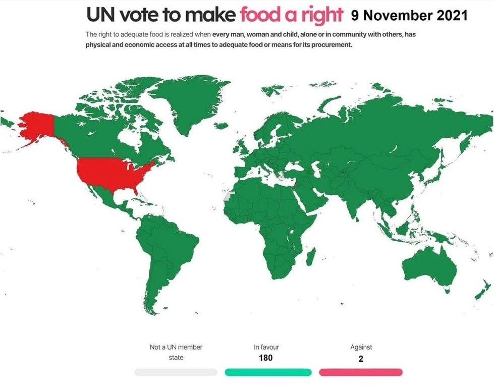

## The Fundamental Question

Earlier this week I made an observation on Substack about how much capitalism contributes to some of the problems in our life.1 This sparked a discussion with [Richard](https://cavemaneconomist.substack.com), who argued that these issues aren't capitalism's fault, and that capitalism actually improves the situation. I argued back that capitalism was indeed responsible for some of our problems because it had the power to withhold what we needed to survive from us if we didn’t work to make profit for others.

However, as our short comments back and forth to each other couldn't do justice to our fundamental disagreements I suggested we choose one core question and debate it properly. Richard responded proposing: **‘I'd like to debate your claim that the necessities of life are, or should be, human rights.’** I agree with him that this point is fundamental to both our worldviews, so it makes sense to start there.2 __ My hope is that this exchange of views is respectful even if our views are diametrically opposed that we can state our cases politely and reasonably.

Instead of becoming entangled in competing definitions of socialism or capitalism, I’d like to pose a simple question that cuts to the heart of this debate:

>  **‘Do you believe that people have a fundamental right (freedom) to access the resources they need to survive—food, water, shelter, healthcare—or should access to these necessities be determined by one's ability to pay for them?’**

This isn't merely theoretical. Right now, people are struggling to afford food and housing. People are rationing insulin. People are sleeping rough whilst empty houses stand as investments. This is the reality we must grapple with, not abstract economic theory.

## What I Mean by Rights

When I speak of rights to life's necessities, I'm not advocating for state-enforced legal protections or government-guaranteed entitlements. Rather, I'm speaking of something more fundamental: the inherent dignity and worth that every person possesses simply by virtue of being human and what is necessary to ensure that.

These aren't rights that need to be granted by parliaments or protected by police forces. They're the recognition that human beings have intrinsic value that transcends their economic productivity. They're about what we owe each other as fellow humans sharing this world.

A right to food doesn't require a bureaucracy, it requires a community that wouldn't let someone starve when there's abundance. A right to shelter doesn't need legislation, it needs people who understand that housing is for living in, not for accumulating wealth.

## The People-First Perspective

I believe human life and wellbeing have inherent value, of greater value than profit margins, property portfolios, or market efficiency. This isn't naive idealism, it's a practical recognition of what matters most.

As Immanuel Kant argued, we should ‘act in such a way that you treat humanity, whether in your own person or in the person of another, always at the same time as an end, never merely as a means to an end.’3 This principle suggests we should treat others with equal regard, regardless of whether we expect anything from them.

Consider this test of moral character: Should any child starve to death? A small child is the most helpless of all humans, completely dependent on others for survival. If there's ever a test of what should be done for those who can't do anything for themselves (or for us) this is it.

Yet over three million children under five die annually from starvation and malnutrition, whilst we produce far more food than humanity needs. This inexcusable tragedy continues because some find an acceptable number of child deaths tolerable in order to maintain control over resources, prices, or power.

Consider this personally: Imagine finding yourself without money but desperately needing food to avoid starving, or shelter to survive winter. What help would you hope would be available? Would you think ‘this must be my own fault, I deserve to starve’? Of course not.

Most of us would be grateful for charity, but charity might not come. However, if you could rely on a system where food and shelter were freely available, your survival wouldn't depend on chance, it would be certain. That's what I want for myself, and what I want for others too. As the old saying reminds us when considering others misfortunes, ‘There but for the grace of God go I.’

## Why Charity Isn't Enough

Some argue that private charity should meet these needs rather than it being guaranteed by some system. But this approach creates a deeply unequal power dynamic where the poor must hope for crumbs from the rich rather than having assured access to what they need to live.

Moreover, this wealth that the wealthy ‘charitably’ give away was created by workers in the first place. The factory owner's ‘charity’ comes from surplus value extracted from their workers’ labour. Rather than hoping the wealthy will kindly return a fraction of what they've taken, we could organise society so that wealth isn't concentrated in their hands to begin with.

History demonstrates that charity has never been sufficient. During the Great Depression, the Irish Famine, and countless other crises, private charity failed to prevent mass suffering whilst the wealthy remained comfortable.

## Beyond Economic Slavery

When basic needs are held hostage behind paywalls, most people must sell their labour to survive. This isn't liberty, this is economic coercion where both providers and recipients are forced into relationships they might not freely choose.

The current system uses the threat of starvation, homelessness, and death to coerce people into accepting exploitation. The ‘choice’ to work isn't truly free when the alternative is death. A genuinely free society would ensure everyone's basic needs are met first, allowing people to then choose how they want to contribute to their community.

This isn't just about individual hardship, it's about the systematic denial of basic human needs to maintain artificial scarcity and concentrated wealth. When we have enough empty homes to house everyone yet people sleep rough, when we produce surplus food yet children starve, we're not dealing with natural scarcity but with deliberate choices about how resources are distributed.

The moral test extends beyond children to all vulnerable people: Should anyone be hungry when there's more than enough food to feed them? Should anyone be homeless when there are enough empty homes to house them? These questions reveal our fundamental values about human worth.

## The Moral Choice Before Us

This debate ultimately comes down to fundamental assumptions about human worth and dignity. If someone honestly believes that our right to live should be based solely on our ability to pay, then we have a clear difference in our moral frameworks.

If money determines survival, then those who cannot work — whether due to disability, illness, age, or lack of available jobs — would seem to deserve to suffer or die. This includes children, the elderly, the severely disabled, and many others. Even for those who can work, their very survival is held hostage to whatever terms employers decide to offer.

Now we face greater insecurity than ever: too many people working overtime can barely afford rent, social housing is scarce, education creates decades of debt, and basic insurance is unaffordable. This isn't progress, it's a return to the precarity that previously led to major social upheavals or economic collapses.

## Two Visions of Society

This brings us to the heart of two fundamentally different visions:

 **The Capital-First Approach** treats necessities as commodities, meaning:

  * Basic survival becomes a privilege, not a right

  * Access is determined by market forces

  * Those who cannot pay may be left to suffer or die

  * Private property rights override human needs

  * Resources can be hoarded or destroyed to maintain prices

 **The People-First Approach** recognises that if food, water, shelter, and healthcare are necessities, then logically:

  * They cannot be commodities to be bought and sold

  * No one should be denied them due to inability to pay

  * Society must be organised to guarantee them to all

  * Resources must be managed collectively to ensure universal access

  * Human dignity cannot be subordinated to property rights

## The Stakes

Humanity has existed for roughly 200,000 years, whilst capitalism was only invented about three hundred years ago.4 People can live without capital, but capital doesn't exist without people. By every meaningful measure, people are superior to capital.

People are real and living, money is merely numbers in bank accounts. The choice before us is stark: Do we organise our society to meet human needs first, or do we continue prioritising accumulating capital at the expense of basic human welfare?

I argue that recognising the necessities of life as human rights isn't just morally correct, it's the foundation upon which any decent society must be built. The capitalist alternative is to accept that some people deserve to die simply because they cannot afford to live. That is an assumption I cannot and will not accept.

Subscribe

[Share](https://peacefulrevolutionary.substack.com/p/the-necessities-of-life-as-rights?utm_source=substack&utm_medium=email&utm_content=share&action=share)

1

2

Luckily the question I was asked was addressed in a [previous article](https://peacefulrevolutionary.substack.com/p/capitalism-vs-socialism), but for this debate I’ve changed it to be more clear and concise. I’ve also added some additional text from [another article](https://peacefulrevolutionary.substack.com/p/the-moral-question) too.

3

Kant, Immanuel, Groundwork of the Metaphysics of Morals, 1785, Translated by Ellington, James W. (3rd ed, 1993). p. 36. 4:429.

4

See [What Is Capitalism?](https://peacefulrevolutionary.substack.com/p/what-is-capitalism) for further information.
