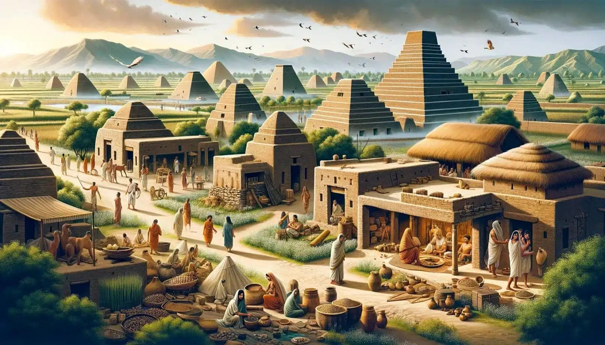
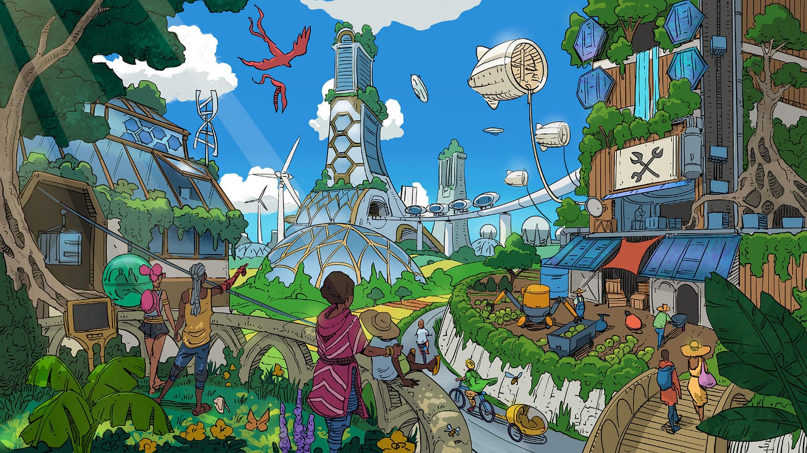

## When Food Was Free

The year is 2600 BC. You are a baby born into a family in Harappa, in the Indus Valley. You are well fed and cared for. Your existence isn't dependent on your parents finding paid work, earning money, and buying food. The community's granaries are shared amongst all residents. No one is forced to feed you, but they do so because you are part of their community, their greater family.

The year is 1200 AD. You are a baby born into a village in England. You are well fed and cared for. Your existence isn't dependent on your parents purchasing food from distant markets. The farm fields and common lands provide for everyone. No one is forced to feed you, but they do so because you belong to this place, these people.

The year is 1400 AD. You are a baby born into the Haudenosaunee (Iroquois) confederacy in what will one day be called North America. You are well fed and cared for. Your existence isn't dependent on your parents competing for wages in labour markets. The three sisters — corn, beans, and squash — are tended collectively and shared freely. No one is forced to feed you, but they do so because you are part of the longhouse, the clan, the people.

For roughly 190,000 of humanity's 200,000 years, this was simply how life worked. Food was shared because people understood their interdependence. Communities ensured everyone's survival not through legal obligation or market exchange, but through social bonds and mutual recognition of common humanity.

##  **Then Something Changed**

One day your food isn't guaranteed. Common lands are ‘enclosed’, stolen and claimed as private property. The next day it is under someone else's control. Shared granaries become privately owned warehouses. Feudal lands once farmed by those who worked them for generations, are sold from underneath them by Lords who never tilled the soil, often leaving entire families homeless and landless. Collective fields become individual holdings worked by people who can no longer afford to own land themselves.

Meanwhile, across the oceans, European colonisers are doing the same to invaded territories and indigenous peoples, claiming ancestral hunting grounds as ‘Crown land,’ destroying traditional food systems that had sustained communities for millennia, and forcing native peoples into wage labour or starvation. From the Americas to Africa to Asia, the same violent transformation: what was once freely shared becomes privately owned, what was once guaranteed by community becomes dependent on individual purchasing power.

People have to pay for what was once free. You have to work for someone else or be hungry and risk starvation. What was once a birthright — the simple expectation that your community would ensure you didn't starve — becomes a commodity to be bought and sold.

This transformation didn't happen overnight, and it didn't happen naturally. It required massive violence: the enclosure movements that drove peasants from their lands, the colonial projects that destroyed indigenous food systems, the creation of artificial scarcity where abundance once existed. For the first time in human history, people could starve amidst plenty not because of natural disaster, but because they couldn't afford to eat.

This is the world capitalists defend when he champions capitalism and ‘free’ markets. This is the world I challenge when I argue that access to life's necessities should be guaranteed to all.

## Where We Agree

In [my previous essay](https://peacefulrevolutionary.substack.com/p/the-necessities-of-life-as-rights), I opened a debate on whether ‘the necessities of life are, or should be, human rights’ by outlining my case for food being an essential need that we are all morally entitled to, without access to it being ‘determined by one's ability to pay’. I asserted that this is the basis of a just and fair society. So I was pleased to discover that Richard, who was debating with me, started [his opening remarks](https://peacefulrevolutionary.substack.com/p/the-necessities-of-life-as-rights/comment/129820282) by sharing remarkably similar sentiments to mine:

> ‘A just society is one in which no one is abandoned — but is also one in which help is given freely, not by force. True compassion respects both the dignity of the recipient and the liberty of the giver. I believe that we're morally obligated to care for those who can't care for themselves.’

From my perspective, this perfectly captures what an egalitarian society should look like. A society where help flows freely because people understand their interdependence, where both giving and receiving maintain everyone's dignity, where care emerges from genuine solidarity rather than legal obligation or economic coercion.

This is precisely what I'm advocating for: communities where people support each other because they recognise that individual wellbeing and collective wellbeing are inseparable, not because they're forced to by states or driven to by market pressures.

## What Gets In The Way

The tragedy is that in our modern world capitalism systematically undermines the very conditions that make such free, dignified mutual care possible.

This is a two-pronged problem — economic and political — and both prongs work together to prevent the flourishing of the genuine desire to ensure people receive the care they need that Richard and I both seem to value.

 **The Political Prong:** Like Richard, I believe that governments and civil laws work by the threat of force, and I'm not expecting a state to enforce human rights, something states have consistently failed to do throughout history. But I don't see ensuring human needs are met in terms of what a state enforces or doesn't enforce, nor do I believe we can rely on states to make such judgements or carry out that responsibility. States exist primarily to protect the interests of those who control economic resources, not to ensure everyone's basic needs are met. 

I also share Richard's scepticism about state enforcement. When he argues that ‘acknowledging moral responsibility does not mean endorsing government compulsion,’ he's absolutely right. I'm not advocating for governments to enforce human rights through taxation or welfare bureaucracies. Like Richard, I believe such systems work through the threat of force, and I find that morally objectionable. Then we move on to where Richard and me part ways –

 **The Economic Prong:** Capitalism creates artificial scarcity and competition for basic needs, forcing people to prioritise individual survival over collective wellbeing. When people must compete for housing, healthcare, education, and even food, the natural human tendency toward cooperation gets distorted into a struggle for individual advantage. People become too preoccupied with their own economic survival to engage in the free, dignified mutual care that healthy communities require.

However, our agreement ends when Richard suggests that rejecting state enforcement means we must rely on voluntary charity within capitalist markets. This presents a false choice between state coercion and capitalist ‘freedom’, ignoring the possibility of genuine social organisation based on mutual aid and voluntary association.

Richard worries that when ‘government becomes the caretaker of the poor, it becomes easy to say, “I gave at the office.”’ But what about when capitalism becomes the systematic creator of poverty? When the very system that concentrates wealth in few hands then expects those same hands to charitably return crumbs to those they've impoverished?

These two systems (capitalist markets and territorial states) reinforce each other in maintaining conditions that make genuine mutual aid nearly impossible on any significant scale, and Richard's faith in charitable capitalism fails to address this fundamental problem.

## The Charity Delusion

Richard argues that if taxes were eliminated, charitable individuals and organisations would step in to meet needs. But history demonstrates otherwise. During periods when such taxes didn't exist (the Industrial Revolution, the Great Depression, countless famines) private charity consistently failed to prevent mass suffering whilst the wealthy remained comfortable. In our day in which the personal fortunes of oligarchs are as great or greater than they ever were we are no closer to solving homelessness, which has been increasing despite a surplus of housing.

The problem is structural: charity reinforces the very inequalities it claims to address. The factory owner's ‘charity’ comes from surplus value extracted from workers' labour. The landlord's ‘generosity’ comes from rent extracted from tenants. Rather than hoping the wealthy will kindly return a fraction of what they've taken, why not organise society so that wealth isn't concentrated in their hands to begin with?

When over three million children under five die annually from starvation amidst food abundance, we see charity's fundamental failure. These deaths continue not because charitable people lack good intentions, but because the system that creates wealth concentration cannot reliably redistribute enough to meet basic needs, especially when doing so might threaten profit margins and property values.

## False Freedom

Richard concludes that ‘the solution to poverty is not less freedom, but more freedom.’ But what kind of freedom exists when people must sell their labour or face starvation? What freedom do tenants have when landlords can evict them for non-payment (especially after the rent is raised to more than they can pay)? What freedom exists for those who cannot afford healthcare, education, or housing?

This isn't freedom, it's economic coercion dressed up in the language of choice. The ‘freedom’ to work for subsistence wages isn't freedom when the alternative is death. True freedom requires that people's basic needs are secure first, allowing them to then choose how they want to contribute to their community.

Richard's ‘free society’ is one where people's survival depends on the whims of those who've accumulated wealth through exploitation. That's not freedom, that's feudalism with better marketing. That is slavery with extra steps.

The choice isn't between state welfare and capitalist charity. It's between systems that concentrate wealth and power in few hands (whether private capitalists or state bureaucrats) and systems that organise collectively to ensure everyone's needs are met through mutual aid and voluntary cooperation.

This isn't about forcing anyone to be charitable, it's about creating conditions where charity becomes unnecessary because communities naturally ensure everyone's wellbeing. It's about moving beyond both the violence of state enforcement and the violence of market coercion toward genuine social cooperation.

## When Food Will Be Free Again

Karl Schulschenk, CC BY-NC-ND 4.0

The year is 2090. You are a baby born into a community that has rediscovered what humanity knew for most of its existence, that humanity thrives through co-operation. You are well fed and cared for. Your existence isn't dependent on your parents finding employment, earning wages, or purchasing necessities from profit-driven corporations. The community gardens flourish, the tool libraries are well-stocked, the housing cooperatives provide shelter for all.

No one is forced to feed you, but they do so because you are part of their community, their chosen family. Your parents aren't stressed about rent payments or medical bills. They don't lie awake at night worrying about affording childcare or education. They don't sacrifice their health working multiple jobs just to survive.

Instead, they contribute their talents freely, one tends the vertical farms that feed the neighbourhood, the other teaches music to anyone who wants to learn. Their labour enriches the community because they choose how to contribute their skills, not because they're coerced by the threat of destitution.

You grow up knowing that your worth isn't measured by your economic productivity. You know that when you're sick, you'll be cared for. When you're old, you'll be respected and supported. When you want to learn, knowledge will be freely shared. When you want to create, resources will be available.

This isn't utopia, it's simply a return to the recognition that human wellbeing matters more than private profit, that communities thrive when everyone's basic needs are secure, that freedom means having genuine choices rather than choosing between exploitation and starvation.

This is the world we can build. This is what I'm arguing for when I say that access to life's necessities should be guaranteed to all.

 _In my next article I’ll address Richard's specific challenges to this vision and his response to my opening remarks._

Subscribe

[Share](https://peacefulrevolutionary.substack.com/p/from-abundance-to-artificial-scarcity?utm_source=substack&utm_medium=email&utm_content=share&action=share)
