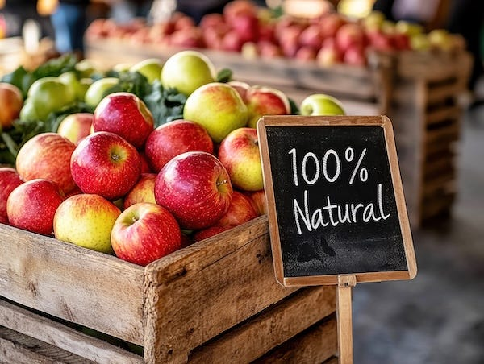
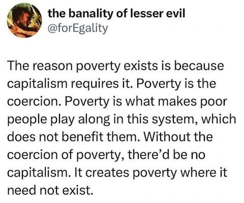
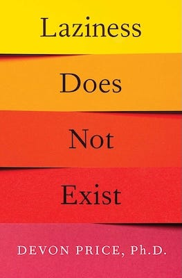

## When Communities Guaranteed Survival

Picture yourself in a village anywhere in the world, any time before the last few centuries. Your neighbour's house catches fire. Without hesitation, the community rushes in to help, not because there's a law requiring it, not because they expect payment, but because everyone understands that today it's your neighbour's house, tomorrow it could be yours.

A child in your community is orphaned. They don't starve. They don't become homeless. The community absorbs them, not through formal adoption agencies or government welfare, but through the simple recognition that children are everyone's responsibility.

An elderly person can no longer work the fields. They don't face destitution. Their lifetime of contribution to the community has earned them security in their old age, not through pension schemes or insurance policies, but through social bonds that make abandoning elders unthinkable.

This is how human societies guaranteed survival for most of our species' existence. Not through laws enforced by violence, not through market transactions, but through social understanding and mutual interdependence. Communities didn't need bureaucracies to ensure no one starved, they simply couldn't conceive of letting community members die when help was possible.

In my ongoing debate about ‘people having a fundamental right to access the resources they need to survive’, the person I’ve been debating (Richard) [challenged my views in his reply](https://substack.com/profile/4293838-richard-fulmer/note/c-130158649) to my article on _[The Necessities of Life as Rights](https://peacefulrevolutionary.substack.com/p/the-necessities-of-life-as-rights)_ by asking: who enforces these guarantees? I believe his question reveals a fundamental misunderstanding of how social organisation actually works when it's not distorted by artificial scarcity and hierarchical control.

It is a common assumption that people must be organised by either state coercion or market mechanisms. This presents a false choice. Throughout history, humans have organised collectively without either capitalised markets or centralised states. Indigenous communities, mutual aid networks, workers' cooperatives, and countless other examples demonstrate that people can guarantee each other's needs through voluntary association and mutual solidarity.

## How Guarantees Work Without Coercion

When I claim that ‘society must be organised to guarantee’ basic needs, I'm not referring to a bureaucratic apparatus with enforcement powers. I'm describing communities where people understand their interdependence and act accordingly, not from legal obligation, but from practical necessity and mutual care.

Consider how communities already guarantee certain things without state enforcement:

  * Community gardens guarantee shared access to growing space through collective agreements

  * Wikipedia contributors guarantee free access to knowledge through voluntary coordination

  * Open source software developers guarantee free access to their code through community norms and infrastructure, not legal mandates

These systems work because participants understand that their individual wellbeing depends on the collective good. They're sustained by social relationships, not violence.

## The Apple Seller Question

But what, Richard asks, happens if someone sells an apple under my proposed system? Which leads me to reply, ‘If everyone already has reliable access to food, why would someone need to sell an apple?’

His question assumes that people would still need to buy and sell basic necessities even when those needs are already met. But say someone did want to give an apple to a friend in exchange for something else, then that's just friends sharing with each other, not turning survival into a business.

The real problem isn't people occasionally trading things. It's a system where you can only eat, sleep, or get medical care if you can afford to pay for it. When everyone's basic needs are already covered, there's no pressure to turn everything into a transaction.

## Organisation Without Domination

The difference is consent. True organisation doesn't require domination, it requires coordination. In hierarchical systems, some people make decisions that others must follow regardless of their wishes. In non-hierarchal organisations, people coordinate because they recognise their mutual benefit from cooperation.

This isn't utopian thinking, it's how human societies functioned for most of our species' existence, where resources were shared according to need, not accumulated for profit. Communities ensured everyone's survival not through legal obligation or market exchange, but through social bonds and mutual recognition of common humanity.

Richard insists that rights must be enforced to be ‘real’, but this conflates legal rights with social relationships. The ‘right’ to food I describe isn't a legal entitlement, it's a social recognition that human beings need food to survive, and that communities function better when everyone's basic needs are met.

Consider the desire to be treated with basic courtesy. This isn't legally enforceable in most contexts, yet it functions effectively in countless social situations. People generally treat each other with basic respect not because they fear legal consequences, but because reciprocal courtesy makes social life more pleasant for everyone.

Similarly, the social understanding that people shouldn't starve amidst abundance doesn't require legal enforcement, it requires communities that recognise their interdependence.

Perhaps the confusion comes from my use of the word ‘rights’, which makes people think of governments and constitutions. But I'm not talking about laws that need enforcing. I'm talking about basic human needs that communities naturally respond to when they see them.

When someone is drowning, we don't need a law requiring us to throw them a rope. We do it because we recognise their humanity and our capacity to help. Similarly, when someone lacks food or shelter, our response shouldn't depend on legal frameworks but on our understanding that their wellbeing affects our own.

## The ‘Angels’ Misunderstanding

But aren’t unenforceable rights just ‘empty declarations’, and doesn’t my vision require a ‘population of angels’? 

The ‘angels’ argument fundamentally misunderstands both human nature and co-operative, collective and communal organisations. I'm not proposing that people become perfect or selfless. I'm arguing that current systems create artificial incentives for antisocial behaviour whilst punishing cooperation.

People aren't angels, but neither are they demons. We're social creatures whose behaviour responds to social conditions. Under capitalism, people are rewarded for accumulating wealth whilst others suffer. Under mutual aid systems, people are rewarded for contributing to collective wellbeing.

The question isn't whether people are angels, but which systems encourage our better impulses and which encourage our worse ones.

Rather than debating whether people are angels, let's examine actual evidence. Interdependent networks consistently demonstrate that people willingly share resources and support each other when doing so is practically beneficial:

  * During natural disasters, communities organise spontaneous aid more effectively than government or charity responses

  * Open source software development shows millions contributing to collective projects without monetary incentives

  * Community-supported agriculture connects producers and consumers through relationships based on benefit rather than profit

  * Housing cooperatives demonstrate that people can collectively manage shared resources without hierarchical control

These aren't examples of angelic behaviour, they're examples of practical cooperation that serves everyone's interests.

## The Real Coercion

Rather than asking who enforces resource sharing, we should ask: who enforces artificial scarcity? Currently, massive violence is required to maintain the system where some people lack basic necessities whilst others hoard abundance:

  * Police evict families from homes whilst properties sit empty as investments

  * Armed guards protect food supplies that got to waste whilst people starve

  * Private security enforces intellectual property rights on life-saving medicines

  * Military forces protect resource extraction that destroys communities

The status Massive coercion is required to maintain artificial scarcity. Sharing is natural, it's hoarding that requires violence to maintain.

The choice isn't between coercion and freedom, it's between systems that use violence to maintain inequality and systems that use cooperation to ensure everyone's needs are met.

Let's examine what each system requires:

 **Capitalism's Daily Coercion:**

  * Workers must sell their labour or face homelessness and starvation

  * Tenants must pay rent or face violent eviction

  * Patients must pay for healthcare or be denied treatment

  * Police enforce property laws that criminalise survival activities

 **Community ‘Coercion’:**

  * People might be expected to contribute to their community's wellbeing

  * Social disapproval for those who take without giving back

  * Possible exclusion from cooperative arrangements for persistently antisocial behaviour

The scale of violence required by each system isn't remotely comparable. Capitalism requires massive, institutionalised violence to maintain artificial scarcity. Community solidarity requires, at least, social consequences for antisocial behaviour.

## The Exit & Free Rider Questions

Presuming that I want to impose upon him a system like the one capitalism already imposes on us, Richard asks whether people will have the ‘right of exit’ in the society I envision. This question reveals several assumptions about how differently the world might organised from the current coercive one.

First, exit to where? Under capitalism, there's no exit from the system. Every habitable place on Earth is controlled by capitalist states that enforce property laws. You can't simply ‘leave’ capitalism because it's a global system that claims dominion over all land and resources. It is a hungry beast that must be fed constantly, but is never entirely satisfied.

In contrast, a world organised around collaborative networks wouldn't prevent people from forming alternative arrangements. If some people want to create markets amongst themselves, they're welcome to do so, as long as they don't prevent others from accessing the resources they need to survive.

Ever concerned for the success of these endeavours, Richard worries about ‘the most productive people’ leaving mutual aid communities. But, this question assumes capitalist definitions of productivity, that those who accumulate the most wealth are the most valuable to society.

Yet who are actually the most productive people? The cleaners who maintain sanitary conditions? The carers who look after children and elderly people? The farmers who grow food? The teachers who share knowledge? Under capitalism, these essential workers are typically paid least, whilst those who manipulate financial instruments or own property are rewarded most.

In communities focused on mutual aid, productivity is measured by contribution to collective wellbeing, not individual wealth accumulation. Those who contribute most to their community's thriving are precisely those most likely to stay, because they're valued and their work is meaningful.

So, how will cooperative communities handle those who ‘refuse to contribute’, Richard wonders. In healthy communities, people contribute because:

  * Their contributions are valued and appreciated

  * They see direct benefits from collective efforts

  * They have genuine choice about how to contribute their skills and interests

  * Their basic needs are secure regardless of their productivity level

For the small minority who persistently take without giving back, communities can use graduated social responses: conversation, peer pressure, reduced access to collective resources, and ultimately exclusion from cooperative arrangements. This isn't threatening death through starvation, it's social accountability.

However, most people naturally engage in labour. We're creative, social beings who want to contribute to our communities. What people resist is meaningless work, being forced to generate wealth for others under threat of destitution.

## The Real Choice

The choice isn't between Richard's ‘free’ capitalism and my ‘coercive’ cooperation. The choice is between:

  1. A system that uses violence to maintain artificial scarcity so that some people can accumulate wealth whilst others suffer

  2. A system that organises abundance to meet everyone's needs and allows people to contribute according to their abilities and interests

Richard has chosen a system that requires massive daily violence to maintain inequality. I've chosen a system that requires, at most, social accountability to maintain cooperation, but they won't face death from starvation or exposure.

Who really chooses coercion?

Rather than debating abstract scenarios, let's focus on building the world we want to live in. Every community garden, every housing cooperative, every tool library demonstrates that people can organise collectively to meet their needs without exploitation.

These aren't retreats from society, they're the seeds of a better society growing within the shell of the old one. As they prove more effective than capitalist alternatives, they'll naturally expand.

The question isn't whether people should be forced to participate in cooperation. The question is whether people should be forced to participate in capitalism, and increasingly, people are choosing otherwise.

## Returning to the Fundamental Question

This brings us back to the question I posed at the beginning of our debate: **‘Do you believe that people have a fundamental [natural] right to [freely] access the resources they need to survive—food, water, shelter, healthcare—or should access to these necessities be determined by one's ability to pay for them?’**

We both agree that no one should be abandoned, that we're morally obligated to care for those who can't care for themselves, and that help should be given freely rather than by force. Yet Richard defends a system that abandons millions daily, that makes survival contingent on economic productivity, and that requires massive violence to maintain artificial scarcity.

I've shown that guaranteeing basic needs doesn't require state coercion or perfect people, it requires communities that understand their interdependence. This isn't utopian dreaming, it's how humans lived for most of our history, and it's how we still organise when capitalism hasn't yet commodified every aspect of life.

The choice is clear: we can continue accepting a system where children starve amidst abundance because it's profitable to maintain scarcity, or we can build communities where everyone's basic needs are guaranteed because we recognise our shared humanity.

That children die of starvation is a tragedy. That this happens when there's surplus food is an injustice. That this continues because maintaining prices and profits matters more than human life is an evil we have the power to end.

The necessities of life aren't commodities to be bought and sold, they're the foundation upon which any decent society must be built.

Subscribe

[Share](https://peacefulrevolutionary.substack.com/p/neither-angels-nor-demons-cooperation?utm_source=substack&utm_medium=email&utm_content=share&action=share)
