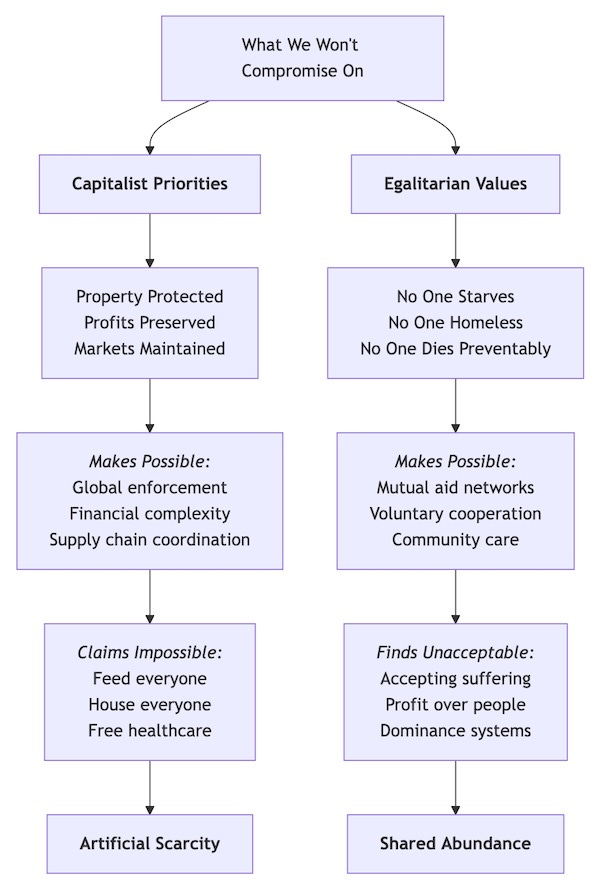
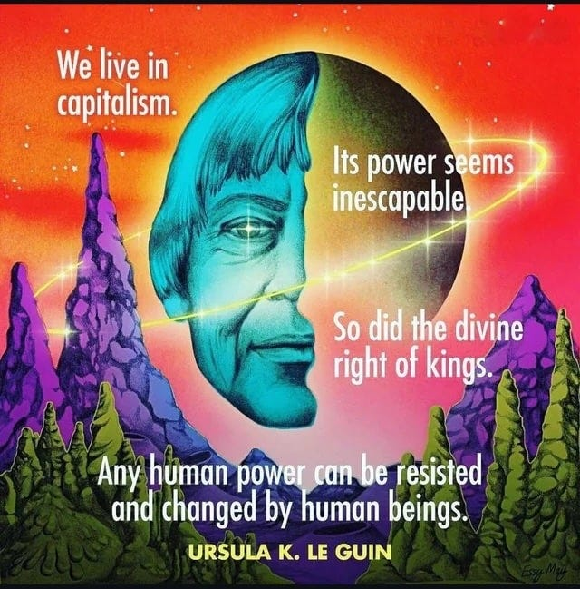

Should a child's access to food depend on their parents’ ability to pay for it? Should someone die from a treatable illness because they can't afford medicine? Should families sleep rough whilst houses stand empty as investments? These aren't abstract philosophical questions, they describe daily reality for millions of people living amidst abundance. I've been debating this subject for a few weeks now, and hope to answer these questions by trying cut through the economic complexities to address the moral stakes and human possibilities at the heart of these choices.

 _This debate began with[my argument](https://peacefulrevolutionary.substack.com/p/the-necessities-of-life-as-rights) that people have a fundamental right to access life's necessities regardless of their ability to pay, and positioning this as the necessary foundation for any moral society. In response, Pro-capitalist [Richard challenged me](https://peacefulrevolutionary.substack.com/p/the-necessities-of-life-as-rights/comment/129820282) by defending capitalism and voluntary charity, [further arguing that](https://substack.com/profile/4293838-richard-fulmer/note/c-130158649) state-enforced rights become coercion, and that free markets with private charity better serve human needs without violating individual liberty._

 _[I countered this](https://peacefulrevolutionary.substack.com/p/from-abundance-to-artificial-scarcity) by tracing how capitalism transformed freely shared resources into commodities that had to be paid for, creating artificial scarcity amidst abundance, [while demonstrating examples](https://peacefulrevolutionary.substack.com/p/neither-angels-nor-demons-cooperation) of communities that have guaranteed basic needs through voluntary cooperation without state coercion, through means such as mutual aid networks and open-source projects._

 _[Richard then responded](https://substack.com/@cavemaneconomist/note/c-131690666) to what he called my 'romantic' view of history, arguing that scarcity is natural, that capitalism creates rather than redistributes wealth, and claiming that my vision would lead to a dystopian collapse into authoritarianism. _

_Throughout this exchange, I've repeatedly returned to the core question: should everyone’s access to what is needed for survival depend on their purchasing power, especially when we have more than enough for everyone. While Richard has (in my opinion) defended current arrangements by explaining how capitalism works rather than addressing whether we should accept its outcomes._

 _This will be my closing argument in our exchange. We've reached a juncture in this debate in which we're starting to repeat past arguments and anyone else reading this (including me) is in danger of forgetting what the other side has already said. So, rather than continue rehashing previous points, I want to make one final case for why I believe the choice before us is both simpler and more profound than Richard's economic complexities suggest.1_

## What I'm Not Claiming   
(& What the Evidence Shows)

Let me be absolutely clear about what I'm not claiming, what the evidence actually shows, and why the question I believe is as fundamental as ever: do we organise society around human dignity or capital and ownership?

I'm not claiming the past was free from droughts, famines, diseases, or dangerous wild animals. If I were writing a comprehensive historical narrative, these realities would feature prominently. But I'm not writing history, I'm illustrating a principle about how communities organised access to resources in the past and could do so again.

Yes, civilisation did suffer from genuine scarcity in different times and places throughout the past: insufficient food production, limited medical knowledge, and harsh environmental conditions. But there's a crucial difference between scarcity caused by natural limitations and scarcity caused by artificial restrictions on abundance. When there is a surplus yet access is limited because of financial priorities, this becomes deliberate and artificial scarcity in order to maintain prices and power.

Over recent decades, researchers focusing on evidence (rather than preconceived notions) have discovered that early human communities were often far more sophisticated and egalitarian than previously assumed. Many of the negative patterns pro-capitalists associate with ‘human nature’, such as extreme hierarchy, systematic abandonment of vulnerable members, violent competition for resources, appear to primarily emerge alongside specific historical developments: the rise of patriarchal structures, monetary systems, and the methods of force used by self-appointed rulers.

This doesn't mean the past was utopian, but it does suggest that the brutal competition pro-capitalists consider inevitable is largely a recent historical development, not an eternal human condition. The question isn't whether people faced hardships, but whether communities abandoned members to face those hardships alone when help was possible.

Even today, with all our advances, we haven't eliminated droughts, diseases, or dangers. What we have done is develop technologies and knowledge that could address many basic needs, if we chose to organise society around meeting those needs rather than generating profit.

## The Power of Priorities: What We Make Possible

Here's something remarkable about human ingenuity: we've managed to create a global system that instantly tracks and protects the ownership of every piece of property on Earth, yet we're told by pro-capitalists that ensuring everyone has food is economically impossible.

A billionaire can own empty mansions in twelve countries whilst never visiting them; Complex legal frameworks spanning continents ensure their property rights are protected; Satellites monitor land boundaries; Digital systems track stock ownership to the microsecond; Courts, police, and military forces stand ready to enforce these claims with violence if necessary.

When the 2008 financial crisis hit, governments moved heaven and earth – trillions of dollars, emergency legislation, coordinated international action – to protect the property rights of banks that had crashed the economy. Within weeks, the ‘impossible’ became possible because protecting capital was non-negotiable.

 **What Capitalists Make Possible:**

  * Property rights protected even in war zones, with international law safeguarding foreign investment as cities burn.

  * Split-second financial transactions coordinating millions of trades per second across global markets.

  * Complex legal mechanisms allowing corporations to sue indigenous communities in international courts.

  * Sophisticated financial instruments and offshore systems that would confuse rocket scientists.

  * Global enforcement of intellectual property, prosecuting farmers for saving their own seeds.

  * Coordinated crisis response mobilising unlimited resources when banks need bailouts.

The capitalist response to ‘how?’ is always: ‘we'll find a way’. The capitalist response to protecting property is: ‘failure is not an option’. Likewise, when war is waged to protect corporate property and markets, no expense is spared despite the claim that meeting everyone's needs (for much less cost) is financially unrealistic.

 **What People Make Possible When Human Life Comes First:**

When people organise around different priorities, when human dignity becomes non-negotiable instead of property rights, we see equally impressive feats of coordination and resource mobilisation. The difference is that these efforts serve life rather than capital.

  * Mutual aid networks that outpace government disaster response (Hurricane Katrina).

  * Voluntary knowledge sharing creating Wikipedia and open-source technology.

  * Community resource coordination through gardens, tool libraries, and skill shares.

  * Revolutionary social transformations ending slavery, securing women's suffrage, and advancing civil rights.

The pattern is clear: **we achieve what we refuse to compromise on.** Propertarian capitalists refuse to compromise on property rights, creating systems that protect a billionaire's empty mansions whilst families sleep rough. Those who prioritise human dignity create systems where everyone's needs are met first.

 **What we refuse to compromise on shapes what becomes possible.** The difference isn't about what's technically possible, it's about what we're willing to accept as morally necessary.

## Progress: Capitalism or Science?

Pro-capitalists celebrate capitalism's role in reducing poverty and increasing production. But this confuses correlation with causation. The advances they credit to capitalism – improved medicine, increased food production, technological innovation – emerged from scientific discoveries and human inventiveness, not from profit motives.

Most fundamental research is publicly funded. The internet emerged from government and academic collaboration. Life-saving medicines typically build on decades of public research before pharmaceutical companies patent the final steps. Capitalism didn't create these advances, it capitalised on them, determining who benefits from collective human knowledge and effort.

Here's what changes everything: we now have surplus production of basic necessities. We produce enough food to feed 10 billion people but throw away 40% whilst children starve. We have more empty houses than homeless people. We possess the medical knowledge to treat most diseases that kill people in poor countries.

The question isn't whether we can produce enough, we already do. The question is whether we'll continue organising distribution based on people’s purchasing power even though this abundance makes this unnecessary.

## The Efficiency Illusion

Even if we judged systems purely on practical grounds rather than moral ones, capitalism fails its own efficiency test:

  * Workers kept sitting or standing for 8 hours when the job requires 4, simply to prevent them working for competitors.

  * Production processes where workers create a 100 units of value but receive 10 back in the form of wages, whilst shareholders claim 90% solely for owning shares.

  * Hundreds of slightly different versions of essentially identical products, each advertised as unique.

  * People trapped in jobs that damage their mental health because they can't afford to change.

  * Massive resources devoted to marketing, planned obsolescence, and financial manipulation rather than meeting needs.

But capitalism doesn't just waste resources, it requires poverty to function. The poor aren't an unfortunate byproduct, they're a necessary feature. Wealth concentration creates power differentials that the wealthy have every incentive to maintain. A precarious workforce accepts lower wages and worse conditions. Empty properties maintain artificial scarcity that inflates asset values. Unemployment keeps workers fearful and compliant.

This isn't efficiency, it's systematic waste disguised as productivity, with inequality built in as a feature, not a bug.

## What We Could Make Possible Instead

Imagine redirecting the resources currently devoted to protecting property rights toward meeting human needs.

Instead of complex financial derivatives, we could have sophisticated resource-sharing networks. Instead of global enforcement of intellectual property, we could have global coordination of knowledge sharing. Instead of marketing designed to create artificial desires, we could have systems that efficiently identify and meet real needs.

The same human ingenuity that created satellite-tracked stock portfolios could create systems ensuring no one lacks basic necessities. We don't lack capacity, we lack will.

## The Pattern of Deflection

Throughout this debate, I've noticed something revealing about pro-capitalist responses. Every time I pose the fundamental moral question about whether we should accept market-based distribution of survival necessities when abundance makes this unnecessary, pro-capitalists respond with explanations about how current systems work rather than addressing whether their outcomes are morally acceptable.

When I point to children dying from starvation amidst abundance, they blames ‘war-torn, authoritarian countries’ rather than addressing whether any child should starve when we have surplus food (and ignore that even those countries often have capitalist economies). When I ask about freedom from economic coercion, they call guaranteed necessities ‘magic’ and focus on the claim that this will compel others to provide services (most of which were provided freely long before even money existed). This same pattern of excuses appeared in past social changes:

 **Slavery:**

  *  **Abolitionists:** ‘Should humans own other humans?’

  *  **Defenders:** ‘But the economy depends on plantation agriculture, and they're naturally suited for this work…’

 **Women's suffrage:**

  *  **Suffragettes:** ‘Should women have equal political rights?’

  *  **Opponents:** ‘But women's natural sphere is domestic, and politics would corrupt their moral influence…’

 **Child labour:**

  *  **Reformers:** ‘Should children work in factories?’

  *  **Industrialists:** ‘But families need the income, and work teaches discipline…’

Pro-capitalists keep explaining why capitalism exists instead of addressing whether its outcomes are acceptable when we have other options. Rather than being a debate about economics, it's about whether we're willing to change systems that produce unnecessary suffering.

## The Question We Keep Avoiding

This brings us back to the fundamental question pro-capitalists seem loathe to directly answer: should access to survival necessities depend on ability to pay when we produce enough for everyone?

Pro-capitalists respond by reminding us about the complexity of markets, the progresses in efficiency, and the past reality of historical hardships. But these are distractions from a simple moral choice: do we organise society to meet human needs first, or to generate profit first?

Even if the past was harsh, even if people can be selfish, even if coordination is difficult, none of this justifies choosing to let children starve when we have an abundance of food. The real question isn't what's technically difficult, but what we're morally willing to accept.

## The Final Challenge

When pro-capitalists argue that guaranteeing basic needs is impossible, they’re not making a technical argument, they’re revealing their priorities.

If we can create global systems to protect empty properties, why can't we create global systems to ensure no one sleeps rough?

If we can coordinate trillion-dollar bank bailouts overnight, why can't we coordinate feeding programmes for hungry children?

If we can track stock ownership to the microsecond, why can't we track and meet basic human needs?

The answer isn't technical capacity. It's moral priority. **We make possible what we refuse to compromise on.**

 **What we refuse to compromise on shapes what becomes possible.** I refuse to compromise on children's right to food. Pro-capitalist propertarians refuse to compromise on property owners' right to exclude others from abundance.

We're not debating economics or history. We're debating whether human life has inherent value or only conditional value based on economic productivity. Everything else is just an elaborate avoidance of that fundamental choice.

It isn't about angels versus demons. It's about what we choose to treat as non-negotiable, and what miracles of human cooperation follow from that choice.

I don't want to settle for a world where we choose market efficiency over children's lives. The question remains: will pro-capitalists continue defending letting children starve to preserve capitalism, or will they join us in building the alternatives that prioritise human dignity, so we can build a better world together in which no-one goes hungry? 

Subscribe

[Share](https://peacefulrevolutionary.substack.com/p/the-changes-we-make-possible?utm_source=substack&utm_medium=email&utm_content=share&action=share)

## Debate Outline

  * My Opening - [The Necessities of Life as Rights](https://peacefulrevolutionary.substack.com/p/the-necessities-of-life-as-rights)

  * [Richard’s Opening](https://peacefulrevolutionary.substack.com/p/the-necessities-of-life-as-rights/comment/129820282)

  * My Response To Richard’s Opening - [From Abundance to Artificial Scarcity](https://peacefulrevolutionary.substack.com/p/from-abundance-to-artificial-scarcity)

  * [Richard’s Response To My Opening](https://substack.com/profile/4293838-richard-fulmer/note/c-130158649)

  * My Reply - [Neither Angels Nor Demons: Cooperation vs Coercion](https://peacefulrevolutionary.substack.com/p/neither-angels-nor-demons-cooperation)

  * [Richard’s Reply](https://substack.com/@cavemaneconomist/note/c-131690666) _(closing?)_

  * My Closing - [The Changes We Make Possible](https://open.substack.com/pub/peacefulrevolutionary/p/the-changes-we-make-possible) _(this article)_

 **Other Articles On This Subject -**

  * [The Moral Question](https://peacefulrevolutionary.substack.com/p/the-moral-question)

  * [Society And Shoulds](https://peacefulrevolutionary.substack.com/p/society-and-shoulds)

  * [The Myth Of Merit](https://peacefulrevolutionary.substack.com/p/the-myth-of-merit)

  * [Competition vs Co-operation](https://peacefulrevolutionary.substack.com/p/co-operation-vs-competition)

  * [How The World Became This Way](https://peacefulrevolutionary.substack.com/p/how-the-world-became-this-way)

  * [Entitled To Everything](https://peacefulrevolutionary.substack.com/p/universal-entitlement)

  * [Capitalism vs Socialism](https://peacefulrevolutionary.substack.com/p/capitalism-vs-socialism)

1

In trying to be careful not to criticise Richard personally hereafter I’ll refer to pro-capitalist arguments more broadly, rather than to him specifically.
