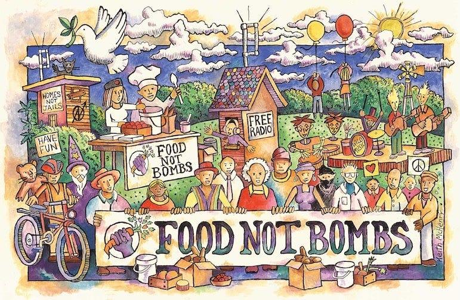
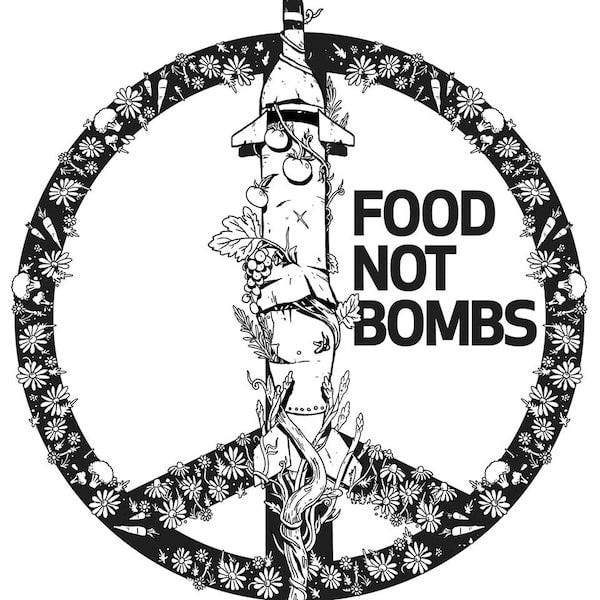

_When I recently brought up[ the idea that food should be free](https://peacefulrevolutionary.substack.com/p/the-necessities-of-life-as-rights), I found myself often clarifying and defending the idea in the comments sections, responding to objections and requests for more detail that never made it into the original articles. So I thought I'd now address some of the points I felt I didn't express clearly enough originally, in the hope that — even if people still disagree — the arguments I'm making will be clearer and less subject to misunderstanding._

 _Before I continue, I should clarify that this isn't a universally agreed upon idea among socialists or anarchists.1 However, even some of those who see it as an ideal believe it would require a major societal transition to make possible. So I realise my position isn't shared by everyone on the left, but it is an ideal I believe worth working toward._

## Food Was Never Meant to Be Sold

The first major point I’m making is that for most of human history food was not commodified, it was not sold, it was not put behind a paywall. Sometimes it was even shared freely at large scale over large regions for long periods, and this still continues in smaller communities today. _(See[Anarchist Societies](https://anarwiki.org/wiki/Anarchist_Societies) for some examples)_

For most of human history people didn't need to earn money to survive. Even under feudalism, peasants used to be shielded from competing in a market. Having to work for wages to buy food is actually a relatively recent historical development.

We went from common eating to family eating, and even then we had common kitchens, as they still do in some countries. As an example one inaccuracy in film portrayals of _A Christmas Carol_ is show Bob Cratchit's unnamed wife cooking the goose over a fire, when in reality it would have actually been the local baker doing that for her. I'm definitely not suggesting we go back to that, but it goes to show that individual kitchens were a relatively more modern invention.

For many societies it has always been this way, apart from times of unexpectedly harsh weather, storms or droughts destroying crops. But everybody shared food, and if there wasn't enough people went hungry together. No one was left to starve alone whilst others hoarded plenty.

## How Food Became a Weapon

We've had food storehouses a long time, but at some point someone said, ‘I'm the master and this belongs to me and you need to do my bidding to get access to some of it, and I'd rather let some of it go to waste than lessen my power or devalue the goods I'm holding.’ _(See[How The World Became This Way](https://peacefulrevolutionary.substack.com/p/how-the-world-became-this-way))_

Under capitalism we just have multiple people in the role of masters. When my father was a boy, employers were still sometimes referred to as masters unironically. If we go back to my grandparents' day, workers were still sometimes referred to as servants. The relationship hasn't changed, only the public relations has.

This creates an abusive relationship: ‘Do what I say, conform, work for me or you don't eat.’ We don't abuse children in this way, we feed them, we don't think of them as freeloaders. This situation of children being fed by their parents is now often continuing into children's twenties and thirties, as rising housing costs has led to them being unable to afford their own home. 

But, don't children without parents deserve food too? And what about severely disabled people, or those who simply can't find work that pays enough to live on? Why does the child of a rich parent deserve food more than the child of an orphan? In both cases the child has done nothing wrong or right, has earnt nothing, owes nothing, and is in desperate need of food. Must they go to the rich with a begging bowl for their sustenance? _(See[The Myth Of Merit](https://peacefulrevolutionary.substack.com/p/the-myth-of-merit))_

## Debunking the Myths

### ‘We Don't Have Enough’

The second major point I’m making is that we do produce more than enough food for everyone in the world now. It is possible to feed everyone, and capitalism is what gets in the way of that to maintain privatised ownership, prices and profits from food production. The choice isn't just capitalism (with starvation for some) or primitivism with starvation for many. We have the science, the resources, and the ability to do better than either of these scenarios.

### ‘The Jobs Market Will Save Us’

The magical jobs market fairy that supplies jobs sufficient to meet needs to everybody ends up becoming a religious argument, one based on a supernatural invisible hand capable of meeting all of our needs. As I've mentioned before, Marxist Leninists believe the idea that only those who work should eat as a matter of faith, adopted from Pauline Christians, but in practice so have many anarchists such as the Revolutionary Catalans.

But no invisible hand guarantees enough jobs for everyone, and many jobs now don't guarantee enough money to keep people from being hungry. This makes those who can't work seem like a burden, turns them into beggars, and demonises the hungry.

### ‘Charity Will Fix It’

Charity being the solution to the problem of hunger is an idea that is often brought up. I'm always surprised to find some people take this seriously. As if the richest people in history who aren't doing it now will do it for some reason if they just didn't have to pay taxes. The Scrooge principle doesn't work in practice, not at least unless the spirits of the dead turn up at threaten the wealthy.

Even the Romans understood bread and circuses. Those billionaires who capitalists say are poised to be charitable any day now could make today that day and put off the hungry mob headed for their doors, but they don’t seem to show any intention of doing so. 

### ‘No One Will Work’

But people work without pay or without having to work to get food right now. They do so in families, communes, and collectives. The rich who don’t need to work to afford to eat do so too, without needing starvation as a motivation.

There are incentives to work besides hunger, and if all else fails there is the power of social pressures — the desire for inclusion, recognition, purpose and pride. Countries with social welfare still have people working, and people still do difficult and dirty work. _(See[Who Will Do The Dirty Jobs?](https://peacefulrevolutionary.substack.com/about#§solutions-series))_

I live in a country in which healthcare is free at the point of service, in 32 of the 33 developed countries this is the case (and in many ‘undeveloped’ countries too). I lived in a city in America where public transport was free, as is the case in several European cities already. There are of course resource and manpower costs that come with these, but in the end the benefits were considered to be greater.

### ‘Free Food Forces Others to Work for You’

Others are already working for us to produce this food, often poorly paid precarious workers. There were farmers before there was money. There were farmers before there was barter and trade too. We are largely disconnected now from the whole food production process. The difference is that currently these workers are exploited by capitalists who extract profit from their labour, rather than working as part of a community where everyone's needs are met.2

I'm well aware you can't just turn over land to people and expect them to become farmers, as it takes a lot of training and skill. There are bad and good examples of farm land being better distributed. The bad examples result in famine, the good examples in better food security. However, we are currently seeing a lot of farmers losing their farms, only to be bought up for industrial farming corporations, and are at risk at loosing of their expertise. 

Large industrial farming is greatly reliant on cheap seasonal labour, often from overseas. We are subsidising farmers already at taxpayer expense. Smaller farmers are already used to working as part of co-operatives: grain co-operatives, market co-operatives. If communities could step in to help and support their work, to help meet their other needs, to share in the produce then many of these farms could be kept operating, and some food co-operatives are already doing this. The infrastructure for collective food production already exists in many places, we just need to expand it and remove the profit motive.

## Feeding Everyone as Family

Feeding everyone treats people as family. People all lived this way once. Many communities still live this way. Communes and tribes live this way still. Some of those communes are five hundred years old and the tribes thousands of years old, far older than capitalism has been around.

Making food free takes the most essential of needs out of the hands of those who own and hoard that food, takes it out of their control, and takes away their power. This is a power issue as much as it is a morality issue. When people don't have to worry about their next meal, they have genuine freedom to choose what kind of work they want to do **.** Not everyone will suddenly become poets, but it doesn’t mean starving poets may no longer be a common stereotype. ****

To those pro-capitalists who believe in welfare, this skips a step of unnecessary complication and expense. Making food free gives us choices and benefits, choices over the kind of work possible for us, and one less major worry, ridding the world of all that anxiety about where their next meal is coming from. There are enough other worries in life, but this addresses one of the most fundamental.

## Revolutionary Action

As a revolutionary action, if we are eager to seize the means of production, this is the most important one to start with. Alternatively, if we want to build a better system in the shell of the existing one, then this is the most important step for independence from capital and the state.

So how would this be implemented? Well, without writing a long article on property (which I've already done3) and one on expropriation (which I have yet to finish) ...

There are already examples of communities putting these ideas into practice, such as the community farms I’ve already mentioned. Take Marinaleda in Andalusia for example, a village that has been experimenting with collective food production for over 40 years.4 After decades of struggle, land occupations, and hunger strikes, they won control of local agricultural land and now run it as a workers' cooperative. 

The village now provides three free school meals a day, has virtually eliminated unemployment, and during the 2008 crisis, their mayor famously led ‘expropriations’ from supermarkets to stock local food banks. It's not perfect anarchist practice (they still operate within the Spanish state system) but it shows what's possible when communities prioritise feeding people over profit.

Similar prefigurative approaches are spreading, from community gardens and food forests, to mutual aid networks and collective kitchens that already operate in many cities. These aren't just charity, they're rehearsals for a world where food security is guaranteed to all.

For those thinking bigger, there are transitional strategies: community land trusts, agricultural cooperatives, and municipal food programmes that could be expanded. Many cities already provide free school meals; some have free public transport. The infrastructure and precedents exist, we just need the will and people to extend them.

And for the revolutionarily minded? Every community kitchen, every occupied garden, every action that takes food out of the market and puts it in people's hands is a small victory. These aren't just reforms, they're exercises in building the new world within the shell of the old.5

Subscribe

[Share](https://peacefulrevolutionary.substack.com/p/food-for-free?utm_source=substack&utm_medium=email&utm_content=share&action=share)

 _See[the previous articles in this series](https://peacefulrevolutionary.substack.com/about#§entitlement-series)_

1

Although the concept of producing for need instead of profit is fundamental to communism — it is implied at in the ‘commune’ part of the word, and is called ‘decommodification’ or ‘demarketisation’ in socialism. There really needs to be a better word in English for this though perhaps ‘Usonomics’ (use + economics) or ‘Commonomics’ (common + economics).

2

‘The real slavery is the current system where basic needs are held hostage, most people must sell their labour to survive, both providers and recipients are coerced. True freedom means removing these artificial constraints so people can both give and receive freely based on ability and need.’ ~ [Addressing the ‘Forced Labour’ Myth](https://peacefulrevolutionary.substack.com/i/156456016/slaves-to-freedom-addressing-the-forced-labour-myth)

3

See [Property Rights?](https://peacefulrevolutionary.substack.com/p/property-rights-and-wrongs) & [Property Wrongs?](https://peacefulrevolutionary.substack.com/p/property-wrongs)

4

<https://anarwiki.org/wiki/Marinaleda>

5

For more ideas on preparing and prefiguring for revolution see [Resisting Oppression And Making Friends](https://peacefulrevolutionary.substack.com/p/resisting-oppression-and-making-friends)
