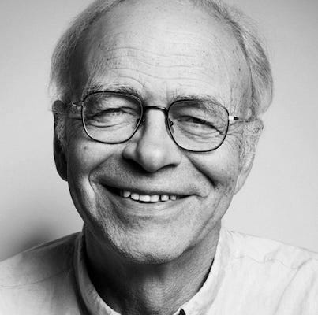
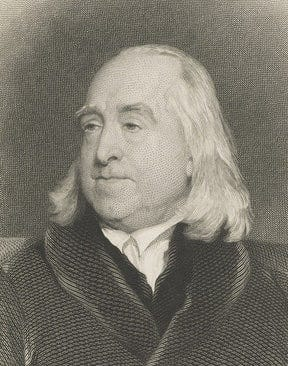
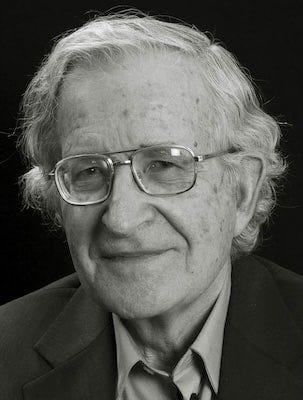
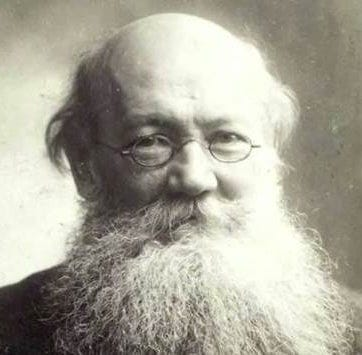
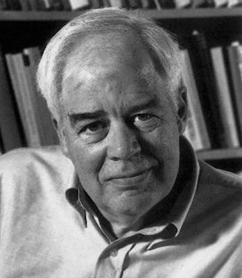
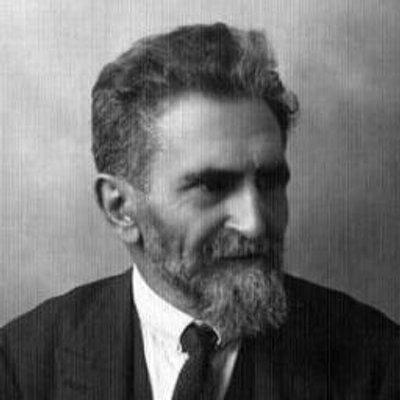
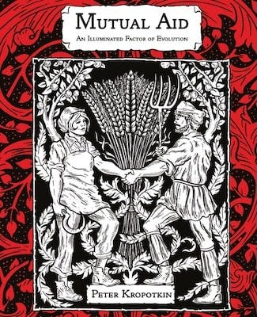

  * Why do people make a moral decision to help others in emergencies?

  * What leads people to act with moral courage - even when it doesn’t benefit them?

## Peter Singer’s Challenge

One of the more challenging moral dilemmas of the last few decades is the theoretical case of saving a drowning child most famously illustrated by Peter Singer in a lecture he gave to his students:

> ‘To challenge my students to think about the ethics of what we owe to people in need, I ask them to imagine that their route to the university takes them past a shallow pond. One morning, I say to them, you notice a child has fallen in and appears to be drowning. To wade in and pull the child out would be easy but it will mean that you get your clothes wet and muddy, and by the time you go home and change you will have missed your first class. 
> 
> I then ask the students: do you have any obligation to rescue the child? Unanimously, the students say they do. The importance of saving a child so far outweighs the cost of getting one’s clothes muddy and missing a class, that they refuse to consider it any kind of excuse for not saving the child. … 
> 
> Once we are all clear about our obligations to rescue the drowning child in front of us, I ask: would it make any difference if the child were far away, in another country perhaps, but similarly in danger of death, and equally within your means to save, at no great cost – and absolutely no danger – to yourself? Virtually all agree that distance and nationality make no moral difference to the situation. 
> 
> I then point out that we are all in that situation of the person passing the shallow pond: we can all save lives of people, both children and adults, who would otherwise die, and we can do so at a very small cost to us: the cost of … a shirt or a night out at a restaurant or concert, can mean the difference between life and death to more than one person somewhere in the world – and overseas aid agencies like Oxfam overcome the problem of acting at a distance.’1

Peter Singer

Here Singer demonstrates that if we accept our clear moral duty to save a drowning child right in front of us – regardless of muddy clothes or missed lectures – then we must logically accept an equal duty to save distant children through charitable giving, since geography and nationality are morally irrelevant distinctions. The cost is identical (a few $/£) and the outcome is identical (a saved life), yet most people readily accept the first obligation whilst ignoring the second.

However, some have questioned whether this is really the whole story, whether we can be personally responsible for the child we don't see, or indeed all the drowning children throughout the world.

## Mengzi & Bentham’s Perspectives

This moral conundrum is not a modern one. In fact the earliest mention of it goes back to Mengzi (aka Mencius) who was a prominent Chinese philosopher who lived during the Warring States period (c. 372–289 BCE). He is considered one of the most important figures in Confucianism, second only to Confucius himself. Among the many questions he mused upon was that of whether people were naturally inclined to compassion:

> ‘The reason why I say that humans all have hearts that are not unfeeling toward others is this. Suppose someone suddenly saw a child about to fall into a well: everyone in such a situation would have a feeling of alarm and compassion - not because one sought to get in good with the child's parents, not because one wanted fame among their neighbours and friends, and not because one would dislike the sound of the child's cries.’2

Mengzi believed in the inherent goodness of human nature and took it for granted that everyone has compassion because, ‘humans all have hearts that are not unfeeling toward others‘. However, he didn’t talk about how those humans might try to help the child in this situation, perhaps because he takes it for granted that they would. Yet that part of the story is precisely what philosopher Jeremy Bentham focused on two-thousand years later in a similar scenario:

> ‘A woman’s head-dress catches fire: water is at hand: a man, instead of assisting to quench the fire, looks on, and laughs at it. A drunken man, falling with his face downwards into a puddle, is in danger of suffocation: lifting his head a little on one side would save him: another man sees this, and lets him lie. A quantity of gunpowder lies scattered about a room: a man is going into it with a lighted candle: another, knowing this, lets him go in without warning. Who is there that in any of these cases would think punishment misapplied?’3

Bentham was the founder of modern Utilitarianism, and emphasised the maximisation of happiness and minimisation of suffering. However, unlike Mengzi he was more interested in the consequences of actions rather than the inherent moral qualities of individuals, so in this example focused on the worst examples of humanity when speaking about their responsibility to help others.

Jeremy Bentham

In common with Singer's drowning child this is about immediate, visible suffering that could be easily alleviated at minimal inconvenience to the observer. Yet while Mengzi assumes universal compassion as a natural human response, Bentham's examples suggest he viewed callous indifference as common enough to warrant legal punishment. The men in Bentham's scenarios – laughing at a woman's burning hair, ignoring a drowning drunk, failing to warn about gunpowder – represent behaviour that society must actively discourage.

Unlike Mengzi's confidence in inherent goodness, Bentham saw humans as fundamentally self-interested beings who required external incentives to act morally. His utilitarian framework emerged precisely because he believed people couldn't be trusted to do good spontaneously, they needed clear consequences that made helping others serve their own interests.

As negative as his view of humanity may seem when compared to Mengzi, it was a more positive view than the then popular Calvanist concept of humanity being inherently evil. Bentham believe human nature rather than being inevitably selfish, allowed for improvement. He argued that there was a moral standard to which we were accountable, and that we were culpable for failing to help when we can.

So, whereas Mengzi saw compassion as automatic, Bentham saw it as something that had to be cultivated and enforced through social mechanisms.

But are most people as callous as the those who failed to help even when not doing so might be fatal as in Bentham’s story, or was he illustrating his point by using the worst examples of humanity, the sociopaths who care only for themselves or psychopaths who even delight in others suffering?

## Chomsky’s Ice Cream

Political philosopher Noam Chomsky gives us another story which he believes gives a more typical reaction to such a moral dilemma as those we’ve looked at so far:

> ‘Imagine it's one of those boiling hot Summer days. You look out your window and see a child walking down the street enjoying an ice cream cone. As you watch, you notice a ‘big guy’ come along. 
> 
> He sees the kid, sees the ice cream, and suddenly grabs the cone, swats the kid aside, and walks off happily eating his stolen dessert. Chomsky would then ask the cynic: ‘Do you think to yourself, there goes a perfectly normal and natural example of human behaviour.’ 
> 
> Predictably, the answer is almost always ‘No, of course not.’ Upon witnessing that series of events most people would think that guy is a raging psychopath, his behaviour transparently reprehensible. Many onlookers would then go console the kid, and probably get them another ice cream. 
> 
> The point of that story is this: If the cynic truly believed that human beings were inherently violent and selfish, someone taking candy from a baby wouldn't bother them. But of course the majority of people are rightly horrified.’4

To Chomsky the moral outrage toward the thief of a child’s ice cream comes naturally and reliably enough that it disproves the idea that humans are naturally selfish.

Noam Chomsky

In this example no-one's life is in peril, but if people react so morally in the case of something which just upsets a child, one imagines that they would act all the more decisively when a child's life is threatened. This doesn't tell us however what drives different people to act morally. Whether it's reasoned ethics, natural instinct, social conditioning, or something else entirely. It's one thing to feel moral outrage at witnessing injustice, but quite another to understand what compels us to actually intervene when someone desperately needs our help.

## Kropotkin's Fourth Man

Rather than focusing on whether humans are naturally good or selfish, Peter Kropotkin — the Russian political philosopher and evolutionary biologist5 – was more interested in examining the different motivations that might drive moral action, and crucially, which of these motivations we should actually consider genuinely moral.

Peter Kropotkin

We’ve looked at four different approaches to people in peril. Singer’s example in which someone reasons that helping is the right thing to do, Mengzi’s in which helping is instinctive, and Bentham’s in which (for some people) assisting those in need seems to be optional, especially when there aren’t incentives to do so.

Reconciling these seeming contradictions, eight decades before Singer gave his version, Kropotkin, took a different approach to this question:

> A child is drowning, and four men who stand upon the bank see it struggling in the water, One of them does not stir, he is a partisan of ‘Each one for himself,’ the maxim of the commercial middle-class; this one is a brute and we need not speak of him further. _[Because he presumably does not help the child at all]_
> 
> The next one reasons thus: ‘If I save the child, a good report of my action will be made to the ruler of heaven, and the Creator will reward me by increasing my flocks and my serfs,’ and thereupon he plunges into the water. Is he therefore a moral man? Clearly not! He is a shrewd calculator, that is all. 
> 
> The third, who is an utilitarian, reflects thus (or at least utilitarian philosophers _[like Bentham]_ represent him as so reasoning): ‘Pleasures can be classed in two categories, inferior pleasures and higher ones. To save the life of anyone is a superior pleasure infinitely more intense and more durable than others; therefore I will save the child.’ Admitting that any man ever reasoned thus, would he not be a terrible egotist? And, moreover, could we ever be sure that his sophistical brain would not at some given moment cause his will to incline towards an inferior pleasure, that is to say, towards refraining from troubling himself? 
> 
> There remains the fourth individual. This man has been brought up from his childhood to feel himself one with the rest of humanity: from his childhood he has always regarded men as possessing interests in common: he has accustomed himself to suffer when his neighbours suffer, and to feel happy when everyone around him is happy. Directly he hears the heart-rending cry of the mother, he leaps into the water, not through reflection but by instinct, and when she thanks him for saving her child, he says, ‘What have I done to deserve thanks, my good woman? I am happy to see you happy; I have acted from natural impulse and could not do otherwise!’6

Kropotkin knew better than most the character of the different kinds of people that populate the world. He was born into privilege, he’d been a prince who rejected his title and its comforts, he was a contrarian biologist whose conclusion that co-operation was an essential factor in evolution were later vindicated, and he is best known today as a well known Anarchist, who advocated for the poor and disenfranchised, and popularised his concept of Mutual Aid.

His examples of the four different kinds of men and their motivations covers the different ways philosophers approach this scenario, from focusing on self-interest to morality and what might motivate each of these.

In Kropotkin’s view the fourth man is the most moral, but unlike Mengzi’s example he is not just acting on his natural morality, unlike Bentham’s he isn’t moral for fear of the consequences of not being so, and unlike Singer’s dilemma he doesn’t reason himself into his moral response. Instead, whatever his natural inclination is, his morality is reinforced by virtue of his upbringing and the close emotional bonds he has with others, which have helped develop his moral habits and reactions.

It is one thing to feel sympathy, it is another to have the courage to act on it. Without such courage the sympathy people feel might be ineffective, they might get intimidated or overwhelmed, hesitate and not save the child. Such moral courage is strongest when it has been put into practice.

This says something very interesting about the concept of human nature: that whatever way it might incline us, our upbringing and community can have a profound influence on how we react, until doing so becomes our ‘natural impulse’.

Yet the community Kropotkin’s fourth man belongs to doesn’t teach by reprimands, and he isn’t acting out of fear, or that someone in a position of hierarchy will punish him. When he helps others he isn’t doing so out of hope of reward, or to satisfy his ego, but out of a developed and practiced empathy.

Kropotkin believed that if you are ‘brought up from … childhood to feel one with the rest of humanity’ within a close community, then you will ‘accustom’ yourself to seeing others ‘as possessing interests in common’ because you will ‘suffer when’ your ‘neighbours suffer’ and ‘feel happy when everyone around’ you ‘is happy’.

It is because sadness and happiness were often shared experiences among others who have cared for you, that you are inclined to care for others too. So when you see another in danger you will act morally 'by instinct', because it is already a practiced mental and emotional habit, and doing 'otherwise' becomes unusual.

For Kropotkin, this fourth man represents something fundamentally different from all the moral systems that came before:

> You recognize in this case the truly moral man, and feel that the others are only egotists in comparison with him. The whole anarchist morality is represented in this example. It is the morality of a people which does not look for the sun at midnight – a morality without compulsion or authority, a morality of habit. Let us create circumstances in which man shall not be led to deceive nor exploit others, and then by the very force of things the moral level of humanity will rise to a height hitherto unknown. 
> 
> Men are certainly not to be moralised by teaching them a moral catechism: tribunals and prisons do not diminish vice; they pour it over society in floods. Men are to be moralized only by placing them in a position which shall contribute to develop in them those habits which are social, and to weaken those which are not so. A morality which has become instinctive is the true morality, the only morality which endures while religions and systems of philosophy pass away.

What makes Kropotkin's vision so compelling – and so radical – is that it sidesteps the fundamental problems that plague other moral systems. Religious morality relies on external authority and the promise of divine reward or punishment, making it essentially transactional. Utilitarian calculations can be endlessly manipulated by clever reasoning and self-serving logic. Even well-intentioned moral rules can become rigid dogma that fails when circumstances change.

But Kropotkin's ‘morality of habit’ works differently. It doesn't depend on priests, philosophers, or policemen to enforce it. It doesn't require complex ethical calculations or fear of consequences. Instead, it grows organically from lived experience within caring communities where people's wellbeing is genuinely interconnected.

This is why Kropotkin argues that real moral progress comes not from better sermons or harsher punishments, but from changing the social conditions that shape how we relate to one another. When people grow up in environments based on mutual aid rather than competition, and cooperation rather than exploitation, their moral responses become as natural as breathing. They don't need to be told to help others – they can't imagine doing otherwise.

It is a vision of morality that trusts ordinary people rather than moral authorities, that sees goodness as something we cultivate together rather than impose from above. And it suggests that a truly free society – one without rulers or rigid hierarchies – wouldn't descend into chaos, but would purposefully foster the kind of moral behaviour that authoritarians can only dream of achieving through force.

To Kropotkin morality isn’t just individual – it is social. People often believe this idea when criticising a foreign culture, blaming their culture on their problems. Yet these same people baulk at holding their own society responsible for peoples problem in their own country, somehow without seeing the contradiction.

For Kropotkin there is no form of altruism that is more effective than helping someone else in need, but this process should be taught and learnt through associating with others who hold to these values and try to embody them. Yet he is also aware – as can be seen in his more extensive writings on the subject – that hierarchal systems can create these problems and confuse the incentives, priorities and methods through which people can help.

## Richard Rorty’s Sentimental Education

Kropotkin's insights about morality as habit found an unlikely echo more than a century later in the work of American philosopher Richard Rorty. Writing in the late 20th century, Rorty similarly rejected the idea that morality comes from universal principles or divine commands, instead arguing that it develops through learnt social practices that expand outward from our immediate circle to encompass wider communities.

Richard Rorty

Like Kropotkin's fourth man who ‘suffers when his neighbours suffer’ and feels ‘happy when everyone around him is happy’, Rorty believed that moral progress happens not through rational argument but through what he termed ‘sentimental education’.7 That is, teaching people to extend their empathy beyond their immediate tribe. As Rorty put it, ‘the emergence of the human rights culture seems to owe nothing to increased moral knowledge, and everything to hearing sad and sentimental stories’.8

Rorty's approach to human rights exemplifies this thinking. Rather than trying to prove rationally that all humans deserve dignity, he argued that we should focus on cultivating emotional responses that make it harder to see others as less than human. Throughout history, he observed, societies have found ways to classify certain groups as subhuman precisely to justify treating them badly. The antidote isn't better philosophy but better feelings - expanding our circle of concern through stories, experiences, and relationships that help us recognise our shared humanity.

This connects powerfully with Kropotkin's vision, though from a different angle. Where Kropotkin focused on how caring communities naturally produce moral people, Rorty explored how we might deliberately cultivate the empathy and solidarity that such communities require. Both recognised that lasting moral change comes not from preaching or punishment, but from reshaping the emotional and social habits that guide our daily interactions.

Modern research supports both thinkers' emphasis on the learned nature of moral response. Studies have shown that empathy – once thought to be an inborn trait – can actually be taught and developed, even in professional contexts like healthcare.9 This suggests that the kind of moral transformation both Kropotkin and Rorty envisioned isn't just idealistic dreaming, but a practical possibility grounded in how human psychology actually works.

## Malatesta’s Practical Caveat

However, both Kropotkin and Rorty's optimistic visions face an important challenge: What about those who have the ideal upbringing and environment, but still act immorally? If there is one deficit in Kropotkin’s approach is that it doesn’t account for the sociopaths of Bentham’s example. He doesn't fully account for individuals who, despite good community upbringing and positive experiences, still exhibit antisocial traits. 

While research shows that both genetic and environmental factors contribute to antisocial behaviour, with some individuals having genetic predispositions that environmental factors can either mitigate or exacerbate, Kropotkin's framework focuses primarily on how good conditions naturally produce good people.

This was one area where his contemporary and friend Errico Malatesta, gently disagreed with him. Malatesta worried about Kropotkin's ‘excessive optimism’, his belief that nature provided ‘harmony in all things, including human societies.’10 While Malatesta shared Kropotkin's anarchist vision, he suggested we should be more realistic about human complexity and the potential for conflict, even under ideal conditions.

Errico Malatesta

The fact is that we should both create the best conditions to bring out the best human behaviours, and also account for the worst potential traits in humanity too, and account for and plan to deal with their existence, because they are always likely to occur, even if rarer under better conditions.

## From Theory to Reality

These philosophical examples might seem abstract, but what happens in reality when people are confronted with a drowning child or similar life-threatening emergency?

Popular historian Rutger Bregman, author of _Humankind: A Hopeful History_11, has chronicled countless cases of people acting in helpful and cooperative ways when faced with difficult circumstances and witnessing others' needs. His research reveals a pattern that would have delighted Kropotkin: when people see genuine distress, they typically respond with immediate, instinctive help.

A striking example occurred in Bregman's native Netherlands, captured on video and shared widely on social media. Four men spotted a car sinking into an Amsterdam canal with a mother and child trapped inside. Without hesitation, they jumped into the water and rescued both victims within two minutes. When later asked if he felt like a hero, one rescuer simply replied: ‘Nah, you've got to look out for each other in life.’12

This wasn't an isolated incident. Research shows that when emergencies are life-threatening (somebody drowning or being attacked) and bystanders can communicate with one another, there's actually an inverse bystander effect. Rather than diffusing responsibility, additional witnesses often lead to more helping, not less.

Such real-world examples powerfully vindicate Kropotkin's vision. As he argued over a century ago:

> ‘Let us create circumstances in which man shall not be led to deceive nor exploit others. And then by the very force of things, the moral level of humanity will rise to a height hitherto unknown. Men are certainly not to be moralised by teaching them a moral catechism. Tribunals and prisons do not diminish vice. They pour it over society in floods. Men are to be moralized only by placing them in a position which shall contribute to develop in them those habits which are social. And to weaken those which are not so. A morality which has become instinctive is the true morality. The only morality which endures while religions and systems of philosophy pass away.’

All of these examples — from ancient Chinese philosophy to modern Dutch canals — undermine the cynical idea that human nature is fundamentally selfish. The question isn't simply whether people are inherently good, but whether they can be good, and what circumstances help them to flourish morally.

What emerges from this analysis is a profound truth: morality is fundamentally a community endeavour. Whether we become Kropotkin's fourth man – acting from natural impulse and genuine solidarity — depends not just on our individual character and choices, but on the relationships, stories, and social conditions that shape our moral instincts. In a world that often seems determined to bring out the worst in people, this offers both hope and responsibility: we have the power to create the kinds of communities that nurture ‘the better angels of our nature’.

Further Reading:

  * [Ethics: Origin and Development](https://theanarchistlibrary.org/library/petr-kropotkin-ethics-origin-and-development), Peter Kropotkin, 1922

  * [Anarchist Morality](https://www.marxists.org/reference/archive/kropotkin-peter/1897/morality.htm), Peter Kropotkin, 1897

  * [Mutual Aid](https://theanarchistlibrary.org/library/petr-kropotkin-mutual-aid-a-factor-of-evolution), Peter Kropotkin, 1902

Subscribe

[Share](https://peacefulrevolutionary.substack.com/p/morality-and-community?utm_source=substack&utm_medium=email&utm_content=share&action=share)

 _This article was inspired by an episode of Professor Graham Colbertson’s podcast[Everyday Anarchism](https://www.everydayanarchism.com/everyday-anarchism-playlist/), ‘Kropotkin's Drowning Child’, 1st August 2022._

1

The Drowning Child and the Expanding Circle, Peter Singer, New Internationalist (1997).

2

Book II, Part I, Chapter 6, Translation from Readings in Classical Chinese Philosophy by Ivanhoe and Van Norden, p. 125.

3

An Introduction to the Principles of Morals and Legislation, Chapter 17 Section 1, 1780.

4

Human Nature, Hope & Ice Cream, Pop Culture Detective, paraphrasing Noam Chomsky.  
Original in Noam Chomsky, Understanding Power: The Indispensable Chomsky.

5

Stephen Jay Gould, Kropotkin was no crackpot. _Natural History_ , vol. 97, no. 7, 1988, 12-21.  
[https://www.marxists.org/subject/science/essays/kropotkin.htm ](https://www.marxists.org/subject/science/essays/kropotkin.htm)

6

Peter Kropotkin, The Place of Anarchism in Socialistic Evolution, 1884.  
<https://theanarchistlibrary.org/library/petr-kropotkin-the-place-of-anarchism-in-socialistic-evolution>

7

Richard Rorty, ‘Human Rights, Rationality and Sentimentality,’ in Truth and Progress: Philosophical Papers, Volume 3 (Cambridge: Cambridge University Press, 1998), 172.

8

‘Dewey suggested’, Rorty says ‘that we reconstruct the distinction between prudence and morality in terms of the distinction between routine and non-routine social relationships. He saw prudence as a member of the same family of concepts as “habit” and “custom”.’ As quoted in Has Richard Rorty A Moral Philosophy? No. 17/ 2015 journal of Philosophical Investigations of University of Tabriz-Iran, Muhammad Asghari.  
<https://www.academia.edu/31223111/No_17_2015_journal_of_Philosophical_Investigations_of_University_of_Tabriz_Iran_pdf>

9

‘In the past, empathy was considered an inborn trait that could not be taught, but research has shown that this vital human competency is mutable and can be taught to health-care providers. The evidence for patient-rated empathy improvement in physicians has been demonstrated in pilot and retention studies (3,4) and a randomized controlled trial (5).’ <https://www.ncbi.nlm.nih.gov/pmc/articles/PMC5513638/#bibr5-2374373517699267>.

10

Errico Malatesta, ‘Peter Kropotkin: Recollections and Criticisms of an Old Friend’, 1931. <https://theanarchistlibrary.org/library/errico-malatesta-peter-kropotkin>

11

Rutger Bregman, _Humankind: A Hopeful History_ , 2019.  
His article on Peter Kropotkin focuses on this topic -  
<https://thecorrespondent.com/443/brace-yourself-for-the-most-dangerous-idea-yet-most-people-are-pretty-decent/58648416486-3d28ef1a>

12

<https://twitter.com/rcbregman/status/1270306523181387776>
