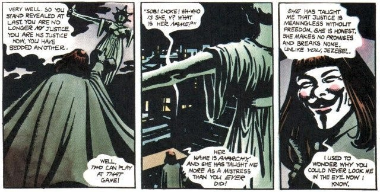

Occasionally I find myself in a back-and-forth discussion on some short messaging social media site about some concept in which sincere questions aren’t well served by short responses.

I hadn’t been on Bluesky long and hadn’t commented on much when one discussion caught my attention, and I felt that it deserved a more comprehensive answer than it had received.

The question came from someone who called themself ‘Summer Starfish’ about how issues of justice would work in a world without states and hierarchy (an anarchist society). How would they investigate serious harms with a monolithic legal system, and be certain they’d caught the right perpetrator, and deal with them in a way that made everyone safer.

Stateless socialists (such as anarchists) are often asked, ‘If there was no police wouldn’t everyone commit crimes?’ But this question was a different one, it was about when some harm has been committed but nobody takes personal responsibility, and something has to be done to ensure others safety.

The challenge with engaging on such a subject as an anarchist is that anarchism doesn’t usually talk in terms of laws, attorneys, police, crimes, courts, bail, judges, sentencing, and prisons. Except, that is, to highlight the dysfunctions with the current legal system.

Not all anarchists are united in their approach to these subjects. There are even suggestions from some anarchists for ways to organise constitutions, laws and some form of enforcement without hierarchies. But, as I’m not personally looking to reproduce these features and the problems that come with them, I won’t fall back on their ideas for solutions.

Anarchists often respond to questions of how something might work differently in a world without hierarchy, by saying we’ll all decide together how it will work when the chance and time comes. Summer had heard this before and found that answer unsatisfactory:

> ‘I can’t decide if I support anarchy unless I know how it would work. it’s just not enough for me to be told well we will figure it out once we get there.’ _(Summer Starfish, Bluesky)_

By putting off the question of specifics anarchists aren’t refusing to answer the question entirely, but are drawing attention to the fact that a world without hierarchy would be very different than the one we live in, with almost everything organised differently.

There are shared principles that would come into play at such a time that would inform how these ideals would be put into practice, and this process would evolve over time. This is how every system for good or ill has developed, and anarchist communities and groups would have to grow and adapt similarly, but without the burden of having to satisfy the powerful or wealthy.

That is an honest answer and one good enough for many people, especially if they already accept the basic concept that **what is accomplished with hierarchy can be carried out much more fairly without it.** I’d argue it can be carried out more effectively too.

But for those who haven’t made this assumption already, or those who believe we should be more prepared for when the opportunity to build a better world arrives, then it can be useful to look into how past non-hierarchal societies handled such issues, to see what we can learn from our current dysfunctional system that we may still be able to use, and to imagine - based on good and useful concepts - what the future might look like in this area. Thus, Summer put out the challenge of asking me what such a system might look like:

> ‘I think it’s extremely reasonable for sceptic of the philosophy to ask things like if they would be able to have a trial for example. Or if there would be a presumption of innocence. Or whether there would be any codified rules so that you know them in advance. So they aren’t foisted by surprise.’ _(Summer Starfish, Bluesky)_

The reason this particular area is of importance to Summer is that she sits ‘in the courtroom about once a week as the representative of a domestic violence resource and support organisation.’ So this isn’t merely a theoretical interest, but one that comes out of a sincere desire to ensure women are protected within the world, whatever kind of world that might be. Given her practical experience with these issues, I recognised that exploring concrete scenarios would be more valuable than abstract principles. So I concurred with her that:

> ‘The ability to see these possibilities clearly often takes - a) an understanding of what is possible, b) an experience of what is possible and c) an imagination of what is possible.’ 

Rather than continue with theoretical discussions, I challenged Summer to give me an example that would address the challenges that an anarchist world would need to deal with for her to consider it fair and just:

> ‘It would help if you could give me a case - a serious situation that requires a just resolution - I'll write a short outline / story which includes the concepts we've been talking about - to help visualise it & I could work on addressing it that way & share my draft for feedback.’

I’d been working on drafting an article series for a while now on how major problems in our current system could and would be addressed in a fictional anarchist setting, taking inspiration from the past, as well as the imagination of philosophers and authors would have covered these subjects. However, although I drafted a chapter on what would replace the police, I hadn’t addressed the other side of the equation, how harm would be dealt with once it was found, and it was just if not more important. Seeking to find the answer to that question Summer came up with this scenario for me to respond to:

### A Moral & Legal Dilemma

> Adam and Eve cohabitated at a residence in Maine in an anarchist community. Eve is pregnant. According to Eve, she and Adam disagreed sharply about whether she should have the baby. Several arguments on this topic drove a wedge between them. One day she was eating a soup made by Adam, and thought it tasted bitter. When she asked him about it, he acted defensive and suspicious. She eventually secretly searched through his stuff and found a bottle of quinine. She learned online that this is a dangerous homemade way to terminate a pregnancy. She immediately went to the doctor and alerted the authorities. The foetus was saved but now Eve has permanent damage to her kidneys and liver. According to Adam, he denied doing any sabotage to Eve's meals or owning or even knowing about the bottle of quinine. He said he suspects she actually obtained it herself to initiate a miscarriage, so her family wouldn't shame her for having an abortion, and essentially poisoned herself. Points of my curiosity:
> 
>   * What would the threshold for charges for Adam be? Probable cause? Would he be released on bail?
> 
>   * Would there be a trial and what would the trial be like? A judge and jury? Would there be an equivalent of a 5th amendment right to remain silent in an anarchy?
> 
>   * Would any warrants (or any other kind of pre-clearance threshold) be needed for a search and seizure of evidence?
> 
>   * Does he get any kind of advocate provided for him?
> 
>   * Who investigates and do they have any rules to follow for the investigation? Who decides the outcome and are there any evidence rules? Who makes the rules?!
> 
> 

There is a real dilemma in this scenario - one which if true would impact people in greatly if decisions or actions were taken wrongly, as well as if there was inaction. Before answering these questions I think it is important to look at how this sort of situation is handled under our current system, then looking into what could replace it, and why it would be better.

### Current ‘Solution’

Here's a detailed breakdown of how this case would likely unfold **under the U.S. legal/state system** :

### Initial Legal Response

####  **1\. Threshold for Charges: Probable Cause**

  *  **Probable cause** is the standard used to **arrest** someone and **bring charges**.

  * If police believe Adam likely tried to harm Eve or the foetus (e.g., based on Eve's statements, medical evidence, the presence of quinine, Adam’s behaviour), they may:

    * Arrest him

    * Present evidence to the district attorney (DA), who may file **criminal charges** (such as attempted murder, assault, or illegal abortion conduct).

### Possible Charges Against Adam

Depending on evidence and state law (Maine has some strict foetal protection laws), Adam could be charged with:

  *  **Attempted Murder or Assault** (against Eve)

  *  **Criminal Attempt to End a Pregnancy** (Maine law prohibits non-consensual abortion)

  *  **Aggravated Assault** or **Felony Battery** (if the poison caused serious bodily harm)

  *  **Use of a Dangerous Substance to Cause Harm**

Maine also allows charges related to **violence against a foetus** in some contexts (based on ‘foetal homicide’ statutes), even if the foetus survives.

### Bail & Pre-Trial Detention

  * Adam would usually have a **bail hearing** shortly after arrest.

  * A judge would assess whether he's a **flight risk** or **danger to the victim**.

  * If the charges are serious (like attempted murder), **bail could be high or denied entirely** , especially if Eve remains at risk.

### Trial Process

####  **Judge + Jury**

  * Adam would have a **right to a trial by jury** (6th Amendment) unless he waives it.

  * Trials are **adversarial** : prosecution vs. defence, presenting evidence and arguments.

  * The jury must reach a **unanimous verdict** to convict in criminal court (beyond a reasonable doubt).

####  **Adam’s Rights (5th Amendment, 6th Amendment)**

  *  **Right to remain silent** : He can’t be forced to testify (5th Amendment).

  *  **Right to an attorney** : If he can’t afford one, one is provided (6th Amendment, Gideon v. Wainwright).

  *  **Right to a public trial** , to cross-examine witnesses, and to present a defense.

### Investigation Rules

####  **Who Investigates**

  *  **Local police or state investigators** (e.g., Maine State Police)

  * They may bring in:

    * Forensic experts (to test soup or bottle)

    * Medical experts (to assess damage to Eve and foetus)

    * Digital investigators (to search Adam's devices if warranted)

####  **Rules for Investigators**

  * Governed by **constitutional rules** (especially the **4th Amendment** ).

  * To search Adam’s home, phone, or belongings:

    *  **Search warrant** typically required, issued by a judge based on probable cause.

    * There are exceptions (e.g., plain view, consent, exigent circumstances).

### Evidence Rules & Outcome

####  **Evidence Rules**

  * Strict rules in U.S. courts:

    * Hearsay, relevance, chain of custody, expert testimony all governed by **Federal Rules of Evidence** (or state equivalents).

  * Judges rule on **admissibility** of evidence.

  * The **jury** decides guilt based on the evidence admitted.

####  **Outcome**

  * Jury decides guilt; **judge handles sentencing** if there’s a conviction.

  * Adam can **appeal** if he believes his rights were violated.

### Who Makes the Rules?

  *  **U.S. Constitution** (especially Bill of Rights) is the foundation.

  *  **Federal & state legislatures** pass laws defining crimes, procedures, and evidence rules.

  *  **Courts** interpret those laws and set precedents.

  *  **Judges** ensure procedures are followed during trial.

## What Is Wrong With This Picture?

That is the ideal (according to the system), but few systems live up to their ideals, so in what ways might this process break down?

This is a very complex system, but complexity is no guarantee for fairness and complexity often gets in the way of effectiveness.

 **Initial Response Failures:**

  * Police may dismiss Eve's claims outright, particularly if they view it as a ‘domestic dispute’ or question her credibility.

  * Investigators might lack proper training in handling domestic violence cases or understanding coercive control patterns.

  * The probable cause standard can be manipulated - either too readily applied based on bias, or dismissed despite clear evidence.

 **Investigation Breakdowns:**

  * Evidence collection may be botched, contaminated, or delayed, potentially destroying crucial proof.

  * Police might fail to understand the dynamics of intimate partner violence, missing patterns of control and manipulation.

  * Adam's social position, race, or class could influence how seriously investigators take the case.

  * Eve may face victim-blaming attitudes that discourage her from cooperating or testifying.

 **Systemic Inequalities:**

  * Quality of legal representation varies enormously based on wealth - Adam's resources determine his defence quality.

  * Eve has no guaranteed advocate or support through the traumatic legal process.

  * The adversarial system can retraumatise victims, forcing them to relive abuse whilst being cross-examined.

  * Prosecutors may plea-bargain down serious charges to avoid trial risks, regardless of victim wishes.

 **Trial Process Failures:**

  * Juries bring their own biases about domestic violence, pregnancy, and women's credibility.

  * Complex medical evidence about poisoning may be poorly explained or misunderstood.

  * The ‘beyond reasonable doubt’ standard, whilst important, can allow manipulation of uncertainty.

  * Lengthy court processes can exhaust victims emotionally and financially.

 **Punishment vs. Prevention:**

  * Even if convicted, prison rarely addresses the underlying attitudes that led to the harm.

  * Adam returns to the community unchanged, potentially more dangerous.

  * Eve receives no meaningful restoration or ongoing protection.

  * The broader community learns nothing about preventing similar incidents.

This system fundamentally treats harm as an individual pathology rather than addressing the social conditions that enable such violence.

In the experiences I’m aware of personally victims have not been so lucky as having their legal process play out in an ideal way, and statistics bear that this is the experience of the majority.

By the point most reach the courthouse they are ‘lucky’ to have got that far, and perhaps they’ll be lucky enough to find someone as supportive as Summer to help them through the process. But most never reach that point because they are already failed by the system and culture long before then.

Our culture and system discourage reporting. Patriarchal hierarchy disadvantages women in power, housing, earning, and respect. A legal system influenced by money creates unjust outcomes. Capitalism disadvantages those who can't afford the consequences of reporting.

The hard facts are that out of 1,000 rapes that occur:

  * 690 are never reported (69%)

  * 310 are reported to police (31%) Of those reported, only about:

  * 12-40 result in conviction (roughly 1-4% of total incidents)

So as far as I'm concerned 96-99% are not getting justice. Most women (and some men) fail to receive justice through this system. I believe a non-hierarchal approach could serve them better. _I will show why and how it would work in[my next article](https://open.substack.com/pub/peacefulrevolutionary/p/justice-anarchist-style)._

Subscribe

[Share](https://peacefulrevolutionary.substack.com/p/justice-legal-vs-good?utm_source=substack&utm_medium=email&utm_content=share&action=share)
