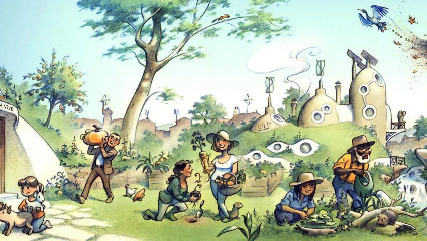
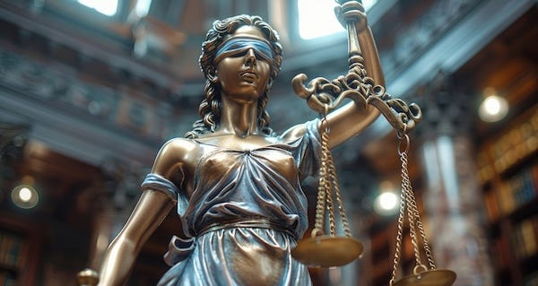

The [first article](https://open.substack.com/pub/peacefulrevolutionary/p/justice-legal-vs-good) in this series examined why our current justice system fails so many people. But this naturally raises the question: what would anarchist justice actually look like? How would communities handle serious harm without police, courts, and prisons?

The scenario that was posed to me by Summer Starfish is one in which a woman named Eve, pregnant and living with Adam in an anarchist community, discovered quinine in their home after noticing her soup tasted bitter, and suspected Adam of trying to terminate her pregnancy against her wishes. This left Eve with permanent organ damage, but Adam denied involvement, suggesting she may have poisoned herself to avoid family shame over having an abortion.

 _It should be remembered that, although this scenario is fictitious, that physical and sexual violence and abuse is a horrific and sadly a common part of our world, that it has been for much of its history, and it is made worse by hierarchal and patriarchal power structures, and exacerbated by an economic system which incentives women and children (and sometimes men) being objectified and being treated as as commodities. No form of justice that comes after such abuse can ever sufficiently address its past and present pains, but this puts the responsibility on all of us to listen to and believe those harmed, acknowledge the causes of such abuses and call it out when we see it. May we work toward creating a safer world in which such acts are much rarer, the abusive have far less power and are better prevented from carrying on such behaviour, and those harmed have far more support._

This brings us to the question of … How would an anarchist society deal with the scenario in this story? It per haps goes without saying, but there is no official anarchism and my reply is not an authoritative answer. Anarchism has underlying principles — primarily that no-one should rule over anyone else (by politics or wealth), everyone should have whatever essentials they need (not bought for profit) & decisions and associations should be made freely. Once these are accepted then many steps come logically from these assumptions that support a world that makes this possible. But when it comes to the details they will be as varied as any person or group of people can be, while maintaining the same values.

## An Anarchist View

My own personal response to this scenario presumes we already are living in a world without hierarchies when we are presented with this situation:

Adam and Eve live in the Maine region. There are no states, provinces, counties or even countries anymore, but some regions happen to be organised around roughly similar areas to where other borders used to be (as there are no legal borders any more).

They live in a community without hierarchy like everyone else throughout the world. In their case it is a small community outside of a more highly populated ‘city’ area.

Adam and Eve are in a freely agreed to romantic relationship with no enforced obligations, except the moral ones that may come with such commitments. There is of course no compulsion for Eve to be with Adam (or vice versa) except the love she feels for him, and either of them can leave at any time and be assured housing and food wherever they go.

Anarchist Maine Community

However, we can’t deny that in small close knit communities they may feel some family or social pressures too, even if such structures do not have the practical power they once had over others. Likewise, although religion will not have the political influence it once did, for those who believe in it it could still be a large emotional influence in their lives.

Adam has expressed that he does not want a child, and Eve has expressed that she does. This disagreement has not been challenging enough to end their relationship, but their relationship has been greatly strained over it.

### Eve’s Story

She has become pregnant, whether by accident or design we do not know. Of course Adam is just as responsible to take precautions if he doesn’t want a child as Eve would be if she didn’t. They both should respect the others wishes as to whether the other wants to be a parent. Either someone failed in this, or the methods of contraception failed, and Eve is pregnant. At this point we rejoin the story -

> ’One day she was eating a soup made by Adam, and thought it tasted bitter. _[According to her account]_ When she asked him about it, he acted defensive and suspicious. She eventually secretly searched through his stuff and found a bottle of quinine. She learned online that this is a dangerous homemade way to terminate a pregnancy. She immediately went to the doctor and alerted the authorities. The foetus was saved but now Eve has permanent damage to her kidneys and liver.’

We will assume at this point that Eve’s account is true (we’ll consider the alternative later). Either way it deserves to be taken seriously, and very serious harm has gone on.

Our first concern is with her health due to the damage her body has received, and to her trauma, even in the possible case (which we will cover later) that she was somehow responsible.

When it comes to Adam’s guilt men are (sadly) more often the guilty party in stories such as these, but not always. Everyone deserves a presumption of innocence, and there is a responsibility everyone involved has toward a ‘just’, ‘fair’ and ‘good’ outcome where possible.

There is the question of motive. In a world in which a child is not a financial commitment, because everyone has access to their needs, a world in which Adam could leave any time, then finances or legal obligation would not be motives. So cases such as this would of course be far rarer, but not impossible.

Maybe Adam had the motive of wanting to be unencumbered by feeling responsibility toward a child, or to have his time and attentions from Eve impacted by this. He didn’t want the inconvenience or guilt of leaving her, or the loss of community if he did.

Perhaps Adam, for whatever reason, has mental health problems which incline him to psychopath behaviours, that somehow have remained undetected and untreated up to the present. This would be a time and opportunity to determine if this is the case, but wouldn’t mitigate the reality of Eve’s situation or excuse Adam from any responsibility.

if Adam was investigated and there was sufficient evidence to presume he is guilty, perhaps he would admit and confess his part in this, perhaps he wouldn’t. But would probably be considered a danger to Eve, and if this is part of a possible pattern of behaviour he could be an ongoing danger to others too. If true, he would unlikely be welcome in that or other communities without undergoing some form of treatment (other communities could be warned if he wasn’t amenable to that and was likely to flee).

### Adam’s Story

In all societies there is the overriding universal ‘rule’ of ‘do no harm’, which is overridden by only one thing - the need to prevent those who would do harm from harming others.

But what if Eve’s story wasn’t exactly as she portrayed it, and perhaps Adam wasn’t to blame:

> ’According to Adam, he denied doing any sabotage to Eve's meals or owning or even knowing about the bottle of quinine. He said he suspects she actually obtained it herself to initiate a miscarriage, so her family wouldn't shame her for having an abortion, and essentially poisoned herself.’

Determining absolute guilt will always be a challenge in ‘he said’ ‘she said’ ‘they said’ situations. You hope that the perpetrator will confess, or that the evidence will make the culprit obvious.

Quinine is a common enough substance, being often mixed with alcohol for taste, or used as a home remedy for sleep restlessness, and in most cases is harmless. So it is a chemical unlikely to warrant and special handling and be relatively easy to get hold of.

Of course there may be some record or witness of who obtained the quinine which might validate the story one or the other. There may be fingerprints on the bottle, but this might not indicate much because Eve could have handled the bottle when she discovered it, whereas Adam could have wiped off his fingerprints.

But who bought and who handled it might be irrelevant. Because if Adam was known to add quinine to his favourite drink or Eve was known to have a restless sleep and had tried different remedies, there might be a reason for either of them to have it in the home. It could have even been left there by someone who visited the house in the past. Such details are useful for establishing doubt, but not very good for determining absolute certainty.

If Eve was acting out of fear, then why Eve’s parents would shame her for exercising her bodily autonomy, and why she would feel this would have that substantial an impact on her is a relevant question. Perhaps Eve’s parents might be religious, live in her community, and she wishes to maintain a good relationship with them and other religious people there, even to the point of taking such drastic action.

 _(How religion exists and operates within an anarchist world is an interesting question. Having no power, hierarchy or money to amass, or politics to influence, their reach will be severely curtailed. Likewise, due to the fact that every community relies on agreements based on shared values instead of money, there will be a far higher expectation of reasonable and moral behaviour within communities. This would tend to discourage extremes, as well as the fact that it would be far easier for doubters to leave, which is likely to disempower more restrictive religions and empower more liberal ones.)_

Nevertheless, perhaps Eve suffers from paranoia from some past trauma she picked up in the old (hierarchal) world, and so is anxious of something similarly negative happening to her as might have happened there.

Of course there may never be absolute certainty or even reasonable doubt in such a case, even after skilled investigation and wise deliberation. Justice may not be completely possible in this case.

Sadly, nothing that happens after the terrible death of this child or the damage to Eve’s body will repair what has happened so far.

But to return to the presumption that Adam was found to be guilty, this raises several questions:

>   * ‘What would the threshold for charges for Adam be? Probable cause? Would he be released on bail?’
> 
> 

The word bail would likely only have historical meaning in an anarchist world, because the idea that someone possibly dangerous could be free to roam based primarily on how much money they can put toward a bond would seem as silly as it actually is.

Some anarchists (not me) have a concept of money, but those (like Mutualists) who do imagine it as more like a voucher system, which couldn’t be amassed to pay for any kind of bail if it existed.

However, if he was seen as an immediate threat to others he may be held. This is just a form of self-defence, to prevent further violence.

>   * ‘Would there be a trial and what would the trial be like? A judge and jury?’
> 
> 

Whether ‘trial’ is the best word for a fact finding and harm resolution process is a different question, but rather than address that I’ll presume the word will still be in use, and that trials will still occur when there is a dispute about who did what that can’t be resolved peacefully between them, or there is a wider disagreement about how something bad should be dealt with. In those cases I imagine there being trials (or anytime anyone requests one).

But in most cases where the perpetrator and harm and victim are known and not disputed, and the best method to deal with it is established, then a trial would seem superfluous and just add an unneeded layer that would get in the way of justice and progress and healing.

If Summer, who proposed this scenario, is asking whether there are matters of such serious that they need deliberation by a community or a select group of experts, then I can see not only situations in which that happens, but also that there would be an established process for doing this, albeit customised for different cases as needed, in order to ensure fairness and accuracy and effectiveness.

>   * ‘Would there be an equivalent of a 5th amendment right to remain silent in an anarchy?’
> 
> 

There is no set constitution in the sense of the American one in an Anarchist society. Constitutions are documents usually set up to enforce power structures. In the case of the American Constitution it was designed to protect rich white male land and slave owners, and maintain their wealth and privilege, whilst not applying for most of its existence to women, native Americans and black people).

However, it would only be fair to mention that there are those who believe in a form of constitutional anarchy, and someone once wrote an [American anarchist constitution](https://ia904504.us.archive.org/24/items/anarchistconstit00krourich/anarchistconstit00krourich.pdf). There are also suggestions for [Anarchist law systems](https://en.wikipedia.org/wiki/Anarchist_law).

Nevertheless, There would be a largely shared understanding of imperatives or freedoms & needs that are guaranteed, but not by a state.

>   * ‘Would any warrants (or any other kind of pre-clearance threshold) be needed for a search and seizure of evidence?’
> 
> 

If you are asking if there should be a reasonable threshold of seriousness and / or suspicion that should be met before someone goes into someone else’s home then yes.

Even though anarchism speaks in terms of personal usage rights rather than private property rights, a home should be a place of safety, privacy, and security that isn’t invaded unless the perpetration of harm is highly suspected.

>   * ‘Does he get any kind of advocate provided for him?’
> 
> 

Of course, if someone cannot or will not speak for themselves then someone can advocate for them. Not because that person needs to understand complex legal jargon and latin or must wear a wig or robes to be taken seriously (as in our current system), but because not everyone wants or feels capable of speaking up.

>   * ‘Who investigates and do they have any rules to follow for the investigation? Who decides the outcome and are there any evidence rules? Who makes the rules?!’
> 
> 

Although I don't like the word rules, I expect that there will be methods that have been tried and found effective, many of which society and systems may already have that might be kept where they are useful and good. These methods would develop organically through community assemblies where everyone has a voice, drawing on collective wisdom and learning from both successes and mistakes. 

Unlike our current system where rules are imposed from above and everything must conform to them even where they don't fit or aren't good, each community would adapt approaches that reflect their values and circumstances, whilst sharing effective practices with neighbouring communities.

### Anarchist Justice 

Anarchist Justice would focus on healing harm rather than punishment, with the community collectively working toward resolution.

 **Immediate Response** \- The priority would be Eve's wellbeing, ensuring she receives proper medical care for her kidney and liver damage, and psychological support for the trauma. The community would rally around her needs without any bureaucratic barriers or costs.

 **Investigation Process** \- Rather than a police force, trusted community members with relevant skills would investigate. They'd follow established methods that the community has found effective, but adapted to this specific situation. There'd be no formal ‘warrants’ but a reasonable threshold would need to be met before searching Adam's belongings, balancing Eve's safety against respecting personal space.

 **Determining Truth** \- If evidence points to Adam's guilt, the focus shifts to understanding why this happened and preventing future harm. Was this a one-off act of desperation, or part of a pattern suggesting he's dangerous? The community would need to determine whether he can remain safely amongst them.

 **Resolution, Not Punishment** \- Rather than locking Adam away, the approach would be restorative or even transformative. If guilty, he'd need to acknowledge the harm caused and work toward making amends, perhaps contributing labour toward Eve's care or the community's medical resources. Treatment for any underlying issues would be prioritised.

 **Community Protection** \- If Adam refuses accountability or seems likely to cause further harm, other communities would be informed, and he might be asked to leave until he has addressed his behaviour. The goal isn't vengeance but ensuring everyone's safety.

The whole process would be transparent, with community input, focusing on healing relationships and preventing future harm rather than simply punishing wrongdoing.

I’ve helped produce some wiki pages on how questions of ‘justice’ might be handled in a theoretical anarchist world, including how it has been handled in past non-hierarchal societies. These will undoubtedly be debated and revised over time by other anarchists, but are intended as a look at different possibilities that may evolve differently in reality:

 **Anarchist Wiki articles on Anti-Social Behaviour**

  * [Anarchist Approaches To Crime And Harm](https://anarwiki.org/wiki/Antisocial_Introduction)

  * [Traditional Stateless Justice Methods](https://anarwiki.org/wiki/Historical_Harm_Reduction_Introduction)

  * [Problems with Hierarchical Capitalist Justice Systems](https://anarwiki.org/wiki/State_Violence_Introduction)

  * [Crimes That Would Be Eliminated in an Anarchist Society](https://anarwiki.org/wiki/Anarchist_Harm_Mitigation_Introduction)

  * [Harm Investigation & Guilt Determination](https://anarwiki.org/wiki/Harm_Investigation_Introduction)

## Personal Experience

In my past I was appointed to be an investigator for injustices and abuses within an insular religious community I was part of, initially secretively. During my time in that role I like to think I did some good at exonerating the wrongly accused and protecting those who might have been harmed when finding evidence of guilt.

Whatever other dysfunctions the community I was in had, they sincerely did not want anyone to be abused. However, they also had leaders who were believed to act on behalf of deity and would make final decisions that were considered beyond question.

Ultimately I was involved with a case in which the desire for protecting people conflicted with the promises a leader had already made, and which they couldn’t change without appearing imperfect. I believe this legitimised someone with bad intentions and undermined others safety.

This was a major factor in me questioning and leaving that religious group. Luckily, I’m now in a more open community, which has the benefits of fellowship and cooperation, but not the negatives of such a hierarchy structure and restrictive doctrines.

My own negative experiences of hierarchy were formed through being part of that earlier group. Likewise our view of what level of justice and fairness are possible within communities can be influenced by such experiences.

### The Current System

In my experience, those who've experienced strong supportive communities see community-based resolution as perfectly reasonable. They trust that for more complex situations, they could access help from others across society who share their values and have the necessary skills and knowledge.

But in our ‘Western’ world we have been brought up with savage competition, isolation, and dysfunction. The idea of trusting a group of people we may not know, who have little or no experience in these areas, to make such decisions seems extreme, and the legal process seems much more preferable.

My ideal world is one in which dealing with harm doesn't wait upon long legal delays, and is much less subject to bureaucracy and corruption when dealing with such situations.

Yet similar situations happen within our legal systems frequently, where the power and authority of the person making a judgement or someone who is accused is a bigger factor in the outcome than fairness, justice and guilt or innocence.

To return to our original case and existing society: If Adam is guilty the current system could let this woman down in many ways. Worst of all it could find him innocent (even if he is guilty) and leave her with him in a home he legally owns, with her financially dependent on him and having no other recourse.

Even if he was convicted and imprisoned for a while it could eventually let out a dangerous psychopath back into the community, without there being any substantial change in the danger he still poses.

Whereas, if she is guilty there is no guarantee she will get the mental health care that is needed, or that he will receive practical care either, having lost a child and been wrongly accused.

Ultimately, I find the current system too unreliable. I just don’t trust it. It hasn’t earnt my trust. I believe it needs to be replaced, ideally through peaceful transition, but it can’t be allowed to continue and fail so many.

 _This article series will conclude on another Substack publication[Roses And Resistance](https://open.substack.com/pub/rosesandresistance/p/justice-futuristically), for reasons that will make sense when you read it, but until then I’ll keep you in suspense._

 _These themes have been on my mind a lot lately, as I’ve been reading a novel in which a group of maligned women are forced to fight for some form of justice for themselves. I’ll be sharing my review of that book,[The Old Crones Club](https://www.amazon.com/Old-Crones-Club-Fairytale-Retelling/dp/1068224428/) soon, and exploring this concepts some more._

Subscribe

[Share](https://peacefulrevolutionary.substack.com/p/justice-anarchist-style?utm_source=substack&utm_medium=email&utm_content=share&action=share)

 **Further Reading**

  * [Anarchy Works - Crime](https://www.theanarchistlibrary.org/library/peter-gelderloos-anarchy-works#toc41)

  * [An Anarchist FAQ - What About Crime?](https://anarchistfaq.org/afaq/sectionI.html#seci58)

  * [Anarchist Criminology](https://en.wikipedia.org/wiki/Anarchist_criminology)

  * [An Anarchist Theory Of Criminal Justice](https://theanarchistlibrary.org/library/coy-mckinney-an-anarchist-theory-of-criminal-justice)

  * [Crime, Criminals, Punishment an Anarchist View](https://theanarchistlibrary.org/library/workers-solidarity-movement-crime-criminals-punishment-an-anarchist-view)

  * [Justice, Primitive and Modern: Dispute Resolution in Anarchist and State Societies](https://theanarchistlibrary.org/library/bob-black-justice-primitive-and-modern)

  * [What About The Rapists?](https://syllabus.pirate.care/library/Anonymous/What%20about%20the%20rapists__%20Anarchist%20approaches%20to%20crime%20&%20justice%20\(352\)/What%20about%20the%20rapists__%20Anarchist%20approac%20-%20Anonymous.pdf)

