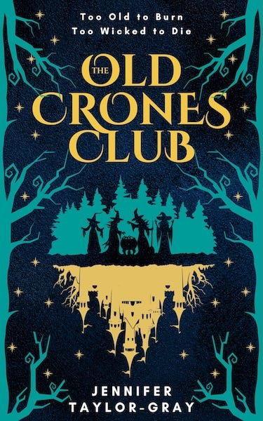

## The Stories We Were Mistold

I want to tell you about a book which subverts the fairy tales you grew up hearing, the tales told by men about wicked stepmothers and crafty old spinsters, whose jealousies and power-seeking lead to them cursing and harming helpless maidens.

For most of history our accounts of the lives of others have literally been a his-story, stories told by men, often with other men as the intended readers. Even with children’s fiction it largely favoured the male characters, the kind father corrupted by his new wife, the brother trying to protect his sister, the boy who knew better than his old mother.

If women weren’t the source of evil in such stories they were not often mentioned at all, unless they were a very young and often foolish girl, or they happened to be a sainted mother who died tragically before she had the chance to become old and wicked.

The ancient world does have examples of cultures in which women were more equally involved in society, even some in which women were predominant. Our nearest genetic cousins, the Bonobo apes, are even considered matriarchal according to many primatologists.

Yet patriarchy ultimately triumphed across the world, and with it came male-centred stories that portrayed the men as heroes and the woman at best as innocent pure objects of adoration, but often as frivolous temptations, dangerous diversions, and even wicked witches.

## The Crones Tell Their Own Tales

Have you ever wondered how different those stories might have been if told by the women themselves, the antagonists of the Grimm brothers’ stories, who usually die horrible deaths before we ever get to hear their own account of what really happened. That is the premise of a new fantasy novel, The Old Crones Club.

As I’m usually knee-deep in dusty old tomes about political and economic theory, and only occasionally raise my head above those muddy waters to look forward to possible science fiction futures, it is rare these days for me to imagine different possible pasts, especially the kind that involve swords and sorcery, let alone wands and witchery.

So, the Old Crones Club is an exception to the types of books you’ll usually find me reading, but for that reason was all the more refreshing and enjoyable, as well as being thought-provoking around all the issues I haven’t been giving enough attention to, in a way that takes the reader on a journey along with the Crones of its title, without us or them realising the commentary it is also making on our history, fiction and society.

The first character we are introduced to, Tibby, is - not unlike my own mother - someone from a generation in which women were taught to be very concerned with how they appear, having internalised what it means in her society to be a good woman, to know what is proper and acceptable and what is wrong and bad. That is, until Tibby discovers that despite doing everything she was told would make her a sweet old granny, she ends up being maligned as a witch.

This takes her on a journey in which she questions the tales she has been told, and comes to learn why such stories are told about women, and how they have been used to disenfranchise them. This involves her doing the one thing she most loathes, speaking up and standing out, which is made all the more difficult by our discovery that she like the others isn’t either as wicked as they’ve been accused of being (even when that might come in use), nor as perfect as she’d like to be.

## Challenging The Anti-Feminist Narrative

In a world in which some ‘trad wives’ are again fetishising a mythical idealistic past in which docile women were cared for by relatively wealthy breadwinners, it is important for us to be reminded that the so called ‘traditional’ woman’s role came with great inequality and justified a great deal of abuse and disempowerment too.

It is good for authors such as Jennifer Taylor-Gray, to remind us not just that Feminism, which is again being maligned, is just equality by another name, but that such equality has been precarious and continues to be in our modern world, with modern Brothers Grimm waiting to take it away again.

However, her book is not a treatise, it is a journey, and like all good fantasy journeys makes stops along the way of a fun adventure to remind us that there is darkness in fantasy forests and dungeons and in the real world too, that sometimes have to be crossed to reach the brighter clearings waiting on the other side.

Taylor-Gray deftly weaves these light and dark threads to give substance to a story that has as much depth as whimsy, especially if one sees and appreciates the themes woven throughout her novel.

But on whatever level you read it I believe you’ll find it an engaging story, told from the point of view of an older group that is often forgotten in fiction, and which has a great deal of both humour and wisdom to impart to us. May we all grow to be as comfortable and courageous in our skins and skirts (or trousers) as these Old Crones become.

 **[US eBook](https://www.amazon.com/Old-Crones-Club-Fairytale-Retelling-ebook/dp/B0FGDQZJ1Z/) / [UK eBook](https://www.amazon.co.uk/Old-Crones-Club-Fairytale-Retelling-ebook/dp/B0FGDQZJ1Z/)  
[US Paperback](https://www.amazon.com/Old-Crones-Club-Fairytale-Retelling/dp/1068224428/) / [UK Paperback](https://www.amazon.co.uk/Old-Crones-Club-Fairytale-Retelling/dp/1068224428/)**

* * *

# From Medieval Persecution to Modern Resistance: Old Crones & Witch Hunts

## The War on Women

The tales we tell about women (particularly older women) reveal far more about power structures than they do about the women themselves. Jennifer Taylor-Gray's _The Old Crones Club_ offers a fascinating lens through which to examine how patriarchal narratives have been weaponised throughout history, and how women's resistance to those narratives continues today. When read alongside Silvia Federici's groundbreaking work on the medieval witch hunts, _Caliban and the Witch (2004)_ & _Witches, Witch-Hunting, and Women (2018)_ , the novel becomes more than fantasy fiction, it becomes a blueprint for understanding how systems of oppression operate and how they might be challenged.

To understand the significance of _The Old Crones Club_ , we must first grasp what the historical witch hunts actually represented. Far from being mere superstitious hysteria, the European witch persecutions of the 15th-17th centuries were, as Federici demonstrates, a systematic campaign to re-establish patriarchy under the new system of capitalism. The witch hunt was instrumental in breaking women's control over their bodies and reproduction, criminalising birth control and non-procreative sexuality, whilst simultaneously destroying the communal relations that had provided women with social power.

The targets were specific: poor peasant women, older women, and those who resisted their impoverishment. These were women who challenged the emerging order: midwives who controlled reproduction, healers who possessed traditional knowledge, and older women who ‘embodied the community's knowledge and memory.’ The persecution ‘paved the way to the confinement of women in Europe to unpaid domestic labor’ and ‘legitimated their subordination to men in and beyond the family’, and transformed the wise woman into a figure of fear, turning her from a respected community member into ‘a symbol of sterility and hostility to life.’

## Controlling Knowledge and Narrative

Taylor-Gray's Crones face remarkably similar challenges to their historical counterparts. Both groups represent women who dare to exist outside the narrow confines of acceptable femininity, women who possess knowledge, maintain friendships, and refuse to disappear quietly into marginalisation. The Brotherhood employs tactics remarkably similar to those used in historical persecutions, revealing the continuity of patriarchal control methods across centuries.

Medieval witch hunts specifically targeted women's traditional knowledge, particularly concerning healing and reproduction. Midwives and folk healers found themselves demonised, their centuries-old practices reframed as diabolic. In _The Old Crones Club_ , we see this same pattern when Brother Jacob dismisses the women's abilities as mere ‘magic’ whilst claiming his own work as ‘science.’ Morag's sharp retort — ‘Of course. When it's done by men, it's science’ — cuts to the heart of how patriarchal systems validate male knowledge whilst dismissing female expertise as irrational or dangerous.

This isn't simply about herbalism or healing; it's about who gets to define legitimate knowledge and who benefits from that definition. Knowledge becomes another commodity to be controlled and monetised, and women's traditional, freely-shared wisdom represents a threat to that commodification.

### Destroying Female Solidarity & Power

Perhaps most crucially, both historical and fictional persecutions target female friendships and communal bonds. The medieval witch hunts systematically destroyed women's social networks. The word ‘gossip,’ which once meant ‘friend,’ acquired its derogatory meaning during this period. Women were forced to denounce each other under torture, ‘friends turning in friends, daughters turning in their mothers.’

The Brotherhood in Taylor-Gray's novel employs identical tactics, using their propaganda via the ‘Mirrors Of Truth’ to turn people against the Crones and attempting to isolate them from potential allies, and to turn communities against accused women. Both systems rely on controlling information and narrative to maintain power structures.

The forced recitation of ‘I. Am. Wicked. Spells. Are. Evil… I. Must. Be. Punished…’ directly echoes the enforced confessions extracted under torture during historical trials. Both scenarios demonstrate how systems of oppression rely on isolating women from each other, preventing the collective strength that might challenge patriarchal authority.

Historical persecutions particularly targeted women who existed outside traditional marriage structures: the ‘loose, promiscuous woman,’ the widow dependent on charity, and women who ‘exercised their sexuality outside the bonds of marriage and procreation.’ These women represented economic independence and sexual autonomy that threatened the new capitalist order's requirements for controlled reproduction and unpaid domestic labour.

The Crones similarly represent women who refuse to accept their designated roles as invisible and powerless. They are predominantly older women, many widowed or never married, who refuse to accept their designated role as invisible, powerless figures. Their very existence challenges patriarchal authority, just as their historical counterparts threatened the emerging patriarchal economic system.

Both historical and fictional persecutions employ similar methods of control. Medieval women faced torture devices like the ‘scold's bridle’ or ‘gossip bridle,’ designed to punish women deemed ‘nags’ or ‘scolds.’ These instruments created ‘cruel public humiliation that must have terrified all women, showing what one could expect if she did not remain subservient.’

The _Crone’s_ Brotherhood's use of manacles and threats mirrors these historical methods, employing shame and social isolation as weapons, just as historical persecutions did.

## Reclaiming Revolutionary Power

What makes _The Old Crones Club_ particularly powerful is how it inverts the traditional narrative. Where historical witch trials ended in defeat and death, Taylor-Gray's witches fight back, reclaim their identity and narratives, and challenge their oppressors directly and collectively.

Instead of accepting the Brotherhood's characterisation of them as evil, they redefine these terms as sources of kinship, solidarity, and power. This mirrors the modern feminist reclamation of ‘witch’ as ‘a symbol of female revolt and liberation.’

This reclamation isn't merely symbolic, it's deeply political. By refusing to accept imposed narratives about their worth and role, the Crones demonstrate how oppressed groups can challenge the ideological foundations of their oppression.

Where historical witch hunts succeeded by isolating women from each other, the Crones' strength lies in their unity. Their rebellion against the Brotherhood represents precisely the kind of collective female power that historical persecutions sought to destroy. 

This collective approach reflects anti-hierarchical principles, the understanding that true liberation comes not through individual achievement within oppressive systems, but through collective action to transform those systems entirely. Rather than seeking reform, the Crones recognise that the system itself, not merely its excesses, must be challenged.

## The Ongoing Struggle

Taylor-Gray's novel arrives at a moment when many of the issues addressed by the historical witch hunts remain painfully relevant. The parallels between medieval persecution and _The Old Crones Club_ reveal how patriarchal systems continue to operate. The mechanisms that once burned women at stakes now manifest through different means: economic marginalisation, media manipulation, and the systematic devaluation of women's knowledge and contributions.

The Brotherhood's propaganda mirrors contemporary media's role in shaping public perception to maintain existing power structures. Their attempts to divide women from potential allies reflect ongoing efforts to prevent collective resistance to exploitation.

 _The Old Crones Club_ , read through the lens of Federici's analysis, offers several crucial insights for contemporary struggles:

 **First** , it demonstrates the importance of understanding how systems of oppression operate ideologically. The Brotherhood's ‘Mirrors of Truth’ spreading lies parallels how the corporate media shapes public perception to maintain existing power structures.

 **Second** , it highlights the centrality of female solidarity to any meaningful resistance. The Crones' strength comes from their collective action, their refusal to be divided against each other.

 **Third** , it shows the power of narrative reclamation. By refusing to accept imposed definitions of their worth and identity, the Crones create space for alternative ways of being and knowing.

 **Finally** , it suggests that true liberation requires not just individual empowerment, but systemic transformation. The Crones don't seek to join the Brotherhood, not to have better positions within it, they seek to defeat it entirely.

It wraps all of this up in a form which can be easily be read on the level of a cozy fantasy and enjoyed as a casual read.

## The Revolutionary Potential of the Crone

Both the historical witch hunts and _The Old Crones Club_ ultimately concern who wields power in society and how that power is maintained or challenged. The medieval persecutions succeeded in establishing structures that continue to shape our world, but they could not entirely destroy what they sought to eliminate.

In embracing the identity of ‘witch,’ these fictional women join a long tradition of female resistance that extends from the accused women of medieval Europe to contemporary feminist movements. They remind us that the stories told about women — whether in Grimm fairy tales or modern media — are never innocent, but always serve particular interests. And most importantly, they demonstrate that alternative stories are possible, stories where women's wisdom, friendship, and power are celebrated rather than feared.

The original witch hunts may have succeeded in their immediate goals, but they could not entirely destroy what they sought to eliminate. In every generation, new crones emerge to reclaim their power, challenge patriarchal narratives, and imagine different ways of organising society. Taylor-Gray's novel suggests that these women — these witches, hags, and crones — may yet have the last word.

 **[US eBook](https://www.amazon.com/Old-Crones-Club-Fairytale-Retelling-ebook/dp/B0FGDQZJ1Z/) / [UK eBook](https://www.amazon.co.uk/Old-Crones-Club-Fairytale-Retelling-ebook/dp/B0FGDQZJ1Z/)  
[US Paperback](https://www.amazon.com/Old-Crones-Club-Fairytale-Retelling/dp/1068224428/) / [UK Paperback](https://www.amazon.co.uk/Old-Crones-Club-Fairytale-Retelling/dp/1068224428/)**

 _Disclaimer - For the last year or so I’ve been among the few fortunate to have followed this book from its early drafts into its published form, to see the characters grow and find their voices, as I’ve seen it’s author explore the themes of women finding and telling their own stories. I’ve enjoyed this process and believe the resulting book has exceeded its potential at being both entertaining, thought-provoking and inspiring, but I am very biased toward such themes, the author, and the book I’ve come to love._

Subscribe

[Share](https://peacefulrevolutionary.substack.com/p/the-old-crones-club?utm_source=substack&utm_medium=email&utm_content=share&action=share)

 **Silvia Frederici’s books:**

  * [Caliban and the Witch](https://archive.org/details/CalibanAndTheWitchWomenTheBodyAndPrimitiveAccumulation/page/n1/mode/2up) (2004)

  * [Witches, Witch-Hunting, and Women](https://www.pmpress.org/index.php?l=product_detail&p=960) (2018)

