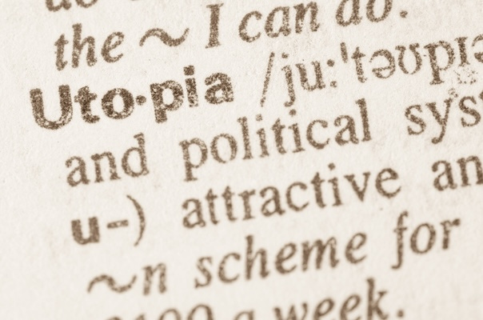
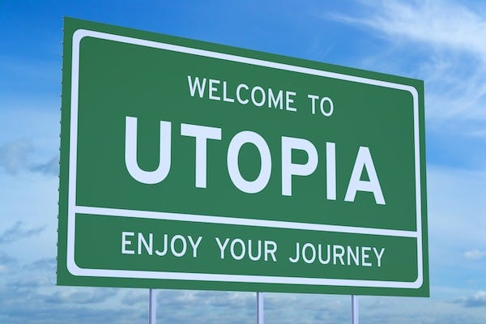

## Choosing A Better Future

What would a better world look like to you? What would it feature? What would it be free from? What kind of people would be part of it?

It can be fun to imagine an ideal vision of the future, and there are probably as many variations of what that looks like as there are people who might try to envision it.

For someone who is lonely the perfect world might be one where friends and family are always near, for those who are hungry it might be a place where food in all its varieties is plentiful, for those who love to travel it might be continents without borders.

For those who wished they lived in opulent luxury then Utopia might be them living as royalty in palace, for those who wish everyone would just obey them to it might be a land where they are a dictator, for those who distrust all others it might be a world without anyone else at all. One persons heaven may be another’s hell.

If you wanted to offend the maximum amount of people in one single post you might try and write a Choose Your Own Utopia article, which shepherds everyone into having to choose between a set of specific futures they'd prefer to live within. Yet I'm foolhardy enough to try such an experiment, in the hopes that others will find it interesting, maybe even fun, and give them a chance to reflect on what different outcomes different ideals might lead to.

So below you will find a series of passages linked by choices that lead to different ideals. It is an imperfect attempt to gauge the kinds of values people have and where those lead as far as political ideologies and their consequences go.

 _You can take this little game as seriously or otherwise as you like. But if you feel I represented any particular side unfairly please let me know what you think I got wrong. My intention is to refine and expand it if others find it interesting or useful. At the very least I hope it gets people thinking, even if they just find it amusing._

[An updated interactive version is now available here](https://hnrjx4f6.play.borogove.io)

## 1: The Beginning

You find yourself amongst 100 others, tasked with building a new society from scratch. The old world has collapsed, and you have a chance to create something completely different. Everyone is looking around, wondering: **Who should make the decisions that will shape our future together?**

  * If you believe **everyone should participate equally with no rulers** , turn to **Section 2**

  * If you think **elected representatives** should make decisions, turn to **Section 10**

  * If you feel **natural leaders and experts** should guide society, turn to **Section 20**

  * If you believe **traditional or religious authority** should lead, turn to **Section 22**

  * If you think **‘Why bother? It's all meaningless anyway’** , turn to **Section 23**

* * *

## 2: The Anti-Authority Path

You reject the idea of rulers - excellent! But now you face a crucial question about the material basis of your society. A heated debate erupts about **property and ownership**. What's your instinctive response?

  * If you believe **everything should be shared collectively** , turn to **Section 3**

  * If you think **people should have personal possessions but share essential resources** , turn to **Section 4**

  * If you support **strong private property rights** , turn to **Section 5**

  * If you feel **property is theft, but organisation is also oppression** , turn to **Section 6**

* * *

## 3: The Communist Branch

You've chosen collective ownership - brilliant! Everyone contributes what they can and takes what they need. But now you're facing questions about **technology and scale**. Some people want to build complex machinery, others prefer simple living. What do you think?

  * If you believe **we should reject complex technology and live simply** , turn to **Section 24**

  * If you want **democratic community control over technology choices** , turn to **Section 7**

  * If you think **we need coordination to manage complex society** , turn to **Section 8**

  * If you believe **people will cooperate freely without money or complex organisation** , turn to **Section 25**

* * *

## 4: The Mutualist Branch

Fair exchange between equals - a balanced approach! But now tensions arise between **market activity and community solidarity**. How do you handle this?

  * If you support **cooperative markets without capitalism** , turn to **Section 26**

  * If you want **some market activity alongside strong communities** , turn to **Section 12**

  * If you think **market solutions work for most things** , turn to **Section 14**

  * If you believe **we don’t need markets to cooperate** , turn to **Section 25**.

* * *

## 5: The Right-Libertarian Branch

Strong property rights it is! But now a moral dilemma emerges: **what about vulnerable people** who can't provide for themselves? An orphaned child needs food and shelter. What's your response?

  * If you believe **voluntary charity should handle social needs** , turn to **Section 27**

  * If you think **a minimal safety net is acceptable** , turn to **Section 28**

  * If you support **a strong safety net alongside markets** , turn to **Section 14**

* * *

## 6: The Nihilist Branch

You reject both property and organisation - interesting! But if you don't believe in organising society, **why organise at all?**

  * If you believe in **pure individualism - each person for themselves** , turn to **Section 29**

  * If you want to **destroy all systems and see what emerges** , turn to **Section 30**

* * *

## 7: Democratic Technology Control

You want communities to democratically choose their technology - sensible! But **what scale of democracy** works best for these complex decisions?

  * If you prefer **small federated communities making their own choices** , turn to **Section 31**

  * If you want **regional democratic councils coordinating** , turn to **Section 32**

  * If you think **large-scale democratic planning** is needed, turn to **Section 11**

  * If you think **ecological limits should guide all technology choices** , turn to **Section 9**

* * *

## 8: The Coordination Dilemma

You recognise that complex society needs coordination - practical thinking! But **what kind of coordination** preserves your anti-authority values?

  * If you want **democratic councils of workers coordinating** , turn to **Section 33**

  * If you think **a workers' state might be needed temporarily** , turn to **Section 18**

  * If you believe **a revolutionary party should provide leadership** , turn to **Section 19**

* * *

* * *

## 9: The Green Branch

You believe human society must live within ecological limits - wise thinking! But **how do we enforce ecological responsibility** without destroying freedom?

  * If you want **local communities managing their own ecosystems** , turn to **Section 31**

  * If you think **democratic green planning** is needed, turn to **Section 36**

  * If you believe **market incentives can solve environmental problems** , turn to **Section 40**

  * If you feel **strong eco-authority** is necessary, turn to **Section 46**

* * *

## 10: The Democratic Path

Representative democracy - the familiar choice! But democracy can mean many different things. **How much equality** should your democratic society aim for?

  * If you want **economic equality through redistribution** , turn to **Section 11**

  * If you support **equal opportunities but accept unequal outcomes** , turn to **Section 14**

  * If you prefer **minimal state with maximum markets** , turn to **Section 34**

  * If you think **national identity matters more than individual choice** , turn to **Section 16**

* * *

## 11: The Socialist Branch

Economic equality through democracy - admirable! But **who should control the economy** to ensure this equality?

  * If you want **worker collectives and local democracy** , turn to **Section 35**

  * If you support **democratic government economic planning** , turn to **Section 36**

  * If you think **a revolutionary vanguard party** is needed, turn to **Section 18**

  * If you prefer **gradual reform through existing systems** , turn to **Section 37**

  * If you believe **syndicalist unions should run everything** , turn to **Section 38**

  * If you think **national workers' unity** is most important, turn to **Section 39**

  * If you believe **spiritual or moral values should guide economic equality** , turn to **Section 13**

* * *

## 12: Mixed Economy Balance

You want to balance markets with community - thoughtful! But **what's the right balance** between these competing values?

  * If you think **community needs should come first** , turn to **Section 11**

  * If you want to **balance public and private ownership equally** , turn to **Section 37**

  * If you prefer **markets with ethical constraints** , turn to **Section 55**

* * *

## 13: The Spiritual Socialism Branch

You want to combine spiritual wisdom with economic justice - a meaningful approach! But **what's the relationship** between faith and politics?

  * If you want **religious communities practicing economic sharing** , turn to **Section 35**

  * If you think **democratic institutions guided by moral principles** , turn to **Section 36**

  * If you believe **religious authority should enforce justice** , turn to **Section 51**

  * If you prefer **individual spiritual practice within market systems** , turn to **Section 40**

* * *

## 14: The Liberal Branch

Equal opportunities with market outcomes - the liberal position! But **how much regulation** do you think markets need?

  * If you want **strong regulations and a welfare state** , turn to **Section 55**

  * If you prefer **moderate regulation with market focus** , turn to **Section 40**

  * If you support **minimal regulation and maximum freedom** , turn to **Section 34**

  * If you think **gender equality requires fundamental social restructuring** , turn to **Section 15**

* * *

## 15: The Gender Equality Branch

You recognise that true equality means transforming how society organises care, work, and power - radical thinking! But **what kind of transformation** is needed?

  * If you want **collective responsibility for care work** , turn to **Section 35**

  * If you think **democratic policies can restructure gender relations** , turn to **Section 36**

  * If you believe **individual choice and legal equality** are sufficient, turn to **Section 40**

  * If you feel **traditional gender roles provide stability** , turn to **Section 52**

* * *

## 16: The Nationalist Branch

National identity matters to you - that's a significant choice! But **what kind of nation** do you envision?

  * If you believe in **ethnic or cultural nationalism** , turn to **Section 41**

  * If you want **civic nationalism with strong welfare** , turn to **Section 42**

  * If you think **local self-governance matters more than national identity** , turn to **Section 17**

* * *

## 17: The Scale Question

You value local control over distant authority - decentralist thinking! But **what scale of organisation** can handle modern challenges?

  * If you want **small autonomous communities** , turn to **Section 31**

  * If you think **regional federations** work best, turn to **Section 32**

  * If you believe **global coordination** is necessary, turn to **Section 36**

  * If you prefer **competing local authorities** , turn to **Section 40**

* * *

## 18: The Vanguard Question

You accept that revolutionary leadership might be necessary - a serious commitment! But **what's the end goal** of this vanguard party?

  * If you want **international permanent revolution** , turn to **Section 43**

  * If you think **socialism in one country first** , turn to **Section 44**

  * If you believe **party rule might be permanent** , turn to **Section 45**

* * *

## 19: Revolutionary Leadership

You believe a revolutionary party should lead - decisive thinking! But is this **temporary or permanent**?

  * If this is **temporary until workers can self-organise** , turn to **Section 18**

  * If you think **permanent party control** is necessary, turn to **Section 45**

* * *

## 20: The Expert Leadership Path

You want competent leadership - practical! But **which kind of experts** should guide society?

  * If you prefer **technical and scientific experts** , turn to **Section 46**

  * If you think **economic and business leaders** know best, turn to **Section 21**

  * If you believe **military and security leaders** should be in charge, turn to **Section 47**

* * *

## 21: Business Leadership

Business leaders should guide society - market-focused thinking! But **what kind of capitalism** do you envision?

  * If you want **corporate-state partnership under strong leadership** , turn to **Section 48**

  * If you prefer **wealthy elite democracy** , turn to **Section 49**

  * If you want **pure market rule by the successful** , turn to **Section 50**

* * *

## 22: Traditional Authority

You believe in traditional or religious authority - a time-tested approach! What form should this take?

  * If you want **religious authority to rule** , turn to **Section 51**

  * If you believe **established customs should guide society** , turn to **Section 52**

  * If you think **hereditary leadership provides stability** , turn to **Section 53**

* * *

## 23: The Nihilist Beginning

Why bother indeed? If it's all meaningless, perhaps the question isn't how to organise society, but whether to organise it at all.

Turn to **Section 54**

* * *

* * *

## 24: Anarcho-Primitivist World

You believe technology and civilisation have corrupted human nature. True equality and freedom can only exist in small communities using simple tools, living in harmony with nature. You reject the complexity that creates hierarchy and alienation.

 _Your utopia won't be utopian for: Those who depend on modern medicine, technology, or urban life to survive and thrive._

 _Left Libertarian Socialist | Freedom:_ ★★★★★★★☆☆☆ _(22/30)_

* * *

## 25: Anarcho-Communist World

You believe in radical equality and mutual aid. From each according to their ability, to each according to their need. No money, no state, no private property - just people freely cooperating to meet everyone's needs. You think humans naturally help each other when freed from competition and hierarchy.

 _Your utopia won't be utopian for: Those who want individual recognition for their contributions, prefer competition to cooperation, or need personal incentives to be productive._

 _Left Libertarian Socialist | Freedom:_ ★★★★★★★★★☆ _(29/30)_

* * *

## 26: Anarcho-Mutualist World

You support a society of independent producers trading fairly with each other. No bosses, no workers - just free people exchanging the products of their labour. Markets can exist without capitalism when everyone owns their own means of production.

 _Your utopia won't be utopian for: Those unable to be independent producers due to disability, age, or lack of skills and resources._

 _Left Libertarian Socialist | Freedom:_ ★★★★★★★☆☆☆ _(21/30)_

* * *

## 27: Anarcho-Capitalist (Propertarian) World

You believe in absolute property rights and that voluntary cooperation through free markets creates the most prosperous and just society possible. Government is the main source of oppression - remove it and let people trade freely, and you believe that natural charity will handle those in need.

 _Your utopia won't be utopian for: Those without capital, property, or marketable skills - including children, the disabled, and the poor. Left-Anarchists will not accept you as an Anarchist either, because they believe capital to be a form of hierarchy._

 _Right Libertarian | Freedom:_ ★★★★★★☆☆☆☆ _(19/30)_

* * *

## 28: Minarchist World

You want the smallest possible government that still maintains basic social order. Just enough state to protect property rights, enforce contracts, and provide a minimal safety net. Everything else should be handled by markets and voluntary association.

 _Your utopia won't be utopian for: Those who need more support than a minimal safety net provides, including many disabled people and those in economic distress._

 _Right Libertarian | Freedom:_ ★★★★★★☆☆☆☆ _(18/30)_

* * *

## 29: Egoist Anarchist World

You reject all social obligations and moral systems. Each individual should pursue their own desires without regard for abstract principles like justice or equality. True freedom means owing nothing to anyone.

 _Your utopia won't be utopian for: Those who depend on others for survival, care, or support - especially the vulnerable who cannot compete as individuals._

 _Far-Right Libertarian | Freedom:_ ★★★★☆☆☆☆☆☆ _(11/30)_

* * *

## 30: Nihilist Anarchist World

All systems and ideologies are lies that control people. The only honest response is to destroy everything and see what authentic human relationships emerge from the ruins. Chaos is more honest than false order.

 _Your utopia won't be utopian for: Those who need stability, security, or predictable social structures to thrive - most people, essentially._

 _Post-Political | Freedom:_ ★★★☆☆☆☆☆☆☆ _(8/30)_

* * *

## 31: Social Ecologist World

You believe in directly democratic communities that make technology choices based on ecological wisdom. Human societies should integrate with natural systems, using appropriate technology controlled by face-to-face democracy.

 _Your utopia won't be utopian for: Those who benefit from or depend on large-scale industrial technology, global connectivity, or urban amenities._

 _Left Libertarian Socialist | Freedom:_ ★★★★★★★★☆☆ _(25/30)_

* * *

## 32: Democratic Confederalist World

You want a federation of democratic councils managing regions cooperatively. Local autonomy combined with coordination for larger issues, with decisions flowing upward from communities rather than downward from states.

 _Your utopia won't be utopian for: Those who prefer strong central authority, rapid decision-making, or don't want to participate in constant democratic processes._

 _Left Libertarian Socialist | Freedom:_ ★★★★★★★☆☆☆ _(22/30)_

* * *

## 33: Council Communist World

Workers' councils should coordinate production and distribution democratically. No parties, no states - just working people organising themselves to meet everyone's needs through direct democracy in workplace and community councils.

 _Your utopia won't be utopian for: Managers, owners, those who prefer representative democracy, or those who don't want workplace decisions made collectively._

 _Left Socialist | Freedom:_ ★★★★★★★★☆☆ _(24/30)_

* * *

## 34: Neoliberal World

Free markets create prosperity and freedom. Government should provide basic infrastructure but otherwise let competition and innovation solve social problems. Individual choice and economic efficiency should guide society.

 _Your utopia won't be utopian for: Those who cannot compete effectively in markets - the poor, disabled, economically marginalised, or those in regions that markets abandon._

 _Centre-Right | Freedom:_ ★★★★★★☆☆☆☆ _(18/30)_

* * *

## 35: Libertarian Socialist World

You want worker ownership combined with local democratic control. Cooperatives, communes, and democratic workplaces should replace both capitalism and state socialism. Freedom means democratic control over your own life and work.

 _Your utopia won't be utopian for: Those who prefer individual entrepreneurship, don't want collective decision-making, or benefit from current property ownership._

 _Left Libertarian Socialist | Freedom:_ ★★★★★★★★☆☆ _(25/30)_

* * *

## 36: Democratic Socialist World

Democratic government should ensure economic equality whilst respecting individual rights. Use democratic institutions to create a planned economy that serves human needs rather than profit, whilst maintaining political freedoms.

 _Your utopia won't be utopian for: Those who benefit from wealth concentration, prefer market solutions, or worry about democratic planning's efficiency._

 _Centre-Left Socialist | Freedom:_ ★★★★★★★☆☆☆ _(22/30)_

* * *

## 37: Social Democrat World

You support a strong welfare state, regulated capitalism, and democratic government. Markets can be useful but need democratic control to ensure everyone's basic needs are met and inequality doesn't become extreme.

 _Your utopia won't be utopian for: Those who want either pure market freedom or complete economic equality - it's a compromise that fully satisfies neither._

 _Centre-Left Liberal | Freedom:_ ★★★★★★★☆☆☆ _(21/30)_

* * *

## 38: Syndicalist World

Trade unions should take over and run society directly. Workers in each industry should democratically control their workplaces and coordinate with other unions to manage the whole economy without politicians or bosses.

 _Your utopia won't be utopian for: Non-union workers, the unemployed, consumers who want choice over worker solidarity, or those outside the industrial workforce._

 _Left Libertarian Socialist | Freedom:_ ★★★★★★★☆☆☆ _(21/30)_

* * *

## 39: Ultra-Nationalist Fascism World

You believe in combining protectionist economics with strong national identity, often enforced through authoritarian means. This historically leads to fascism despite initial liberal rhetoric.

 _Your utopia won't be utopian for: Ethnic minorities, immigrants, internationalists, or anyone the regime defines as outside the national community._

 _Far-Right Authoritarian | Freedom:_ ★★★☆☆☆☆☆☆☆ _(9/30)_

* * *

## 40: Classical Liberal World

Individual rights, limited government, and market economics create the best society. People should be free to make their own choices within a framework of law that protects everyone's equal liberty.

 _Your utopia won't be utopian for: Those who need more than equal opportunity to succeed - people facing structural disadvantages, discrimination, or economic hardship._

 _Centre-Right | Freedom:_ ★★★★★★☆☆☆☆ _(19/30)_

* * *

## 41: Ethno-Nationalist World

You believe society should be organised around ethnic or cultural identity, often excluding or subordinating other groups. This typically leads toward authoritarian control to enforce cultural conformity.

 _Your utopia won't be utopian for: Ethnic minorities, immigrants, mixed-heritage people, or anyone who doesn't fit the prescribed national identity._

 _Far-Right Authoritarian | Freedom:_ ★★★☆☆☆☆☆☆☆ _(10/30)_

* * *

## 42: Social Nationalist World

You want a strong welfare state combined with national identity, but within democratic institutions. Think Nordic social democracy with emphasis on national cohesion and shared cultural values.

 _Your utopia won't be utopian for: Recent immigrants, those who don't share the dominant culture, or cosmopolitan internationalists who reject national identity._

 _Centre-Right Nationalist | Freedom:_ ★★★★★☆☆☆☆☆ _(16/30)_

* * *

## 43: Trotskyist World

You believe in permanent international revolution led by a vanguard party. Socialist revolution must spread globally to survive, and the party must maintain revolutionary discipline until worldwide socialism is achieved.

 _Your utopia won't be utopian for: Those who oppose revolutionary change, want local autonomy, or disagree with vanguard party decisions - dissent isn't tolerated during revolution._

 _Authoritarian-Left State Socialist | Freedom:_ ★★★★★★☆☆☆☆ _(19/30)_

* * *

## 44: Marxist-Leninist World

You support building socialism in one country through a vanguard party that will eventually wither away. The party guides society through the transition from capitalism to communism, maintaining revolutionary discipline.

 _Your utopia won't be utopian for: Those who want immediate democracy, oppose party rule, or are deemed class enemies or counter-revolutionaries by the vanguard._

 _Authoritarian-Left Socialist | Freedom:_ ★★★★★★☆☆☆☆ _(19/30)_

* * *

## 45: Stalinist Authoritarian World

You believe a revolutionary party must maintain permanent control to protect socialist gains. The complexity of modern society requires expert leadership that cannot be left to democratic processes.

 _Your utopia won't be utopian for: Those who want democratic participation, oppose party ideology, or are identified as threats to party rule - which can be quite broad._

 _Left Authoritarian | Freedom:_ ★★★★☆☆☆☆☆☆ _(13/30)_

* * *

## 46: Technocracy World

Technical experts and scientists should make decisions based on rational analysis rather than political popularity. Complex problems require expertise, not democracy or ideology.

 _Your utopia won't be utopian for: Those who value democratic participation, cultural wisdom over technical knowledge, or whose needs aren't recognised by technocratic planning._

 _Centre Technocratic | Freedom:_ ★★★★★☆☆☆☆☆ _(16/30)_

* * *

## 47: Military Dictatorship World

Security and order are the foundations of all other social goods. Military leadership provides the discipline and hierarchy necessary for social stability and national defence.

 _Your utopia won't be utopian for: Pacifists, those who oppose military values, political dissidents, or anyone the military regime sees as a security threat._

 _Right Authoritarian | Freedom:_ ★★★☆☆☆☆☆☆☆ _(10/30)_

* * *

## 48: Fascist Corporatism World

You support merger of corporate and state power under strong nationalist leadership. Business efficiency combined with state direction and cultural unity creates national strength.

 _Your utopia won't be utopian for: Trade unionists, ethnic minorities, political opponents, internationalists, or anyone who doesn't fit the regime's vision of national unity._

 _Far-Right Authoritarian | Freedom:_ ★★★☆☆☆☆☆☆☆ _(10/30)_

* * *

## 49: Oligarchy World

You believe society functions best when guided by a wealthy elite who have proven their competence through success. Democratic processes are too chaotic and unreliable for complex decisions.

 _Your utopia won't be utopian for: The poor, working class, or anyone without wealth and connections - essentially the vast majority of the population._

 _Right Authoritarian | Freedom:_ ★★★☆☆☆☆☆☆☆ _(9/30)_

* * *

## 50: Plutocracy World

The market should determine political as well as economic outcomes. Those with the most resources have demonstrated their fitness to lead society and should have proportional political power.

 _Your utopia won't be utopian for: Anyone without significant wealth - their political voice becomes proportional to their economic resources, meaning most people have little say._

 _Right Authoritarian | Freedom:_ ★★★☆☆☆☆☆☆☆ _(11/30)_

* * *

## 51: Theocracy World

Religious authority provides the moral foundation necessary for just society. Divine guidance through religious leaders offers wisdom beyond human political systems.

 _Your utopia won't be utopian for: Those of different faiths, atheists, religious minorities, or anyone whose lifestyle conflicts with the dominant religious interpretation._

 _Right Authoritarian | Freedom:_ ★★★☆☆☆☆☆☆☆ _(10/30)_

* * *

## 52: Traditionalist World

Established customs and inherited wisdom should guide society rather than abstract theories or individual desires. Traditional hierarchies and roles provide stability and meaning.

 _Your utopia won't be utopian for: Those who don't fit traditional roles, want social change, or belong to groups historically marginalised by traditional hierarchies._

 _Right Conservative | Freedom:_ ★★★☆☆☆☆☆☆☆ _(11/30)_

* * *

## 53: Monarchist World

Hereditary leadership provides stability and continuity that democratic systems cannot match. A monarch above party politics can represent the whole nation's long-term interests.

 _Your utopia won't be utopian for: Republicans, democrats, those who reject hereditary privilege, or anyone the monarchy doesn't represent or actively oppresses._

 _Right Authoritarian | Freedom:_ ★★★☆☆☆☆☆☆☆ _(10/30)_

* * *

## 54: Nihilist World

All political systems are ultimately arbitrary exercises of power. The honest response is to reject all ideologies and social obligations, living authentically without illusions about justice or meaning.

 _Your utopia won't be utopian for: Those who need meaning, purpose, social connection, or any form of collective organisation to flourish - which is most human beings._

 _Post-Political | Freedom:_ ★★★☆☆☆☆☆☆☆ _(8/30)_

* * *

## 55: Social Liberal World

You believe in individual freedom supported by strong institutions. You want regulated markets, robust welfare systems, and protection for vulnerable people, all within a democratic framework that respects individual rights whilst ensuring everyone has genuine opportunities to flourish.

 _Your utopia won't be utopian for: Those who want either minimal government interference or maximum economic equality - it's a balance that may satisfy neither pure libertarians nor pure socialists._

 _Centre-Left Liberal | Freedom:_ ★★★★★★★☆☆☆ _(22/30)_

## Freedoms

What constitutes freedom is a highly debated question, and few ways of judging this will satisfy everyone. The freedom scores in this interactive story were judged by six factors:

  1.  **Individual Autonomy** \- Freedom to make personal choices about your life.

  2.  **Economic Security** \- Guaranteed access to basic needs (food, shelter, healthcare).

  3.  **Democratic Participation** \- Meaningful say in decisions affecting you.

  4.  **Social Equality** \- Equal treatment regardless of background/identity.

  5.  **Innovation/Progress** \- Capacity for technological and social advancement.

  6.  **Community Solidarity** \- Social connection and mutual support.

These were each given a score out of five based on how much or little the freedom was restricted, and these thirty points were divided into ten stars for this article. Of course many people might argue against complete freedom in some areas, seeing it as impractical, if not dangerous according to their own value system.

Personally I believe that the ideal utopia would be one that allows for multiple ideals of utopia to co-exist and (if they wish) co-operate together, whilst not restricting anyone from seeking their own ideal as long as it didn’t harm anyone else.

 _For my own view on which freedoms are essential I have written a couple articles on this subject:_

  *  _[A Free Society](https://peacefulrevolutionary.substack.com/p/a-free-society?r=25vj2b)_

  *  _[Achieving Liberation](https://peacefulrevolutionary.substack.com/p/achieving-liberation?r=25vj2b)_

 _I’ve also written several other['Utopian' articles](https://peacefulrevolutionary.substack.com/t/utopia) that might be of interest._

Subscribe

[Share](https://peacefulrevolutionary.substack.com/p/choose-your-own-utopia?utm_source=substack&utm_medium=email&utm_content=share&action=share)
