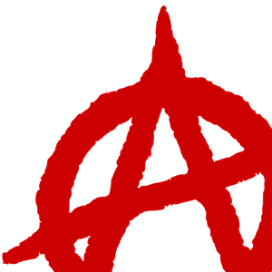
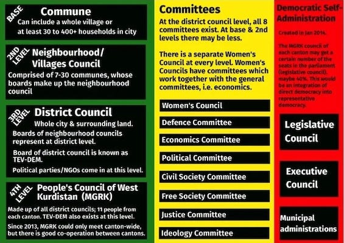
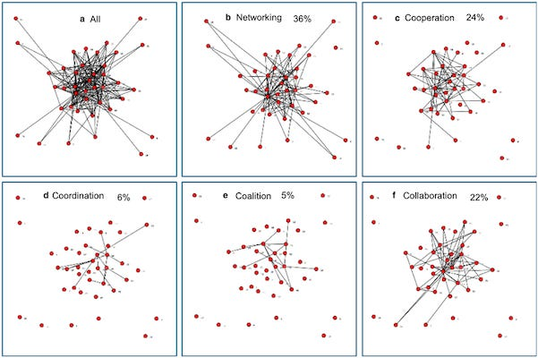
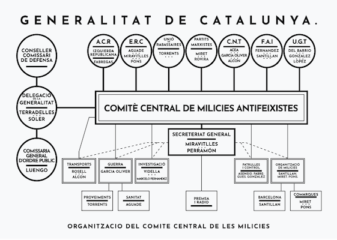

## The Myth of Necessary Hierarchy

‘Sure,’ people say, ‘cooperation and mutual aid work brilliantly in small groups, but what about running a whole society? You can't organise millions of people without bosses and bureaucrats!’

The most persistent objection to having a world without hierarchy (anarchism) isn't really about whether it's desirable, it's about whether it's practical. _(Perhaps this is partially the anarchists' fault, as we tend to focus on the local community because it is relatable, and the place most people will encounter anarchism in practice.)_ This assumption runs so deep that many folk can't even imagine alternatives, so it's worth examining whether it's actually true. 

The idea that we need hierarchy to prevent chaos is largely promoted by … well, hierarchies themselves. Those with concentrated power have every incentive to convince us that without them, everything would collapse. But if you look around, you'll notice that most of the world's actual work (the caring, creating, and problem-solving that keeps life going) happens through cooperation, not by obedience.

Anarchism isn't anti any-structure, it is anti-concentrated-power-structure. It isn't anti-planning, it is inclusive-voluntary-freedom-respecting-planning. It isn't anti organisation at all, in fact the O around the A in the popular anarchist symbol stands for Organisation.

Consider how your neighbourhood actually functions. People organise informal childcare networks, look after each other during illness, share resources, and solve problems together without anyone being ‘in charge.’ The internet runs on voluntary protocols that no single authority controls. Emergency responses often work best when communities self-organise rather than wait for official coordination.

I'd argue that the world is kept running due to anarchy - through people, families, friend groups, groups with common needs and interests, mutual aid, charities, unpaid work and care, and people working outside of state sanction or corporate auspices. Whereas state and corporation are fragile brittle things which survive only by us making up for their failings and what they fail to provide.

## Everything Isn't Planned at the Top

Even within hierarchical organisations, the real work gets done through horizontal networks. Workers coordinate amongst themselves, share knowledge informally, and often work around rather than through their managers to get things accomplished. The hierarchy often serves more to extract profit or maintain control than to actually organise productive work.

Even in our current system, everything isn't actually coordinated from some central command centre. Capitalism's supposed efficiency comes from thousands of independent decisions made by people who understand their local circumstances, such as shop floor workers, farmers, software developers, and teachers. The ‘market’ is just a particular way of selling and profiting from these decisions, but it's not the only way.

The world isn't only functioning due to centralised coordination now. This is often seen as a selling point of capitalism - capital coercion - the idea that you need to work doing whatever makes (usually someone else) money. But even if you don't believe in the cooperative incentive, you probably believe in survival coercion, the idea that we need to organise collectively to ensure everyone's survival (which doesn't require bosses extracting profit from our labour).

What we call ‘central planning’ often involves layers upon layers of people with local knowledge making practical decisions every step of the way. The difference in an anarchist system wouldn't be the elimination of planning, it would be the elimination of people at the top who extract wealth while contributing nothing to the actual planning process (and often get in the way of its effectiveness).

## Networks, Not Isolation

When anarchists talk about organisation at a local level, we're not advocating for isolated communes cut off from the wider world. We're talking about networks, such as confederations of communities that can coordinate across vast scales while keeping decision-making power where it belongs: with the people affected by the decisions.

Anarchism works well in smaller settings? Well then organise around multiple smaller scales. Complex systems that work come from simpler systems that work. As Gall’s law states, ‘a complex system that works is invariably found to have evolved from a simple system that worked’.

People bring up Dunbar's number as if it's a gotcha. I think it is a reasonable observation that applies well in its intended context, but the people bringing it up also often promote capitalism for its ability to use large supply chains and its success across the world, so if capitalism isn't limited by Dunbar's number then Dunbar's number isn't relevant to large scale organisation.

But let’s presume that hierarchy was inevitable above a certain size, then don't go above that size, at least not in one monolithic institution. Instead of having that or isolated communities, lets have networks of groups, workplaces and organisations, even within cities.

Think of it like the internet again. No single authority runs it, yet it coordinates activity across the globe. Or consider how cities actually work: they're not single units but collections of neighbourhoods, each with their own character and needs, connected by transport, communication, and shared infrastructure.

For people who say co-operation and collective effort isn't as effective as competition I'd like to introduce you to GNU Linux, the world's most used operating system. Although you may not even realise you are using it, but you probably are.

If you own an Android phone, tablet or Chromebook you are using Linux. If you browse the web there is a 96% chance you are accessing information or media from a Linux server, or if you store anything in the cloud there is a 90% chance you are using Linux. How much is all of this costing you? Nothing. Linux is free! Who owns it? No-one!

This principle doesn’t just work in the digital world. Look at the Argentine factory take overs, Revolutionary Catalonia, or more ancient examples. The Haudenosaunee (Iroquois) Confederacy coordinated policy across territories larger than many modern nations, using consensus-building processes that influenced the design of American federalism. Indigenous confederations coordinated across vast distances with millions of people using horizontal networks of mutual aid and consensus-building.

Large scale (up to a few million over a country-sized region) non-hierarchal decentralised societies such as the Indus Valley civilisation have existed and last a substantial amount of time (up to 2000 years). This makes them more successful than most other kinds of civilisation by at least the metric of longevity. Although these don’t exist anymore that one lasted 1750 years longer than America, which will be lucky to last 50 years more. Non monarchal community based systems lasted roughly 200,000 years. It is our current systems which are the aberration.

## We Already Have the Skills

One assumption about anarchism that never ceases to surprise me is the idea that we'd need to ‘start from scratch,’ as if everyone with expertise would suddenly forget how to do their jobs the moment their boss disappeared. This completely misses how knowledge and skills actually develop and transfer.

So the, why doesn't anarchism exist already if it’s so great? Well it has and it kind of does, but it is like trying to do organic farming in a hostile environment when surrounded by industrial monocultures that contaminate the soil and water, whilst subsidies flow to agribusiness and supermarkets demand produce that fits their supply chains. _(I appreciate that organic farming isn’t by itself anarchism, but it is often involved with food co-operatives and alternatives markets, and is an example of people trying to act ethically in production, outside of the profit motive.)_

Trying to live according to non-hierarchal co-operative values by building sustainable, cooperative communities is swimming against the tide when surrounded by extractive capitalism that poisons the environment, concentrates wealth, and uses state violence to protect their corporate ownership. Yet there are thousands of communities engaged in this goal, and no lack of people who would be if they had the opportunity.

There is a presumption that capitalism works just because it exists, because it makes a few people very rich, and because in a few countries there is a relatively comfortable (albeit rapidly diminishing) middle-class (made by exploiting the global south). However, capitalism didn't wait until it was proven and the dominant system to implement its system. Capitalism didn't begin with a plan, just a simple principle: make rich people richer. That is its whole purpose - the accumulation of capital, and an incredible amount of violence and slavery took place to make it the dominant system.

We wouldn’t have to start from scratch. The organic farmers and community builders would still exist. All the people who've studied and wanted to work in sustainable agriculture and cooperative living their whole lives suddenly won't suddenly just abandon everyone else.

None of the engineers maintaining our power grids, the teachers educating children, the farmers growing food, or the software developers building the systems we rely on need hierarchical management to do their work well. If anything, many report that management often interferes with rather than enables good work.

If we take an existing nation with 350 million people (like America as an example) - It isn't monolithic, those 350 million people are not administered to by one central body. Many neighbourhoods already have residential groups that organise many things, city districts have their own services and those who carry them out, towns and cities engage a substantial number of the residents to keep things running, with multiple councils for different departments.

This process is expanded through counties, states, and then to the federal government, which often splits departments into regions. All these people with skills and expertise would still be useful and probably be more effective without hierarchy and through being part of councils, working groups, etc. (without those who don't have their expertise playing politics).

The real inefficiency in our current system isn't size, it's the artificial bottlenecks created by committee rooms filled with people who don't understand the actual work. How much time and resources are wasted on management layers that exist primarily to justify their own existence? How many local communities are disempowered and don't have their needs properly met through this system?

But what about people rising up wanting to rule over others? As for power accumulation, this is actually easier to prevent in transparent, horizontal networks than in hierarchical systems. When decisions are made openly in communities where people know each other and see the direct effects, it's much harder for someone to quietly accumulate unchecked influence. Compare that to our current system where a few dozen CEOs and politicians make decisions affecting millions of people they'll never meet.

What would change wouldn't be the elimination of expertise or coordination, it would be putting that expertise in the hands of councils and working groups made up of the people actually doing the work, advised by representatives from other affected communities.

## Stages of Transition

Perhaps there will be a dramatic overnight revolution which will quickly restart everything, after all it has happened in the past so may happen again, but there is also the potential for a gradual transformation of our existing systems to becoming non-hierarchal. If so, here is a possible process that might take:

 **Assessment** : We could assess whether worth continuing a particular department, factory or service, and see if it is fulfilling and important purpose & if not what other purpose it can be put to. First, we'd need to honestly assess what our current systems actually accomplish. How much of what we produce actually meets human needs versus generating profit? How much administrative work exists solely to maintain artificial hierarchies?

 **Reorganisation** : We could immediately put people with expertise and skills on council alongside delegates of other workers. We could keep on managerial and administrative workers in a new role advising on transition / transfer skills to co-ordination (but we’d need to be careful not to allow them the power to sabotage such change).

 **Reallocation** : We could reorganise work time and conditions as best suits workers. Many jobs could be made less alienating and more meaningful when freed from the imperative to generate surplus value for owners.

 **Integration** : We could work with other parts of production process to see what is still needed and how we could carry it out more effectively without competition and waste. Different parts of the production process could coordinate directly with each other rather than through layers of management focused on profit extraction.

Of course, the problem with having a plan is that:

  1. People will still say - it is just a plan - it has never worked in reality.   
_(Until it is pointed out to them that it has, then …)_

  2. People will still say - okay its aspects have worked on small scales but it will never work on a larger one.  
 _(Until it is pointed out to them that it has, then …)_

  3. Oh, there are examples of larger scale earlier in human history - well that wouldn't work now.  
 _(Until it is pointed out to them that it has, then …)_

  4. Oh, there are some modern examples - well, since they are under attack from violent capitalist forces they will never survive so aren’t relevant.

What it seems some of them may be really saying when they make these objections is:

  1. I'm not willing to take any risks or make any sacrifices to create something better. When you have a perfect fully formed alternative and it is easy for me to move into then I'll accept it.

  2. Although our current system was also once ‘just an experiment’ that required massive social upheaval to establish, I’ll presume it was inevitable and is inescapable until it is replaced.

  3. I demand guarantees that change will be painless and beneficial for me personally, without any loss of privilege or lack of luxuries, or I’ll never accept it, whilst ignoring that those comforts exist because of others being enslaved to provide them for me.

This process isn't just theoretical though, it has been done before. During the Spanish Revolution of 1936-1939, anarchist collectives in Catalonia successfully reorganised entire industries – from transport and utilities to manufacturing and agriculture – along horizontal lines. They didn't start from scratch; they took existing infrastructure, expertise, and productive capacity and reorganised it democratically.

The workers had planned how to transition from hierarchical capitalism to libertarian communism through their unions and confederations.1 When the moment came, they knew exactly how to proceed: existing technical experts joined worker councils, administrative knowledge was shared rather than hoarded by managers, and production was coordinated through voluntary federation rather than top-down command.

What's remarkable is that in many cases, production actually increased under worker control. The Barcelona tramway system, telephone networks, and various factories operated more efficiently when run by the people who actually understood the work, freed from the need to generate profits for absentee owners.2 They had detailed plans for expanding this model across Spain and beyond3, proving that large-scale anarchist organisation isn't just possible, it can be systematically implemented.

## The Real Test: Does It Work?

The ultimate measure shouldn't be whether anarchist organisation fits our current assumptions about how large societies must work, it should be whether it actually works better for human freedom and environmental sustainability.

Capitalism doesn't work for most people now. Not in a sustainable way. Not in a way that avoids potentially destroying all human life. Not in a way that shares its ‘comforts’ in an egalitarian way, or even according to those who need them most. If it takes violence to ensure a few in the world obtain their capitalist made toys then maybe that is just too high a price to pay.

If we transition to a more sustainable world there will be some differences in the level of comforts some enjoy because such comforts should never be maintained by environmental destruction or human exploitation. It would take five earths if everyone lives as Americans do, and if we carry on as we have been then we will end up with no earth. A few people might be happy to keep the rest of the world in far inferior conditions just to support their privilege, but it isn’t possible to keep this up indefinitely.

Our current system is heading towards ecological collapse whilst maintaining massive inequality and alienation for most people. Hierarchical coordination has given us climate change, biodiversity loss, and economic systems that require constant growth on a finite planet. If that's ‘working,’ then maybe we need to reconsider our definition of success.

When it comes to possible futures I try to work on the Elinor Ostrom principle, ‘if it works in practice it must work in theory.’ In other words, if it has happened, then it can happen, and the theories should adjust to accept the reality. Whereas if our theories say it is impossible, but yet it has happened, then we have to adjust or discard our theories.

Meanwhile, examples of horizontal organisation — from Wikipedia to Linux to community response networks — consistently demonstrate that voluntary cooperation can coordinate complex projects across global scales. These aren't perfect analogies for whole societies, but they suggest that the supposed impossibility of large-scale anarchist organisation might be more ideological than factual.

The question isn't whether anarchist organisation can work at scale, it's whether we're willing to transition to alternatives and away from systems that we know aren't working. Given the stakes, surely it's worth finding out.

Subscribe

[Share](https://peacefulrevolutionary.substack.com/p/scaling-up-freedom?utm_source=substack&utm_medium=email&utm_content=share&action=share)

Some articles which delve into these issues in greater detail -

 **Organisation at scale -**

  * [Organising Without Rulers](https://peacefulrevolutionary.substack.com/p/organising-without-rulers)

  * [I Pencil, The True Story](https://peacefulrevolutionary.substack.com/p/i-pencil-the-true-story)

  * [How Anarres Works](https://peacefulrevolutionary.substack.com/p/how-anarres-works)

 **Motivations to work without hierarchy -**

  * [What About The Lazy?](https://peacefulrevolutionary.substack.com/p/what-about-the-lazy)

  * [Who Will Do The Dirty Jobs?](https://peacefulrevolutionary.substack.com/p/who-will-do-the-dirty-jobs-after)

 **How co-operation and mutual aid is already the norm -**

  * [The True Story Of The Little Red Hen](https://peacefulrevolutionary.substack.com/p/the-true-story-of-the-little-red)

  * [Love Is Anarchist](https://peacefulrevolutionary.substack.com/p/love-is-anarchist)

 **How we got ourselves into this mess -**

  * [How The World Became This Way](https://peacefulrevolutionary.substack.com/p/how-the-world-became-this-way)

  * [Playing Pretend](https://peacefulrevolutionary.substack.com/p/playing-pretend)

 _Note: Some of this article was taken from responses to comments to articles like these, If you’d like to be credited or your replies linked to please let me know._

1

<https://anarwiki.org/wiki/The_Confederal_Concept_Of_Libertarian_Communism> & <https://libcom.org/article/platform-workers-alliance-valeriano-orobon-fernandez>

2

<https://libcom.org/article/anarchist-collectives-workers-self-management-spanish-revolution-1936-1939-sam-dolgoff>

3

<https://libcom.org/article/after-revolution-economic-reconstruction-spain-diego-abad-de-santillan>
