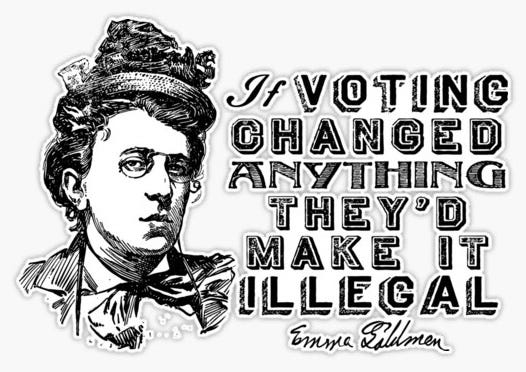
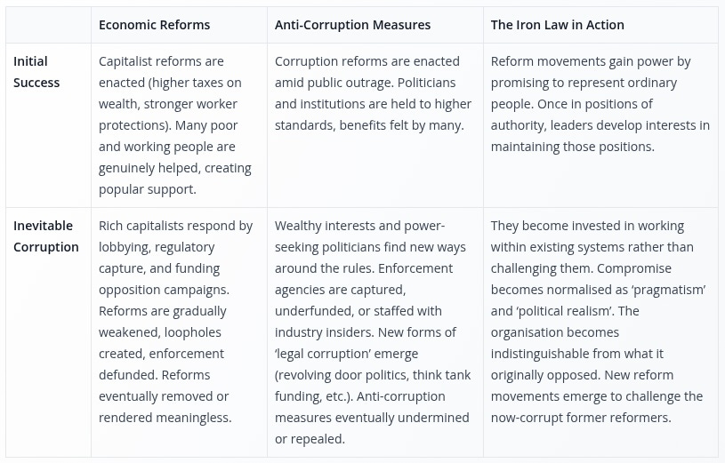
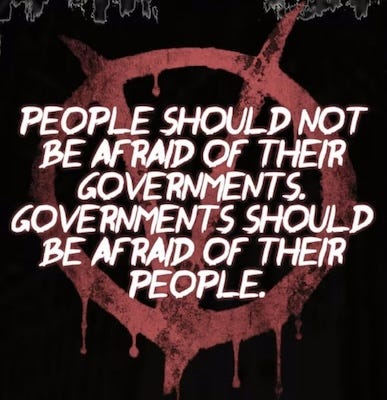

## Why Reform Isn't Enough

A lot of people idealistically look to the era of Franklin D. Roosevelt or Clement Attlee (in the UK), and to what the French call the Thirty Glorious Years from 1945 to 1975. A time when many in the U.S. could afford healthcare, college, a home, a couple children, and retirement on one income (albeit mostly applying to white middle class men).

Workers had voted in politicians that seemed to share some of their values, and who enacted social programmes (and eventually equality and civil rights legislation) that led people to believe that it might be possible to have a political system that worked for them.

It was a century of reforms, beginning with women obtaining the vote (and working men in England who hadn't had it before then)1, eight-hour working day victories, union rights and collective bargaining, unemployment insurance and old-age pensions, workplace safety regulations, the founding of universal healthcare systems (and Medicare / Medicaid in the U.S.), public housing programmes, free or subsidised higher education, public transport networks, civil rights advances of the 1950s and 60s, women's liberation movements securing reproductive rights and workplace equality, and early environmental protections that suggested society might actually prioritise long-term survival over short-term profit.

Each victory built upon the last, creating what seemed like an unstoppable momentum toward a more egalitarian society. Workers could see tangible improvements in their own lives, not just promises, but actual material gains, with each generation expecting to be better off than the previous one.

All the while the ultra-wealthy and their corporations, banks, and media empires were working to undermine and ultimately regain their power over the politicians, economists, and news outlets.2 Which they did successfully by the late 1970s, installing their appointees back again in power, such as the Reagans and Thatchers (and later Clintons and Blairs), who would do their bidding.

Lately this has culminated in many of the previously hard-won guarantees that benefitted hard working people being undermined, and leading to a precarious situation now in which most younger workers never expect to have enough money to own a home, have children or retire. Not only that, other freedoms we've been able to take for granted are under assault by increasing authoritarian politicians whose relationship to corporate power is greater than ever.

Of course, even during the supposedly golden age of the past, the comforts of a privileged middle class were built on a familiar imperial cycle: wealth extracted through coercion and exploitation of a lower class at home and overseas funding concessions to unionised workers and political radicals demanding better treatment. But the ruling class never accepts these concessions permanently, they immediately begin using propaganda and divide-and-rule tactics to split this middle class against its own interests, whilst systematically undermining the very organisations that won those victories in the first place, all maintained through imperialism and violence.

Some of the reforms and comforts workers enjoyed for a few decades pacified them just enough that over time many of the tools of achieving a better world were undermined too - with the unions, social organisations, pressure groups and strong communities of the past being systematically weakened in the process. Now we are left needing such groups again, and have to renew and rebuild them, and relearn to work with them.

However, my prediction is that even as we try to organise we'll find the powers within and behind the government and corporations less willing to allow us to push for reforms (or even return to past reforms) than they were before, and more willing to use extreme means to push us back and disempower us. Now they know our tactics and are more unwilling than ever to concede as much again.

The problem with the whole system is: Reforms are what politicians allow, rights are what the government grants, laws are what the legal system enforces selectively. What we need are freedoms that we can assert without having to ask others permission to obtain.

Reform isn’t transformation, reform isn't progress. Reform is the casino letting you have just enough to keep you at the table. You might have a brief winning streak that makes you feel hopeful, but the game is rigged and the house always wins in the end.

For example police reform still keeps the police around and still gives them power, that power can still be used as a threat by politicians, likewise prison reform keeps prisons operational, and the fear that you might end up in one if you oppose the system.

The idea of reform comes from genuine good intentions, and I understand how people put their hope in the idea of it, especially those looking back to supposedly ‘better times’ when things seemed manageable for their families. But this nostalgia requires a kind of selective blindness: seeing that things could be better for some, whilst failing to recognise that they can only truly be better for everyone if we dismantle the systems of oppression entirely.

Reform requires forgetting that those ‘good times’ were only good for the lucky and privileged whilst a great deal of injustice, abuse and violence was upholding that privilege. Reformers can easily imagine what they've experienced or are convinced has happened, even if it was only available to relatively few and came at a much higher cost to everyone else than they realised. But reformers don’t want to be seen as too radical or mistaken for ‘crazy’ revolutionaries, so work inside a system never intended to work for their benefit.

Returning society to an earlier part of a destructive cycle won't stop the cycle, it can't be delayed indefinitely because it will still have all of the elements that made it go so bad in the first place. Reform, however well-intentioned, becomes an obstacle to revolutionary change, to lasting change for the better.

## Why Voting Won't Save Us

‘If voting changed anything, they'd make it illegal.’ – Emma Goldman.

Your vote probably doesn’t count. The mathematical reality of electoral systems reveals their fundamental illegitimacy. In the 2019 UK election, only 28% of eligible adults voted for the Conservative party, yet it became the ruling party. Even among those who bothered to vote, 70.8% were simply discarded because they went to non-elected candidates. Yet the Prime Minister changed twice without any general election, each time chosen by tiny fractions of the Conservative Party rather than the public.

Similarly, no American presidential candidate has ever received votes from a majority of all eligible voters. Trump became president in 2016 with support from just 27.2% of American adults, despite losing the popular vote by nearly 3 million.3 In many Western countries, the largest single group in any election are those who don't vote at all, effectively rejecting the entire system as unrepresentative and illegitimate.

People sometimes say we get the government we deserve, as if we truly get a say in the government we have and the people who are supposed to represent us. But no-one ever asks us if we wanted to be ruled over, or if we wanted others to make laws which might threaten, fine or imprison us. We didn’t vote for this situation, it was just the one we were born into, and its origins reveal this wasn't accidental.

This system isn't a flawed one that can be reformed - it works as it was designed to operate. No one was ever asked whether they wanted parliaments or congresses in the first place, they were imposed upon us. The vote was gradually extended from the privileged few to property owners, then slowly to others, but always within the constraint of choosing between pre-selected candidates who typically require corporate backing.

Even after this careful filtering process, most votes cast don't count statistically. Yet we're told this constitutes consent and legitimacy, that we've somehow agreed to this ‘social contract’ at birth and reaffirm it at election time. Even politicians may initially believe they're serving voters, but party pressures, donor expectations, and institutional constraints quickly channel even well-intentioned representatives into serving power rather than people.

I hate to break it to those who hope that next time their vote might count, that next time a politician might truly represent their interests, that next time we'll put the right safeguards in place to stop corporation corruption, I’m sorry, but it's not going to happen. It's the lie they want you to believe so they can keep you waiting every four years to be disappointed yet again, but keep thinking 'maybe next time', while each government removes more power from you to give to the wealthy who they really serve.

The truth is that voting is keeping the world from changing for the better. Voting is there to pacify you into powerlessness. An occasional noble-minded politician won't change this, and even if they did for a moment, then eventually the system would revert back to doing what it was always designed to do - to protect the wealth and power of the wealthy and powerful, at the expense of your freedom and control over your own lives and communities.

Even revolutionary parties fall into this trap: Modern Leninism promises ‘The next time we get into power we won’t be so authoritarian, and then we’ll really bring about communism - trust us!’ But state power always corrupts regardless of the ideology that initially seizes it.

## Why Politics Is (Probably) Incapable Of Saving Us

 _(Depending how we use the word and fight for our ideals)_

‘Politics’ is an interesting word. It can mean the will of the people (the polis), which can be a good thing in theory if we all agree on something, it can also mean the realm of political parties and representatives and the power they hold and enforce (from which we get the word police). It can mean a system which serves us, or one that serves and protects power.

If we use politics to mean people working together to create change then there have been some amazing political movements that have done a great deal of good. Some movements have seemed to achieve lasting change through a combination of direct action and politics - the LGBTQ+ rights movement being a prime example. It changed perceptions through both diplomacy and awareness, through coming out to friends and family and changing the dialogue around identity, dignity, and human worth, and through challenging harmful stereotypes in media, literature, and everyday conversation whilst creating their own authentic representations.

They made changes through marches and riots – from Stonewall to Pride parades – and through strategic legal challenges that recognised fundamental human equality. This combined personal courage, such as the profound political act of simply existing openly in a hostile world, with collective organising that built bridges across class, race, and gender lines.

This seems like another reason for hope in the political system, but it may just be another exception which proves the rule. A gay politician or constituent is still part of the same system that serves power rather than community, that channels radical demands for liberation into electoral cycles and transforms them into moderate appeals for inclusion, within power structures that treat human dignity as something to be voted on rather than recognised as an inherent right.

After all, corporations were happy to sell cake ingredients to bakers who didn't want to make wedding cakes for gay people, just as much as they were to gay couples who might have to make those cakes themselves. Capital ultimately found ways to commodify Pride celebrations themself, turning rebellion into rainbow merchandise whilst many LGBTQ+ people, particularly youth, still face violence, homelessness, and systemic discrimination, and there are political forces once again endangering these hard won rights.

### How (Party) Politics Distracts Us From Change

Our daily political cycle is a form of manufactured helplessness: wake up, read the news, absorb outrageous headlines, feel angry but powerless, maybe engage briefly on social media, then disengage in frustration. This is the political process working exactly as intended, not to empower you, but to disenfranchise you. It creates an abusive relationship where you're made to feel that change is always just one election away, if only you put your faith in the right representative who will inevitably let you down.

Look at how often the Democrats in America promised to enshrine abortion as a right as soon as they were voted in, including Barak Obama who promised Planned Parenthood in 2007 that ‘the first thing I'll do as president is sign the Freedom of Choice Act,’ but then said at his 100-day press conference that it was ‘not my highest legislative priority.’ Today that right has been lost, in part because of people relying on a president’s empty promises.

Whilst we're distracted by political theatrics, people like Elon Musk and Rupert Murdoch (who control our social media and news) are laughing at us believing their misinformation, or at least the money they make off of people’s fears and anger. The system achieves exactly what it's designed for: apathy, impotency, disillusionment. The political process doesn't enable change, it gets in the way of it.

Party politics serves a few, but not you. The pattern is predictable: first they recruit you with promises of change, then disappoint you with 'political realities,' then if you run for office yourself, they gradually corrupt your ideals through compromise and loyalty demands until you become indistinguishable from what you originally opposed.

If I were to indulge in speculation, I'd suggest that government politics was invented to stop people having any substantial control or power over their lives by those wanting control and power over others’ lives.

I'm not claiming this was a calculated conspiracy4, but if you wanted to come up with a plan to divert people’s power away from achieving substantial freedoms for themselves and their communities, you probably couldn’t come up with a better one than having a couple political parties pretending to act in others interests, working to distract, diffuse, and drain people's attention, energy, and potential power away from building genuine alternatives.

## Postponing Change

This endless cycle of political disappointment isn't just frustrating, it's actively preventing the changes we need. Each election cycle that passes without real transformation is time we can't afford to lose. And there's a deeper reason why this pattern keeps repeating itself, no matter which party we vote for.

As long as hierarchy and capitalism exist this cycle will continue. They may be sometimes uneasy bedfellows, but they do share the same bed. You may have hierarchy without capitalism, but you can’t have capitalism without hierarchy, because capitalism is just another form of hierarchy.

Concentrated capital accumulation restricts access to resources to make a profit, and by paywalling these resources (or by promising a portion of those profits) this allows capitalists to have power over others who either need or want access to them, and this will always inevitably be used to control and corrupt any political system.

But, what if we could tax the rich more? What if we could put those taxes toward helping the poor? What if we could put harsher anticorruption laws into place? Of course this could help for a time, but it will always inevitably become corrupted by what sociologist Robert Michels called the Iron Law of Oligarchy - the principle that any organisation, no matter how democratic its intentions, will eventually be dominated by a small group of leaders who prioritise preserving their own power (and often obtaining wealth) over the organisation's original goals. Here's how this plays out in practice:

As long as hierarchical systems exist – whether capitalist, state socialist, or any other top-down structure – this cycle will continue. Of course it is technically possible for there to be a good leader, but then you have to take the chance that not only will enough people employed within the system allow them (or not stop them) from doing good, but that they won't have a bad successor who will undo it all. The problem isn't finding the right policies or the right leaders, it's the very existence of positions of power that inevitably corrupt those who hold them.

But, it's actually worse than this - capitalism will lead to the destruction of the world. Our only chance at survival is to rid the world of capitalism. Tinkering with it just won't save us. This kind of change isn’t on the ballot, it isn’t something that can be voted for, it isn’t in the interests of the political parties (and certainly not their backers) for them to get rid of it - they depend on it. So we must get rid of hierarchy too to have any hope of solving this problem (or surviving it), because as long as hierarchy exists this cycle will continue. We don’t have time to hope for some party or politician (or even scientist) to solve it for us.

If only all the effort put toward voting, campaigning, seeking and exercising state power was focused instead on achieving worker and people power, we'd already have transformed society! The resources, energy, and brilliant minds currently wasted on electoral campaigns could be building worker cooperatives, community land trusts, mutual aid networks, and other forms of prefiguration (creating the world we want within the shell of the old) that actually improve people's lives whilst undermining capitalist and hierarchal control.

## Building The Alternatives

If we abandoned the endless cycle of electoral disappointment and put our efforts into building collective power, this would increase our collective strength, and people currently on the fringes or sitting on the fence might finally see a path worth joining.

The view of a large group of people can change quickly, and history shows us that massive social transformations often emerge from movements that were once considered tiny and marginal, only a few years earlier. The abolition of slavery, women's suffrage, the eight-hour working day, civil rights - all began with small groups of ‘unrealistic’ radicals who refused to accept that things had to remain as they were.

A huge number of people can become involved in alternatives rapidly when conditions align. This usually follows a recognisable process: there's an inciting incident or major issue that impacts many people's daily lives, creating widespread dissatisfaction with existing arrangements. Crucially, there needs to be a clear vision of a possible alternative - people need to be able to imagine something better, not just critique what exists. And there must be people already in position in their communities to take advantage of the moment, with organisational networks, practical skills, and the courage to act when the opportunity arises.

We see this pattern repeating throughout history, from the Paris Commune to the Spanish Revolution, from the civil rights movement to more recent uprisings. What often appears as sudden, spontaneous change is actually the culmination of years of patient organising by people who understood that real transformation happens outside electoral politics, through direct action and mutual aid that demonstrates alternatives in practice.

We're seeing glimpses of this pattern today. Despite decades of pro-corporate media dominance, millions of people have rejected the official narrative on issues like the genocide in Gaza, sharing information and organising solidarity through social media networks that bypass traditional gatekeepers. This is why governments are scrambling to control social media platforms, they are scared of losing their power. We need to keep scaring them. Because as V (from V for Vendetta) reminds us, ‘People shouldn't be afraid of their government. Governments should be afraid of their people.’

 _In my next article I shall describe in more detail the tactics that have worked in the past, as well as newer ones which have the potential to create and sustain lasting positive change._

Subscribe

[Share](https://peacefulrevolutionary.substack.com/p/what-wont-change-the-world?utm_source=substack&utm_medium=email&utm_content=share&action=share)

1

It is a sometimes forgotten fact that men without property also couldn’t vote.

2

see [The Capitalist Empire Strikes Back](https://peacefulrevolutionary.substack.com/p/the-capitalist-empire-strikes-back-284)  
& [The Real Conspiracy - Capitalism](https://peacefulrevolutionary.substack.com/p/the-real-conspiracy-capitalism)

3

In 2024 he won 32% of the eligible population, which means that 68% still rejected him.

4

Some political philosophers, such as Plato and Edmund Burke, argued that ordinary people lacked the wisdom for direct participation and should defer to their ‘natural aristocracy’.
