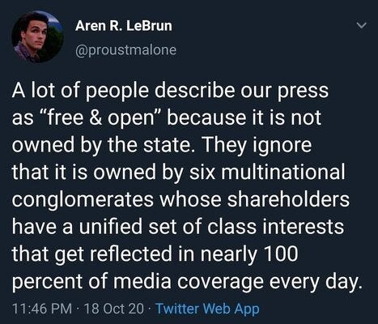
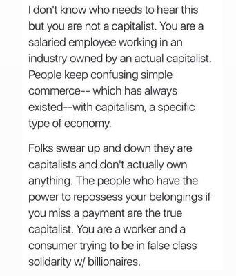
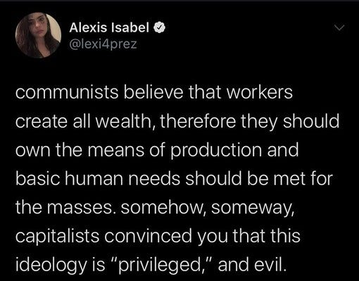
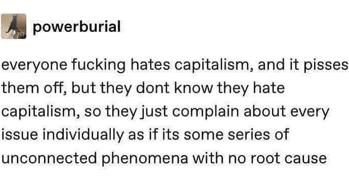
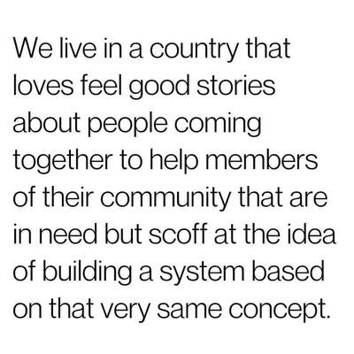
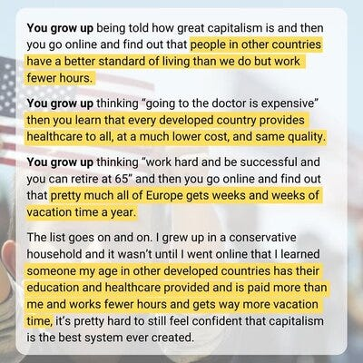
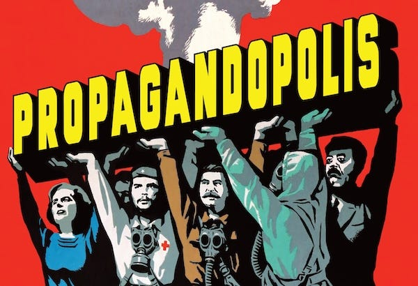

_Another ‘meme smorgasbord’ I hope you like._

## Propaganda and Media Control

The idea of a ‘free press’ becomes questionable when you realise that media ownership is concentrated in the hands of a few billionaires with shared class interests. Understanding how information is controlled helps explain why certain stories about how the world have become the norm.

The pattern is clear: information that might help people question existing power structures gets filtered out, whilst narratives that serve corporate interests get amplified. This isn't accidental, it's a sophisticated system designed to manufacture consent for an exploitative economic order.

## Class Consciousness and False Identity

Most working people have been convinced they're temporarily embarrassed millionaires rather than members of an exploited class. This misunderstanding of one's actual position in the economic hierarchy serves those who benefit from keeping workers divided and powerless.

Recognising your actual class position is liberating: you're not failing at capitalism, you're succeeding at being exploited by it. Building solidarity with other workers, rather than competing for scraps, is the first step toward meaningful change.

## Reframing Common Concepts

Many ideas we take for granted — like the notion that poverty reflects personal failure or that work must be miserable — actually serve to maintain an unjust system. Challenging these assumptions reveals how deeply capitalist ideology has shaped our understanding of human nature and social organisation.

Once you realise that suffering isn't inevitable but engineered, you can start imagining alternatives. The system depends on us believing that things like precarity, overwork, and commodified leisure are natural rather than political choices.

## The Nature of Socialism/Communism vs. Propaganda

The gap between what socialism actually means and what people think it means reveals the effectiveness of capitalist propaganda. When socialist ideas are presented without the loaded terminology, they often sound perfectly reasonable, even to conservatives.

The irony is that most people already support socialist policies when they're explained in plain English. The propaganda war isn't about the ideas themselves, it's about preventing people from connecting their frustrations to their systemic cause.

## Systemic vs. Individual Solutions

We're encouraged to see social problems as individual moral failings rather than systemic issues requiring collective action. This keeps us focused on charity rather than justice, treating symptoms rather than addressing root causes.

The same impulses that drive mutual aid and community support could power systemic change, if we weren't constantly redirected toward individual solutions. Moving from charity to solidarity means addressing the systems that create problems rather than just managing their effects.

## Political Theatre and False Choices

The mainstream political system offers the illusion of choice whilst ensuring that fundamental economic arrangements remain unchanged. This keeps people engaged in meaningless debates whilst real power remains concentrated in corporate hands.

Electoral politics serves as a pressure release valve, channeling popular frustration into safe outlets that don't challenge corporate power. Real change requires moving beyond this managed opposition toward genuine alternatives.

## International Comparisons & ‘American Exceptionalism’ Myths

The narrative of American superiority falls apart when you compare actual living standards, working conditions, and social outcomes with other developed countries. This comparison reveals that the ‘greatest country’ rhetoric serves to prevent Americans from demanding what people elsewhere take for granted.

The international perspective is radicalising because it shows that alternatives aren't just theoretical, they're working right now in other places. American exceptionalism exists mainly to prevent Americans from demanding the standards of living that other developed countries provide as basic rights.

## Deprogramming

Deprogramming is a process of identifying the propaganda and seeing the negative purpose behind it, of unlearning the false narratives you have been taught thousands of times, and accepting the reality of the world as it really is.

Here are some further links that may be of interest:

[Deprogramming From The Cult Of Capitalism](https://millennialfesto.wordpress.com/2017/01/25/deprogramming-from-the-cult-of-capitalism/)

[Recovering From Internalised Capitalism](https://forge.medium.com/7-methods-for-recovering-from-internalized-capitalism-1b23e9c238e8)

[Deprogramming From Capitalism](https://www.youtube.com/playlist?list=PLryGaL6vSWrHV2xWMyQV-DGvQeWGVyO_Y) (video series)

[Escaping The Global Industrial Death Cult](https://collapsecurriculum.substack.com/p/escaping-the-global-industrial-death?utm_source=%2Fsearch%2Fdeprogramming%2520capitalism&utm_medium=reader2)

[Is Capitalism A Cult?](https://crammingfortheapocalypse.substack.com/p/is-capitalism-a-cult?utm_source=%2Fsearch%2Fcapitalist%2520cult&utm_medium=reader2)

You and your friends can play [The Cult Of Capitalism RPG Game](https://funonegames.itch.io/cult-of-capitalism)!

Subscribe

[Share](https://peacefulrevolutionary.substack.com/p/recognising-capitalist-propaganda?utm_source=substack&utm_medium=email&utm_content=share&action=share)

