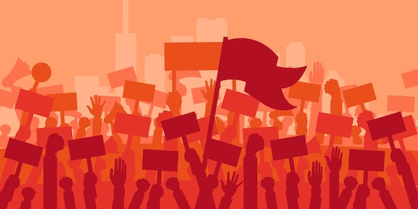
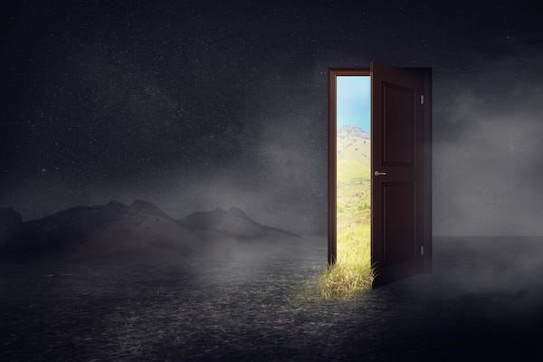

## The Problem

We all know the situation we’re in. The world is diving headlong into authoritarianism and environmental disaster, which will likely lead to economic and social collapse, with immense human suffering and ecological devastation, unless radical changes are made in the near future.

But we don’t need to worry. Do we? The politicians will fix it, right? Next time our votes will matter, the right leaders will get into power, they’ll pass the right policies, they’ll ignore their corporate sponsors to focus on our needs, and urgently tackle the world's environmental problems. After all, what else can we do but hope for others to fix these problems for us? We have no power.

No. That just won't do. If that was going to work it already would have. Waiting to vote, and expecting politicians to fix our problems, is not a realistic plan. Our freedom and the world is in urgent danger right now, the window of time to make major changes is shrinking rapidly, and we can’t rely on our government to fix it. So what can we do?

The world’s history is full of examples of rapid evolutionary change. In fact, many biologists now believe that evolution often occurs in relatively short bursts — known as punctuated equilibrium — in response to sudden environmental challenges. These changes can quickly become the new norm for a species until another shift occurs.

Likewise many human revolutions have arisen over seemingly short periods of time, and made substantial changes very quickly. Of course under the surface the elements for these changes were often brewing, and often all it has taken is one action from the disempowered (or over-reaction from those in power) to create a tipping point, which rallies great numbers of the previously apathetic and disaffected to the cause, and overthrows the old order and power structures.

Some examples of this are: 

  * **The Haymarket Affair (1886)** – A peaceful rally for an 8-hour workday in Chicago turned violent when a bomb was thrown during a police crackdown. The aftermath led to the execution of eight anarchists, but the event also brought attention to labor rights and contributed to the eventual 8-hour workday.

  *  **The Suffragette Window-Smashing Campaign (1908–1914)** – Frustrated by the slow progress of peaceful protests, suffragettes, led by Emmeline Pankhurst, escalated to public disruptions. This captured public attention, leading to partial women’s suffrage in 1918 and full suffrage in 1928 after WWI.

  *  **The Montgomery Bus Boycott (1955–1956)** – After Rosa Parks was arrested for refusing to give up her seat, black communities in Montgomery boycott segregated buses. This event sparked national attention, leading to the Civil Rights movement's growth and the eventual end of segregation with the Civil Rights Act of 1964.

  *  **The Stonewall Uprising (1969)** – A police raid at the Stonewall Inn in NYC led to spontaneous protests from patrons, marking the beginning of the modern LGBTQ+ rights movement. This sparked the first Pride march a year later and led to legal changes, including the declassification of homosexuality as a mental illness by 1973.

  *  **The Fall of the Berlin Wall (1989)** – Mass protests and government missteps led to the Berlin Wall's sudden opening on November 9, 1989. This moment marked the collapse of East Germany's authoritarian regime and symbolised the end of the Cold War.

  *  **Mexico – The Zapatista Uprising (1994)** – The Zapatista Army launched an armed uprising on January 1, 1994, protesting NAFTA’s impact on Indigenous communities. While short-lived, the uprising highlighted economic marginalisation and brought international attention to Indigenous rights in Mexico and led to an autonomous region of Chiapas being established.

These are but a few of hundreds of examples. However, In every example the people on the side seeking freedom or rights were breaking the law, those fighting against them were keeping the law, and the government was enforcing repressive laws and their power to oppress.

## The Ideal

Those who longed for a life outside of work rioted and eventually had their demands met, those who wanted the right to take part in politics carried out property damage, those who wanted civil rights boycotted and practiced civil disobedience, those who didn’t want to be persecuted and jailed for their love rioted and marched and change the narrative, those who wanted walls to come down tore them down, and those who wanted to maintain their autonomy secured it.

Each of them had an ideal, and nothing less than that ideal would do. There were no compromises to be made when it came to their rights, and they didn’t let up their pressure until those rights were granted or acknowledged, even though that meant opposing the government to achieve this.

Many of these steps forward built on the gains of previous changes, and for many of those who fought for such change these advances were always meant to be stepping stones on the road to a better, fairer world. They hoped initially that reform would be a path to get there, and if that failed they were prepared to revolt and – in some cases – overthrow the powers that kept them oppressed.

But the star many of these people were ultimately reaching for was a world without poverty, without state prejudices and violence, and the goal among the most radical was a world without rulers and borders, where peoples value and access to what they need wouldn’t be determined by money, and in which society was based on co-operation and mutual aid (rather than our current system of competition between the rich).

We need a world in which we make the decisions for our lives, our supportive communities make the decisions that affect them for themselves, where what we need is produced for need not profit, where we can go wherever we need to, be whoever we want to be, can enjoy clean air and water, and live long healthy lives around those we love.

The threats and stakes today are more important and urgent than ever because we don’t have time for slow reformism. The earth, its planets and animals won’t endure our pollution and waste forever, nor can people endure the loss of their rights and the increasingly poor situation they are living in indefinitely, especially as such situations get worse.

It isn’t just a time for averting what we _don’t_ want but for achieving what we _do_ and doing all _we_ need to in order to get there.

## The Process

We cannot be free without other people. The person who lives unknown and undisturbed in a cave may live without hierarchy and compulsion for a while, but they also live without sunlight and friends. They are always in danger of the extremes of nature, and if their cave happens to hold some rare ore they are in danger of someone throwing them out to get at it.

We are all reliant on one another, no matter how self-sufficient some want or claim to be. It took parents to make us, it takes farmers to plant and harvest our food, someone building our house for us to have a home, and a seamstress to sew the clothes and blankets that keep us warm. For most of human history these tasks were done without compulsion and offered as gifts, freely, because they are needed by everybody.

If you pay people to do this work they are invested in it until it is finished, but if a community builds it they are always invested in it, because it and us are part of their lives. This doesn’t mean every kind of community suits everybody, but communities and co-operation were responsible for everything good our species has accomplished. Whereas the perversion of this – competition based on amassing things, property and wealth – has led to worse outcomes for humanity, and has produced results to the detriment of our friendships, families, health and planet.

We are so used to money being the determining factor in things getting done that we forget about our more communal past, or presume that it was similar to our situation now, but using favours instead of coins. Yet, the idea that people used to barter and trade for everything is a recent idea, and makes no logical sense when you think about it, because someone only needs boots from the shoemaker once every couple of years, but the shoemaker needs food every day. So where did the theory of barter originate? From those trying to justify modern inequality of power and wealth – who never studied anthropology or archeology or even looked at early history – who made up the myth that we were once part of isolated violent tribes that competed for scarce resources, and they have used that false idea to justify every injustice since.

The challenge for us is to extricate ourselves from our dependency on systems which control and do us harm. We have to build the world we want in the shell of the one we are in, or those of us who remain will have to face trying to do so in its ruins after economic and ecological collapse. How do we do this?

## The Challenge Ahead

A new world begins with you, your family, your friends, your comrades and allies, your workplace and your neighbourhood. We may be seeds carried on the wind, but with good soil and tending, a barren field can turn into a beautiful one, full of every variety growing up alongside each other.

Start by looking at what is already around you, no need to reinvent what others are already working on and could use your help with. There are meetups and event listings online or sometimes pinned up on notice boards in libraries and social centres. If you don't fit in with one project that’s fine, there are plenty of other areas that need addressing. A simple idea for finding like-minded people is to start a local radical book club, such clubs are often the backbone of radical groups. Don’t forget the social aspect of all get-togethers too, if there is no music in your revolution, those who like to dance won’t consider it worth joining.

The structures we build should reflect our values: co-operatives of co-operatives, communes of communes, confederations of federations. Such groups don’t need anyone to make decisions over anyone else, as there are other models that can be effective without empowering would-be-rulers. Likewise, although such groups are important in themselves, their capacity for enabling greater change will grow through cooperation with other groups with similar aims, but without any group that tells other groups what to do, even if they help coordinate, request, or offer assistance and expertise. 

So beyond study and social activity what can such groups actually do and accomplish? What is included in the ideal of building a better world from within the one we are in? How do we live now as we start to live in the future? We do it by meeting each other's needs without (where possible) enriching capital or relying on the state. By creating spaces, relationships, and systems that embody our ideals today, we demonstrate that alternatives are possible and develop the skills needed to sustain them.

This is called prefiguration, and it isn't just an abstract principle but a practical necessity. Each cooperative formed, each consensus decision made, each community garden planted is both resistance to the current system and a building block of the world we're creating. Prefiguration turns abstract ideals into lived experience, showing that another world isn't just possible – it's already emerging

One area of prefiguration in which I’d love to see more progress is that of free access to food through collective food production. Food security is often forgotten when it comes to revolutionary action, but others' control of your food supply is the easiest and quickest way for them to force compliance and fragment any movement. Farmers are already used to co-operatives: grain cooperatives, harvesting cooperatives, even energy cooperatives exist among farming communities. But there is also great potential in yards and gardens, bringing food production back into our neighbourhoods.

As far as dealing with challenges in your organisations does, the idea of everyone and (almost) everything being accepted is a wonderful one, but you may need some red lines made clear from the start. I imagine most of those reading this will share similar red lines when it comes to unacceptable behaviour such as abuse, racism, and sexism. It may be possible to help teach or provide therapy to people who struggle in some areas, but smaller groups will likely not have the expertise and resources, and it is of the utmost importance to ensure safety, especially for those more vulnerable.

As an Anarchist, my red line is hierarchy. As far as anything I'm directly involved in supporting — if there is a person in charge, I'm out — even if they offer to make me the person in charge. I'm willing to admit my limitations and I respect others' skill and expertise, and I will defer to them in those areas, but never give them power over me because of it. I may work with and alongside people who are in different kinds of organisations, but I won't put myself in a position where I am subordinate. When it comes to preferences, I try to avoid things which I feel just divert energy and attention from the problems, challenges, and positive possibilities at hand. _(You may have more tolerance and patience for this than I do, but I’d encourage you to question anything that might divert you away from your ideals and goals.)_

I also fear that any group that spends time involved in party politics is wasting their precious time and efforts. Sure, you may find allies from lots of different areas, including those already politically engaged, and that's fine, but I believe that the world won't change for the better through elections and that they are more a distraction than any good they can do for us. I'm not saying there haven't ever been successful ‘fronts’ or platforms that worked through political processes, but I'm wary of anything that claims ‘once we get into power we can make these changes.’ That isn’t prefiguration, that is forestalling progress. Because they may never get into power, and if they do, they'll almost always inevitably have made such moral sacrifices to get there that preserving power eventually becomes the most important part of the organisation’s existence.

Building this new world is challenging, but by focusing on direct action, mutual aid, and horizontal organisation, we create not just resistance to the current system, but the foundations of the world we wish to live in.

## The Potential

I can’t be certain what a better world might look like to you, but I imagine it would be one absent of the fears and anxieties that you experience now, and full of the abundance of life you long for. However, I’ll try and imagine how it might look for just one person thirty years from now, and put us in their shoes, to try and illustrate some of the possibilities.

You wake up thinking, ‘I’m excited to go to work today’. Really! You just had your usual three day weekend, you could have made it four or more days off if you wanted, but there is something you’ve been looking forward to getting back to working on. You know that people who feel as interested in the project as you will be taking part, and you like helping and feel like you make an important contribution. Maybe next year you’ll decide to do something different, but for now this is enjoyable and is something you really feel makes a positive difference to others who need it.

Before taking the tram into the workshop, you take a leisurely stroll to the neighbourhood cafe. Some of your friends are already there, some of them are the ones cooking today. Of course none of them has to do this, they don’t get any money for it, but then you don’t pay any money for the lovely food you get either. They receive pride in a meal well cooked, and you give your appreciation for the tasty food you receive. Money? It seems silly that anyone ever used it before. Maybe in some rudimentary way it once helped track distribution but now there are better systems for that which lead to less waste and hoarding, and besides – as the saying goes – ‘anything that can be created by money can be destroyed by it’, and that’s what ultimately happened, so society is better off without it.

You spend a good six hours working on the project. That’s enough for today, some might spend longer, and come back to it later, but no-one makes them do anything. Besides, you wanted to take a cleaning shift at the local community centre: the all in one recreation / library / cinema / hangout space. Putting in an hour to help out is the least you can do, it’s a great chance to hang out with your favourite cleaning crew, and check out what’ll be happening there later. Maybe you’ll stay after and see if you can finally get around to taking that crafts class you’ve wanted to, or maybe you’ll just be in the mood to have a few drinks with friends, or both.

Of course to make all of this possible there is a lot of coordination, co-operation, and organisation. But it is a very efficient system, well, as efficient as people want it to be. There are no shareholders to please, just people’s needs to meet, and it is in everyone's interests that those are met, because ‘the hand that needs help today may help you tomorrow’. 

There are little comforts and luxuries too of course, they are just more evenly distributed than they were in the old world. For example, your friend Bob, who just got married, had an amazing honeymoon. They took the blimp to the islands, stayed in an amazing place right on the beach, enjoyed every convenience, and filled their time with incredible activities. Why people thought we’d miss out under our decentralised moneyless system you’ll never know. You guess they must have feared the unknown, and clung to the dysfunctions they knew, even if they hated them. It is true that there are no longer the rich who monopolise such things, but there is a sustainable planet so it seems a reasonable trade off.

Now, there are no homeless, no hungry, except in the history books, and there is very little anti-social behaviour. People haven’t suddenly become perfect, but as someone once said, ‘conditions determine outcomes more than choices do’, yet nowadays you feel your choices are more meaningful and impactful, and the outcome is a life that is far more full and fulfilling.

You are old enough to remember when this wasn’t the way everything worked, when people worried where their next dollar was coming from, and if they could keep a roof over their head. When those who enjoyed some comfort had it paid for by the exploitation of people halfway across the world in sweatshops and mines. 

Leaving that dystopia took a lot of organising, a lot of hard work, and overcoming a lot of challenges, including dealing with some violence, albeit mainly from those scared of losing their wealth and power. But it was worth it. Maybe there is less cheap plastic crap around now, but it’s a small price to pay for a world in which no-one goes to bed hungry, and a world that will last a lot longer and in which there is still some nature to enjoy.

Subscribe

[Share](https://peacefulrevolutionary.substack.com/p/a-new-world-within-the-old?utm_source=substack&utm_medium=email&utm_content=share&action=share)
