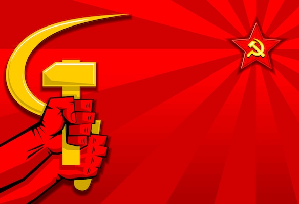
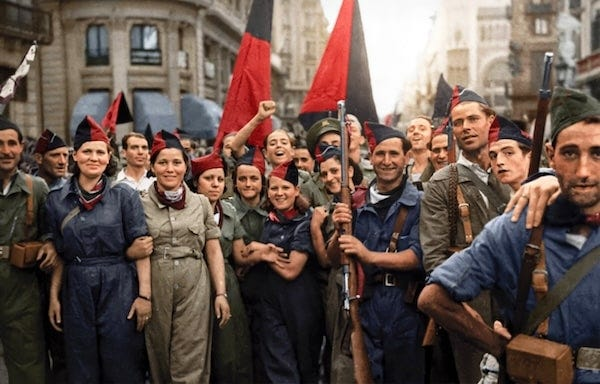

## Choosing Statelessness

I realised when I began work on my recent [Choose Your Own Utopia](https://peacefulrevolutionary.substack.com/p/choose-your-own-utopia) post that I would need to be careful to treat different views than my own fairly and accurately, including views I completely disagreed with.

Many people with very different ideologies than me have since taken these tests, and the results generally led them to the philosophical / political labels they already identified with - which suggests the approach worked, even when I would have preferred they'd chosen different paths

Nevertheless, I’ve continued to refine and expand the web version to add more context and detail to make it clearer, more informative, and to show why different choices lead to different outcomes. The latest ‘playable’ version is [available here](https://hnrjx4f6.play.borogove.io).

In the scenario readers were given they started with a blank slate and were ‘tasked with building a new society from scratch’, and the very first question they were asked was how decisions should be made.

They could choose to return to continue our current system of ‘elected representatives’ making decisions, to let ‘natural leaders and experts’ guide, to have ‘traditional or religious authority’ lead, or refuse to make a decision.

But instead many people chose to let ‘everyone should participate equally [in decisions] with no rulers’ and this was what set them upon the anti-authoritarian path, each version of which leads to some degree of freedom from rulers and states.

Perhaps I shouldn’t have been surprised with the current crisis of faith in the world’s presidents and prime ministers that so many have given up on the idea of governments and politicians being the solution to our problems.

However, it has certainly been an unexpected result to many who took part that their choices led to being categorised as ‘libertarian socialists’1. This confusion stems partly from the way American right-wingers have misappropriated the word ‘libertarian’, and partly from how many people have come to associate 'socialism' with authoritarianism. But [the word libertarian](https://peacefulrevolutionary.substack.com/p/taking-back-libertarianism) originally meant stateless, anti-authoritarian socialism - encompassing everything from union-based workplace ownership all the way to the anarchist form of communism.

So what were people actually choosing when they selected these anti-authoritarian options? By deciding not to be ruled over in their ideal world they weren’t choosing chaos (or nihilism - which was another option), but a way of organising society without oppressive hierarchies. There are many labels for the different kinds of systems which exist under this umbrella, each of them is a kind of anarchism, not chaotic, not lacking organisation, but organised from the community upwards, without one group taking power over another.

The fact is that many - perhaps most - [people don’t want other people to rule over them](https://peacefulrevolutionary.substack.com/p/are-you-an-anarchist-the-answer-may), they just see that as the reality of the system they live in now, or fear that it is an inevitability, but it is often not their ideal. 

As someone who shares those views it has been reassuring to see people assert their belief in the power of people and communities to make change without waiting on political parties gaining and using power, which power is so often not used in the interests of the people who vote them in. That - despite some confusion over terminology - many people instinctively favour anti-hierarchical solutions when presented with practical choices about how society should work.

## The Benefits Of Stateless Socialism

From a stateless socialist perspective, there are several compelling arguments for why stateless socialism generally might be considered the ‘best’ approach for maximising freedom and minimising the possibility of abuses of power, especially when faced with the moral and practical questions we face as a society. So let’s explore why stateless socialism addresses the core concerns that matter most to people: freedom, fairness, human potential, real-world examples, efficiency and sustainability.

###  **Freedom Arguments**

The primary question of ‘Who should make the decisions that will shape our future?’ is one of how much freedom we should or can have and how much is good for society. What does stateless socialism promise in this area that differentiates it from other systems?

 **True Individual Liberty** : Stateless socialists argue that capitalism creates false freedom - you're ‘free’ to choose between employers, but not free from the necessity of selling your labour to survive. Real freedom means [having your basic needs guaranteed](https://peacefulrevolutionary.substack.com/about#§entitlement-series) so you can pursue genuine self-development and creativity without coercion.

 **Freedom from Hierarchy** : Unlike other systems that replace capitalist bosses with state bureaucrats or democratic representatives, stateless socialism eliminates all forms of domination. No managers, no politicians, no owners - just free association between equals.

 **Positive vs Negative Liberty** : Classical liberals focus on ‘freedom from’ interference, but stateless socialists emphasise ‘[freedom to](https://peacefulrevolutionary.substack.com/p/a-free-society)’ - the actual capacity to realise your potential, which requires material security and social cooperation.

###  **Equality and Justice Arguments**

Building on these ideas about freedom, we must also consider what constitutes genuine fairness in society. This leads us to the question of ‘how much equality’ should our society aim for, what needs should each person be able to justly claim, and how can we ensure people’s safety and security? Here are some ways stateless socialism promises to achieve that:

 **Radical Equality** : ‘From each according to ability, to each according to need’ is arguably the most just principle possible - people contribute what they can and receive what they need, regardless of their productive capacity. This accommodates disability, age, illness, and different life circumstances without judgment.

 **Eliminates Artificial Scarcity** : We already produce enough to meet everyone's needs globally. The problem isn't scarcity but distribution - stateless socialism would eliminate the artificial scarcity created by property relations and profit motives.

 **No Exploitation** : Unlike systems that maintain wage labour (even with strong unions or welfare states), stateless socialism eliminates the fundamental relationship where some people's labour enriches others, or puts them in a master / servant position.

 **Community Safety Without State Violence** : Rather than relying on police and prisons that criminalise poverty and mental illness, stateless socialism addresses the root causes of anti-social behaviour. When basic needs are met and people have meaningful community roles, most crime disappears. Remaining issues like mental health crises or conflicts are better handled through community support and restorative justice than punishment by armed enforcers who protect property over people.

###  **Human Nature Arguments**

Critics often claim these ideals are unrealistic because humans are naturally selfish and competitive. But the evidence _(as I’ve covered in[previous](https://peacefulrevolutionary.substack.com/p/a-better-world-is-possible) [articles](https://peacefulrevolutionary.substack.com/p/were-we-born-evil-or-did-capitalism))_ suggests otherwise:

 **Cooperation is Natural** : Anthropological and evolutionary evidence suggests humans are naturally cooperative - we evolved in small, egalitarian bands sharing resources. Competition and hierarchy are largely artificial constructs of class society.

 **But Even If Human Nature Wasn’t Naturally Good:** human behaviour has a positive potential (or can be dissuaded from its most negative possible actions) by the right conditions and motivations, so society is best served by what encourages those outcomes, not just punishing people when they fail to conform.

 **Intrinsic Motivation** : Once survival anxiety is eliminated, people are motivated by autonomy, mastery, and purpose rather than external rewards. Most fulfilling work (art, care, research, craftsmanship) happens because people find it meaningful, not for money.

 **Social Species** : Humans are fundamentally social beings who thrive through mutual aid and community connection. Individualistic systems that pit people against each other create alienation and mental health problems.

###  **Historical and Empirical Arguments**

These aren't just theoretical points - we have real-world evidence to draw from:

 **Actually Existing Examples** : From the Paris Commune to Revolutionary Catalonia to modern-day Rojava and the Zapatistas, there are real examples of stateless/anarchist socialist principles working in practice, often under extremely difficult circumstances.

 **State Socialism's Failures** : The 20th century showed that state-controlled economies, even with good intentions, tend toward bureaucratisation, authoritarianism, and eventually collapse or reversion to capitalism.

 _Note: Labels can create confusion here - for example the concept of communism describes a stateless, classless, moneyless system, but no one would describe the Communist Party of the USSR as having ever achieved this, even if it was part of their original ideals. This highlights how state socialist movements, despite their names and intentions, fundamentally contradict their own stated goals by concentrating power rather than dissolving it._

 **Capitalism's Contradictions** : Rising inequality, climate crisis, recurring economic crashes, and alienation suggest capitalism is reaching its structural limits and needs replacement rather than reform.

###  **Practical Efficiency Arguments**

The ‘capacity for technological and social advancement’ has to be married with workers being treated with dignity and living fulfilled lives, so that human creativity and innovation can flourish without the artificial constraints of profit maximisation and hierarchical control. Beyond questions of justice and freedom, stateless socialism also offers practical advantages in terms of efficiency and innovation:

 **Eliminates Waste** : Capitalism requires enormous waste - planned obsolescence, advertising, financial speculation, military spending to protect property. A stateless socialist society could redirect all that labour toward actually useful production, through federated co-operation rather than maximising shareholder profit.

 **No Transaction Costs** : Think about how much human talent is currently absorbed in moving money around, calculating who owes what to whom, and enforcing contracts. Eliminating money, markets, and property rights removes the massive overhead of banks, insurance, lawyers, accountants, and bureaucrats needed to manage private property relations. All those brilliant minds could be developing medical treatments, renewable energy, doing good instead of managing financial paperwork.

 **Decentralised Resilience** : [Networks of autonomous communities](https://peacefulrevolutionary.substack.com/p/i-pencil-the-true-story) are more resilient than centralised states or global supply chains. Local production for local needs with voluntary coordination reduces fragility. If one community faces problems, neighbouring communities can help without waiting for government approval or market incentives to align.

###  **Environmental Arguments**

Perhaps most urgently, we face an environmental crisis that requires us to fundamentally rethink our relationship with the natural world. We need to exercise ‘ecological responsibility’ if we hope to preserve human life, respect animal life, and the natural world we all depend upon:

 **Beyond Growth** : Capitalism requires infinite growth on a finite planet, leading to ecological collapse. Stateless socialism can aim for sufficiency and sustainability rather than accumulation.

 **True Cost Accounting** : Without profit motives, communities can make decisions based on actual environmental and social costs rather than [externalising them](https://peacefulrevolutionary.substack.com/p/what-are-the-real-costs) onto future generations.

 **Local Stewardship** : When communities directly depend on their local environment for sustenance and wellbeing, they have every incentive to protect it. Unlike distant shareholders who never see the pollution their investments create, people living where decisions are made will choose clean air over short-term profits.

 **Appropriate Technology** : Democratic communities can choose technologies that serve human and ecological wellbeing rather than profit maximisation.

Taken together, all these arguments suggest that stateless socialism offers a comprehensive alternative that addresses the interconnected crises we face today. It promises genuine freedom rather than the illusion of choice, real equality rather than managed inequality, cooperation rather than artificial competition, proven models rather than untested theories, efficient resource use rather than wasteful bureaucracy, and ecological harmony rather than environmental destruction.

##  **Why Not Other Systems?**

These advantages help explain why so many people in the test chose stateless socialist options when presented with practical choices about organising society.

So why did many people not choose other systems? Perhaps because they already have plenty of examples of their failures and lack faith that repeating the same approaches will lead to different outcomes. When every alternative on offer feels like a variation on existing power structures, it's hardly surprising that people gravitate toward something genuinely different. Let's look at why the main alternatives fall short:

 **Market Capitalism:** (from Neo-liberalism to right-wing ‘libertarianism’) Promises that deregulated markets will solve all problems, but we've seen decades of growing inequality, environmental destruction, and economic instability. The ‘[invisible hand](https://peacefulrevolutionary.substack.com/p/reasons-to-hate-capitalism)’ seems quite good at picking the pockets of working people whilst concentrating wealth upwards, and that wealth having an increasing influence on political power.

 **Social Democracy** : _(Which was quite a popular choice)_ Still depends on capitalist exploitation, and just redistributes some of the proceeds. The welfare state can be rolled back and corporate interests can take more of an influential role (as we've seen since the 1980s) and doesn't challenge fundamental power relations.

 **State Socialism** : Concentrates power in party bureaucracies that become new authoritarian ruling classes. Central planning lacks the local knowledge needed for efficient allocation and democratic participation.

As for fascism, military dictatorships, and other overtly authoritarian systems - their failures in terms of human freedom and wellbeing are so obvious they hardly need detailing here. _(Nevertheless, I have added to the web version of my Utopia article reasons for people to reconsider choosing them.)_

### The Counter Perspective

This brings us to a fundamental question: if many, perhaps even most people prefer self-determination to being ruled, why do we accept systems that concentrate power in the hands of a few?

Well, critics would argue that the idea of a stateless society is an impossible utopian ideal that ignores coordination problems, free riders, human selfishness, and the need for specialisation in complex societies. They'd point to the small scale and often brief duration of anarchist experiments as evidence they can't work long-term or at large scale.

But these criticisms treat our current way of organising society as if it's natural and inevitable, rather than something that developed historically and could change. They also underestimate how cooperative humans can be when the conditions are right, and how new technology could enable forms of organisation we've never had before.

 **The Practicality Problem** : One of the biggest objections to stateless socialism is practicality - even if what we have doesn't work perfectly, it does exist and perpetuate itself. Stateless socialists see this as precisely the problem: such hierarchal power structures will always prioritise their own survival above everything else, ultimately prepared to use violence against anyone who undermines their economic base and legitimacy.

As I’ve remarked before: ‘The road to a peaceful world will probably be a violent one. Not because those who want peace want violence. But because those who have power over others won’t give it up peacefully. (Nor will those who hoard capital let it lose its value without a fight.) So otherwise peaceful people will have to defend and protect themselves - To have a chance to build a better peaceful world.’

 **Building Alternatives Now** : However, stateless socialist principles can be practised today2 through mutual aid networks, worker cooperatives, community gardens, and other forms of dual power that build the new society within the shell of the old. This includes training and preparing to protect and defend the freedoms asserted through such efforts. Unlike reformist approaches that get co-opted, or vanguardist approaches that create new elites, stateless socialism offers a path to fundamental transformation through direct action and horizontal organisation.

## The Power Problem

The past examples of state socialists gaining power would seem to some to be a solution to this problem, but that brings us to perhaps the most fundamental issue of all: the problem of power itself. The fundamental question for anyone who supports hierarchical systems is: what stops the person with the most power using it in ways you don't like, potentially taking away the freedoms you currently enjoy?

You might say power could be divided between a council, but what happens when a majority of that council decides to rule together as co-dictators, or one member convinces the others to grant them more authority? You might hope for the larger political party to dissolve such a council, but the council can split opposition by promising rewards to loyalists whilst threatening dissidents, or by framing any challenge to their authority as betrayal of revolutionary principles, or by gradually placing their allies in key party positions until opposition becomes structurally impossible. Even internal party democracy fails when dissenters are expelled as counter-revolutionaries, when debate is stifled as divisive to unity, or when party congresses become theatrical performances rather than genuine decision-making bodies.

This isn't a new problem. In ancient times, benevolent kings gave way to more insecure, unhinged or greedy heirs that ruled with terror. Within capitalist representative democracies, this process of corruption is called the Iron Law of Oligarchy - the inevitable influence of economic power on political power, leading such 'democracies' to ultimately serve the wealthy rather than the general population.

This creates particular challenges for those who still believe in [working through state power to achieve socialist goals](https://peacefulrevolutionary.substack.com/p/hierarchy-and-revolution), because stateless socialism offers the only political system that maximises both individual freedom and collective wellbeing whilst being environmentally sustainable and genuinely respecting everyone's freedom and will.

### Questions for State Socialists

All this raises serious questions for those socialists who believe we must work through governments to achieve lasting change. If you support using state power to achieve socialism, consider how you would respond to these scenarios:

 **On State Capitalism:** Your party leadership says the only way to build socialism is to become efficient at capitalism first. They want you to help shut down worker co-ops and communes, break up trade unions, and funnel ‘unskilled’ labour to more industrialised work. Do you go along with this? If you refuse, what's your reasoning?

 **On Environmental Harm:** The party decides your region needs a new oil refinery, even though the local community is already choking from pollution from the coal plant next door. You're asked to help make it happen. Do you? What would make you say no?

 **On Democratic Rights:** Your party leader wants to scrap internal elections and make themselves leader for life, claiming it's what the revolution needs. They're asking for your support. Do you give it? If not, how do you justify that?

 **On Starving Dissent:** A region has been resisting party policies, so leadership decides to cut off their grain shipments ‘to teach them a lesson.’ You're responsible for distribution in that area. Do you follow orders? What would stop you?

 **On Socialist Invasion:** The party wants to invade a neighbouring socialist country that's got resources you need and sits in a strategic location. The people there are peaceful, but you're told it's for the greater revolutionary cause. Do you support this? Where do you draw the line?

 **On Eliminating Rivals:** Party leadership says the anarchists are sabotaging the revolution and asks you to help eliminate some of their key organisers. Do you do it? What makes political violence acceptable or unacceptable to you?

 **On Betraying Friends:** Your best mate gets accused of being disloyal to the party. Leadership wants you to arrest them, knowing full well they'll end up tortured in some remote prison camp. Do you hand over your friend? What would you need to believe to justify it?

 **On Mass Killing:** The party tells you to bomb a nuclear facility in an enemy country, which would kill hundreds of thousands of innocent people. They say it's necessary for the revolution's survival. Do you carry out the mission? How do you decide what's too far?

 **On Personal Dignity:** Your party leader demands you perform humiliating acts of submission daily to prove your loyalty to the cause. Do you comply? At what point does revolutionary discipline become simply abuse?

 **On Ethnic Cleansing:** Leadership declares that ethnic minorities in your region threaten socialist unity and orders you to help round them up for ‘re-education camps.’ Do you participate? How do you balance collective goals against protecting vulnerable people?

These scenarios might seem extreme, but they reflect the actual choices faced by socialists who've supported state power throughout history. The real question underlying all of these dilemmas: If you find yourself saying no to any of them, what does that tell you about the limits of state power? And if the party can be wrong about these things, what makes you confident they're right about the fundamental approach of using state power to achieve socialism?

At what point would any of these actions cause the party to stop living up to its socialist ideals - or even cease to be socialist at all? And what do you think would happen to you personally for saying no in any of these situations?

 **The State Socialist Track Record** : When we look at countries where socialist parties have gained and maintained state power - whether China, the Soviet Union, Cuba, or others - we see they've often been successful at certain things: building industrial capacity, military strength, and centralised authority. But have they been successful at socialism? Are workers managing and owning their workplaces? Have they moved toward communism - a stateless, classless society? In every case, [the answer is clearly no](https://peacefulrevolutionary.substack.com/p/justification-for-hierarchy-under).

When this happens it isn't an accident or a temporary setback. The betrayal of socialist ideals was inevitable given the authoritarian structure of state socialism. _To quote from[another article](https://rosesandresistance.substack.com/p/socialism-vs-tankies):_ Instead of recognising that seeking state power was the problem in the first place, many socialists have decided the issue was simply that their preferred leaders weren't in charge, or weren't in power long enough, or didn't have enough power. They're still fighting the last war, still convinced that if only they could seize the state, this time it would be different.

But it won't be different. Power corrupts, and absolute power corrupts absolutely, whether wielded by capitalists or commissars. Real freedom, real socialism, real communism can only come from below, through the self-organisation of working people themselves. Everything else is just another form of exploitation.

Subscribe

[Share](https://peacefulrevolutionary.substack.com/p/why-stateless-socialism?utm_source=substack&utm_medium=email&utm_content=share&action=share)

1

Stateless / libertarian socialism is from there subdivided into several different kinds:

  * [Anarchy-Communism](https://anarwiki.org/wiki/Anarcho-Communism)

  * [Anarcho-Mutualism](https://anarwiki.org/wiki/Mutualist_Economics) (& [Market Socialism](https://anarwiki.org/wiki/Market_Anarchism))

  * [Anarcho-Primitivism](https://en.wikipedia.org/wiki/Anarcho-primitivism)

  * [Social Ecologism](https://anarwiki.org/wiki/Social_Ecology)

  * [Democratic Confederalism](https://en.wikipedia.org/wiki/Democratic_confederalism) (& [Libertarian Municipalism](https://anarwiki.org/wiki/Libertarian_Municipalism))

  * [Syndicalism](https://anarwiki.org/wiki/Syndicalism)

  * & may also include [Council Communism](https://anarwiki.org/wiki/Council_Communism) & other forms of Libertarian Marxism

2

For articles related to such a transition see:

  * [Resisting Oppression and Making Friends](https://peacefulrevolutionary.substack.com/p/resisting-oppression-and-making-friends)

  * [Challenging Power](https://peacefulrevolutionary.substack.com/i/152246344/challenging-power)

  * [Anarchist Revolutionary Methods](https://anarwiki.org/wiki/Anarchist_Revolutionary_Methods)

