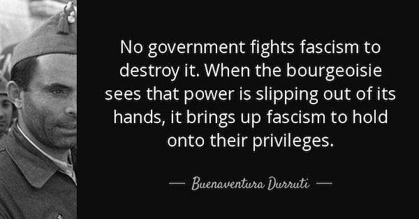
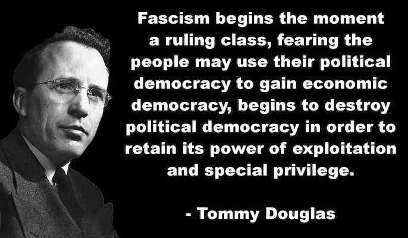
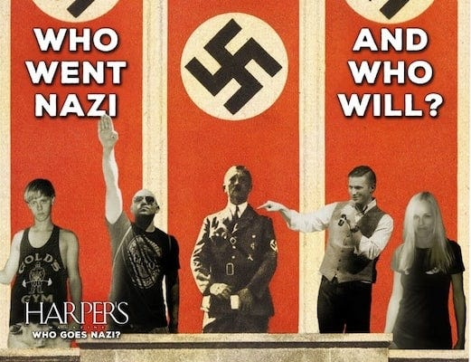
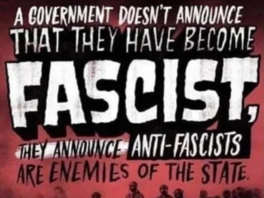

## So You Don't Want To Be A Fascist?

So you don't want to be a fascist? That's great! It seems simple enough - just don't be a fascist.

When a sign goes up saying ‘Join The Fascists here‘ you just don't turn up there, don't sign up, and don't go to their meetings. If they go door to door asking if you want to join them you can pretend you're not home. Just refuse to open the letters from the fascists drafting you into their army. That'll work right?

Maybe not. Because when they turn up at your house to pressgang you into service then their guns can be very convincing at getting you to go with them. Likewise, if you have children who go to school you might just find that one day they come home telling you they've been inducted into the new fascist youth club, and wondering if they should report you for your disloyalty.

You might decide then to just pretend to be a fascist, telling yourself that at least your heart isn't in it, that they didn't win over your mind, all while standing on the fascist side of the frontline, with bullets whistling all around you, wondering whether it would be safer to shoot back at someone who isn’t really your enemy, or face your fellow soldiers (who may be) if you don't.

Or maybe you'll stand up and speak up at the last minute, by which time your place in front of a firing squad is certain. Then you may be left wondering what you could have done early to have avoided all this, to have helped avoid it all happening while you still had a chance.

By then you may have learnt the lesson that avoiding being a fascist in your heart and mind is one thing, but avoiding enabling fascism is another, and opposing it is something else.

## My Introduction To Fascism

Like most students of my generation, I read _The Diary of Anne Frank_ at school and was devastated as I learnt about the horrific human cost of the Holocaust, and extremely angry at all those who allowed it to happen. But it remained, for me, a historical tragedy, until years later when I encountered a survivor face to face.

While I was working at the city library, an elderly man asked me for help using our computers to search for old friends. This seemed routine until I noticed the website address on his crumpled piece of paper, it was a database of concentration camp victims, and glimpsed the tattoo on his forearm as he struggled with the unfamiliar website.

That day he saw the names and sometimes pictures of families and friends he had lost half a century earlier, and he couldn't hide his mixture of grief and relief. One thing he told me that particularly stuck with me was, ‘People say they didn't exist, people say it didn't happen, but I was there, I lived, they didn't, and I always knew, and now the world can see them too.’1

Of course there were those who opposed fascism from the moment it reared its head, and those who paid with their lives fighting it. Just as there were a few who relished such cruelty from the start and eagerly took part, but far too many convinced themselves they were powerless to do anything about it, closing their eyes and ears and pretending it would all go away.

Whereas, others gradually accommodated themselves to the new horrifying reality surrounding them by degrees until they became full participants in it. Last year I watched the revival of the play _Good_ , about one such man who becomes increasingly morally compromised until he ultimately justifies his involvement in the worst atrocities of Nazism.2

As my understanding deepened, I realised that Nazi Germany wasn't a unique historical aberration. I read _Bury My Heart At Wounded Knee_ about how so many Native American tribes were wiped out, and watched _The Killing Fields_ about the Cambodian mass killings, and _Hotel Rwanda_ about the murderous rampages in that country, and I learnt that fascism wasn't an anomaly confined to 1930s Europe, it's a recurring pattern that emerges whenever conditions allow totalitarian movements to gain power through scapegoating and violence.

This pattern wasn't even foreign to the countries that would later fight Nazi Germany. America and England in the 1920s and early 30s had their own fascist movements which enjoyed substantial and notable support, but these largely fell out of favour with the advent of the Second World War.

Those of us who were living comfortably in the victorious Allied nations then enjoyed decades of relative freedom and prosperity, imagining that fascism had been permanently defeated, whilst remaining largely oblivious to the authoritarian horrors unfolding beyond our borders, sometimes with our own governments’ backing.

While it might seem that fascism ended with the Second World War, the Spanish and Portuguese knew that for many it carried on for decades longer under Franco and Salazar. If we include other totalitarian regimes, Greek communities lived under the brutal military junta from 1967 to 1974. Chileans endured Pinochet's reign of terror from 1973 to 1990, whilst many across Latin America — from Guatemala to Brazil — experienced similar authoritarian nightmares throughout the Cold War, often with Western backing when it suited geopolitical interests.

Even today, we see authoritarian strongmen consolidating power from Hungary's Orbán to India's Modi, from Bolsonaro's Brazil to Duterte's Philippines. The methods may evolve — using social media manipulation and manufactured culture wars rather than jackboots — but the fundamental playbook remains depressingly familiar.

With the recent march in London of 100,000 ultra-nationalists prompted prompted by the killing of hate-monger Charlie Kirk, and spurred on by racist grifters such as Tommy Robinson (Stephen Yaxley-Lennon) and Nigel Farage3, and amplified by divisive figures like Elon Musk, it is more important than ever not to ignore the signs of rising fascism. We must prepare to undermine it, avert it, and (failing that) resist it from within whilst working to replace it with something better. However, to do this we have to recognise the threats and how they can be effectively dealt with.

## Recognition - Understanding the Threat

To resist fascism effectively, we must first understand what we're fighting against. This requires examining both its defining characteristics and the psychological patterns that make it appealing to ordinary people.

To fight an enemy we must first know who, or what, they are. The very creator of modern fascism provides our starting point. Mussolini, who popularised the term and led the first fascist movement to power, was quite explicit about fascism's aims:

> ‘The Fascist conception of the State is all-embracing; outside of it no human or spiritual values can exist, much less have value. Thus understood, Fascism is totalitarian, and the Fascist State–a synthesis and a unit inclusive of all values–interprets, develops, and potentiates the whole life of a people.’ _(The Doctrine of Fascism, 1935)_

This isn't mere political rhetoric, it's a blueprint for total control. Under fascism, the state doesn't simply govern; it absorbs everything. Your family, your beliefs, your art, your very sense of right and wrong, they all become extensions of state power. There's no private sphere, no personal conscience independent of what the regime demands.

Philosopher Bertrand Russell, at the outset of the Second World War, described how fascist movements actually come to power:

> ‘The first step in a fascist movement is the combination under an energetic leader of a number of men who possess more than the average share of leisure, brutality, and stupidity. The next step is to fascinate fools and muzzle the intelligent, by emotional excitement on the one hand and terrorism on the other.’ _(Freedom: Its Meaning, 1940)_

George Orwell, writing the year before the end of the War, recognised the challenge of pinning down fascism precisely, but despite this difficulty, Orwell offered a working definition that cuts through the political jargon: Fascism is ‘roughly speaking, something cruel, unscrupulous, arrogant, obscurantist, anti-liberal, and anti-working class.’ Put more simply, he observed that ‘almost any English person would accept “bully” as a synonym for “Fascist.”’ _(What is Fascism?, Tribune, 1944)_

In the same year, as the Allies fought fascism across Europe and the Pacific, American Vice President Henry A. Wallace, captured the driving psychology behind fascist movements:

> ‘A fascist is one whose lust for money or power is combined with such an intensity of intolerance toward those of other races, parties, classes, religions, cultures, regions or nations as to make him ruthless in his use of deceit or violence to attain his ends.’ _(New York Times, April 9, 1944)_

These definitions, written by those who witnessed fascism's rise firsthand, reveal its core characteristics: the total domination of individual life by state power, the systematic use of lies and violence to crush opposition, and the transformation of natural human differences into existential threats requiring elimination. Fascism isn't simply authoritarianism, it's the complete subordination of human society to the whims of those who seize control of the state apparatus.

Understanding this matters because fascism rarely announces itself honestly. It doesn't campaign on platforms of ‘total state control‘ and ‘systematic oppression‘ Instead, it promises to restore national greatness, protect traditional values, and defend ordinary people against threatening outsiders. The danger lies not just in its ultimate goals, which are monstrous, but in its initial appeal, which can seem reasonable to those feeling frustrated or left behind.

We can argue over the precise definitions of Nazism and fascism, but whether something qualifies as those specific systems is less important than recognising the freedoms that are threatened under all such authoritarian, totalitarian, and dictatorial regimes. Under dystopian systems, people lose their freedom from the fear of:

  * State violence and arbitrary detention.

  * Persecution based on identity, beliefs, or associations.

  * Economic destitution and insecurity.

  * Surveillance and invasion of privacy.

And no longer have the freedom to:

  * Express dissent and organise opposition.

  * Access accurate information and diverse perspectives.

  * Move freely and associate with others.

  * Create alternative ways of living and organising society.

These systems follow a predictable pattern: they concentrate power amongst a small elite whilst systematically dismantling ordinary people's ability to influence their own lives. They manufacture artificial divisions and scarcities to keep communities desperate and turned against each other, replacing genuine discourse with propaganda whilst criminalising dissent. By design, they undermine both individual autonomy and collective power – the twin pillars essential for human liberation – because these represent the greatest threat to concentrated power.

### Why Would Anyone Go Along With This?

The question of what leads a person to accept, comply with, support, or even fight for fascism (and other oppressive systems) has always fascinated me. In my desire to understand this potential for some people to carry out such atrocities, I've read extensively on the subject, from Stanley Milgram's chilling experiments on _Obedience To Authority_ , to Daniel Goldhagen's controversial _Hitler's Willing Executioners_. I've tried to balance these explorations of humanity's capacity for evil with studies of the better angels of our human nature, such as Rutger Bregman's _Humankind_ and Peter Kropotkin's _Mutual Aid_.

Yet despite all this reading, I'm still shocked that more people don't seem to ask themselves the question that a popular comedy sketch imagines SS Officers posing towards the end of the war: ‘Are we the baddies?’ The very fact that this Mitchell and Webb sketch resonates so powerfully suggests how rare genuine self-reflection becomes once we're caught up in a movement that feels righteous and necessary. 

#### The Parlour Game of ‘Who Goes Nazi?'

Understanding fascist psychology requires examining both the individual susceptibilities that make people vulnerable to such movements and the social conditions that allow these movements to flourish. American journalist Dorothy Thompson, who witnessed fascism's rise firsthand, provided one of the most insightful analyses of this psychology in her piece _Who Goes Nazi?_ , a fascinating piece written for Harper's Magazine in August 1941.

Thompson was uniquely qualified to write about fascism, having been the first American journalist expelled from Nazi Germany in 1934 after her unflattering interviews with Hitler made her persona non grata with the regime. Thompson frames her analysis as ‘an interesting and somewhat macabre parlour game to play at a large gathering of one's acquaintances: to speculate who in a showdown would go Nazi.’

Drawing on her extensive experience in Germany, Austria, and France, she claims to have identified clear psychological types: ‘the born Nazis, the Nazis whom democracy itself has created, the certain-to-be fellow-travellers,’ as well as those ‘who never, under any conceivable circumstances, would become Nazis.’

The game works by mentally walking around an imaginary upper-class party, examining each guest's character, background, and psychology to determine who would support fascism if it came to their country. Thompson's crucial insight was that susceptibility to fascism ‘had nothing to do with class, race, or profession‘ but rather something more fundamental about personality and psychology: ‘Kind, good, happy, gentlemanly, secure people never go Nazi. But those driven by fear, resentment, insecurity, or self-loathing? They would always fall for fascism.’

Thompson's observations ring true, but we must be careful not to let psychological insights obscure the systematic nature of fascist oppression. The ultra-nationalism that characterises fascism almost invariably demonises specific racial and social groups, typically targeting anyone who doesn't reflect the demographics of the fascist movement's core supporters. This isn't merely about individual psychology, it's about creating a hierarchy of human worth that serves the movement's political ends.

I also take exception to Thompson's notion of someone being ‘born Nazi.’ While some children are certainly born into families with fascist tendencies, and we might have sympathy for those raised in environments where such worldviews seem normal, the idea of innate fascist tendencies risks excusing what are ultimately choices about how we treat other human beings. More importantly, it suggests a fatalism that contradicts everything we know about people's capacity to change, learn, and choose differently, even late in life.

Thompson's analysis provides a useful starting point, but understanding fascism's appeal requires examining the broader patterns of how these movements actually gain power and maintain support.

#### How Fascist Movements Build Support

Fascist movements don't emerge overnight, they follow predictable patterns that exploit existing social tensions and individual psychology. Understanding these patterns is crucial because they reveal both the vulnerabilities fascists exploit and the intervention points where resistance can be most effective.

These movements typically gain ground by first creating the right conditions for their message to take root. Fascist leaders emerge after instilling fear, uncertainty, and doubt in the population, elevating marginal issues into seemingly major crises, 'othering' certain sections of society, and making dominant groups feel alienated or left behind, even when they hold power.

Once these conditions exist, fascist leaders employ specific psychological tactics that prove remarkably effective. They promote shared values or goals that followers already accept, positioning themselves as allies to people who see themselves as persecuted. They make new claims that followers accept without thorough investigation, exploiting mental laziness and established tribal thinking. 

They appear relatable and trustworthy by seeming to be ‘the same kind of person’ as their followers, express anger at the same problems and people that followers already resent, channelling existing suspicions. They share similar fears whilst proposing solutions that often target groups their followers can't relate to as scapegoats, and make promises to desperate people seeking change.

#### The Dehumanisation Process

What makes fascism particularly dangerous is how systematically it transforms ordinary prejudices into eliminationist thinking. This process follows a predictable escalation that inverts reality, beginning with seemingly reasonable distinctions and ending with mass violence.

 **The escalation typically follows this pattern:**

  1. Classifying powerless people (like asylum seekers) as ‘illegal’.

  2. Labelling those who advocate for human dignity as ‘communists’ or ‘traitors’.

  3. Calling those who object to rights violations ‘disloyal’.

  4. Reframing any criticism of authority as ‘criminal behaviour’.

Throughout this process, fascist movements employ reality-inverting tactics, calling the powerless 'the elite' whilst the actually powerful claim to be ‘anti-establishment’, emphasising nationalism and religious identity to exclude others, and escalating from external enemies to internal ones whilst positioning the leader as divinely chosen.

 **Key warning phrases that prepare people for atrocities:**

  * ‘They are law-breakers’ (using laws designed to target them).

  * ‘They will replace us’.

  * ‘They have secret plans’ / ‘They are really in control’.

  * ‘We must overthrow them to take back control’ (even when ‘we’ hold power).

  * ‘Sympathy for them is misplaced’ (or ‘empathy is a sin’).

  * ‘We are segregating them for their own safety’ (then ours)

This dehumanisation succeeds through institutional complicity: the ‘just following orders’ mentality, media self-censorship, conformity pressure, lack of empathy, presuming victims ‘must have done something wrong’, and accepting injustice toward others as ‘not your concern’.

This complicity was starkly illustrated at Ohrdruf concentration camp. When General Patton ordered the mayor and townspeople to bury the dead prisoners, they knew what they were confronting. The guards had come into town during their off-duty hours to ‘brag, womanise and drink’, how could the townspeople not know? After completing 80% of the burials, the mayor and his wife hanged themselves, leaving a suicide note that read simply: ‘Wir wussten nichts! - aber wir wussten.’ (‘We didn't know! - but we knew.’)

## Resistance - Building Psychological and Social Immunity

Recognition alone isn't enough. We need practical tools to build resistance, both within ourselves and our communities. The first step in resistance is honest self-assessment. A key paradox of propaganda susceptibility is this: those who insist they are immune to propaganda are often the most vulnerable to it. If you're certain you can't be manipulated, you've likely already accepted the propaganda that you reached all your conclusions independently. Whereas people who acknowledge their susceptibility to propaganda tend to be more resistant to it because they maintain critical awareness of their own thought processes.

A stage hypnotist I met while working on a train once explained to me that his biggest challenge wasn't hypnotising willing participants, it was quickly identifying and bypassing the 10% who couldn't be easily mesmerised, because they could ruin his entire performance. These weren't necessarily those who opposed hypnotism because of their religious views, as — he told me — some of them were surprisingly easy to influence if they were the ‘follow the leader, be seen to do the right thing’ types. The truly resistant were those with strong personal values who would never do certain things because it went against who they fundamentally were.

This mirrors Stanley Milgram's famous obedience experiments, where roughly 35% of participants refused to continue administering what they believed were painful electric shocks, despite being told to carry on by an authority figure. Whether it's a psychology lab, a community hall, or the darker stages of history, the same psychological dynamic plays out: there's always a crucial minority who instinctively question and resist when something feels fundamentally wrong.

### A Comprehensive Self-Assessment: Warning Signs and Red Flags

The following questions are designed to help you identify vulnerabilities to fascist thinking in yourself and others. They range from exploitable attitudes that aren't inherently harmful but can be weaponised, to critical red flags that indicate dangerous thinking patterns already taking hold. Some **exploitable attitudes** , which are not inherently harmful, but can be weaponised are:

  * Nostalgia for ‘better times’.

  * Strong love for country's culture.

  * Desire for order and predictability.

  * Concerns about progressive social changes.

  * Belief that hard work guarantees success.

  * Respect for tradition and established social roles.

Some **critical red flags** for whether you are falling for fascist-like propaganda is if you answer any of these questions affirmatively:

  * Do you consider some people ‘foreign’ even if they're residents of the country?

  * Do you speak of some people as ‘illegal’ rather than undocumented?

  * Do you consider death an acceptable punishment for non-violent acts like border crossing?

  * Do you think God favours your country above others?

  * Do you believe your country has culturally or genetically superior people?

  * Do you blame the poor for their poverty?

  * Do you blame persecuted racial groups for their persecution?

  * Do you think of the majority group in power as a persecuted minority?4

  * Are you blaming persecuted minorities for what's happening to them?

  * Do you feel ambivalent or gleeful when groups you dislike suffer?

  * Do you think some people should be forced to conform to your values?

  * When you hear about injustices happening to other people is your first instinct to wonder what they did to deserve it?

  * When someone points out something wrong done by a group you believe you are part of or a leader you admire is your first impulse to be defensive?

These questions aren't meant to shame anyone, we all have blind spots and susceptibilities. The goal is developing the self-awareness that makes us less vulnerable to manipulation.

See ‘[Trump says he’s designating Antifa as a terrorist organization](https://edition.cnn.com/2025/09/17/politics/antifa-terrorist-designation-trump)’

### Confronting Uncomfortable Truths About Our ‘Good‘ Countries

One of the most effective ways fascist movements gain support is by exploiting people's need to believe their country is fundamentally good and just. This creates a dangerous blind spot that prevents us from recognising how fascist methods are often extensions of existing systems rather than complete departures from them.

The more we learn about our own systems, the clearer it becomes that our countries and empires have justified equally atrocious acts in their pursuits of wealth and power, they've simply been better at hiding them overseas, out of sight. The fact that some of us can consider our countries ‘good’ comes from privilege and selective blindness, from accepting the propaganda we've been presented with rather than confronting uncomfortable truths about systems we benefit from.

The deeper you look at the history and activities of your governments, the more you might realise you are already living in a dystopia (at least for some of those less fortunate in your society, or those overseas who furnish your comforts, or the fascist allies your country provides weapons and support to), you have just been lucky enough not to have it affect you as severely as it is already affecting others elsewhere.

This recognition isn't meant to induce despair, but rather to remove the comforting delusion that fascism is something that happens to other people in other places. It helps us recognise fascist methods when they're dressed up in familiar, respectable language, and builds solidarity with people experiencing oppression we might otherwise dismiss as ‘not our concern’. Most importantly, it helps us understand that resistance isn't about preserving a perfect system, but about creating something genuinely better.

## The Choice Before Us

We all face a choice about what kind of person we want to be when history judges our actions. Like the mayor of Ohrdruf, we can choose wilful ignorance, knowing but pretending not to know. Or we can choose to see clearly and act on what we see. When the reckoning comes, do you want to be someone who can say ‘I knew and I did something to stop it’?

The psychology of fascism, the tactics of dehumanisation, and the patterns of complicity are now clear. The question is no longer whether we can recognise these warning signs, it's what we do with that knowledge.

 _Part 2 will examine the tactics and actions that can be used to stop fascism in its earlier stages and how to undermine and defeat it in the later ones._

Subscribe

[Share](https://peacefulrevolutionary.substack.com/p/how-not-to-nazi?utm_source=substack&utm_medium=email&utm_content=share&action=share)

1

For the sake of space I left out another story which I found impactful - of meeting an old german couple in Montana who met while they were in the Hitler Youth, but planned from the start to get out. One of their friends, Helmuth Hübener, paid for his opposition to Hitler with his life, and was even excommunicated from the Mormon church for not being loyal to Nazi Germany. Ultimately they escaped to Switzerland and from there to America. That story made me realise that any religion in which people are expected to obey civil laws is one which can justify atrocities too.

2

Cecil Philip Taylor, 1981 - 2022 revival starred David Tennant and can be watched on BBC iPlayer - <https://www.bbc.co.uk/programmes/m001ylsn>

3

Three years ago Noam Chomsky seemed to predict this - ‘Of the UK, he said: “[Nigel] Farage will come along and be a proper candidate if Boris Johnson doesn't serve the purpose, which he may.” He added that the UK government's threat to “violate international law and make a total break with the European Union” would “turn a fading Britain into even more of a vassal of the United States then it's already become”.’ _(Noam Chomsky, The New Statesman, 17 September 2020)_

4

Someone rightly pointed out to me that women make up the majority of people in many countries yet are not the predominant group in power, which was a fair criticism, so I’ve rephrased this to clarify what I meant.
