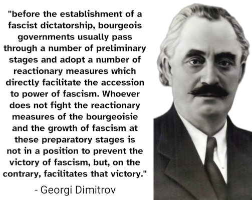
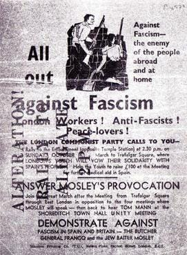
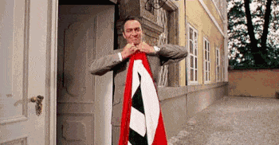
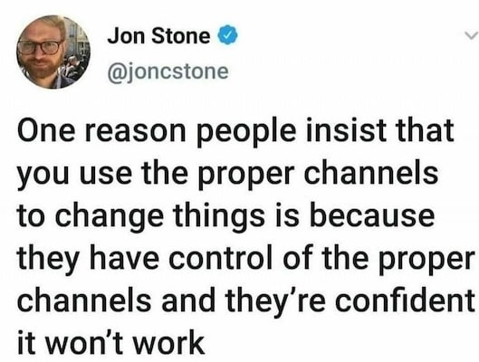
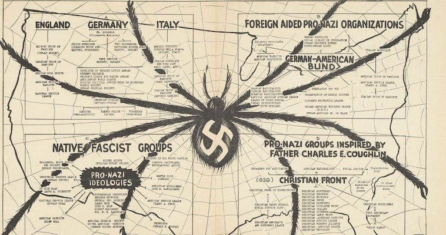

_Note: In line with[the previous article](https://peacefulrevolutionary.substack.com/p/how-not-to-nazi) I’m going to be using the term fascism broadly to refer to any ultra-authoritarian and ultra-nationalist state system throughout this article, and will leave it to the reader to judge which particular situations this may apply to in our world today._

## Before Fascism Gains Power

There are many guides on how to stop fascism being established, on what people might have to do to keep fascists from getting into power, and – if they are elected into office – how to limit their power before they fully establish a fascist state. They give valuable advice on tactics that can be used to avert such outcomes, and in some cases fledgling fascist movements have been weakened or even stopped by such actions, especially early on.

But there’s a sobering reality we must confront: fascism has rarely been defeated from within once fully established. Nazi Germany, for instance, maintained internal control until its military defeat by external forces in 1945, and Mussolini’s regime only fell after military losses weakened it sufficiently for internal opposition to act.

Transitions like Spain after Franco’s death or Portugal’s Carnation Revolution might be considered an exception, but these represented gradual liberalisation or peaceful revolution rather than the populace overthrowing an actively oppressive fascist system at its peak.

The pattern is clear: fascist and authoritarian regimes often prove remarkably effective at internal suppression through surveillance, propaganda, and violence. However, these systems still face long-term vulnerabilities such as international isolation, succession crises, internal inefficiencies, and the unsustainable cost of maintaining oppressive control. 

Yet **we can’t be complacent and just wait for fascism to fail** , because it comes at a horrific human cost while it lasts, and generational dictatorships like North Korea and enduring repressive monarchies and theocracies demonstrate that authoritarian systems can adapt their methods of control and survive for decades or centuries.

This makes it all the more crucial to understand which tactics work best at each stage, and which may no longer be relevant once fascists are in power.

### Showing Disapproval

When the prospect of fascism first rears its ugly head, but before it has a large base of popular, political or media support, it can still be shown up for the danger it really is. Its adherents might still be shamed and embarrassed, might still fear the disapproval of friends or family, and might discover that most are not on their side.

Fascism has often been averted in this way, through early, sustained opposition that makes the social and economic costs of participation clear before the movement gains enough momentum to protect its supporters from consequences. The Battle of Cable Street demonstrated this principle: Oswald Mosley’s British Union of Fascists was contained through sustained community resistance and social opposition that prevented them from normalising their presence in targeted neighbourhoods.

When fascist rallies have consistently been outnumbered by anti-fascists, and their association with fascism has come at a cost to work, wealth, or popularity, then many have shrunk back into the shadows. If the avenues they use to spread hate such as newspapers, radio shows, television news, and even churches have received enough complaints or few enough viewers then they’ve found it harder to gain new recruits to their racism.

That is the time to use every opportunity available to get out the word about the dangers they pose in conversations, in marches and protests, in workplaces and schools, via flyers, stickers and banners, and in whatever media outlets you have access to, even comedy. Because **it is definitely a sign that fascism is winning when it makes you worried (and later afraid) to do any of these things**.

### A Better Argument?

Unfortunately better arguments, reason, and debates will rarely sway the most committed. They have their uses among the unconvinced and a few who are beginning to doubt, but those who have already come to the point where they consider you less worthy, less valuable, or even less human are unlikely to take you seriously. Their hearts and minds are much less likely to be won by your kind outreach or response, although this can still have value as it contradicts their portrayal of you as being the evil ones.

Thus there is a fundamental problem with the idea that our side just needs better arguments to defeat fascism, as one commentator pointed out: ‘When you argue that fascists should be defeated through debate what you’re actually suggesting is that vulnerable minorities should have to endlessly argue for their right to exist and that at no point should the debate be considered over and won.’ _(Michael J Dolan @michaelxdolan)_

Debate has its place, understanding and the ability to explain and defend your position has value, and it helps those who are willing to listen, but that is rarely those who have already decided that they hate some people just for existing. As Holocaust survivor, Frank Frison observed:

> ‘ **If fascism could be defeated in debate, I assure you that it would never have happened** , neither in Germany, nor in Italy, nor anywhere else.’

There comes a point where shame no longer matters to fascists, if it ever did. They are past empathy, or even sympathy, at least until they experience the very things they wish upon others, and even then it often reinforces their hate for those they blame for it.

### Voting Them Out?

Elections don’t necessarily stop fascism, they can even become tools to legitimise it. There are some examples of would-be fascists getting voted out of power after their first term in office (such as Bolsonaro) because they overestimated their support or didn’t have enough support to maintain their control, but in situations where they have been voted in again they almost never give up power peacefully again.

The pattern is remarkably consistent across time and geography. The Nazis lost substantial seats between July and November 1932, dropping from 230 to 196 seats, yet still manoeuvred into power through political deals. After seizing complete control in 1934, they continued holding sham referendums until 1938, with results climbing from 88% to over 99% ‘yes’ votes.

Putin’s trajectory mirrors this authoritarian playbook. While his first election in 2000 seemed competitive, the five elections since have been carefully managed to eliminate any real chance of opposition victory. Belarus, Hungary, Egypt, Uganda, and elsewhere, authoritarian leaders have held periodic elections to enhance their legitimacy but monopolised the media, restricted civil society, and manipulated state institutions and resources to ensure that they remained in power.

 **Fascists and ultra-authoritarians only need to win once** , and they don’t even need majority support if they have enough willing collaborators in government institutions. This has led to what experts call ‘zombie democracies’, the living dead of electoral political systems, recognisable in form but devoid of any substance. But they serve an important purpose for fascists: they channel opposition into performative voting and redirect potential rebellion into ‘legitimate’ channels that fascists oversee and can easily ignore or manipulate.

### The Company We Keep

When electoral politics fails to stop fascism, many people retreat into their personal lives, telling themselves they can at least control their immediate social circle. But this raises difficult questions about the company we keep.

We might prevail upon our friends and associates when we see them falling for fascist propaganda to question it, to see it for what it is, and they may listen and rethink their positions. But what if they don’t? At what point is keeping a friendship and ignoring a friend’s behaviour a form of complicity?

 **History judges us by our associations, not our private reservations.** As historians note: they have a word for Germans who joined the Nazi party not because they hated Jews, but out of hope for restored patriotism, economic anxiety, desire to preserve religious values, dislike of opponents, political opportunism, convenience, ignorance, or greed. That word is ‘Nazi.’ _(A.R. Moxon)_

The principle is laid out simply by a common German saying: ‘If 9 people are eating dinner with a Nazi, you have 10 Nazis eating dinner.’ History won’t care whether your heart wasn’t in it, they’ll judge you by the company you kept and the systems you enabled through your participation or silence.

So if you continue to associate with someone after they take a hateful position you may want to ask yourself:

  * Am I showing them they can continue hating without that coming at any cost to our friendship? 

  * Am I showing them and others that I am willing to have such bigots as friends?

  * Am I their token non-fascist friend - so they can seem more reasonable and less threatening to others?

  * Is my friendship with them allowing them to assuage their conscience without changing their behaviour?

  * Will the friendship or even family connection be worth it if I have to sacrifice part of your morals to maintain it?

  * What does it say of me if you are polite in the face of their evil?

  * When they turn against me because I refuse to support fascism too will I wish I had cut ties with them beforehand?

We can’t count on our seemingly harmless associates who support fascism to never turn to violence, or to never inform on us and allow others to carry out violence on fascism’s behalf to prove their loyalty, even if they are coerced into it out of fear.

Of course It Couldn’t Happen Here!

### Non-Violent Resistance?

Fascism is violent - it makes violent threats and when it is able to - is willing to carry them out with violent force. It uses the structural violence of singling out certain groups to be punished with exclusion from culture and society, as well as economic disadvantages, and ultimately persecution and segregation if not worse outcomes. Fascism even places otherwise favoured privileged groups into precarious and coerced situations to ensure their loyalty.

When would-be fascists don’t have a police force or army their power is in intimidation and fear, and **anti-fascists strength is in being courageous despite whatever fear they feel** and standing up, speaking out, and confronting their bullying behaviours. This can and has been done non-violently at times, and there are good examples of this being effective. A couple of examples I’m personally familiar with from the 1990s include:

  * The Anti-apartheid boycotts - The international campaign showed how economic pressure, cultural isolation, and sustained grassroots organising could weaken authoritarian regimes. British communities played a crucial role through local councils declaring themselves anti-apartheid areas. Some of [those same areas](https://www.bafz.org) are doing the same now against Israeli apartheid.

  * The Poll Tax rebellion - Mass non-payment and community organisation brought down Thatcher’s most regressive policy. It showed how ordinary people could refuse to comply with unjust laws on a scale that made enforcement impossible.

The Albert Einstein Institution has a list of 198 such [Methods of Non-Violent Action](https://www.aeinstein.org/198-methods-of-nonviolent-action) which have been effective to varying degrees, depending on where, when and how they were used and the control of violence of those who opposed them. The International Center on Nonviolent Conflict even has a guide for potentially [removing dictatorships using non-violent methods](https://www.nonviolent-conflict.org/resource/from-dictatorship-to-democracy-a-conceptual-framework-for-liberation/)

However, this does not mean marches, protests, sit ins, and boycotts have the same potential at every stage of fascism. **The more power the fascists have and the more violence they can command then the larger the group of people would need to be for non-violence to be effective.** A few thousand anti-fascists showing up to march against a few hundred fascists can be very effective at showing fascists they are outnumbered and do not have support they thought they might have, but the same amount of protestors standing up to a few hundred fascist police or soldiers with guns may find at great human cost that the fascists are not so easily removed by peaceful means.

The question is how much support the fascist state thinks the protestors may have and what threat they pose. The fall of Tunisia’s Ben Ali regime in 2011 demonstrates this calculus: Tunisia’s long-standing rulers were deposed after an intensive 28-day campaign of civil resistance, after the armed forces sided with civil resisters and refused to fire on demonstrators.

Similarly, Ceaușescu’s regime collapsed when he miscalculated popular opposition. When rank-and-file members of the military switched, almost unanimously, from supporting the dictator to backing the protesting population. After he ordered his security forces to fire on antigovernment demonstrators the regime’s coercive power evaporated. But in both these cases the despotic governments took the military’s loyalty for granted, and enough within the military were swayed by the plight of their friends and family.

Many people are selective when it comes to the subject of violence and defence - Many people who are okay with the idea of soldiers fighting back against an invading army which is a threat to their freedoms are somehow not okay with the idea of people inside their country fighting against their own government when it is trying to remove their freedoms. For some this comes from their pacifist philosophy, from others from believing the propaganda that somehow states have a legitimate right to carry out such actions, but individuals or groups do not. But it is worth asking yourself, if governments promote passive protest for their citizens out of a desire for peace or fear of losing their power, knowing that such methods are usually ineffective. Peter Gelderloos, author of _[How Non-Violence Protects The State](https://theanarchistlibrary.org/library/peter-gelderloos-how-nonviolence-protects-the-state)_ would strongly suggest the latter.

This is why some argue that: Anything that relies on appealing to the better natures of fascists presumes that they have any potential sympathy toward the grievances or suffering of those who don’t share their views to begin with, and is often likely to fail. Whereas **‘violence’ is a language fascists always understand** , hence why even examples of non-violence success are often really examples of a dual approach in which some confront power non-violently up front in the day, while others are prepared to use sabotage, property damage, and armed defence at night.

### Doing Nothing

Faced with these difficult choices between violent and non-violent resistance, some people choose what appears to be the easiest path of all: Doing nothing.

Of course, doing nothing is always an option, but it is a very bad one, one that doesn’t exempt you from culpability, and one that makes you complicit with the regime oppressing you and those around you. It is the option the fascists most hope you’ll choose if you can’t wholeheartedly support them, because you’ll still be supporting them by not making a fuss, and keeping the gears of their industries functioning.

Perhaps you believe you can keep your head down, be pleasant and accommodating, hoping the fascists won’t see you as a threat - a strategy that feels more possible if you belong to the privileged group. In most countries that means being a white male, as long as you can stomach what will happen to non-white people (or other unfavoured groups) and to women too. You could lie to yourself and say it isn’t your fault because you aren’t the one carrying it out, but your stepping aside helps pave a smoother road for the tanks they’ll roll over your freedoms and other people’s lives.

But **doing nothing in the face of evil is aiding and abetting evil**. It isn’t mere passivity or simple inaction - it’s a choice, and it comes with direct consequences.

They’re probably going to come for you anyway. Appeasement doesn’t work. If they come for you earlier, you might still have a chance to resist. If you aren’t brave now, you probably won’t be brave later. **Practice being brave now, don’t wait for some special moment at the end to be a hero**. That moment may never come, and when it does, it may be too late to make any difference.

The uncomfortable truth is that fascists count on your politeness, your desire to avoid confrontation, your hope that if you just keep your head down, somehow you’ll be spared. But history shows us otherwise.

This dilemma - the choice between cowardice and courage in the face of tyranny is explored in one of my favourite films, _This Land Is Mine_ (1943), a wartime drama starring Charles Laughton as an unlikely hero, a meek teacher who flinches at injustice but is too frightened to confront it, at least until it personally affects someone he knows. The film held particular meaning for its director, Jean Renoir, who had fled Nazi-occupied France and was making this plea specifically for his countrymen who had chosen collaboration over resistance.

When the person he admires most is killed for raising his voice, Albert has everything to gain by staying silent, including perhaps the companionship of the woman he secretly loves, but he refuses to keep quiet when put on the stand, ultimately going to his death because of it, yet earning the respect of that woman and his students in finding his bravery at last.

 _(The woman he loves is played by Maureen O’Hara, who had been his Esmeralda when he was Quasimodo in the The Hunchback of Notre Dame (1939) just a few years earlier. Where once the hunchbacked bell-ringer could only worship his beloved from afar, now the timid schoolmaster finds his voice and his courage through love of her and his friends and students.)_

Albert’s fictional transformation from cowardice to courage mirrors the real-life choices that confronted ordinary people under fascism - choices that many came to regret. It is particularly poignant when compared to the regrets many real academics had for not standing up against fascism when it was still within their power to do so.

The painful reality of such missed opportunities is captured perfectly by a German university professor interviewed for Milton Mayer’s 1955 book _They Thought They Were Free: The Germans 1933-45_. He describes the devastating moment of recognition when the full horror of complicity becomes clear:

> ’Suddenly it all comes down, all at once. You see what you are, what you have done, or, more accurately, what you haven’t done (for that was all that was required of most of us: that we do nothing). You remember those early meetings of your department in the university when, i **f one had stood, others would have stood** , perhaps, but no one stood. … You remember everything now, and your heart breaks. Too late. You are compromised beyond repair.’

We must choose now whether we want to look back with regret or decide to do something when faced with fascism, because this question will keep arising until it is decisively dealt with - either by us defeating fascism or by fascism defeating us. 

Whether through early resistance, principled associations, strategic non-compliance, or even defensive action - the choice before us is clear. We can act now while options remain, or face the professor’s devastating recognition that we failed to stand when standing might have mattered.

 **Don’t aim to be the person who can rightly say ‘I told you so’ - instead, be the one who doesn’t have to say it because others will say ‘you warned us’ and, hopefully, ‘I’m glad we listened’ and ideally ‘I’m glad we fought against fascism together and won’.**

The tactics we’ve explored here - from showing early disapproval to non-violent resistance, from refusing complicity to practising courage whilst we still can - are the tools available to us before fascism consolidates its power. But what happens when these methods are no longer enough? When we don’t have the choice of doing it ‘the easy way’? What do you do when you find yourself already living under a totalitarian regime? Those are different battles entirely, requiring a different set of tactics - ones that even many guides to fighting fascism won’t discuss. That’s what I’ll be exploring in the next article.

In the meantime you might find these guides useful -

  * [Resisting Oppression And Making Friends](https://peacefulrevolutionary.substack.com/p/resisting-oppression-and-making-friends)

  * [Forty Ways To Fight Fascists](https://spencersunshine.com/2020/08/27/fortyways/)

  * [Twenty Lessons On Tyranny](https://snyder.substack.com/p/on-tyranny)

  * [Lessons From Jim Crow on Surviving Fascism](https://scalawagmagazine.org/2025/02/surviving-fascism-lessons-from-jim-crow/)

Subscribe

[Share](https://peacefulrevolutionary.substack.com/p/defeating-fascism-the-easy-way?utm_source=substack&utm_medium=email&utm_content=share&action=share)
