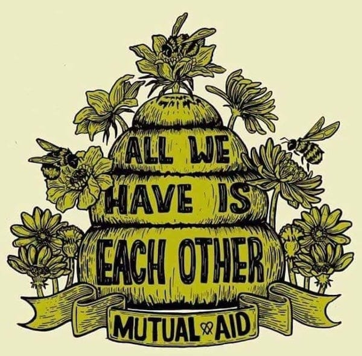
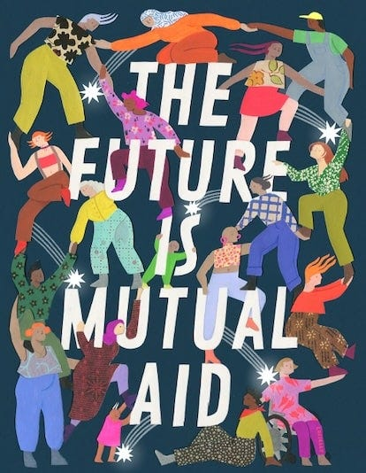

Across the British Isles and beyond, ordinary people are quietly building extraordinary alternatives to the world of bosses, rent, and wage labour. From worker cooperatives in the industrial North to [intentional communities](https://www.ic.org) in the Welsh hills, from radical social centres in major cities to transition towns in rural England, a network of communities is demonstrating that another way of organising society isn't just possible, it's already happening. Likewise inspiring American alternatives are showing a better way is possible, even in the midst of rising housing costs, precarious employment, and fraying social safety nets.

These communities aren't waiting for permission to create change. Instead, they're constructing what theorists call ‘prefiguration’ or ‘dual power’, building new institutions alongside existing ones, gradually absorbing their functions whilst proving that people can govern themselves without hierarchy or exploitation.

 _Note: This is not the next in my Anti-Fascism series, but these examples of building a better world in the shell of the old can help us to prepare for whatever the future holds._

## The Gentle Revolution: Building Counter-Institutions

The most widespread approach to social transformation happening across Britain and elsewhere today involves the patient work of creating alternative institutions that demonstrate cooperation works better than competition for most human needs.

In **Hebden Bridge** , West Yorkshire, this patient revolution is particularly visible. The town has a rich cooperative history, including the famous **Hebden Bridge Fustian Manufacturing Co-operative Society** which operated successfully from 1870 until 1918. Today, the area hosts multiple cooperatives and community initiatives, including **[Valley Organics Workers' Co-op](https://www.valleyorganics.coop)** , which became a workers' cooperative in 2013 and sells local, organic produce whilst promoting sustainable food systems.

Local initiatives demonstrate that communities can meet their own needs whilst creating meaningful work. **[Pennine Community Power](https://powerinthecommunity.wordpress.com/about/)** , a community benefit society, successfully installed a wind turbine in 2013 with investment from 66 local residents, generating renewable energy and contributing to community environmental projects and flood relief.

This approach mirrors successful examples like the **[Evergreen Cooperatives](https://www.evgoh.com) **in Cleveland, Ohio, or the **[Mondragón Corporation](https://www.mondragon-corporation.com/en/)** in the Basque Country, proving that worker ownership can operate at significant scale whilst maintaining democratic principles.

Similarly, the **[Transition Towns](https://transitionnetwork.org/)** movement, which began in Totnes, Devon, has spread to over 1,000 communities worldwide. These communities focus on relocating their economies, building resilience to economic and environmental shocks whilst reducing dependence on global supply chains. Local food networks, community-supported agriculture, and local currencies like the **Totnes Pound** demonstrate practical alternatives to corporate-dominated markets.

The **[Findhorn Foundation](https://en.wikipedia.org/wiki/Findhorn_Foundation)** in Scotland represents perhaps Britain's most developed example of intentional community based on ecological principles and consensus decision-making. The broader **Findhorn Ecovillage** community is home to more than 400 people and includes the **New Findhorn Association** with 320 members and 30 organisations as of 2011. 

**[Cooperation Jackson](https://cooperationjackson.org/)** is a network of worker cooperatives in Jackson, Mississippi building economic democracy through interconnected co-ops, mutual aid, and community control. Formed in 2014 from the Jackson-Kush Plan’s dual power strategy, they’re creating parallel institutions (worker co-ops, community gardens, a cooperative incubator, and training centres) that directly serve Black and Latino working-class communities whilst prefiguring a solidarity economy beyond capitalism.

## The Power of Refusing: Civil Disobedience and Non-Cooperation

Whilst some communities focus on building alternatives, others embody the tradition of withdrawing consent from unjust systems through organised non-cooperation and civil disobedience.

 **[Extinction Rebellion](https://extinctionrebellion.uk/)** represents the most visible contemporary expression of this approach in Britain. The movement's ‘rebel camps’ demonstrate principles of horizontal organisation, consensus decision-making, and mutual aid. More significantly, XR has pioneered mass civil disobedience tactics that withdraw cooperation from systems destroying the planet whilst prefiguring more democratic alternatives.

The movement's regenerative culture working group explicitly draws from anarchist principles, creating processes for conflict resolution and collective care that operate independently of state institutions. Their citizen assemblies, whilst still experimental, demonstrate how communities might make decisions about complex issues through deliberative democracy rather than representative government.

The **[Catholic Worker Movement](https://www.catholicworker.org/)** , with houses of hospitality in cities across Britain, continues the tradition of personalist anarchism developed by Dorothy Day and Peter Maurin. These communities provide direct aid to homeless people whilst refusing to cooperate with immigration enforcement or workfare programmes, demonstrating that communities can care for their most vulnerable members without state bureaucracy.

Historical examples like the **[Greenham Common Women's Peace Camp](https://en.wikipedia.org/wiki/Greenham_Common_Women%27s_Peace_Camp)** , which maintained a continuous presence for 19 years, prove the power of sustained non-violent resistance in challenging militarism and creating alternative communities based on feminist and ecological principles.

The **[Movement for Black Lives](https://m4bl.org)** exemplifies mass non-cooperation, from the 2020 uprisings that saw millions withdraw consent from policing systems to ongoing cop-watching networks and bail funds that circumvent carceral control. Communities create their own safety protocols whilst refusing collaboration with police departments that terrorise their neighbourhoods.

## The Fire This Time: Direct Action and Autonomous Spaces

In cities across Britain, networks of autonomous social centres embody more confrontational approaches to social change whilst creating immediate alternatives to capitalist social relations.

Places like the **[Cowley Club](https://cowleyclub.org.uk/)** in Brighton, **[BASE](https://basebristol.org/)** in Bristol, the **[1 In 12 Club](https://www.facebook.com/1in12/)** in Bradford, and **Plan C** spaces across multiple cities, and dozens of similar venues operate as ‘temporary autonomous zones’ where people experience life without bosses, rent, or police. These spaces provide everything from free meals to legal support for activists, but more importantly, they offer glimpses of how society might organise itself based on mutual aid rather than market exchange.

The **[UK Uncut](https://en.wikipedia.org/wiki/UK_Uncut)** movement demonstrated how direct action could expose austerity politics whilst creating temporary spaces of collective decision-making. Their occupations of tax-avoiding corporations and public services under threat showed how communities could reclaim control over resources being privatised or destroyed.

More recently, the **[Kill the Bill](https://en.wikipedia.org/wiki/Kill_the_Bill_protests)** protests against the Police, Crime, Sentencing and Courts Act saw communities across Britain organise autonomous responses to state repression, creating mutual aid networks for legal support and community defence that operate entirely outside official channels.

The **[Radical Housing Network](https://radicalhousingnetwork.uk)** connects housing activists across Britain who use direct action to stop evictions, occupy empty buildings, and create community-controlled housing. Such groups like **[Focus E15](https://focuse15.org)** in London have successfully defended social housing whilst creating models of tenant organisation based on direct democracy.

The **[Red House eviction defence](https://www.pdxtu.org/)** in Portland saw neighbours establish an autonomous zone for months to prevent a Black and Indigenous family’s eviction, creating barricades, community kitchens, and coordinated security that successfully forced authorities to negotiate. This victory inspired similar eviction blockades nationwide, proving communities can physically defend each other from displacement without relying on courts or politicians.

## Working Together: Cooperative Labour and Workplace Democracy

The cooperative movement in Britain represents one of the most developed alternatives to capitalist employment relations, with worker-owned enterprises operating in every sector of the economy.

 **[Co-operatives UK](https://www.uk.coop/)** reports over 7,000 cooperatives operating across Britain, from major retailers like **[The Co-operative Group](https://www.coop.co.uk)** to small worker cooperatives in cities and towns nationwide. But more radical examples demonstrate the potential for worker ownership to fundamentally transform economic relations.

The **[Suma Wholefoods](https://www.suma.coop/)** collective in West Yorkshire operates as a workers' cooperative with no managers or hierarchical pay scales. All members receive equal pay and participate in collective decision-making about everything from product sourcing to strategic planning. After four decades of operation, Suma proves that complex distribution operations can function effectively under worker control.

 **[Catalyst Collective](https://catalystcollective.org/)** in Leicester operates multiple worker cooperatives including a bike workshop, café, and community space, all based on principles of equal pay and collective ownership. Their model demonstrates how cooperatives can incubate new enterprises whilst maintaining anti-capitalist principles.

The **[United Voices of the World](https://www.uvwunion.org.uk/)** union organises precarious workers using direct action tactics inspired by anarcho-syndicalist traditions. Their successful campaigns among cleaners, security guards, and hospitality workers demonstrate how militant organising can win meaningful improvements whilst building capacity for more fundamental challenges to employer power.

The **[Industrial Workers of the World](https://iww.org.uk/)** continues organising in Britain (as it does in [America](https://www.iww.org) and elswhere) based on principles of direct action, worker solidarity, and the eventual abolition of wage labour. Whilst small, the IWW's workplace organising demonstrates anarcho-syndicalist principles in practice, building towards what they call ‘the new society within the shell of the old.’

## United in Diversity: Coordinated Revolutionary Organisation

The **[Anarchist Federation](http://afed.org.uk)** represents Britain's most developed example of what theorists call ‘platformism’, disciplined anarchist organisation that maintains theoretical unity whilst engaging flexibly in various struggles.

With local groups from Scotland to the South West, the AF operates according to principles of collective responsibility, federal organisation, and strategic unity around core anarcho-communist principles. Members engage in everything from anti-fascist organising to housing struggles, but coordinate their efforts through regular assemblies and shared strategic analysis.

The AF's theoretical work, published in magazines like **Organise!** and **Resistance** , connects local struggles to broader analysis of capitalism and the state whilst maintaining clear anarchist principles. Their long-term organising demonstrates how anarchists can maintain principled positions whilst building effective organisation over decades.

 **[Black Rose Anarchist Federation](https://blackrosefed.org/)** in North America provides another model of platformist organisation, rooting anarchist theory in specific struggles against racial oppression and imperial war whilst maintaining the organisational coherence necessary for sustained revolutionary activity.

## The Commons Reborn: Community Control and Participatory Democracy

Several British towns have experimented with forms of participatory democracy that bypass traditional party politics whilst creating genuine community control over local resources.

 **Frome** in Somerset gained international attention when **[Independents for Frome](https://en.wikipedia.org/wiki/Independents_for_Frome)** won control of the town council in 2011, taking 10 of 17 seats initially and winning all 17 seats in 2015 and 2019. Their approach, dubbed ‘[Flatpack Democracy](https://www.thealternative.org.uk/dailyalternative/2019/10/7/flatpack-democracy-two-zero)’ by founder Peter Macfadyen, emphasises community consultation, participatory budgeting (which they call ‘people's budget’), and collaborative decision-making that puts residents rather than party politics at the centre of local governance.

The **Flatpack Democracy** model has inspired similar experiments across Britain, with around 15-20 councils now under majority independent control using similar approaches, and another 70-80 places where independent councillors have been elected. These experiments demonstrate possibilities for more direct democratic control over community resources whilst operating within existing legal frameworks.

 **Preston** in Lancashire has pioneered what activists call ‘community wealth building,’ using the spending power of local anchor institutions like hospitals and universities to support local cooperatives and community enterprises. The ‘[Preston Model](https://www.preston.gov.uk/article/1339/Community-Wealth-Building)’ demonstrates how communities can retain wealth locally whilst building alternative economic institutions.

 **[Symbiosis](https://symbiosis-revolution.org/)** is a confederation of community organisations across North America building dual power through directly democratic assemblies and cooperative economies. Rather than waiting for state reforms, they’re creating parallel institutions — housing co-ops, community land trusts, and mutual aid networks — that meet immediate needs whilst prefiguring libertarian socialism through collective self-governance and communal resource sharing.

## Beyond Collapse: Building Resilient Communities

As climate change and economic instability intensify, communities across Britain are building resilience through relocating their economies and developing capacity for autonomous crisis response.

The **[Centre for Alternative Technology](https://cat.org.uk/)** in Wales has spent decades demonstrating sustainable technology and ecological building techniques whilst training people in skills necessary for post-carbon communities. Their **Zero Carbon Britain** research provides technical blueprints for rapid decarbonisation through community-controlled renewable energy and localised food systems.

 **Low Impact Development** projects across Wales demonstrate how communities can dramatically reduce their environmental footprint whilst maintaining high quality of life. These communities generate their own renewable energy, manage their own waste, and produce much of their own food through permaculture techniques.

During the Covid 19 crisis thousands of local ‘mutual aid’ groups provided direct support to vulnerable community members without waiting for government assistance. These networks demonstrated autonomous disaster response that often proved more effective than official emergency services.

The **[Land Workers' Alliance](https://landworkersalliance.org.uk/)** organises small-scale farmers and growers working to relocate food production through agroecological methods and community-supported agriculture. Their work demonstrates practical alternatives to industrial agriculture whilst building rural communities based on cooperative labour.

They are a member of **[La Via Campesina](https://viacampesina.org/en/)** , the international peasants advocacy organisation, which represents over 200 million peasants, farmers and land-based workers through 182 member organisations. The movement advocates for family farm-based sustainable agriculture and was the group that coined the term ‘food sovereignty’.

## The Digital Commons: Technology for Liberation

Across Britain, hackspaces and community technology groups are building digital infrastructure that enables community autonomy rather than corporate surveillance.

 **[London Hackspace](https://london.hackspace.org.uk/)** and similar spaces in cities nationwide operate as community workshops where people share knowledge about electronics, programming, and digital fabrication. These spaces demonstrate cooperative approaches to technology development whilst building capacity for community self-reliance.

 **[B4RN](https://b4rn.org.uk/)** (Broadband for the Rural North), registered as a Community Benefit Society in 2011, brings gigabit-speed fibre broadband to remote rural areas through community ownership and investment Broadband for the Rural North. B4RN prioritises social impact over financial gain, demonstrating how communities can build essential digital infrastructure when abandoned by commercial providers focused on profitable urban areas.

Meanwhile, radical tech collectives like **[Riseup.net](https://riseup.net/)** in the United States provide secure email, mailing lists, and web hosting for activists and social movements, operating entirely through donations and volunteer labour to keep communications independent from corporate surveillance and state control. These projects demonstrate how communities can control their own communications infrastructure rather than depending on corporate platforms.

## The Cultural Revolution: Education and Imagination

Communities across Britain are creating cultural institutions that help people imagine life beyond capitalism whilst developing practical skills for building alternatives.

The **[Really Open University](https://reallyopenuniversity.wordpress.com/)** network operates across multiple cities, providing free education based on principles of mutual aid and collective learning rather than individual competition. Their courses cover everything from radical history to practical skills like bike mechanics and permaculture.

 **Radical bookshops** like **[Housmans](https://www.housmans.com/)** in London, **[News From Nowhere](https://www.newsfromnowhere.org.uk)** in Liverpool, and **[Bookhaus](https://www.bookhausbristol.com)** in Bristol serve as community spaces whilst providing access to radical literature and analysis. These spaces host discussions, skill-shares, and cultural events that build community whilst spreading ideas about social transformation.

Community arts spaces like **[Compass Festival](https://compassliveart.org.uk)** in Leeds and various radical cultural events demonstrate how cultural activities can promote cooperative values whilst creating temporary autonomous zones where people experience alternatives to competitive individualism. The **[Tolpuddle Martyrs’ Festival](https://www.tolpuddlemartyrs.org.uk/festival)** (Dorset) is an annual gathering celebrating trade union history with a distinctly radical edge, mixing music with political education and organising workshops. The **[Labour Notes](https://labornotes.org/about)** conference and People’s Summit have fulfilled similar purposes in America. 

**[Freedom Press](https://freedompress.org.uk/)** , Britain's oldest anarchist publisher, continues producing books and periodicals that connect historical struggles to contemporary movements whilst providing theoretical frameworks for understanding how social change happens. In America **[AK Press](https://www.akpress.org)** serves a smilier purpose, and was a founding member of the Radical Publishers’ Alliance, a group of politically oriented book publishers and magazines around the world.

## The Road Ahead: Networks of Transformation

What connects all these diverse experiments is a shared commitment to prefigurative politics, creating the change they want to see rather than waiting for permission from authorities. Whether through cooperative ownership, participatory democracy, mutual aid networks, or direct action, these communities demonstrate that people can govern themselves whilst meeting their collective needs.

 **[Radical Routes](https://radicalroutes.org.uk/)** provides mutual support for housing cooperatives and radical community projects. **[Community Energy England](https://communityenergyengland.org/)** links renewable energy cooperatives nationwide.

These networks create what movement strategists call ‘revolutionary infrastructure’: the relationships, resources, and institutions necessary for broader social transformation. Each successful cooperative, each effective mutual aid network, each community reclaiming democratic control over local resources provides inspiration and practical models for other communities to adapt.

The revolution isn't a future event, it's already happening in the quiet work of communities building alternatives to capitalism. As these networks grow and connect, they're creating the foundation for a society based on cooperation rather than competition, mutual aid rather than market exchange, and community control rather than corporate domination.

The question isn't whether these alternatives can work, thousands of communities across Britain and tens of thousands more beyond prove they already do. The question is how quickly these seeds of transformation can grow and how effectively they can support each other in creating the world we know is possible.

As communities from Hebden Bridge to Frome, from Jackson to Portland demonstrate daily: another world isn't just possible, it's already emerging wherever people decide they've had enough of being ruled and start ruling themselves instead.

Subscribe

[Share](https://peacefulrevolutionary.substack.com/p/building-tomorrow-today?utm_source=substack&utm_medium=email&utm_content=share&action=share)

Artist - Molly Costello
