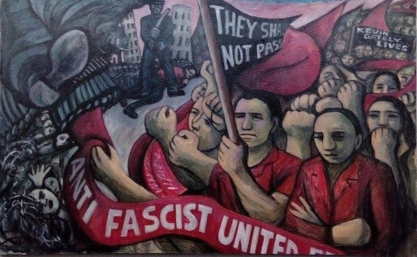
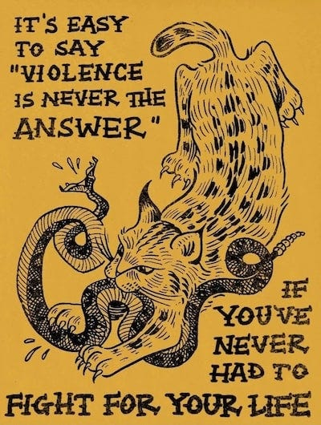
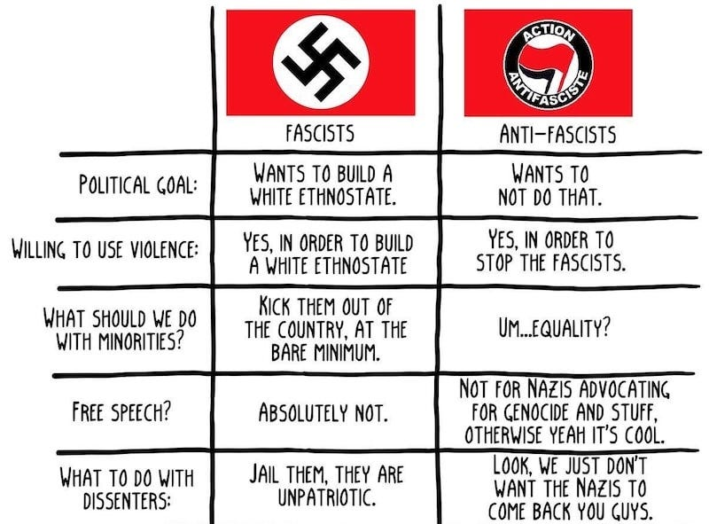

_This is the last in the anti-fascism series -[How Not To Nazi](https://peacefulrevolutionary.substack.com/p/how-not-to-nazi) & [Defeating Fascism The Easy Way](https://peacefulrevolutionary.substack.com/p/defeating-fascism-the-easy-way)._

## A Fictional Setting

I am a fictional person from a fictional land in a fictional future. Anything I say is of course fictional and anything I say that sounds similar to anything that is happening or might yet happen on earth is purely coincidental. Having said all that I look at your world and I’m worried, because it doesn’t look much different than mine was a decade ago, and things got much worse before we won our own fight against what you might call fascism.

Of course I may have misunderstood your situation, or you may yet avert what we went through before it ever reaches that point, but you may still find it of interest to learn how we fought back against our own version of fascism, and perhaps it will come in use if such a situation ever arises again where you live on your planet.

 _(Those already familiar with process of how fascism establishes itself may want to skip to the Building The Resistance section further below)_

## How It Happened

Like you do now, ten years ago we had a representative democratic system with a capital based market economy. Some people were happy with this situation, but an increasing number were not, feeling that they were losing the financial security they once had, and looking for ways to return to that previous prosperity.

Of course such prosperity had never been shared equally to everybody, but rising costs were placing many previously financially stable people into more precarious and anxious positions, and they were looking for answers to and relief from this situation.

It would have been easy to put the blame on the wealthy who had been decreasing their contributions to society and increasing their costs to it, while failing to raise wages to compensate.

However, it was not in the interests of the wealthy to have the blame placed on them, and they had the means to ensure that the media they owned pointed the finger elsewhere: asylum seekers, immigrants and overseas labour, who they could attribute all societies problems to, despite their relative powerlessness, and the fact that they were largely employed by the same wealthy people who were now using them as scapegoats.

One might have expected political representatives to speak out against such misinformation and a few did, but many stayed silent not wanting to offend their donors, while many demonised such immigrants (and even those who they thought looked like them) as being responsible for almost every ill, while attacking anyone who showed any sympathy toward them. At the election that followed this anti-immigrant group became the predominant one in government.

Many people were not fooled by such tactics and gave emotional and material support to their increasingly threatened neighbours who didn’t fit the privileged preferred colour and customs of the dominant group. But to others those who supported those being persecuted were seen as disloyal at best and traitors at worse.

## Populism Becomes Fascism

Hateful rhetoric turned into calls for violence, which were followed by violent attacks, and on the rare occasions the marginalised fought back – or even lashed out – they were held up as examples of the evil nature of the marginal group and the unreasonableness of their supporters.

Yet what happened next might still have been averted, those on the side of the prejudiced were still (and always were) outnumbered, but too many of the majority had been intimidated into silence and compliance.

Elections were manipulated to be ineffective then later cancelled, and valuable opportunities that could have been used opposing the new regime was lost expecting the next election to fix things. For a while there was still an opposition party but they were largely powerless, a few who spoke up and were mocked, then later silenced, and ultimately there was no toleration for even silent disapproval from public figures and they were imprisoned if outspoken.

Police were militarised, militas were paramilitarised, the military turned inwards, the secret police became more invasive, and informing on others became rewarded - raising suspicions and paranoia

## What We Were Working With

Although the ruling party claimed to represent the majority and have them on their side those of us who opposed them knew this was not the case, there was a good proportion of those who not aligned with their worldview across every age group. With those who did not meet the state’s racial, cultural and lifestyle purity tests having the most solidarity with one another and the most animosity towards their rulers. Next were the younger generation who found themselves financially and culturally disenfranchised from politicians and corporations, and so were more aware of excesses and abuses of power.

Luckily there were also those were quick to see that the promises of the fascists were empty, and that the dangers they frightened people with were imaginary. Then there were also those working within the government and military who were alarmed that those in positions of power fell far below even their own ideals, and began losing faith in the systems they devoted their lives to.

The positives for those of us seeking to undermine such despotic systems was that such regimes tend to place people in positions beneath them based on loyalty and not competency. This meant they were constantly competing with one another for favour, creating blind spots and inefficiencies that exposed their incompetence. These failures eroded support and opened up opportunities to subvert them from within and without.

Likewise, as the dictator and their sycophants become more and more out of touch with reality, their definition of ‘the enemy’ becomes increasingly nebulous and even imaginary. Eventually, the traitor could be anybody and everybody – even their closest allies fall under suspicion. Paranoia becomes the regime’s defining characteristic.

This paranoia drives them to turn inward, closing borders and cutting ties with former trading partners. But this isolation creates geographical vulnerabilities, potentially leading to shortages of needed essentials – fuel, food, medicine, components for manufacturing. A regime that promised prosperity and security instead delivers scarcity and fear.

Such shortages can push them towards military expansion. They’ll paint a neighbouring country as an existential threat whilst coveting that nation’s resources – oil fields, agricultural land, industrial capacity. The rhetoric claims defence, but the goal is plunder dressed up in nationalist fervour.

Initially, sending people’s children off as cannon fodder can build patriotic sentiment and create a rallying effect. But as the caskets return home, as families bury their dead and communities are hollowed out, sympathy for such wars of aggression inevitably erodes. The contradictions become impossible to ignore.

However, it’s not worth waiting for such regimes to burn themselves out through their own incompetence and cruelty. That process often takes decades and costs millions of lives – and could take centuries in the worst-case scenarios, especially when fascism takes on a theocratic character and claims divine mandate. History shows us clearly: the loss of life through successful organised resistance is always less than the loss of life through doing nothing and hoping the system will simply collapse on its own.

## Building The Resistance

So how does one fight back? How do you create and expand an effective resistance, and ultimately win against a militarily superior power? In your own history you have many examples of this – Ireland, Vietnam, Algeria and others – and our own insurgency shared many similarities.

I must state here that I am a peaceful man. I want a peaceful world, not peaceful through enforced compliance, not peaceful through pacifying everyone, but peaceful through the forces of violence not being enabled, through the means and outcomes of peace being made real and defended.

So this is where I’d like to start, as most of our resistance was peaceful in character. Some of it was even lawful, although as the regime’s power became more arbitrary and its legal mechanisms became more weaponised, the definition of what was legal or even allowed grew increasingly narrow.

Those people disaffected by all these changes, along with those who opposed the regime from the start, would become the core of an effective resistance – not all at once or all together at first, but gradually, finding one another through shared grievances and mutual aid.

Some of us were there from the beginning, our politics already opposed to hierarchy and state violence, our communities already built on principles of solidarity and cooperation. But many more came to resistance through lived experience: the shopkeeper whose business was destroyed by loyalist thugs, the teacher forced to teach propaganda instead of truth, the parent whose child was arrested for sharing a forbidden song, the worker who watched their migrant colleagues dragged away.

These people didn’t start as revolutionaries – they started as ordinary folk who simply reached the point where compliance became impossible, where the small acts of defiance they’d been quietly practising suddenly connected them to larger networks of resistance. What united us wasn’t identical ideology, but a shared recognition that the system had become intolerable, and a growing understanding that we were stronger together than afraid and alone.

## What We Had in Place

Fortunately, we weren’t starting from nothing. Long before the fascists consolidated power, many of us had been building alternative structures, some out of revolutionary fervour, others simply because we’d found better ways of meeting our needs. Local mutual aid networks had been sharing resources and supporting vulnerable neighbours for years. Worker cooperatives ran bakeries, repair shops, and small manufacturers to meet people’s need rather than to extract profit from them. Community groups organised everything from childcare circles to skill-sharing workshops. Even seemingly innocent book clubs and gardening societies became crucial nodes in our resistance network.

What made these groups so valuable wasn’t just what they did, but how they were organised. Roughly one in every three people involved had connections to at least one other group, creating overlapping webs of trust and communication. These loose cell structures proved essential later for maintaining both security and effectiveness, as information could travel through trusted relationships without requiring hierarchical command structures that could be easily compromised or beheaded by state repression.

Crucially, most of these networks maintained a public, peaceful, and seemingly harmless face. The regime couldn’t justify cracking down on a community garden or a tool library, at least not at first. This gave us cover to build strength whilst appearing unthreatening.

## Building the World We Needed

As resistance grew, these existing networks evolved and expanded. Prefiguration became an essential part of our rebellion, because we understood that we needed to build the better world to replace the rotten one, or at least be well on that path, rather than simply waiting to seize power and sort things out later. We had to demonstrate that another way was possible, right here, right now.

Community gardens and allotments became small-scale collective farms, producing food outside the regime’s increasingly controlled distribution systems. These weren’t just about healthy living, they were about autonomy, dignity, and proving we could feed ourselves without begging from those who despised us. Food-sharing networks ensured that no one in our communities went hungry, whilst safe houses provided shelter for those fleeing state persecution or needing to disappear for a while.

We supported those whose livelihoods had been destroyed, whose families had been torn apart, who’d been cast out for refusing to inform on their neighbours. This wasn’t charity, it was solidarity, the recognition that an injury to one truly is an injury to all.

Perhaps most subversive was the black economy that flourished in the gaps and shadows of the official one. Food, electronics, medicine, and expertise were all circulated through informal networks of barter and mutual obligation. Interestingly, the fascists relied heavily on these same grey-market channels, and were charged a premium for access to them, as their bureaucratic incompetence meant the official economy was increasingly dysfunctional.

Their dependence gave us opportunities to infiltrate their supply chains, gather intelligence, and quietly sabotage their operations. When the regime’s enforcers needed their equipment repaired or their families fed, they often had to turn to the very people they were supposed to be suppressing. This created leverage, and sometimes, in the right circumstances, it created converts.

## Communication and Counter-Propaganda

Information became a battlefield, and we fought on every front available to us. We utilised whatever technology we could access: decentralised communication platforms that couldn’t be shut down by pulling a single plug, dark nets where surveillance was harder (though always a risk), and mesh networks that bypassed centralised infrastructure. But we also relied on old-fashioned methods that had served resistance movements for centuries: dead drops in hollow trees and behind loose bricks, messages concealed in innocent-looking parcels, even carrier birds (or our planet’s winged equivalent) when electronic communication became too compromised.

We’d leave memory drives in public spaces – libraries, transport stations, public meeting places – loaded with videos documenting regime atrocities, texts explaining our political vision, audio recordings of testimony from survivors and defectors, and even entertainment that had been deemed subversive. The regime could scrub official channels, but they couldn’t find every hidden drive or stop people from copying and sharing what they found.

Our message spread through stickers plastered on lamp posts, posters wheatpasted onto walls in the dead of night, hand-printed zines passed left in cafes, graffiti that appeared overnight and was painted over by morning only to reappear somewhere else by evening. These weren’t just random acts of vandalism, they were proof that resistance existed, that dissenters lived in every neighbourhood, that you weren’t alone in your refusal.

We developed symbols that became instantly recognisable: similar to your ‘Kilroy was here’, the mysterious Simon Jester’s graffiti, or the stylised encircled A, V, or arrow symbols from your own resistance factions and fiction. We had our own colours, such as your black and red standing for liberty and solidarity, anti-fascism, anarchism and communism, the rejection of all masters and the embrace of collective power. Seeing these symbols reminded people that others were fighting back, and gave them courage to do the same.

We became experts at mocking and parodying the regime’s propaganda. Their bombastic posters were subtly altered with a few pen strokes to change the meaning entirely. Their slogans were twisted into dark jokes that spread like wildfire. Humour became a weapon which punctured their pretensions of strength and made them look ridiculous rather than terrifying. Mockery has always eroded authority in ways that direct confrontation sometimes can’t.

Crucially, we documented and publicised their crimes. When they brutalized civilians, we filmed it. When they disappeared people, we named them. When their incompetence led to preventable disasters, we made sure everyone knew. The regime relied on people believing their version of events, but we ensured the truth circulated too. Every atrocity we exposed cost them sympathy, even among their own supporters.

Songs played a vital role too. Some had double meanings, such as innocent sounding love songs that were actually about resistance, work songs with verses that mocked the bosses, and children’s rhymes that taught subversive lessons. Others were sung only in private, in trusted company, explicit anthems of defiance that people carried in their hearts even when they couldn’t voice them aloud. Music can’t be confiscated as easily as a pamphlet, and it builds solidarity through shared emotion.

People read voraciously, often for the first time since they were at school. The regime’s censorship paradoxically made people hungry for forbidden knowledge. They wanted to understand what they were fighting against and what they were fighting for. You can fake compliance, but you can’t fake genuine understanding, and once people truly grasped the mechanisms of oppression and the possibilities of liberation, they became far more effective resisters.

For some, the very lack of hope became a motivation. If there was no future under this regime and no certainty of their own safety, they had nothing left to lose by fighting it. But for others, imagination and dreaming provided crucial encouragement. They needed to envision something better to keep going through the darkness.

You’re fortunate on your world to have so many examples of rebellion captured in your stories: _Andor_ with its honest portrayal of the forms resistance takes and what it personally costs, _The Hunger Games_ showing how spectacle can be turned against tyrants, _V for Vendetta_ demonstrating the power of an idea to subvert fear and brute force, and Le Guin’s _The Dispossessed_ imagining what an anarchist society might actually look like, even under difficult circumstances. The narratives of dictatorships usually don’t chime with reality, and this gives you the chance to offer better stories in which the oppressed triumphed against great odds, and which explore better possibilities for the future.

You have real historical examples too: the International Brigades in the Spanish Civil War fighting fascism before most of the world recognised the threat, the French Resistance proving that occupation isn’t the same as submission, the countless anti-colonial struggles that defeated supposedly invincible empires. These histories are weapons against despair. They remind us that the powerful have been defeated before, and will be again.

## Taking Action

I’ve told you how we organised and communicated, but not yet what decisive actions we actually took. Understanding this is crucial, because resistance isn’t just about networks and ideology, it’s about concrete interventions that undermine tyranny and build alternatives.

Our insurgency was prolonged by necessity. As there would be no single dramatic battle that decided everything. Instead, we waged a campaign of persistent pressure on multiple fronts, designed to make the regime’s position increasingly untenable whilst building our own capacity to govern ourselves.

 _Note: At this point we leave the child-friendly version of our rebellion and into actions that - at least on our planet - proved to be necessary (along with the essential work of our more pacifist allies) to win against our aggressors._

 **Economic Warfare and Sabotage**

We attacked the regime economically wherever possible. This wasn’t merely destructive, we were undermining the material base of their power whilst redirecting resources to our own communities. We sabotaged infrastructure that served their means of control and violence: surveillance systems mysteriously malfunctioned, military supply lines were disrupted, fuel depots experienced unfortunate accidents, databases were corrupted. We targeted the systems that enabled oppression, but not the people trying to survive under it.

Expropriation became a regular practice, taking back what had been stolen from our communities, or seizing what the regime had no legitimate right to in the first place. Warehouses full of hoarded goods were ‘redistributed’ to those who needed them. Weapons intended for use against civilians found their way into the hands of those defending their neighbourhoods. Money extracted through unjust taxes, fines and fees were reclaimed and put toward mutual aid. We didn’t call it theft, because you can’t steal what was never rightfully owned.

We targeted economic infrastructure strategically to disrupt the regime’s capacity to wage war against us. Supply lines, power generation, communications networks – anything that enabled them to project force became fair game. This wasn’t indiscriminate destruction; it was calculated to impose costs and limit their options whilst minimising harm to ordinary people.

 **Early Stages: Testing and Learning**

In the beginning, our reach were necessarily small-scale, but even then included more forceful actions. Targeted _removal_ of particularly brutal officials sent a message that cruelty had consequences. Sabotage operations tested both the regime’s security and our own capabilities. Ambushes on military patrols in sympathetic areas demonstrated that we could strike and disappear before reinforcements arrived.

These hit-and-run tactics served multiple purposes: they built our practical experience, revealed weaknesses in the regime’s response, and most importantly, demonstrated to potential recruits that resistance was possible. Every successful action proved we weren’t helpless, and brought more people into the fold. It also drew resources, the regime had to station troops in areas they’d previously ignored, spreading their forces thinner with each new front we opened.

We established control first in remote areas and neighbourhoods where we had strong support. These became safe zones where we could operate more openly, building the foundations of parallel governance structures. People began looking to our networks for justice, for resource allocation, for community decisions, all the functions a government supposedly provides, but organised horizontally rather than imposed from above.

 **Expansion and Strategic Pressure**

As we grew stronger, our actions increased in both frequency and sophistication. We moved from controlling scattered safe houses to administering entire districts, then regions. Rural areas often came under our local influence first, which made them harder for the regime to monitor and control, and communities there tended to have stronger traditions of self-reliance and cooperation.

In areas we controlled, we built what you might call a shadow system, though we rejected hierarchical governance. We organised voluntary contributions to supply collective services. We established community councils based on involvement and expertise, and dealt with anti-social behaviour using restorative rather than punitive justice. We provided healthcare, education, and infrastructure maintenance, proving that we could manage these necessities better than the regime ever had, and without requiring obedience to distant authorities.

These parallel structures served a dual purpose: they met people’s immediate needs and demonstrated that the regime was unnecessary. Every problem we solved without their involvement eroded their legitimacy. Why should people support a government that provided nothing but violence, when they could organise themselves and actually improve their lives?

Some external support found its way to us, weapons from sympathetic outsiders, funding from diaspora communities, training from veterans of other liberation struggles. We took what was useful whilst remaining wary of strings attached. Foreign allies often have their own agendas, and we weren’t interested in trading one set of masters for another.

 **The Moral Complexities**

Not everything was straightforward, and we’d be dishonest to pretend otherwise. Luckily, some people within the regime gained a conscience, realising they’d been fooled or simply becoming disgusted with what they were asked to do. These defectors brought valuable intelligence and sometimes weapons or resources. We welcomed them, though not without caution.

But others fought to the death even when faced with their own crimes. When someone was actively trying to kill us or our comrades, we defended ourselves. However, we were always determined to never become the monsters we were fighting, that maintaining our humanity meant limits on what actions we’d take, to minimise the possibility of hurting the innocent.

But it was a sad reality that allowing those who’d keep on killing to remain in place and power would leave more blood on our hands than taking them out of their position. In such cases this was considered a form of defence too, one that under ideal conditions we might handle through rehabilitation and restorative justice, but we just didn’t have the luxury of such processes whilst the killers controlled the apparatus of state violence.

Such actions were always debated and never fully resolved to everyone’s satisfaction, leaving different cells to make different choices based on their circumstances, but always attempting to keep in line with the same high principles. What unified us was the recognition that we were in an impossible situation, forced to make terrible choices by a regime that left us no good options. We did our best to retain our humanity whilst acknowledging that purity was a privilege we couldn’t afford.

The regime tried to portray our every action as terrorism, as senseless violence by fanatics. (They would still have done this even if we had remained completely passive.) But there’s a profound difference between the hateful violence of oppression and the defensive force of resistance. They attacked people for existing, for being the wrong ethnicity or loving the wrong person or thinking the wrong thoughts. We fought back against those who wielded power against the powerless. Our force, when it was used, was measured and purposeful, disrupting their capacity for oppression, defending our communities, building space for the more peaceful world we needed.

By keeping them fighting on multiple fronts – economic sabotage here, armed resistance there, parallel governance everywhere – we ensured they could never concentrate their forces enough to crush us completely. Their resources haemorrhaged whilst ours grew, as more people joined our networks and the systems we’d built became increasingly robust.

## Victory and What Came After

Eventually, our parallel structures became stronger than their crumbling institutions. The transition from guerrilla warfare to conventional operations happened gradually, then suddenly. Districts became regions, regions became territories. When we moved on the major cities, much of their military had already lost the will to fight. Entire units defected. Others simply went home. The dictator’s inner circle fled, though several faced summary justice before they could escape.

Our victory didn’t end at our borders. We shared everything we’d learned with those still fighting their own tyrants: how to organise mutual aid, resist surveillance, build parallel structures, fight when necessary. We provided medicine, equipment, training. This wasn’t imperialism in revolutionary clothing – we offered tools and solidarity to people fighting their own battles, not a system to be imposed from above.

 **What Victory Really Meant**

‘Winning’ meant different things to different people. For some, victory simply meant the fascists were gone and they could return to how things were before. But those of us organising along non-hierarchal voluntary principles knew that returning to the old system wasn’t victory at all, it was just hitting pause on fascism.

We’d learned the hard way what many had warned about for generations: fascism doesn’t emerge from nowhere. It grows from contradictions already present in hierarchical societies. The old system had concentrated wealth enabling political capture, created hierarchies teaching that some lives mattered more than others, and built institutions – police, military, bureaucracies – existing to maintain inequality through force. When crisis came, these structures were ready to be weaponised by demagogues.

So we made a collective decision: never allow those mechanisms to exist again. Not the concentration of wealth that enables coercion. Not the centralised power structures that authoritarians can capture. Not the hierarchies training people to obey without question. Not the surveillance apparatus turning neighbour against neighbour.

 **Building Something Better**

We’d already been building this world whilst fighting the fascists. Now we could do it openly. Community councils became regional federations, coordinating, never commanding. Worker co-ops expanded to manage larger industries where useful. Mutual aid networks evolved into comprehensive systems ensuring everyone’s needs were met, not as charity but as recognition of our interdependence.

Most importantly, no one could accumulate enough wealth to dominate others. Resources were held in common or distributed according to need and contribution. The material basis for class hierarchy ceased to exist.

 **The Hardest Lesson**

Looking back, we’ve learned something that haunts many of us: we wish we’d started sooner. If we’d had our time over, we wouldn’t have waited for full blown fascism before building these alternatives. We would have been dismantling hierarchical systems, building mutual aid networks, practising collective decision-making, and refusing cooperation with exploitative structures long before any dictator took power.

Every dominant power structure – even supposedly representative democratic ones – contains fascism’s seeds. The surveillance infrastructure. The habit of obedience to authority. The acceptance that some have the right to command and others the duty to comply. These elements don’t have to be created by fascists; they’re already there, waiting to be activated.

If we’d begun liberation work earlier, the fascists might still have tried their power grab, as every attempt to build genuine freedom threatens those whose power depends on hierarchy. But we would have paid a much smaller cost. Fewer people would have died. Fewer communities would have been destroyed.

 **A Message to Your World**

Don’t wait. Don’t tell yourselves it can’t happen where you are. If you see the warning signs – scapegoating, eroding rights, normalising violence against vulnerable people – begin building alternatives and collective power now, whilst you still have breathing room.

Start small. Organise mutual aid in your neighbourhood. Join or create a worker cooperative. Learn practical skills and teach them. Build relationships of trust and solidarity. Practise collective decision-making. Create the structures of the world you want, right now, in the shell of the failing one.

And if despite your efforts the worst comes, remember: resistance is always possible. You are not alone. Systems depending on fear and violence are more fragile than they appear. Ordinary people organising together have toppled seemingly undefeatable empires throughout history.

Remember too that winning isn’t enough if it only means returning to conditions that enabled tyranny. Real victory means building something fundamentally different, something that can’t be corrupted into oppression, something based on genuine freedom and solidarity rather than hierarchy and control.

The world you build will be imperfect. There will be mistakes and disagreements. But if you hold fast to mutual aid, horizontal organisation, systems based on need and not greed, and you resist every attempt to recreate hierarchies of power, you’ll have something worth defending and worth sharing.

I hope you never need to follow our path. I hope you find a gentler way forward. But if you face what we faced, know that victory is possible, and that a world without masters, and without the machinery of domination, is worth every sacrifice it takes to build it. Stay strong. Stay together. And never give up on the possibility of real freedom.

 _You might also find these couple of articles of interest -  
[So You Are Living In A Dystopia - What Next?](https://peacefulrevolutionary.substack.com/p/so-you-are-living-in-a-dystopia-what)   
and [Resisting Oppression & Making Friends](https://peacefulrevolutionary.substack.com/p/resisting-oppression-and-making-friends)_

Subscribe

[Share](https://peacefulrevolutionary.substack.com/p/fighting-fascism-the-hard-way?utm_source=substack&utm_medium=email&utm_content=share&action=share)

