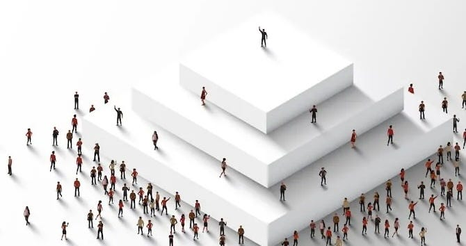
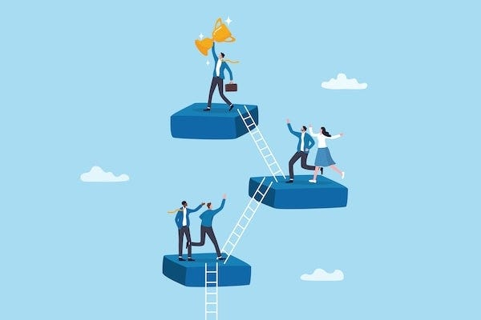
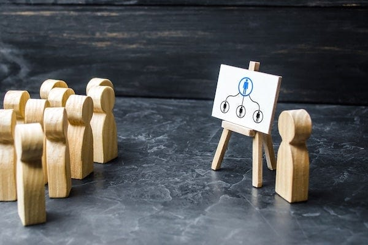
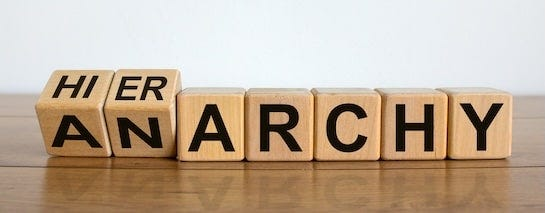

## _Do you actually believe some people should have power over others?_

Chances are you’ve sometimes questioned why a person is in a position of power. Chances are you’ve wondered why such ‘hierarchy’ was necessary at all. You might agree that ‘people ruling over others is bad’, before getting on with your day, going to work, paying your rent, and generally living in a society absolutely riddled with different forms of hierarchy.1

But here’s a question worth asking: Are _you_ a hierarchist? Do you actually believe some people should have power over others? That certain humans are entitled to give orders whilst others must obey?

If your immediate reaction is ‘of course not!’, then you’re right. Most people aren’t hierarchists, they don’t want to be ruled over by others. The problem is that hierarchy has become so normal, so invisible, that we often don’t notice when we’re participating in it, defending it, or even wishing we could climb to the top of it ourselves.

So let’s find out how much of a hierarchist you actually are. Here are some questions that might surprise you.

##  _Would you shove someone out of the way because you’re bigger and stronger?_

Of course not! What kind of person would do that? Only someone who genuinely believed that being bigger, stronger, or more powerful entitled them to push others aside. Only someone who thought might makes right.

But here’s the uncomfortable truth: that’s exactly what hierarchy is. Hierarchy operates on the principle that some people matter more than others - that a CEO’s time is worth more than a cleaner’s, that a politician’s needs take precedence over a homeless person, that a barista serving coffee should defer to customers because of their job titles. Those who defend this system are accepting the same logic as the playground bully. They’re just letting someone else do the shoving.

 **Hierarchy requires believing some people matter more than others.** That someones needs, time, and comfort somehow count for more because of their position, education, or income, or simply because they’re used to being listened to. It’s the logic of the dictator, dressed up in suits and mission statements and ‘that’s just how the world works.’ The only difference is that hierarchy puts enough distance between you and the violence that you don’t have to feel responsible for it.

##  _Would you threaten someone with violence to make them do what you want?_

Of course not! That’s what bad people do. Decent people don’t hold a gun to someone’s head and demand compliance. We don’t lock people in cages until they agree to obey us. That would be monstrous.

But when hierarchy’s defenders say ‘well, someone has to be in charge,’ that’s precisely what they’re endorsing. Because here’s what ‘being in charge’ actually means: having the power to make people do things they don’t want to do, and ultimately, having the power to use force if they refuse. Your boss can’t physically drag you to work, but they can fire you, and give you a bad reference. The government can’t force you to agree with its laws, but it can lock you in a cage if you disobey them. The landlord can’t make you pay, but they can evict you and have armed police put you onto the street.

Every time you’ve bitten your tongue in a meeting because you didn’t want to contradict your boss, every time you’ve assumed someone must be right because of their position rather than their reasoning, you weren’t respecting expertise or wisdom. You were responding to an implicit threat. You were calculating the consequences of disobedience.

Here’s what this means: **Hierarchy requires believing that chaos is the only alternative to control, and learning to switch off your own judgement.** It’s pretending humans can’t organise themselves without someone having the power to threaten them. It’s outsourcing your thinking to someone supposedly more qualified, not because they’ve earned your trust, but because they have power over you and you’ve learned it’s safer not to think too hard about that.

A football team you form with your friends doesn’t need someone who can fire players to function. Your mates don’t need someone among them who can kick them out of the pub before you organise a night out. But we’ve been taught to believe that without the threat of consequences, without someone having power over us, everything would fall apart. What we call ‘leadership’ in a hierarchy is really just ‘who has the biggest stick.’

##  _Would you watch someone starve or freeze because they made ‘bad choices’?_

Of course not! If you saw someone freezing on the street, you wouldn’t walk past thinking ‘well, they should have worked harder.’ If a child was starving in front of you, you wouldn’t refuse them food because their parents ‘made poor choices.’ That would be sociopathic.

But when supporters of hierarchy say ‘they earned their position’ about someone wealthy and powerful, or ‘if they wanted better lives, they should have made better choices’ about someone struggling, that’s exactly the logic they’re using. They’re just doing it at enough of a distance that they don’t have to watch them suffer.

When they point at a billionaire and say ‘they must have worked hard for that,’ they’re suggesting that people sleep rough because they didn’t work hard enough. When they argue that politicians deserve their position because they ‘won’ their election, it’s ignoring that the game was rigged before it started. When they promote meritocracy as real, they’re saying that the nurse working three jobs to survive just needs to try harder, whilst the billionaire’s grandchild ‘earned’ their inheritance.

 **Hierarchy requires believing the myth of meritocracy** \- that wealth, power, and status are awarded fairly based on effort and talent. It means pretending that you can ‘pull yourself up by your bootstraps’ even if you haven’t got boots. Hierarchy looks at a homeless person and sees someone who failed, rather than someone failed by a system designed to concentrate wealth and power at the top.

Most people at the top were born halfway up the ladder. But hierarchy calls that ‘merit’, and expects us to accept that everyone else deserves to freeze because they aren’t already several rungs higher and didn’t climb fast enough.

##  _Would you watch someone being beaten without intervening?_

Of course not! If you saw someone being attacked, you’d help, or at least call for help. You wouldn’t just stand there thinking ‘not my problem’ or ‘I don’t want to get involved.’ That would make you complicit in the violence.

But how many times have you watched someone be treated unfairly at work and said nothing because ‘it’s not your place’? How many times have you let a bad decision stand because challenging your manager wasn’t worth the hassle? How many times have you thought ‘I’m just trying to survive here’ whilst someone else was being ground down by the same system?

 **Hierarchy requires everyone’s complicity.** Those at the bottom staying silent, those in the middle passing the buck upward, everyone pretending they’re powerless. And the terrible thing is, we often are trying to just survive. The system’s designed that way, to make speaking up feel like a risk you can’t afford.

But here’s the truth: It’s not just the boot on your neck that keeps you down - it’s you putting up with someone else standing on you to make themselves seem taller. Every time we stay silent, we’re not just protecting ourselves. We’re helping maintain the system that hurts us all.

The beating doesn’t become acceptable just because you’re not the one throwing the punches. The injustice doesn’t become less real because you kept your head down. The violence of hierarchy doesn’t disappear because you didn’t personally give the orders.

##  _Would you hit a child for asking ‘why’?_

Of course not! Only a bully would punish a child for being curious, for questioning, for wanting to understand. We’d be horrified by someone who taught children that asking questions was disrespectful, that thinking for themselves was dangerous, that their job was to obey without understanding.

Yet how many times have those with supposed authority said to children (and adults) ‘you should do as you’re told’? How many times have they praised some for being ‘good’ when they really meant ‘quiet and compliant’? How many times have you heard them say that allowing us to make our own decisions would lead to chaos, as if having a say in our own lives was a kind of corruption?

 **Hierarchy requires training people from birth to accept authority without question.** It requires teaching us that questioning is rudeness, that obedience is virtue, that our thoughts matter less than someone older, bigger, or more powerful. We don’t hit children for asking why anymore (well, most of us don’t), but we’ve found gentler ways to achieve the same goal: crushing curiosity, rewarding compliance, punishing independent thought.

It is called ‘teaching respect.’ But what they’re really teaching is submission. They’re grooming generations to be good subjects before they’re old enough to know there’s another way. And then we wonder why adults don’t speak up, don’t question authority, don’t think for themselves. They spent their entire childhood training us not to.

We may not hit a child for asking questions. But hierarchy spends eighteen years teaching them that questioning authority is wrong, that obedience is good, that their place is to do as they’re told, and calls it education.

##  _Would you imprison anyone who refused to do what you told them?_

Of course not! That would be tyranny. Using violence against people who won’t follow your orders, and locking them up until they comply is what dictators do. You’d never do that. You’re a reasonable person.

But have you ever fantasised about what you’d do ‘if you were Prime Minister / President’ or ‘if you ran the company’? It might seem harmless, many of us have daydreamed about what we’d do with such power. But here’s the question worth asking: what happens when people don’t want to follow those brilliant ideas? When workers don’t want to implement that vision? When citizens don’t want to obey those laws?

Because that’s what that kind of power actually means: having the capacity to make people do things they don’t want to do, and ultimately, the willingness to use force if they refuse.

Those who seek power tell themselves ‘I wouldn’t abuse it like they do. I’d be the rare exception - the good king, the benevolent dictator, the boss who actually cares.’ That’s what they all thought. That’s what they all thought, whether driven by good intentions, arrogance, or both.

 **Hierarchy requires believing you’re somehow above its corrupting influence** \- that you’d wield power justly where countless others failed. But power doesn’t corrupt bad people. It corrupts everyone. Give someone authority over others and eventually that power will twist them, or attract someone already twisted, or both. The same hierarchy that might enable your wise leadership will eventually enable a tyrant, and they won’t hesitate to use police, prisons and armies to maintain their power.

Hierarchy requires restricting others’ freedom, limiting their choices, boxing them in until they have nowhere to go, and then exercising your power over them. It’s creating the conditions where people have no choice but to accept your authority, then calling their submission ‘voluntary’. It’s rigging the game and claiming the victory was won fairly.

## Most People Tolerate Hierarchy Because ...

They’ve been taught that the alternative is chaos and violence. But what if chaos is just a scary word for freedom? What if the violence is what they use to maintain their power? What if ‘order’ is just a polite word for control?

Some of the defenders of power hope to climb the ladder themselves. But what if you could just step off the ladder entirely? What if the game isn’t worth playing even if you win?

Many of us have never seen power questioned effectively. But every hierarchy – such as slavery, monarchy, patriarchy – were all once considered natural and inevitable. People once said women voting would destroy civilisation. People once said ending feudalism would bring ruin. They were wrong then. They’re wrong now.

## Here’s What They Don’t Teach You In School

For tens of thousands of years, humans lived without kings, without bosses, without parliaments or police. When anthropologists study hunter-gatherer societies - the kind humans lived in for most of our existence - they find something remarkable: these societies actively worked to prevent hierarchy from forming.

Among peoples like the Hadza in Tanzania (who’ve lived this way for perhaps 100,000 years), or various Indigenous peoples across the Americas, leadership wasn’t about power. Some groups, as Pierre Clastres documented, created ‘chief’ positions that were all responsibility and no privilege - a sort of trap for ambitious people. The ‘chief’ had to be generous to a fault, had to speak well, had to settle disputes, but couldn’t give orders, couldn’t hoard wealth, couldn’t command anyone to do anything. It was a brilliant pressure valve: ambitious people could seek the position, but the position couldn’t give them power over others.

Other societies took even more direct approaches. The !Kung San of southern Africa had a tradition of ‘insulting the meat’ when a successful hunter returned, rather than praise him, the group would mock the kill, calling it scrawny or inadequate. This prevented anyone from becoming arrogant or believing their skills made them superior. Many hunter-gatherer societies used ridicule, mockery, and deliberate disrespect as tools to deflate anyone who seemed to be getting ideas above their station.

In extreme cases, when someone persistently tried to dominate others, refused to share, or used violence to get their way, some groups would collectively decide that person was too dangerous to the community’s freedom. They would be exiled or even killed, not as punishment, but as self-defence against tyranny. Hierarchical civilisation has since produced tyrants who killed hundreds of millions through wars, genocides, purges, and engineered famines. Stopping a handful of would-be despots early looks less like savagery and more like wisdom when you consider the countless lives it might have saved.

These societies understood something we’ve forgotten: hierarchy isn’t natural. It’s not human nature. It’s something that has to be built, maintained, taught to every generation. Yes, the impulse to dominate might always arise in some individuals - the dangerous desire to command, to accumulate, to stand above others. But that doesn’t make hierarchy inevitable. What these societies show us is that such impulses can be discouraged, redirected, or rendered harmless through social structures that actively resist the concentration of power. It requires vigilance, a collective commitment to spotting and dismantling hierarchy whenever it tries to emerge. But it’s possible. Humans did it for most of our history.

Nobody’s born believing they should rule over others. Nobody’s born believing they should be ruled. Even children born into palaces don’t automatically know how to wield power, they have to be taught. They need coronations and titles, guards and bureaucrats, an entire system to make their authority real.

The question isn’t ‘how do we create order without hierarchy?’ Humans managed that for millennia. The question is: why do we keep accepting hierarchy when we know it corrupts everything it touches?

## This Is What Hierarchy Does To People

It’s not that hierarchical people are monsters. Your manager probably doesn’t wake up thinking ‘how can I crush souls today?’ Your local political representative probably got into politics thinking they’d make a difference. That’s what makes hierarchy so insidious, it corrupts decent people without them noticing.

Studies show that people given power become measurably less empathetic. They literally start seeing other humans differently: as tools, as numbers, as obstacles or assets. They become worse at reading facial expressions, worse at imagining others’ perspectives. It’s not that evil people seek power (though they do). It’s that power makes people less capable of caring, because they are too busy worrying about other things and too anxious about their own position.

Hierarchy creates what we might call ‘situational sociopathy’ - ordinary people behaving in ways they’d find abhorrent if they weren’t insulated by their position. The manager who’s lovely to their kids but treats employees as disposable. The politician who campaigns on compassion but votes for austerity. The landlord who’s ‘just following the market’ whilst families go homeless.

And here’s the fundamental problem: the same hierarchy that might enable a wise leader will eventually enable a tyrant. You can’t design a system that only good people can use. Build a throne and eventually someone will sit on it who shouldn’t. Give someone power over others and eventually that power will corrupt them, or attract someone already corrupted, or both. That’s why anarchists say: don’t build the throne at all.

Frodo had the right idea: Reject the One Ring. Don’t allow anyone to wield it. Cast it into the fire.

## So What Does This Mean?

If you’ve read this far and found yourself nodding along, feeling uncomfortable, or even getting a bit angry, then good! That discomfort is the sound of something breaking: the normalisation of hierarchy, the acceptance that some people deserve to command whilst others must obey.

The truth is, you’re probably not a hierarchist. You probably don’t genuinely believe that your boss is inherently superior to you, that politicians deserve to rule, that billionaires earned their wealth through pure merit. You’ve just been taught to act as if you do. You’ve been trained to go along with it, to make the best of it, to not rock the boat.

But here’s the thing about the alternative - anti-hierarchism (anarchism) - it’s not about creating something new and untried, it’s about recognising what we already know to be true. When you share with your friends, when you make decisions together without needing a leader, when you treat people with respect regardless of their ‘status,’ when you refuse to bow to unjust authority, you’re already living anarchist values. You’re already rejecting hierarchy in the ways that matter.

The question is: Are you ready to do it more consciously? Are you ready to stop making excuses for a system that turns decent people into tyrants and everyone else into subjects? Are you ready to admit that you’re not a hierarchist after all? Because the world could use more people who aren’t.

Subscribe

[Share](https://peacefulrevolutionary.substack.com/p/are-you-a-hierarchist?utm_source=substack&utm_medium=email&utm_content=share&action=share)

 _If you aren’t a hierarchies then you may want to ask the question:_

1

 _When I use the word hierarchy I mean social and / or institutional structures that grant some people the position to rule over others by enforcing their will through coercion rather than persuasion or voluntary agreement. I’m not taking about expertise, organisation, specialisation, mentoring, care relationships, self-defence or social dynamics. These can be positive or negative depending on the context. I’m not even speaking about leadership in the sense of someone knowing the way and showing the way, or stepping in front of danger to protect others. Systems or persons that seek to dominate and coerce others have to justify their existence, why such power is legitimate and why they are entitled to remove or restrict other’s freedom._
