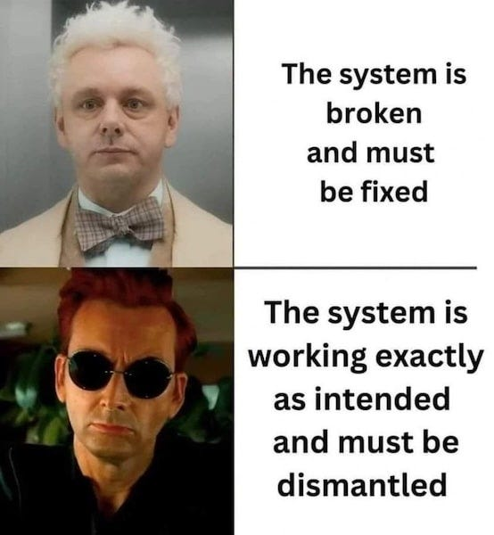
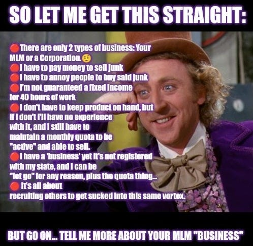
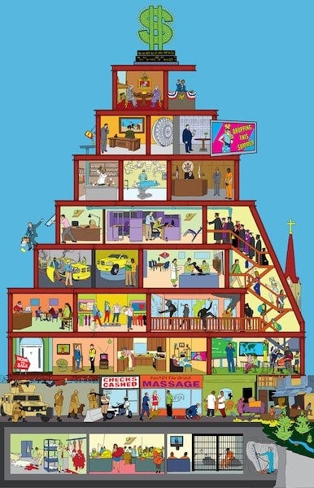
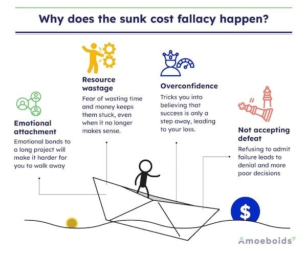
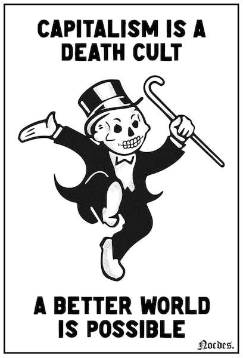

## IBM’s Turkeys - Poultry Or Profits?

In the early days of IBM, the company seemed less like a workplace and more like a religious movement, complete with its own hymn book and staff choirs singing corporate anthems, with everyone dressed identically. Bizarre as this sounds today, it came packaged with something increasingly rare: a decent wage, relatively good benefits, often a job for life, and a proper retirement plan you could actually live on.

Every Christmas, IBM gave a free turkey to each of their employees. It was a small gesture, perhaps, but one that symbolised the paternalistic relationship between company and worker that defined that era.

At some point, someone on the board ran the numbers. They pointed out the obvious, that IBM could save money by simply buying a turkey farm rather than purchasing thousands of turkeys every year from suppliers.

The proposal was shot down immediately. The board didn’t want IBM to be ‘in the turkey business.’ They didn’t want the word ‘turkey’ – with all its unfortunate connotations of failure and foolishness – anywhere near the IBM brand. Image mattered. Reputation mattered.

But here’s the interesting thought experiment, what if they had gone into the turkey business? What if IBM’s turkey operation had somehow proved wildly profitable, even more lucrative than their computing division? We might know them today primarily as a poultry company that once dabbled in computers. The stated purpose of IBM (according to their mission statements and public declarations) was to provide innovative solutions and push the boundaries of technology. If they’d become more successful at selling turkeys, perhaps that stated purpose would have quietly shifted to something about ‘nourishing families‘ or ‘agricultural innovation.’

But regardless of whether IBM sold computers or turkeys, as far as the shareholders were concerned, they were always in the same business, that is the business of making money. The specific product was just a vehicle. Making profit, increasing shareholder value, accumulating capital, that was the actual purpose of the business, whatever the corporate literature might claim. If that could be done better without IBM’s computers so be it, and ultimately IBM did get out of the desktop PC computer business for which it was once most famous because it was no longer as profitable as their consultancy division.

This reveals something fundamental about how we should understand any system, not by what it _says_ it does, but by what it _actually_ does, and _who_ it does it for.

## Where Does This Idea Come From?

The principle that ‘the purpose of a system is what it does‘ comes from cybernetician Stafford Beer, who coined the phrase in the 1970s. Beer was studying how systems – whether biological, mechanical, or social – actually function, and he noticed something crucial: systems reliably produce certain outcomes regardless of what anyone _says_ they’re meant to do. If a system consistently produces a particular result, then producing that result is the system’s _actual_ purpose, whatever mission statements or public declarations might claim. He called this principle POSIWID – ‘The Purpose Of a System Is What It Does.’

This might seem obvious, but it’s remarkable how often we fool ourselves. We judge systems by their stated intentions, their marketing, their grand promises – rather than by their actual, measurable outcomes. A school claims to educate children, but if what it actually does is sort them into social hierarchies and train them for obedience, then creating compliant children is its real purpose. A prison system claims to rehabilitate offenders, but if what it actually does is warehouse people and ensure high rates of reoffending to ensure access to cheap slave labour, then exploitation is what it’s primarily for – regardless of what any reformer intended.

Beer’s insight gives us a lens for cutting through the fog of rhetoric and good intentions. It asks us to be empirical, to say ‘don’t tell me what a system is _for_ , show me what it _does_ , and _who_ it does it for’. That’s how we discover its real purpose.

I personally learnt this lesson the hard way in Utah, where I ended up working for some of America’s most predatory businesses.

## Pyramid Schemes In The Desert

I moved to Utah hoping to work in publishing, and I did for a while. But whilst I was trying to make ends meet before landing a proper payday, I took on extra work at some of the state’s many Multi-Level Marketing companies. I wasn’t selling their wares, I was providing the technical know-how for them to run their websites, customer databases, and so on.

Initially I knew very little about how these MLM companies worked, and frankly didn’t think I needed to know. Back then I didn’t grade the evil of the corporations I worked for, and – then as now – I wasn’t particularly interested in money beyond meeting my bills (a consequence of luck and privilege for much of my life).

However, because these companies were proud of the systems I’d created for them, they would sometimes draw attention to my work as evidence of their success. This meant I ended up attending some of their conferences. Thousands of people would descend upon some conference centre to hear often-famous motivational speakers encourage them to sell more, whilst selling them the dream of being free from financial worry.

As one business after another failed, and I watched earnest people I’d come to know lose their shirts – sometimes even their houses – I began to look more closely at how these systems actually operated.

At every layer, they were passing a percentage upward, so the greater the number of people beneath you in the chain, the more money you made on their sales. They would tempt people in with a familiar script:

First, they’d tell you that you could make extra money in your spare time, just a bit on the side, no commitment, easy. Then, when you inevitably weren’t succeeding, they’d pivot to say that you weren’t making money because you weren’t treating it like a real business. Then the pressure would ratchet up, insisting you had to be prepared to go the extra mile, make sacrifices, and take risks. Finally, when it all came crashing down, they’d blame you for not working hard enough – or worse, for not believing in success fervently enough.

Yet, in the most successful MLMs, only 1-3% of participants made any money at all. Over 90% ultimately made a net loss. To believe it was the workers fault was to believe that nearly all of them didn’t really want to make money or weren’t prepared to work hard enough to make it. But a 90% failure rate doesn’t indicate personal failing, it indicates systemic design failure.

The goods were mostly sold to agents trying to sell them to other people – and, crucially, to sign up other agents who would sell them to yet other people. A few at the top of the upline made a comfortable living. But even those who seemed successful often weren’t. My brother-in-law, for instance, got a promotion for having the most sales in his division. To achieve that position, he’d remortgaged his home to invest in advertising his ‘business’, and was working eighteen hours a day. When you did the maths, he would have earnt more money working at McDonald’s.

There was just no possibility, mathematically, of the system supporting everybody. It seemed as much a tax on mathematical literacy as it was a pyramid scheme. But the focus was on the promises of success, not the averages, nor what was likely, or even possible.

 **So what was the purpose of such a system?**

They would have told you it was to help people access their healing herbs, magical vitamins, or even – in one memorable case – muscle building beef jerky, whilst supposedly helping them start their own business and achieve financial independence. But the actual purpose was always to provide profit for those at the top of the sales hierarchy. That’s what the system did.

In the process of pressuring people to buy and recruit, participants often lost friends, became estranged from their families, and frequently went bankrupt. Utah had the highest bankruptcy rate in the country, and MLMs were a major contributor. And yet people still blamed themselves for their failure – just as the system had taught them to do.

## Heavenly Investments

Utah was – and still is, albeit less so now – a very religious state, and those MLM companies relied heavily on people’s faith and hopes. In Mormon culture particularly, spiritual and material blessings are often tied together, as are personal righteousness and financial success. For this reason, some of the more sceptical Utahns told me that MLM really stood for ‘Mormons Lying to Mormons.’

The Mormon church, like many other religions, had its own fair share of critics. Some objected to its seeming departure from traditional Christianity, others to its campaigns against civil rights, women’s rights, and gay rights, and some to its considerable political and economic influence on state politics.

However, the extent of its financial empire was largely unknown, though, until recently, when it was discovered that the church had hundreds of billions invested, much of it in commercial, profit-making property. This provoked particular anger from those who had volunteered their free time to the church cleaning chapels, only to be told the organisation didn’t have enough money to pay janitors or cleaners. According to one Mormon scholar, the church spent a lower percentage of its income on helping the poor than any other major corporation in America. According to his figures, they spent more money promoting the small amount they did spend on charity than they actually spent on the charity itself.

Of course, this vast real estate holding is explained as being necessary for a ‘rainy day fund’ (should it ever be needed), and that it’s held on behalf of God for the time when it will be required to help others. Perhaps that genuinely was the intention when it started.

 **So what is the real purpose of that system?**

The church would say it exists to ‘proclaim the Gospel, perfect the Saints, [vicariously] redeem the Dead, and care for the poor and the needy.’

But what does it actually do? The answer here is a little more blurry and less straightforward than those televangelists who obviously benefit from the collection plate by accumulating sports cars, mansions, and private jets.

This is because there are generally sincere religious people involved, seeking to live up to their ideals, undoubtedly including some of their leaders. They are individuals with their own motivations and beliefs. But the system is still serving a different purpose to the one they imagine.

If an organisation is spending most of its resources owning, managing, and profiting from property, then that could legitimately be said to be a major part of – if not the primary part of – its actual purpose, regardless of what anyone involved intends or believes about it. This system does what it does, and what this system does, primarily, is accumulate capital.

This pattern of systems serving purposes quite different from their stated aims extends far beyond religion and business.

## Democracies For The Few, Compliance For The Many

Politics – in the sense of politicians deciding policies and the processes to carry them out – has almost always been made up of a privileged few. It was this way in ancient Greece, didn’t change with Rome, nor with the Chinese imperial dynasties, or the British Empire.

So it should come as no surprise that the American government was largely formed to maintain the privilege of the already powerful and wealthy, which is a category the majority of the founding fathers already fitted into.

In fact, some of them stated this openly. John Jay, who became the first Chief Justice of the Supreme Court, declared that ‘those who own the country ought to govern it.’ James Madison, often called the ‘Father of the Constitution,’ wrote in the Federalist Papers about the need to protect ‘the minority of the opulent against the majority.’

Some historians believe that many of these founding fathers’ primary worry was the loss of their slaves, and their investment in the slave trade, as Britain was already pulling away from slavery and challenging it internationally. Britain had recently ruled on not permitting slavery on their own soil, decided in the Somerset case of 1772.

The Declaration of Independence certainly lends credence to that theory. Among its litany of complaints against King George III, it accuses him of having ‘excited domestic insurrections amongst us’, which is widely understood to refer to the crown’s offers of freedom to enslaved people who would fight for the British.

In asserting their independence and setting up their own government, the founders were just following the form they’d inherited from the British parliamentary system – invented to manage the power and wealth of the Crown and Lords. These revolutionaries may have been protesting a despotic king, but they weren’t getting rid of the office of a powerful head of state entirely. They were just limiting it to election cycles and, tellingly, insulating it from direct popular vote through an Electoral College designed to act as a buffer against ‘mob rule.’

Most politicians today are millionaires working for billionaires, spending the majority of their time trying to satisfy their donors or gain new ones, meeting with the paid lobbyists of corporations, and focused on their own investments. Only a handful of hundreds of elected representatives – you could count them on one hand – don’t take part in that pay-for-play system.

 **So what is the purpose of that system?**

You could point to the high ideals of the Bill of Rights, the grand speeches exhorting freedom and liberty made by the founding fathers and some presidents and politicians since. You could even highlight positive cultural changes that were eventually followed by legislative ones, though usually only under great outside pressure from social movements.

But is that what the system is doing most of the time? It primarily facilitates the wealthy serving the wealthy, with occasional concessions granted when the alternative becomes untenable.

The recent outcry over executive overreach and the erosion of checks and balances which has culminated with millions marching chanting ‘no kings’ may yet evolve into something transformative, but for many politicians who’ve encouraged such movements, they just want their preferred leader in power as president with king-like powers and with those same unchecked abilities.

Here in the UK, we have the particularly egregious example of Reform UK, which is a corporation masquerading as a political party which receives 92% of its funding from fossil fuel interests and an increasing amount from the American anti-abortion far right. And yet they find a popular (or unpopular) cause to champion, and some rally behind them, believing they represent an alternative to the establishment rather than simply another flavour of it.

The purpose of representative politics, as it currently functions, isn’t governance in the interest of the many. It’s purpose is to manage the distribution of resources in favour of the few, whilst providing just enough of a spectacle of democracy to distract and pacify the populace. The system does what it does: it concentrates wealth and power, whilst maintaining the illusion that the will of the people is considered or ever matters unless it threatens to overthrow such structures.

And this brings us to the broader economic system that shapes all of these institutions.

## What The System Produces For Most

The dominant economic system in the world today is capitalism. Some argue it isn’t ‘pure’ capitalism, that it’s been compromised in various ways by regulation, welfare, or corporate monopolies. But it’s still a system fundamentally based on capital ownership for the purpose of accumulating profit. That makes it capitalism.

Whether capitalism is perceived as good or bad, whether it’s seen to benefit or hinder (or even actively hurt) people, often depends on what benefits people feel they’re getting from it. This perception is skewed dramatically by geography, by region, by district, and even by neighbourhood.

Just as citizens in Rome thought their empire was working splendidly, whilst the overseas slaves and tributaries had rather different views of the arrangement, so too do those living in the core of capitalist empires have very different experiences to those on the periphery.

It never ceases to disappoint me that those who live with the privilege and comforts that come from residing in the exploiter countries are so often selectively blind about the poverty, coercion, and exploitation required – from a far greater number of people outside their borders, and often within them among less advantaged populations – to maintain their standard of living.

Occasionally I’ll encounter an honest capitalist who’ll say: ‘Of course capitalism requires treating a large number of people essentially as slaves so I can live well, but that’s how empires work – anything else is unrealistic.’ _(I really have received such comments)_ It’s the logic of a narcissist who believes everyone is as selfish as they are, so they must exploit others before being exploited themselves.

But others are more idealistic. They genuinely associate capitalism with liberty and prosperity, largely because corporate-sponsored, pro-capitalist propagandists have spent decades ensuring that’s what gets taught in schools and broadcast on television. The conflation of capitalism with liberty, democracy, and prosperity isn’t accidental, it’s the result of deliberate, well-funded efforts. One need only [follow the money](https://peacefulrevolutionary.substack.com/p/the-real-conspiracy-capitalism).

Despite dubious claims about capitalism eventually lifting people out of poverty – albeit over several hundred years, according to even the most optimistic pro-capitalist estimates – the majority of people who live under capitalism today exist below the poverty line. According to the World Bank’s own figures, over half of humanity lives on less than $6.85 per day, whilst wealth concentrates ever more dramatically at the top. The system produces billionaires and growing inequality far more reliably than it produces universal prosperity.

So whilst capitalist propagandists say the purpose of capitalism is liberty or prosperity, the empirical reality tells a different story. The consistent results of capitalism are poverty for the many, a few living a little more comfortably believing it’s because they worked hard for it and it’s available to everybody who does too, obscene wealth for the few, and the systematic exploitation of labour and resources. That’s what the system does. That’s its purpose.

## The Sunk Cost of Ideals Vs Reality

So why do systems – even ones that start with good ideals – end up serving a different purpose than was originally intended? And why do people continue to support them long after this has happened, even when those systems demonstrably fail to attain (or don’t even try to attain) those stated ideals?

In the case of religion, the answer seems more straightforward: people feel personally committed to those ideals and believe they’ll be personally rewarded in an afterlife for upholding them, or punished if they don’t. The promise of cosmic justice makes present injustice more bearable, and personal faith (and perceived personal imperfections) insulates the system from criticism.

But secular systems have learnt this trick from religion. They adopt the same defensive mechanisms, the same thought-stopping techniques. They’ve employed psychologists to work in their public relations and advertising departments, and have it down to an art.

When a system fails, the focus is shifted away from the system’s design and onto individual failings. You didn’t work hard enough. You didn’t believe fervently enough. You didn’t follow the rules properly. The MLM distributor who goes bankrupt is told they lacked entrepreneurial spirit. The worker struggling on poverty wages is told they should have made better choices. The student crushed by debt is told they picked the wrong degree.

Failings – when they’re admitted to at all – are presented as aberrations, as exceptions that prove the rule, as deviations from the system’s ‘real‘ purpose rather than evidence of it. This framing stops people from stepping back and taking a broader view. It prevents them from critically examining the system itself. It keeps them focused on individual moral failings rather than structural problems.

But maybe _(usually)_ the problem isn’t them. Maybe _(usually)_ it’s the system. This isn’t a worker blaming their tools for their mistakes, but a worker being made to use tools which are designed to serve someone else’s interests far more than to build something that works for everyone.

Part of the reason people struggle to see this can be explained by the ‘sunk cost fallacy’. The more someone has invested in a system – whether that’s money, time, or identity – the harder it becomes to admit they’ve been had. When someone is conned, the more they’re conned, the less likely they are to believe they were conned, because the greater the psychological need for it to be true. This is what they’ve spent their savings on, or their entire life. This is what their neighbours, parents, and peers are doing. They can’t all be wrong, can they? Nobody likes to admitted they were fooled into being part of a cult.

And questioning brings suspicion. It threatens relationships. It means admitting you’ve been foolish, that you’ve wasted years, that you’ve hurt people in service of something that was never what you thought it was. The emotional and social cost of that realisation can feel unbearable, so the mind protects itself by doubling down instead.

This is how systems perpetuate themselves even as they fail the people within them. They don’t need to deliver on their promises – they just need to convince people that any failure to deliver is a personal failure rather than a systemic one.

So here’s the question we need to ask ourselves, again and again: **What is this system actually doing?**

Not what does it say it’s doing. Not what we hope it’s doing. Not what it used to do, or what it might do under different circumstances. What is it actually doing, right now, consistently, reliably? Here’s a simple litmus test:

  * Does the system distribute resources, power, and wellbeing more widely over time, or does it concentrate them?

  * Does it increase people’s autonomy and capacity to meet their needs, or does it increase their dependence and precarity?

  * Does it become more accountable to those it affects, or less?

  * Does it maintain its original values consistently, or does it create caveats, exceptions, and excuses for where it fails to do so as it expands its power?

If a system claims to serve people but consistently concentrates wealth and power in fewer hands, then serving people isn’t its purpose, concentrating wealth and power is. If it claims to promote freedom but consistently creates dependence and coercion, then creating dependence is what it’s for. If it claims to care for the vulnerable but consistently punishes them for their vulnerability, then punishment is the point.

The purpose of a system is what it does. And once we see what it does – truly see it, without the comforting fog of hopes and justifications – we can begin to ask the more important question: do we want to keep it, or do we want to build something better?

Subscribe

[Share](https://peacefulrevolutionary.substack.com/p/the-purpose-of-the-system?utm_source=substack&utm_medium=email&utm_content=share&action=share)

