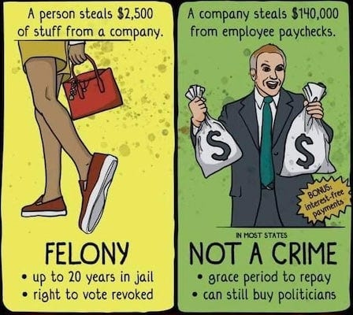
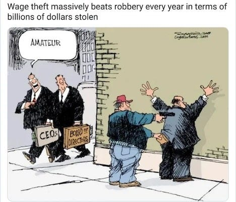
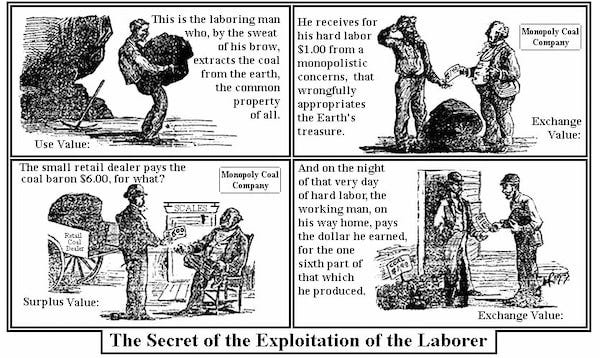
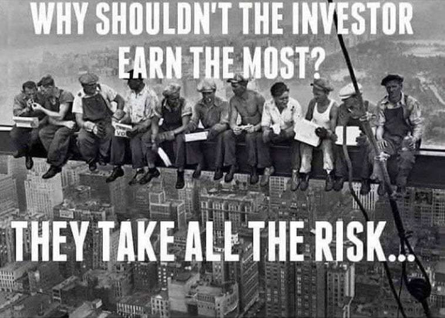
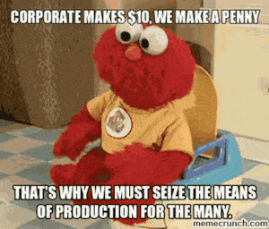

## A Conversation About Your Missing Pay

Something is wrong with our jobs. We are more exhausted and stressed than ever, yet have less to show for it. The nagging sense that no matter how hard you work, you’re never getting ahead. You feel undervalued and insecure, and have little idea what you can do about it.

You’re right to feel that way. You’re not being valued as highly as you ought to be, not just in terms of appreciation for what you do, but monetarily too. You might even be surprised by how much better off you could and should be. Let’s work through the details together. Imagine two old friends who hadn’t seen each other for a while, sitting down to chat about life.

‘How are you doing? You look exhausted.’

‘I am. I’ve been working so much lately it feels like I barely have time to sleep.’

‘How many hours do you work?’

‘Well, officially I work 40 hours a week.’

‘So unofficially?’

‘I suppose I work another 9 hours on top of that, and I spend about 7 hours a week travelling to and from work. But I’m lucky, some people are working twenty hours extra and spend even more time travelling!’

‘That’s crazy! So you’re paid for how many hours?’

‘Well, I should be paid for at least 49, but I have a salary and so only get paid for 40. Some of those who do the same job as me but are contractors who work those extra hours and just don’t report them.’

‘So your company is getting you to work 9 hours extra every week, without pay. And why do you do it?’

‘Well, if I don’t, I won’t have a job. Maybe in the past they might have kept me on if I just worked the 40, but even then I’d have been seen as a slacker and wouldn’t have any hope of promotion.’

This conversation could happen in any workplace across America, Britain, or anywhere else for that matter. It reveals the first layer of theft that happens every single day: literal wage theft.

## The Biggest Crime That’s Almost Never Prosecuted

In America alone, wage theft – employers literally not paying workers for hours worked – amounts to over $50 billion annually. That’s more than all burglaries, car thefts, and other property crimes combined. Yet whilst someone stealing a television might face prison time, employers who systematically rob thousands from their workers rarely see the inside of a courtroom, let alone a cell.

This tells us something fundamental about the character of our economic system: it’s designed to protect those who own, not those who work. The law treats property as sacred when it belongs to the wealthy, but your time, your labour, your very life hours? Those are fair game.

Let’s return to our worker and do some maths:

‘If you get promoted, how many hours will you work then?’

‘Well, managers definitely work about twenty hours extra, but they get paid about 30% more.’

‘Let me see if I have the maths right here. Let’s say you earn $/£10 per hour. You have a job that should pay 400 for 40 hours work, but the company expects you to work for 9 extra hours, that’s 90 extra they’re taking from you. So you actually earn 8.16 an hour. _(Note: UK minimum wage for under 20s is £10/$13 per hour)_

‘Now your boss gets 30% extra, that’s 13 an hour. But he works 60 hours, 20 of which are unpaid. He earns 520 a week, but because of the hours he puts in, that’s only 8.67 per hour.

‘So if you work really hard, you can work 11 more unpaid hours for what amounts to a .51¢/p raise per hour, for the privilege of a 60-hour week.’

‘Yeah, that’s how it work.’

## Wage Theft Statistics

 **The Scale of the Problem:**

  * Wage theft costs US workers $50 billion annually _(£26 billion in the UK)_.

  * This is more than all robberies, burglaries, larcenies, and motor vehicle thefts combined, which total less than $14 billion.

  * Workers suffering minimum wage violations lose an average of $3,300 per year - nearly a quarter of their annual earnings.

 **Who’s Affected:**

  * 17% of low-wage workers experience wage theft in the US _(59% in the UK)_.

  * In a study of workers in Chicago, Los Angeles, and New York, 68% experienced at least one pay-related violation in a given week.

 **Corporate Offenders:**

  * Major corporations including Disney ($233 million in wage theft penalties), Home Depot, Uber, Wells Fargo, and Amazon (each paying over $16 million in penalties in 2024 alone). _In the UK Tesco was the worst, but only £5 million in fines._

  * Only $3.24 billion in stolen wages was recovered for workers between 2017 and 2020 - a tiny fraction of what’s actually stolen.

## The Conspiracy Against Your Wages

But unpaid overtime is just the beginning. Employers actively conspire to keep your wages down through:

  *  **Non-compete agreements** that prevent you from taking better-paying jobs.

  *  **Wage-fixing agreements** between companies (Silicon Valley tech giants were caught doing this, affecting 64,000 workers). _In the UK sports broadcast companies (BBC, ITV, Sky, BT) did something similar._

  *  **Union-busting** to prevent collective bargaining.

  *  **Outsourcing and contracting** to avoid paying benefits or minimum wage.

Meanwhile, these same employers pay wages so low that government benefits have to subsidise them. In America Walmart alone benefits from $6.2 billion in public assistance annually. In Britain, working families claim £11 billion in tax credits annually because their full-time jobs don’t pay enough to live on. You’re subsidising Amazon and Tesco through your taxes whilst their owners accumulate billions.

And speaking of taxes, whilst you’re paying your fair share, the wealthy offset their living costs as ‘business expenses,’ borrow against their assets rather than taking income, and hide their wealth in offshore accounts. You pay more in tax on your labour than they do on their capital gains.

## But Here’s the Real Theft

Let’s return to our overworked friend and discover other ways in which they aren’t receiving the full value of their work.

‘So what do you actually make at work?’

‘Coffee, mainly, and I sell some pastries.’

‘And how many cups of coffee per hour on average do you think you make?’

‘About 30-50 cups per hour, depending on the time of day, plus selling other snacks.’

‘And they are paying you only $/£10 per hour.’

‘I think I know where you’re going with this, and they’d say they have to supply the coffee, the milk, the premises, all the equipment etc.’

‘Fair enough, let’s work out exactly how much they’re taking from you. Can you estimate how much revenue you generate in a full day?’

‘Well, I serve about 300 customers on a busy day, average transaction is probably 5...’

‘So that’s 1,500 in revenue you’re directly responsible for. Now, what about the actual cost of materials: the coffee, milk, cups, all that?’

‘The manager complained once that our costs take about 40% of revenue.’

‘So 600 in materials. And your daily wages?’

‘80 for the day if I don’t do unpaid overtime.’

‘Right. So 1,500 minus 600 in materials, minus your 80 wage... that leaves 820.’

‘But surely they have other costs: rent, utilities etc.’

‘Of course they do. Let’s be generous and say overhead costs are another 420 per day per worker. That still leaves 400 in profit from your labour alone. Every single day.’

‘Hang on though, I’ve seen the company figures. Starbucks makes about 8,000 profit per employee per year, not 100,000. Are you making this up?’

‘Good catch, but here’s what those company-wide averages hide. First, you work in a busy city-centre location. Your shop brings in far more than the average. Second, that “per employee” figure includes everyone: head office staff, warehouse workers, regional managers, IT support, and people who don’t directly generate customer revenue. But more importantly ...’

‘Something tells me it gets worse.’

‘Yep. That 8,000 profit per employee? That’s what’s left _after_ paying the CEO his 15 million, after the board takes their bonuses, after shareholders take their 2.8 billion in dividends. That’s 7,756 per employee just in dividends, by the way, after the commercial landlords take their rent, after the banks take their interest. So even by the company’s own figures, each employee generates enough value to give nearly 8,000 to shareholders and executives, _and_ still leave 8,000 in profit per employee not given to them.’

‘So the “profit” is what’s left after all those people have already taken their cut?’

‘Exactly. And you’re earning 20,800 before tax. So even using the conservative company-wide averages, you’re generating at least 16,000 in value that goes to people who don’t make coffee, probably far more in a busy location like yours. The value you create is divided between your wages and this entire class of people: owners, executives, shareholders, landlords, all extracting value from those who actually do the work.’

‘And I thought I was doing alright because I get a few tips.’

‘Those tips? That’s customers subsidising your employer’s wage theft. They know you’re not paid enough to live on, so they feel obligated to make up the difference. Your boss has outsourced part of your wages to the customer’s conscience.’

Want to know roughly how much value your employer extracts from you? Here’s a simple calculation:

  1. Estimate the revenue you generate per day (customers served × average transaction, widgets produced × sale price, etc.).

  2. Subtract the actual cost of materials you use.

  3. Subtract your daily wages.

  4. The remainder? That’s approximately what’s being taken from the value you create.

This is why wages themselves are theft. You’re not being paid the value of your labour, you’re being paid just enough (sometimes not even that) to come back tomorrow and create more value for someone else.

In some cases the value they are taking is enormous, in others it is a smaller percentage, but either way it is not something you have a choice over, that is taken without your consent, which is decided at the top for the benefit of the shareholders and owners.

## Profit Per Employee at Major Companies

 **Tech Giants (showing extreme value extraction):**

  * Apple: $2.38 million revenue per employee, $571,560 profit per employee.

  * Nvidia: $2.024 million profit per employee.

  * Meta: $2.19 million revenue per employee.

  * Microsoft: $1.08 million revenue per employee.

  * Amazon: $410,000 revenue per employee, approximately $20,000 profit per employee.

 **Retail/Service (where most wage theft occurs):**

  * Starbucks: $94,000 revenue per employee (with net income suggesting around £10,000-15,000 profit per employee).

  * McDonald’s: $102,815 revenue per employee.

  * Walmart: $7,386-9,260 profit per employee.

Apple makes over half a million pounds in profit per worker annually, whilst many of its supply chain workers struggle on minimum wage. Even at Walmart, where profit per employee is ‘only’ £9,260, that’s still substantial value being extracted from workers earning poverty wages.

What does our fictional working friend think of all this?

‘So let me get this straight - Apple makes £571,000 profit from each employee’s work per year?’

‘Right. And remember, that’s profit AFTER they’ve paid wages. The average Apple employee salary is around 120,000, which sounds good until you realise they’re generating nearly five times that in pure profit for shareholders.’

‘What about somewhere like Walmart?’

‘Even Walmart, with their famously thin margins, extracts over 9,000 in profit per worker. And their average worker makes about 25,000 a year, but a large number still require government assistance to pay their bills. Meanwhile, wage theft alone (free money for the employers at the workers expense) is costing American workers more than all property crimes combined.’

This is exploitation at every level – the wages they don’t pay, the wages that don’t cover living, and the value you create but never see.

## The Mythology of Risk

‘But wait,’ our friend says, ‘they took the risk of starting the business. My boss mortgaged his house to open this café. Doesn’t that entitle him to the profits?’

‘Alright, let’s talk about risk. What happens if this café goes under?’

‘Well, he loses his investment.’

‘Does he? He’s a limited company. He declares bankruptcy, the company folds, and he walks away. The bank might repossess some business assets, but his house? His car? His personal savings? Protected. That’s what “limited liability” means.’

‘But he could lose everything he put in!’

‘And what happens if you lose your job tomorrow?’

‘I ... I’ve got maybe two weeks’ savings. After that, I can’t make rent.’

‘So you risk homelessness. What else?’

‘Well, I’d lose my health insurance through work _(in the US)_. I’ve been putting off getting this tooth looked at because even with insurance the co-pay is steep.’

’So you risk your health. What about your kids?’

‘Damn. Then I can’t pay for their school uniforms, their lunch money, and the that school trip coming up.’

‘So remind me, who’s taking the bigger risk here? The owner who might have to sell his second property and start another business with his remaining capital? Or you, who risks everything just by showing up to work each day, knowing one accident, one illness, one downturn could destroy your entire life?’

‘Well, when you put it like that.’

‘There’s more. What entitled him to have capital to invest in the first place? Where’d that money come from?’

‘He inherited some, I think. And he had savings from his previous corporate job.’

‘So he had money because he already had money. And now he uses that inherited advantage to extract value from your labour. You’re taking life or death risks with your basic survival. He’s gambling with surplus wealth. These are not the same thing.’

## Taking Back What’s Ours

‘Okay, I get it. We’re being robbed. But what can we actually do? I can’t just not work.’

’What about unions?’

‘We tried organising once. Management got wind of it, the main organiser got sacked for “performance issues,” and everyone got scared.’

‘That’s the classic union-busting playbook. But when unions do succeed, they can win higher wages (maybe 20% more on average) better conditions, more job security. Strike action can force real concessions.’

‘So unions are the answer?’

‘They help. But here’s the thing, they still leave shareholders and owners in place. You might get a slightly bigger slice of the pie, but someone else still owns the bakery.’

‘So what’s the alternative? Worker cooperatives?’ We all club together and buy the café?’

‘Sometimes, yes. Or start our own. In Mondragón in Spain, 80,000 people work in cooperatives. They elect their managers, share the profits, make decisions democratically.’

‘That sounds better. Better wages, I assume?’

‘Usually, yes. Better job security, better benefits, higher job satisfaction. But, cooperatives often produce less value than capitalist firms.’

’Wait, I thought that was good?’

‘It is good. Sort of. It’s good because they’re not trying to extract maximum profit. It’s good because workers aren’t doing unpaid overtime. It’s good because they make more ethical choices. Cooperatives reinvest more in their communities and workers. But all of this makes them less competitive in the marketplace. More likely to be priced out.’

‘So we’d still have to compete with Starbucks, Costa, all of them. They’ve got billions for advertising, prime real estate locked up etc.’

‘Exactly. Cooperatives operating in a capitalist market face massive disadvantages. They’re a step forward, but not the full solution.’

’What about going further? Communes? Living outside the system entirely?’

‘Communes and intentional communities attempt to create spaces outside capital, but they’re disadvantaged by tax systems designed for private property and limited in what they can produce independently. You can’t really escape the system when the system controls the land, the resources, the infrastructure.’

‘So we’re back to square one?’

‘Not quite. The old craft unions just wanted better wages within the system, but the revolutionary unions like the IWW and the CNT had a different idea. They didn’t want to negotiate with the bosses. They wanted to take over the workplace entirely.’

‘Take over? Like, literally kick the owner out?’

‘It’s been done. In Argentina after the 2001 crisis, workers occupied and took over 200 factories. The owners had abandoned them, stopped paying wages, but the workers kept showing up. They broke in, started the machines, and kept producing, but now they shared the profits amongst themselves.’

‘I like the idea of that. But it’s illegal, surely?’

‘So was the eight-hour workday. So was the weekend. So were unions themselves. Every right we have, workers took illegally first and forced the law to catch up.’

’But how would we run it? None of us know the business side.’

‘Don’t you? Who knows how much coffee to order? Who knows when the rush times are? Who trains the new staff? Who actually knows how to fix the espresso machine when it breaks?’

‘Well, us, I suppose.’

‘And who currently decides your wages, your hours, whether you can take time off when your kid’s sick?’

‘Head office. People who’ve never worked a day in a café.’

‘Right. So who’s more qualified to make those decisions: them or you?’

‘I see your point. But even if we took over every café, every workplace, then wouldn’t the government just send in police?’

‘If it’s just one workplace? Maybe. But imagine a general strike, with everyone, everywhere, (or at least too high a percentage for them to police) stopping work at once. Not to demand better wages, but to take back what we produce. They can’t arrest everyone. They can’t run everything without us.’

‘That sounds like a revolution.’

‘It is. The question is whether we keep letting them steal from us, or whether we take back what’s ours.’

‘I don’t know. It sounds risky.’

‘Riskier than spending your whole life making someone else rich whilst you struggle to pay rent? Riskier than knowing your kids will face the same theft, the same exhaustion, the same anxiety about basic survival?’

‘When you put it like that it does sound obvious. But, what would we even call ourselves if we weren’t workers anymore?’

‘How about just “people”? People who work together, create together, and share what we produce. No owners, no employees. Just us.’

## The Simple Truth

The workplace and what it produces belong to the workers who work there and the communities they’re part of. Not to shareholders who’ve never set foot in the building. Not to executives who earn hundreds of times what their employees make. Not to landlords who extract rent whilst producing nothing.

Every hour you work for wages, value is being stolen from you. Every product you make enriches someone who didn’t make it. Every service you provide profits someone who didn’t provide it.

This isn’t a bug in the system – it’s the system’s fundamental feature. Capitalism requires this theft to function. It requires that those who own extract value from those who work.

The question isn’t whether you’re being robbed. You are. The question is: what are we going to do about it?

The answer begins with recognising the theft, understanding its mechanisms, and organising with your fellow workers. Because the same system that steals from you, steals from them. And together, we outnumber the thieves.

The revolution doesn’t require taking something that isn’t ours. It requires taking back what always was.

Stop the theft. Reclaim your workplace. Build the new world in the shell of the old.

Subscribe

[Share](https://peacefulrevolutionary.substack.com/p/how-much-is-your-employer-stealing?utm_source=substack&utm_medium=email&utm_content=share&action=share)

 _This conversation was inspired by the political dialogue,[At The Cafe](https://theanarchistlibrary.org/library/errico-malatesta-at-the-cafe), written by Errico Malatesta. It’s amazing how little has changed since 1920 when he wrote it._
