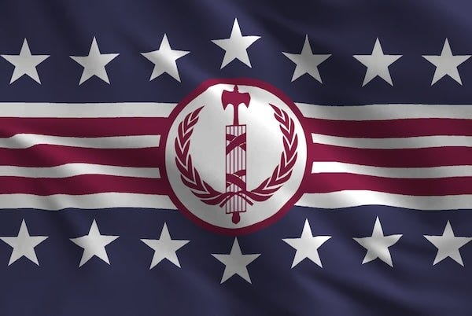
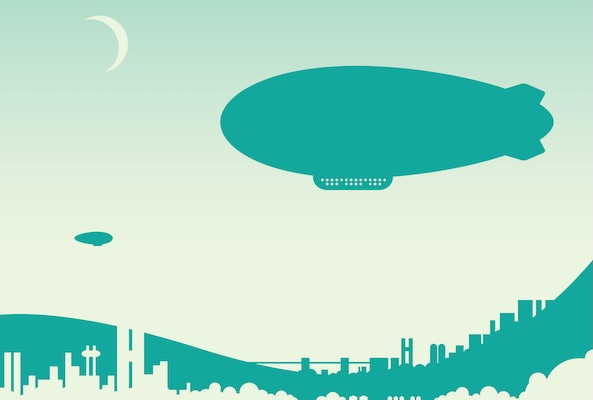
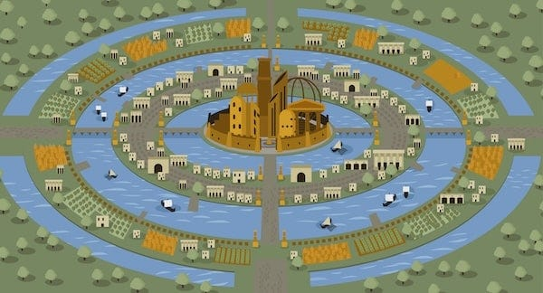

_[Last year I wrote a short story](https://peacefulrevolutionary.substack.com/p/antillias-utopia) about a reporter visiting the island of Antillia in the 1930s and how their egalitarian society operated. Since that time the island has become the subject of mystery, and some have wondered if it has maintained its ideals a hundred years later._

 _In this follow up series, set in the near future, the reporter’s grandson makes that same journey, but for a very different purpose, as the country he is from is now a right-wing nationalist nation and his opinions reflect this twisted worldview (and not my own), although his beliefs will be challenged during his visit to the island throughout the time he spends there._

## What Does It Mean To Be Liberated?

 _ **The Patriot’s Voice, 22nd August 2033, William Bradford reporting**_

In our glorious empire, to be liberated means to be completely loyal to the regime, to be free from our heretical thoughts and sins – ideally even from the chance to commit them. In this way we are released from doubts and uncertainty. It means to have no room in our mind for heretical notions such as diversity, wokeness, and socialism.

For us as a nation to be liberated means to be winning our war against the trifecta of evil: the bleeding hearts, the illegals, and the lefties. Although anyone who does not accept our emperor as the rightful ruler is, of course, part of this conspiracy. So, we must always be vigilant, as they continue to lurk in the shadows, and even our neighbours and family may be compromised by their ideals.

Flag of the United Godly States _\- Efficient-Amount-315_

However, on the Isle of Liberation (as the locals call the Antillean isle), the word means something altogether different, almost the exact opposite of the correct way in which we use it.

A hundred years ago, my grandfather Will visited Antillia, bringing back with him a tale of a utopia which continues to be brought up by critics of our holy kingdom to this day. Of course, I’m not as easily fooled as he was. Yet, the island is even more a mystery now than it was then.

Naturally, we can’t believe the reports that the island is a red paradise that come out of Nuevo-Europa these days. After all, they think we are a fascist dictatorship, so are not to be taken seriously. And up until now – in its wisdom – our Godly state has forbidden anyone from visiting that decadent, ungodly place.

But in order to prove once and for all how awful and sinful the island and its people really are, they have granted me the great privilege of visiting and exposing the truth. Now, for the first time I shall redress the mistake my namesake made, and bring you the real story - in my upcoming dispatches - of the evils that go on when people spurn the wisdom of our Dear Leader and his holy cause.

Unfortunately, there are no direct flights from our United Godly States to Antillia, but a supply boat goes there once a month and a blimp every quarter. I am just in time to take the latter, an eyesore which doesn’t even use the fossil fuels nature has granted us and is terribly inefficient. But the journey gives me the chance to meet and speak to my first Antillean, a real ‘liberationist’ themselves.

There was no first class section to sit in – the seating was more like a lounge occupied by all kinds of people, with no way to tell their status – but I spied one particularly cosmopolitan-looking individual and decided to engage him in conversation.

## Liberation’s History

His name is **Miguel Desmarais,** and after initial introductions he tells me that he is coming back home from doing voluntary work overseas. I presume the Antilleans must send their young people to nations that are even more impoverished to make their own look good, but as if sensing this is what I was thinking, he tells me he spent a few days in Barcelona prior to returning. This just goes to show how much that once-modern city must have suffered after Europa stopped their trade deals with us.

He asks me why I’m visiting the island, and since I’m determined for everyone to think I’m on a goodwill mission, I’m careful not to disabuse him of that notion. We speak about my grandfather’s visit there, which they still fondly remember, and he informs me that it has changed a great deal since his visit. For the worst, no doubt (though I don’t say that out loud). Then we get on to something that may be of more interest to our readers when I ask him:

‘Could you tell me some more about the history of your island? From what I understand it was originally civilised by the Portuguese.’

‘Civilised? It was the indigenous inhabitants who civilised the Portuguese who washed ashore.’ He looked as if he wasn’t sure if I was insulting him or joking with him, and luckily for me decided on the latter.

‘How so? After all, the Portuguese brought Christianity, farming, and the written word. What could the native Antilleans offer them?’

Miguel smiled, though whether at what he considered my ignorance or something else, I couldn’t tell. ‘Well, for one thing, they offered them their lives. The Portuguese sailors were shipwrecked, their vessel was destroyed in a storm. They would have died on the beach if the indigenous people hadn’t taken them in, fed them, healed them.’

‘Charity, then,’ I said. ‘Very noble. But surely after that …’

‘It wasn’t charity,’ he interrupted gently. ‘It was simply how things were done. But you asked what they offered. The indigenous Antilleans had something the Portuguese had never encountered: a way of living without masters and slaves.’

I must have looked sceptical, because he continued.

‘The Portuguese assumed at first they’d encountered a matriarchy, because they couldn’t comprehend a society without hierarchy and which women played an equal role. But there were no rulers at all - no kings, no chiefs, no lords. Decisions were made collectively, through discussion and consensus.’

‘Anarchy, then,’ I said, barely suppressing a shudder. ‘How did anything get done?’

‘Quite well, actually. But the sailors were free to join the community or not - that was another principle. No compulsion. Everything was voluntary. If they wanted to integrate, they had to learn the language, respect the customs.’

‘And if they refused?’ My mind was full of images of tribal cannibalism.

‘Then they could leave, or live separately. Though I imagine survival was easier together. But there were other rules, you understand - not laws exactly, but agreements. No one could claim land or resources as their own property. There was no slavery, which must have been quite shocking to the Portuguese.’

I thought of our own productive use of correctional labour and said nothing while he carried on with his dubious sermon.

‘The indigenous people had sacred spaces that had to be respected,’ Miguel went on. ‘And there was an underlying environmental principle to all this: you don’t take out more than you put back in. Whether that’s from the land, the sea, or the community.’

‘Sounds like a waste of profitable resources,’ I ventured.

‘Perhaps. Though they managed to preserve their language and culture in ways that many indigenous peoples couldn’t, once Europeans arrived. And they were open to beneficial exchange, they valued the Portuguese knowledge of navigation, their medical techniques, their connections to broader trade networks. Over time, more groups arrived.’

‘Really? More shipwrecks?’

‘Mostly visiting Spanish sailors, French merchants, and the occasional Dutch or British trade vessel. Each group brought their own knowledge, their own languages. If they acted as respectful guests they were welcome, and some even stayed and became family.’

‘And you expect me to believe there were no conflicts?’

‘There were some, but they always sought to handle them peacefully if possible. For example once there was a slave ship, damaged and desperate, which limped into port. The captain hoped to repair and continue to the Americas.’

‘And some slaves escaped?’

‘No quite. The Antilleans, who were by now a mixture of the indigenous people and the integrated Portuguese, made it clear that no one would leave the island enslaved. The ship was welcome to repair and depart, but any person who wished to stay could do so freely. The captain left with an empty ship and a lot of angry investors, I imagine.’

‘I see.’ I made a note to mention the Antilleans’ disregard for property rights and contracts.

‘Then a hundred years ago, around the time your grandfather visited,’ Miguel continued, ‘we’d had a group of political dissidents arrive - writers, scientists, artists fleeing persecution in the 1920s and 30s. Around that time some of our people even volunteered to fight in the Spanish Civil War, and later sent support to Rojava and the Zapatistas. And there have always been sailors who’ve decided to stay, who preferred our way of life.’

‘And now?’ I asked. ‘Who do you trade with?’

‘Mostly Nuevo-Europa and various African communities. We have good relations with those who share similar values.’

I thought of the stories of Europa’s socialist decline on our state-approved media and nodded. Of course they would trade with other godless nations. It all made perfect sense.

## Liberationist Freedoms

Then I turned the conversation back to the question this article started with:

‘You call your island Liberation, and your people call themselves Liberationists. Why not just Antilleans?’ I asked.

Miguel leaned back, considering his words. ‘We are born Antilleans - children of the island. But we choose to be Liberationists.’

‘But what do you claim to be liberated from? After all, you claim your people were never colonised in the way that other new nations were.’

‘Exactly. We are liberated from such rulers,’ he said simply.

I almost laughed. ‘But you must have some form of government? Bureaucrats? Administrators? Surely someone has to organise things, don’t you need experts, educated people who know better?’

‘We have people with expertise, certainly. But they don’t rule. They advise, they share knowledge, we listen to them carefully and respect their experience, they specialise in the work they’re skilled at and are given the resources to do it, but they have no power to compel others.’

Of course such a notion was ridiculous. Without hierarchy, without someone in charge, how could anything function? It was basic human nature – there would always be those who led and those who followed. They’d simply given their rulers a different name, probably called them ‘coordinators’ or some other bit of semantic trickery. Yet I continued to play along, nodding earnestly as if I found this fantasy plausible. After all, the more rope I gave them, the more they’d hang themselves with their own absurdities.

‘So how do you decide and enforce your laws?’

‘We don’t have laws. We have agreements, understandings, customs, but no laws, no legal system, no courts.’

‘That would be anarchy.’

‘Indeed.’ He replied, as if I’d given him a compliment.

‘So chaos reigns, then?’

‘No. Not at all.’

‘But without law, what’s to stop bullying? Abuse? The strong simply taking what they want from the weak.’

‘Does law stop those things in your country?’ he asked mildly.

I ignored the impertinence. ‘And property? I assume you’re liberated from that too?’ I’d heard that commies rejected even that fundamental pillar of freedom, but found it hard to imagine.

‘Yes. Land, resources, homes - these aren’t owned. They’re used, cared for, shared.’

‘So no one has any security. No rights. Anyone could take your home, your possessions, everything you’ve worked for?’

‘It doesn’t work like that. People have what they need, and use what they need, and when they don’t need it and aren’t using it others are free to make use of it. But why would someone take your home when they have their own? Why would they take your tools when they can access tools whenever they need them?’

The whole idea was absurd of course. Without property rights, there was no incentive to work, no security, no way to prove what was yours. They must live in constant anxiety, though he seemed calm enough about it.

‘And money?’ I pressed. ‘I’ve heard it claimed that you don’t use it.’ After all, what use was labour if you couldn’t use your wages to buy what you needed or wanted?

‘I agree. It’s not of much use at all. We’re liberated from money too.’ He smirked as he said this, showing he knew what he was saying was provocative.

‘Free labour, then. And what happens when there aren’t enough people willing to do the unpleasant jobs? What about efficiency? Without prices, how do you know what’s scarce or needed? You must have constant shortages.’

‘We work out what needs doing, and we do it. If something is unpleasant, we share the burden or find ways to make it better. As for scarcity – we produce what we need and share it. It’s really quite straightforward.’

The man was either incredibly naive or a skilled propagandist. Either way I could see he actually believed in his story, despite whatever the reality was.

‘One last question,’ I said, trying to keep the skepticism from my voice. ‘You say you’re liberated from rulers and governments. But surely you have some form of collective organisation? Some structure for making decisions that affect everyone? You’ve just reproduced the state under a different name, haven’t you?’

‘We organise, yes. We coordinate, we discuss, we decide things together. But there’s no separate body with a monopoly on what is considered legitimate violence, no institution that can compel obedience. That’s what makes it different from a state.’

I made my notes carefully. His delusion was complete, he’d convinced himself they’d abolished hierarchy, law, property, money, and the state itself, when obviously they’d simply renamed these things and pretended otherwise. Such fantasies can’t change brutal reality. Competition is our natural state, not cooperation. People are the same everywhere – just as selfish, just as prone to violence and greed.

Besides, if any of this were actually true – if a society could function this way – surely our government would have told us? Or our corporations would have switched to such a model? They wouldn’t have banned travel to Antillia unless there was something dangerous there, something that needed to be hidden from our eyes. Not something that worked.

Of course I didn’t believe a word of it. Too ridiculous to be true. And yet, I couldn’t help but be impressed at his devotion, the earnestness with which he described this impossible society. He truly seemed to believe it.

Well, I would have a chance to see it for myself soon enough. And when I do, I’ll show you, dear readers, just how ludicrous these claims truly are. Every utopia reveals itself to be tyranny with a smile, given enough time. I had no doubt that Liberation would be no different.

 _In future dispatches, I plan to expose their dysfunctional trade networks, their backwards industries, their chaotic distribution systems, their inadequate medical care, and their godless educational indoctrination. I’ll document their sinful debaucheries and moral decay, proving once and for all that their supposed utopia is not merely an illusion, but a dangerous infection that must never be allowed to spread to civilised nations._

Subscribe

[Share](https://peacefulrevolutionary.substack.com/p/liberation?utm_source=substack&utm_medium=email&utm_content=share&action=share)

 _You can read the next part of the story here:_

 _You can read the previous article here:_
