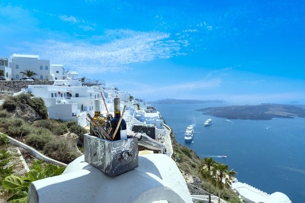
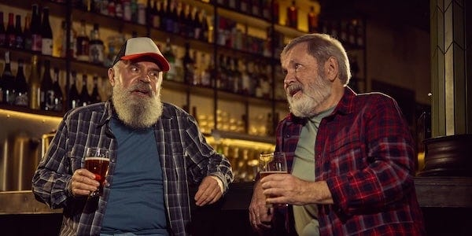
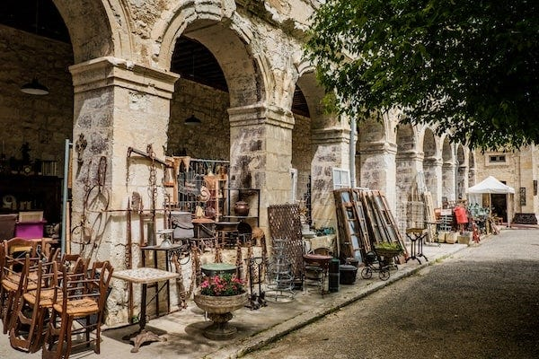

_[In the previous dispatch](https://peacefulrevolutionary.substack.com/p/liberation) we learnt of our intrepid right-wing reporter’s doubts about the seemingly utopian isle of Liberation, and now learn about his first impressions when he arrives. Note: those who read the previous article will of course realise this is satire._

## Arrival at Port

We touched down at a specially constructed pier jutting out into the harbour, apparently designed specifically for docking blimps. One presumes they wouldn’t permit anything they consider foreign territory to touch their precious island directly, hence their complete absence of airports. Though my guide later claimed this was an environmental concern, I found it rather convenient that they’d avoid the tourist revenue that proper air travel would bring. If they could attract tourists, that is.

Miguel offered to show me around the port, but I politely declined. I knew they’d assigned me a chaperone - though they preferred the euphemism ‘guide’ - and I wanted to demonstrate my willingness to comply with their rules. Besides, I was told a translator would be necessary due to language differences between various communities on the island. Why the European settlers hadn’t insisted on a common tongue, I’ll never know, but I suspected the real purpose was to ensure I didn’t see anything they preferred to keep hidden.

What surprised me immediately was how active the port appeared. Far from the isolated backwater I’d imagined, there were two ships already docked, another waiting offshore, and room for at least one more vessel. Clearly they must rely heavily on imports to maintain even a basic standard of living. Heaven knows what they offer to entice ships to this godforsaken place, but I was determined to find out. The presence of so many foreign sailors already suggested that things might be different than I’d expected, at least on the surface.

## Meeting My Guide

My guide arrived a few minutes late, apologising profusely and blaming it on the blimp’s favourable headwinds. His accent was difficult to place, it was not quite Spanish, not quite Portuguese, with something else mixed in. Judging from his complexion, he likely had mixed indigenous and European ancestry. If the passengers on the blimp were any indication, this appeared to be the norm here.

He introduced himself as Carlos Mendoza and asked about my journey, engaging in the sort of pleasant small talk one would expect. Eventually he asked if I’d like a cup of coffee before we made a brief tour of the island’s largest city (which he called Porto Liberdade) and then settled me into my accommodation. I agreed readily enough. Coffee sounded excellent after the journey.

## The First Crack in the Façade

Carlos led me to a small café overlooking the harbour. It was here that the first of their utopian theories crumbled before my eyes.

My guide paid for my drink. With money.

Some sort of printed voucher changed hands, and I received a steaming cup of quite decent coffee in return. So much for their claims of having abolished currency! I knew that whole story Miguel had spun must have been propaganda. The coffee itself was good enough, probably imported from Brazil, specially procured to impress visitors like myself.

‘I thought you didn’t use money here,’ I said, trying to keep my tone neutral rather than triumphant.

Carlos smiled. ‘These are labour vouchers, not money. They work a bit differently.’

‘A voucher is still currency, surely?’

‘In Porto Liberdade, we use them for certain exchanges. Particularly when dealing with visiting sailors and traders. But they’re not money in the traditional sense. They expire at the end of each week, you can’t accumulate them indefinitely, and they can’t be used to purchase property or employ others.’

I made a note in my journal. _Labour vouchers = money by another name. First lie exposed._

## Settling In

After finishing our coffee, Carlos helped me carry my bag to my lodgings. It was a modest but clean room overlooking the harbour. The accommodation was in a building that also housed a common dining area and bar on the ground floor.

‘Guests used to stay in the dormitories that many city residents use,’ Carlos explained. ‘But we’ve found that visitors from ... different cultures ... prefer more private accommodation.’

I could read between the lines. Their collectivist housing wasn’t comfortable enough for foreign visitors, so they’d had to make concessions to civilised standards.

He informed me that meals were available downstairs, and there was a bar as well. Alcohol might prove useful in loosening tongues and getting past the carefully rehearsed responses I expected. Though I’d managed some sleep on the blimp, I found myself restless with curiosity.

‘Would it be possible to begin tomorrow’s tour this afternoon instead?’ I asked. ‘I’d like to make the most of my time here.’

‘Of course,’ Carlos agreed. ‘Let me show you some of the city. We can start with the market district if you’d like?’

A market too! The man I’d met on the blimp insisted this wasn’t a market economy, and I’d almost believed him.

## Sailors’ Tales

As we descended to the ground floor, we passed a group of sailors already beginning their evening revelries at the bar. Their ships’ flags (Norwegian and Greek) were visible through the windows, bobbing gently in the harbour. Seeing an opportunity for unfiltered information, I excused myself from Carlos for a moment and approached their table.

‘Good afternoon, gentlemen. Might I ask what brings your vessels to Antillia?’

A bearded Norwegian, already well into his cups, grinned widely. ‘Trade, friend! We bring manufactured goods, electronics, medicines they can’t easily produce. We leave with crafts, preserved foods, some rare timber.’

‘And they pay you in...?’

‘Gold, foreign currency, sometimes barter. The harbour master keeps it all in a bank - proper money, not those voucher things the locals use.’ He leaned in conspiratorially. ‘Between you and me, someone’s getting rich off that arrangement. Always follow the money, eh?’

 _Aha,_ I thought. So there was a bank after all. Someone was profiting from all this trade, accumulating wealth while the masses made do with worthless weekly vouchers. The hierarchy I’d suspected must exist was beginning to reveal itself.

Sensing my suspicions the Greek sailor added, ‘My Norwegian friend isn’t trying to convince you of his conspiracy theories is he? If you believe him there is some secret king hiding in the mountain hoarding all the gold.’

Although that sounded unlikely, this sailor had obviously been duped into believing that greed somehow didn’t exist on the island, and I couldn’t help but call him out about it.

‘Well to hear you talk about this place it sounds like the streets are paved with gold. If it’s that much of a utopia I’m surprised your captains let you comes ashore freely.’

‘Well,’ the Norwegian sailor interjected. ‘Not all ships allow it though. Some captains tell their men the Antilleans are cannibals, savages, that sort of thing. Keeps them on the ship.’

‘And are they? Dangerous, I mean?’

Both men laughed heartily. The Greek sailor adding, ‘Dangerous? They’re the friendliest bloody people you’ll ever meet! Some of our boys have jumped ship to stay here. Can’t say I blame them, with no bosses breathing down your neck, everything shared freely ... though I’d miss the sea too much myself.’

‘But surely without proper authority, without law and order ...’

Before the Norwegian sailor could share his views about this, the the Greek one shook his head. ‘They sort things out among themselves. Had a dispute with a local once. We we worked it out over drinks. No police needed. It’s strange, I’ll grant you, but it works somehow.’

The Norwegian sailor, annoyed at the other ones interruption excused himself, leaving me intrigued as to what he might have said.

This was my cue to leave too, and I rejoined Carlos, my mind working furiously. Sailors defecting to stay? Either these men were part of the propaganda effort, or something more insidious was happening. Perhaps they went through some form of indoctrination or coercion that made them forget their proper loyalties.

## The Market District

Carlos led me through narrow, winding streets toward what he called the market district. The buildings were an eclectic mix of styles, some clearly quite old, others more recent, all maintained to varying degrees. People nodded greetings as we passed, and Carlos stopped occasionally to exchange brief words in what I assumed was the indigenous language.

Then we reached the market square, and I felt a surge of vindication. Stalls lined the plaza, merchants called out their wares, and people examined goods before making purchases. It was exactly like any market in a capitalist society. Perhaps a bit more chaotic, certainly more colourful, but fundamentally the same. Whatever Miguel had claimed about their system, here was the proof: they used markets just like everyone else.

‘I thought you said you didn’t have markets,’ I said to Carlos.

‘I didn’t say that,’ he replied mildly. ‘I said most of the island doesn’t use this model. Porto Liberdade is unique. It’s our main port of contact with the outside world, so it made sense to have a system that could interface with sailors and traders who expect markets.’

‘So this is market socialism, then? Like Yugoslavia tried?’

‘Something like that, though simpler. The other cities and communities on the island mostly operate through mutual aid and free distribution. But in this city we use labour vouchers for convenience, especially when dealing with foreign trade.’

We walked through the market, and I observed carefully. There were craftspeople selling pottery, woven goods, and woodwork. Tailors offered clothing. There were barbers and - I noted with some amusement - several tattoo parlours clearly catering to the sailor trade. Food vendors sold meals and preserved goods.

‘These merchants,’ I asked, ‘do they employ workers? Surely someone must be producing all these goods?’

‘The craftspeople work for themselves or in cooperatives. No one employs anyone else, that would contradict our principles. The labour vouchers they receive reflect the hours they’ve contributed.’

‘And if someone refuses to work?’

‘Then they don’t receive vouchers. But they’d still have access to housing, food, healthcare, education, as those are free throughout the island. The vouchers are mainly useful for luxuries, personal preferences, or trade goods from the ships.’

I made copious notes. It all sounded very neat, but surely there were cracks in this system. How did they prevent some people from accumulating more vouchers than others? And if basic necessities were truly free, where was the incentive to work at all?

## The Bank

‘You mentioned that the harbour master keeps foreign currency,’ I said. ‘That implies a bank of some kind?’

Carlos nodded. ‘Yes, the port authority maintains reserves of foreign currency and gold for external trade. We can’t produce everything we want, as the presence of trade vessels shows. We trade for medical equipment, certain electronics, rare materials.’

‘And who controls this bank? Who decides how the money is spent?’

‘The port workers’ assembly. They meet monthly to discuss trade priorities, what we need most urgently, what we can offer in exchange. Anyone involved in port operations can participate.’

‘But someone must actually manage the funds day-to-day?’

‘There are administrators, yes. They handle the bookkeeping, coordinate with foreign vessels, maintain the records. But they’re accountable to the assembly, to everybody.’

I nodded knowingly. Of course there were administrators. And where there were administrators, there was power. Perhaps not a formal government, but certainly a de facto ruling class. They’d simply disguised it with the language of assemblies and coordination. Someone was profiting from this arrangement - they had to be. Why else would anyone take on the responsibility of managing what must be considerable wealth?

## Tomorrow’s Investigation

As evening settled over Porto Liberdade, Carlos walked me back to my lodgings. The streets had grown livelier. There were people gathering for meals, music drifting from open windows, children playing in the squares despite the late hour. It all seemed remarkably peaceful, almost unnaturally so.

‘Tomorrow,’ Carlos said, ‘I thought we might visit one of our coordination hubs. It will give you a sense of how we make collective decisions and distribute what is needed.’

‘Your headquarters, you mean?’

He smiled that mild smile I was beginning to recognise. ‘We don’t really have headquarters. But yes, a place where people gather to coordinate activities and make decisions together.’

Excellent. Tomorrow I would get to the heart of their system, see where the real power resided, and expose the hierarchy they claimed not to have. Every society had rulers, whether they admitted it or not. I just needed to identify them.

As I sat in my room that evening, watching the harbour lights reflect on the water, I compiled my notes. The evidence was already mounting: they used markets, they had currency (whatever they called it), they had a bank, they had administrators managing funds. Miguel’s fantasy of a moneyless, stateless society was crumbling with each observation.

And yet ... something nagged at me. The Greek sailors’ genuine affection for the place. The absence of visible police or military. The way people moved through the streets without the wariness I’d expect in a lawless society. The children playing unsupervised in the squares.

But no. I was letting the pleasant veneer distract me from reality. Tomorrow I would find the truth behind their coordination hub, identify the real power structure, and begin writing the exposé my readers deserved.

 _In my next dispatch, I will reveal the hidden government structure these anarchists refuse to acknowledge, expose the administrators who control their wealth, and demonstrate how their ‘labour vouchers’ are simply currency by another name. The mask is slipping, and the tyranny underneath will soon be visible to all._

Subscribe

[Share](https://peacefulrevolutionary.substack.com/p/money-and-markets?utm_source=substack&utm_medium=email&utm_content=share&action=share)

 _You can read the next part of the story here:_
