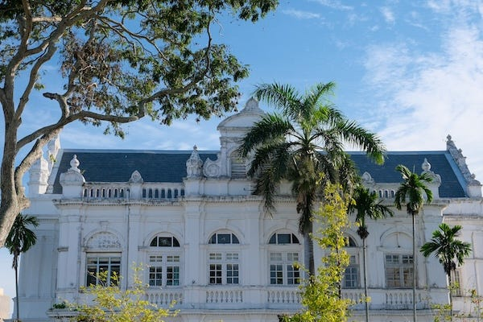
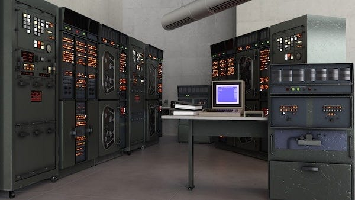
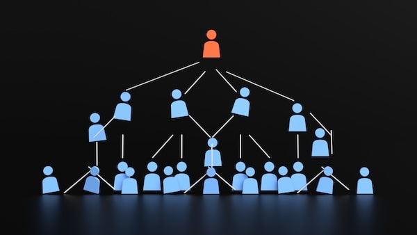

_[Last time we learnt](https://peacefulrevolutionary.substack.com/p/money-and-markets) of our intrepid right-wing reporter’s discovery of a system of labour vouchers and craft markets, and this time will learn about the processes that make the running of the island possible. Note: those who read the previous article will of course realise this is satire._

## A Disturbing Dream

I rested uneasily that night, conscious that I was sleeping in hostile territory. My dreams were troubled, filled with images of the market I’d observed earlier that day. In my nightmare, I wandered through the market stalls, but behind each vendor hung a heavy curtain concealing what lay behind them.

Running to an unmanned stall, I tore down one of the curtains to reveal the truth beneath: an assembly line of workers moving money hand-to-hand down behind the rows of stalls, all flowing toward the Liberationist headquarters where the true rulers sat in luxury. In the opposite direction came goods, produced by pale, thin children labouring in underground factories, their faces smudged with soot.

I awoke with a start to the crow of a cockerel, its harsh call a reminder that while this city gave the impression of modernity, some residents still had to rely on keeping chickens to meet their basic needs, like medieval peasants.

Although it had been just a dream, today I would have my chance to see the bureaucracy behind the island’s facade with a visit to the city’s so-called coordination hub. There, surely, I would find those who truly held power.

## Journey to the Co-Hub

After a light breakfast of mushroom omelette, which was rather too healthy for my tastes, Carlos collected me for our morning excursion.

He led me to a tram stop where we waited with a handful of other passengers. The vehicle that arrived was clean enough but clearly dated, its metal body showing the discolouration of decades of use.

‘I’m surprised you couldn’t arrange a private vehicle for your first journalist guest in decades,’ I remarked, keeping my tone neutral. ‘It rather shows the difficulties you must face in obtaining larger goods like cars.’

Carlos seemed unbothered by what I’d intended as a subtle jab. ‘Private vehicles are primarily reserved for those with mobility needs, such as the elderly and the infirm. Community vehicles like ambulances and buses serve rural areas. Here in the city, most people walk, cycle, or use the trams.’

I made a note: _Lack of private vehicles spun as environmental concern. Likely reflects inability to produce or import sufficient automobiles._

## The Coordination Hub

The tram journey took approximately twenty minutes, carrying us deeper into the city centre. When we disembarked, Carlos led me toward a building that immediately stood out from its surroundings.

It was notably grander than the neighbouring structures, being three storeys of stone and reinforced concrete, with large windows and what appeared to be solar panels covering much of the roof. A steady stream of people moved in and out of its entrance.

‘The Co-Hub, as we call it,’ Carlos announced. ‘Short for Coordination Hub.’

‘Your headquarters,’ I said, unable to keep the satisfaction from my voice.

‘More of a ... community resource centre,’ he replied. ‘It houses our communication infrastructure, meeting spaces, archives, and coordination tools. Anyone can access it.’

As we entered, I immediately noticed the strange mixture of technology filling the space. Older computers with bulky monitors sat alongside sleek modern terminals. Ancient phosphor screens glowed green next to large flat displays. Printing presses occupied one corner while modern printers hummed in another.

‘I would have thought the newer technology would render the old equipment obsolete,’ I observed.

‘In many ways it does,’ Carlos admitted. ‘But we don’t like to discard what might still prove useful. And we prefer to ensure every system has a secondary, more basic version that we could rely on if the more sophisticated ones failed. Redundancy is valuable when you’re relatively isolated.’

I didn’t give much credit to such a convenient explanation. More likely they had some ranked system whereby those lower in the hierarchy were forced to make do with outdated equipment while the administrators enjoyed the modern technology.

## Screens & Systems

What immediately drew my attention were the projections covering several walls - large displays divided into sections containing numbers that constantly shifted up and down. The text was primarily green against black backgrounds, though occasionally certain figures would turn yellow or orange.

‘What are these monitoring?’ I asked.

Carlos gestured toward the nearest screen. ‘Resource tracking and coordination. Although each region of the island is fairly self-sufficient in food production, we need supplies and goods from other areas regularly. These screens show stock levels, production capacity, requests, and fulfilments - tracking the flow of materials throughout the island.’

He pointed to one section. ‘This, for example, is timber. We’re extraordinarily cautious about it, as we limit the number of trees that can be harvested in given areas over specific time periods to allow for regeneration. You’ll notice most buildings use adobe, straw, sometimes salvaged materials. Many are even built into hillsides or carved from rock.’

‘So,’ I said, piecing together what I thought I understood, ‘the headquarters demands the forestry corporation cut down a certain number of trees yearly, which then go to the timber merchants for processing and storage, and from there ...’

‘Perhaps it would help if I just walked you through the actual process?’ he suggested gently.

I nodded, trying to keep my expression neutral. ‘Yes, please explain what _really_ happens’, revealing more skepticism than I’d intended. If Carlos noticed, he gave no indication.

What followed was delivered in the sort of patient, simplified tone one might use with schoolchildren. It was no doubt a well-rehearsed spiel for the classes of youngsters they brought here on propaganda field trips.

‘The process begins with the Forest Stewardship Collective in the northeastern hills. They work alongside the indigenous communities who’ve inhabited those forests for generations. Together, they tend the cedars carefully, understanding that a healthy forest benefits everyone who comes after us.’

‘And who tells this ... Collective ... how many trees they’re permitted to harvest?’

‘They determine it themselves, based on forest health, regeneration rates, and regional needs. They track which areas were harvested previously and ensure sufficient time for regrowth. The Logging Collective - that’s the people who actually fell and process the initial timber - work with tools maintained by the Tool Maintenance Guild.’

Carlos continued. ‘The Transport Network carries the cedar to Regional Wood Processing Centres. These are facilities where woodworkers share their knowledge freely - techniques, innovations, solutions to problems. Nothing is kept proprietary.’

‘No trade secrets?’ I couldn’t help but interject. ‘Surely skilled woodworkers would want to protect their competitive advantage?’

## Competition vs Collectivisation?

‘Why would they? There’s no competition. Everyone benefits when knowledge spreads.’

‘At the processing centres, the cedar is prepared according to need. Some becomes planks for house building, for framing, floors, and furniture. Some is pulped for paper production, though we try to minimise that given the resource cost. Some becomes blocks for further working - raw material for craftspeople who’ll turn it into decorative items, musical instruments, whatever is needed.’

‘And who decides what proportion goes where?’

‘The computerised material accounting systems make it clear what is available, what is wanted and if there is any surplus in storage to pull from, or a shortage that needs to be dealt with (if possible). In many cases for routine, regularly required items the whole process is automatic. The system can keep track of stock, raise work requests, and make transport schedules.’

‘But people’s needs and want vary greatly don’t they?’

‘Yes, of course, and so the processing centres communicate with regional coordination hubs (like this one) to understand demand. If a region is building new housing, more goes to construction. If schools need more paper, more goes to pulp. It’s responsive to actual needs rather than predetermined quotas.’

‘So if it is such a scarce resource, you must import a great deal of timber then?’

‘More than we’d like, but we try to limit such imports to suppliers who follow similar ecological conservation models. It’s not always easy, but we consider it important.’

‘And who decides these allocations between regions? Who determines which region gets what resources?’

‘The regions communicate their needs and surpluses. If there’s a shortage somewhere and a surplus elsewhere, arrangements are made. Sometimes it’s direct: Region A needs timber, Region B has extra, they coordinate a transfer. Other times it’s more complex and requires broader discussion.’

‘But someone must have final authority. What if two regions both need the same scarce resource?’

‘Then they discuss it. Usually one need is more urgent than the other, or they can split the available supply, or they can look for alternatives. It requires communication and good faith, but it generally works.’

 _Generally works._ A telling admission.

‘From there, assembly or further crafting happens in workshops scattered across different regions. People contribute according to their skills and interests. Some excel at precise assembly work, others at teaching newcomers the necessary skills. The work is shared so it never becomes a burden on any individual.’

‘And the quality?’ I asked. ‘Without competition, without profit incentives, why would anyone care if their work is substandard?’

‘Pride in craftsmanship,’ Carlos said simply. ‘Care for the people who will use what you’ve made. When you know your furniture will furnish someone’s home, your tools will help in someone’s workshop, your musical instrument will bring joy ... that creates its own motivation. Poor work reflects on you directly, in a community where reputation matters.’

 _So there is hierarchy,_ I thought triumphantly. _Social pressure and reputation - simply another form of coercion._

‘These finished goods find their way to those who need them through Distribution Hubs. Communities understand their own needs: schools, libraries, community centres, individual households. When there are surpluses, they’re shared with communities that have shortages. When local production falls short, support comes from elsewhere.’

I made extensive notes, though not the ones Carlos probably imagined. What he’d described was clearly a centrally planned economy dressed up in the language of voluntary cooperation. This ‘Forest Stewardship Collective’ was obviously a state forestry department. The ‘Regional Wood Processing Centres’ were state-run mills. The ‘Distribution Hubs’ were simply rationing centres.

‘Fascinating,’ I said aloud. ‘And these Collectives and Guilds - they have leaders, I presume? Someone must be in charge of each group?’

‘They have people who take on coordinating roles, yes. But these are functional positions, not positions of authority. A coordinator facilitates communication, keeps track of schedules, ensures nothing falls through the cracks. But they don’t give orders, and they can be recalled if they’re not doing the job well.’

‘Recalled by whom?’

‘By the collective itself. By the people doing the work.’

Of course. The workers could ‘recall’ their own supervisors.

‘Would you like to speak with some of the coordinators?’ Carlos asked. ‘They can show you how the tracking systems work in more detail.’

‘That would be excellent,’ I replied. Perhaps in conversation with these ‘coordinators’ I could identify who truly held power in this elaborate charade.

## Coordination & Centralisation?

Carlos led me toward a bank of workstations where several people were reviewing the resource tracking screens, occasionally making notes or adjusting figures. He introduced me to a woman named Yuki, who apparently coordinated communications between the city’s hub and the agricultural regions, and a man called Dmitri, who seemed to handle industrial resource flows.

‘I appreciate the detailed explanation about your wood distribution,’ I said carefully, ‘but surely you can see that what you’ve described is simply a hierarchy by another name? You have your Forest Stewardship Collective which is your forestry department. Your Regional Processing Centres which are your state-run mills. These coordinators here are your managers and bureaucrats. You’ve simply replaced “director” with “coordinator” and pretended you’ve abolished authority.’

Carlos and Yuki exchanged glances. Dmitri, I noticed, looked less patient than my guide had been thus far.

‘It’s not the same thing at all,’ Dmitri said, his accent thicker than Carlos’s, perhaps Ukrainian in origin. ‘Nobody here rules over anyone else. We coordinate, we facilitate, we communicate, but we have no power to compel.’

‘But you make decisions about resource allocation,’ I pressed. ‘You determine who gets what. That’s power, whatever you choose to call it.’

‘We don’t determine anything,’ Yuki said gently. ‘We process requests, track availability, facilitate connections between those who need and those who have. But the decisions come from the communities themselves.’

‘Then who has final authority when there’s a dispute? When two communities both want the same limited resource?’

‘They discuss it between themselves,’ Carlos said. ‘Sometimes with input from others, but there’s no higher authority that imposes a solution.’

I couldn’t help but laugh. ‘That’s simply not how organizations function. Every system requires hierarchy, clear lines of authority, someone at the top making final decisions. It’s basic management theory - you can’t run anything through endless committee discussions.’

‘Perhaps an analogy would help,’ Dmitri said, though his tone suggested he thought I was being deliberately obtuse. ‘Think of any centralized system - let’s say food distribution in your country. One central authority controls it, yes?’

‘Our supply chains are models of efficiency,’ I said proudly.

‘I’m sure. Now imagine you duplicate that system - two separate groups carrying out the same function. Not competing, simply existing as a check and balance on each other. Providing redundancy if something happens to one of them.’

‘That would be wasteful,’ I interjected. ‘Inefficient duplication.’

‘Would it? You’ve just halved the concentrated power of centralisation, but doubled the resilience of the system. You’ve halved the chance of total failure and doubled the chance of continuity in the face of challenges.’

‘Now split it again,’ Yuki continued, taking up the explanation. ‘In our case, we have seven regions, each with substantial autonomy in production and distribution. Make the data freely available between them, and make the process transparent so everyone can see what’s happening.’

‘That would lead to chaos,’ I objected. ‘Too many voices, too much feedback, no clear direction. Different corporations would use that information to undermine each other.’

‘But without competition, in our case more feedback leads to more competency and accuracy,’ Carlos said. ‘More bottom-up knowledge from people who actually do the work, live in the communities, understand local needs. Less top-down paternalism from distant authorities who might not understand the situation on the ground.’

‘But surely,’ I argued. ‘one unified system is more effective, and leads to more streamlined decision-making. Your dispersed model must be slower, more prone to confusion and error.’

Dmitri shook his head firmly. ‘You’re thinking about it backwards. Organisation is not a function of centralisation. Centralisation is actually a parasite on organisation - and a permanent structural weakness.’1

## Heads & Hierarchy?

‘How can centralisation be a weakness? It’s the entire basis of efficient governance!’

‘When there’s a head - or a committee of heads - it can be decapitated or corrupted,’ Dmitri said bluntly. ‘Usually the former leads to the latter. One decisive strike, one successful coup, one moment of corruption in the right place, and the entire system is compromised. We’ve seen it throughout history.’

‘That’s why we have robust security,’ I countered. ‘Loyalty enforcement, surveillance of potential threats …’

‘Exactly,’ Carlos interrupted gently. ‘You need all of that because your system is fundamentally vulnerable. A single point of failure that must be constantly defended. We don’t have that vulnerability because we don’t have that central point. There’s nothing to capture, no throne to seize, no headquarters to storm.’

‘This building …’ I gestured around us.

‘… is a coordination hub, not a command centre. If it burned down tomorrow, the other hubs would continue functioning. Information would still flow, resources would still be distributed, decisions would still be made. It would be inconvenient, certainly, but not catastrophic. Can your country say the same about its capital?’

‘Your system still requires someone to make final decisions,’ I insisted, steering back to safer ground. ‘Even if you’ve distributed authority across regions, within each region someone must be in charge. You’re simply describing feudalism with extra steps.’

‘No,’ Yuki said firmly. ‘Within each region, decisions are made collectively by those affected. Yes, there are people who specialise in coordination, in facilitation, but they don’t have authority over others. They can be recalled, replaced, or simply ignored if communities choose to organise differently.’ I could see the exasperation on their faces at having to repeat this point again, as if they really expected me to believe it.

‘That’s just democracy, then. The will of the majority, mob rule. We’ve recently done away with such a system.’

‘It’s not like the representative system you once had,’ Carlos interrupted. ‘We aim for consensus where possible. When that’s not achievable, we look for solutions that address everyone’s core needs, even if they don’t give anyone everything they want. Only rarely do we resort to voting, and even then it’s usually to gauge preferences rather than impose decisions.’

‘This all sounds lovely in theory,’ I said, not bothering to hide my skepticism anymore. ‘But surely you can admit that your system and ours aren’t so different in practice? We both have economies, distribution networks, people who manage resources. You’ve simply dressed up familiar structures in the rhetoric of equality and cooperation. At the end of the day, some people tell others what to do, but you’ve just convinced yourselves otherwise.’

Dmitri’s patience finally seemed to break. ‘The difference is fundamental, not cosmetic. In your system, workers produce value that flows upward to owners and executives. Those at the top accumulate wealth and power extracted from those below. Decisions are made by the few for the many. Dissent is suppressed through economic coercion - obey or starve - backed by state violence if necessary.’

‘That’s a crude oversimplification …’

‘Is it? In our system, there is no upward flow of extracted value because there are no owners to extract it. Decisions are made by those affected, not imposed from above. Coordination happens horizontally between equals, not vertically through chains of command. When you work, the full value of your labor goes to the community, including yourself, rather than enriching a separate class of owners.’

## You Are The Community?

‘So you admit there’s a “community” that claims the value of individual labor,’ I pounced. ‘The collective as tyrant instead of an individual owner. Same exploitation, different master.’

‘No,’ Carlos quietly said. ‘Because you are the community. You participate in the decisions about what’s produced and how it’s distributed. You benefit directly from collective production. There’s no separate entity extracting surplus value for its own enrichment.’

I sat back, letting my expression show how unconvinced I remained. ‘These are semantic games. Pretty theories that crumble under scrutiny. I’ve seen your markets, your currency, which you call labour vouchers, but which function as money. I’ve seen your coordinators making decisions about resource allocation. You say they don’t have authority but clearly they wield influence. You’ve built a hierarchy and convinced yourselves it’s not one. The question is whether you’re deceiving me or yourselves.’

‘Perhaps,’ Carlos said eventually, ‘you’ll understand better as you see more of how we actually live and work. Theory can only take us so far - you need to see the practice.’

‘I look forward to it,’ I said coolly. ‘Though I suspect the practice will confirm my analysis rather than challenge it.’

What I didn’t say aloud was that I’d already formed my conclusion. These people had built a system that superficially resembled governance without admitting it was governance. They’d created an economy while denying it was an economy. They’d established authority while insisting they’d abolished it. Whether through deliberate deception or genuine self-delusion, they’d obscured the reality of power behind a fog of egalitarian rhetoric.

Of course, if your goal was to deliberately disempower the great men who built our glorious nation - to put an end to the natural dream of elevating one’s country through the accumulation of wealth and the proper exercise of authority - then I suppose you might devise something similar to what these Liberationists have created. But in doing so, you’d leave yourself fatally vulnerable.

Without a strong military hierarchy, without the resources concentrated in the hands of those wise enough to deploy them decisively, without the unity of purpose that comes from loyal obedience to a single vision - you’d be utterly defenceless against any nation with the will to take what you have.

Perhaps that’s why they’ve remained so isolated, why they carefully limit contact with the outside world. Not principle, but naked self-preservation. They’ve built something that can only survive by hiding from history, hoping the world ignores them long enough that they can continue their little experiment in collective mediocrity, and call it an island paradise. I’ll expose the full dystopian nature of it yet.

Subscribe

[Share](https://peacefulrevolutionary.substack.com/p/liberation-from-centralisation?utm_source=substack&utm_medium=email&utm_content=share&action=share)

 _In my next dispatch, I will reveal further truths about the real powers and dysfunctions behind their supposedly utopian society._

1

Adapted from - 
