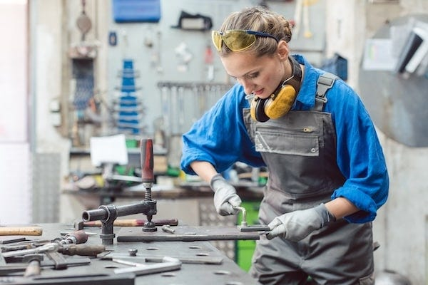
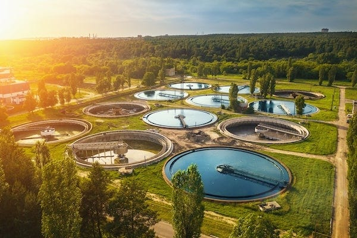
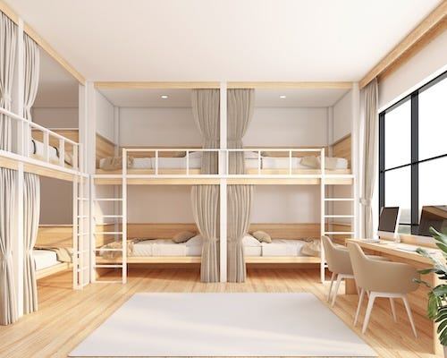

_[Last time we learnt](https://peacefulrevolutionary.substack.com/p/liberation-from-centralisation) of our intrepid right-wing reporter’s visit to a coordination hub, and this time we learn about how work is organised on the island. Note: those who read the previous articles will of course realise this is satire._

## The Journey North

After my revelatory visit to the coordination hub, Carlos suggested we visit one of the island’s industrial centres. I agreed readily enough. If anywhere would expose the contradictions in their system, surely it would be where actual production took place. After all, theory was one thing, but the rubber had to meet the road somewhere. Or in this case, the worker had to meet the reality of the factory floor.

We took a coastal train northward, the journey offered inspiring views of cliffs and beaches. Whatever might be rotten inside this island, at least the scenery was beautiful. The train itself was comfortable enough, though I noted it ran at a leisurely pace. Efficiency clearly wasn’t their priority, though Carlos claimed they’d balanced speed with safety and fuel consumption. More likely they couldn’t afford better infrastructure.

The industrial city of Porto Norte sat in a natural harbour, smaller than Porto Liberdade but bustling with a different kind of energy. Smokestacks rose from various workshops and facilities, though I noticed the air was surprisingly clean. They must have been running at low capacity or have recently invested in filtration systems, probably to impress visitors like myself.

Carlos had arranged for us to stay with a family who worked in various manufacturing roles. Their home was modest but comfortable, part of a terraced row of similar dwellings. Over dinner that evening, I began my inquiries.

‘How many hours do you work each day?’ I asked Antonio, our host, who apparently worked in metal fabrication.

‘Usually about five hours,’ he replied, helping himself to more of the fish stew his partner had prepared. ‘Sometimes six if we’re finishing a project, sometimes four if the work is routine.’

I nearly choked on my wine. ‘Five hours? How does anything get produced?’

‘Quite efficiently, actually,’ Antonio said with a smile. ‘When you’re not exhausted, you work better. And when you’re doing work you’ve chosen you’re more motivated.’ As if that was what working for a living was meant to be about.

## The Morning Shift

The next morning, I accompanied Antonio to his workshop. We arrived at what I would consider a scandalously late hour for industrial work - ten o’clock. The workshop was a large, open space with various metalworking stations. About fifteen people were already there, some preparing equipment, others reviewing plans for the day’s projects.

What struck me immediately was the absence of anyone obviously in charge. No foreman barking orders, no supervisors monitoring the workers. People simply gathered around a large table where various project requests were laid out.

‘Right,’ said a woman named Yara, ‘we’ve got the farm equipment repairs from the southern collective, the new window frames for the school extension, and those custom brackets for the wind turbine project.’

‘I’ll take the farm equipment,’ someone volunteered. ‘I grew up on a farm, I understand what they need.’

‘I’m keen to work on the wind turbine brackets,’ another added. ‘Renewable energy infrastructure interests me.’

This informal division of labour continued until all the day’s projects were claimed. I waited for someone to assign the remaining, presumably less desirable tasks, but instead people simply discussed who had relevant skills and who wanted to learn what.

‘Excuse me,’ I interjected, unable to contain myself, ‘but who’s actually in charge here? Who ensures the work gets done properly?’

The workers exchanged glances. Antonio spoke up. ‘We all ensure it. If someone’s work isn’t up to standard, we discuss it. Sometimes they need more training, sometimes the problem is with the design, not the execution.’

‘But without a manager, without oversight, what’s to stop someone producing substandard work? Or simply not working at all?’

Yara turned to face me properly. ‘Your country still has managers and bosses, yes? And does that prevent all substandard work?’

‘Well, no, but …’ I replied, planning to explain why our system was still more efficient, but she continued before I had the chance to.

‘Here, your reputation matters. If you consistently do poor work, people won’t want to work with you. You won’t be trusted with complex projects. You might find yourself socially isolated. Those consequences are often more effective than a manager’s disapproval.’

‘That sounds like coercion,’ I pointed out. ‘Social pressure is still a form of control.’

‘Perhaps,’ Carlos said quietly. ‘But is it worse than threatening someone with homelessness and starvation if they don’t comply with a boss’s demands?’

I thought of saying, ‘that’s just how the world works,’ but wouldn’t think she’d be grateful for my remarks, so I returned to observing.

## The Workshop in Action

Over the next few hours, I watched the metalworkers go about their tasks. What surprised me was the evident care they took with their work. Antonio, fabricating replacement parts for farming equipment, measured everything multiple times, checked tolerances carefully, and took obvious pride in the precision of his work.

‘Why bother?’ I asked him during a break. ‘I mean, you’re not being paid more for higher quality. There’s no financial incentive for perfection.’

He looked at me as if I’d said something peculiar. ‘These parts will be used by farmers I know. If they fail, crops might be lost. People could go hungry. Besides, this is going to have my mark on it, so everyone will know I made it. Why would I want to be known as someone who does shoddy work?’

I watched them work for an hour. The pace seemed reasonable — not the frantic urgency I’d seen in factories back home, but not sluggish either. People took breaks when needed, chatted while working, helped each other with difficult tasks. There was an ease to it all that I found... unsettling. Perhaps it was the lack of respect for authority, or hard work, or good order.

‘Doesn’t the lack of pressure lead to laziness?’ I finally asked Carlos.

‘Does pressure lead to better work in your country?’ he countered. ‘Or does it lead to shortcuts, corners cut, workers doing the minimum required to avoid punishment?’

‘It leads to productivity. Output. Growth.’

‘For whose benefit? The workers themselves, or those who own the means of production?’

‘The economy benefits everyone eventually. A rising tide lifts all boats.’

‘Does it? Has your tide been lifting all boats recently? Or mainly yachts?’

It seems they weren’t as unaware of the outside world as I’d previously thought, and had heard the kinds of criticisms our own home grown detractors had once made on social media, before such disloyal lies were filtered out for the good of everyone.

I was determined to bring the conversation back to the failings of their own system, and so couldn’t resist bringing up a more challenging question for them to answer:

‘But surely some jobs here are less ... noble. Who collects the rubbish? Who cleans the sewers? Who does the truly unpleasant tasks?’

‘Everyone takes a turn at communal maintenance,’ Overhearing my question, Yara answered from her workstation. ‘One afternoon each week, we all contribute to keeping the city functioning. Rubbish collection, street cleaning, basic repairs. Sometimes it’s unpleasant, but it’s only a few hours, and you’re doing it alongside your neighbours.’

‘And the sewers?’

‘We have a sanitation collective, people who’ve trained specifically in water systems and waste management. It’s skilled work, actually. They’re quite respected.’

‘Respected?’ I couldn’t hide my skepticism. ‘For dealing with sewage?’

‘Of course. They keep the city healthy. They prevent disease. Why wouldn’t we respect that?’ Antonio seemed genuinely confused by my doubt. ‘In your country, do you not value the health of your community?’

‘We value it enough to pay people to deal with such things,’ I replied stiffly.

‘And that payment comes from somewhere, yes? From taxes on workers? So really, the community pays for it anyway. We’ve just removed the intermediary steps and the profit extraction.’

I made a note: _Community maintenance required of all. Essentially forced labour, though they’ve convinced themselves otherwise._

## The Afternoon Visit

We took lunch, which the workshop members prepared and shared communally, another hour I noted as ‘unproductive’. Carlos suggested we visit the sanitation collective. I agreed, curious to see how they’d convinced anyone to do such work voluntarily.

The sanitation facility was surprisingly modern, with equipment far cleaner than its dirtier purpose would suggest. A group of workers in clean coveralls greeted us, led by a man named Kwame who’d apparently coordinated this facility for the past three years.

‘Coordinated?’ I queried. ‘So you’re the manager?’

‘I coordinate schedules and communicate with other city services,’ Kwame explained. ‘But I don’t manage people. We all have our areas of expertise. Mine happens to be organisation and logistics.’

‘And you all volunteered for this work? Dealing with ... waste?’

A younger woman, Zara, laughed. ‘When you put it like that, it sounds grim. But most of our work is maintaining systems, monitoring treatment processes, ensuring water quality. The truly unpleasant aspects are actually quite rare, and when they occur, we handle them together.’

‘But why choose this over, say, teaching or medicine or any number of cleaner professions?’

Zara shrugged. ‘I find systems fascinating. Water treatment is actually quite complex: biological processes, chemical interactions, ecology. Plus, this work has immediate, visible, helpful impact. When I do my job well, everyone benefits. That’s satisfying.’

‘And you?’ I turned to Kwame. ‘What brought you to sewage management?’

‘Public health is essential,’ he said simply. ‘Growing up, my grandmother told me stories of her childhood, before proper sanitation, the illness and diseases they had to deal with. This work prevents that. It’s important. Besides,’ he added with a smile, ‘someone has to do it, and I’m good at it. Why wouldn’t I?’

‘But surely you’d prefer work that’s less ... physical. Less dirty.’

‘It’s not actually that dirty most of the time. And when it is, well, we have excellent showers here.’ He gestured to a door. ‘Better than most homes, actually. One of the benefits of working in water treatment is that we understand plumbing very well.’

I made another note: _Claims of voluntary sewage work. More likely social pressure and limited alternatives. Investigate whether ‘coordinators’ are simply managers by another name._

## The Evening Assembly

That evening, Carlos took me to what they called a ‘neighbourhood assembly.’ About fifty people gathered in a community hall, discussing various local matters. I expected some formal procedure, perhaps Roberts Rules of Order, but the meeting was remarkably casual.

They discussed maintenance needs for communal buildings, plans for a new playground, issues with noise from a late-night workshop, and requests for additional resources from the regional coordination hub. What struck me was how everyone seemed to participate. There was no chairperson controlling the discussion, yet somehow it remained relatively orderly.

When someone raised the issue of needing more volunteers for the communal bakery’s morning shift, several people simply said they’d help out. No coercion, no manager assigning duties, it was just people agreeing to meet a need.

‘But what if no one volunteers?’ I asked during a break. ‘What if everyone refuses to do an unpleasant task?’ They might be able to find willing sewage workers, but what about more boring tasks?

An older woman named Carmen overheard me. ‘Then we discuss why no one wants to do it. Is it unnecessarily unpleasant? Could we make it better? Could we share it more widely? Could we automate parts of it? Usually, once we understand the problem, we find a solution.’

‘And if you can’t?’

‘Then we explain the consequences. If no one volunteers to help with harvest, food becomes scarce. If no one helps maintain buildings, they deteriorate. People understand cause and effect. Usually, someone steps up.’

‘Usually?’

‘Always so far,’ she admitted. ‘Though sometimes we’ve had to get creative about how we organise the work.’

After the assembly, walking back to Antonio’s home, I pressed Carlos on this point. ‘You must admit, this social pressure to work is still coercion. It’s just more subtle than our system.’

‘Perhaps,’ Carlos acknowledged. ‘Though I’d argue there’s a difference between pressure from your community to contribute to everyone’s welfare, including your own, versus pressure from an employer who threatens you with destitution if you don’t make them richer.’

‘But in our system, people are free to choose their employment.’

‘Free to choose which master to serve, you mean? Free to choose between bad options isn’t really freedom.’

‘And here, you’re free to choose your work?’

‘Mostly, yes. Obviously, certain essential functions must be filled, and we must all contribute to communal maintenance. But beyond that, you work where your interests and skills align. No one forces you into a specific role. No one profits from your labour except the community as a whole, which includes you.’

I wanted to argue, but sometimes it seemed like arguing with tribespeople who’d never encountered an advanced civilisation and couldn’t conceive of it. Perhaps it was their ignorance that made them so contented. Antonio hadn’t been watching a clock, eager for his shift to end. Yara hadn’t been going through the motions, doing the minimum required, she was enthusiastic.

## The Dormitories

The next morning, before we left Porto Norte, Carlos took me to see one of the workers’ dormitories. I’d heard younger workers often lived in such communal housing, like those my grandfather had stayed in on his visit all those years ago, and I was convinced this would finally reveal the authoritarian nature of their system. Surely forcing people into dormitory living was a form of control.

The building was clean enough and reasonably maintained, though nothing luxurious. Each person had a bunk, almost like the rest pods you see in some airports, with a few small private rooms for couples, and communal kitchens, lounges, and bathrooms. A group of residents were preparing breakfast together when we arrived.

‘Why do you live here rather than in private homes?’ I asked a young woman named Lucia.

‘Community, mainly,’ she said, cracking eggs into a pan. ‘I could request a private dwelling, but why? Here I have friends nearby, we share meals, organise activities together. It’s less lonely than living alone would be.’

‘But you have no privacy.’

‘I have my pod. When I want to be alone, I am. When I want company, it’s here. It’s the best of both worlds.’

‘And you’re not required to live here? You could leave anytime?’

She looked confused. ‘Of course. This isn’t prison. Some people prefer private homes, especially families with children. The dormitories are mostly for younger people or those who enjoy communal living. It’s a choice.’

Another resident, Marco, added, ‘Plus, living here means less maintenance responsibility. We share cleaning the common areas, but we don’t have to maintain an entire house. That leaves more time for our actual interests and work.’

‘Don’t you aspire to something more? A home of your own, property, status?’

‘I have what I need,’ Lucia replied simply. ‘Shelter, food, friends, meaningful work. What more would a private home give me except more rooms to clean and maintain?’

As we left, I noted: _Dormitory living normalised. Residents claim contentment, but may be conditioned to accept less than they deserve. Or perhaps lack ambition to improve their circumstances. The private couples rooms suggest loose moral standards._

## Reflections and Doubts

That evening, on the train to Vila Saber, I reviewed my notes. Everything I’d witnessed contradicted what I knew about human nature, about work, about organisation. People shouldn’t work diligently without profit incentive. Organisations shouldn’t function without hierarchy. Production shouldn’t proceed efficiently without strict management. Yet I’d seen all of these impossibilities functioning smoothly. If it was all a facade it was quite an elaborate one solely contrived for my benefit.

Perhaps, I thought, they’d simply become so conditioned to this system that they couldn’t imagine alternatives. Perhaps they’d been propagandised so thoroughly that they believed they were content. Perhaps the apparent lack of coercion was itself a sophisticated form of control, making people police themselves through social pressure.

Or perhaps their claims were true. No. There had to be exploitation somewhere. There had to be hidden hierarchies, concealed mechanisms of control. I simply hadn’t found them yet.

‘You look troubled,’ Carlos observed.

‘I’m trying to understand how it works,’ I admitted. ‘How you maintain production without profit incentive. How you fill unpleasant roles without coercion. How you prevent laziness without threat of poverty.’

‘Perhaps you’re asking the wrong questions,’ Carlos suggested. ‘Perhaps the question isn’t how we maintain production despite lacking profit incentive, but whether profit incentive is actually necessary for production. Perhaps the question isn’t how we prevent laziness, but whether people are naturally lazy when their basic needs are met and their work has meaning.’

‘People are inherently self-interested. That’s just human nature.’ I never ceased to be amazed at his naivety.

‘Is it? Or is that what you need to believe to justify your system? We’ve built a society on the assumption that people will contribute to their community’s welfare, that they’ll take pride in their work, that they’ll respond to social incentives as much as economic ones. And it works.’

‘But for how long? This is a small island. What happens when it grows? When you need more complex coordination? When you can’t rely on everyone knowing everyone else?’

‘Then we’ll adapt. We’ll find new ways to organise. But we won’t return to a system where some people profit from others’ labour, where the threat of destitution compels people to work, where a tiny minority hoards resources while the majority struggles.’

I stared out the window at the darkening coastline. ‘You realise this all sounds too good to be true. That’s usually a sign it’s not true.’

‘Perhaps. Or perhaps you’ve been taught to distrust anything that challenges the systems that benefit from your doubt.’

We rode in silence for a while. I couldn’t shake the image of Antonio, carefully crafting those farming tools. Or Zara, enthusiastically explaining water treatment processes. Or Lucia, content in her dormitory. Or those textile workers, collaborating without supervision. They seemed ... happy. Engaged. Purposeful. But then again cult members often do.

 _In my next dispatch, I will investigate their educational system, surely that’s where the indoctrination happens, where they condition children to accept this unnatural way of living. Every totalitarian system needs its propaganda arm, and I’m certain I’ll find theirs in their schools._

Subscribe

[Share](https://peacefulrevolutionary.substack.com/p/liberation-from-work?utm_source=substack&utm_medium=email&utm_content=share&action=share)

 _You can read the next part of the story here:_

 _This may also be of interest:_
