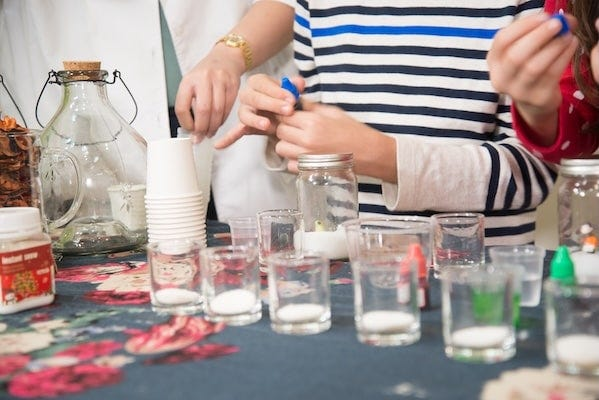
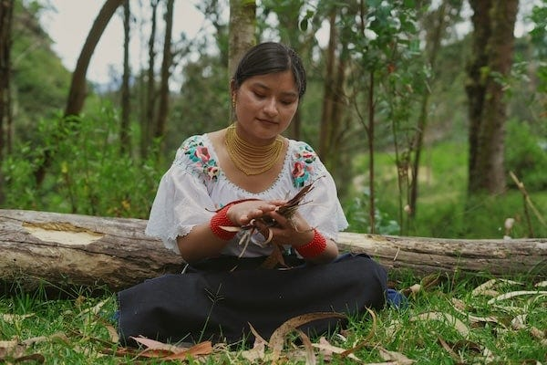
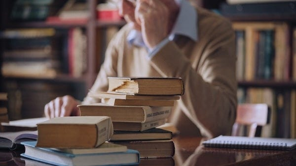

_[Last time we learnt](https://peacefulrevolutionary.substack.com/p/liberation-from-work) of our intrepid right-wing reporter’s visit to various workplaces, and this time we learn about how education functions on the island. Note: those who read the previous articles will of course realise this is satire._

## Journey to Vila Saber

The train journey from Porto Norte wound inland, following a river valley that gradually climbed into the hills. Carlos informed me we were heading to Vila Saber – supposedly their equivalent of a university town, though without the formal degrees, examinations, or proper academic rigour that such institutions required.

‘You’ll find Vila Saber quite different from the industrial centre we just visited,’ Carlos said as we watched terraced farms pass by the window. ‘It’s where many of our researchers, teachers, and students gather. Though really, everyone here considers themselves a lifelong learner.’

‘How very ... aspirational,’ I replied, making a note. _Perpetual studenthood as ideology. Likely a way to avoid real work._

As we approached, the town revealed itself as a curious mixture of modern and rustic architecture. Some buildings were clearly purpose-built structures with large windows and solar panels, whilst others appeared to be repurposed colonial-era buildings, their stone walls now covered in climbing vines. Between them stretched gardens and what looked like outdoor classrooms where groups gathered under shade trees.

## The Children’s Learning Centre

Our first stop was what Carlos called a ‘children’s learning centre.’ They seemed averse to using the word ‘school’, so I avoided using it out loud in case they took offence. As we approached, I could hear the sound of children’s voices, not the regimented recitation I’d expected, but something more chaotic. Almost like play.

We entered to find perhaps thirty children aged roughly six to twelve, though the ages seemed deliberately mixed. There were no desks in rows, no teacher’s podium at the front. Instead, the space was divided into various areas: one corner had books and comfortable seating, another had workbenches with tools, another had what appeared to be scientific equipment, and in the centre was a large circular rug where a group of children sat in discussion with an adult.

‘Where’s the teacher?’ I asked, not seeing any adult in charge behind a desk.

‘Mariana there,’ Carlos gestured to the woman in the circle, ‘is a learning facilitator. But there are several others working with different groups today.’

‘Facilitator?’ I couldn’t help my skeptical tone. ‘So not actually teaching, then?’

‘It depends on what you mean by teaching,’ Carlos replied patiently. ‘If you mean standing at the front and lecturing whilst children sit passively taking notes, then no. But if you mean guiding discovery, asking questions, providing resources, then yes, absolutely.’

We observed Mariana’s group for a while. The children were discussing something about water – where it came from, where it went, why it was important. But rather than Mariana telling them the answers, she kept asking questions: ‘What do you think?’ ‘How could we find out?’ ‘What happens if...?’ The children debated amongst themselves, occasionally contradicting each other, sometimes asking Mariana for information, but mostly working through problems together.

‘This is terribly inefficient,’ I whispered to Carlos. ‘She could simply tell them the water cycle and they’d know it.’

‘They could memorise it, you mean. But would they understand it? Would they be able to apply that knowledge? Would they care?’ Carlos smiled.

One boy had grabbed paper and was attempting to draw the water cycle as they understood it. A girl was consulting a book, trying to find information to settle a dispute about evaporation. Another child was pouring water between containers, apparently testing something. They were, I realised reluctantly, actively engaged in learning rather than passively receiving information.

‘But surely there must be some structure?’ I pressed. ‘Some curriculum they need to follow?’

‘There are broad goals,’ Mariana said, having noticed us and come over during a break in the discussion. ‘We want children to learn to read, write, and calculate. To understand the world around them. To work together. To think critically. But how each child gets there can vary enormously.’

‘What if a child refuses to learn reading? What if they just want to play all day?’

‘Then we’d ask why. Is reading being presented in a boring way? Does the child need more time to develop? Are they interested in something else that could be a pathway to reading?’ She gestured to a boy building something with wood and tools. ‘Eli there resisted reading for months. Then he wanted to build a birdhouse and needed to follow instructions. Suddenly, reading had a purpose. Now he reads constantly.’

‘So the children just do whatever they want?’ My suspicions were being confirmed.

‘They do what interests them, within the context of a learning community. But interests can be guided, sparked, encouraged. And children are naturally curious – our job is not to crush that curiosity with rote memorisation and arbitrary rules.’

I made extensive notes. _No formal curriculum. Children allowed to refuse learning. ‘Facilitators’ rather than teachers. Clear abdication of adult responsibility. Yet children appear engaged – likely for show._

## Indigenous Knowledge

That afternoon, Carlos arranged for us to meet with a group of visitors from one of the indigenous communities in the island’s interior. They’d brought several young people to the learning centre and were themselves teaching a class on plant identification and traditional medicine.

I’ll admit I expected something ... primitive. Noble savages teaching children to weave baskets, perhaps. What I witnessed was far more complex.

The elder, a woman named Ines, had spread out dozens of plant samples. As she discussed each one, she described not just its medicinal properties but its place in the ecosystem, how it reproduced, when it should be harvested, how it should be prepared, what other plants it grew alongside, and the stories and songs associated with it. This was botany, pharmacology, ecology, and cultural history all woven together.

‘You look surprised,’ Carlos noted quietly.

‘I suppose I expected something more... basic.’

‘Basic?’ Carlos’s tone held a hint of steel I hadn’t heard before. ‘Ines can identify over two thousand plants, knows the properties of hundreds of medicines, can read weather patterns, track animals, navigate by stars. She can make rope from bark, create tools from stone, start fire from friction. Tell me, how many university professors have that breadth of practical knowledge?’

‘Well, that’s different. That’s just ... survival skills.’

‘Just? It’s the accumulated wisdom of thousands of years, passed down and refined across generations. And it’s not separate from what you’d call “real” education.’

He pointed to a young man who was furiously sketching the plants and making notes. ‘Adriano there is particularly interested in ethnobotany. He’s documenting traditional plant knowledge using scientific classification systems, looking for compounds that might have broader applications. He splits his time between the indigenous communities and our laboratories. Both are equally valid learning environments.’

Ines was now asking the students questions, testing their recall and understanding. When one boy confused two similar-looking plants, she didn’t rebuke him but asked questions that helped him identify the distinguishing features himself. When a girl correctly identified a rare medicinal plant, Ines asked her to explain to the others how she knew, turning the student into a teacher.

‘Many of our children spend months or even years in the interior communities,’ Carlos continued. ‘Learning to live more simply, to understand our relationship with the land, to respect knowledge that doesn’t come from books. Some stay there permanently. Others return to the cities and towns. Neither choice is wrong.’

‘But surely the indigenous lifestyle is ... limiting?’

‘Limiting?’ Ines had overheard me. Her English was excellent. ‘Young man, in your cities you depend on systems you don’t understand. If your electricity fails, can you keep warm? If shops close, can you find food? If your medicine runs out, can you make your own? We teach self-reliance, community interdependence, and respect for the systems that sustain all life. How is that limiting?’

I had no ready answer. I made a note: _Romanticisation of primitive lifestyle. Yet practical knowledge impressive. Possible that exposure to indigenous communities serves as indoctrination in anti-modern attitudes._

## The University That Wasn’t

After dinner, we visited what Carlos called Vila Saber’s ‘research and advanced learning centre.’ I’d been expecting something resembling a university – lecture halls, laboratories, perhaps some ivy-covered buildings. What I found was more like an organised collection of workshops, studios, libraries, and laboratories, all integrated into the town itself rather than separated onto a formal campus.

We entered what appeared to be a large open space divided into various study areas. Young adults and older people worked side by side, some in intense discussion, others absorbed in reading or writing, still others conducting experiments or creating art. The boundaries between disciplines seemed porous at best.

‘Where are the lecture halls?’ I asked.

‘We have gathering spaces for presentations,’ Carlos gestured to a tiered seating area in one corner. ‘But most advanced learning happens through mentorship, collaboration, and independent study. Someone interested in physics might work directly with experienced physicists on actual research problems. They learn by doing, by discussing, by struggling with real questions.’

‘But surely there must be formal courses? Required reading? Examinations?’

‘There are study groups that follow structured programmes if students want that. There are certainly books and materials people work through. But no one is forced into a particular path of study, and there’s no final exam that determines whether you’ve “passed” or “failed.”‘

‘Then how do you know if someone is actually competent? Particularly in critical fields like medicine or engineering?’

‘Ah, that’s different,’ Carlos acknowledged. ‘For roles where incompetence could cause serious harm, we do require demonstration of knowledge and skill. A surgeon must prove their capabilities under supervision. An engineer must show their designs are sound. But this is assessment for safety and competence, not for ranking or gatekeeping.’

We approached a small group engaged in intense discussion around a chalkboard covered in mathematical equations. A young woman was explaining something to two others, occasionally pausing to ask questions or rephrase her explanation.

‘That’s Sofia,’ Carlos informed me. ‘She’s working on improvements to our solar energy systems. She studied with our most experienced engineers for three years, then spent a year working on actual installations, now she’s developing new designs whilst teaching others what she’s learned.’

‘But she has no formal degree?’

‘She has demonstrated competence. She’s created working systems. She’s taught others. What would a degree add except a piece of paper?’

‘Credibility. Standards. A way to know she’s actually qualified.’

‘We know she’s qualified because we’ve seen her work. Because the solar systems she’s improved are functioning better. Because the students she’s taught are now competent themselves. Isn’t that better evidence than an exam?’

I wanted to argue, but a voice interrupted us. ‘Excuse me, are you the visiting journalist?’

A middle-aged man with greying hair approached, hand extended. ‘I’m Samuel. I teach history. Well, I facilitate historical study. Carlos mentioned you might be interested in how we approach understanding the past.’

## A History Lesson

Samuel led us to a seminar room where about fifteen students of various ages were gathering for an evening discussion. I expected propaganda, a selective retelling of history that justified their Liberationist experiment. What I got was far more nuanced and, frankly, unsettling.

‘Tonight we’re discussing the fall of the Roman Republic,’ Samuel began. ‘Who wants to start us off?’

A young man raised his hand. ‘The traditional narrative blames the rise of the Empire on ambitious individuals – Caesar, Pompey, Crassus. But wasn’t it really structural? The Republic’s institutions couldn’t handle the scale of the empire they’d built.’

‘Interesting. What structural problems specifically?’

Another student jumped in. ‘The concentration of wealth and land in fewer hands. The displacement of small farmers by slave labour. The expansion of the military beyond civilian control. The Senate becoming increasingly oligarchic.’

‘So you’re arguing the Republic was already dead before the dictators arrived?’ Samuel asked. ‘That Caesar was a symptom rather than the cause?’

‘Partially,’ a third student said. ‘But individuals still made choices. The Senate could have reformed. They chose short-term power over long-term stability.’

The discussion ranged across economics, politics, social factors, individual agency versus structural forces. Students cited sources, challenged each other’s interpretations, drew parallels to other historical periods. Samuel mostly asked questions, occasionally introducing information or pointing out logical inconsistencies, but never declaring a ‘correct’ answer.

‘Why not just tell them what actually happened?’ I asked during a break.

‘I did tell them what happened – the facts are well-established. But history isn’t just facts, it’s interpretation. Understanding why things happened, what lessons we might draw, how different factors interact – that requires thinking, debating, analysing. I can’t do that for them.’

‘But surely there are correct interpretations?’

‘Are there? History is written by the victors, as they say. What the Romans said about themselves differs from what their conquered subjects said. Modern historians bring their own biases. The best we can do is teach people to think critically about sources, to recognise propaganda, to understand how power shapes narratives.’

I made notes furiously. _Historical relativism. No absolute truth acknowledged. Students encouraged to question everything. Dangerous undermining of established knowledge._

Yet I couldn’t shake the image of those students seriously debating, citing sources, constructing arguments. They weren’t being told what to think – they were learning how to think, albeit without the advantages of the empire’s authoritative sources.

## Night Class

That evening, Carlos suggested we visit one more educational setting – a night class for new arrivals to the island.

‘Those who come here from other countries often need help adjusting,’ he explained as we walked through the warm evening air. ‘Not just learning languages, but unlearning old patterns of thinking.’

‘Aha!’ I nearly shouted it. ‘So you admit there’s ideological conditioning!’

‘I admit that our culture is very different from yours, and we realise it can be challenging to adjust to at first,’ Carlos said calmly. ‘Do you think your country doesn’t condition its citizens? The difference is we’re open about it, and participation is voluntary.’

The class met in a comfortable room with cushions and low tables. About twenty people of various ages sat in a circle, most looking travel-worn and uncertain. A facilitator named Hassan welcomed us to observe.

‘Tonight,’ Hassan began, ‘we’re discussing post-scarcity thinking. For most of you, you’ve lived your whole lives in systems based on scarcity, competition, and accumulation. Here, we approach things differently.’

He paused, looking around the circle. ‘Who can explain what we mean by post-scarcity?’

An older woman raised her hand tentatively. ‘That there’s enough for everyone?’

‘Close. It’s not that we have unlimited resources – we don’t. It’s that we organise ourselves so that everyone’s needs can be met without hoarding or competition. Does anyone see the difference?’

A younger man spoke up. ‘It’s about distribution and cooperation rather than just quantity?’

‘Exactly. In your old countries, artificial scarcity is created by systems that concentrate resources in few hands. Scarcity creates competition, which creates hierarchy, which creates inequality. Here, we share openly. But this requires a shift in thinking.’

The discussion continued, exploring how scarcity – real or artificial – shaped behaviour, relationships, power structures. How capitalism required constant scarcity to function. How advertising created artificial needs. How people hoarded because they feared deprivation. I wanted to challenge this Leftists nonsense, but I thought it better to just make a note of such silliness.

‘Some of you are thinking this sounds naive,’ Hassan said. ‘That human nature is greedy, that people will always want more than they need. And yes, we all have those impulses. The question is: what environment encourages them? What environment channels them differently?’

A middle-aged woman spoke, her voice bitter. ‘In my old life, I worked sixty hours a week and still couldn’t afford decent healthcare for my daughter. You’re telling me that was my fault? That I wasn’t generous enough?’ _Finally a more realistic question._

‘No,’ Hassan said gently. ‘That was the system’s fault. A system that prioritised profit over human welfare. You responded rationally to an irrational system. Here, we’re trying to build a rational system that encourages our better instincts.’

‘But doesn’t that require everyone to agree?’ the woman pressed. ‘What about people who want more than others? Who want luxury, status, power?’

‘They can have more of some things,’ Hassan replied. ‘If you want a larger library, you can build one. If you want to create art, you can. If you want to develop expertise, you can become a teacher or mentor. But you can’t employ others, or own what others need, or accumulate resources that harm the community. Your freedom ends where it begins to limit others’ freedom.’

I couldn’t contain myself any longer. ‘But this is exactly the problem! You’re destroying individualism! The drive to excel, to succeed, to rise above others – that’s what pushes humanity forward. You’re creating a culture of mediocrity where no one strives for greatness because there’s no reward for achievement!’

The room went silent. Hassan looked at me thoughtfully. ‘Are you suggesting people only create, build, discover, or help others because they’re paid to? That without the threat of poverty and the promise of wealth, humanity would accomplish nothing?’

‘Well, obviously,’ I said, though quickly realising I didn’t have a sympathetic audience. ‘That’s human nature. We’re competitive. We want to win.’

‘And yet,’ Hassan said quietly, ‘some of humanity’s greatest achievements came from people who weren’t motivated by profit. Scientists driven by curiosity. Artists driven by expression. Helpers and healers driven by compassion.

‘That’s different. Those are exceptional people.’

‘Are they? Or are they simply people allowed to pursue their interests without the distraction of survival anxiety? Here, everyone has that opportunity. And yes, some people choose simple lives. Some want quiet contentment. But others push boundaries, create innovations, develop mastery – not because they’re competing, but because they find it fulfilling.’

Carlos added, ‘You keep talking about ‘great men’ and winners and triumph. But at what cost? For every winner in your system, how many losers? For every person who “succeeds,” how many are crushed? And what did they win? The right to hoard resources while others starve? The power to control others’ labour? That’s not greatness. That’s just cruelty with better marketing.’

I wanted to argue. I wanted to defend the system that had allowed some people to rise from poverty to wealth, that had created magnificent enterprises, that had pushed humanity to the moon and beyond. But the words stuck in my throat, and I realised there was no convincing such indoctrinated people, and I was at risk of becoming an unwelcome guest if I carried on.

‘The goal here,’ Hassan continued, ‘is maximising the internal freedom of every individual. Freeing you from the compulsion to compete, from the fear of destitution, from the anxiety of never having enough. Freeing you to discover what you actually want to do with your one wild and precious life, rather than what you must do to survive.’

He somehow really believed what he was saying, they all seemed to. I suppose they had to. To them wars were just parts of history to discuss intellectually, and corporations were just abstract entities they had no dealings with. They were all stuck here and most of them had never seen the skyscrapers, giant A.I. data centres, industrial animal farms, and fighter planes flying overhead. They’d never eaten fast processed food, looked forward to getting plastic consumer goods delivered from thousands of miles away to their home, and probably didn’t even watch shows like ‘Blind Love Island’ and ‘Rich Chattanooga Housewives’. It struck me that their lives were probably too insecure and short to even care about such things.

 _In my next dispatch, I will expose their primitive medical care, surely an area where their rejection of proper authority and credentialism must fail. No serious healthcare system can function without hierarchical oversight and profit incentives to drive innovation. The real costs of their idealistic foolishness will finally be revealed._

Subscribe

[Share](https://peacefulrevolutionary.substack.com/p/liberation-from-education?utm_source=substack&utm_medium=email&utm_content=share&action=share)

See - <https://anarwiki.org/wiki/Anarchism_And_Education>

_You can read the next part of the story here:_
