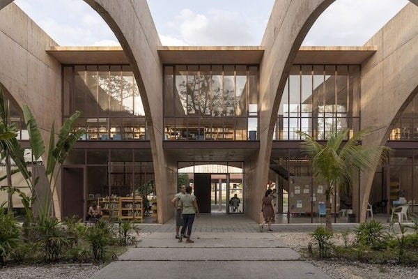
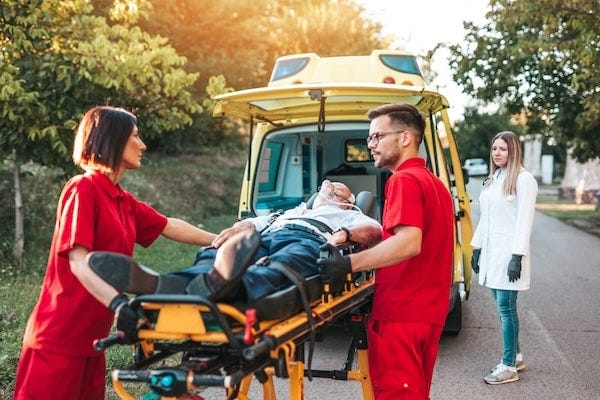

_[Last time we learnt](https://peacefulrevolutionary.substack.com/p/liberation-from-education) of our intrepid right-wing reporter’s visit to various educational settings, and this time we learn about how healthcare functions on the island. Note: those who read the previous articles will of course realise this is satire._

## Morning in Vila Paz

I woke with a mild headache, probably from the wine at dinner. Carlos had arranged for us to visit healthcare facilities today in the nearby small city of Vila Paz, and I was certain this would finally expose the fatal flaw in their system. Healthcare requires expertise, hierarchy, and significant capital. Surely their egalitarian principles would crumble here.

Over breakfast, I noticed older residents doing coordinated exercises in the courtyard, led by someone who appeared to be in his seventies. Others were tending the extensive gardens, many of them elderly as well, moving with surprising ease.

‘Is there some sort of mandatory fitness regime?’ I asked Carlos, pointing toward the exercising group.

‘Mandatory? No. But most people here stay active throughout their lives. It’s simply part of the culture. We’ve found that preventing illness is far more effective than treating it.’ He paused. ‘Though of course, we still need treatment facilities for when prevention isn’t enough.’

 _Cult-like fitness obsession. Probably covers for inadequate medical care._

## The Community Health Centre

The neighbourhood health facilities looked more like a community centre than a proper medical facility, with windows open to let in the morning breeze and what appeared to be a vegetable garden out front.

Inside, the atmosphere was surprisingly calm. No waiting room packed with anxious patients, no harried receptionist behind bulletproof glass, no forms to fill out or insurance to verify. A few people sat reading or chatting quietly, whilst others moved through what appeared to be consultation rooms.

Dr. Amara, wearing comfortable clothes rather than a white coat, approached us. ‘Where’s your uniform?’ I asked before I could stop myself.

She smiled. ‘We don’t really do uniforms here, except when performing surgery. People know who the healthcare workers are, and it creates a more relaxed atmosphere for patients. Would you like a tour?’

As we walked through the centre, Dr. Amara explained their approach. ‘Most healthcare happens at this local level. Simple consultations, minor injuries, chronic condition management, preventive care, and even some health education. We only refer to the regional hospitals for emergencies or complex cases requiring specialists.’

‘And people just ... come in whenever they want? No appointments?’

‘We have a booking system for routine matters, but anyone can walk in. We prioritise based on urgency.’ She indicated a room where an elderly man was having his blood pressure checked by someone who looked barely out of their teens. ‘Everyone who wants to work in healthcare starts with basic nursing and health monitoring. Even those who go on to specialise in surgery or research begin here, learning to interact with patients, understand common ailments, practice basic care.’

‘Isn’t that inefficient? Making future doctors do nursing work?’

‘We don’t see it as “nursing work” versus “doctor work”,’ Dr. Amara replied. ‘It’s all healthcare. And understanding the full spectrum makes for better physicians. A surgeon who’s never changed a dressing or comforted a frightened patient is missing something essential.’

We passed a consultation room where a middle-aged woman was discussing something with a healthcare worker. The conversation was unhurried, detailed. Nobody was watching the clock.

‘How many patients can you see in a day without time pressure?’ I challenged.

‘Fewer than in your system, probably,’ Dr. Amara admitted. ‘But we have more healthcare workers relative to population because there’s no artificial scarcity created by expensive medical school tuition. Anyone with the aptitude and commitment can train. And because we focus so heavily on prevention and community health, we have less acute illness to treat.’

I made a note: _Unqualified healthcare workers. No time management. Claims of reduced illness unverified._

## Indigenous Medical Traditions

Outside, an elderly woman was teaching two younger people about plants in a small garden beside the building.

‘That’s Inara,’ Carlos said. ‘She’s one of our most knowledgeable herbalists. Much of our pharmaceutical research builds on indigenous medical traditions.’

‘Herbalism?’ I couldn’t keep the disdain from my voice. ‘Surely you don’t rely on folk remedies when you have modern medicine?’

Carlos gave me a long look. ‘When the first Portuguese sailors arrived here, they were dying of scurvy and infected wounds. The indigenous inhabitants saved them using plants and practices the Europeans dismissed as primitive superstition. It took European medicine centuries to “discover” what the indigenous peoples already knew about vitamin C, antiseptics, and wound care.’

We approached Inara, who greeted Carlos warmly and regarded me with apparent amusement, as if she could read my scepticism. However, I was more pre-occupied by wondering how Carlos knew all these different people.

‘You’re wondering how much an old woman knows about medicine?’ she asked in perfect English, her eyes twinkling.

‘I ... that is ...’

‘It’s alright. Your people spent centuries assuming we were ignorant because our knowledge wasn’t written in your books.’ She gestured to the plants. ‘This one contains compounds similar to your aspirin. That one has antibacterial properties we’ve used for wound care for generations – your scientists “discovered” it twenty years ago and gave it a Latin name. This vine here helps with digestive issues, and that flower is used for anxiety and depression.’

‘Inara worked with our pharmaceutical collectives to identify which traditional medicines could be scaled up for production,’ Carlos explained. ‘And which should remain as traditional preparations.’

‘Not everything needs to be industrialised,’ Inara said, crushing leaves between her fingers and releasing a sharp, pleasant scent. ‘Some medicines work better fresh. Some require personal preparation that can’t be replicated in a factory. Some illnesses need healing that goes beyond the physical.’

‘Personal preparation?’ I asked. ‘You’re not seriously suggesting something ... spiritual.’

‘I’m suggesting that your separation of mind, body, and spirit is artificial,’ she replied calmly. ‘When someone is ill, we don’t just treat the symptom. We look at their whole life – their relationships, their purpose, their connection to community and land. Sometimes the cure for a headache is a painkiller. Sometimes it’s resolving a conflict with a neighbour. Sometimes it’s spending time in the forest.’

One of the younger people, a man named Tomás, spoke up. ‘I trained in both systems – indigenous traditional medicine and what you’d call modern medicine. They’re complementary, not contradictory. Inara can identify plants I’d need a laboratory to analyse. But I can perform a surgery she can’t. We work together.’

 _Indigenous knowledge romanticised and elevated to equal status with modern medicine. Yet I suppose practical applications appear effective. Back inside ..._

## Meeting a Diabetic Patient

As if reading my scepticism, Dr. Amara said, ‘Perhaps you’d like to speak with one of our patients? Jonas here manages diabetes.’

A thin man in his forties looked up from where he was preparing to test his blood glucose. ‘Happy to answer questions,’ he said cheerfully.

‘How often do you need to come here?’ I asked.

‘For routine checks? Once a quarter, unless something changes. But I can come anytime if I have concerns. And Marina’, he said, gesturing to a young woman who’d been monitoring his test, ‘visits my home monthly to make sure everything’s going well.’

‘Home visits? That seems ... resource-intensive.’

Jonas shrugged. ‘Better than me ending up in hospital because something was missed. Marina’s trained in diabetes care, she knows what to watch for. It’s preventive rather than reactive.’

‘And your insulin? How do you obtain it?’

‘From the pharmacy collective, same as anyone. It’s produced here on the island.’

This surprised me. ‘You manufacture insulin locally?’

‘Of course,’ Dr. Amara interjected. ‘We couldn’t rely entirely on imports for something so essential. We have pharmaceutical production facilities, not huge by your standards, but adequate for our needs. The processes aren’t secret or proprietary. We share them freely with other communities.’

‘But the research and development costs ...’

‘Are minimal when you’re not trying to recoup billions in profit,’ she said drily. ‘We work with open-source medical research networks. When someone develops an improved synthesis method, they share it. Everyone benefits.’

‘What about Type 2 diabetes?’ I asked Jonas. ‘It’s becoming an epidemic in developed countries.’

‘Rare here,’ Dr. Amara answered. ‘Our diet is largely plant-based with minimal processed foods, people stay physically active throughout their lives, and without the chronic stress of financial insecurity, we see fewer stress-related illnesses. Type 1 diabetes like Jonas has is genetic, unavoidable. Type 2 is largely a disease of modern capitalism: poor diet, sedentary lifestyle, chronic stress.’

I wanted to argue, but Jonas looked healthy enough. I only wonder how much better off he’d be if he had one of the newer automatic insulin pumps that can be bought in the empire by any who can afford them.

## The Pharmaceutical Workshop

Carlos suggested we visit one of the pharmaceutical production facilities. I agreed eagerly, certain this would reveal the cracks in their system. Surely they couldn’t produce medications to modern standards without proper corporate oversight and profit incentives.

The facility was cleaner than I’d expected, though modest in scale. Workers in protective equipment moved between various stations, monitoring fermentation tanks, checking temperatures, running quality tests. What struck me was the absence of security or secrecy.

A woman named Lin, who apparently coordinated production, showed us around. ‘We produce most of our basic medications here: antibiotics, insulin, common painkillers, antivirals. More complex drugs we import, though we’re expanding our capabilities.’

‘Who decides what gets produced?’ I asked.

‘Regional health assemblies assess needs based on usage patterns and practitioner requests. We coordinate with other communities in our federation to share resources and knowledge. If we’re short on something, another community might have surplus. If we develop an improved production method, we share it.’

‘Don’t you worry about quality control without regulatory oversight?’

Lin looked puzzled. ‘We have extensive quality control. Every batch is tested by multiple independent labs. Results are published openly so any community can verify them. We’re accountable to the people who use these medications, not to distant bureaucrats or shareholders.’

‘But what if someone makes a mistake? What if a batch is contaminated?’

‘Then we catch it in testing and don’t distribute it. And we investigate how it happened to prevent recurrence.’ She paused. ‘Has your regulatory system prevented all pharmaceutical mistakes? Or does it mainly protect companies from liability?’

I avoided answering her obvious trick question. Instead, I asked, ‘How do you produce penicillin?’

Lin’s face lit up. ‘Ah, one of our most important products. The process is actually quite elegant.’ She launched into an explanation of fermentation tanks, Penicillium cultures, and purification methods. It was clear she genuinely loved her work, took pride in producing something that helped people.

As we left, I noted: _Small-scale pharmaceutical production. Claims of quality control unverified. No profit motive means no innovation incentive. But ... medications appear adequate._

## The Regional Hospital

That afternoon, we visited the regional hospital, and I’ll admit it looked more like what I’d expected from a proper medical facility. Three storeys of modern construction, well-equipped ambulances in the bay, what appeared to be an operating theatre through a window.

Dr. Osei, a surgeon, met us at the entrance. ‘Welcome. I understand you have questions about how we manage complex care?’

‘Indeed. Surely surgical procedures require strict hierarchy? Someone must be in charge.’

‘Someone must be coordinating, yes. But that’s different from being “in charge” in the way you mean.’ He led us through the corridors. ‘In surgery, the lead surgeon for that session makes moment-to-moment decisions, but they’re working with a team of equals. The anaesthetist isn’t subordinate to the surgeon, they’re a specialist whose expertise is respected. The scrub nurse isn’t a servant, they’re a trained professional whose input matters.’

We entered an observation gallery overlooking an operating theatre where a team was apparently preparing for a procedure. ‘What we don’t have,’ Dr. Osei continued, ‘is administrative hierarchy. No hospital administrators making medical decisions for profit. No insurance companies denying necessary care. No doctors competing for status and salary. Just healthcare workers cooperating to help patients.’

‘But who decides who becomes a surgeon? That requires years of training, significant resources.’

‘Anyone with the aptitude, commitment, and community trust. Medical training here is apprenticeship-based. You work alongside experienced practitioners, gradually taking on more responsibility. When your mentors and peers agree you’re ready, you begin performing procedures under supervision. Eventually, you’re recognised as competent.’

‘No examinations? No formal qualifications?’

‘Continuous assessment by multiple mentors is far more rigorous than a single exam. And our assessment is practical, we assess if you can actually perform the procedure safely and effectively? Not can you memorise facts for a test.’

Below us, the surgical team was conferring over something. I noticed it wasn’t one person issuing orders but a discussion where everyone contributed.

‘What about specialisation?’ I pressed. ‘You can’t have everyone doing everything.’

‘Of course not. After basic healthcare training, people pursue specific interests: surgery, paediatrics, mental health, whatever draws them. They study with specialists in those fields. But the foundation is always holistic care, understanding the patient as a whole person rather than a collection of symptoms.’

## Mental Health Treatment

‘What about mental health?’ I asked as we walked through the hospital. ‘Surely that’s more challenging without, well, proper authority structures?’

Dr. Osei’s expression became more serious. ‘Mental health is actually an area where we’ve had to be particularly thoughtful. Please follow me.’

He led us to a quieter wing of the hospital. ‘Some mental health support happens at the community level: counselling, support groups, crisis intervention. But for more severe cases, or for people new to the island who are struggling to adapt, we have this facility.’

We passed rooms that looked more like comfortable apartments than hospital wards. ‘The goal is always to help people function in the community, not to institutionalise them. But sometimes people need intensive support.’

‘And if someone refuses treatment?’ I asked, thinking of the violent mentally ill I’d heard about in news reports.

‘We have crisis intervention teams trained in de-escalation. Temporary physical restraint is an absolute last resort if someone is an immediate danger to others. Usually, if someone’s in crisis, it’s ultimately because their needs aren’t being met, whether they be material needs, social connection, or meaningful engagement. We try to address the root causes. What you call mental illness isn’t always a personal failing but often a sign something needs to change, not just in the person, but often in their environment and relationships too.’

‘But surely some conditions are just ... biological? Chemical imbalances?’

‘Some are,’ he acknowledged. ‘And we have treatments for those. But even then, we treat the whole person. Someone with clinical depression needs both medical intervention and community support, meaningful work, connection to others and to the land. Your society tries to solve everything with a pill, then wonders why people remain miserable even when their brain chemistry is balanced.’

‘But surely some people are just ... dangerous?’

‘Occasionally, yes. Violent psychosis, untreated schizophrenia, severe trauma. Those individuals might need to be temporarily separated from the community for everyone’s safety, including their own. But even then, the goal is healing and reintegration, not punishment or permanent exclusion.’

A young woman named Sarah, introduced as a mental health worker, joined our conversation. ‘We also see mental health issues in people who’ve recently arrived from authoritarian societies. Some struggle with the lack of clear hierarchy. They don’t know how to function without someone telling them what to do. Others go the opposite direction and try to dominate others, to recreate the power structures they’re familiar with. Although here there is very little opportunity for them to do that.’

‘And that’s considered a mental health issue?’ I asked, somewhat offended on behalf of ... well, myself and my society.

‘When someone’s psychological need for control over others disrupts community functioning and causes distress, yes, it’s a mental health issue,’ Sarah said carefully. ‘Not in a judgmental way, but in the sense that it’s a pattern of thinking and behaviour that needs support to change. Many people eventually adjust. Some choose to leave. After all we’re not a prison. But we do work with people to help them develop healthier ways of relating to others.’

I felt a flash of anger but suppressed it. _Pathologising natural leadership instincts. Treating ambition as illness. Typical egalitarian delusion._

## A Medical Emergency

The next morning, as Carlos and I walked through the arts district, we witnessed something that would test my assumptions about their emergency response.

An older man collapsed near a pottery display. Within seconds, bystanders were responding, not panicking, but moving with clear purpose. Someone cushioned his head, another checked his pulse and breathing. A young woman sprinted toward the health centre whilst someone else called for the emergency collective on a radio.

‘Everyone here has basic first aid training,’ Carlos whispered beside me. ‘It’s part of general education.’

Within five minutes, an emergency vehicle arrived. It wasn’t an ambulance as I knew it, but a well-equipped van. Two paramedics emerged and quickly assessed the situation, working smoothly with the bystanders who’d been helping. They were asking questions, not issuing orders. The people who’d been providing first aid explained what they’d observed and done.

‘No hierarchy here either?’ I asked quietly.

‘The paramedics have more expertise, so people defer to their judgment. But it’s voluntary deference based on knowledge, not obedience to authority. Do you see the difference?’

I watched as they carefully loaded the man into the vehicle and departed. The bystanders gradually dispersed, returning to their activities. No one was filming it for social media. No one was demanding payment or verifying insurance. They’d simply helped because someone needed help. _Even I can recognise the humanity in such an approach, and I honestly can’t think of any criticism to make of this._

‘Will he be alright?’ I asked one of the women who’d assisted.

‘Probably. Looked like a cardiac event, but he was breathing, had a pulse. They’ll get him to the hospital quickly.’ She paused. ‘That’s Rafael, he lives near me. I’ll check on his partner, make sure she knows what happened.’

As she walked away, Carlos said, ‘This is what we mean by community care. Not just professional healthcare workers, but everyone taking responsibility for each other’s wellbeing.’

## Evening Reflections

That evening, back at my lodging, I reviewed my notes with growing frustration. I’d come expecting to find inadequate facilities, untrained practitioners, medieval practices dressed up in egalitarian rhetoric.

Instead, my notes were full of observations that contradicted my thesis. Yet I couldn’t quite accept what I was seeing. There had to be something wrong with their system, something they were hiding or hadn’t encountered yet.

The next day would bring new challenges to my understanding. Carlos had arranged for us to observe how they handled what they called ‘community justice’, how they dealt with serious crimes, disputes, and people who violated their social agreements. Surely this would finally expose the chaos at the heart of their supposedly stateless society.

After all, without police, without courts, without prisons, without the threat of punishment how could they possibly maintain order? How could they prevent the strong from dominating the weak, the clever from exploiting the gullible, the violent from terrorising the peaceful?

I was certain that tomorrow would provide the evidence I needed. Every society needed coercive authority, it was simply human nature. These Liberationists had managed to obscure it in their healthcare system, their education, their workplaces, even their governance. But when it came to justice, to actually controlling those who refused to cooperate, they would have to reveal the iron fist hidden within their velvet glove. Wouldn’t they?

 _In my next dispatch, I will expose their chaotic approach to justice and crime, demonstrating once and for all that a society without police, courts, and prisons inevitably descends into vigilante violence or paralysis in the face of wrongdoing. Their pretty theories about restorative justice and community accountability will surely crumble when confronted with actual human criminality._

Subscribe

[Share](https://peacefulrevolutionary.substack.com/p/liberation-from-illness?utm_source=substack&utm_medium=email&utm_content=share&action=share)

See <https://anarwiki.org/wiki/Healthcare> for a more comprehensive overview

Some of this is also covered in the following article:

<https://peacefulrevolutionary.substack.com/i/155448067/an-expertise-example>

 _You can read the next part of the story here:_
