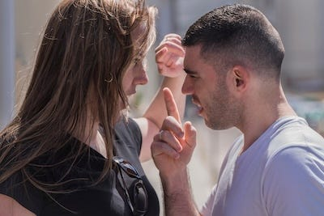
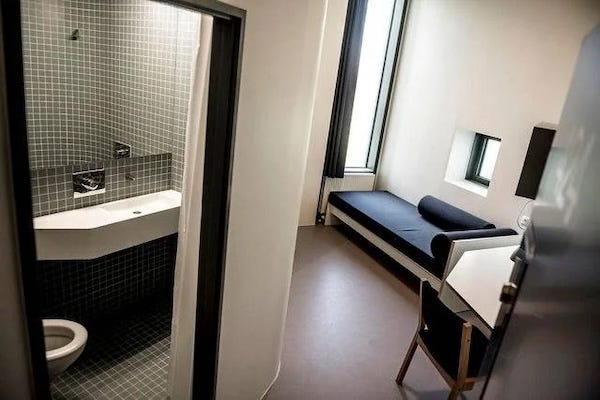

_[Last time we learnt](https://peacefulrevolutionary.substack.com/p/liberation-from-illness) of our intrepid right-wing reporter’s visit to healthcare facilities, and this time we learn about how justice and defence function on the island. Note: those who read the previous articles will of course realise this is satire._

## An Unexpected Interruption

Our afternoon in our next port of call, Vila Segura, was interrupted by raised voices outside. Carlos and I had been finishing dinner when we heard shouting from the street below. I immediately tensed, expecting violence. After all, without police to maintain order, surely such disputes would escalate quickly.

The matriarch of the family we were staying with stood calmly and walked to the window. ‘Sounds like Rafael and Fernanda are having another argument,’ she said, her tone more concerned than alarmed.

‘Shouldn’t we call the authorities?’ I asked.

‘What authorities?’ Carlos gave me that patient look I’d come to recognise. ‘Come, let’s see if they need help.’

By the time we reached the street, a small group had already gathered. The couple were indeed shouting at each other, but what struck me was the crowd’s behaviour. They weren’t filming for entertainment or standing back fearfully. Instead, several people had positioned themselves between the two, speaking in calm voices, whilst others were having quiet conversations with each person separately.

An older woman named Rosa seemed to be coordinating the response. She caught sight of Carlos, who she recognised as a native islander, and nodded. ‘Just a domestic dispute. Rafael’s been drinking again. We’ve got it handled.’

‘Handled how?’ I asked, unable to contain my curiosity.

‘Well, first we make sure no one gets hurt. Then we help them cool down. Then we figure out what’s really wrong.’ She said this as if it were the most obvious thing in the world.

Rafael was being walked away by two men who seemed to know him well. Fernanda was crying, being comforted by several women. Rosa turned back to me.

‘This isn’t the first time,’ she explained. ‘Rafael’s been struggling since he arrived from your country, actually. He has trouble adjusting to not being able to control Fernanda the way he’s used to dominating women. We’ve been working with both of them.’

‘Working with them how?’

‘Support circles, mainly. Rafael meets with other men who’ve had to unlearn authoritarian patterns. Fernanda has a group of women who help her understand she doesn’t have to tolerate such behaviour. We’re also addressing Rafael’s drinking, that’s often a sign of deeper issues.’

‘But what if he’d hit her?’ I pressed. ‘What if he becomes violent?’

Rosa’s face grew more serious. ‘Then we’d need to intervene more directly. Come, let me show you something. I think you’ll find it instructive.’

## The Community Response Collective

Rosa, who apparently worked at the centre, led us to a building I’d passed earlier without much notice. Inside, it looked part community centre, part medical clinic, part ... I wasn’t sure what.

‘This is where our community response collective coordinates,’ Rosa explained. ‘We handle situations where someone’s safety is at immediate risk, where there’s been serious harm, or where someone needs urgent intervention.’

A younger man named Taiwo greeted us. According to Rosa, he’d trained in conflict de-escalation and crisis intervention. ‘We’re not police,’ he said immediately, perhaps reading my thoughts. ‘We don’t enforce laws — we don’t have any. We respond to harm and help communities stay safe.’

‘That sounds like police with extra steps,’ I observed.

‘Does it?’ Taiwo’s eyes held a challenge. ‘Do police in your country prevent harm, or do they arrive after harm’s been done to process the aftermath and determine punishment?’

‘They deter crime through the threat of punishment.’

‘Do they? Then why do you still have so much crime?’ He didn’t wait for an answer. ‘We focus on prevention. Strong communities where people know and care for each other. Support systems for those struggling. Quick intervention before situations escalate. And when serious harm does occur, we focus on safety, healing and prevention rather than punishment.’

‘What about theft?’ I asked bluntly. ‘Murder? What happens when someone does something truly terrible?’

Taiwo exchanged a glance with Rosa. ‘Let me tell you about a case we handled last year,’ he said, gesturing for us to sit.

## The Case of João

‘A man named João came to our attention last year,’ Taiwo began. ‘He’d stolen critical medical supplies from the health centre: antibiotics, pain medications, insulin. He traded them to visiting sailors for alcohol.’

‘Theft,’ I said. ‘Finally, something straightforward.’

‘Was it?’ Taiwo asked. ‘Several families went without needed medications for days. An elderly woman’s infection worsened significantly because we didn’t have the antibiotics she needed. João caused real harm. But why had he done it?’

‘For alcohol, you said. Greed, addiction. Does it matter?’

‘It matters enormously if we want to prevent it happening again.’ He paused. ‘João had been struggling since arriving here six months earlier. He’d fled a country in economic collapse, lost his family in the process, and was self-medicating his trauma with alcohol. The sailors were happy to trade, and they hadn’t asked questions about where the supplies came from.’

‘So you arrested João?’ I asked.

‘Imposar sua autonomia,’ Taiwo replied, as if quoting a common saying in creole. But before I could ask what he meant, Carlos explained:

‘We don’t arrest people. We don’t have the right to. As Taiwo says, “that would impose upon their autonomy”.’ Taiwo nodded and continued in English:

‘We needed to act quickly, yes. Several of us went to speak with him. He admitted what he’d done. He was ashamed, actually. We also spoke with the sailors whose ship was still in port.’

‘And what did they say?’

‘They claimed they didn’t know the supplies were stolen. Maybe that was true, maybe not. We made it clear that trading for items that were obviously medical supplies wasn’t acceptable. That if they wanted to continue trading with us, they needed to be more careful about what they were trading for. They were cooperative, once they understood we meant it.’

‘No consequences for them?’

‘The consequence was that their ship’s reputation would suffer if word spread that they’d traded in stolen medical supplies. Future ports might not trust them. Besides, the real issue was João’s action, not theirs.’

‘So back to João. What happened to him?’

‘We separated him from access to the health centre immediately. Made sure he couldn’t cause further harm. Then we started working with him through a support process. He had a team of people, some who knew him, some with expertise in addiction, some who’d been through similar struggles themselves.’

‘And the people he’d harmed?’

‘They also had support. The elderly woman, her family, the health workers who’d been violated by the theft. They helped determine what accountability should look like, what they needed to feel safe again, what would repair the harm.’

‘So you just talked to everyone?’ My scepticism must have been evident. ‘That hardly seems like justice.’

‘Justice for whom?’ Rosa interjected. ‘For the woman whose health suffered, justice meant getting the care she needed, knowing the supplies would be there in future, and understanding why it happened so it wouldn’t happen again. Locking João in a cage wouldn’t have restored the stolen medicines. It wouldn’t have addressed his addiction or trauma. It wouldn’t have healed anything.’

‘But surely there must be consequences?’

‘There were significant consequences,’ Taiwo said firmly. ‘João lost access to many community spaces until he could demonstrate he’d addressed his addiction. The health collectives wouldn’t accept him as a member. People stopped trusting him with responsibilities. He was essentially isolated until he could show real change. That’s a powerful consequence in a community-based society, especially for someone who was already feeling disconnected and alone.’

‘And did he? Address his addiction?’

‘Eventually. It took months. His accountability team worked with him intensively, understanding the trauma driving his drinking, connecting him with others who’d overcome addiction, helping him find meaningful work and purpose here. The health workers whose trust he’d violated helped determine when he’d done enough to begin rebuilding that trust.’

‘And the sailors? Did they face any accountability?’

‘We had a community discussion about it,’ Rosa added. ‘Some wanted to ban that ship from trading here permanently. Others pointed out that the sailors’ behaviour, while questionable, wasn’t the root problem. We ended up establishing clearer guidelines with the harbour collective about what visiting sailors can and cannot trade for. Medical supplies, tools from the workshops, food from the distribution centres, which are clearly community resources, not personal items for trade.’

‘So one person’s crime led to new rules for everyone?’

‘Not rules – agreements,’ Taiwo corrected. ‘Understanding. The sailors who visit regularly accepted the new guidelines because they value their trading relationship with us. Ships that don’t like it can trade elsewhere. But most see it as reasonable, they don’t want to be complicit in harming communities they trade with.’

I made extensive notes: _Claims of addressing theft through “accountability teams” and dialogue. Relies entirely on social pressure and community trust. No guarantee of safety or justice. Outsiders given mere warnings about future conduct._

## When Dialogue Fails

‘What if João had refused to participate?’ I asked. ‘What if the sailors had simply ignored your guidelines and continued trading for stolen goods? What if he became violent when you tried to stop him?’

Taiwo’s expression grew more serious. ‘That has happened. Not with João, but with others. When someone absolutely refuses accountability and poses ongoing danger, we have to make harder decisions.’

Carlos spoke up for the first time in a while. ‘Perhaps we should visit someone who can speak to that directly.’

Before bidding us a good evening, Taiwo recommended Kofi, who he said, ‘handles some of our most challenging cases.’

We walked to another section of the building, where a powerfully built man was reviewing some papers. Kofi looked up as we approached, and I noticed a scar running down the left side of his face.

‘The journalist,’ he said, his accent suggesting West African origins. ‘Rosa told me you might visit. You want to know what we do when someone refuses accountability.’

‘Yes, exactly. When your peaceful methods fail.’

‘They don’t usually fail,’ Kofi said carefully. ‘But when they do, we have to protect the community. I’ll be honest with you, we’ve had to use physical restraint at times, even isolate people from the community, and to warn other regions about dangerous individuals.’

‘So you do have prisons,’ I said, unable to hide my satisfaction at catching them in a contradiction.

‘We have secure facilities for people who pose immediate danger to others,’ Kofi acknowledged. ‘But they’re not prisons as you know them. The goal is always healing and eventually reintegration, not punishment. And they’re nothing like your prisons: no cages, no brutality, no decades of warehousing human beings.’

He gestured for us to follow him down a corridor. Through a window, I could see a comfortable room, more like a studio apartment than a cell. ‘This is one of our secure rooms. When someone needs to be separated from the community for safety reasons, they stay somewhere like this. They have privacy, comfort, activities. They’re not being punished, they’re being kept safe and keeping others safe whilst we work to address whatever’s driving their harmful behaviour.’

‘And if they never change?’

‘Then they can’t return to open community. But that’s extraordinarily rare. Most people, given proper support and treatment, can eventually reintegrate. The human desire for connection and community is powerful. Isolation is one of the worst things we can do to someone — we don’t weaponise it.’

‘What about violent psychopaths? People who simply enjoy causing harm?’

Kofi’s expression darkened. ‘We’ve encountered that twice in my ten years doing this work. Actual psychopathy with no capacity for empathy or change. In both cases, the individuals were eventually asked to leave the island permanently. We don’t have the capacity or expertise to safely house someone permanently if they’re unwilling to work toward change and pose ongoing danger.’

‘So you exile people,’ I said, making a note.

‘We tell them they’re not welcome if they refuse accountability and continue to pose danger, yes. And we inform other regions about them. But we’re not a prison, no one is forced to stay here. If someone wants to return to hierarchical societies where prisons exist, that’s their choice.’

I noted - _It seems to me like pushing their problems on to others to me, and makes me wonder if the rumours I’d heard that in the past they’d kill the unreformable were true. But as we’d seen not all their problems came from just within the island, but sometimes from outside of it too._

As we left the response centre, I found myself thinking about external threats. If they struggled with individual wrongdoers – resorting to exile or worse for the truly irredeemable – how could they possibly handle organised violence from outside? A few mercenaries or drug dealers were one thing, but what about a proper military invasion? Without a standing army, without a command structure, they’d be helpless.

## Defence Without an Army

I asked Carlos, ‘How does the island respond to external aggression when your internal systems seem so ... delicate.’

That evening, Carlos suggested we visit the island’s defence coordination centre. I’d been wondering about this since I arrived, surely without a proper military, they’d be helpless against invasion.

The building was unremarkable from outside. It was another low-slung structure with solar panels. Inside, I found maps, communication equipment, and about a dozen people engaged in various activities. What struck me was how ordinary they looked: no uniforms, no medals, no visible hierarchy. Someone was reviewing maps whilst eating an apple. Another was repairing what looked like radio equipment whilst chatting casually with others.

A woman named Leila greeted us. She wore practical clothes and carried herself with evident competence, but nothing marked her as military.

‘You’re wondering how we defend ourselves without an army,’ she said immediately.

‘Among other things,’ I replied.

‘Come, let me show you.’ She led us to a large map of the island on the wall. ‘Every region maintains defence collectives. We train in guerrilla tactics, fortification, rapid response. But our first defence is making ourselves less attractive as targets.’

‘How so?’

‘We have no centralised government to capture, no concentrated wealth to seize, no strategic resources worth invading for - at least not ones easy to extract quickly. We’re a poor target for traditional military conquest. What would an invader actually gain?’

‘Territory,’ I suggested. ‘A foothold in the Atlantic.’

‘Perhaps. But territory they’d then have to hold against a population trained in asymmetric warfare. We’ve studied successful resistance movements: the Vietnamese, the Afghans, your own Revolutionary War. A determined population on their own land, fighting for their homes, is extraordinarily difficult to defeat.’

She pointed to various marked locations on the map. ‘We have hardened positions throughout the island, places that could be defended if needed. We train regularly in small-unit tactics. Every region maintains equipment caches. And we have coordination networks that would activate immediately upon threat.’

‘But surely without a unified command structure ...’

‘We have coordination, not command,’ Leila corrected. ‘Regional defence collectives communicate constantly. We hold regular joint exercises. We share intelligence. But there’s no general giving orders, we operate through consensus and coordination.’

‘That sounds impossibly slow in an emergency.’

‘It requires trust and practice, yes. But it is anything but slow. We’ve drilled enough that people know what to do. When there’s an immediate threat, those present make decisions and act. Then we coordinate regionally as needed. It’s not about waiting for permission from above, which would actually slow us down, it’s about trusting each other to act appropriately.’

‘And what about surveillance? Patrols? Surely you need to monitor for threats?’

Leila shook her head firmly. ‘We have monitoring along our borders, but we don’t patrol looking for trouble or monitor people’s behaviour. That’s enforcement, not defence. We respond when there’s an actual threat, such as an invasion force, organised fascist violence, that sort of thing. There’s a crucial difference between defending against harm and policing compliance with rules.’

‘But how do you know when there’s a threat if you’re not watching?’

‘Communities notice things. Sailors bring information. We maintain communication networks with other autonomous regions who might warn us of approaching dangers. But we don’t surveil our own people or create a security apparatus that could turn against the community. That would make us the threat we’re supposedly defending against.’

A younger man named Javier joined us, overhearing the conversation. ‘You should understand, our real defence is the community itself. When everyone has their needs met, when conflicts are resolved through dialogue, when people have meaningful connections, then that prevents most violence before it starts. Armed defence is the backup plan, not the foundation.’

‘That’s naive,’ I said. ‘You can’t prevent external threats through mutual aid.’

‘External threats, no,’ Javier acknowledged. ‘But we’ve been invaded before. Twice, actually.’

‘I’ve found no records of that,’ I said sharply.

‘You wouldn’t have. Your countries weren’t involved.’ He grinned. ‘Twenty years ago, a mercenary company tried to establish a base here. Thought we’d be easy targets. They lasted four days.’

‘What happened?’

‘We made it impossible for them to operate. Cut their supply lines. Used the terrain against them. Made every position they tried to hold untenable. Eventually, they realised they were just losing money and equipment for no gain. They left.’

‘And the second time?’

Leila’s face grew serious. ‘A drug cartel tried to set up operations here eight years ago. They thought our lack of police made us vulnerable. That one was messier. We had to be more direct in our response.’

‘You killed them,’ I said.

‘Some, yes,’ she acknowledged without flinching. ‘When people come to our home with violence, intending to enslave our people or use our island for criminal enterprise, we defend ourselves. That’s not aggression, it’s survival. But we don’t maintain a standing army because we don’t invade others. We’re defensive, not offensive.’

‘The biggest risk,’ Leila continued, her tone becoming more serious, ‘is that we become what we’re defending against. A permanent armed force that sees itself as special, separate, superior. We guard against that constantly, using rotation, accountability, keeping defence integrated with other community work. The moment someone starts thinking their armed role makes them more important than the person growing food or teaching children, that’s when we’ve failed.’

‘But surely those with combat experience are more valuable in a crisis?’

‘Valuable for that specific task, yes. But not more valuable as people. Not deserving of special status or power. That’s how military castes form, how defence forces become tools of oppression rather than protection.’ She gestured around the room. ‘Everyone here has other roles. I coordinate regional defence planning, but I also work in the orchards. Javier there teaches mathematics to children three days a week. We’re community members who happen to have defence training, not soldiers who tolerate community participation.’

‘Still,’ I pressed, ‘a professional military with air support, naval superiority, and you’d be crushed.’

‘Perhaps,’ Leila conceded. ‘If a major power decided we were worth the cost of invasion and occupation. But they’d face the same challenges every imperial power has faced with guerrilla resistance. And for what? We have no oil, no strategic minerals, no concentrated wealth to loot. We’re simply not worth the cost.’

‘But you’re vulnerable,’ I insisted.

‘To overwhelming force, yes. So is everyone.’ She looked at me steadily. ‘But we’re far less vulnerable than societies with single points of failure, including governments to be captured, leaders to be assassinated, and infrastructure to be seized. We’re distributed, resilient, determined. That’s its own kind of strength.’

## Reviewing My Notes

That evening, reviewing my notes, I found myself increasingly frustrated. Everything I’d witnessed challenged my fundamental assumptions about human nature, justice, and social order.

I couldn’t shake the story of João from my mind. In my country, he’d have gone to prison, emerged years later probably more of a criminal than before, and returned to society with no support and a permanent criminal record making employment nearly impossible.

Their way had, at least in his case, apparently produced genuine transformation. But could it work for everyone? Could it work at scale? And more importantly, what kind of people did this system actually produce?

‘You look troubled,’ Carlos observed.

‘I’m trying to understand how your system hasn’t collapsed into chaos. Every stable society requires centralised authority to maintain order and defend against threats. It’s basic political theory. Yet somehow you’ve managed without it?’

‘Or perhaps your political theory is based on societies where some people profit from maintaining hierarchies,’ Carlos suggested. ‘Where those in power need to justify their power. Our approach requires letting go of that framework entirely.’

‘But people are fundamentally selfish, violent, prone to exploitation.’

‘Are they? Or do they become those things in systems that reward and encourage such behaviour? We’ve built a society that rewards cooperation, that meets everyone’s needs, that treats harm as a problem to be solved rather than a crime to be punished. People respond to the incentives and conditions around them.’

‘That’s naive.’

‘Is it? You’ve been here over a week now. You’ve met dozens of people. Have you witnessed the chaos and violence you expected? Or have you seen people generally treating each other with respect and care, whilst still having functional systems for addressing the exceptions?’

I wasn’t ready to admit he was right quite yet though, at least not for the reasons he was claiming they’d achieved this. Perhaps their justice and defence systems worked adequately on a small, isolated island with a self-selected population. But what about the harder questions? The material foundations of their society? I’d noticed during our travels that they used no private vehicles, burned no coal or oil for power, and seemed to have rejected the very technologies that had made my country great. Surely this primitivist ideology was holding them back, keeping them impoverished while they convinced themselves it was virtue.

Tomorrow we’d be visiting an agricultural community and alternative energy production facility. There, I was certain, the mask would finally slip. No society could maintain modern living standards without exploiting fossil fuels. Their environmental fanaticism would be revealed as the poverty-inducing delusion it surely was.

 _In my next dispatch, I will examine the infrastructure they’ve built on ideological sand. Without fossil fuels, without private enterprise, without proper incentives for innovation, how could they possibly power a functioning society? The poverty behind their windmills and solar panels will tell the real story._

Subscribe

[Share](https://peacefulrevolutionary.substack.com/p/liberation-from-justice?utm_source=substack&utm_medium=email&utm_content=share&action=share)

Like most of these ‘episodes’ this one has been shortened and about 2000 words left out, some of which address situations and objections there wasn’t room to cover in this version. However, the Anarchist Wiki, AnarWiki.org, has several relevant articles on these subjects for those who want to study this in more in-depth:

  * <https://anarwiki.org/wiki/Antisocial_Introduction>

  * <https://anarwiki.org/wiki/Historical_Harm_Reduction_Introduction>

  * <https://anarwiki.org/wiki/State_Violence_Introduction>

  * <https://anarwiki.org/wiki/Anarchist_Harm_Mitigation_Introduction>

  * <https://anarwiki.org/wiki/Harm_Investigation_Introduction>

  * <https://anarwiki.org/wiki/Police_Abolition_And_Alternatives>

  * <https://anarwiki.org/wiki/Prison_Abolition>

  * <https://anarwiki.org/wiki/Transformative_Justice>

  * <https://anarwiki.org/wiki/Community_Defense>

 _You can read the next part of the story here:_
