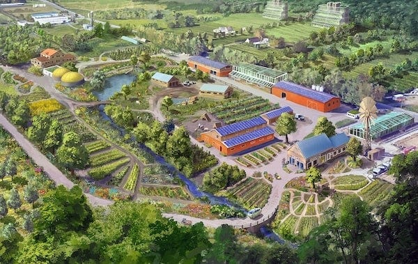
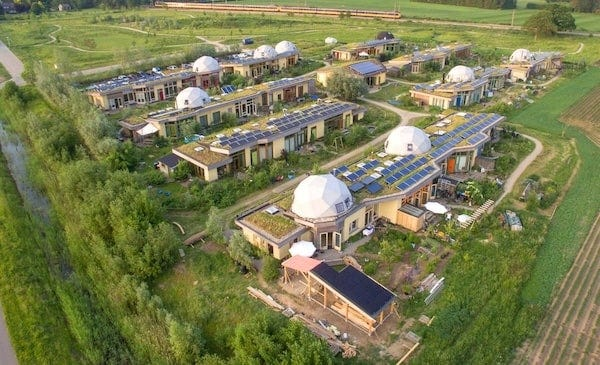
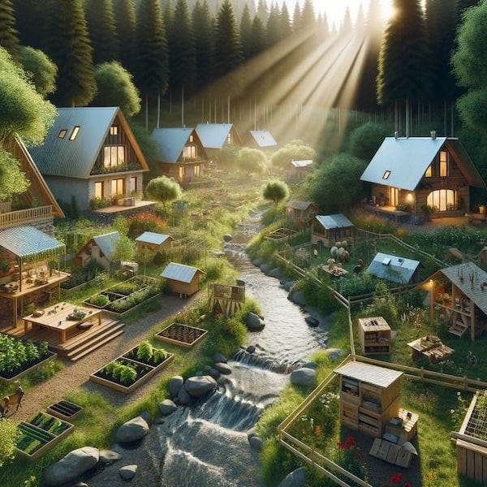
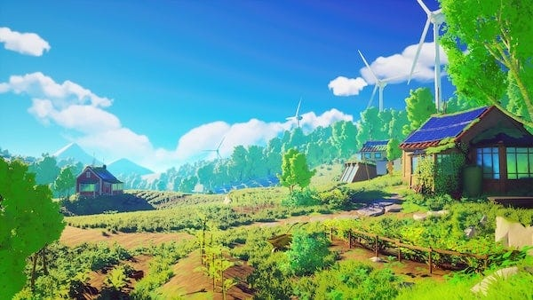

_[Last time we learnt](https://peacefulrevolutionary.substack.com/p/liberation-from-justice) of our intrepid right-wing reporter’s visit to justice and defence facilities, and this time we learn about how the island manages environmental sustainability and agriculture. Note: those who read the previous articles will of course realise this is satire._

## Journey to Porto Verde

After the unsettling visit to Porto Segura’s justice facilities, Carlos suggested we visit Porto Verde, a smaller settlement nestled in the island’s agricultural heartland. I welcomed the change of pace. Surely examining their primitive farming methods and inadequate energy infrastructure would reveal at last the poverty hidden beneath their cooperative pretense.

The train journey took us through increasingly rural landscapes. What struck me immediately was the patchwork nature of the cultivation - nothing like the orderly monoculture fields I was accustomed to. Fruit trees grew alongside vegetable plots, with what appeared to be wild hedgerows between them. It looked chaotic, inefficient, almost medieval.

‘Your agricultural methods seem rather disorganised,’ I ventured, pointing to the patchwork of fields outside the window.

‘Do they?’ Carlos asked mildly. ‘Or are they more organised than they appear?’

Porto Verde itself was modest, perhaps five thousand residents, built around a central plaza with housing radiating outward in concentric rings. Beyond the residences, I could see orchards, gardens, and cultivated fields stretching toward forested hills. Windmills dotted the landscape, their blades turning lazily in the afternoon breeze.

‘The settlement pattern is quite deliberate,’ Carlos explained as we disembarked. ‘Housing in the centre for easy access to communal facilities, with agricultural land at the fringes where it makes sense ecologically. People can walk to the fields easily, and the compact housing preserves more land for cultivation and wild spaces.’

 _Forced urbanisation under the guise of environmental concern. Probably prevents people from owning private farmland._

## Meeting the Agricultural Collective

We were met by a woman named Teresa, sun-weathered and strong, who apparently coordinated (that word again) one of the agricultural collectives. She wore practical work clothes splattered with soil, and I noticed her hands bore the calluses of genuine labour.

‘Welcome to Porto Verde,’ she said warmly. ‘Carlos mentioned you’re interested in how we manage food production?’

‘Indeed. I’m curious how you maintain adequate yields without, well, modern industrial agriculture.’

Teresa’s eyebrow raised slightly. ‘You assume we don’t use modern techniques? Come, let me show you something.’

She led us past the plaza toward the agricultural zone.

‘When the Portuguese first arrived,’ Teresa began, ‘they saw an inexhaustible supply of timber, rich soil for single-crop plantations, resources to exploit. They started clearing forest for sugarcane, cutting cedar without replanting, exhausting the soil with monoculture.’

‘And the indigenous peoples taught them better?’ Carlos prompted, undoubtedly already knowing the story she was about to give us.

‘Eventually, after they’d nearly destroyed several forest areas and experienced crop failures. The indigenous Antilleans had been managing these lands for generations through careful stewardship - replanting more than they harvested, rotating crops, using complementary plantings to maintain soil health, treating the forest as a commons to be managed collectively rather than a resource to be exploited.’

‘That sounds rather primitive,’ I observed.

‘Does it?’ Teresa knelt beside a plot where beans climbed corn stalks whilst squash spread between them. ‘This is the Three Sisters method, practised by indigenous peoples for centuries. The corn provides structure for beans to climb, the beans fix nitrogen in the soil, the squash shades the ground to retain moisture and prevent weeds. It’s more productive per acre than monoculture, requires no synthetic fertilisers, and builds soil health rather than depleting it. How is that primitive?’

‘But surely modern industrial agriculture produces far more food?’

‘In the short term, whilst destroying soil and requiring ever-increasing inputs of fossil-fuel-derived chemicals. We produce abundantly using integrated techniques - indigenous knowledge combined with modern understanding of soil ecology, plant biology, and permaculture design. The difference is we design for sustainability over centuries, not quarterly profits.’

## The Forest Stewardship

After examining several garden plots, Teresa suggested we visit the forest management area. I agreed, curious to see how they handled larger-scale resource extraction.

We walked perhaps a kilometre to where cultivated land gave way to managed forest. A group of about a dozen people were working amongst the trees - some assessing which could be harvested, others planting saplings, several collecting mushrooms and other forest products.

A young man named Hassan greeted us. ‘We’re doing our quarterly assessment,’ he explained. ‘Determining what can be taken sustainably this season.’

‘How do you determine that without central planning?’ I asked.

‘Well, we do plan,’ Hassan replied. ‘But the planning is done by those of us who actually work in the forest, who know these trees individually, who understand the ecosystem. Not by bureaucrats in an office somewhere.’

He showed us a hand-drawn map marked with annotations - which areas had been harvested when, which were reserved for regeneration, where rare plants needed protection. It was surprisingly detailed, clearly the work of people who knew their land intimately.

‘The indigenous communities taught us to think in generations,’ Hassan continued. ‘When we plant a cedar, we’re planting for our grandchildren to harvest. When we cut one, we’re using something our grandparents planted. It changes your relationship to the forest entirely.’

‘But surely that’s not sufficient? You must need far more timber than can be sustainably harvested - for construction, heating, all your paper needs?’ I said, wondering if I’d receive a different answer than the last time I’d asked a similar question.

‘We recycle and repair obsessively. We’ve developed efficient wood stoves that use far less fuel. And we’ve massively reduced paper consumption - most communication is digital or verbal.’

‘You’ve adapted your needs to match sustainable supply,’ Carlos added, ‘rather than trying to extract resources unsustainably to meet artificially inflated demands.’

A woman named Lina joined our conversation, carrying a basket of mushrooms. ‘The forest provides beyond timber. These mushrooms, medicinal plants, fruit and nuts, materials for crafts. When you manage a forest as a living ecosystem rather than a timber factory, it produces abundance.’

 _Romantic primitivism. Probably supplement with imports and ration what they claim to produce. Yet the forest does look healthy..._

## Wind and Water

That afternoon, Teresa handed us over to a man named Paolo, who apparently worked with the energy collective. He was younger, probably in his thirties, with an enthusiasm that suggested he genuinely enjoyed his work.

‘Porto Verde is ideal for renewable energy,’ he said as we walked toward the nearest windmill. ‘We get consistent wind from the ocean, several streams for micro-hydro, and excellent solar exposure. Plus, we’re connected to the regional grid which includes geothermal stations in the volcanic areas and offshore wind and wave farms.’

The windmill up close was impressive - a modern design, clearly well-maintained, with the generator housing accessible by a ladder. Paolo noticed my interest.

‘We manufacture these locally. The designs are open-source, shared freely not only between communities, but the rest of the world. When someone develops an improvement, everyone benefits. No patents, no proprietary technology to pay for.’

‘But what motivates improvement without monetary reward?’ I kept asking, though I expected a similar answer to what I’d heard before.

Paolo looked genuinely confused. ‘Because improving energy efficiency benefits everyone? Because it’s intellectually satisfying? Because people want to contribute meaningfully?’ He paused. ‘Why do you assume people only create when there’s money involved?’

We walked to a nearby stream where a modern micro-hydro installation hummed quietly. ‘This isn’t some medieval waterwheel,’ Paolo explained. ‘It uses modern turbine design, computerised load management, and feeds into the village grid. But the principle is the same as watermills have used for centuries - using gravity and flowing water to do work.’

‘The solar panels on most roofs were added by the community,’ he continued. ‘Excess production goes to the grid, and when someone needs more than they generate, they draw from common production. No one pays for electricity - it’s treated as a basic necessity, like air.’

‘What happens when production falls short?’ I asked. ‘During calm, cloudy weeks?’

‘That was common in the past, but is rare these days. We have battery storage, but we also adapt consumption. Non-essential uses reduce automatically. People are conscious of supply and adjust accordingly. But now we’re connected to the regional grid. We share production and balance load across regions.’

‘That must require enormous coordination.’

‘It requires computers and communication, yes. But the coordination is distributed - each community manages its own production and consumption whilst sharing with others. There’s no central authority controlling everything, just voluntary cooperation and shared information.’

‘And the offshore wind and wave farms? Those must be expensive.’

‘They took significant collective effort to build, yes. But with no profits to extract, no shareholders to pay, the cost is purely materials and labour. And the benefits flow to everyone, not to a few owners. We actually get more value from our resources because none is being siphoned off as profit.’

 _Claims of efficient renewable energy, but probably frequent blackouts they’re not mentioning. Yet the lights do seem to stay on..._

## Food Without Money

By evening, I was hungry, and Teresa invited us to join her household for dinner. Her home was modest but comfortable, part of a cluster of dwellings that shared a courtyard. As we arrived, several neighbours were already there, and I realised dinner would be communal.

‘Everyone brings what they have,’ Teresa explained. ‘Tonight my household contributed vegetables from our garden plot and flour from the mill. Raj brought fish he caught this morning. Catalina brought fruit from the orchard collective. We’ll make a meal together.’

‘No one pays for any of this?’ I asked, watching the effortless exchange of food.

‘Pay? Pay whom?’ Raj looked genuinely puzzled. ‘I catch fish because I enjoy it and because people need fish. Teresa grows vegetables because she’s good at it and because we need vegetables. Why would we need to pay each other for contributing to our community’s wellbeing?’

As we prepared the meal together - and I found myself surprisingly pressed into service chopping onions - I observed the system in action. People took what they needed, shared what they had, and no one was counting or keeping score. Yet it didn’t devolve into chaos or hoarding.

‘I’m surprised to see fish,’ I remarked to Catalina, who was teaching me the proper way to fillet it (apparently my method was ‘wasteful’). ‘I’d heard some communities here reject meat entirely.’

‘Some do,’ she confirmed. ‘Porto Saber is largely vegetarian, for instance. But Porto Verde has always been a fishing community. We take what the sea offers sustainably. It’s a choice each community and individual makes.’

‘How do you prevent someone from taking more than their share?’ I asked.

‘Why would they? If you take more food than you can eat, it spoils. There’s no point. And if someone was consistently taking far more than seemed reasonable, people would notice and ask if everything was alright - maybe they’re struggling with something, maybe they have guests, maybe there’s a problem we could help with.’

‘But what about luxury items? Special foods? Things that are scarce?’

Teresa overheard and laughed. ‘We trade with cargo ships for luxuries - coffee, chocolate, spices we can’t grow here. Those get distributed through the community centres. If something’s particularly scarce, we discuss how to share it fairly. Usually that means everyone gets a little rather than some getting a lot.’

‘And people accept that? Don’t they want more?’

‘Want more of what?’ Raj interjected. ‘More than I can eat? More than I need? Why? So I can feel superior to my neighbours? That seems exhausting and unpleasant.’

The dinner itself was excellent - fresh fish, roasted vegetables, bread that Catalina had apparently baked that morning, fruit for dessert. Everyone ate until satisfied, and the conversation flowed easily. No one was checking a bill, calculating tips, or worrying about affording the meal.

As we ate, I noticed something else: the pace. No one was rushing. People took time with their food, with their conversation, with each other. Back home, efficiency meant eating quickly and getting back to productive work. Here, the meal itself seemed to be considered worthwhile.

‘You have time for this,’ I observed. ‘Long communal dinners, slow meals.’

‘Of course,’ Teresa replied. ‘We work about twenty-five hours a week on average. The rest of the time is ours - for meals, conversation, projects, rest, whatever we want. Why would we rush through eating just to spend more time making someone else wealthy?’

 _Admission of low productivity. Yet they claim to produce enough for everyone. The food is certainly real enough._

## The Environmentalists Dream

After dinner, Paolo offered to show me the village’s ‘pride and joy’ - a recently completed project he seemed particularly excited about. We walked through streets lit by solar-powered lamps, past community gardens where people were harvesting evening crops, to a large building covered in vines and solar panels.

‘Our community centre,’ Paolo announced. ‘Also houses the water purification system, the library, meeting spaces, and workshops. All powered by solar during the day, with battery storage for night and cloudy weather.’

The building was beautiful in a way I hadn’t expected - organic curves rather than rigid lines, large windows bringing in natural light, the green walls regulating temperature while the solar panels generated power. It looked more like something alive than a conventional building.

‘We built this collectively over two years,’ Paolo explained. ‘Everyone contributed skills - some did structural work, others plumbing, electrical, landscaping. The design was developed through community discussions with input from engineers, architects, and people who’d actually be using the space.’

‘It must have cost a fortune.’

‘Cost in what sense? Materials, yes. Labour, yes. But labour given freely by people who wanted this facility and who took pride in building it. The materials came from our own resources where possible - adobe bricks we made, timber from managed forests, salvaged materials from old structures. What we couldn’t produce, we asked for help obtaining.’

Inside, the community centre buzzed with activity. Someone was teaching children woodworking in one room. A study group discussed something mathematical in another. The library held people reading, researching, quietly working. Everything was free, accessible, maintained collectively.

‘The water purification system below uses natural filtration systems,’ Paolo continued. ‘Reed beds, gravel filters, UV treatment powered by solar. It’s more elegant than chemical treatment, requires minimal input, and produces clean water reliably. The excess heat from the process helps warm the building in winter.’

‘You’ve thought of everything,’ I said, unable to keep a hint of admiration from my voice before catching myself.

‘We’ve tried to create systems that work with natural processes rather than against them. Windmills that produce power from wind that blows anyway. Solar panels that capture sunlight that falls anyway. Buildings that stay cool by mimicking the way trees moderate temperature. Water treatment that uses the same processes nature uses to clean water in streams and wetlands.’

‘It seems almost too good to be true.’

‘It’s not perfect,’ Paolo admitted. ‘Sometimes the wind doesn’t blow. Sometimes we have droughts. Sometimes equipment breaks. But we’ve designed for resilience - multiple sources of energy, water storage, backup systems. And we adapt. During the dry season two years ago, we reduced non-essential water use collectively until the rains returned. No one had to be forced, people simply understood the situation and adjusted.’

‘But surely this only works because you’re small, isolated, blessed with good conditions.’

‘We are fortunate in some ways, yes. But small communities can coordinate more easily than large ones. Being isolated means we had to become self-sufficient. And the conditions we’re “blessed with” exist in many places - wind, water, sun are available nearly everywhere. What’s been lacking isn’t the resources but the social organisation to use them cooperatively instead of competitively.’

We climbed to the roof where more community gardens grew, irrigated by captured rainwater. People were there, tending plants, chatting, watching the sunset paint the sky orange and red. The windmills on the hills turned rhythmically. Solar panels glinted. The village below glowed with warm light. It looked, I had to admit, rather idyllic.

 _Green technology veneer hiding underlying inefficiency. Yet the systems do seem to function. Perhaps adequate for small scale..._

## Confronting Contradictions

That night, lying in the simple bed in Teresa’s household, I reviewed my notes with increasing frustration. Every assumption I’d brought about environmental destruction, agricultural inefficiency, and energy poverty had been challenged. Not through rhetoric, but through direct observation of functioning systems.

The reporter in me demanded I find the flaw, the hidden cost, the unspoken suffering. But I’d spent the day watching people work shorter hours, eat better food, live in communities powered by clean energy, and seem genuinely content with lives that revolved around cooperation rather than competition.

Where was the scarcity? The rationing? The queues? The pollution? The exploitation that any functioning society surely required?

I thought about Carlos’s gentle corrections throughout the day. His patience with my skepticism. His willingness to show me everything, answer every question, even when I was clearly hostile. Why wasn’t he hiding anything? Why let me see so much if there were secrets to conceal?

Unless there weren’t secrets. Unless this really was what it appeared to be: a genuinely functional alternative to the hierarchical, exploitative, extractive systems I’d been raised to consider inevitable.

No. That couldn’t be right. There had to be something. Some hidden darkness. Some price being paid somewhere.

Tomorrow Carlos planned to show me ‘a day in the life’ of ordinary Liberationists - not the carefully curated tours of workplaces and facilities, but just following people through their daily routines. Surely then I’d see the cracks. The resentments. The frustrations. The ways in which human nature resisted their egalitarian ideals.

Because if I didn’t find those cracks, if this really worked as well as it appeared to then what did that say about the society I’d come from? What did it say about the systems I’d been taught were natural, inevitable, necessary? I pushed the thought away and tried to sleep. Tomorrow would bring answers. It had to.

 _In my next dispatch, I will observe how ordinary Liberationists actually live day to day, surely revealing the personal costs of their anti-individualist ideology. Their suppression of personal ambition, their enforced collectivism, their rejection of privacy and personal property must create resentments and frustrations they’ve so far hidden from me. The illusion will shatter when I see how they actually live._

Subscribe

[Share](https://peacefulrevolutionary.substack.com/p/liberation-from-nature?utm_source=substack&utm_medium=email&utm_content=share&action=share)

 _See<https://anarwiki.org/wiki/Anarchist_Solutions_To_Climate_Change> for further info._

 _You can read the next part of the story here:_
