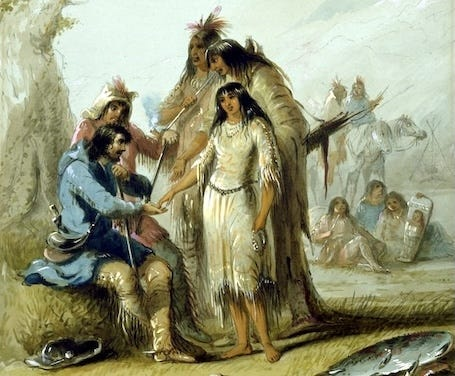
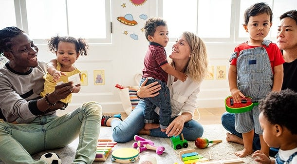

_[Last time we learnt](https://open.substack.com/pub/peacefulrevolutionary/p/liberation-from-nature) of our intrepid right-wing reporter’s visit to an agricultural community, and this time we learn about relationships and cultural life on the island. Note: those who read the previous articles will of course realise this is satire._

## A Different Kind of City

The train journey to Vila Arte took us along the eastern coast, where the landscape gradually shifted from the functional industrial architecture of our previous stops to something more decorative. Every surface seemed to be a canvas. Murals covered building walls, intricate mosaics decorated walkways, and what I initially mistook for vandalism turned out to be carefully executed street art.

‘Welcome to our cultural centre,’ Carlos said as we disembarked. ‘Though really, culture happens everywhere. Vila Arte just has a particular concentration of artists, performers, and those who enjoy being around creative work.’

The station itself exemplified this - its walls covered in a sprawling narrative mural that seemed to tell the island’s history in vivid, sometimes disturbing detail. I noticed one panel depicting what appeared to be European sailors arriving, being cared for by indigenous people. The style was striking, though I couldn’t help thinking it romanticised what must have been a more complex encounter.

‘That’s by Isadora,’ said a voice behind us. A woman in her fifties approached, paint stains on her clothes, greying hair pulled back practically. ‘I’m Mira. I coordinate the cultural collective where you’ll be staying. Isadora spent three years on that piece, documenting oral histories from the indigenous communities.’

Carlos made introductions. ‘Mira has lived in Vila Arte for twenty years. She’ll be showing you around while I catch up on some work.’

‘She’s paid for this work?’ I asked, gesturing at the mural.

Mira gave me an amused look. ‘She does this work because she wants to. The community ensures she has what she needs - housing, food, materials. In return, we have this.’ She gestured at the mural. ‘Though “in return” isn’t quite right. She’d create regardless. We support her because her work enriches all of us.’

 _Art as charity project. Probably mediocre quality accepted because they can’t afford professional standards._

## An Uncomfortable History Lesson

Our accommodation for the next few days was in what Mira called the cultural collective - essentially a large building where artists, writers, musicians, and others involved in creative work lived and worked. The common areas were cluttered with works in progress, instruments, and materials I couldn’t identify. It seemed to function as both workshop and apprenticeship space, where those newer to various crafts could access materials and learn from more experienced artists. Several young people were receiving guidance from older practitioners, working side by side on projects.

That evening, Mira suggested we attend a community storytelling event where elders from the indigenous communities would share oral histories. Carlos had decided to join us after all. I agreed, thinking it might provide insight into how they indoctrinated the young.

The gathering took place in an outdoor amphitheatre as the sun set. An elderly woman named Akira began speaking in the indigenous language, with a younger person providing translation. What followed made me profoundly uncomfortable.

She began not with historical facts, but with a story.

‘When the first Portuguese sailors washed ashore, more dead than alive, we cared for them as we would care for anyone in need. We fed them, healed their wounds, taught them how to survive here. But they brought strange ideas with them - ideas that made no sense to us.’

‘There was one young woman,’ Akira continued, her voice taking on the cadence of a tale told many times before, ‘who was skilled at gathering shellfish and preparing medicines. When the sailors were well enough to walk about, one of them watched her constantly. Finally, he approached the elders and asked, “Who owns her? Who does she belong to?”’

The audience chuckled, as if they’d heard this story before. I didn’t understand what was funny.

‘No one could answer such a question,’ Akira said. ‘The words made no sense. “She belongs to herself,” they tried to explain. But the sailor kept using words that wouldn’t translate - words about property, about exclusive rights, about claiming and binding.’

‘But the young woman had been watching him too. She found him interesting - these strange visitors from across the ocean. So one evening, she invited him to share her meal, then to share her sleeping mat.’

I shifted uncomfortably. Such forwardness described so casually, as if it were perfectly natural.

‘The sailor was overjoyed at first,’ Akira continued. ‘But the next morning, he began asking questions that confused her. He wanted to know if she would be his wife now. If she would promise to be with him always. She told him, “I was with you last night because I wanted to be. I’m with you now because I want to be. Why do you need promises about tomorrow?”’

‘He tried to explain marriage to her - vows before God and law, binding themselves exclusively forever. She listened, trying to understand, but it seemed to her like describing a prison and calling it a home. “How would I know you were with me because you wanted to be,” she asked, “rather than from obligation or fear of breaking your oath?”’

The sailor struggled with this, Akira told us. He kept trying to bind her to him with words and promises. Each time she refused, saying “I’m here now. I choose you now. Isn’t that enough?”

He worried constantly that she might leave him. She tried to reassure him: “Why would I seek another when I’m content with you? And if I did become discontent, wouldn’t you rather know honestly than have me stay from obligation?”

‘After forty years together,’ Akira said, her voice soft now, ‘he finally understood. On his deathbed, he took her hand and said, “I spent so many years trying to make you promise to stay with me. But now I understand - you chose me. Every single day for forty years, you chose me. That meant more than any vow, because it was real.”’

Akira paused, looking around at the gathered audience. Then she smiled.

‘That young woman who taught a Portuguese sailor about the true meaning of love, who chose him freely every day for forty years - she was my great-great-grandmother.’

The audience made sounds of appreciation, as if confirming a story they knew well. I sat stunned, trying to process what I’d heard.

‘The sailors learnt eventually,’ Akira concluded. ‘Or at least, those who stayed did. They learnt that love freely given is stronger than love demanded. That a partner who chooses you each day values you more than one bound by law or economic need.’

After the storytelling, I couldn’t contain myself. ‘You’re describing complete moral relativism,’ I said to Carlos and Mira. ‘Without marriage, without legal structures, without religious guidance, how do you prevent society from descending into ... into ...’

‘Into what?’ Carlos asked quietly. ‘Into people making their own un-coerced choices about their intimate lives? Into relationships based on actual affection rather than economic necessity or social obligation?’

‘Into chaos! Into the breakdown of the family unit, which is the foundation of civilisation!’

‘Is it?’ An elderly man who’d been listening joined our conversation. Mira introduced him as Kenji, a historian who’d been documenting the island’s development.

‘Tell me,’ Kenji continued, ‘what you call “the traditional family” is actually a very recent invention. For most of human history, people lived in extended kinship networks and raised children communally.’

‘But surely marriage has always existed?’

‘As a property contract enforced by state power? That’s relatively new. And do children really need two isolated parents, or do they need consistent care from multiple supportive adults?’

## The Language of Non-Possession

The next morning, I joined Mira and Carlos for breakfast in the collective’s common kitchen. Carlos had apparently spent the night at a friend’s home elsewhere in the city and rejoined us. A young woman was preparing food while chatting with others.

‘That’s Isadora,’ Mira said, noticing my gaze. ‘The muralist whose work you saw at the station. She lives here in the collective. Isadora! Come meet our visitor.’

Isadora approached, wiping her hands on a cloth. ‘You’re the journalist,’ she said, her English heavily accented but clear. ‘I’d love to talk with you about your work sometime. We’re forming a journalism collective here - trying to document what’s happening on the island and share it with the outside world, when they’ll listen.’

‘I’d be happy to,’ I said, somewhat automatically. She was attractive, I couldn’t help noticing, though inappropriately dressed for morning conversation.

As we ate, I asked Carlos about something that had been bothering me. ‘I’ve noticed people here don’t use possessive language when talking about their partners. Yesterday at the storytelling, the translator kept using phrases like “someone she was with” rather than “her partner” or “her husband.” Why is that?’

‘Because language shapes thought,’ Carlos explained. ‘In our creole, there’s no possessive form for people. You can say “my book” or “my home” in the sense of what you’re using, but you can’t say “my person” or describe someone as belonging to you. It would sound as strange to us as claiming to own someone in your language sounds to you - actually, stranger, because for you such ownership historically existed through marriage laws.’

‘But how do you refer to significant relationships then?’

‘Descriptively. “Someone I live with.” “Someone I’m intimate with.” “Someone I’m raising children with.” We focus on what the relationship actually involves rather than claiming ownership. Names matter more than labels.’

‘That seems unnecessarily complicated.’

‘Does it? Or does your system seem unnecessarily possessive?’ He paused. ‘You can love someone deeply, commit to them completely, build a life with them - all without needing to claim ownership. In fact, I’d argue that true love requires letting go of the desire to possess.’

I made a note: _Rejection of possessive language. Linguistic manipulation to normalise unstable relationships._

## The Practice of Multiple Parenting

As Mira walked me through the city that morning after breakfast, I couldn’t help but notice the various configurations of people - two women holding hands, three people clearly together, an elderly pair moving with decades of synchronicity.

A woman approached us, greeting Mira warmly. ‘This is Kaia,’ Mira introduced her. ‘She’s a community mediator, helps people navigate relationship conflicts when they arise.’

‘Do people here practice monogamy?’ I asked, trying to sound clinical rather than judgemental.

‘Some do. Many do, especially as they get older and figure out what works for them. Others don’t. Both are equally valid,’ Kaia said. ‘But conflicts arise regardless of configuration. The difference is we handle them through communication and mediation rather than legal battles.’

Kaia invited us to join her family for lunch - ‘family’ in this case meaning the parenting collective raising her daughter and two other children. Mira led the way to a large home where we were greeted by chaos - children playing, adults cooking, someone fixing a bicycle in the corner.

‘This is organised chaos,’ Mira whispered. ‘Seven adults, three children. It works for them.’

Over lunch, I observed the dynamics. Miya, perhaps twelve years old, moved easily between adults - asking one for help with homework, another for food, a third for permission to play outside. The adults seemed to operate without formal hierarchy, discussing decisions collectively but quickly.

‘How do you decide who does what?’ I asked.

‘We talk about it,’ a man named Raj explained. ‘Some of us are naturally morning people, so we handle early childcare. Others prefer evening hours. Some of us have more patience for homework help, others for physical play. We divide tasks according to interest and capacity, and we rotate the less pleasant aspects.’

‘Don’t the children get confused? Having so many authority figures?’

‘Authority?’ A woman named Nesrin looked puzzled. ‘We’re not authority figures. We’re caregivers, guides, teachers. The children know we’re here to support them, not rule them. And no, they don’t get confused. They know who to go to for what, and they benefit from multiple perspectives and approaches.’

‘But what about stability? What if parents separate?’

‘Then the child still has their other parents,’ Kaia said. ‘When Hiro and I separated, Miya still had me, still had him, still had the four other adults who’d been part of her parenting circle since birth. She was sad about the change, certainly. But she wasn’t abandoned or forced to choose between parents, and she gained new adults in her life when Hiro and I formed new partnerships. The network of care remained strong.’

‘What if you all disagree about something important? Like education or medical care?’

‘Then we discuss it until we reach consensus or at least a solution everyone can live with,’ Hiro said. ‘It takes time, certainly. But raising children collectively means no one person is bearing the full weight of these decisions. The burden is shared, which makes it lighter. And the children benefit from hearing different viewpoints being respectfully debated.’

I noticed Miya listening to this conversation with obvious understanding. ‘Do you like having so many parents?’ I asked her directly.

She shrugged. ‘It’s all I know. But my friend who moved here from your country says she wished she’d grown up like this. Her parents were always stressed, fighting about money and who did more childcare. Here, there’s always someone available when I need something, and the adults seem happier.’

 _Children indoctrinated to accept abnormal family structures. Lack traditional moral foundation. Though the child appears well-adjusted - possibly an exception._

## An Evening Performance

That night, Mira and Carlos took me to a community theatre. ‘You should see how we tell stories,’ Mira said.

The performance was unlike anything I’d experienced. The play shifted between comedy and drama, silliness and profound emotion. It followed a character navigating several relationships simultaneously, each teaching them something different about themselves and love. The audience laughed, cried, and at one point broke into spontaneous song.

‘Who wrote this?’ I asked during intermission.

‘A collective of five people,’ Mira explained. ‘They workshop scripts together, improvise scenes, refine through performance. Technically one person - Vera - came up with the idea, but everyone involved contributed significantly.’

‘In my country, there’d be lawsuits over authorship and royalties.’

‘Here, people care more about the work existing and being performed than about ownership. Vera is proud to have her name associated with it, certainly. But she also acknowledges it wouldn’t exist in this form without the others’ contributions. Truth matters more than ego.’

After the performance, we joined a discussion group where audience members shared their reactions and interpretations. A young man said the play had helped him understand his own confusion about relationship structures. An elderly woman wept as she shared how it reminded her of a love she’d lost decades ago. A teenager analysed the symbolism with sophistication I wouldn’t have expected.

‘We do this after every performance,’ Mira explained. ‘Films too. We watch together, then discuss. It creates shared cultural experience and helps people process what they’ve seen.’

‘In my country, we consume entertainment individually, through streaming services.’

‘We’ve heard. Seems isolating.’

## A Growing Attraction

Over the following days, Isadora and I spent more time together. She showed me various art projects around the city - installations, performance spaces, community workshops where people were learning skills from experienced artists.

‘Everyone should be an artist,’ she said at one point.

‘But not everyone has talent.’

‘Talent is overrated. Or rather, talent is common - what’s uncommon is opportunity and encouragement and skill. Here, children are supported in creative expression from early ages. Some become exceptional, most become competent, none are told they can’t try. And even those who don’t achieve “professional” level still benefit from the practice of creating.’

‘But if everyone’s an artist, who does the actual work?’

‘Creating is actual work. But also, most artists here do other work too. I spend mornings in the community gardens most weeks. It grounds me, connects me to people outside art circles. Mira coordinates the collective but she’s also a sculptor. The actor you saw performing last night also coordinates the district’s water treatment facility.’

‘Doesn’t that dilute excellence? If people divide their time?’

‘Does it? Or does it create more well-rounded humans who bring diverse experience to their primary passion? Some people do focus entirely on one skill - usually those working on complex projects or developing new techniques. But most find that engaging in multiple areas of life enriches all of them.’

I found myself attracted to Isadora, which troubled me. She represented everything my society deemed immoral - living in a communal setting, openly discussing her various romantic and intimate connections, seemingly unbothered by what I’d been taught to see as proper boundaries. Yet she was articulate, thoughtful, clearly devoted to her work.

One evening, she asked directly: ‘Would you like to spend the night with me?’

I was stunned by her forwardness. ‘I, that is … I’m here professionally.’

‘So? Humans have needs beyond professional ones. I find you interesting. I think you find me interesting. We’re both adults. Why complicate it?’

‘Because it’s ...’ I struggled for words. ‘Where I’m from, intimate relations outside marriage are forbidden. What you’re suggesting is illegal.’

She looked genuinely confused. ‘Illegal? The state forbids adults from choosing to share pleasure and intimacy? Why?’

‘Because such intimacy should be reserved for committed, legally sanctioned relationships. To prevent disease, unwanted children, moral decay.’

‘We have excellent healthcare that prevents disease. We have multiple methods of preventing unwanted pregnancy. As for moral decay,’ She smiled sadly. ‘Is it more moral to force people into permanent bonds regardless of whether they’re happy? To punish people for honest desire? To make criminals of those seeking consensual connection?’

‘You don’t understand. In a civilised society, such things must be regulated.’

‘We are civilised aren’t we? We simply define civilisation differently. To us, civilisation means people treating each other with respect and care, not rules about who can touch whom.’ She stood. ‘I’m not offended by your rejection. But I am sad that you’ve been taught that your own desires are shameful.’

## Mounting Discomfort

That night, lying in my small room in the cultural collective, I reviewed my notes with growing unease. I’d come to the island certain I’d find moral chaos, family breakdown, cultural decay. Instead, I’d found children raised by multiple adults who seemed well-adjusted and happy, relationships based on genuine affection rather than legal obligation, thriving artistic and cultural life, and people who spoke of love with a depth and thoughtfulness I’d rarely encountered.

But surely this couldn’t work long-term. Surely human nature - our capacity for jealousy, possessiveness, selfishness - would eventually destroy such arrangements. Surely the lack of clear rules and hierarchies would lead to conflict and suffering.

Yet after weeks on the island, I’d seen remarkably little of either. The conflicts I’d witnessed were addressed through communication and mediation rather than force or law. The suffering I’d expected to find in ‘broken’ families was absent, replaced by networks of care that seemed, if anything, more robust than the isolated nuclear families I knew.

I thought of Isadora’s invitation and my refusal. She hadn’t been offended or insulted. She’d simply accepted my boundary and moved on. In my world, such a direct proposition would be scandalous, even criminal. Here, it was treated as natural - one human honestly expressing interest in another, with full freedom for the other to decline without consequence.

## Running Out of Time

Carlos found me at breakfast the next morning. ‘You’ve now seen most of what the island has to offer,’ he said. ‘The major cities, our various systems and approaches. What remains is for you to write your conclusions.’

‘I’m not sure I have conclusions yet,’ I admitted.

‘You must have some impressions after all this time.’

I did. Too many, and most of them uncomfortable. I’d expected to find a failed experiment, a cautionary tale about what happens when people reject proper authority and moral structure. Instead, I’d found a functioning society that seemed, in many ways, more successful at meeting human needs than my own.

‘I need more time,’ I said. ‘There must be something I’m missing. Some flaw in your system that hasn’t revealed itself yet.’

Carlos looked at me with something like pity. ‘Perhaps the flaw you’re looking for is that it doesn’t match your expectations. But expectations aren’t truth, William. They’re just stories we’ve been told so often we’ve forgotten they’re stories.’

 _In my final dispatch, I will attempt to synthesise everything I’ve witnessed, to make sense of a society that seems to function despite rejecting everything I know to be necessary for social order. Whether I can reconcile their apparent success with my understanding of human nature and proper society remains to be seen._

Subscribe

[Share](https://peacefulrevolutionary.substack.com/p/liberation-from-love?utm_source=substack&utm_medium=email&utm_content=share&action=share)

 _You can read the next part of the story here:_

 _This may also be of interest:_
