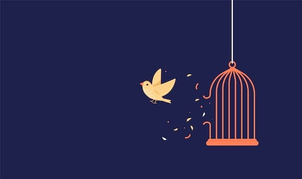
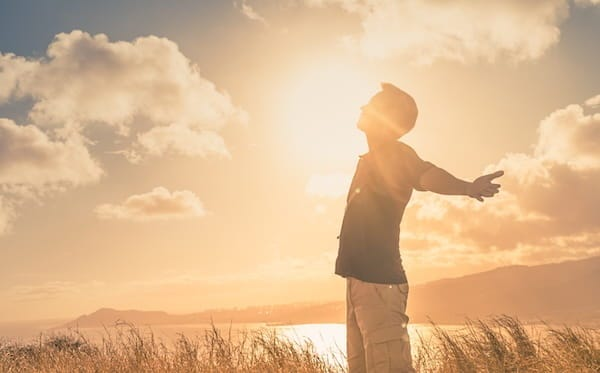

# Why Liberation

 _[Last time](https://peacefulrevolutionary.substack.com/p/liberation-from-love) we learnt of the islander’s views on art and love - Now, one year after arriving on Liberation Island, the reporter addresses the journalism collective about his transformation from skeptic to Liberationist._

I’d like to say that the room fell quiet as I finished reading aloud from my laptop, the final words of what would have been my eighth dispatch hanging in the air. But though the Antilleans were capable of silent attention, the people there – many I now knew well – gave me enthusiastic applause instead. Isadora squeezed my hand encouragingly from the seat beside me.

When the group returned to listening again, I added, ‘That was the last dispatch I ever wrote’ I paused, correcting myself. ‘Though I never actually transmitted it. I somehow knew it would be too scandalous for them ever to print. And that I’d already got away with saying too much that was positive, even if I did surround it by skepticism and dismissive commentary.’

I opened up the floor to questions and someone in the back – I think it was Tomás, who taught at the journalism collective – called out: ‘When did you know you weren’t going back?’

I laughed, but it came out more like a sigh. ‘Honestly? I think I knew before I was willing to admit it to myself. Probably around the time I watched Lin at the pharmaceutical workshop take obvious pride in producing insulin that would keep Jonas and others alive, motivated by kindness rather than compensation.

Or maybe even earlier, when Yuki and Dmitri at the Co-Hub explained how resource distribution worked through voluntary coordination rather than central command, and I realised I couldn’t actually explain why their system would fail – I just believed it should, and that bothered me.

I stood and began pacing, as I always did when I was working through something difficult. Old habits die hard.

‘But what I couldn’t share in those dispatches – what I couldn’t even admit to myself for weeks – was how much of that initial skepticism had fallen away the more time I spent with the people of this island. Seeing the way you lived. How content you seemed despite lacking all the distractions and conspicuous consumption I’d been taught were necessary for happiness.’

## The Comfortable Cage

‘Before I set out on this journey a year ago, I thought I lived in a land of liberty already,’ I continued. ‘I enjoyed certain privileges that came with ancestry, education, reputation, and being paid to write things in favour of the regime. I could eat at expensive restaurants. I could buy the latest technologies. I could travel, within limits. I could express opinions, as long as they didn’t challenge fundamental power structures.’

I paused, thinking of my old life. ‘I called that freedom. But it was freedom if you had a very narrow concept of it – free to do many things if you could afford them and if they weren’t socially unacceptable. Free to choose your cage, as long as you didn’t rattle the bars too loudly.’

Mira, who’d been listening quietly from her usual corner, spoke up: ‘What made you question that definition?’

‘Lots of small things at first,’ I replied. ‘Carlos taking me to that café on my first day and paying with labour vouchers whilst patiently explaining why they weren’t money – and me being certain I’d caught them in a lie until I saw the rest of the island genuinely didn’t use money at all.’

I paused, remembering other moments. ‘Dr. Amara spending unhurried time with each patient because there was no artificial scarcity of healthcare workers. Children at that learning centre genuinely excited about discovering things, taught by Mariana who asked questions rather than demanding obedience.’

‘But those were just observations,’ I continued. ‘What really changed me was realising how much of what I believed wasn’t based on evidence at all, but on being told things so often I’d mistaken repetition for truth.’

## What I Was Told

I pulled out my old notebook, the one I’d filled with skeptical observations that first week. ‘I had been told that without hierarchy, organisations would collapse into chaos. I’d been told that without money and markets, people wouldn’t work. I’d been told that without police and prisons, crime would be rampant. I’d been told that without legal marriage, families would disintegrate.’

Looking up from the notebook, I met the eyes of people scattered around the room. ‘I had been told that without profit incentive, there would be no innovation. That without competition, there would be no excellence. That without clear authority, there would be no safety. That without rules about relationships, there would be moral decay.’

‘And what did you find instead?’ Isadora asked softly, though she knew the answer.

I gave her a smile, thinking of how the empire would view my life now. ‘I found I quite liked moral decay,’ I joked.

‘But,’ turning back toward the group, I said, ‘to be serious – I found something unexpected. I’d been told that without profit incentive, there would be no innovation. Yet I found Paolo explaining how removing profit motive meant more efficient use of renewable energy, not less. I found Samuel teaching history by asking questions rather than declaring answers, trusting students to think rather than memorise.’

## The Moments That Changed Me

‘But if I’m honest,’ I added, ‘there were specific moments when the foundation of my worldview cracked. The moment that truly broke me – the one I couldn’t rationalise away or dismiss as naivety – was listening to Akira tell that story. The one about her great-great-grandmother and the shipwrecked Portuguese sailor.’

Several people smiled, clearly familiar with the tale.

I stopped pacing and stood in the centre of the room. ‘That story about freely chosen love changed something in me. The idea that being able to freely and daily make such choices and that they could mean more than any legal bond, helped me to begin to understand that this kind of love, this voluntary commitment, extended beyond romance. It was how you approached everything – cooperation with co-workers, friendship in community, and building a shared future together. Not bound by contracts or coercion, but by genuine care and mutual benefit.’

## What I Would Say Now

I looked at my laptop again. ‘In these dispatches, I tried to define what you called Liberationism through a lens of suspicion and superiority. I described it as primitive, naive, unsustainable. I surrounded every observation with skepticism, suggesting hidden exploitation, concealed hierarchies, inevitable collapse.’

‘What would you say now?’ Someone asked from the back.

I thought carefully before answering. ‘If someone asked me to define Liberationism now, I wouldn’t start with structures or systems. I’d start with a question: What does it mean to be free?’

I could feel the shift in the room, people leaning forward slightly.

‘Not free in the narrow sense I’d believed – free to choose between products or employers, free to compete for resources, free to follow rules or face punishment. But free in a deeper sense.’

I began listing, and found myself using the framework Carlos had hinted at months ago:

## Liberation From

‘Liberation from centralised authority that claims to know better than you what you need. Liberation from having to sell your time and labour to survive. Liberation from living in a system where someone else’s profit requires your exploitation.

‘Liberation from educational models that train you for obedience rather than nurturing your curiosity. Liberation from healthcare tied to your ability to pay. Liberation from a justice system that creates more harm than it prevents.

‘Liberation from property relations that let some own what everyone needs. Liberation from artificial scarcity created to maintain power. Liberation from competition so fierce it destroys community.

‘Liberation from relationship structures that turn affection into property. Liberation from laws that regulate consensual intimacy. Liberation from the isolation of the nuclear family.

‘Liberation from environmental destruction justified by short-term profit. Liberation from the fiction that endless growth on a finite planet is possible or desirable. Liberation from systems that treat nature as resources to be extracted rather than relationships to be maintained.’

I paused, taking a breath. ‘But Liberation isn’t just freedom from. It’s also freedom to.’ (Although that the Antilleans didn’t use such artificial distinctions.)

## Liberation To

‘Liberation to contribute meaningfully without fear of destitution. Liberation to develop mastery in whatever calls to you. Liberation to work less and live more.

‘Liberation to learn throughout your life from curiosity rather than compulsion. Liberation to receive care when you’re ill without calculating costs. Liberation to address harm through healing rather than punishment.

‘Liberation to use what you need without hoarding what you don’t. Liberation to create and share without artificial scarcity. Liberation to cooperate rather than being forced to compete.

‘Liberation to love whom you choose, how you choose, for as long as you both choose. Liberation to raise children collectively, sharing both joy and responsibility. Liberation to form families of affinity rather than just biology.

‘Liberation to live in balance with the land. Liberation to treat forests as living communities rather than timber factories. Liberation to leave a world enhanced rather than depleted.’

The room was very quiet now.

## What Changed

‘So how did I go,’ I said, returning to the original question, ‘from believing we needed hierarchy for stability, property for prosperity, and punishment for morality, to being here, to being one of you, to being a Liberationist?’

I sat back down beside Isadora. ‘The reality of the people and conditions on this island confronted me with how much my beliefs didn’t conform to what actually worked. I’d been taught that freedom meant choosing between brands of soft drink. Here I found freedom meant having genuine agency over your life. I’d been taught that human nature was selfish and violent. Here I found humans respond to the conditions they’re given – create systems that reward cooperation and you get cooperation.’

‘Carlos’s approach was brilliant in its simplicity,’ I continued. ‘He never argued. He just kept showing me things, introducing me to people, letting me witness systems function. Trusting that if I was intellectually honest, I’d eventually have to acknowledge what I was seeing. And all of you’ – I gestured around the room – ‘answered my hostile questions with patience, challenged my assumptions without attacking me, made space for me even when I clearly didn’t understand or value your way of life.’

‘I kept waiting to find the hidden authoritarian structure, the secret police, the concealed exploitation. I kept looking for evidence that your contentment was a facade, that your systems would collapse, that human nature would assert itself and destroy your experiment.’

‘But it never came,’ Taiwo observed.

‘It never came,’ I agreed. ‘Instead, I slowly realised that the authoritarian structure, the police, the exploitation – those weren’t hidden here because this society was secretly authoritarian. They were absent because they weren’t necessary. In fact, they’d be antithetical to how this place functions.’

## The Cost of Realising

‘That realisation cost me something,’ I admitted. ‘It meant acknowledging I’d been lied to, or that I’d participated in lying to others, or both. It meant accepting that the society I’d come from, the one I’d defended and whose privileges I’d enjoyed, was built on exploitation. That my comfort had required others’ suffering. That my freedom had required others’ unfreedom.’

My voice grew quieter. ‘It meant confronting how much of my identity was tied to beliefs that turned out to be wrong. How much of my certainty was just ignorance combined with arrogance. How much of my criticism of you was really fear of what it would mean if you were right.’

Isadora rested her head briefly on my shoulder, a gesture of support that still sometimes surprised me with its casualness. In my old world, such public affection would have been scandalous or required official sanction. Here it was simply two people caring for each other, as natural and unremarkable as breathing.

‘But that realisation also freed me,’ I said. ‘Because if I’d been wrong about so much, if systems I’d thought inevitable were actually just choices, then other choices were possible. Better choices. The ones you’d already made here.’

## What I Fear and What I Hope

‘Now, of course, I see what my grandfather saw here,’ I said, thinking of that original visit decades ago. ‘Why he revered it so much, even though some thought it made him seem disloyal to his own country. He wasn’t disloyal to his country – he was loyal to a vision of what all countries, all peoples, could become.’

I stood again, restless energy returning. ‘I fear for the future of the empire I’ve left behind. Empires rise and fall, and the way it’s going, it seems to be rushing toward its conclusion. And it will come at a high human cost to the people within its borders. It risks taking many other nations down in its wake.’

The mood in the room had shifted, becoming more solemn.

‘But if those left behind can look here,’ I continued, voice growing stronger, ‘if we can help them see the possibilities – then there’s a chance. For the disillusioned, for the exploited, for the ones who’ve been told there’s no alternative.’

I gestured around the room. ‘There have been many Liberation islands throughout history, full of Liberationists practicing their own versions of Liberationism. Of course, it’s been called anarchism and communism and a hundred other names, but the places have had their own indigenous words for it, or no words at all because it’s taken for granted as normal.’

‘The point isn’t the label,’ I said. ‘The point is the practice. The daily choice to organise without rulers, to share rather than hoard, to cooperate rather than compete, to address harm with healing rather than punishment, to love freely rather than possessively.’

## The Universal Possibility

‘People are the same everywhere,’ I said, and I realized how differently I meant it now compared to a year ago. ‘It’s the conditions which change. So if such places are possible here, they’re possible everywhere. If they change the conditions, they’ll change the outcomes.’

I thought about how to end this, how to capture what mattered most.

‘The freedom, friendship, and love I’ve found here isn’t so much the result of a formula, but what happens when those seeking and maintaining power don’t get in the way of what’s naturally possible. When you remove systems designed to control and exploit, what emerges isn’t chaos and selfishness – it’s cooperation and care. Because that’s what humans actually want when we’re not forced into competition for survival.’

I looked directly at the assembled journalists. ‘That’s why I’m here, addressing this collective, working with you to document what happens here and share it with those who need to know it’s possible. Not to romanticise or idealise – you know as well as I do that this place isn’t perfect, that challenges arise, that not everything works smoothly.’

‘But it works,’ I said firmly. ‘That’s what they need to know. That it actually, genuinely, consistently works. That people can live without masters and still maintain order. That communities can thrive without money corrupting every exchange. That relationships can flourish without legal control. That creation and innovation happen without profit motive. That justice can be achieved without punishment.’

## Coming Home

‘A year ago, I arrived here planning to expose a failed experiment,’ I concluded. ‘I arrived certain that my grandfather had been fooled, that his glowing reports were the product of naivety or propaganda. I arrived ready to document the poverty, chaos, and suffering that I’d been taught must inevitably result from rejecting hierarchy.’

I smiled, thinking of all the assumptions I’d brought and gradually abandoned. ‘Instead, I found a home. Work that mattered, using my skills not to defend power but to challenge it. Community, instead of the isolated individualism I’d mistaken for freedom, but genuine connection and mutual support. And yes, I glanced at Isadora, love too.

‘Instead, I found a home. I found work that matters – using my skills not to defend power but to challenge it. I found community – not the isolated individualism I’d mistaken for freedom, but genuine connection and mutual support. And yes,’ I glanced at Isadora, ‘I found love. Real love. The kind that comes from genuine choice rather than economic necessity or social obligation.’

‘So when people ask me why I stayed, why I chose Liberation, the answer is simple and complex at the same time. Simple because: how could I not? Once I’d seen that another world is possible, actually existing and functioning, how could I return to one built on exploitation? Once I’d experienced genuine freedom, how could I return to one that calls obedience liberty?’

‘And complex because: I’m still unlearning hierarchical thinking. I’m still catching myself trying to find someone in charge. I’m still adjusting to a world where ‘what do you do?’ means ‘what interests you?’ rather than ‘what’s your job or position?’ I’m still learning to trust that mutual aid works, that people will contribute without coercion, that conflict can be resolved without punishment.’

The room was finally silent now, everyone watching me.

‘But I’m learning,’ I said softly. ‘With patience from all of you who’ve watched me stumble through this transition. With Carlos’s gentle guidance when I default to skepticism. With Isadora’s love teaching me what it means to be chosen every day rather than bound by obligation. With every interaction that reminds me this isn’t a temporary experiment or a fragile utopia – it’s just people living according to better principles and creating better outcomes.’

I picked up my laptop one final time.

‘So no, I never sent that last dispatch. And I never finished the book exposing Liberation Island’s failure. Instead, I’m working with this collective to document what actually works here. Not because you’ve achieved perfection, but because you’ve proven that people can live without masters, organise without hierarchy, love without possession, and thrive without exploitation.’

I looked around the room at faces that had become family. ‘That’s why Liberation. That’s why I stayed. So that when the empire collapses under the weight of its own contradictions, those who survive will know another world isn’t just possible, it’s already here. We just have to choose it.’

The room erupted in applause, not the polite appreciation from earlier, but the enthusiastic clapping of friends proud to see one of their own find his voice.

## Liberation

As the meeting dissolved into smaller conversations, Carlos caught my eye from across the room and gave me a small nod. That patient, knowing expression that said he’d seen this transformation before and would see it again. That belief that people could change when conditions changed.

Isadora took my hand. ‘Proud of you,’ she said simply.

‘For what? Finally admitting I was wrong about everything?’

‘For being willing to be wrong, to give us and me a chance. That’s harder than you think.’

We walked out into the warm evening, the sounds of Vila Arte surrounding us – music from a nearby practice space, children playing, people arguing good-naturedly about something. The ordinary sounds of a place that had seemed impossible a year ago.

I’d come to Liberation Island to write an exposé. Instead, I’d found a home. I’d come to prove my grandfather wrong. Instead, I’d learned he’d been right all along.

I’d arrived as William Bradford, journalist and defender of the empire. I was now something different. Someone who understood that the reporter who’d arrived here was measuring everything by the standards of a system built on exploitation. Someone who’d finally learned to see with clear eyes. Someone who’d been liberated.

Subscribe

[Share](https://peacefulrevolutionary.substack.com/p/why-liberation?utm_source=substack&utm_medium=email&utm_content=share&action=share)
