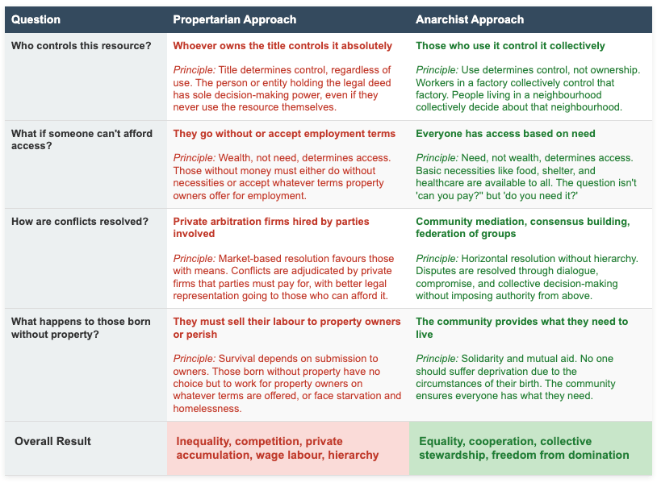
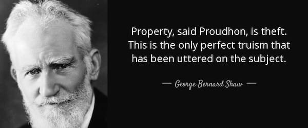
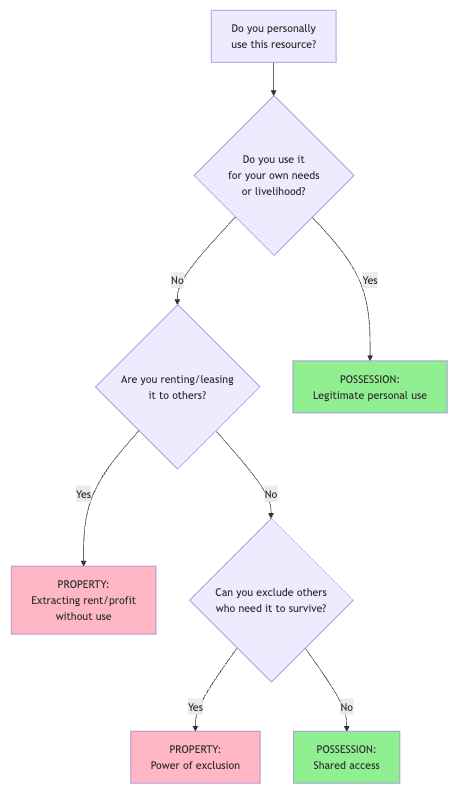
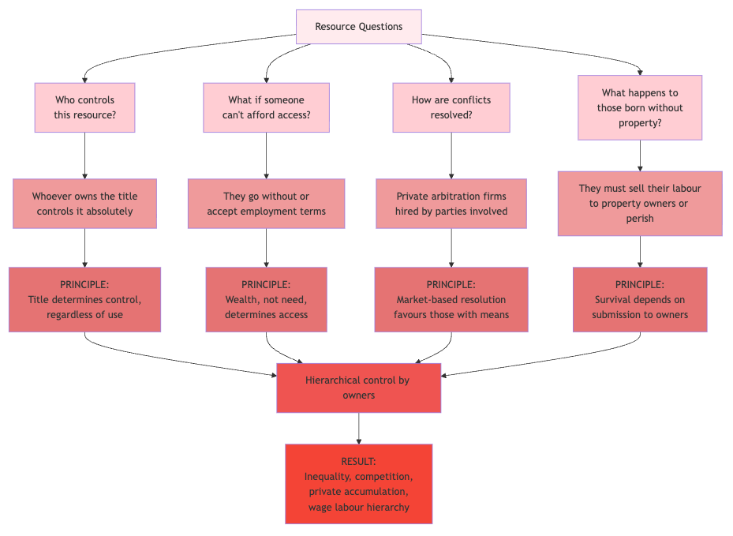
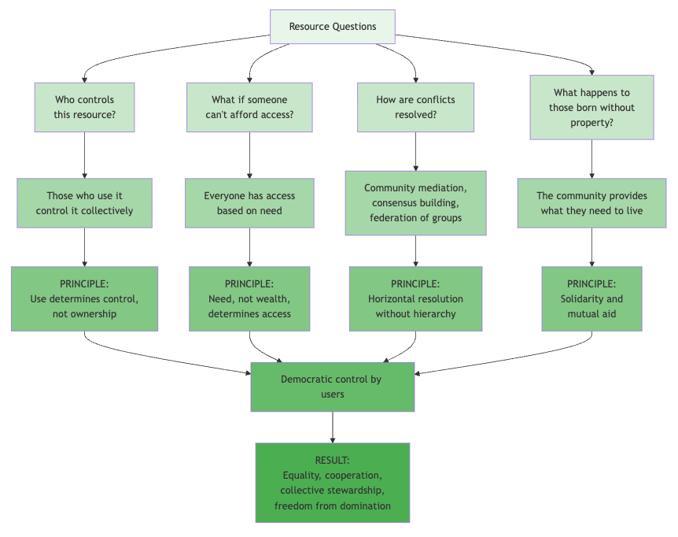
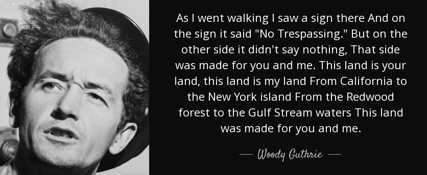

**Is property the solution to scarcity, or its cause?  
Does it protect our freedom, or undermine it?**

Recently [someone responded](http://www.ancapfaq.com/HogRants/PropertyIsLiberty.html) to my article on property, _[Property Rights](https://peacefulrevolutionary.substack.com/p/property-rights-and-wrongs)_ , by arguing that ‘property is liberty’ and that propertarians and anarchists (and other libertarian socialists) simply disagree on which property norms to adopt, which disappointingly misses the central point of my argument entirely. This disagreement isn’t about which flavour of property we prefer, it’s about whether the institution of exclusive private property serves human freedom or undermines it, as I hope to show in this examination of his claims.

## The Scarcity Myth

My position is: That private property emerged not through peaceful improvement of unused land, but through violent theft, including the enclosure of common lands that peasants had freely used for centuries, the colonial conquest of indigenous territories, the transformation of self-sufficient people into wage labourers dependent on property owners for survival. Whereas the anarchist alternative isn’t collective ownership of toothbrushes, but usage rights: you manage what you personally use, and when you stop using it, it returns to the commons rather than becoming a source of profit extracted from others’ labour.

In response to this the propertarian argues that _‘the purpose of property is to solve the scarcity issue peacefully’_ and that without property norms, people would be ‘attacking and killing each other for resources’. However, this gets the causation precisely backwards.

For most of human existence (roughly 300,000 years) people lived without formal property concepts and managed resources through sharing, reciprocity, and collective stewardship. They weren’t constantly murdering each other over resources. In fact, archaeological evidence shows that hunter-gatherer societies cared for their elderly and disabled, maintained low levels of violence compared to later agricultural states, and enjoyed relatively egalitarian social structures. _(These facts are covered in greater detail at the start of my[Property Wrongs](https://peacefulrevolutionary.substack.com/p/property-wrongs) sequel article.)_

What creates scarcity isn’t a lack of property rights, it’s the enclosure of abundance. When water sources that everyone freely used become ‘owned’ and access is restricted, scarcity emerges where none existed before. When land that sustained communities becomes private property and people are excluded from it, scarcity appears as if by magic. Property doesn’t solve scarcity; it manufactures it to create dependency and profit.

The ‘[tragedy of the commons](https://anarwiki.org/wiki/Tragedy_Of_The_Commons)’ that propertarians constantly invoke has been thoroughly debunked by Elinor Ostrom’s research, which won her an Economics Nobel Prize. Commons managed by communities with established norms functioned sustainably for centuries. The tragedy occurs when commons are privatised or when no genuine community exists to steward them, usually because external forces (like states or corporations) have disrupted those communities.

## Everyone Supports Property?

The article contends _‘everyone supports property’ and that opposing it makes one either a ‘caveman primitivist’ or a ‘criminally insane psychopath’_. This kind of juvenile name-calling substitutes for argument, but more importantly, it’s simply false.

Humanity existed without formalised property concepts for the vast majority of its existence. We have existing indigenous peoples who still don’t conceive of land ownership the way capitalist societies do. Are they all ‘criminally insane’? The Haudenosaunee (Iroquois Confederacy), many Aboriginal Australian groups, and various indigenous peoples of the Amazon all maintained complex, functioning societies without treating land or resources as commodities to be owned and traded.

When propertarians say _‘everyone supports property’_ , they really mean ‘everyone within capitalist societies has been forced to accept property norms or starve’. That’s not universal human nature, that’s successful coercion.

## The Homesteading Myth

The propertarian position rests heavily on the ‘homesteading principle’, the notion that previously unowned resources become property when someone ‘mixes their labour’ with them. This principle has several fatal flaws.

First, it assumes resources begin as ‘unowned’ rather than commonly held. This isn’t a factual statement about the world; it’s an ideological starting point that happens to favour those who wish to gain sole ownership. Why should we accept this assumption? Indigenous peoples certainly didn’t. When European colonisers arrived asserting that ‘unimproved’ land was free for the taking, they weren’t discovering an objective truth, they were imposing a property framework through violence.

Second, even accepting the homesteading principle, it’s workers who mix their labour with resources, not owners. The lord didn’t clear the forest, build the irrigation system, or harvest the crops, the peasants did. The factory owner doesn’t assemble products, the workers do. If ‘mixing labour’ creates legitimate ownership, then the workers who do the labouring should own the results, not the people who merely asserted initial ownership and hired others to do the work.

Third, the homesteading principle conveniently ignores that virtually all land was already in use by someone when it was ‘homesteaded’ by European colonisers. Indigenous peoples were using that land, for hunting, foraging, seasonal agriculture, spiritual practices, and countless other purposes. Declaring their land ‘unowned’ because they didn’t fence it, plough it, or defend it with written property deeds was simply a justification for theft.

## The Proudhon Sleight of Hand

The pro-property article makes a remarkable assertion about Proudhon’s famous statement ‘property is theft’. According to this interpretation, Proudhon supported private property (which he called ‘possession’) and only opposed _‘statist decreed pseudo-property’_ (which he simply called ‘property’). 

A lot of what he says in regards to past anarchists is asserting he understands them better than their contemporaries did and even the majority of those who read their works did and still do. This is creative revisionism, but it thoroughly misrepresents Proudhon’s position. 

Yes, Proudhon distinguished between possession and property, but the distinction wasn’t between legitimate private property and state-backed pseudo-property. The distinction was between:

 **Possession** : Personal use of resources by those who work them. The peasant farmer possessing the land they till, the artisan possessing their tools, the family possessing their home.

 **Property** : The right to profit from resources without using them yourself, the right to extract wealth from others’ labour through ownership. The landlord’s right to rent from tenants, the factory owner’s right to profit from workers’ production, the capitalist’s right to returns on investment.

Proudhon was crystal clear about this. He opposed property as ‘the right of increase’ and ‘the power to rob’. He supported possession as use by users. To portray him as an propertarian or anarcho-capitalist before those terms existed is to ignore his own words: ‘Property is the right to use and abuse... It is the power to consume, to waste, to destroy.’

When Proudhon said ‘property is theft’, he meant that asserting sole ownership of resources others need to live, and then charging them for access, is theft, taking from the common wealth of humanity. This isn’t a defence of private property; it’s a root-and-branch critique of it.

## The Violence Property Requires

Perhaps the most revealing statement in the propertarian response is that they oppose ‘violence against people’ more than ‘violence against property’, while simultaneously holding that _‘every person owns himself (self-ownership)’_. This makes the distinction meaningless – violence against ‘property’ becomes violence against people whenever that property is a human being. _I won’t go into the erronesous idea of self-ownership here as I’ve covered this comprehensively before in my article. ‘[Are We Property?](https://peacefulrevolutionary.substack.com/p/are-we-property)’ which completely refutes this idea._

But let’s address the broader point: property requires violence to maintain. Every fence, every ‘No Trespassing’ sign, every eviction notice carries an implicit threat: comply or face force. The homeless person seeking shelter in an empty building, the hungry person taking food from a rubbish bin, the ‘squatter’ occupying abandoned land, all face state violence for violating property norms.

Propertarians like to imagine property as a peaceful institution, contrasting it with the violence of the state. But who enforces property rights? In every existing capitalist society, it’s the police, courts, and prisons, all institutions of the state. Without state violence backing property assertions, those assertions would be meaningless. The wealthy couldn’t maintain their holdings against the propertyless masses without armed enforcers.

The response argues that propertarianism would maintain property rights through _‘emergent arbitration services’_ rather than state force. But this just privatises violence, replacing public police with private security forces. The core dynamic remains: those with property hire armed enforcers to bar those without property from resources they need to survive. Calling this ‘voluntary’ doesn’t change the coercive reality.

## Indigenous Property: A Deep Misunderstanding

The article says propertarians respect indigenous property rights and cites Rothbard condemning the _‘physical dispersion of individual Indians from their homes and from land used.’_ This sounds progressive, but it completely misunderstands how most indigenous societies related to land.

Many indigenous peoples didn’t have individual property rights in the European sense. Land wasn’t owned by individuals or even tribes, it was stewarded collectively, with complex arrangements of reciprocal obligations and seasonal use rights. The Haudenosaunee didn’t ‘own’ their hunting territories the way a landlord owns an apartment building. They had use rights, spiritual connections, and responsibilities toward the land that don’t map onto capitalist property concepts.

When propertarians say they respect indigenous property rights, they’re imposing their property framework onto indigenous relationships with land, then professing to defend those redefined ‘rights’. But this misses entirely what was stolen. What was taken wasn’t property in the capitalist sense, it was the basis for an entirely different way of life, one that didn’t commodify the land or treat it as something to be owned and exploited for profit.

## Statism vs. Capitalism: No Clean Separation

Throughout the response, there’s a recurring pattern: every critique of property is deflected as a critique of statism, not capitalism. The theft of peasant lands? That was statism (kings and lords), not capitalism. The concentration of wealth? That’s statist regulation and cartelisation, not capitalism. Indigenous dispossession? State violence, not capitalist property relations.

This is a clever but dishonest move. It suggests there’s some pure form of capitalism unsullied by state violence, and if we could just implement that ideal arrangement, all would be well. But this ideal capitalism has never existed and cannot exist. Here’s why:

First, capitalism emerged through state violence. The enclosures in Britain that created a landless working class weren’t just the whims of evil kings, they were systematic policy to create wage labourers for emerging industries. Colonial conquest created global markets and cheap resources. Slavery created initial capital accumulation. The state violently suppressed workers organising for better conditions. This isn’t capitalism plus statism, this describes capitalism’s historical development.

Second, capitalism depends on state violence to maintain itself. Without police enforcing property assertions, courts adjudicating contracts, and prisons punishing those who challenge the order, property rights would be meaningless. The propertarian solution (private security forces and competing arbitration firms) doesn’t eliminate this violence, it just privatises it and removes even the thin veneer of democratic accountability.

Third, the distinction between ‘legitimate’ private property and ‘illegitimate’ state-created property is impossible to maintain in practice. Every single plot of land in North America can be traced back to indigenous dispossession. Every major fortune can be traced back to slavery, colonialism, or state-granted monopolies. The propertarian who condemns statist theft while defending current property distributions is trying to have it both ways, and rejecting the process but accepting the results.

## What We Propose

The core difference between anarchism and propertarianism isn’t about which property norms we prefer. It’s about whether we want a society based on exclusion and hierarchy or one based on mutual aid and free association.

Anarchists don’t want to take away your toothbrush, your home, or your tools. We recognise the validity of possession: if you use something, it makes sense for you to control it. What we oppose is the right to profit from ownership without use, the right to bar others from what they need to live, the right to extract wealth from others’ labour.

In an anarchist society, the people who work in a factory would control that factory collectively. The people who live in a neighbourhood would make decisions about that neighbourhood collectively. The land would be stewarded by those who use it, not owned by distant investors. This isn’t about creating a new property framework with different norms, it’s about abolishing the arrangement that turns human relationships into property relationships.

The propertarian vision demands accepting vast inequality as natural and just. It means accepting that those born to wealthy parents deserve advantages they didn’t earn. It entails accepting that those who own can extract wealth from those who work. It necessitates privatising violence to enforce these arrangements.

The anarchist vision calls for accepting that freedom means more than property rights. It means everyone having what they need to live dignified lives. It means rejecting the master-servant relationship inherent in wage labour. It means organising society around mutual aid rather than market exchange. It means replacing property’s exclusion with the commons’ inclusion.

## Conclusion

The propertarian response avoids the central argument of my original articles: that property doesn’t solve the problem of scarcity, it manufactures it. Throughout my pieces, I detailed how enclosing water sources that everyone freely used, fencing off land that sustained communities, and restricting people from resources they need creates artificial scarcity where natural abundance existed. The response simply asserts that ‘property solves scarcity peacefully’ without engaging with any of these historical examples. When you can’t refute an argument, ignoring it is the next best strategy.

This evasion extends throughout the piece. Of the nine systematic harms of property I outlined – inequality, poverty, corruption, injustice, ecological destruction, violence, hierarchy, and imprisonment – the response addressed perhaps two, briefly, whilst deflecting the rest as somehow being about statism rather than capitalism. The historical reality of enclosures, the creation of wage labour through dispossession, the corporate ownership of people, the intergenerational perpetuation of unearned privilege were all ignored or dismissed.

Property doesn’t prevent violence, it requires violence to maintain. It doesn’t emerge naturally from human interactions, it was imposed through conquest, enclosure, and state force. The propertarian who professes to oppose statism whilst defending current property distributions is trying to keep the spoils of theft whilst denouncing the theft itself. They’re trying to maintain hierarchy whilst calling it freedom. They’re trying to legitimise inequality whilst asserting everyone benefits.

Property isn’t liberty. Property is what happens when liberty is enclosed, commodified, and sold back to us at a price we can’t afford. And when you can’t defend that arrangement with honest argument, you’re left with what we see here: redefinition of terms, selective history, and the studied avoidance of inconvenient truths.

Subscribe

[Share](https://peacefulrevolutionary.substack.com/p/property-problems?utm_source=substack&utm_medium=email&utm_content=share&action=share)

