## The Test

In J.R.R. Tolkien’s _Lord of the Rings_ , Sauron forged a Ring of Power: ‘One Ring to rule them all, and in the darkness bind them.’ It offered absolute control over every living thing.

But here’s what makes it dangerous: The Ring doesn’t corrupt you by making you evil. It corrupts you by offering you the power to do good. To fix what’s broken. To save your people. To make the world right.

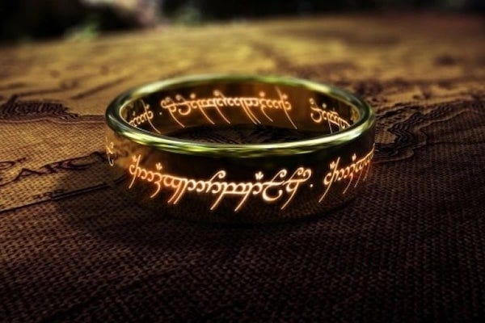

How many times have you thought: _‘If only I had power, I could fix this’_?

That’s the Ring’s whisper. And in Tolkien’s story, it destroys everyone - the wise, the noble, the heroic - because no one can be trusted with that kind of power over others.

This test presents twelve scenarios from the story. Your choices will reveal:

  * How vulnerable you are to corruption by power

  * What form that corruption would take

  * Which character from the story you most resemble

You’ll be measured across three dimensions:

  *  **Domination:** How much you seek power over others _(lower is better)_

  *  **Discipline:** Your self-control and ability to resist _(higher is better)_

  *  **Service:** Whether you help others or serve yourself _(higher is better)_

 **Keep track of your scores as you go.** Start with:  
**Domination: 12 | Discipline: 0 | Service: 0**

At the end, you’ll discover which character you are - from Tom Bombadil (immune because he desires nothing) to Gollum (consumed entirely by hunger for power).

Ready? Remember: there’s no ‘passing.’ Even the heroes failed. Frodo claimed the Ring at Mount Doom. Boromir tried to take it by force. Gandalf refused to even touch it because he knew he couldn’t resist.

The point isn’t to prove you’re incorruptible - it’s to understand how you’d be corrupted, and why that means such power shouldn’t exist.

* * *

## Scenario 1: The Birthday Gift

You’ve had the Ring for many years. It’s kept you young, healthy, comfortable. A wizard suggests you should give it to a young relative and leave it behind forever. ‘It’s mine! I found it!’ something inside you protests.

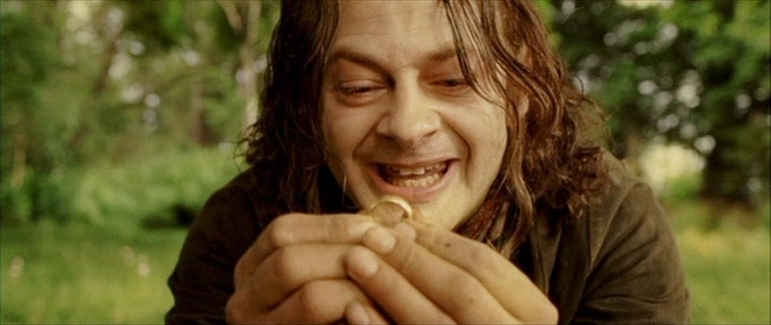

 **What do you do?**

 **A)** Give it up immediately. Of course! What was I thinking? ...though you feel strangely diminished after  
→ _Domination: +1 | Discipline: +2 | Service: +1_

 **B)** Give it up but it’s agony. ‘Mine’ you whisper. Still, you do it. And then you leave, quickly, before you can take it back.  
→ _Domination: +2 | Discipline: +2 | Service: +2_

 **C)** Refuse. It’s yours by right! You earned it through trials. Why should you give up what’s yours?  
→ _Domination: +3 | Discipline: -2_

 **D)** Give it up easily. It’s a pretty trinket, but you have other treasures. Your riddles, your memories, your songs - those matter more.  
→ _Domination: -1 | Discipline: +2 | Service: +1_

* * *

## Scenario 2: The Council of Elrond

Representatives from all Free Peoples debate what to do with the Ring. Someone must take it to Mount Doom. Gandalf and Elrond both look troubled - they speak of how the Ring corrupts any who would wield it.

 **What do you do?**

 **A)** Volunteer immediately. You’re strong enough for this. Someone must act.  
→ _Domination: +2 | Service: +1_

 **B)** Stay silent. This is too great a burden - let wiser heads decide.  
→ _Domination: -1 | Discipline: +1 | Service: -1_

 **C)** Speak up only if no one else will. You’d rather not, but you can’t let this fall to someone unprepared.  
→ _Domination: +1 | Service: +2_

 **D)** Suggest someone else who seems capable. You’re not the right choice, but you’ll support whoever goes.  
→ _Domination: -1 | Discipline: +2 | Service: +1_

* * *

## Scenario 3: The Last Homely House

Elrond offers to keep the Ring here in Rivendell, guarded by the wise and powerful. It would be safe. You could go home, return to your quiet life. Someone else - someone better - could deal with this later.

 **What do you do?**

 **A)** Accept gratefully. This is too big for you. Let the wise handle it.  
→ _Domination: -1 | Discipline: +1_

 **B)** Accept, but feel like you’re abandoning something important. Still, what could you do?  
→ _Domination: +1_

 **C)** Refuse. You don’t know why, but this is yours to do. You feel it.  
→ _Domination: +1 | Discipline: +1 | Service: +2_

 **D)** Want desperately to stay, but know you can’t. Others would be corrupted. You’re already... affected. Best you carry it.  
→ _Domination: +1 | Discipline: +2 | Service: +3_

* * *

## Scenario 4: The Gift of Galadriel

In Lothlórien, the Lady Galadriel shows you a vision of your homeland destroyed, your loved ones suffering. She offers you a means to prevent this - but it would require using the Ring’s power ‘just once’ to command an army to defend them.

 **What do you do?**

 **A)** Refuse absolutely. The Ring cannot be used, no matter what. Trust others to defend your home.  
→ _Domination: -1 | Discipline: +3 | Service: +1_

 **B)** Consider it seriously. Aren’t your people worth this risk? Maybe you could control it just once...  
→ _Domination: +3 | Discipline: -2 | Service: +2_

 **C)** Feel torn but ultimately refuse. Send word home urging them to flee or hide instead.  
→ _Domination: +1 | Discipline: +2 | Service: +2_

 **D)** Refuse, but the vision haunts you. You think about it often - what if you _could_ have saved them?  
→ _Domination: +2 | Discipline: +1 | Service: +2_

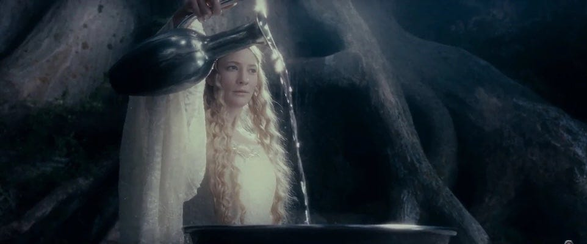

* * *

## Scenario 5: The Sword Reforged

You are the heir to a great kingdom, but it has been in ruins for generations. A powerful artifact (the Ring) could restore it immediately - make you the glorious king your people need. Without it, restoration will take decades of hard work with no guarantee of success.

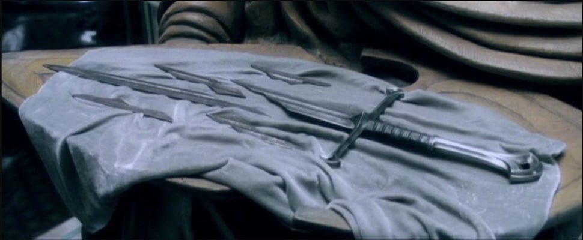

 **What do you do?**

 **A)** Use the Ring. Your people have suffered long enough. You were born for this - destiny itself calls you.  
→ _Domination: +3 | Discipline: -2 | Service: +1_

 **B)** Refuse it entirely. You will not be the king that your ancestor was. Earn the throne through service, or not at all.  
→ _Domination: -1 | Discipline: +3 | Service: +2_

 **C)** Take it ‘temporarily’ - just to stabilise things, then you’ll give it up. You can control it that long.  
→ _Domination: +2 | Discipline: -1 | Service: +1_

 **D)** Give up your claim entirely. Let someone else rule - someone not burdened by your family’s history.  
→ _Domination: -2 | Discipline: +2_

* * *

## Scenario 6: The White Hand

You are among the wise, sent to guide and counsel, never to dominate. But you’ve studied the enemy for so long. You understand how power works. You could defeat him if only these foolish people would listen to you. With the Ring, you could MAKE them listen...

 **What do you do?**

 **A)** Take it. You would be a just ruler. Knowledge and power should go together. You’d use it wisely where others failed.  
→ _Domination: +4 | Discipline: -3_

 **B)** Refuse it, but resent the restriction. These ‘rules’ about not dominating - they’re why evil wins. You could do so much good...  
→ _Domination: +3 | Discipline: +1 | Service: +1_

 **C)** Refuse absolutely. The moment you think ‘I would use it well’ is the moment you’re already corrupted.  
→ _Domination: -1 | Discipline: +3 | Service: +1_

 **D)** Be tempted, deeply. Feel how it would solve everything. But refuse because you know - KNOW - it would destroy you.  
→ _Domination: +1 | Discipline: +3 | Service: +1_

* * *

## Scenario 7: The Palantír

You’ve discovered a seeing-stone that shows you the enemy’s overwhelming forces. Your city will fall. Your people will die. The future is hopeless unless... unless you had a weapon powerful enough to stop them.

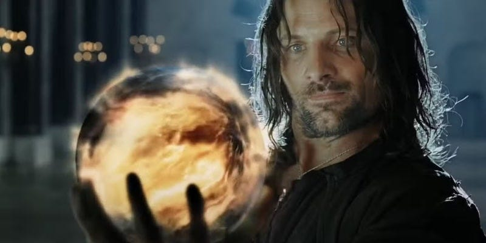

 **What do you do?**

 **A)** This confirms it - you MUST use the Ring. Desperate times call for desperate measures. Inaction is surrender.  
→ _Domination: +3 | Discipline: -2 | Service: +2_

 **B)** Fight anyway. Even if the cause seems lost, die with honour rather than become what you fight against.  
→ _Domination: -1 | Discipline: +3 | Service: +2_

 **C)** Order a last stand while you escape with the Ring ‘to preserve hope.’ Someone must survive.  
→ _Domination: +2 | Discipline: -2 | Service: -1_

 **D)** Give in to despair. It’s over. Better a quick end than prolonged suffering.  
→ _Domination: +1 | Discipline: -3 | Service: -2_

 **E)** Refuse the vision’s certainty. The future isn’t written. Trust in the valour of ordinary people to surprise you.  
→ _Domination: -1 | Discipline: +2 | Service: +2_

 **F)** The vision shows your enemies. Good. With the Ring, you’d make them suffer for opposing you. They deserve what’s coming.  
→ _Domination: +5 | Discipline: -3 | Service: -2_

* * *

## Scenario 8: My Precious

You killed your best friend for the Ring. Years later, you have a chance to help the current bearer destroy it. But the Ring whispers: they’ll take it, they’ll keep your precious, you could take it back, it should be yours...

 **What do you do?**

 **A)** Lead them to the place of destruction, but plan to take it at the last moment. It’s YOURS. You deserve it.  
→ _Domination: +3 | Discipline: -2 | Service: -1_

 **B)** Try to take it now. Why wait? Why help them at all? Your precious...  
→ _Domination: +4 | Discipline: -3 | Service: -2_

 **C)** Lead them faithfully. You’ve seen what the Ring does. You want it destroyed... even though it hurts to think it.  
→ _Domination: -1 | Discipline: +3 | Service: +3_

 **D)** Be torn every single moment. Sometimes helping, sometimes betraying, never sure which voice in your head is really you anymore.  
→ _Domination: +2 | Service: +1_

* * *

## Scenario 9: Shelob’s Lair

Your companion carrying the Ring has fallen, apparently dead. The Ring lies there on the ground. You’re alone. You could:

 **What do you do?**

 **A)** Take the Ring to complete the quest yourself. They would want you to finish it.  
→ _Domination: +1 | Discipline: +1 | Service: +1_

 **B)** Take the Ring for safekeeping, but feel its weight. Perhaps... perhaps with it you could do so much good? You deserve recognition...  
→ _Domination: +4 | Discipline: -2_

 **C)** Check if they’re truly dead first. The Ring can wait - your friend matters more.  
→ _Domination: -2 | Discipline: +2 | Service: +3_

 **D)** Leave it. Flee. This is too much - you’re not strong enough. Maybe someone else will find it.  
→ _Domination: -1 | Discipline: -2 | Service: -2_

* * *

## Scenario 10: The Stairs of Cirith Ungol

You discover your companion is alive but enslaved to the Ring’s will, suspicious of you, accusing you of wanting to steal it. Part of you thinks: ‘I _could_ take it and do better. I’ve proven myself more resistant.’

 **What do you do?**

 **A)** Take the Ring from them by force ‘for their own good.’ You’ll finish this properly.  
→ _Domination: +3 | Discipline: -2 | Service: +1_

 **B)** Stay and serve them anyway, despite the accusations. Help them complete the quest even if they hate you for it.  
→ _Domination: -2 | Discipline: +3 | Service: +4_

 **C)** Leave them. You’ve done enough. This isn’t your burden anymore.  
→ _Domination: -2 | Discipline: -2 | Service: -2_

 **D)** Defend yourself against the accusations and demand recognition for your sacrifices.  
→ _Domination: +2 | Discipline: -1_

* * *

## Scenario 11: Mount Doom

You’ve reached the Cracks of Doom. Your companion refuses to destroy the Ring - they claim it. You could:

 **What do you do?**

 **A)** Fight them for it. Take it and destroy it yourself before they escape.  
→ _Domination: +2 | Service: +1_

 **B)** Try to talk them down, appeal to who they were. Don’t touch the Ring yourself.  
→ _Domination: -2 | Discipline: +2 | Service: +2_

 **C)** Realise you can’t destroy it either. Back away. You’d be corrupted too.  
→ _Discipline: +3_

 **D)** Just push them in, Ring and all. Harsh, but effective.  
→ _Domination: +1 | Discipline: +1 | Service: +1_

* * *

## Scenario 12: The Grey Havens

The Ring is destroyed, but you bore it too long. The wound will never fully heal. Your friends want you to stay, but you’re offered passage to a place of peace beyond this world. Going means leaving everything you love behind.

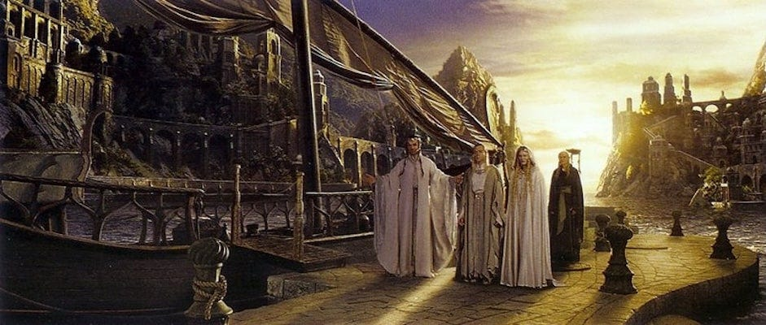

 **What do you do?**

 **A)** Stay. Your place is here with your people, even diminished. You’ll endure the pain for their sake.  
→ _Discipline: +1 | Service: +2_

 **B)** Go, and feel guilty about it. You’ve earned rest, but it feels like abandoning them.  
→ _Discipline: +1 | Service: +1_

 **C)** Go gratefully. You gave everything. Sometimes accepting healing isn’t selfish - it’s necessary.  
→ _Discipline: +2 | Service: +1_

 **D)** Insist one of your companions come too - they suffered as much as you. You won’t accept healing they’re denied.  
→ _Discipline: +1 | Service: +3_

* * *

## Finding Your Result

Now add up your three totals and use your **Domination** score to find which section to read:

  *  **0-10** → You are a **Resister** _(continue below)_

  *  **11-30** → You are **Tempted But Restrained** _(continue below)_

  *  **31-40** → You have **Justified Corruption** _(continue below)_

  *  **41 or higher** → You are **Fully Corrupted** _(continue below)_

[change to go to section A-D]

* * *

## A. The Resisters (Domination 0-10)

You consistently refused power, even when it seemed necessary. You understand intuitively that the power to command others is itself problematic.

 **Your character depends on your other scores:**

###  If Discipline is 26 or higher: You are **Tom Bombadil**

You are genuinely immune to the Ring’s corruption - not because you’re strong enough to resist it, but because you have no desire for what it offers. You don’t want to control, order, fix, save, or rule. The Ring offers dominion over others, and you simply... don’t want that.

The paradox: only those who don’t want power are safe from it. But you couldn’t be trusted with the Ring either - not because you’d abuse it, but because you wouldn’t see its destruction as important enough. You’d likely lose it through sheer disinterest.

### Otherwise: You are **Faramir**

You show pure wisdom in refusal. When the Ring was in your power, you wouldn’t even touch it. You understand that some tools are inherently corrupting, and proximity to power is itself dangerous.

Your wisdom is real, but it poses a question: If all the wise refuse power, does it inevitably fall to the unwise? You rightly refuse domination but risk avoiding responsibility. The challenge is building systems where necessary action doesn’t require anyone to hold corruptible authority.

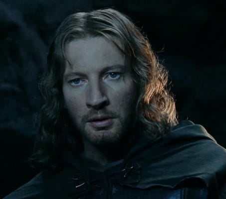

* * *

## B. Tempted But Restrained (Domination 11-30)

You felt the pull of using power ‘for good’ but recognised the danger. You have moderate power-hunger - you see problems and want to fix them - but enough self-awareness to recognise the danger.

 **Your character depends on your other scores:**

###  If Service is 26 or higher: You are **Sam Gamgee**

You came closer than almost anyone to holding the Ring and giving it back. You don’t want power for yourself - you want it to _help people_. This is the Ring’s subtlest trap.

For that brief time when you held it, the Ring showed you visions: you could make the world beautiful, create gardens everywhere, make everything _right_. But you’d become a benevolent tyrant, someone who cannot bear to see a single weed, who must prune and shape and control everything ‘for their own good.’

You’re proof that virtue isn’t enough. Love doesn’t make you safe - it gives corruption its foothold. If even you would eventually force your kindness on others, then no one should hold such power.

### If Discipline is 25+ AND Domination is 14 or lower: You are **Aragorn**

You are exactly the kind of person most people think _should_ wield power - noble, selfless, proven, wise. And you said NO to the Ring absolutely.

You understood that the desire to use power ‘well’ is itself the corruption. You know your ancestor Isildur’s story - how he thought himself strong enough, thought he’d earned the right to keep the Ring. You recognised that legitimacy, nobility, and good intentions are not protections against corruption - they are vulnerabilities it exploits.

Your refusal teaches that true leadership is knowing when NOT to take power, especially when you’re certain you’d use it well. That certainty is the first stage of corruption.

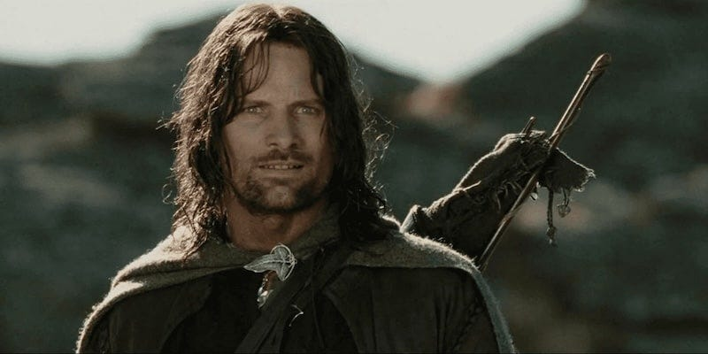

### If Discipline is 20 or higher: You are **Gandalf or Galadriel**

You are wise enough to refuse the Ring even when offered directly. You see exactly how you’d be corrupted: ‘I would use this Ring from a desire to do good. But through me, it would wield a power too great and terrible to imagine.’

Your wisdom itself makes you dangerous. You’d be able to justify every escalation. You’d create a world of peace and order where no one could choose anything you deemed wrong. The most enlightened tyranny is still tyranny.

You teach that self-awareness of the danger is not protection enough - the only safety is absolute refusal. The wise person knows they cannot be trusted.

### If Discipline is 15 or lower: You are **Bilbo Baggins**

You carried the Ring for decades and gave it up. That’s remarkable. But look at what it cost you - the agony of letting go, the way you called it ‘precious,’ the way it had slowly wrapped itself around your heart. You barely escaped.

You didn’t seek power over others - you just wanted to keep what was yours. This is the slow corruption - not dramatic tyranny but quiet, creeping attachment. Power doesn’t always announce itself as power. Sometimes it comes as comfort, something ‘just for you’ that slowly colonises your soul.

You escaped because you had help and were confronted directly - but given more time, you’d have become another Gollum. Time doesn’t make power safer - it makes corruption deeper.

### Otherwise: You are **Frodo Baggins**

You are perhaps the most important result - because you did _everything right_ and still failed at the end. You volunteered when no one else could. You bore the burden for months. You resisted torture, corruption, despair. You reached Mount Doom. And then you claimed it.

You thought endurance was enough. You thought if you just held on, stayed true to yourself, you could carry it to the end. But the Ring isn’t overcome through heroic willpower - it’s patient. Every moment you carried it, it wore you down.

You prove that there is no amount of virtue, courage, or sacrifice that makes someone safe from corruption by absolute power. If _you_ \- who gave everything - still claimed it at the end, then no one can bear such power safely.

The Quest only succeeded because you failed. Your failure is not your shame - it’s the proof that such power should not exist at all.

* * *

## C. Justified Corruption (Domination 31-40)

You believed you could use power righteously to save what you love. You consistently chose options that justified taking power because your cause was just or your people needed you.

 **Your character depends on your other scores:**

###  If Domination 34 or lower AND Service 14+: You are **Boromir**

Your heart is genuinely good. You love your people, your city, your father. You’re brave - you’d die for Gondor without hesitation. And that’s exactly why you’re dangerous with the Ring.

Desperation is your vulnerability. Your people are dying. The enemy is at the gates. ‘Why not use this Ring?’ you ask. You thought that because your cause was just, using the Ring would be justified. You failed to understand that the Ring corrupts the intention itself.

You represent the eternal temptation: ‘We need power to fight power. Just this once, just this emergency, then we’ll give it up.’ But emergencies never end. This is how democracies become tyrannies - through crisis.

The people most dangerous to liberty are often those who love their people most. Because they’ll do _anything_ to protect them, including destroying what made them worth protecting.

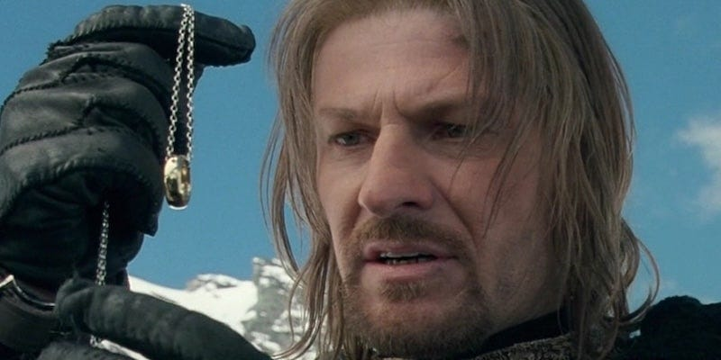

### If Service is 11 or higher: You are **Isildur**

You cut the Ring from Sauron’s hand. You won the war. You had the power to end it forever - and you chose not to. ‘It is precious to me, though I buy it with great pain,’ you said. You thought you’d earned it.

You thought suffering entitled you to power. You thought past heroism guaranteed future wisdom. You confused reward with wisdom, thinking merit in warfare meant you could be trusted with ultimate power.

You’re the revolutionary who becomes the tyrant. You overthrew Sauron and then kept his Ring. The Ring destroyed you not through evil but through believing you were owed something. No amount of sacrifice, no purity of lineage, no proven courage entitles anyone to hold power over others.

### Otherwise: You are **Denethor**

You are what Boromir would have become given time and despair. You loved Gondor - but your love became ownership. ‘Mine to command,’ you’d say of your people. You couldn’t imagine them surviving without you, so you chose to burn them all rather than see ‘your’ city fall to another.

Despair masquerading as realism is your vulnerability. You saw the enemy’s strength and decided defeat was certain. In that certainty, you gave yourself permission to do anything. You confused your vision with the only possible reality.

You represent what happens when leaders identify so completely with their nation that they see themselves as its only salvation. Possessive love says ‘if I can’t have you, no one can.’ With the Ring, you’d have ‘saved’ Gondor by enslaving it.

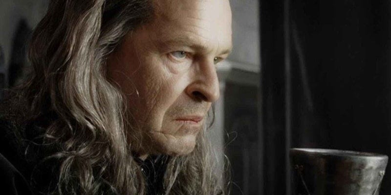

* * *

## D. Fully Corrupted (Domination 41+)

You reached for power immediately and would not let go. You chose power almost every time it was offered, with little hesitation or self-doubt.

 **Your character depends on your other scores:**

###  If Domination 46+ AND Service 4 or lower: You are **Sauron**

You didn’t just fail to resist the Ring - you ARE the Ring. You don’t want it to ‘help people’ or ‘save your nation.’ You want it because you believe you have the right to rule, and others have the duty to obey.

You see other people not as beings with inherent worth, but as resources to be used or obstacles to be removed. You embody the belief that hierarchy is natural, that people need controlling, that strength proves rightness.

Most of the Ring’s victims are tragic - good people corrupted by good intentions. You’re not tragic. You’re what happens when someone seeks domination consciously and deliberately. You would look at what you’d become and be proud.

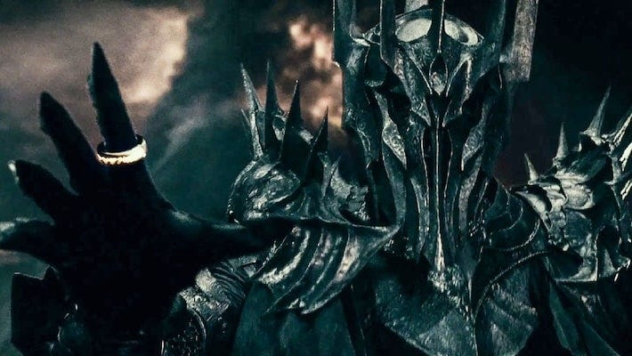

### If Service is 5 or lower: You are **Gollum / Sméagol**

You are the end state of corruption - what everyone becomes if they hold power long enough. You killed your best friend for the Ring on sight. You held it for centuries, and it hollowed you out until there was nothing left but hunger.

You represent addiction in its purest form - the thing you need more than air, more than food, more than life itself. You’re not divided or conflicted. You’re what’s left when power strips away everything else. You forgot your real name. You forgot sunlight. You forgot joy. Only the Ring remained.

You are the cautionary tale that haunts every other result. You prove that everyone would become this, given enough time and exposure. You’re not a person anymore - you’re a process. You’re what happens when power runs its course.

You destroyed the Ring by accident, driven by greed - you couldn’t let go even to save your life. This is the endpoint of every hierarchy: it becomes so fixated on holding power that it destroys itself rather than release it.

### Otherwise: You are **Saruman**

You are the final warning about intellectual pride. You were sent to counsel, never to dominate. You were the wisest, the most learned, the most powerful. And you fell not by being tempted with the Ring but by becoming convinced that you could _outthink_ Sauron, use power better than anyone else ever had.

You believed that intelligence protects against corruption. You thought that because you could see how the Ring corrupted others, you’d be immune. You didn’t understand that self-awareness of corruption can itself become a tool of corruption.

You represent the technocrat who believes smart people should rule. You’d looked at the chaos of democracy, the messiness of freedom, and decided enlightened dictatorship was simply more logical.

Intelligence doesn’t prevent evil - it just makes evil more elaborate. If even one of the wisest beings in Middle-earth can fall to the lust for control, then no one can be trusted with absolute power over others.

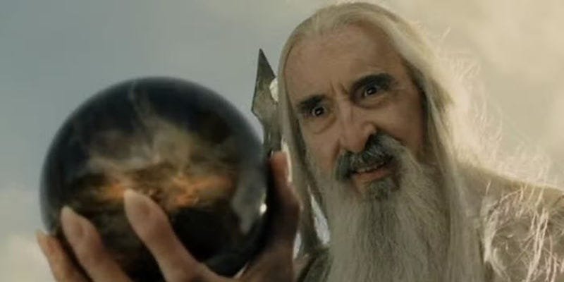

* * *

## What This Reveals

Your result shows how power would corrupt you - and proves why Tolkien believed no one should hold such power.

The Ring cannot be wielded for good because the power to dominate others is itself the corruption. Not the abuse of it - the power itself. It doesn’t matter if you’re wise, kind, legitimate, desperate, or heroic. It corrodes everyone.

In Tolkien’s story, the only solution is to destroy the Ring entirely - to make it so that kind of power doesn’t exist for anyone to wield.

 **This isn’t just a fantasy story.** It’s about real concentrations of power, real hierarchies, and why they inevitably corrupt. The Ring is every system where some people have absolute authority over others.

* * *

## Want to Go Deeper?

 _This quiz reveals which character you are. But there’s a much deeper question: What was Tolkien actually teaching us about power, corruption, and how we should organise society?_

 **Read** _ **Resist The Ring: Part 2**_ next week for:

  * The full political philosophy behind each scenario

  * What each character teaches about different forms of corruption

  * How the Fellowship represents an alternative to the Ring

  * What ‘destroying the Ring’ means for real-world power structures

Part 2 explores the twelve lessons about power embedded in this quiz - and why Tolkien wrote that ‘the most improper job of any man, even saints, is bossing other men.’

Subscribe

[Share](https://peacefulrevolutionary.substack.com/p/can-you-resist-the-ring?utm_source=substack&utm_medium=email&utm_content=share&action=share)

* * *

 _ **Note:** The purpose of this article is not to praise Tolkien, but to explore the relevance of his symbolism around rings of power. Although he despised Nazi ideology, condemned antisemitism, and denounced ‘racialist’ theories, some critics argue his work reflects Eurocentric perspectives and what they consider ‘[outmoded attitudes to race](https://en.wikipedia.org/wiki/Tolkien_and_race)’. Similarly, [scholarly opinion on gender](https://en.wikipedia.org/wiki/Women_in_The_Lord_of_the_Rings) in his work is divided: some academics view him as a patriarchy-favouring product of his time or as sexist, while others point to characters like the powerful and independent Éowyn as approaching feminist ideals._
