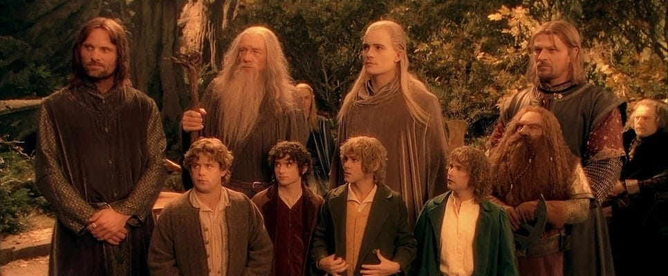
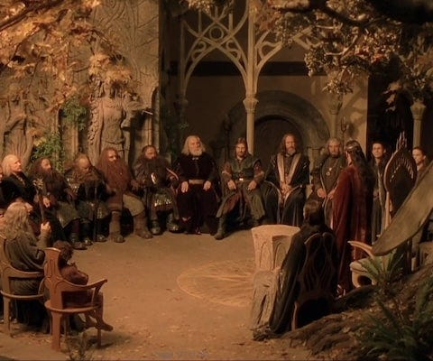
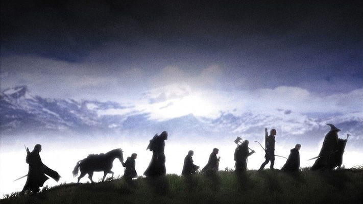

## The Political Philosophy Behind The Quiz

 _This is the companion piece to the ‘[Resist The Ring](https://open.substack.com/pub/peacefulrevolutionary/p/can-you-resist-the-ring)’ character quiz. If you haven’t taken the quiz yet, you may want to do that first - it reveals which character you’d be when faced with the One Ring, and why that matters. [Here is an interactive version](https://4wkhggkk.play.borogove.io)._

 _This article explores the deeper meaning: what Tolkien was teaching about power, corruption, and hierarchy through his story - and why his work is fundamentally anarchist._

* * *

## The Ring as Political Symbol

In _The Lord of the Rings_ , the One Ring isn’t just a magical artefact - it’s a symbol of hierarchical power itself. The power to command, to dominate, to impose your will regardless of consent.

When Sauron forged it in Mount Doom, he had a vision: absolute dominion over all living things. Not just his enemies - everyone. He would order the world precisely as he saw fit, eliminate chaos and dissent and freedom itself. ‘One Ring to rule them all, and in the darkness bind them.’

He believed this was necessary. The world was broken, fractious, full of conflicting wills. His solution? One absolute power to impose perfect order. He told himself it was for the greater good. That lesser beings needed guidance. That freedom was simply chaos by another name.

He was utterly sincere. And utterly wrong.

### The Seduction We Are All Tempted By

This is the fundamental insight of Tolkien’s Ring: it doesn’t corrupt you by making you evil. It corrupts you by convincing you that YOUR vision of good justifies absolute control.

How many times have you thought it?

>  _‘If I ruled the world, I’d end poverty.’_  
>  _‘If only I had power, I’d stop the wars.’_  
>  _‘If people would just listen to me, I could fix this.’_  
>  _‘The problem is that the wrong people are in charge. If it were me...’_

We all do this. We see suffering and injustice and broken systems, and we think: ‘I could do better. I would never abuse power like _they_ do. I would use it wisely, temporarily, only for good.’

This is the Ring’s whisper. This is how it gets everyone.

The genius of Tolkien’s story is showing that this exact reasoning - ‘I would use it for good’ - IS the corruption. Not the abuse that might come later. The very belief that you could wield absolute power righteously is itself the first stage of becoming a tyrant.

Every character who thinks they could handle it is wrong. The wise (Gandalf, Galadriel) see this clearly and refuse absolutely. The noble (Aragorn) understand their legitimacy makes them MORE dangerous, not less. The heroic (Frodo) carry it to Mount Doom and still claim it at the end.

The Ring teaches: No one can be trusted with this power. Not the wise, not the noble, not the heroic. The only solution is to destroy the Ring entirely.

* * *

## What the Ring Represents

The Ring is not just a fantasy artefact - it’s a symbol of hierarchical power over other people. The power to command, to dominate, to impose your will regardless of consent. The power to make people do what you want ‘for their own good.’ The power to reshape the world according to your vision. It’s the power of:

  * The dictator who promises order and prosperity if only you’ll obey

  * The revolutionary who becomes the tyrant, convinced their cause justifies any means

  * The expert who knows what’s best for you better than you do

  * The parent-state that controls every aspect of your life ‘for your protection’

  * The benevolent ruler who makes the trains run on time but crushes every dissenting voice

It’s every concentration of power that lets one person (or group) impose their will on others without their genuine consent. And here’s the terrible seduction: The Ring offers you the power to fix everything you see as broken in the world.

* * *

## Why The Ring Cannot Be Used for Good

This is the central premise of both Tolkien’s story and anarchist political philosophy: absolute power cannot be wielded for good, because the power itself is the corruption. Every character who thinks they could wield the Ring ‘properly’ is wrong:

  *  **Boromir** wants to use it to save Gondor → would become a tyrant

  *  **Gandalf** would use it from desire to do good → would become ‘beautiful and terrible’

  *  **Galadriel** would be a queen, terrible as the dawn → enlightened dictatorship is still dictatorship

  *  **Denethor** would use any weapon to ‘save’ his people → becomes the thing he fears

  *  **Saruman** thinks his wisdom entitles him to rule → technocratic nightmare

Even **Frodo** , the most virtuous bearer, claims it at the end. After months of heroic resistance, at the very moment of victory, he cannot destroy it. He says ‘It is mine!’ This is Tolkien saying: No one can be trusted with this power. Not the wise, not the noble, not the heroic.

The only solution is to destroy the Ring entirely - to make it so that kind of power doesn’t exist for anyone to wield.

* * *

## Twelve Lessons About Power

 _These are the political lessons embedded in each scenario of the quiz - the questions about authority, corruption, and domination that each choice reveals._

### 1\. The Possession Test

Could you hold ultimate power - the power to make everyone do what you think is right - and choose to destroy it instead of using it? Could you see suffering and have the power to end it by force, and choose not to? Could you watch people make ‘wrong’ choices and have the power to control them ‘for their own good,’ and refuse?

Everyone thinks they could. The story of the Ring proves that almost no one can. The question isn’t ‘Are you a good person?’ Most people who seek power are good people with good intentions. The question is whether you recognise possession itself as a form of corruption.

### 2\. The Burden or the Opportunity

Do you see taking responsibility for the Ring as a burden to be carried, or an opportunity for heroism? Do you volunteer because you’re strong enough, or because no one else should have to carry it? That distinction matters - because one leads to service, and the other to domination.

### 3\. The Delegation Question

Are you avoiding corruption by staying away from power - or avoiding responsibility by letting others bear the burden? There’s a difference between wise refusal of corrupting authority and moral avoidance of necessary action.

### 4\. The Protection Trap

This tests your most vulnerable point: whether you’d use power to protect those you love. This is how every real-world tyranny begins - through crisis and the promise of safety. The Ring teaches us that this kind of power corrupts everyone, regardless of their intentions, wisdom, or virtue. The people most dangerous to liberty are often those who love most fiercely. Because they’ll do anything to protect what they love - including destroying it.

### 5\. The Legitimacy Danger

The Ring’s most seductive whisper: ‘You’re the rightful heir. You were born for this. Your people need you NOW. Using it isn’t corruption - it’s destiny.’ This is exactly why even the rightful king refused to even touch the Ring. Legitimacy makes you more dangerous with power, not less. Legitimate authority is the most dangerous kind - it’s the kind people willingly submit to, the kind that corrupts whilst telling itself it’s serving.

### 6\. The Expertise Corruption

The moment you think ‘I should make them listen,’ you’ve crossed from counsel to control. From service to domination. From guide to ruler. This is the technocrat’s temptation. The expert’s corruption. The philosopher-king’s tyranny. It’s the most dangerous kind because it seems so justified. Even the wise cannot be trusted with power over others. Especially the wise.

### 7\. The Crisis Justification

As Tolkien said, ‘The most improper job of any man, even saints, is bossing other men.’ Crisis doesn’t change that. The power to control others corrupts in three ways:

  * It corrupts the boss - you start believing you know better, that their consent is unnecessary

  * It infantilises the bossed - you lose agency, responsibility, dignity when someone always decides for you

  * It creates unjust relationships - hierarchy means some people’s needs matter more than others

Crisis doesn’t justify tyranny. Despair doesn’t excuse domination. Certainty doesn’t entitle you to force your vision on others.

### 8\. The Certainty Trap

The people best suited to guide others are precisely those who DON’T WANT the job of ‘bossing other men.’ They see the weight of responsibility. The inevitability of failure. The corruption that comes with power. The presumption of thinking you know what’s best for others. And they refuse.

The moment someone WANTS to boss others, they’ve already disqualified themselves. The moment someone is CERTAIN they could handle power well, they’ve already been corrupted by it. Those who want power most are precisely those who should never have it.

### 9\. The Helper’s Delusion

‘Not one in a million is fit for it. And least of all those who seek the opportunity.’ The characters safest from the Ring don’t want power, know they can’t be trusted with it, or serve others without seeking control. The most dangerous seek power, think they deserve it, or believe their cause justifies it.

This is the anarchist critique of all authority: The people who want power are precisely those who shouldn’t have it. And the people who might use it responsibly recognise they can’t be trusted with it - so they refuse it entirely.

### 10\. The Benevolent Tyranny

‘I know better. They can’t handle it. I’ll take control for their own good.’ This is how every benevolent tyranny begins. The power itself is the corruption. Not its abuse. Not its misuse. The holding of it.

It doesn’t matter how wise you are, how noble your cause, how much you’ve sacrificed, how much you’ve proven yourself - that proof itself becomes justification for taking power. The moment you think ‘I could do better,’ you’ve already fallen to what destroyed them.

### 11\. The Hero’s Failure

Frodo reached Mount Doom. He carried the Ring for months, resisted torture, endured corruption, bore every burden. He was the hero. He did everything right. And at the final moment, he claimed it: ‘The Ring is mine!’ Even he couldn’t destroy it.

If someone who gave everything, sacrificed everything, endured everything still claimed it at the end, then no one can bear such power safely. The Quest only succeeded because the hero failed. This is the ultimate lesson: hierarchical power cannot be wielded by even the most heroic. It must be destroyed, not tamed.

### 12\. The Fellowship Solution

The Fellowship of the Ring IS the alternative to the Ring of Power. Notice the symbolism Tolkien built into the entire story:

 **The Ring** = Power concentrated in one will, imposing order through domination  
 **The Fellowship** = Power distributed among free people, creating cooperation through solidarity

One is a tool of control. The other is a community of choice. One corrupts everyone who touches it. The other strengthens everyone who participates. One must be destroyed. The other must be built.

The Fellowship has no leader in the traditional sense. They continue through voluntary cooperation, mutual aid, distributed action, and refusal of domination. This is what replaces the Ring: people freely cooperating to resist domination, without reproducing domination in their own structures.

* * *

## What The Characters Teach Us About Power

 _Each character result reveals a different truth about how power corrupts and why hierarchical authority cannot be trusted to anyone._

### The Immunity Paradox (Tom Bombadil)

The Ring has no power where there is no desire to shape the world according to your will. Only those who don’t want power are safe from it. But immunity to corruption isn’t enough - the Ring must be actively opposed and destroyed, not merely ignored. Even if YOU wouldn’t use it, leaving it in existence means someone else will.

### The Love Trap (Sam Gamgee)

Caring deeply doesn’t make you safe from corruption - it gives corruption its foothold. The Ring would use your compassion as a weapon. Every garden you forced into being, every choice you made ‘for their sake,’ every freedom you’d curtail ‘just to keep them safe’ - all done with genuine love. If even someone with a heart like Sam’s would eventually force kindness on others, then no one should hold such power.

### The Legitimacy Warning (Aragorn)

Legitimacy, nobility, good intentions, and proven virtue are not protections against corruption - they are vulnerabilities it exploits. The Ring would use your royal blood to justify dominion. It would use your wisdom to rationalise control. It would use your people’s suffering to override your conscience.

True leadership is knowing when NOT to take power, especially when you’re certain you’d use it well. That certainty is the first stage of corruption. The fact that the worthiest person refused the Ring proves that such power should exist in no one’s hands.

### The Possession Disease (Bilbo)

Power doesn’t always announce itself as power. Sometimes it comes as a treasure, a tool, a comfort, something ‘just for you’ that slowly colonises your soul. Even passive possession of dominating power corrupts - you don’t have to actively use it to be changed by it. Time doesn’t make power safer - it makes corruption deeper.

### The Heroic Failure (Frodo)

If someone who gave everything, sacrificed everything, endured everything still claimed the Ring at the final moment, then no one can bear such power safely. There is no amount of virtue, courage, or sacrifice that makes someone safe from corruption by absolute power. Not even martyrdom is enough.

The Quest only succeeded because the hero failed. This proves that hierarchical power cannot be wielded by even the most heroic. It must be destroyed, not tamed.

### The Wisdom Trap (Gandalf/Galadriel)

Being wise enough to see the danger doesn’t make you immune - it makes you more dangerous if you give in. Intelligence amplifies corruption rather than protecting against it. The smarter you are, the more elaborate your rationalisations. The more you know, the more certain you become that you know what’s best for others.

Self-awareness of the danger is not protection enough - the only safety is absolute refusal. The wise person knows they cannot be trusted.

### The Avoidance Question (Faramir)

There’s a difference between hierarchical power (Ring-type, commanding others) and responsibility (burden-carrying, service). Wise refusal of the former is essential, but we must be careful not to use it as excuse to avoid the latter.

The challenge: how do we create systems where necessary action doesn’t require anyone to hold corruptible authority? Where authority flows from service rather than dominion?

### The Patriot’s Danger (Boromir)

The people most dangerous to liberty are often those who love their people most. Because they’ll do anything to protect them, including destroying what made them worth protecting. Love of country can become nationalism. Protection can become domination. Defense can become aggression.

This is how democracies become tyrannies - through crisis. ‘We need power to fight power. Just this once, just this emergency, then we’ll give it up.’ But emergencies never end. There’s always another reason to hold onto power ‘just a little longer.’

### The Possessive Love (Denethor)

Real love wants the beloved to flourish even without you. Possessive love says ‘if I can’t have you, no one can.’ When leaders identify so completely with their nation that they see themselves as its only salvation, power becomes identity. Losing it feels like death.

Even legitimacy and lineage don’t justify power. You can be Steward by right, ruling justly for decades. But that power slowly convinces you that you’re indispensable, that only your judgment matters, that the people exist to serve your vision rather than you existing to serve them.

### The Earned Power Myth (Isildur)

Suffering doesn’t entitle you to power. Past heroism doesn’t guarantee future wisdom. Merit in one arena doesn’t mean you can be trusted with absolute authority. Being the most qualified, the hardest working, the most deserving doesn’t make you safe from corruption.

This is the revolutionary who becomes the tyrant. You overthrew the oppressor and then kept their power structures. The moment you think ‘I’ve earned this,’ you’ve already been corrupted.

### The Technocrat’s Nightmare (Saruman)

Intelligence doesn’t prevent evil - it just makes evil more elaborate. A stupid tyrant rules by crude force. An intelligent tyrant builds sophisticated systems of control, justifies every cruelty with logic, creates holocausts through optimisation.

You’re the philosopher-king who proves philosopher-kings are a nightmare. You’re the expert who thinks expertise in one domain means competence in ruling others. If even one of the wisest beings in Middle-earth can fall to the lust for control, then no one can be trusted with absolute power.

### The Addiction Endpoint (Gollum)

This is what everyone becomes if they hold power long enough. Power over others is ultimately insatiable. It doesn’t satisfy; it hungers. Each use demands the next. Each taste makes you need more. Power isolates, obsesses, consumes.

You’re not a person anymore - you’re a process. You’re what happens when power runs its course. You destroyed the Ring by accident, driven by greed - you couldn’t let go even to save your life. This is the endpoint of every hierarchy: it becomes so fixated on holding power that it destroys itself rather than release it.

### The Pure Domination (Sauron)

You don’t want power to help people or save your nation. You want it because you believe you have the right to rule, and others have the duty to obey. You embody fascism’s core belief that hierarchy is natural and good, authoritarianism’s impulse that people need controlling, tyranny’s justification that strength proves rightness.

Most of the Ring’s victims are tragic - good people corrupted by good intentions. This result isn’t tragic. It’s what happens when someone seeks domination consciously and deliberately.

* * *

## The Ring Must Be Destroyed

These character results aren’t just about a fantasy story - they’re about why concentrations of power over other people inevitably corrupt, regardless of who holds them. The Ring cannot be wielded by anyone for good, because the power to dominate others is itself the corruption. Not the abuse of that power - the power itself.

It doesn’t matter if you’re wise or kind or legitimate or desperate or heroic. Hierarchical power over other people corrodes everyone it touches.

The only solution is to destroy it - to build systems where no one holds that kind of power at all.

This is why anarchist, horizontal, and non-hierarchical organising matters. Not because people are good enough to handle power - but because no one is.

* * *

## Conclusion: No One Should Rule

As Tolkien wrote, ‘My political opinions lean more and more to Anarchy (philosophically understood, meaning the abolition of control not whiskered men with bombs) ... The most improper job of any man, even saints, is bossing other men.’ _(Letter to his son Christopher Tolkien, 29 November 1943)_

This isn’t a counsel of despair. It’s a call to build differently.

 **Not:**

  * ‘Let’s find better bosses’

  * ‘Let’s limit bosses’ power’

  * ‘Let’s elect our bosses democratically’

 **But:**

  * ‘Let’s abolish bossing entirely’

  * ‘Let’s organise horizontally’

  * ‘Let’s cooperate freely rather than command forcibly’

  * ‘Let’s destroy the Ring: hierarchical ruling power over others’

 _The Lord of the Rings_ is a story about power that ultimately rejects power. About heroes who refuse to become rulers. About the ordinary (hobbits) proving more trustworthy than the mighty (Saruman). About destroying the tool of domination rather than seizing it.

It’s an anarchist epic.

And the question it asks is: When offered the Ring, will you reach for it or refuse it? Will you seek to rule, or to cooperate? Will you believe you’re the exception who could wield power well, or will you recognise that the power itself is the problem?

Because as Tolkien reminds us through Gandalf: ‘Not one in a million is fit for it, and least of all those who seek the opportunity.’

And if you think you’re that one in a million ... you’ve already been corrupted.

The Ring must be destroyed. The Fellowship must be built.

That’s anarchism. That’s the lesson of _The Lord of the Rings_.

Subscribe

[Share](https://peacefulrevolutionary.substack.com/p/the-lesson-of-the-ring?utm_source=substack&utm_medium=email&utm_content=share&action=share)

This series concludes with [How We Destroy The Ring Of Power](https://open.substack.com/pub/peacefulrevolutionary/p/how-we-destroy-the-ring-of-power)

* * *

 _ **Note:** The purpose of this article is not to praise Tolkien, but to explore the relevance of his symbolism around rings of power. Although he despised Nazi ideology, condemned antisemitism, and denounced ‘racialist’ theories, some critics argue his work reflects Eurocentric perspectives and what they consider ‘[outmoded attitudes to race](https://en.wikipedia.org/wiki/Tolkien_and_race)’. Similarly, [scholarly opinion on gender](https://en.wikipedia.org/wiki/Women_in_The_Lord_of_the_Rings) in his work is divided: some academics view him as a patriarchy-favouring product of his time or as sexist, while others point to characters like the powerful and independent Éowyn as approaching feminist ideals._
