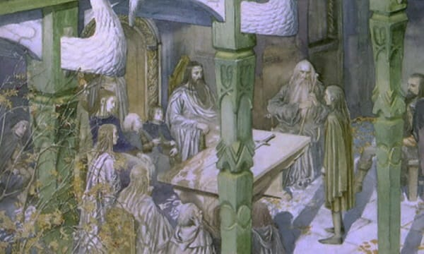
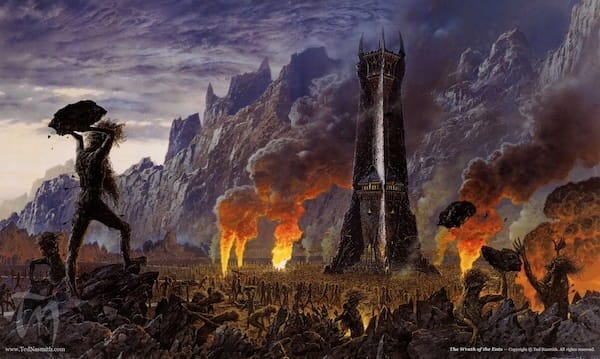
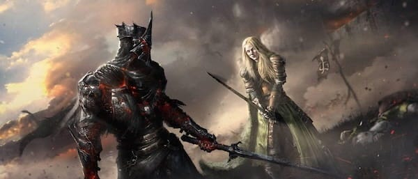
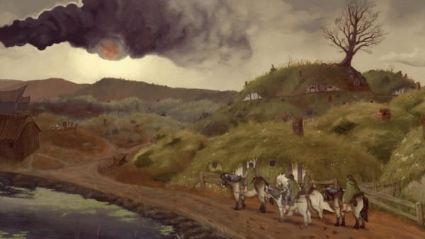
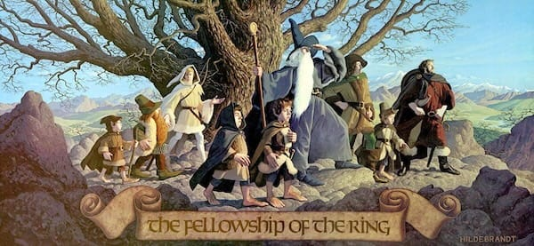

_This is the third part of a series exploring J.R.R. Tolkien’s Lord of the Rings as an anti-hierarchal philosophy.[Part 1](https://open.substack.com/pub/peacefulrevolutionary/p/can-you-resist-the-ring) was an interactive quiz revealing which character you’d be when faced with the Ring. [Part 2](https://open.substack.com/pub/peacefulrevolutionary/p/the-lesson-of-the-ring) explored the political philosophy behind each scenario. An [interactive web game](https://4wkhggkk.play.borogove.io/) version is also available. This piece asks the practical question: how do we actually destroy the Ring in our world?_

 _ **Note:** The purpose of this article is not to praise Tolkien, but to explore the relevance of his symbolism around rings of power. Although he despised Nazi ideology, condemned antisemitism, and denounced ‘racialist’ theories, some critics argue his work reflects Eurocentric perspectives and what they consider ‘[outmoded attitudes to race](https://en.wikipedia.org/wiki/Tolkien_and_race)’. Similarly, [scholarly opinion on gender](https://en.wikipedia.org/wiki/Women_in_The_Lord_of_the_Rings) in his work is divided: some academics view him as a patriarchy-favouring product of his time or as sexist, while others point to characters like the powerful and independent Éowyn as approaching feminist ideals._

## The End of the Fifth Age

We live near the end of the fifth age. In Tolkien’s telling, the Lord of the Rings happens at the end of the Third Age. The Fourth Age that followed was the Age of Men, when dominion passed fully to humans.

If the Fourth Age was humanity’s dominion beginning, then the Fifth Age is where that dominion led us: industrial capitalism, ecological destruction, hierarchy crystallised into oligarchy. We’ve reached the end of an age defined by concentrated power and the exhaustion of the earth. The question facing us now: will there be a Sixth Age at all? And if so, what will it be?

## The Stakes: Why Matters Now

Whether there is a Sixth Age depends on most of us taking decisive action in the next few years. We must avert climate catastrophe to ensure there is a future worth living. And the fight is inextricably tied to overcoming hierarchy, because hierarchical power must always use up the earth’s resources to sustain itself. It needs armies to enforce control, weapons to threaten resistance, extraction to fuel expansion, and growth to justify existence.

Likewise, Sauron’s tower of Barad-dûr, his armies of enslaved orcs, his desolation of Mordor weren’t incidental to his power. They were what concentrated power requires. If we look at our world we have: oligarchs whose wealth depends on extraction, military budgets that dwarf all other spending, forests cleared for profit, oceans poisoned for convenience, and workers exhausted for productivity.

All of this happens because a few gain or maintain power and wealth from this happening, and that power and wealth gives them the ability to command or coerce others.

## How Power Enslaves Its Own Wielders

At the Council of Elrond, Gandalf explained how Sauron created the Ring: ‘He let a great part of his own former power pass into it, so that he could rule all the others.’

Elrond adds: ‘If it is destroyed, then he will fall; and his fall will be so low that none can foresee his arising ever again. For he will lose the best part of the strength that was native to him in his beginning.’

Sauron put his own power into the Ring. He diminished himself to create the instrument of his domination. He became dependent on the very tool he made to control others.

Here’s the fundamental truth about hierarchical power: it enslaves its wielders as surely as it enslaves those beneath them. The oligarch who must constantly guard his wealth. The dictator who fears the people he rules. They’ve put their power into the system, and now the system owns them.

This was true for the other ringbearers as it was for Sauron, asandalf tells Frodo about the Nine kings who became Ringwraiths: ‘They obtained glory and great wealth, yet it turned to their undoing. They had, as it seemed, unending life, yet life became unendurable to them.’

They got exactly what they wanted: power, wealth, immortality. And it destroyed them from the inside. They became slaves to Sauron, existing without living, commanding without choosing, powerful yet utterly enslaved. As Gandalf warns: ‘A mortal who keeps one of the Great Rings does not die, but he does not grow or obtain more life, he merely continues, until at last every minute is a weariness.’

Look at the oligarchs of our world. They’re modern Ringwraiths. They have resources beyond measure, yet their lives are full of insecurities. They must constantly acquire more, not because it brings joy, but because they’ve invested their essence into the system and now the system demands it. Such rings corrupt everyone, especially those who think they’re wielding it.

## The Hierarchy of the State: Why All Dictators Are the Same

The danger of power is as great when it is political as when it is financial. Tolkien lived through both World Wars and saw this illustrated by its dictators. He called Hitler ‘that ruddy little ignoramus’ with ‘demonic inspiration and impetus,’ and Stalin a ‘bloodthirsty old murderer.’ He was sickly amused that Stalin invited all nations to join in abolishing tyranny.

The lesson being that it doesn’t matter what ideology they claim. Nazi or Sovier, fascist or Stalinist, when someone concentrates power in their hands, the result is always the same. The Ring corrupts everyone who wields it, regardless of what they say they’re using it for. The structure is the problem. The hierarchy is the corruption. The power itself is the danger.

## The Hierarchy of Capital: How Wealth Becomes the Ring

Tolkien didn’t just apply this to the nations of the East of his own, he also worried about what he called ‘Americo-cosmopolitanism’, not America itself but the global spread of a particular kind of power. He was unsure whether victory over the Nazis would be much better if it simply meant one form of domination replacing another.

### Saruman’s Mind of Metal and Wheels

Saruman represents this extractive mindset perfectly. He wasn’t interested in traditional conquest. He wanted to industrialise, to make everything efficient and productive. He tore up Fangorn Forest for resources, built factories and forges, created Uruk-hai through industrial production. As Gandalf says of Saruman, he has ‘a mind of metal and wheels’ and no longer cares for growing things. Extractive industry destroying ecology for power.

Yet, Treebeard while recognising how disenfranchised he and his kind were from this world said: ‘Nobody cares for the woods nowadays. But we’re not dead yet.’ Nor were they prepared to die without a fight. So the Ents rose up. Until the oldest, slowest beings, the ones written off as too ancient to matter, destroy Isengard utterly. The forests fought back and won.

We face the same situation now. Capital has become the Ring: concentrating wealth, extracting from the earth, and treating workers as resources. And like Saruman, it tells itself that progress, efficiency, and necessity justify everything. But we’re stirring. The earth is responding. And all of us meant to be resources, meant to comply, can choose to be like the Ents instead, and fight back.

## Why Reform Fails: The Boromir Trap

But what does fighting back look like? Is it campaigning for politicians to give us concessions? Is it trying to get our party into power to look after our interests for us?

Like such a politician, seeking our vote, at the Council of Elrond, Boromir argued: ‘Why should we not use the Ring? Let it be your weapon!’ It sounds sensible. Use the enemy’s weapon against him. Fight power with power.

But Elrond wisely responded: ‘We cannot use it.’ Gandalf refused to even touch it, realising: ‘I would use the Ring from a desire to do good. But through me, it would wield a power too great and terrible to imagine.’ Even Galadriel, after being offered the Ring, nearly falls yet ultimately refuses: ‘I pass the test. I will diminish, and go into the West.’

Here’s the core lesson about reform: you cannot use the master’s tools to dismantle the master’s house. You cannot wield the Ring to defeat Sauron. The moment you pick it up thinking ‘I’ll use it for good,’ you’ve already begun to fall. Every revolution that seizes state power becomes a new state. Every reform movement that works within capitalism ends up serving capitalism.

### When Reform Does Work: Temporary Respite

This doesn’t mean reform is useless. Just that it’s limited, and always at risk of being rolled back.

After the Ringwraiths wound Frodo at Weathertop, Aragorn drives them off with fire. He didn’t destroy them, he couldn’t, but he did buy them time. At the Ford of Bruinen, Elrond’s flood washes them away. They were still not destroyed, but scattered and delayed.

The Nazgûl keep coming back because they’re sustained by the Ring. As long as the structure of domination exists, they’ll return. Reform drives them back temporarily. It creates breathing room. Labour rights, civil rights, environmental regulations are forms of resistance that create space, keep people alive, and help make the journey to Mount Doom possible.

But we cannot mistake them for victory. We may need reform to survive long enough to achieve revolution or a complete transformation. We need both, but need to understand clearly what each can and cannot do.

## We Must Expose Their Power: The Weakness of Shadow

One of our advantages is how much the powerful fear us understanding their intentions, their weaknesses, and realising our strength. As Aragorn tells the hobbits: ‘They themselves do not see the world of light as we do, but our shapes cast shadows in their minds, which only the noon sun destroys.’

The Nazgûl exist in shadow. They’re strongest in darkness and secrecy. But full exposure, the noon sun, destroys even their ability to perceive and hunt. Hierarchical power works the same way. It depends on obscurity, it thrives in the shadows, and fears being exposed in the light. The oligarchs hide wealth in shell companies. The state cloaks violence in euphemisms. Capital disguises exploitation as opportunity.

We must expose them. Make visible how wealth concentrates, who profits from war and poverty, what connects the billionaire and the politician, how the system reproduces itself. Shine the noon sun on all of it. Propaganda fights us so hard because they need the shadows. In full light, the rottenness shows.

## We Must Defeat Them: Why Only the Powerless Can Destroy Power

Ultimately, if we are to defeat those who sacrifice our freedom for their power, then we will have to take risks and take the fight to them. But despite their money and armies they are not invincible.

At the Battle of the Pelennor Fields, Éowyn faces the Witch-king. An ancient prophecy declared that ‘not by the hand of man will he fall’, leading everyone to believe he was invincible. Even as Merry stabbed him with his Barrow-blade, breaking the spell that protected him, the Witch-king still boasted: ‘No living man may hinder me.’ But Éowyn struck him down with the words: ‘But no living man am I! You look upon a woman.’ The prophecy was fulfilled precisely.

The Witch-king fell not to kings or armies but to those the system never expected to matter. The powerless destroyed what the powerful couldn’t defeat.

And the rest of the Nazgûl? When Gollum falls into Mount Doom with the Ring, when the Ring is destroyed, the Nazgûl are annihilated with him. The Ring can’t be defeated by replacement. It has to be destroyed. And it can only be destroyed by those it was meant to enslave.

### Why Hobbits Can Do What Great Powers Cannot

It is not by us individually or someone who claims to be on our side having the same power as Sauron that we defeat the Ring.

Gandalf and Galadriel were right to refuse the Ring, knowing they’d become new Dark Lords. Aragorn wouldn’t touch it despite being the rightful king. He knew that kind of legitimacy would make him more dangerous, not less.

Only Frodo - supported by Sam - was able to carry it. The hobbits, small, overlooked, were insignificant to the great powers, proved to be the only ones who could destroy it. Why? Because they don’t want power over others. The Ring has no hold on them because they were content with beer and pipe-weed and friendship.

The system never expected them to matter. And that’s exactly why they could destroy it. They had no investment in the system of domination. No desire to replace one master with another. The oppressed can destroy what the powerful cannot reform. The workers can abolish capitalism because they don’t want to be capitalists. They want to be free. The powerless are dangerous to power precisely because they don’t want power over others.

## The Fellowship: Horizontal Organisation as Alternative

The genius of Tolkien’s story isn’t just that the Ring must be destroyed. He shows us what replaces it: the Fellowship. The Ring is power concentrated in one will, imposing order through domination versus the Fellowship which is power distributed among free people, creating cooperation through solidarity.

The Fellowship has no leader in the traditional sense. Gandalf guides without commanding. When he falls, they don’t collapse. They continue, making decisions collectively. Aragorn has the most claim to leadership and explicitly refuses to use it that way. He persuades, suggests, fights alongside rather than commanding.

Each member contributes what they can. When the Fellowship breaks at Amon Hen, it’s adaptation rather than failure. They recognise that rigid organisation would fail, that flexibility serves better than command structure. Each acts according to their capability and conscience. Each trusts the others to do the same.

Through distributed action, through solidarity, through each person freely choosing to act, they win. Anarchist organisation works like this: voluntary cooperation, mutual aid, distributed power, and solidarity across differences. The Fellowship achieves what no army could, not despite their lack of hierarchy but because of it.

## The Scouring of the Shire: Local Hierarchy Must Also Fall

But removing hierarchal power is a messy business. Here’s the part film adaptations often cut: even after Sauron falls, the hobbits return to find the Shire corrupted.

Saruman has industrialised the Shire. Mills and smoke where gardens grew. Trees cut down. Thugs enforcing rules. The Shire remade in Saruman’s image of ‘progress’: ordered, productive, controlled, and miserable.

The hobbits must fight there too. They must rouse the Shire-folk, organise resistance, overthrow the local tyrants. The lesson is that destroying the big Ring isn’t enough if little Rings remain. Defeating the obvious Dark Lord doesn’t bring freedom if every community still has its petty tyrants. Overthrowing the oligarchs means nothing if bosses still rule in every workplace.

Revolution must be total, though not in the sense of killing everyone who disagrees. Rather, it means dismantling hierarchy everywhere it exists. Global and local. State and capital. Political and personal. Every form of domination, every structure of hierarchy, every little Ring someone uses to rule over others.

Frodo can destroy the One Ring at Mount Doom. But the hobbits of the Shire must reclaim the Shire for themselves. No one can liberate you. You must participate in your own liberation.

## The Sixth Age: What Comes After

So what would a Sixth Age look like? If we look to the Shire before its corruption, not as idyllic past to return to, but for principles we can build upon and be inspired by we see:

  *  **Gift economies and mutual aid:** The hobbits gave freely. Bilbo’s birthday party where he gave gifts to everyone. The informal networks of support that meant no one went hungry or unsheltered. This was cooperation instead of competition, hobbits worked together on harvests, helped each other with tasks, celebrated communally without competing for status or resources.

  *  **No kings, no standing armies:** The Mayor’s duties were largely ceremonial. The Shirriffs were few and more like a neighbourhood watch. There was no military except militias formed when there were threats from outside. Nor was there any apparatus of state violence to enforce compliance.

  *  **Decentralised governance:** Decisions made locally by those affected. No central authority imposing from above. When coordination was needed, it happened through voluntary cooperation, not command.

  *  **Ecology instead of extraction:** They gardened, they didn’t strip-mine. They farmed sustainably, taking what they needed rather than everything possible. They lived _with_ the land, not against it, understanding themselves as part of the ecology, not separate from or above it. This is the opposite of Saruman’s Isengard, where trees were torn up for resources and the land devastated for industry.

  *  **Solidarity instead of division:** Different hobbit families — Tooks, Brandybucks, Bagginses — worked together despite their differences. The society valued sharing more than accumulating. Bilbo was ‘very rich and very peculiar’ yet also ‘generous with his money’, and ‘most people were willing to forgive him his oddities.’ They made space for the odd, the different, the non-conforming. When crisis came in the Scouring of the Shire, they came together across all their small differences to reclaim their home.

The Sixth Age isn’t about going backwards. It’s not about everyone becoming subsistence farmers (though some might choose that). It’s not about rejecting technology or knowledge or connection.

It’s about applying these principles — which were already proven in the Shire and already demonstrated by the Fellowship — to progress forward. Some communities might be more collective, others more individual. Some more technological, others more low-tech. Some urban, others rural.

The beauty of destroying the Ring is that there doesn’t have to be one right answer, one correct way, one vision imposed on everyone. The Fellowship worked because it had elves and dwarves and hobbits and men, each contributing their different strengths, none dominating the others. The Sixth Age will work the same way.

We won’t all agree on exactly what the vision looks like. That’s the point. The Sixth Age isn’t one vision imposed from above. It’s what emerges when people are free to organise themselves, when communities have autonomy, when everyone participates in the decisions that affect them.

## The Choice Before Us

The Fifth Age ends when we choose to end it. The Ring of power, concentrated in oligarchs and sustained by state and capital, cannot reform itself. Yet there’s a third option: destroy the Ring entirely.

We are the hobbits. We are the ones the system never expected to matter, the ones it assumed would comply. And precisely because we don’t want to rule, because we don’t seek domination, we can destroy what the powerful cannot reform.

The actual structure of how liberation happens: the enslaved free themselves. The colonised achieve their own independence. The workers create the world they want. Those with power cannot dismantle the systems that give them power. Yet we can dismantle them. Because we don’t want to be masters. We want to be free.

Like Frodo, we carry a terrible burden. Like the Fellowship, we cannot do it alone. Like the hobbits returning to the Shire, we must be prepared to fight in our own communities. And like Galadriel prophesied to Gimli: over us, power shall have no dominion. Not because we’re incorruptible. We refuse because we recognise the Ring for what it is. Because we choose the Fellowship over the Ring, solidarity over domination, liberation over power.

The Sixth Age is possible. Whether it’s the age of climate catastrophe and intensified hierarchy or the age of mutual aid and ecological wisdom depends on what we do now. The choice is before us. The Ring must be destroyed. The Fellowship must be built. What will your choice be?

 _Find your Fellowship. Join existing struggles. Build new forms of mutual aid. Refuse the Ring in all its forms. The Sixth Age is ours to create._

 **Wondering what to do next?**

Mirrored here: <https://anarwiki.org/wiki/Anarchist_Learning_Resources>

Subscribe

[Share](https://peacefulrevolutionary.substack.com/p/how-we-destroy-the-ring-of-power?utm_source=substack&utm_medium=email&utm_content=share&action=share)
