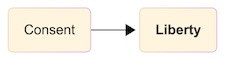
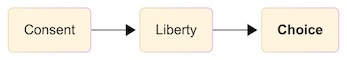
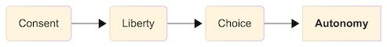
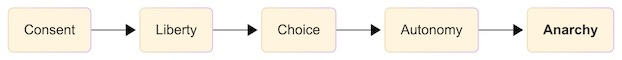
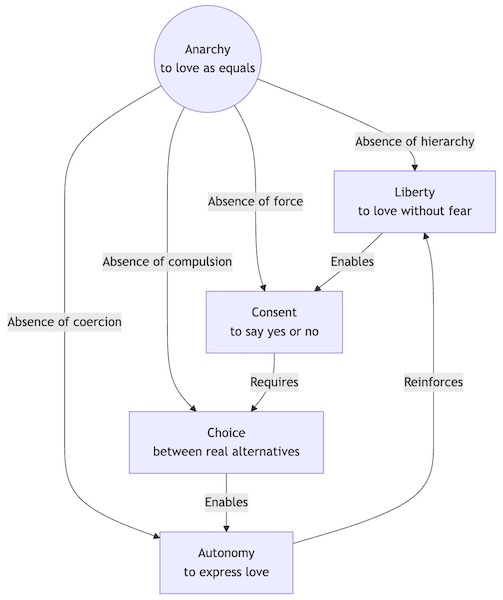
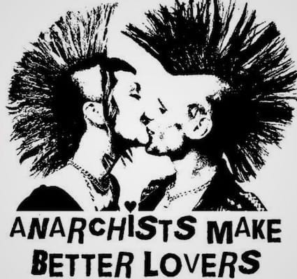
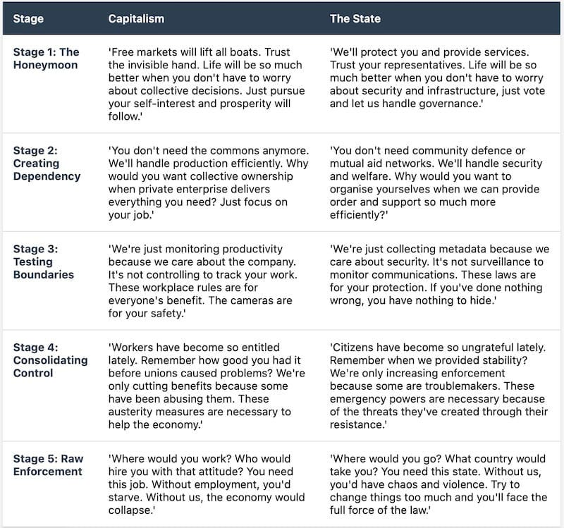
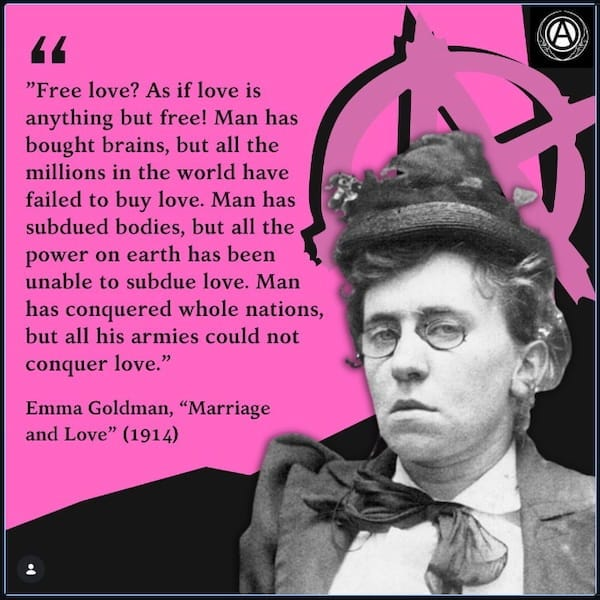
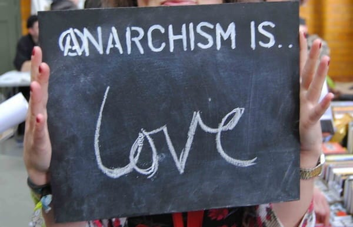

_A Valentine’s Day reflection on what makes relationships – personal and political – healthy and worth having_

> ‘I love you.’

Three words that should represent freedom, joy, and genuine connection. It is the subject of songs, the theme of films, a major genre of literature. It crosses several fields of scientific study and sits at the heart of many religions and philosophies. ‘I love you’ is a powerful sentence whether that love is shared freely between partners, good friends, or close family. For many people, those words are said freely and represent real care and kindness, comfort and affection. They come with acceptance and without unreasonable conditions.

Yet how often do these same words mask control? How many relationships claiming love actually lack consent? And if we can recognise the warning signs of an abusive romantic relationship, why do we struggle to see the same patterns in our workplaces and in our political and economic systems?

This Valentine’s Day, let’s explore what genuine love requires, and why the same principles that make personal relationships healthy apply equally to political ones.

## The Foundation: What Makes Love Real?

Picture two relationships:

 **Relationship A** : ‘I love you, so I’ve decided what’s best for you. I’ll manage your money because you’re not good with finances. I need to know where you are at all times – it’s for your safety. You need to cut off from friends who are ‘bad influences.’ Everything I do is because I love you and want to protect you.’

 **Relationship B** : ‘I love you, which means I trust you to make your own decisions. We’ll figure out finances together, respecting each other’s autonomy. I’m happy you maintain your friendships and pursue your interests. We’ll support each other’s growth, even when we disagree about the path.’

Most of us immediately recognise Relationship A as abusive, regardless of how many times ‘love’ gets mentioned. We understand instinctively that love without consent, without genuine choice, without autonomy, isn’t love at all. It’s control wearing love’s mask.

Yet when our government says ‘we know what’s best for you,’ when our employer says ‘these rules are for your own good,’ when capitalism insists ‘you’re free to choose any job you want as long as it pays enough to pay your rent’ – we’re told to accept this as normal, even beneficial. The same patterns we’d flee from in a romantic partner, we’re expected to embrace in our political and economic relationships.

## Consent: The Heart of Healthy Relationships

To understand why consent is necessary for genuine freedom, we need to understand what makes consent real, whether we’re talking about a romantic relationship, a friendship, or a political system.

Genuine consent requires four interconnected elements, each depending on the others:

### Liberty: The Absence of Constraint

At the most basic level, consent cannot exist under physical threat or violence. If someone holds a weapon to your head, your ‘agreement’ isn’t consent, it’s compliance extracted through terror. It is someone constraining you from refusing, from walking away, from exercising any free choice at all.

This seems obvious in personal relationships. We recognise that someone who says ‘yes’ whilst being physically threatened hasn’t truly consented. Their apparent agreement is manufactured through violence.

Yet our economic system operates on precisely this principle. ‘Work or starve’ isn’t meaningfully different from ‘your money or your life’. Both present violence as the alternative to compliance. The violence may be slower, more distributed, and easier to ignore, but hunger kills just as surely as a bullet. When ‘consent’ is extracted through the threat of deprivation, it isn’t consent at all.

### Choice: The Absence of Compulsion

Even without overt force, consent requires genuine alternatives.

Imagine someone saying: ‘You’re free to leave this relationship anytime you want. Of course, I’ve isolated you from your friends and family, you have no money of your own, and you have nowhere else to go, but you’re completely free to choose.’

We recognise this as manipulation, not freedom. The technical ability to walk away doesn’t constitute real choice when one option has been made deliberately untenable.

Yet this is exactly how capitalism presents ‘freedom’. You’re ‘free’ to quit your exploitative job, but you need money for housing, food, and healthcare. You’re ‘free’ to refuse any particular employer, but you must have an employer to survive. When the alternative to compliance is destitution, calling it ‘choice’ is a cruel joke.

True choice requires multiple viable options, not just the formal possibility of alternatives you cannot actually take.

### Autonomy: The Absence of Coercion

Autonomy goes deeper than choice. It’s the ability to make decisions for yourself without external control shaping what you want, what you believe, or what you think is possible.

In an abusive relationship, this might look like: ‘I haven’t forbidden you from seeing your friends. You’ve just decided (with my help) that they’re bad for you now. You’ve come to realise you prefer staying home with me. You’ve learned that disagreeing with me causes problems, so you’ve wisely stopped doing it.’

The abuser hasn’t forced compliance, they’ve shaped the victim’s perception of their options, their self-worth, and their understanding of what’s ‘normal’ until the victim polices themselves.

Our economic and political systems operate identically. We’re not (usually) forced to accept capitalism, we’ve simply been taught from birth that it’s human nature, that alternatives have never worked, that even thinking about different possibilities is naive or dangerous. We’re not forced to accept hierarchy (others ruling over us) we tell ourselves, we’ve learned that humans need leaders, that we’re incapable of self-organisation, that questioning authority is irresponsible. All of which is untrue.

This is coercion through manufactured consent: shaping people’s desires and beliefs until they ‘freely choose’ what the system needs them to choose.

### Anarchy: The Absence of Control

This brings us to the deepest requirement: the absence of imposed, controlling hierarchy itself (anarchy).

Hierarchy is a form of unequal power. It is unwanted domination over the unconsenting. It’s the arbitrary claim of one person’s right to make decisions for another, to control resources another needs, to define the terms under which relationship is possible.

In personal relationships, we call this domestic abuse. The abuser establishes themselves as the authority, they set the rules, control the resources, and define what counts as reasonable. The victim must navigate around the abuser’s needs, preferences, and demands. Love becomes conditional on obedience.

In most political and economic systems, we may call this normal. But the pattern is identical: one party claims the right to rule, to distribute resources conditionally, to punish non-compliance. The other party must accept these terms or face consequences. Participation requires submission to authority.

You cannot have genuine consent within hierarchy because hierarchy itself is the negation of equality that consent requires. When one party has power over another, when relationship is conditional on obedience, when resources and survival depend on pleasing authority then genuine consent becomes impossible.

## The Interconnected Web

These elements don’t just coexist, they require each other, forming an interconnected web where each supports and enables the others:

Notice how anarchy sits at the centre, enabling each element by removing a specific barrier:

  *  **Liberty** through absence of hierarchy

  *  **Autonomy** through absence of coercion

  *  **Choice** through absence of compulsion

  *  **Consent** through absence of force

Then notice how these elements reinforce each other in a continuous cycle: freedom enables consent, which requires choice, which enables autonomy, which reinforces freedom. Remove any one element, and the entire structure collapses.

This is why partial reforms never deliver full freedom. You cannot have freedom without autonomy, autonomy without choice, choice without consent, or consent without anarchy (freedom from rulers). They’re inseparable.

## What This Means for Love

Real love – whether romantic, platonic, or communal – requires this complete web of mutually supporting freedoms.

Love cannot flourish under hierarchy because hierarchy makes genuine consent impossible. When one person has power over another, every interaction is coloured by that inequality. Does your partner truly want to spend time with you, or do they fear the consequences of refusing? Do they share your interests, or have they learned to adopt your preferences to keep the peace? Do they love you, or have they simply learned that survival requires pleasing you? You cannot know (and more importantly, they cannot freely choose) when hierarchy structures the relationship.

The same applies to politics, to solidarity, mutual aid, and communal flourishing. When hierarchy structures our economic and political relationships, we cannot know whether people participate because they genuinely want to contribute to collective wellbeing or because the system punishes non-compliance with destitution and violence.

## The Abuser’s Playbook: Personal and Political

The parallels between abusive relationships and hierarchical systems aren’t coincidental, they follow the same logic because they serve the same function: maintaining power through control.

 **Stage 1 - The Honeymoon** : ‘I’ll take care of everything. Trust me. Life will be so much better when you don’t have to worry about all these decisions.’

 **Stage 2 - Creating Dependency** : ‘You don’t need those friends anymore. I’ll handle the finances. Why would you want to work when I can provide for you?’

 **Stage 3 - Testing Boundaries** : ‘I’m just checking in because I care. It’s not controlling to want to know where you are. These expectations are for your protection.’

 **Stage 4 - Consolidating Control** : ‘You’ve become so difficult lately. Remember how good we had it? I’m only strict because you’ve given me reason not to trust you.’

 **Stage 5 - Raw Enforcement** : ‘Where would you go? Who would take you in? You need me. Without me, you’d have nothing.’

Now read it again, but imagine it’s capitalism or the state speaking, or any hierarchical institution. It would look something like this:

The pattern is identical because the purpose is identical: to establish and maintain unequal power by destroying the conditions necessary for consent.

## Common Objections

> ‘But surely some hierarchy is necessary? Children need parents, students need teachers, societies need organisation.’

This conflates hierarchy with care, education, and coordination. All things that can exist without unequal power.

A parent who respects their child’s growing autonomy, who explains their decisions rather than demanding blind obedience, who prepares the child for self-direction rather than permanent dependence. That isn’t hierarchy. This is temporary guardianship that aims at its own dissolution.

A teacher who facilitates learning rather than enforcing knowledge, who respects students’ questions and encourages critical thinking, who shares expertise without demanding submission. That isn’t hierarchy. This is horizontal knowledge-sharing.

A community that coordinates through voluntary cooperation, where each person’s voice matters equally, where decisions emerge from discussion rather than command. That isn’t hierarchy. This is the anarchist organising in action.

The question isn’t whether we need relationships, structure, or organisation. The question is whether these things require unequal power, and the answer is no.

## Building Consent-Based Relationships

So what does a consent-based world look like?

In personal relationships, it means:

  * Partners who genuinely respect each other’s autonomy

  * Decisions made through discussion, not domination

  * Resources shared freely, not controlled conditionally

  * The freedom to leave without facing destitution or danger

  * Love that deepens freedom rather than restricting it

In political relationships, it means:

  * Economic / distribution systems where survival isn’t conditional on submission

  * Communities organised through voluntary cooperation

  * Resources held in common and distributed according to need

  * The ability to associate or dissociate freely

  * Combined Power that flows from mutual aid rather than coercion

The relational and political aren’t two separate visions. They’re the same vision applied at different scales. Both require the same fundamental shift: from relationships structured by power to relationships structured by consent.

## Valentine’s Day

When we celebrate love this Valentine’s Day or any other day, let’s ask ourselves: what kind of love are we celebrating?

The love that demands obedience? That requires submission? That punishes autonomy? That insists we accept control ‘for our own good’?

Or the love that trusts? That respects? That celebrates autonomy? That flourishes through mutual freedom rather than despite it?

If we wouldn’t accept the first kind of love in our personal relationships (and we shouldn’t) why do we accept it in our political and economic ones?

Anarchism isn’t just a political philosophy. It’s the recognition that the same principles making personal relationships healthy apply to all human relationships. It’s the insistence that love –whether personal or political – cannot coexist with hierarchy. It’s the simple, radical claim that consent matters in every relationship, not just romantic ones.

And it’s the promise that another world is possible: one where all our relationships, from the personal to the political, honour rather than violate consent. Where freedom and love aren’t opposites but partners. Where we can say ‘I love you’ and mean ‘I trust you to be free’.

That’s the world worth building. That’s the love worth fighting for.

Subscribe

[Share](https://peacefulrevolutionary.substack.com/p/love-consent-and-liberation?utm_source=substack&utm_medium=email&utm_content=share&action=share)

### Anarchy Is For Lovers

Text within this block will maintain its original spacing when published
    
    
    They came together-red and black-
    In a revolt like no other,
    And there is no turning back,
    For anarchy is for lovers.
    
    The truth is greater than the lies
    Of hollow gods and class divisions,
    For loving hearts all rules defy
    With a transcendent common vision.
    
    No wars, no boundaries, no states,
    No need to subjugate each other,
    No rich, no poor, no one to hate-
    Just peace and love for one another.
    
    They came together-young and old-
    No hippie freaks, but with a vision-
    They came together in revolt
    Against all wars and all divisions.
    
    They saw the truth, they saw the light
    In a revolt like no other,
    Standing determined in their fight,
    For anarchy is for lovers.
    
    _Alexander Shaumyan_
