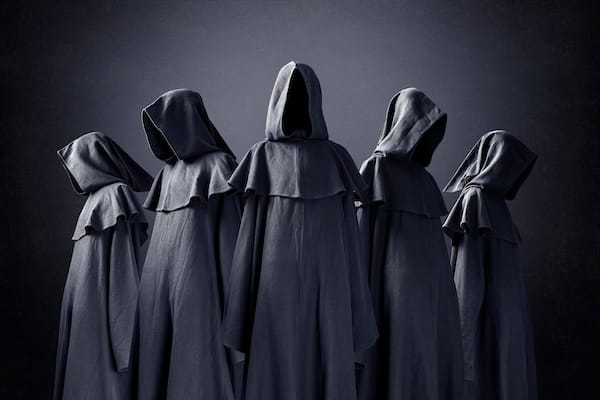
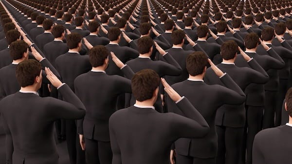
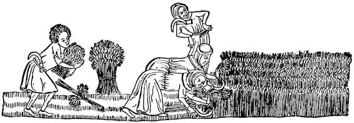

Have you ever noticed how some people will defend their country’s actions no matter what evidence you show them its evils? How they’ll excuse behaviour from their political leader that they’d never tolerate from a partner or friend? How questioning the system gets you labelled a traitor, whilst blind loyalty gets you called a patriot You’re not seeing tribalism. You’re watching a cult in action.

Some people talk about political tribes, and there are such things. But we don’t hear as often about political cults, or the distinction between the two. Understanding this difference matters, because what we’re seeing in modern politics isn’t people following their instincts to belong. It’s something more dangerous and deliberately constructed.

## Tribes vs Cults: Understanding the Difference

A tribe is something you’re usually born into. Historically, tribes had to be very aware of the reality of nature and understand it on a practical level in order to survive. They had limited tolerance for those seeking power to the rest of the tribe’s detriment, because that could endanger everyone. 

The Hadza of Tanzania, for instance, have no formal leaders. Decisions emerge through discussion, and anyone acting ‘too big for their boots’ gets mocked back into line.1 The !Kung San used a technique known as ‘insulting the meat’ to ensure successful hunters didn’t grow proud.2 Even the Iroquois Confederacy, whilst having chiefs, could remove them if they violated the Great Law of Peace.3 When tribes went from being smaller (albeit often networked) groups to larger settled civilisations, these power dynamics sometimes changed, but not always, and some larger civilisations existed without rulers for thousands of years.

A cult, unlike a tribe, operates within a narrow worldview which may (and often does) conflict with reality. It’s usually focused on a figurehead, sometimes a charismatic person, or one who is surrounded by a great deal of positive propaganda.

I used to think that people slavishly followed their political or cultural group because of some tribal instinct. I don’t believe that anymore. Whereas, members of a tribe can disagree like members of a family, yet they still look after one another’s needs. I now believe what we’re seeing is more like a cult. A cult doesn’t need its members co-operating with each other to survive. It needs them to follow. It puts down those who dissent. Its resources flow upwards to the leaders, and it demands loyalty tests.

A tribe will find a water hole and share it. A cult will put someone in charge of the water hole and grant access based on faithfulness. A tribe shares responsibility and co-operates to succeed. A cult empowers the leader and disempowers the follower. Those in a cult compete for favour, worthiness, delegated approval, and limited devolved power.

A tribe has to be realistic about the faults that affect its members. Ignoring someone’s weakness when hunting or gathering could get people killed. A cult must overlook, minimise, or deny the faults of leaders who are considered divine, or perceived as infallible.

## When Groups Become Cults

Of course, the term ‘tribe’ can and has been used more broadly to mean any group which shares a similar demographic or outlook. In this sense there are football tribes, music genre tribes, and gaming community tribes. But not all of these become cults, and some never do (except to a few extreme individuals who follow them cultishly). You can be passionate about Arsenal football club without believing its team captain is infallible, or love punk rock without requiring ideological purity tests.

The shift happens when criticism becomes heresy, when the group’s identity centres on a leader or doctrine that cannot be questioned, or when belonging requires surrendering your judgement.

Sometimes there are cults within tribes. There are Republican cults and Democratic cults, Tory cults and Labour cults. There can also be workplace cults, especially when they’re pyramid schemes, multi-level marketing, or sales-orientated. Then there are groups which are started as cults or became so, such as some extreme religious groups, and believers in pseudo-scientific conspiracy theories like QAnon or anti-vax.

## The Ultra-Nationalist Turn

Sometimes conservatives, right-wing party members, fiscal or moral traditionalists, or even laissez-faire capitalists trade their allegiance to these political ‘tribes’ for membership in an ultra-nationalist personality cult. When this happens, something fundamental shifts.

They cease to be meaningfully right-wing or conservative because they’re willing to accept a dictator, king, emperor, or chairman as their ruler. They abandon their ideal of limited government for concentrated power with expansive overreach.

They cease to be constitutionalists because they’re willing to overthrow existing institutions, constitutional norms, and democratic traditions in pursuit of their leader’s vision.

They cease to be laissez-faire capitalists _(although I’m no fan of capitalism)_ because they’re willing to pick favourites that serve their ruler or in-group. It can be argued this has always been the case with capitalism, but it becomes more blatant without even the pretence of avoiding such corruption. You can see this when a president promises to punish companies that criticise them whilst rewarding those that bend the knee.

They cease to be Christian (in any meaningful sense) because their followers put loyalty to the cult above adherence to their religious beliefs. They rationalise away contradictions, relegate core teachings, or reinterpret scripture in service to the cult. When religious leaders defend a civil leader who contravenes every moral principle we’re not watching their theology at work, we’re seeing the rationalisation of those supporting a cult leader.

## Ultra-Nationalism as Cultic Framework

In a state / government setting, such cults are often ultra-nationalist. Although, it could be argued that to some degree, all nationalism contains a cultic element, especially when it reaches the point of defending a country right or wrong, praising it despite it contradicting the ideals it claims to be built on, and people seeing themselves primarily in terms of nationality by virtue of birth or personal identification.

The problem with ultra-nationalist cults with figureheads who lead them is that they often become a kind of theocratic dictatorship. Not in the traditional religious sense, but in the functional sense that the nation itself becomes sacred, the leader becomes its high priest, and dissent becomes blasphemy.

Religions that hope to flourish under ultra-nationalism inevitably become complicit in this transformation. They legitimise the nationalist project by redirecting religious devotion towards the state and its leader. Sacred texts become props for state propaganda rather than sources of moral authority. Dissenting voices within the faith get silenced or sidelined, whilst compliant clergy receive positions of influence and access to power. The faithful are taught that serving the nation is serving God, that the leader embodies divine will, that patriotic duty supersedes any higher calling.

In practice, this means the ultra-nationalist figurehead displaces traditional religious authority in importance and loyalty. The religion survives, but it survives as a hollowed-out vessel. Its substance replaced with nationalist doctrine whilst its forms and rituals remain as decorative legitimation. Worship services become rallies. Prayer becomes performance. The community of faith transforms into a mobilisation network for state objectives.

## The Economic Engine of Empire

Here’s what also often gets missed in discussions of nationalism: it’s never just about flags and fervour. Every empire, every ultra-nationalist project, needs an economic system to channel wealth upward and claim legitimacy for doing so. The financial structure isn’t separate from the political cult. It’s how the cult sustains itself.

The Roman Empire had its tribute system. Conquered peoples paid taxes directly to Rome, enriching senators and emperors whilst maintaining the fiction that Roman law brought civilisation and order. The system claimed to be about governance, but you only had to follow where the money flowed to disprove that myth.

Medieval monarchies had feudalism. Peasants worked land they’d never own, paying rent and tithes to lords, who owed allegiance (and payments) up the chain to kings. The system claimed to be about divine right and natural hierarchy, but if you tracked the grain and gold you saw that wasn’t so.

The British Empire had chartered companies: the East India Company, Hudson’s Bay Company, Royal African Company. These weren’t ‘private businesses’ operating independently. They were extensions of imperial power, granted monopolies, backed by state violence, funnelling wealth from colonised lands to English shareholders and the Crown. The system claimed to be about free trade and commercial enterprise, but note who held the guns and who ended up with the profits.

Each system presented itself as natural, inevitable, even beneficial to those it exploited. Each claimed to operate by neutral principles (law, divine order, market forces). Each required the submission of the many to enrich the few. And each was inseparable from the nationalist project that justified it.

Modern capitalism serves the same function for today’s ultra-nationalist cults. It presents itself as an independent system of markets and merit, operating by objective laws of supply and demand. But look at what it actually does:

It concentrates wealth in the hands of those who already have capital, just as feudalism concentrated land in the hands of nobility. It extracts surplus value from workers, just as tribute systems extracted grain from peasants. It uses state violence to protect property and enforce contracts, just as empires used soldiers to collect taxes. And it wraps itself in nationalist mythology (the ‘American Dream’, ‘British innovation’, ‘German efficiency’) to justify these outcomes as deserved.

The ultra-nationalist cult needs capitalism because capitalism provides the mechanism to extract resources whilst claiming nobody is being forced. You’re not a serf bound to land. You’re a ‘free worker’ who can quit any time (and starve). You’re not a colonial subject. You’re a ‘consumer’ who can buy what you can afford (which isn’t much). The system isn’t exploitation. It’s ‘opportunity’ (for those who own things to profit from those who don’t).

And capitalism needs nationalism because nationalism provides the emotional infrastructure to make people accept their exploitation. You’ll tolerate low wages if you believe immigrants are the real threat. You’ll accept crumbling public services if you’re convinced foreigners are freeloading. You’ll work yourself to exhaustion if you think it proves you’re a ‘real’ citizen, unlike those lazy others. You’ll even die in wars to protect the property of billionaires if you’re convinced it’s about defending your homeland.

This is why ultra-nationalism and capitalism are inseparable in modern cult formation. The ultra-nationalist cult provides the emotional control (fear, belonging, identity, manufactured enemies). Capitalism provides the material extraction (the mechanism by which your labour, your time, your life is converted into wealth for those above you). Together, they create a total system that’s harder to escape than any medieval monastery.

## Historical Parallels: From Medieval Church to Modern State

It’s easy to see the relevant comparison of modern ultra-nationalism to Nazism, but its origins are much older, and I’d like to go back further and see how it compares to medieval Catholicism. Not to attack that form of Catholicism specifically, but because it provides a clear model of how total systems of control operate.

 **Medieval Catholicism:**

  * Everything you made was tithed. 

  * Your civil leaders were either religious or at the least loyal to the religion. 

  * To not go to church was punishable. 

  * What education there was centred around the religion to ensure that from childhood up, people knew to conform and feared disobedience. 

  * Your relationship to society was mediated through the church.

 **The Modern Ultra-Nationalist-Capitalist Cult:**

  * Everything you make is ‘taxed’ through surplus value extraction (your employer takes the majority of what you produce). 

  * Your civil leaders must be loyal to capitalism and nationalism, or they’re deemed unelectable. 

  * To not work (to refuse participation) is punishable through destitution. 

  * Education centres around training compliant workers and patriotic citizens from childhood. 

  * Your relationship to society is mediated through employment, consumption, and citizenship.

Not much has changed. The religion in charge is a different one, but the structure remains. It still determines whether you can live or not. We still remould ourselves to fit its ideal image (a form of servitude that’s unnatural and unbeneficial to us), but we’re called mad or medicated if we resist or don’t conform.

## The Caste System Reborn

And like medieval Catholicism, this system doesn't just control through doctrine and economics, it also creates hierarchies of human worth. It decides who deserves dignity and who doesn't, who gets access to society's resources and who can be left to suffer.

Consider how closely modern marginalised people mirror a caste system: Some people don’t deserve to live like the rest of us (at least not like other ‘respectable’ people). They’re a drag on the system, on us all, unless they can subsist doing dirty jobs which no-one else wants. But they don’t deserve to be around ‘us’, to live in ‘our’ neighbourhoods, to access ‘our’ resources.

The homeless, the chronically unemployed, migrants, prisoners: modern untouchables whose very existence is treated as a moral failing. They can clean our toilets, pick our fruit, deliver our food, but heaven forbid they sit next to us on the bus.

Anciently, emperors were enriched by tributaries, colonies, and feudalism. Now they’re enriched through capitalism. The structure has evolved, but the extraction continues, and it all goes toward supporting the ultra-nationalistic cult and empowering its rulers.

## The BITE Model: Systematic Analysis

To further examine the ways in which ultra-nationalism is a cult, we can analyse this systematically through the BITE framework, which identifies how cults control their members:4

### BEHAVIOUR CONTROL

 **Traditional Cult:**

  * Regulating individual’s physical reality (where to live, what to wear, what to eat).

  * Financial control. 

  * Rigid rules and regulations. 

  * Need to seek permission for major decisions.

 **Ultra-Nationalist Cult:**

 _Economic coercion:_ Must work to survive; living arrangements dictated by income; healthcare, housing, food all commodified.

 _Dress codes:_ Enforced through employment (suits, uniforms); cultural pressure (flag pins, team colours); violent enforcement against ‘outsiders’ (attacks on hijabs, ‘ethnic’ clothing).

 _Rigid rules:_ Border controls, employment regulations, mandatory documentation, curfews for ‘troublemakers’.

 _Permission requirements:_ Visas, work permits, business licences, planning permission, all requiring state approval.

 _Financial control:_ Banks can freeze accounts of dissidents; tax systems punish non-compliance; credit scores determine access to housing.

 _Punishment for disobedience:_ Imprisonment, deportation, loss of employment, social exclusion.

### INFORMATION CONTROL

 **Traditional Cult:**

  * Use of deception. 

  * Access to outside information limited or discouraged. Insider vs outsider doctrine. 

  * Extensive use of propaganda.

 **Ultra-Nationalist Cult:**

 _State propaganda:_ Constant messaging about national greatness, existential threats, the leader’s wisdom.

 _Media control:_ Attacks on journalists as ‘enemies of the people’; state media presenting government line; corporate media serving owner interests.

 _Education control:_ Nationalist history taught in schools; critical perspectives dismissed as ‘unpatriotic’.

 _Insider/outsider doctrine:_ ‘Real’ citizens vs immigrants, ‘patriots’ vs ‘traitors’, ‘us’ vs ‘them’.

 _Information silos:_ Algorithm-driven feeds showing only confirming information; partisan news sources; ‘alternative facts’.

 _Deception normalised:_ Lies reframed as ‘political speech’; corruption as ‘business as usual’; war crimes as ‘collateral damage’.

 _Outsider information dismissed:_ International criticism as ‘foreign interference’; academic research as ‘elite bias’; protest as ‘outside agitators’.

### THOUGHT CONTROL

 **Traditional Cult:**

  * Need to internalise group doctrine. 

  * Black and white, us vs them thinking. 

  * Loaded language and clichés. 

  * Memory manipulation and rejection of alternative beliefs.

 **Ultra-Nationalist Cult:**

 _Required beliefs:_ The nation is exceptional or chosen; the leader knows best; the system works for those who deserve it.

 _Binary thinking:_ You’re either with us or against us; either a patriot or a traitor; either hard-working or lazy.

 _Loaded language:_ ‘Welfare queens’, ‘illegal aliens’, ‘inner cities’, ‘real Americans’, ‘family values’, ‘law and order’.

 _Thought-terminating clichés:_ ‘It is what it is’, ‘that’s just how the world works’, ‘get a job’, ‘love it or leave it’.

 _Memory manipulation:_ Sanitised history (slavery as ‘involuntary relocation’, colonialism as ‘bringing civilisation’); forgetting previous positions when the leader changes stance.

 _Alternative beliefs rejected:_ Socialism is inherently evil; anarchism is chaos; any criticism is hatred of the nation.

 _Doublethink required:_ The nation is both superior and constantly under threat; the leader is both genius and victim; poverty is both a moral failing and inevitable.

### EMOTIONAL CONTROL

 **Traditional Cult:**

  * Guilt and fear induction. 

  * Extreme emotional highs and lows. 

  * Phobia indoctrination about leaving. 

  * Love bombing and conditional acceptance.

 **Ultra-Nationalist Cult:**

 _Fear induction:_ Constant threats (immigrants, terrorists, foreign powers, economic collapse, crime waves, often exaggerated or fabricated).

 _Guilt manipulation:_ ‘Don’t you care about the troops?’ ‘You’re betraying your ancestors’ ‘Think of the children’ ‘You’re letting down your country’.

 _Emotional rallies:_ Massive spectacles with flags, anthems, synchronised chanting; creating peak experiences tied to national identity.

 _Phobia indoctrination:_ Leaving means becoming a traitor; questioning means you’re ungrateful; resistance means you’re dangerous.

 _Love bombing:_ ‘We’re all in this together’ (but only if you comply); ‘You’re part of something bigger’ (but only if you conform).

 _Conditional acceptance:_ Loyalty must be constantly proven; one wrong step and you’re cast out; even past service doesn’t guarantee future acceptance.

 _Manufactured outrage:_ Constant stream of enemies to hate; two-minute hate sessions against whoever is designated today’s threat.

 _Emotional exhaustion:_ Keeping people too overwhelmed and anxious to think critically; crisis after crisis demanding immediate emotional response.

Note how in our current model this is entwined with a particular form of Christian nationalism and capitalism, creating a triple-bind where religious, economic, and national identity reinforce each other.

## Resistance Is Possible

Ultra-Nationalist cults don’t always succeed. It isn’t inevitable. Think of Oswald Mosley’s Blackshirts, beaten back by Jewish, Irish, anarchist and communist dockers at Cable Street. The Romanian Iron Guard, eventually crushed despite their violence. The French Croix de Feu, who never achieved the dictatorship they sought. The Brazilian Integralist Action, defeated in their attempted coup. The Mexican Gold Shirts, whose fascism failed to take root. The American Bund, laughed out of Madison Square Garden and disbanded after Pearl Harbor. The Silver Legion and even the KKK, whose power has waxed and waned based on how much resistance they faced.

Sometimes they fail because their cause proves unpopular. It’s rejected and not tolerated. They fail when they’re confronted, when they’re not given room to grow, when ordinary people say ‘no, not here, not ever’ and mean it. They fail when communities organise, when workers strike, when people refuse to cooperate with their demands.

The cult needs your participation. The ultra-nationalist project requires your labour, your taxes, your obedience, and your silence. Every point where you can withdraw cooperation, build alternatives, or resist their demands is a point of vulnerability.

The question isn’t whether nationalist cults can be stopped. History shows they can. The question is whether we’ll organise the resistance whilst there’s still time.

Subscribe

[Share](https://peacefulrevolutionary.substack.com/p/the-rise-of-the-cult-of-ultra-nationalism?utm_source=substack&utm_medium=email&utm_content=share&action=share)

1

James Woodburn, ‘Egalitarian Societies’ (1982). The Hadza maintain egalitarianism through immediate-return economics and social sanctioning of dominance.

2

Richard B. Lee, ‘Eating Christmas in the Kalahari’ (1969). Describes the practice of ritually belittling meat to prevent arrogance in hunters.

3

The Iroquois ‘Great Law of Peace’ included impeachment procedures for chiefs who acted tyrannically, demonstrating accountability mechanisms in pre-state societies.

4

Steven Hassan, ‘Combating Cult Mind Control’ (1988). The BITE model (Behaviour, Information, Thought, Emotional control) provides a framework for identifying cultic manipulation.
