This question has driven and perplexed philosophers for centuries. Are we beings with a lofty purpose to fulfil or just animals who just act on instinct? Yet even animals (at least the more intelligent ones) experience sadness and happiness, fear and play, and something that very much looks like love. They have inner lives, preferences, and relationships too. So if we’re not just biological automatons, what are we? Why are we here?

It’s perhaps the most fundamental question humans ask, and throughout history various systems have been eager to answer it for us. But here’s what’s curious: despite their wildly different starting points - philosophy, religion, economics, politics - they tend to arrive at remarkably similar conclusions about what you’re for. And perhaps more importantly, who benefits from you accepting their answer.

To see this pattern clearly, let’s examine what various systems claim your purpose is, what they ask of you to fulfil that purpose, and what emerges when we look at them together. By the end, you might notice something troubling about how often your supposed ‘purpose‘ aligns suspiciously well with what powerful institutions need from you.

## Philosophical Purpose

Philosophy tries to answer the question of human purpose through reason, observation, and argument rather than divine revelation. For thousands of years, thinkers have proposed competing theories about why we exist and what we should do with our lives. Some say purpose is built into human nature - we just need to discover it. Others claim there is no inherent purpose, so we must create our own.

What’s striking about philosophical approaches is their diversity - there’s no consensus, no final answer everyone accepts. Let’s look at how different philosophical traditions answer the question ‘why do you exist?’ grouped by their core themes.

### Basic Drives: Biology, Pleasure, and Duty

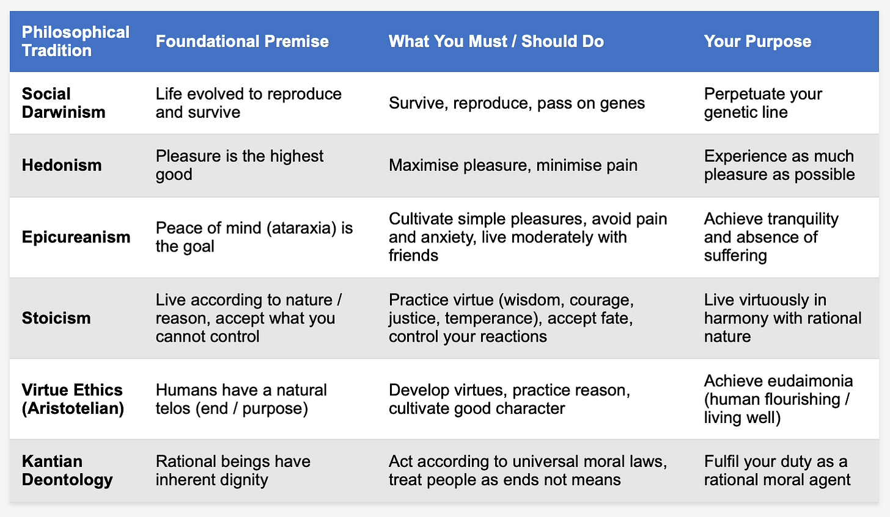

These represent the most basic answers philosophy offers. The first three say we’re either sophisticated animals fulfilling biological imperatives, or pleasure-seeking creatures trying to feel good. Epicureanism refines hedonism - noting that the best pleasure is actually the _absence of pain_. The virtue traditions say your purpose is to be _good_ , though they disagree about what that means. The Stoics say accept your fate with dignity. Aristotle says develop your potential for excellence. Kant says follow universal moral rules regardless of outcome. All assume there’s a ‘right way’ to be human that you should discover and follow.

### Self vs. Others: Whose Happiness Matters?

But even if there is a right way to live - whose wellbeing should we prioritise: our own, or everyone’s?

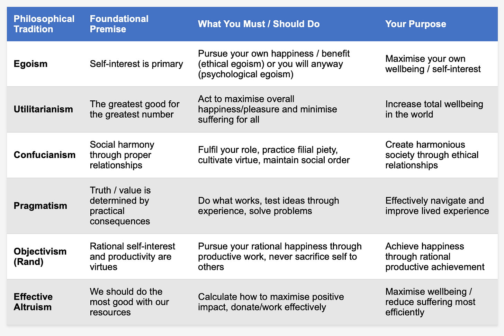

Here we see competing visions of how self-interest relates to purpose. Egoism and Objectivism say look after yourself - that’s natural and right. Utilitarianism flips this entirely: your purpose is to increase _total_ happiness, which might mean sacrificing your own. Confucianism embeds you in a web of duties and relationships. Pragmatism says forget abstract principles, just do what actually works. Effective Altruism applies calculational logic to helping others. What’s fascinating is how Objectivism and Utilitarianism both claim to be about happiness, yet reach opposite conclusions about whose happiness matters. And none of them question whether ‘your role’ or ‘what works’ might be defined by power structures that don’t serve human flourishing.

Philosophy gives us frameworks for thinking about purpose, but notice what it doesn’t give us: certainty, community, or clear answers about what happens after death. It can’t promise you’ll be rewarded for living correctly, because it can’t prove there’s anyone to do the rewarding. This is where religion steps in.

## Religion

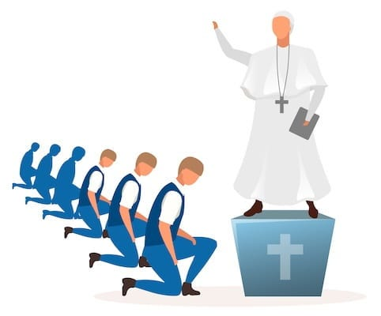

For most of human history, and for most humans today, the answer to ‘why do you exist?‘ has come not from philosophical reasoning but from religious revelation. Where philosophy offers competing theories and endless debate, religion provides certainty: God created you for a specific purpose, sacred texts reveal that purpose, and religious authorities can guide you in fulfilling it.

The appeal is obvious. Philosophy might leave you paralysed by choice or terrified by meaninglessness, but religion says: you matter, your life has cosmic significance, and there’s a clear path to follow. You’re not an accidental arrangement of atoms destined for oblivion - you’re part of a divine plan, loved by God, destined for a joyous eternity.

Spirituality and religion have given humans purposes that feel profoundly meaningful: find your place in the universe, feel part of the infinite, live in service to others, attain enlightenment or wholesome fulfilment. These are powerful, beautiful ideas that have inspired extraordinary compassion, sustained people through unbearable suffering, and built communities of mutual care. The question isn’t whether religion _can_ provide meaning and purpose, as clearly it can. The question is: at what cost? And who decides what that purpose actually is?

 **What Religion Offers That Philosophy Doesn’t:**

 **Certainty** : Philosophy thrashes about with competing theories and endless debate. Religion says: here’s the truth, written down, revealed by God, unchangeable. For people terrified by uncertainty or exhausted by choice, this is profoundly appealing. You don’t have to figure out ethics from first principles, just follow the commandments, the sutras, the divine law.

 **Community** : Philosophers might gather in academies, but religions build communities of practice - shared rituals, mutual support, collective identity. When you’re suffering or scared, a philosophy book won’t bring casseroles or sit with you through the night. A religious community might. This communal dimension is one of religion’s greatest strengths - humans are social creatures who need belonging, and religious communities can provide that powerfully.

 **Comfort about death** : Most philosophies offer either ‘you’ll cease to exist’ or ‘embrace mortality with dignity’. Religions offer heaven, reincarnation, reunion with the divine - something beyond the grave. When facing death (your own or a loved one’s), ‘you’ll be annihilated’ is cold comfort compared to ‘you’ll see them again in paradise’. This might be the single most powerful thing religion offers: the promise that death isn’t the end.

But here’s the catch: these benefits come packaged with institutional control. The certainty requires you accept someone else’s authority to define truth. The community demands conformity to maintain cohesion. The comfort about death requires believing specific, unverifiable claims. And across history, we see a troubling pattern: these institutions that promise purpose and community also demand obedience, extract resources, and punish deviation. The purpose they offer, whilst presented as divine will, often serves to perpetuate the institution itself.

 _None of this is meant to dismiss the real spiritual experiences and communities of care that religion creates. Plenty of people find genuine meaning and belonging through faith that has nothing to do with institutional control. But you can acknowledge that and still ask: do those things actually require a hierarchy to deliver them? Could community, meaning, and spiritual practice exist without someone at the top deciding what they look like?_

### Christianity & Islam - You Exist To Serve God

Even in an increasingly secular world no-one can doubt that religion is still a powerful force. Christianity and Islam have the most adherents globally - over 2.4 billion Christians and 1.9 billion Muslims, together comprising more than half of humanity. Both are Abrahamic monotheistic religions, sharing many foundational stories and revering many of the same prophets. Both offer clear, comprehensive answers to why you exist: you were created by God to worship Him, to live according to His revealed will, and to attain eternal life in paradise.

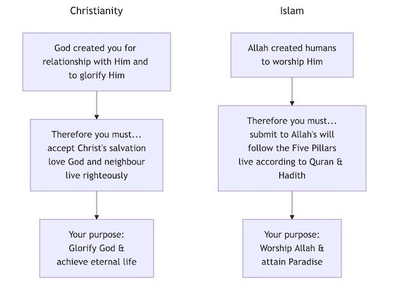

The theological logic is straightforward: God created you, therefore your purpose is defined by your Creator. To reject this purpose is to reject the very reason for your existence. And it comes with eternal stakes: get it right and receive paradise; get it wrong and face damnation. But there’s often a gap between what theology claims and what religious institutions require.

###  **The Institutional Needs Across Religions**

Not all of those who follow the Bible or Quran are part of a church or mosque, and not all religious organisations are hierarchical - but most are. And these institutions, whilst claiming to serve God and guide believers to salvation, also have their own very earthly needs. Let’s be honest about what religious institutions actually require from their members:

 **The Church’s Purpose for You:**

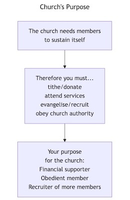

 **Financial sustainability** : Tithes, donations, zakat, temple offerings - you exist to fund the institution. Buildings need maintenance, clergy need salaries, programmes need budgets. Your regular financial contribution isn’t just encouraged, it’s often presented as a religious duty.

 **Reproduction/recruitment** : Evangelise, proselytise, raise children in the faith - grow the membership base. Religious institutions need to recruit to survive across generations. Your purpose includes bringing in new members, whether through conversion or through raising your children within the faith.

 **Obedience to hierarchy** : Follow religious authorities, don’t question too much, maintain the power structure. Clergy, imams, priests, rabbis - these positions hold authority that must be respected. Too much questioning threatens that authority, so doubt is often framed as spiritual weakness.

 **Political influence** : Your votes and activism advance the institution’s interests and cultural power. Religious institutions often have political agendas - laws they want passed, policies they want implemented. Your purpose includes being a reliable voting bloc, advancing institutional power in secular society.

 _To be fair, most believers and plenty of clergy genuinely think they’re serving something sacred rather than propping up an institution. The critique isn’t about anyone’s personal faith or motives. It’s about how the structures themselves create pressures that happen to align with institutional survival, whether or not anyone planned it that way._

 **The Institutional Logic:**

  * Religious organisations need money to pay clergy and maintain buildings

  * They need growth to increase power and resources

  * They need obedience to maintain hierarchical authority structures

 **The theological cover story** : ‘You exist to serve God/achieve salvation/reach enlightenment.’

 **The institutional reality** : ‘You exist to keep this organisation funded, populated, and powerful.’

This pattern isn’t unique to Christianity and Islam - it appears across most organised religions:

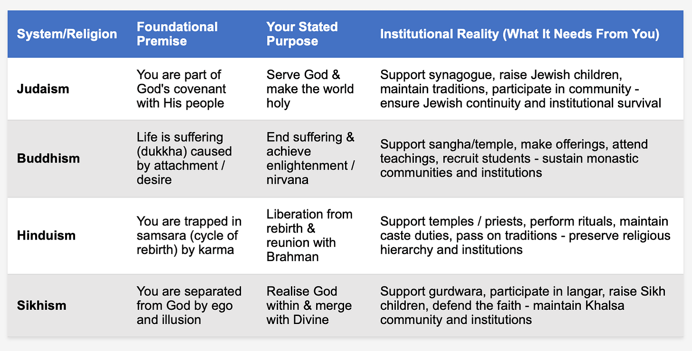

The pattern is clear: most systems claim to offer you transcendent purpose (salvation, enlightenment) whilst actually needing you to sustain their institutional power and reproduction. When the church tells you God wants you to tithe and raise your children in the faith - is that divine will, or is it what the church needs to survive?

We might think secular political systems would be different. Surely systems based on reason, economics, and material analysis wouldn’t replicate this pattern? Surely they’d serve human needs rather than demanding humans serve institutional needs?

But as we’ll see in the next part of this series, political and economic systems - whether capitalist, Marxist, or other - have their own remarkably similar answers to why you exist. And those answers, once again, align suspiciously well with what those systems need to reproduce themselves.

## Political & Economic Purpose

In Part 1, we examined how philosophy and religion answer the question ‘why do you exist?‘ Philosophy offered competing theories - you exist to reproduce, to be happy, to be virtuous, to create your own meaning - but no consensus and no way to enforce any particular answer. Religion stepped in with divine certainty: God created you for a specific purpose, and you’d better fulfil it or face eternal consequences.

But we noticed something troubling: despite their lofty theological promises about salvation and enlightenment, religious institutions consistently need the same earthly things from believers. Your money through tithes and donations. Your obedience to hierarchical authority. Your reproduction of the system by raising children in the faith and recruiting new members. Your political support to maintain institutional power. The pattern was clear: the ‘purpose’ you’re told you have aligns remarkably well with what the institution needs to perpetuate itself.

Political and economic philosophies aren’t exempt from suggesting personal purposes for people either. We might think we’ve left behind the authoritarianism of religious institutions when we embrace secular political systems. After all, these are supposed to be about human freedom, material wellbeing, rational organisation of society - not submission to invisible omnipotent beings.

But look closer and you’ll find the same pattern: systems that claim to serve human flourishing actually need humans to serve _them_. Whether it’s the market, the state, the party, or the revolution - your purpose gets defined by what the system requires to perpetuate itself.

The key difference is that political systems are often seemingly more straightforward about their utilitarianism. Religion promises eternal salvation whilst extracting tithes; political systems promise material prosperity whilst extracting labour. But the structure is the same: you exist to serve something larger that claims to serve you, and questioning this arrangement is treated as dangerous naivety or moral failure.

What makes this particularly insidious is that these systems present themselves as inevitable, natural, or scientifically necessary. Religion could at least be rejected as superstition, but capitalism and Marxism both claim to be based on rigorous analysis of material reality. They’re not asking you to have faith - they’re telling you this is just how economics _works_ , how history _progresses_ , how society _must_ be organised.

### Capitalism - You Exist To Serve The Market

Under capitalism, your purpose is remarkably simple: be economically useful. Be a productive worker creating value for capital owners. Be a reliable consumer purchasing goods and services. Your worth as a person is measured by your market value - what someone will pay for your labour, what you can afford to consume, how much you contribute to GDP growth.

This isn’t a conspiracy or hidden agenda, it’s the explicit logic of the system, openly defended by its most prominent theorists. Amongst the evidence that people exist to serve the market under capitalism is the following:

 **Commodification of labour** : Your capacity to work becomes a commodity sold on the market. You don’t exist as a person with needs and capabilities, you exist as ‘human capital’ that must be marketable, competitive, and productive enough to justify your consumption.

 **Market discipline** : The threat of destitution forces participation. You must offer something the market values or face poverty, homelessness, starvation. Your survival is contingent on market utility. This isn’t presented as a form of violence but as ‘economic reality’.

 **All value is market value** : Things only ‘count’ if they have market value. Caring for your own children, emotional labour, community building, art that doesn’t sell - these are treated as economically worthless despite being essential to human flourishing. Your worth is measured by what the market will pay for you.

 **Privatisation of everything** : Education exists to make you employable. Healthcare is a commodity. Housing is an investment. Parks need to generate revenue. Every space and relationship must justify itself through market logic.

 **Shareholder primacy** : Corporations legally exist to maximise shareholder value, treating workers and communities as mere inputs to be optimised. Your needs, your community’s needs, environmental sustainability - all these are ‘externalities’ to be minimised if they interfere with profit. The market becomes the arbiter of what activities, relationships, and people have value. You exist insofar as you serve market functions, as worker, consumer, or both.

 _Capitalism’s defenders would say none of this is violence, just reality. Scarcity exists, everyone has to contribute something, and markets are the most efficient way to sort that out. The problem is when that scarcity isn’t natural but manufactured, when property relations actively shut people out from resources they need to survive. At that point, calling destitution a ‘natural consequence’ rather than a structural choice is just a rhetorical trick._

 **Who’s Said This Explicitly?**

 **Milton Friedman** : In his famous 1970 essay ‘The Social Responsibility of Business is to Increase its Profits’, Friedman explicitly argued that corporations exist solely to maximise shareholder value. He saw market discipline - forcing people and businesses to serve market demands or perish - as the highest virtue.

 **Friedrich Hayek** : Hayek argued individuals must submit to market signals they don’t understand and can’t control, seeing this as _good_. He explicitly defended market discipline overriding human preferences: ‘We must submit to the anonymous and seemingly irrational forces of [economic] society.’ What’s striking is how these thinkers frame market subordination not just as _necessary_ but as _virtuous_.

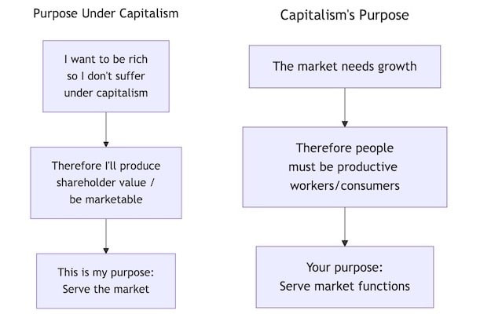

### Marxism - You Exist To Be A Productive Worker

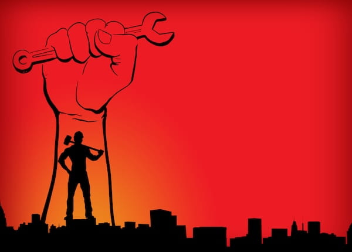

Marxism claims to liberate workers from capitalist exploitation, and in many ways, it does offer a powerful critique of how capitalism treats people as commodities. But look at what Marxism replaces it with: you still exist primarily as a productive worker, just now working for ‘the people’ or ‘the revolution’ instead of for private capital. Your purpose is still defined by your productive capacity, just directed towards different ends.

The promise is that once we develop productive forces sufficiently, we’ll reach a stage where work becomes freely chosen creative expression. But that’s always tomorrow. Today, your purpose is to produce.

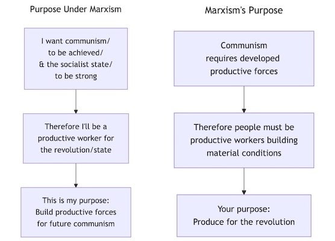

 _Marxists would push back here and say this isn’t arbitrary delay, it’s material necessity. You can’t conjure abundance before developing the capacity to produce it, and pretending otherwise is just wishful thinking. That sounds like a reasonable point. But historically, ‘once the conditions are right’ has had a way of meaning never, and there’s plenty of evidence that prefigurative practice, actually building the relationships and structures you want without waiting, isn’t just possible but creates better material conditions people benefit from right now._

 **Evidence For Marxism Focusing On People’s Purpose As Productive Workers**

In his early _Economic and Philosophical Manuscripts_ (1844), Marx argues that productive labour is fundamental to human nature - that humans distinguish themselves from animals through conscious, productive activity. His famous phrase ‘from each according to ability‘ from _Critique of the Gotha Programme_ (1875) centres productive contribution as the basis of communist society. Marx’s entire critique assumes that being separated from productive labour is a fundamental harm, that we’re defined by what we produce.

Marx distinguished between _labour under capitalism_ (alienated, forced drudgery) and _freely chosen creative production_. His vision wasn’t of everyone being worker-drones, but of people freely developing their capacities. In _The German Ideology_ , he imagines communist society allowing someone to ‘hunt in the morning, fish in the afternoon, rear cattle in the evening, criticise after dinner ... without ever becoming hunter, fisherman, shepherd or critic.‘

This sounds liberating. You’re not trapped in a single occupation, not defined by your job title, free to pursue various activities as you choose. But notice: you’re still doing things, producing, being active. Marx’s vision of freedom is freedom to engage in varied productive activities, not freedom from the expectation of productivity itself. But, this just means you exist to be a productive worker until Communism is fully achieved:

 **During the transition** : Even after revolution, the ‘lower phase of communist society’ (socialism) operates on ‘from each according to their ability, to each according to their _work_ ’. You’re still fundamentally compensated based on productive contribution. The withering away of this productivist logic gets deferred to some future higher phase. Freedom is always in the next stage.

 **The stages theory** : Historical materialism requires the productive forces to develop through capitalism before communism is possible. So multiple generations must live as productive workers to create the material conditions for eventual liberation. Liberation is always _tomorrow_. Today, you must produce.

 _To be clear, Marx does draw a real distinction between the grinding alienation of wage labour and the freely chosen productive activity he imagines under communism. The question is whether even his liberated version still treats productivity as the core measure of human worth, and whether freedom is really freedom if it keeps getting deferred until the material conditions finally catch up._

This contrasts sharply with anarchist (non-hierarchal) approaches that reject staged revolution and argue for immediately transforming social relations, without deferring freedom until after sufficient production or development. From an anarchist lens, Marx’s framework asks people to accept their primary identity as productive workers indefinitely, with the promise that someday they might transcend that.

### Anarchism - Pick A Purpose

Anarchism, at its core, is the idea that hierarchical authority — the kind where some people rule over others — is neither natural nor necessary, and that people are capable of organising their lives cooperatively, without being managed from above. Anarchists believe society works best when it is built from the ground up: through voluntary cooperation, mutual aid, and the freedom of people to shape their own lives and communities.

It could be said that within anarchism you exist to live life to the fullest and thrive as part of supportive communities, and that is true, if that is what you want. However, this is where anarchism fundamentally differs from both capitalism and Marxism - it tends to reject the idea that people need a singular prescribed purpose at all.

Where capitalism says ‘serve the market’, and Marxism says ‘be a productive worker for the revolution’, anarchism asks: ‘Why should anyone else define your purpose for you?’ The question itself is suspect. Who benefits when your purpose gets defined externally? Usually those doing the defining.

 **The Anarchist Answer (Or Non-Answer):**

 **No imposed purpose** : Anarchism’s core insight is that hierarchical systems define people’s purposes _for_ them (be productive for capital, be productive for the revolution, serve God, serve the state). The problem isn’t that they get the purpose wrong - it’s that they claim authority to define it at all. Anarchism says: you determine your own purpose, individually and collectively.

 **Autonomy/self-determination** : If there’s a ‘purpose’, it’s to be free to determine your own life and participate meaningfully in collective decisions that affect you. As Bakunin put it: ‘Liberty is the absolute right of all adult men and women to seek no other sanction for their acts than their own conscience and their own reason.’

 **Resistance to domination** : The ongoing project of dismantling hierarchies and power structures. But this is means and ends: freedom is practised in the act of resistance, not deferred to after the revolution. You resist hierarchy now, build horizontal relationships now, practice mutual aid now.

 **Mutual aid** : Kropotkin emphasised cooperation and mutual support as central to human flourishing, but this is descriptive (how humans naturally thrive) not prescriptive (what you _must_ do). Cooperation isn’t a duty imposed from above; it’s a strategy that emerges from our nature as social beings.

 **Free experimentation** : Malatesta and others emphasised trying different ways of living and organising, seeing what works. No blueprint, no predetermined endpoint.

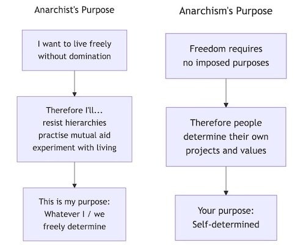

 **What Anarchist Thinkers Emphasise:**

Emma Goldman championed freedom, self-expression, and ‘everybody’s right to beautiful, radiant things’, famously declaring ‘If I can’t dance, I don’t want to be part of your revolution.’ Unlike Marxism’s staged revolution, anarchism insists on prefigurative politics, on creating the relationships you want _now_ , not after proper development. The quality of human relationships, freedom from domination, dignity, and solidarity matter more than productive output.

The anarchist ‘purpose’ might be: to live freely, in voluntary association with others, without domination, according to values and projects you choose. Or as the Situationists put it: ‘Boredom is always counter-revolutionary. Always.’ The point is living fully, not serving an economic function. But if that includes choosing boredom, you are entitled to do that too. This lack of imposed purpose is a feature, not a bug.

But self-determination doesn’t mean isolation. Anarchism recognises we’re fundamentally interdependent. The difference between anarchist community and institutional hierarchy is consent: you choose your communities, you can leave, you participate in decisions that affect you. When an anarchist community asks something of you, that’s fundamentally different from a state demanding taxes or a church demanding tithes. You participate because you chose to be part of it.

## Conclusion

So what’s your purpose? According to whom?

Look at the pattern across all these systems - religious, economic, political. They all claim to answer life’s deepest question: why do you exist? And remarkably, despite their different origin stories and promises, they keep arriving at the same answer: _you exist to serve the system_.

Serve the market by being a productive worker and reliable consumer. Serve the revolution by building productive forces. Serve the church by tithing, attending, recruiting. Always, your purpose is external to you, defined by institutions that claim to know better than you what your life should be for.

Each system makes promises: salvation, prosperity, liberation, meaning, security. But look at what they _require_ from you whilst delivering these promises. They need your obedience, your labour, your money, your reproduction of their values to the next generation. And crucially, they need you to believe that questioning this arrangement is foolish, dangerous, or impossible. Capitalism says if you reject market logic you’ll starve, there is no alternative. Marxism says if you don’t build productive forces, you’re counter-revolutionary. Religion says if you give in to your doubts you’ll burn forever.

Every system that defines your purpose for you is also, necessarily, a system of control. It has to be, otherwise you might not accept the purpose it’s assigned you. The market enforces compliance through poverty. The state through law and violence. The church through promises of damnation. The party through accusations of betrayal.

 **The Anarchist Difference**

Anarchism’s insight isn’t a competing answer to ‘what is your purpose?’ It’s a refusal of the question as posed by institutions. Not a rejection of purpose itself, but a rejection of anyone else’s authority to define your purpose for you.

There’s a world of difference between voluntary cooperation because you’re connected to your community, and coerced compliance because you’ll starve otherwise. Between finding meaning through freely chosen projects, and having meaning handed down from authorities who benefit from your compliance.

When you’re caring for someone you love, creating something beautiful, or building community - you’re _living_ , not serving institutional reproduction. Your purpose isn’t to serve the market, or the church, or the revolution, or any institution. It’s to _live_ fully, freely, in solidarity with others doing the same. Everything else is someone trying to harness your life for their own ends.

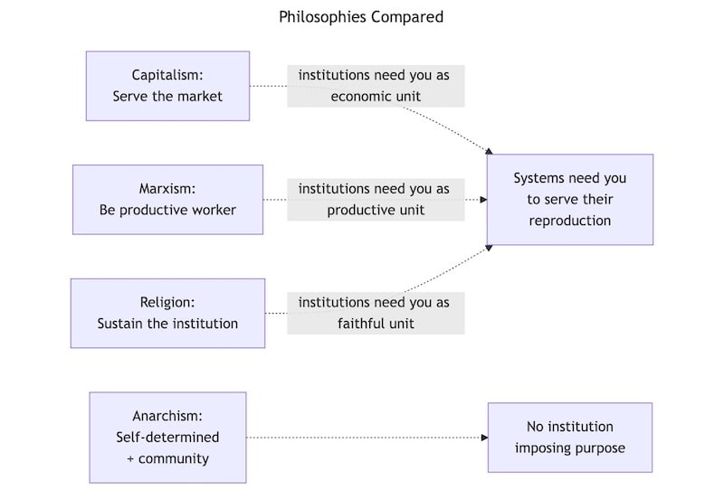

 _Some people genuinely find purpose and meaning in serving something larger than themselves - whether that’s God, their community, or a cause they believe in. Anarchism doesn’t reject this. What it rejects is the authority of hierarchical institutions to define that purpose for you, and the enforcement mechanisms that punish non-compliance. The difference is between chosen devotion and imposed duty._

Subscribe

[Share](https://peacefulrevolutionary.substack.com/p/why-do-you-exist?utm_source=substack&utm_medium=email&utm_content=share&action=share)

 _This article might also be of interest:_
