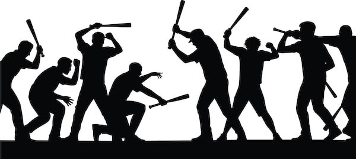

## What’s In A Word?

Whenever there is a disagreement between two people or groups, it’s important to define what they’re disagreeing over to be sure they’re actually at odds. When visiting different countries, even those that supposedly share the same language, you soon realise that the same word can mean different things in different contexts and cultures. For example, if one person in the Uk says ‘I like chips’ and another in America says ‘I hate chips,’ but the first means British chips (thick-cut fried potatoes) and the second means American chips (thin crispy potato snacks which Brits call ‘crisps’), they might not have any reason to disagree in the first place, they both like french fries.

Of course the opposite is true. Two people might think they both like punk, but one really likes 1970s punk rock music and another likes steampunk literature. The word ‘punk’ is used for both, but they describe entirely different things. Thus the first task in any discussion or debate is to define the terms used, and if possible agree on them, or explain why you disagree.

Anarchists are used to the word anarchy being mistaken to mean chaos, and it is a misunderstanding often quickly corrected if the other person you are speaking to is interested in understanding your position and beliefs. Where people have sincere and good intentions they will usually listen, engage, and be open to clarification and even correction if they are open-minded enough.

Yet not all misunderstandings about anarchism are so easily resolved. Some concepts require far more unlearning, especially for those raised in societies built entirely on hierarchical assumptions. When someone’s entire understanding of how society functions rests on the belief that someone must be in charge, that decisions require rulers to make them, and that order depends on obedience, anarchist ideas about organisation without domination can seem impossible, even incomprehensible. These deeper misunderstandings often reveal themselves not as simple confusion about words, but as fundamental disagreements about whether freedom without rulers is even possible.

However, when I speak to friends or co-workers, or even strangers I start chatting with whilst helping out with a radical book stall, and I use the words ‘hierarchy’ or ‘government,’ I usually presume people understand I’m speaking about a system in which one group rules over others (enforcing their decisions through threat of punishment, maintaining power through control of resources, law, or violence). Their responses usually confirm they share that understanding.

If someone expresses how much they dislike a politician or boss and I respond by saying I don’t think anyone should rule over anyone else, they never respond with ‘are you saying you hate doctors or scientists?’ Because in their daily lives, such people don’t rule over them. A doctor might advise you, but they can’t imprison you for ignoring that advice. A scientist might be an expert, but they don’t have the power to compel you to follow their findings.

However, when I speak online I sometimes find others take a different view, especially if they already believe wholeheartedly in an authoritarian political ideology, whether it be capitalism or Leninism. Why do they see it so differently, and where does that difference stem from?

## Is Self-Defence a Form of Hierarchy?

There are those who define hierarchy so broadly that they call any society hierarchical if it has any form of community or regional defence, arguing that any time you allow someone to use force they are exercising hierarchy over someone else.

This argument was first systematically used by Friedrich Engels in his essay ‘[On Authority](https://anarwiki.org/wiki/On_Authority_\(Book\))’ (1872), written in response to anarchist critiques of Marxist authoritarianism. Engels claimed that the act of one person restraining another – even in self-defence – constitutes authority, and therefore revolution itself requires accepting hierarchy. By this tortured logic, stopping someone from murdering you makes you just as authoritarian as a dictator.

This erroneous argument is as inaccurate as it is disingenuous. But it persists as if it is some holy doctrine which must be made true despite whatever contradictions arise against it.

It is remarkably similar to the argument fascists use: ‘If you stop us being fascists, you’re just as bad as us.’ It invokes the so-called paradox of tolerance, but this isn’t actually paradoxical, it’s simple consistency. If you want tolerance to be possible, you can’t allow intolerance of the kind that seeks to end tolerance itself. If you want freedom to exist, you must defend it against those who would destroy it.

Of course, if you’re someone convinced that a world without hierarchy is impossible, you might already assume that anyone who is anti-hierarchy will seem foolish and unrealistic, and thus be inclined to broaden the word ‘hierarchy’ far past its original meaning to include self-defence.

This is despite the fact that the word hierarchy has a very specific origin and common meaning which excludes such interpretations. Hierarchy comes from the Greek words ‘hieros’ (sacred) and ‘arkhein’ (to rule) – literally ‘rule by priests,’ but expanded to mean any system where some hold permanent power over others. It describes structured, enduring relations of domination: bosses over workers, kings over subjects, states over citizens. It does not describe a momentary act of defence.

The difference between self-defence and hierarchy lies in purpose, organisation, and permanence. Self-defence is reactive, temporary, and protective. You defend yourself or your community from immediate harm, then the action ends. Hierarchy is proactive, ongoing, and controlling. It exists to maintain ongoing power over others.

[Community defence](https://anarwiki.org/wiki/Community_Defense) means people voluntarily organising to protect their freedom from attack, with no one having enduring authority over others. Regional defence extends this principle across associated communities, still without creating a permanent ruling class. Armies and military hierarchies, by contrast, create lasting chains of command where officers have power over soldiers extending far beyond any immediate defensive need. Generals don’t just coordinate defence, they control when soldiers eat, sleep, speak, move, live, or die. That’s hierarchy.

Thus a person, community, or even an entire region can defend itself against attacks on its safety or freedom without creating irrevocable structures of domination. The difference isn’t whether force is used, but whether that force creates or protects freedom.

### False Equivalence: Conflating Defence with Domination

This argument commits a false equivalence fallacy, treating fundamentally different uses of force as identical. It conflates self-defence (temporary, reactive, protective) with hierarchy (permanent, proactive, controlling) simply because both involve the possibility of force. But the distinguishing characteristics aren’t whether force exists, but its purpose, duration, and whether it creates ongoing power relations.

When you defend yourself from an attacker, your exercising the first kind of authority (your own agency), not the second kind (power over others). The attacker tried to impose the second kind on you; your self-defence rejects it.

 **Is it defence or hierarchy?** _The test is simple – does it:_

  * Create permanent power relations where some command and others obey?

  * Extend beyond the immediate defensive need?

  * Establish a class of people with ongoing authority over others?

  * Make those subjected to it unable to refuse or leave?

If the answer is no – if it’s temporary, defensive, and doesn’t create lasting power structures – then it’s not hierarchy. It’s simply people protecting their freedom.

## Is Expertise a Form of Hierarchy?

There are those who believe that any society which has experts in any field (by virtue of their learning, training or experience) is hierarchical. They argue that such expertise makes you reliant on those with those skills and allows them to have power over you.

This misunderstanding arises because the word ‘authority’ is sometimes used to mean expertise, but the word ‘authoritarian’ is always used to mean dictatorial. These are fundamentally different concepts that use the same root word, leading to deliberate confusion by those defending hierarchy. The anarchist Mikhail Bakunin explained this distinction brilliantly in 1870:

> ’Does it follow that I drive back every authority? The thought would never occur to me. When it is a question of boots, I refer the matter to the authority of the cobbler; when it is a question of houses, canals, or railroads, I consult that of the architect or engineer. For each special area of knowledge I speak to the appropriate expert. But I allow neither the cobbler nor the architect nor the scientist to impose upon me. I listen to them freely and with all the respect merited by their intelligence, their character, their knowledge, reserving always my incontestable right of criticism and verification. I do not content myself with consulting a single specific authority, but consult several. I compare their opinions and choose that which seems to me most accurate. But I recognise no infallible authority, even in quite exceptional questions; consequently, whatever respect I may have for the honesty and the sincerity of such or such an individual, I have absolute faith in no one. Such a faith would be fatal to my reason, to my liberty, and even to the success of my undertakings; it would immediately transform me into a stupid slave and an instrument of the will and interests of another.’ _(What is Authority, 1870)_

When we consult an expert, we make a free choice to seek their knowledge. The surgeon doesn’t have power over us, as we have power to accept or reject their expertise. They can’t force us onto the operating table. Compare this to a boss who does have power over us: they can sack us if we don’t obey, leaving us unable to feed ourselves or our families. That’s the difference between expertise and hierarchy.

The existence of people with greater knowledge or skill in certain areas doesn’t create hierarchy any more than the existence of people with greater height creates hierarchy. What creates hierarchy is when some people can make decisions for others, compel others to obey, or control others’ access to what they need to survive.

One possible way to respond to these claims is to use a different word for hierarchy entirely. ‘Dictatorship’ sometimes works, as many Marxists (although not all) openly believe in a form of dictatorship, even if they argue it isn’t the same kind of dictatorship that the word typically describes. At least they’ll admit anarchists don’t believe in any kind of dictatorship, even theirs.

But we shouldn’t have to abandon perfectly good words because authoritarians deliberately misuse them. Hierarchy means rule, not skill. Domination, not knowledge.

### Equivocation Fallacy - When ‘Authority’ Means Two Different Things

This argument commits equivocation on the word ‘authority,’ deliberately conflating two entirely different meanings:

  * Authority as expertise (knowledge, skill, experience)

  * Authority as power (the right to command, compel, or control)

Just because the same word is used doesn’t make these things equivalent. It’s like arguing that a ‘bank’ of a river and a financial ‘bank’ are the same thing because they share a word.

There’s also a false equivalence at work, treating reliance on someone’s knowledge as identical to subjection to someone’s power. Yes, I might rely on a doctor’s expertise to diagnose my illness, but that doesn’t give them power over me. I can refuse their treatment. I can seek a second opinion. They can’t imprison me for ignoring their advice or withhold food from me for questioning their diagnosis.

Compare this to a boss. I might rely on them for my wage, but they have actual power over me: they can sack me, leaving me unable to survive. That’s not just expertise, that’s control over my access to resources necessary for life.

 **Is it expertise or hierarchy?** _The test is simple – does the relationship involve:_

  * The power to compel obedience through punishment or reward?

  * Control over resources you need to survive?

  * The ability to make decisions for you that you cannot refuse?

  * Permanent authority that extends beyond voluntary consultation?

A surgeon can advise you. A boss can sack you. That’s the difference between expertise and hierarchy.

## Is Leadership a Form of Hierarchy?

The words ‘leader’ and ‘ruler’ are sometimes used interchangeably, but when ‘leader’ is used in a positive sense it usually refers to someone who inspires others to do good, or someone who acts as a guide - leading the way forward because they know which route is safe, they have experience of that way, and have the skills to bring people there safely.

In that sense, anarchism could be said to have leaders and yet not have rulers. There will always be storytellers, motivators, those who set good examples, and show strength and intelligence which may be admired. But anarchists do not consider such people infallible or accept that they have the power to compel others. The moment someone can force you to follow them, they’re no longer leading - they’re ruling.

Things do get slightly more complex when discussing what some call ‘[pirate anarchy](https://anarwiki.org/wiki/Pirate_anarchy)’ and war chiefs. This is the idea that in the midst of battle you might need a single voice to coordinate fighters to react quickly and decisively. But even here, the principle holds: such fighters have voluntarily chosen to follow that person’s tactical decisions in that specific context. They’re never unable to refuse or leave, and they don’t give any special deference to that person outside of respecting their expertise whilst following them into battle. The moment that coordination becomes compulsion, or extends beyond its specific purpose, it ceases to be anarchist.

### Conflation Fallacy - Confusing Inspiration with Compulsion

This conflation of leadership with rulership commits a false equivalence fallacy, treating inspiration and compulsion as if they were the same thing simply because both might result in people following someone. But the means matter enormously. A charismatic speaker might inspire thousands to join a cause, whereas a dictator might compel thousands to join through threat of punishment. Both result in people ‘following,’ but one creates freedom and the other destroys it.

There’s also sometimes a slippery slope argument at work, in the suggestion that any form of coordination or respect for expertise will inevitably lead to hierarchy. But anarchist history shows this isn’t true. The Spanish Revolution had military coordinators, but they were accountable to their units and could be instantly replaced. That’s fundamentally different from a general who can have you shot for disobedience.

 **Is it leadership or hierarchy?** _The test is simple – does the leadership involve:_

  * The power to punish those who don’t follow?

  * Authority that extends beyond the specific, voluntary context?

  * Permanent power rather than temporary coordination?

  * The inability to refuse, leave, or choose a different leader?

If a ‘leader’ can force you to follow them, they’re not leading – they’re ruling. The difference between inspiration and imposition is the difference between freedom and tyranny.

## Does Anarchy Allow for ‘Justified Hierarchy’?

Some people try to expand the meaning of the word ‘anarchy’ to somehow allow for a group of rulers, or people who rule indirectly, if they are good enough or qualified enough or representative enough, even though anarchy literally translates to ‘[no rulers](https://anarwiki.org/wiki/Anarchism_Definition)’. It’s like telling an atheist they really believe in a god, as some Christians do, because they can’t conceive of people not believing in any god at all.

This often manifests through the argument that hierarchy is acceptable if it can be ‘justified’, which is a position notably attributed to Noam Chomsky. As I discussed in my previous article ‘[Any Justification For Hierarchy?](https://peacefulrevolutionary.substack.com/p/justification-for-hierarchy)’, Chomsky argued that ‘power is always illegitimate, unless it proves itself to be legitimate,’ placing the burden of proof on those claiming hierarchical authority. It can be a useful question to unravel the arbitrariness of those seeking to justify hierarchal claims.

However, the problem with this position is that it suggests that hierarchy can be legitimate if the right justification is provided. But no justification is sufficient. Not voting, not gods, not merit, not expertise, not emergency, not the ‘greater good.’ Because with every argument, there are counter-arguments and examples of atrocities that happened directly because of accepted hierarchy, even when it seemed to start with good intentions, even when systems existed to keep it in check.

We are born free. At least we are born without any limits except those imposed by nature or necessary to keep us safe. No one is born with a right to rule over someone else, and no one consents to being subject to another’s hierarchy from the moment they’re born. Thus, the default position is anarchy: no hierarchy. Any claim to rule over others is an unjust hierarchy that must be dismantled, not just debated.

On the left of the political spectrum, this happens by downplaying the power of a party chairman or presiding committee. They pretend that a ‘[vanguard party](https://anarwiki.org/wiki/Vanguardism)’ directing the revolution is somehow not hierarchy because it claims to represent ‘the people.’

On the other side of the political spectrum, right-libertarians ([propertarians](https://anarwiki.org/wiki/Propertarianism)) have used the word ‘anarchy’ differently – even to sometimes include a minimal form of government (minarchism) – whilst happily accepting economic hierarchy. They’ll object to political authority but defend a boss’s authority, as if the power to starve you is somehow less coercive than the power to arrest you.

But the word ‘anarchy’ doesn’t allow for either of these interpretations, no matter how much some people might want it to. Few people like the idea of being ruled over politically or economically, hence why people find anarchy so appealing. So authoritarians try to co-opt the word, claiming their particular flavour of rule is actually freedom. They try to move the goalposts enough to say anarchists are not so different from groups that accept rulers, when nothing is further from the truth.

### Slippery Slope Fallacy - Every Tyrant’s Favourite Exception

This ‘justified hierarchy’ argument commits several logical fallacies. First, there’s special pleading, that is the idea that we should apply one standard to hierarchy in general (burden of proof, presumption of illegitimacy), but make an exception for this particular hierarchy because of some supposedly unique circumstance. Every tyrant in history has claimed their rule was the justified exception.

There’s also a slippery slope built into the framework itself. Once you accept that hierarchy can be ‘justified,’ you’ve opened the door to endless debate about what constitutes sufficient justification. Is preventing harm sufficient? Is economic efficiency? Is maintaining order? Is the ‘will of the people’? The goalposts can always be moved, and those with power will always find philosophers ready to provide justifications.

More fundamentally, it commits a false premise: the assumption that consent can be given under conditions of coercion. If I can ‘justify’ my authority over you by pointing to your ‘consent,’ but you’ll starve without access to what I control, or you’ll be imprisoned if you try to leave, then that consent is meaningless. It’s like saying someone consents to hand over their wallet when threatened with a knife because they chose to give it rather than be stabbed.

 **Is it justified anarchy or hierarchy?** _The test is simple – does the arrangement:_

  * Allow for genuine, un-coerced consent from all involved?

  * Permit withdrawal of that consent without punishment?

  * Avoid creating permanent power of some over others?

  * Leave everyone free to refuse or find alternatives?

If your ‘justified hierarchy’ involves someone born into subjection, unable to refuse, punished for leaving, or denied alternatives, then no justification makes it legitimate. You cannot justify someone having power over another person’s life when that person never had the option to refuse.

## Does Anarchism End Up Allowing or Creating a Government?

If someone expresses how much they dislike the government and I respond by saying I don’t think there should be any government, they never respond with ‘are you saying you hate community centres or book clubs?’ If I say ‘government,’ they understand that to mean a group of people governing over other people, such as a state ruling body that cannot be opted out of and that has the means of force to carry out its decrees.

Yet there are some who argue that if an anarchist society shares any organisational aspect with any government, then that anarchist society really has a government, even if there’s no one governing and no governing involved.

They claim that if an anarchist society has communities that voluntarily belong to a system of distribution between each other, then this is somehow a form of government. By this logic, a group of friends sharing dinner is a government. A book library is a government. A friendly Sunday football game is a government. It renders the word meaningless.

This is used by those outside of anarchism to try to prove that government is inevitable, and even by some on the fringes of anarchism if they support a more extreme primitivist or individualist form of anarchism.

But if someone can’t get past the idea of all organisation being synonymous with government – even if it doesn’t govern – then they still need to justify why their organisation requires rulers. Conflating anarchist organisation with government doesn’t suddenly justify every form of government or every kind of ruling structure. It still raises the question: whatever you call such organisation, should someone be able to rule over you?

The distinction is simple: government is organisation plus domination. Anarchist organisation is coordination without domination. In a government, you have no choice but to participate and obey. In anarchist organisation, you can choose to associate or not, to participate or not, with no one having power to punish you for your choice.

### Straw Man Fallacy - Making ‘Government’ Meaningless

The argument conflates ‘organisation’ or ‘coordination’ with ‘government’, treating them as identical simply because they share some superficial features. But the distinguishing characteristics of government aren’t that people organise or have expertise; they’re:

  * Hierarchical authority (power of some to command others)

  * Coercive enforcement (ability to compel compliance)

  * Monopoly on legitimate violence (exclusive right to use force)

  * Involuntary membership (you can’t simply opt out)

An anarchist society with voluntary federations, rotating facilitation roles, and horizontal decision-making is fundamentally different from a state with police, taxes, and rulers – even if both involve ‘organisation’.

The equivocation aspect comes from using ‘government’ to mean two different things:

  * Any form of coordination whatsoever

  * A specific system of hierarchical, coercive authority

By this logic, a book club has a ‘government’ because it has organisation, or a football team has a ‘government’ because it has players with different expertise and roles. The term becomes meaninglessly broad.

There’s also sometimes a straw man element if the argument misrepresents anarchism as opposing all organisation, expertise, or coordination, rather than opposing involuntary hierarchy and coercive authority.

 **Is it organisation or government?** _The test is simple – does it:_

  * Claim the right to make decisions for you without your ongoing consent?

  * Have the power to punish you for non-compliance?

  * Prevent you from opting out or choosing alternatives?

  * Maintain a monopoly on force within a territory?

Having people knowledgeable about bridge-building doesn’t create a government unless those engineers gain authority to compel others. The difference between ‘I know how to build bridges’ and ‘I can force you to build bridges my way’ is precisely what anarchism hinges on.

## Is Anarchism Just Democracy by Another Name?

There is one misunderstanding I do have much more sympathy for, and that is the association of anarchism with democracy. This word has been used so broadly (even by anarchists) that it’s understandable people might be confused, and it’s useful for distinctions to be made.

Democracy has been used in various ways, especially ‘direct democracy.’ This is because democracy can be seen positively as people having a say and control over their own lives, which is a very anarchist concept. When we say we want people to have power over their own lives and when we advocate for direct participation rather than representation, this sounds democratic.

Some have even used the term ‘direct democracy’ in this context. But it does not and has never meant that anarchists believe in majority rule – that people can vote on and restrict others’ freedoms and rule as a mob over a minority. Anarchism respects individual freedom as much as it respects collective freedom and has no mechanisms for one group’s will being imposed on another group. If that occurred, it would cease to be anarchism.

Democracy, in its common usage, often refers to majority rule: 51% can outvote 49% and force them to comply. This is tyranny of the majority, just a softer form of tyranny than dictatorship. Anarchism rejects this entirely. We don’t believe three people should be able to vote to enslave two people, no matter how ‘democratic’ the process.

Democracy commonly refers to [representative democracy](https://peacefulrevolutionary.substack.com/p/what-wont-change-the-world), which always inevitably leads to mini-rulers, often ruled over by a party head or heavily influenced by their corporate sponsors, which is antithetical to anarchism. Anarchism has always been against representative democracy because representation is just a polite word for letting someone else make decisions for you.

But there is another area of confusion that arises from the anarchist concept of confederation, which is when communities or groups work together, a process which may even involve temporary, limited, recallable delegates.

Confederation isn’t hierarchy because delegates have no power to make decisions. They only communicate decisions already made by their communities and can be instantly recalled if they misrepresent them. Think of them as messengers, not representatives. They don’t rule; they report. And crucially, confederation is voluntary. Communities can join, leave, or work with multiple confederations simultaneously. No one can force a community to participate or punish them for leaving.

This is fundamentally different from government, where representatives have power to make binding decisions, cannot be instantly recalled, and where you cannot opt out without moving to a different territory controlled by a different government. In confederation, the power flows upward from individuals and communities. In government, power flows downward from those who claim authority to rule.

Yet anarchism not only allows for association between people and groups, but disassociation too. Not only that, but it allows for separate groups to fulfil the same or similar functions in parallel if wanted, and for people to take no part, be separate from, and give no agreement or power to any other group. If a confederation of communities organises rubbish collection, you’re free to handle your own rubbish differently, or join with other communities to create a different system.

### Appeal To Definition Fallacy - Democracy as Self-Rule vs Majority Rule

This conflation of anarchism with democracy commits equivocation on the word ‘democracy’, using it to mean radically different things:

  * Self-determination (people controlling their own lives)

  * Majority rule (51% controlling the other 49%)

These are not the same. One is about individual and collective autonomy, the other is about one group having power over another group, albeit a smaller group than under monarchy or oligarchy.

There’s also a false equivalence at work – treating consultation and consensus-building as if they were the same as voting and enforcement. Yes, anarchist communities discuss decisions collectively, but that’s fundamentally different from a democracy where a majority vote creates an obligation enforced by police.

The argument sometimes includes appeal to definition: claiming that because anarchism involves ‘people power’ and democracy means ‘people power,’ they must be the same thing. But this ignores how that power operates. In democracy, ‘the people’ means ‘the majority,’ and their power is exercised over the minority. In anarchism, ‘the people’ means individuals and voluntary communities, and their power is exercised over their own lives, not others.

 **Is it anarchy or ‘democracy’?** _The test is simple – does the decision-making process:_

  * Require unanimous consent from all affected, or allow people to opt out?

  * Avoid giving a majority the power to coerce a minority?

  * Permit individuals or groups to refuse participation without punishment?

  * Allow for multiple parallel solutions rather than one imposed answer?

If your community can vote 6-4 to force the minority to comply, that’s mob democracy, not anarchy. If your community can only make decisions that apply to willing participants, allowing others to abstain or do things differently, that’s anarchy. The difference is whether anyone has power over anyone else, not how many people share that power.

## Conclusion

In defending the word ‘anarchy’ from these deliberate misrepresentations, we’re not being pedantic. We’re protecting the very concept of freedom from those who would water it down until it means nothing. When authoritarians claim that expertise is hierarchy, that self-defence is domination, that coordination is government, and that temporary tactical leadership equals permanent rule, they’re trying to make us believe that freedom from rulers is impossible and hierarchy inevitable.

But we know better. We experience freedom in our friendships, our communities, our voluntary associations every day. We know the difference between someone sharing their knowledge and someone controlling our lives. We know the difference between choosing to cooperate and being forced to obey. We know the difference between defending ourselves and ruling over others.

Anarchy means no rulers. Not ‘better rulers’ or ‘justified rulers’ or ‘democratic rulers.’ No rulers. It’s that simple, and that radical. Don’t let anyone convince you otherwise.

Subscribe

[Share](https://peacefulrevolutionary.substack.com/p/misunderstanding-anarchism?utm_source=substack&utm_medium=email&utm_content=share&action=share)

This is part of both the [Whats In A Word](https://peacefulrevolutionary.substack.com/about#§whats-in-a-word-series) and [Hierarchy series](https://peacefulrevolutionary.substack.com/about#§hierarchy-series)
