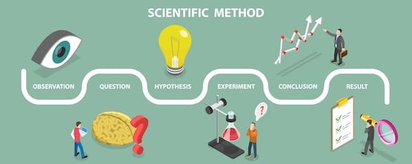
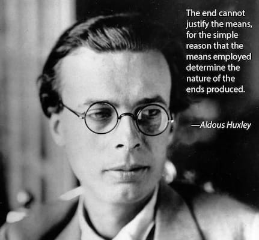

### The Question That Changes Everything

What if the most radical political position is actually the most obvious one? What if, instead of needing to justify why imposed hierarchy is bad, we should be demanding proof that it’s ever good?

Most people think the absence of hierarchy (anarchy) requires faith in humanity’s goodness or a utopian vision of the future. They’ve got it backwards. Anarchism is like atheism: it’s not a belief, it’s the absence of belief in the necessity of others ruling over us. Anarchy literally means ‘without rulers’ just as atheism means ‘without god’.

Atheists don’t need faith to disbelieve. They simply don’t accept the claim that gods exist until someone proves it. The burden of proof falls on the person making the extraordinary claim (‘there’s an invisible being who created everything’), not on the person saying ‘show me the evidence.’

Anarchism works the same way. We don’t accept the claim that some people have the right to rule over others until someone proves it. The burden of proof falls on those claiming authority over others, not on those questioning it.

Atheism says: ‘I don’t believe your God claim until you prove it.’ Anarchism says: ‘I don’t believe your hierarchy is justified until you prove it.’ And just as atheists can say ‘show me the evidence and I’ll reconsider,’ anarchists can say the same. We’re open to evidence. We just haven’t seen it yet.

Of course every tyrant can give a dubious reason for their position, but a claim doesn’t have weight just because someone with power makes it or uses violence to maintain it. The atheist might be burned at the stake for their heresy, and an anarchist might be imprisoned for their impertinence, but neither affects the truthfulness of the argument they are making.

Consider what we’re actually being asked to accept. We are born without any knowledge of a state. No one consents to the state’s authority at birth; it’s simply declared over us, the same way a child is told to obey without explanation. As the historian Robert Higgs put it: 

> ‘In debates between anarchists and statists, the burden of proof clearly should rest on those who place their trust in the state. Anarchy’s mayhem is wholly conjectural; the state’s mayhem is undeniably, factually horrendous.’ 

The evidence bears this out. The disasters of stateless society are speculative. The disasters of states, the wars, the gulags, the famines, the colonialism, are documented history.

You don't need faith to be an anarchist, whereas to be a hierarchist you need faith to believe that _this time_ , _these_ rulers will be different, _this hierarchy_ will liberate you, and _this_ _concentration of power_ won’t corrupt. The burden of proof is on anyone claiming people need to be ruled, they are the ones making an extraordinary claim, and it is their responsibility to produce the evidence for it. 

They are the ones who need to show an example of a hierarchical system that didn’t ultimately become corrupt if they want us to take them seriously. Until then, the real question isn’t whether authority needs justifying, it’s why so many people keep accepting it without asking.

### The Falsifiability Test

Although anarchism doesn’t need to justify itself the way hierarchy does, there’s a separate, practical question worth taking seriously: Even if a world without hierarchy is theoretically better, is such a world actually achievable? 

If every attempt at mutual aid, cooperation, and voluntary association consistently failed to meet people’s needs, whilst every hierarchy consistently succeeded without exploitation, only then would the argument for rulers being essential have merit.

However, the evidence points the other way. Worker cooperatives work. Mutual aid networks work. The Free Territory of Ukraine, Revolutionary Catalonia, the Zapatistas, and Rojava all functioned. Some were crushed by external hierarchies, but not by internal failure. Meanwhile, every authoritarian ‘temporary’ state became permanent and oppressive. Every promise that ‘we’ll dissolve once the transition is complete’ turned out to be a lie.

We don’t have to prove that anarchism would work perfectly at a massive scale in every area, because that burden falls on the other side. Our core claim, that concentrated power corrupts, has mountains of evidence. The claim that this time hierarchy will lead to different results has none. So the practical question, whether anarchism is achievable, remains genuinely open. The theoretical question, whether hierarchy is justified, does not.

The case for hierarchy would only hold if concentrated power consistently produced better outcomes than horizontal organisation, and did so without the corruption, oppression, and violence we always see accompanying it. But the evidence is overwhelmingly against hierarchy. How many failed states, how many dictatorships, how many broken promises of ‘temporary’ authority do people need before they accept the reality that hierarchy is always dangerous? No state has ever voluntarily dissolved itself. Every revolutionary authority that promised to dissolve once the transition was complete has broken that promise. The pattern is consistent.

Those who want to justify their preferred form of political authority tend to reach for elaborate theoretical frameworks, but any philosophical system that is built backwards from its conclusions will always confirm them, regardless of whether it matches reality. That’s not science, that’s circular reasoning. When every historical counterexample gets reinterpreted to fit the theory rather than test it, you’re not doing analysis, you’re doing religious apologetics.

Anarchism doesn't need a counter-theory. It just needs the question to be taken seriously. Anarchism asks for something simpler: scepticism toward arbitrary authority. No need for faith in someone else’s theory, just apply the same standards of proof to claims of hierarchy that you'd apply to anything else. 

The fundamental tension isn’t just capitalism versus workers, but domination versus autonomy, the recurring pattern across all of history and all cultures of some humans claiming authority over others, and others refusing it. This pattern is observable, repeatable, and requires no special framework to recognise. You’ve lived it.

### We Are Born Anarchists

The burden of proof falls on hierarchy for a simple reason: Anarchism is what humans do naturally. Hierarchy has to be beaten into us.

Think about your own childhood. Did anyone have to teach you to share your toys with friends? To cooperate in games? To help someone who fell down? No, those impulses are natural. What you _were_ taught was to ‘respect authority,’ to ‘do as you’re told,’ to stop asking ‘why?’ Children instinctively question ‘why do I have to?’, and that resistance has to be broken through socialisation. We have to teach children to obey. We don’t have to teach them to play cooperatively; they do that naturally when adults don’t interfere.

Think about how you organise with friends. You don’t elect a Friend Leader with power over the group. Horizontal cooperation is what we do naturally amongst equals. Hierarchy only emerges when there’s inequality to protect. Create equals and they organise anarchistically by default.

Take the long view. Humans lived in relatively egalitarian bands for 200,000 years or more. Rigid hierarchy is only 10,000 years old, a tiny fraction of human existence. Which is the aberration? Indigenous societies worldwide had to be violently forced into hierarchical structures. They didn’t adopt them because they’re ‘better.’ They were conquered.

Notice what happens when authority disappears: do people immediately start killing each other, or do they start helping each other? Every disaster proves the anarchist case. In floods, earthquakes, and crises, people spontaneously self-organise and help each other. Mutual aid groups form organically whenever the state fails. Hierarchy has to be deliberately reconstructed and reimposed afterwards.

Most of what makes society function is already anarchist: neighbours helping each other, parents caring for kids, friends sharing resources. The state takes credit for what we do naturally. Every hierarchy needs constant reinforcement through police, propaganda, socialisation, and threats. Mutual aid just happens.

If hierarchy were natural and beneficial, it wouldn’t require constant violence to maintain. The default position wouldn’t need enforcement. Anarchy is what happens when no one is forcing you to obey. Hierarchy is what has to be imposed.

### The Simple Principle & What Follows

Now we get to the elegant simplicity of anarchist theory.

 _Do you believe people should be ruled over by other people?_

No? You’re an anarchist.

Everything else follows from this one principle. It’s not complicated; it’s just the consistent application of that answer across every area of life. If people shouldn’t rule over other people, then we must reject every system and structure built on domination.

In the economy, this means rejecting bosses. If people shouldn’t rule over others, then workers shouldn’t be ruled by bosses who tell them what to do, when to do it, and take the value they create. Which means rejecting capitalism itself, because capitalism is a system where bosses rule over workers. Which means rejecting wage labour: when you must sell your labour to survive and someone else controls your work, you’re being ruled. ‘Work or starve’ is coercion, not choice.

It means rejecting private ownership of the means of production. When someone ‘owns’ the factory or land and can exclude others, they rule over those who need it. Ownership is just another word for authority over resources. Landlords rule over tenants, setting rules, taking money for permission to exist in a space. Rent, profit, interest: all ways of extracting value from people’s labour without contributing. That’s exploitation, which requires hierarchy to enforce.

In politics, this means rejecting the state itself, because the state is literally an institution that claims the right to rule over people in a territory. It means rejecting politicians and representatives, since if people shouldn’t be ruled, they shouldn’t have ‘representatives’ making decisions for them. No one can legitimately represent your will except you. It means rejecting even voting and democracy as currently practised, because majority rule is still rule. Fifty-one per cent shouldn’t dominate forty-nine. Real consensus means everyone affected has a say, not just a vote counted amongst millions.

It means rejecting laws backed by violence in favour of voluntary agreements and social norms. Rejecting borders and nations, those imaginary lines where one group of rulers claims authority. Nationalism is just loyalty to your particular set of rulers.

In enforcement, this means rejecting police, who exist to enforce the rule of the state and protect property, the armed wing of hierarchy. Rejecting prisons, which are cages where the state locks people who violate its rules. Punishment and control, not healing or justice.

In society, this means rejecting patriarchy, rejecting homophobia and transphobia, rejecting racism and white supremacy, rejecting ableism, rejecting adult supremacy over children, and rejecting religious authority wherever leaders claim power over others’ moral lives. One principle, consistently applied, dismantles every system of domination we live under. The objection, of course, is that none of this addresses how we get there.

#### What Emerges When Domination Is Removed

Anarchism isn’t just about what we oppose. It’s about what emerges naturally when domination is removed. This isn’t utopian dreaming, it’s observing what humans already do when they’re free to cooperate.

In workplaces, instead of bosses, you get worker control: people who actually do the work deciding together how to organise their labour. Production shifts from profit to use. We make things because people need them, not to sell for money. Resources become commons, with land, water, tools, and knowledge accessible to all rather than hoarded by owners. When no one can force you, everything you do is because you chose it.

In communities, instead of distant representatives, you get direct participation and consensus where everyone affected by a decision participates in making it. Decisions are made at the most local level possible, coordinating more broadly only when truly needed. Communities federate horizontally, sending delegates with specific mandates who can be instantly recalled, not representatives with power to decide for you. Responsibilities rotate so no one accumulates power. Different communities organise differently; that’s the point. Freedom means diversity, experimentation, adaptation.

For conflict and safety, instead of punishment, you get restorative justice: healing harm and addressing root causes, bringing together those harmed and those who harmed to repair relationships. Communities look after each other, with people held accountable by those affected rather than distant authorities. Collective self-defence when necessary, but no permanent armed force that can become a new hierarchy.

For a free life, instead of enforced roles, you get gender liberation, sexual freedom, and genuine body autonomy. Universal access replaces payment barriers, so everyone can reach housing, food, healthcare, and education. Things necessary for life stop being bought and sold.

The pattern is simple: remove hierarchy and coercion, ask what people would freely choose, and that’s what anarchism supports.

### Prefiguration: Building the New World Now

‘All well and good,’ you might say, ‘if we were starting from scratch. But we’re not. Hierarchy already exists, deeply entrenched, with armies and police and centuries of accumulated power. How do you possibly get from here to there?’

That’s a fair question, and here’s the honest answer: it’s difficult, but the evidence suggests it’s achievable. Hierarchies don’t dissolve themselves. They defend their existence with violence. Every structure of domination has people who benefit from it and will fight to preserve it. But this isn’t an argument against anarchism. It’s an argument against gradualism and reform.

When you try to change a hierarchical system from within, using its own tools and rules, you’re not dismantling it, you’re participating in its reproduction. You vote for better politicians, and the state remains. You negotiate with your boss for better wages, and capitalism remains. You ask the police to be nicer, and the police remain. Reform asks permission from power to limit power. Those in power will offer just enough concessions to prevent revolution and then claw them back when the pressure’s off. Every welfare state built by social democrats is being dismantled. Every union victory is later undermined. Every ‘progressive’ politician becomes part of the machine they promised to change.

The system doesn’t resist change because people within it are uniquely evil. It resists change because that’s what systems do: they perpetuate themselves. A state will always act to preserve the state. Capitalism will always act to preserve capitalism.

One anarchist approach is to build alternatives alongside hierarchy rather than trying to reform it. This is called prefiguration, and it’s one of anarchism’s most important ideas. The means must match the ends. You cannot build a free society through unfree methods. You cannot abolish hierarchy by seizing control of hierarchical structures. The revolution isn’t an event that happens and then produces a new world afterwards, the revolution is the new world, being built right now, in the way we organise today.

Aldous Huxley, author of Brave New World

Prefiguration means that every anarchist project embodies anarchist principles in its structure, not just its stated goals. A worker cooperative doesn’t just produce goods, it demonstrates, daily and concretely, that workers can manage their own affairs without bosses. A community mutual aid network doesn’t just distribute food, it enacts the principle that people look after each other without the state’s direction or permission. How we organise is inseparable from what we’re organising for.

This is why anarchists reject seizing state power in order to transform the state from within, or forming political parties to gain power with the intention of using it well. Even if you trusted those intentions completely, the method corrupts the outcome. Hierarchical means produce hierarchical ends. Every ‘temporary’ revolutionary state in history has demonstrated this without exception.

So we don’t wait for permission. We don’t vote for someone to create worker cooperatives, we and our colleagues form one. We don’t petition the state for food security, we start a community garden and a free food programme. We don’t ask police to protect us, we organise neighbourhood mutual aid and conflict resolution. Each of these is simultaneously practical solidarity and a living argument against hierarchy. Every time it works, it refutes the claim that we need rulers.

This is already happening, and has been for a long time. Worker cooperatives like Mondragón employ almost a hundred thousand. Cooperation Jackson is building a solidarity economy in Mississippi. The Zapatistas have governed themselves for thirty years. Rojava has millions of people living under democratic confederalism. Tool libraries and free stores operate in cities worldwide. Mutual aid networks mobilised faster than any government during the pandemic.

None of these are waiting for the revolution. They _are_ the revolution, expressed in present tense. They are not preliminary sketches for a future society. They are that society, already existing, already functioning, already proving that the hierarchical alternatives are not inevitable.

The transition isn’t a single moment but a process. As hierarchical systems fail to meet people’s needs, our alternatives become more necessary and more viable. People turn to mutual aid because the state abandoned them. They form cooperatives because capitalism has bled them dry. They organise self-defence because police don’t protect them. Every time someone chooses the anarchist alternative over the hierarchical one, hierarchy loses legitimacy and power.

This is already happening: Hierarchies are struggling, states are failing, capitalism is cannibalising itself, and climate change is destroying the systems that depend on infinite growth. We don’t need a perfect blueprint for post-revolutionary society. We need to build alternatives strong enough to survive when the current systems collapse, and they will collapse. The question isn’t whether but when, and whether we’ll have something better ready to replace them or descend into authoritarian chaos.

The transition requires building new structures whilst living under the old ones. It requires risk: occupying workplaces, defending communities, and refusing to obey. It requires solidarity across borders and differences, and patience and willingness to experiment and fail and try again.

But consider the alternative: continuing to live under systems that are destroying the planet, exploiting billions, and marching towards authoritarianism and collapse. Waiting for those systems to reform themselves. Having faith that this time the hierarchy will be different.

Which actually requires more faith: believing that hierarchy will suddenly stop being hierarchical, or believing that people can organise their own lives given the chance?

Anarchism is not asking you to believe in a utopian vision. It’s asking you to start building the world you actually want to live in today, in the way you organise your workplace and your community and your relationships. Because the means are the ends and the practice is the theory, and the time to start is now.

Subscribe

[Share](https://peacefulrevolutionary.substack.com/p/the-default-position?utm_source=substack&utm_medium=email&utm_content=share&action=share)

 _If you liked this article you might also like this one:_
