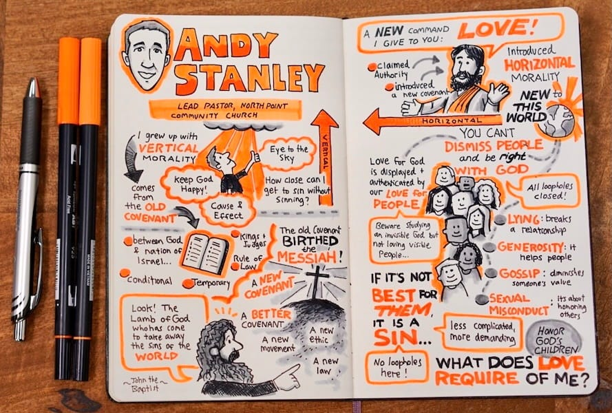
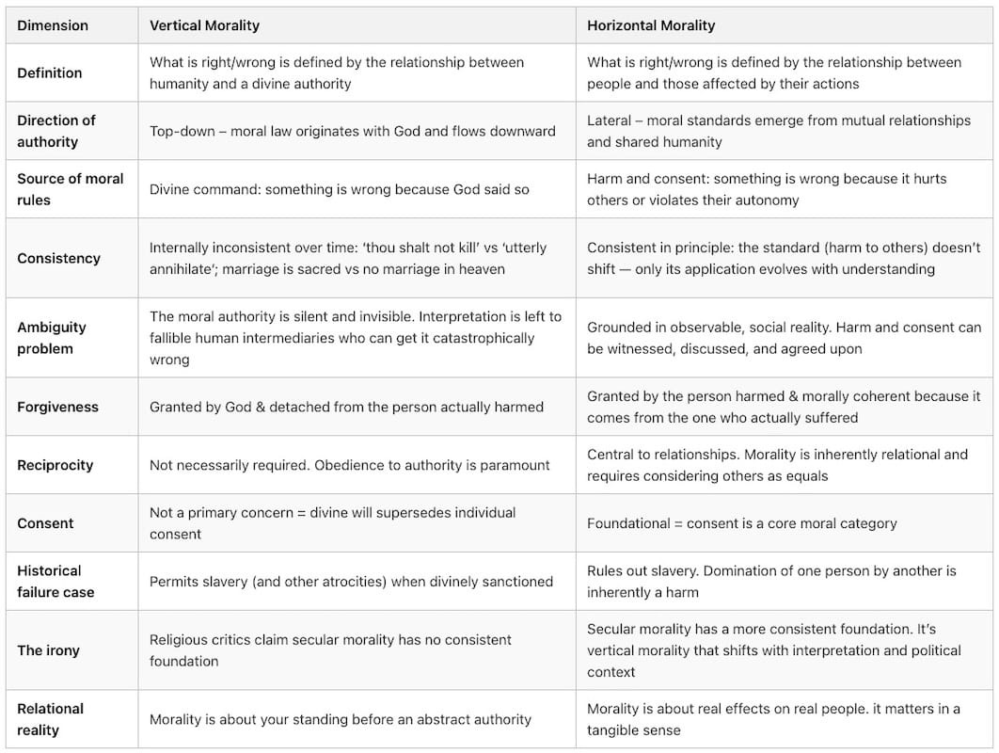
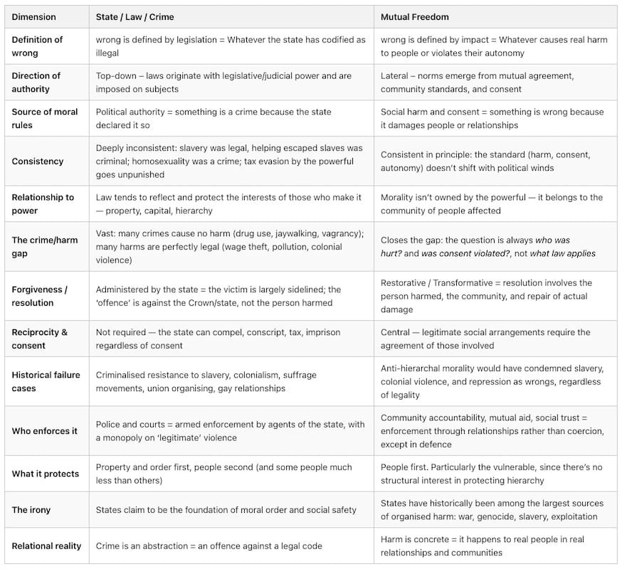
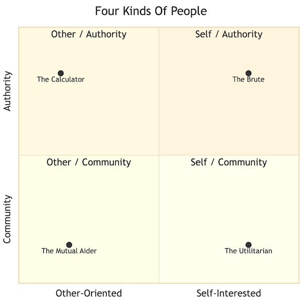
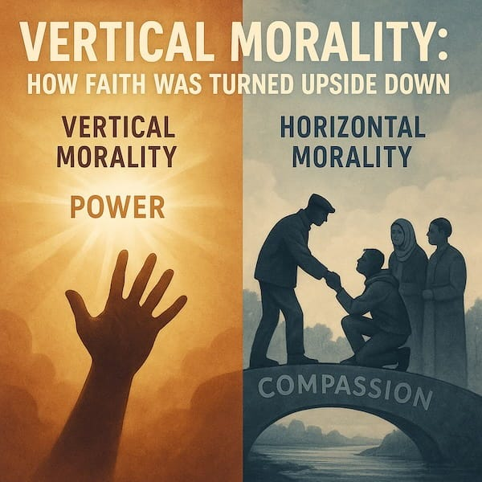

Here is a religious accusation you may have heard: ‘Without God, there is no morality’. Close behind it comes its secular twin: ‘Without the state, everything would be chaos’. The two claims are usually made by different people, but they share the same assumption that ordinary human beings, left to relate to one another without an authority standing over them, will inevitably descend into chaos or cruelty.

That assumption deserves more scrutiny than it usually gets. Because if you look at the actual track record – the Crusades, the Transatlantic slave trade, the genocide of indigenous peoples, the Holocaust – the institutions claiming to be the foundation of moral order are also, in historical fact, among the greatest sources of organised harm. The church blessed the slave ships. The state built the concentration camps.

So before we accept the premise, let us at least ask the question, ‘what if hierarchical religion and the nation state are not the solution to the problem of human cruelty? What if, in very many cases, they are the problem?’

## Two Directions For Morality

The clearest illustration of why hierarchical authority is the problem rather than the solution came, perhaps surprisingly, from inside evangelical Christianity. In 2017, Andy Stanley, pastor of one of the largest megachurches in the United States, began arguing publicly that Christian ethics contained two fundamentally different moral systems that had long been conflated. He called one **Vertical** : the relationship between humanity and God, top-down, defined by divine command. He called the other **Horizontal** : the relationship between people, defined by love of neighbour and the avoidance of harm.

His argument that these two systems were not only distinct but in many respects incompatible became a controversy within evangelical Christianity, not least because of its obvious implication: if horizontal morality is about love and not harming others, then forms of love such as homosexuality between consenting adults cause no horizontal harm. Instead of succumbing to the pressure to disavow such views, Stanley embraced and expanded this argument in his 2018 book _Irresistible_ , and began actively welcoming gay couples to his church.

The framework was developed further by atheist educator and activist Rachel Klinger Cain in her 2024 TikTok video on the subject. She stated that **Vertical Morality** takes authority as its standard: something is wrong ‘because God said so’, whereas **Horizontal Morality** takes harm and consent as its standard: something is wrong because it hurts someone. There is a certain irony in the fact that Stanley’s Christian critics accused secular morality of lacking a consistent foundation, given that the vertical system has shifted constantly across history, commanding genocide here, prohibiting inter-racial marriage there, sanctioning slavery throughout, depending entirely on who held interpretive power at the time. 

Philosophy has wrestled with this tension between hierarchal and horizontal ethics for centuries, in the conflict between two broad traditions: rule based, top down, (deontological) ethics grounded in duty to law or authority, and relational (or consequentialist) ethics grounded in actual effects on actual people.

None of these is an obscure philosophical position. Most people already reason horizontally most of the time. When you tell a child it is wrong to hit their sibling, you don’t appeal to a law, you say ‘because it hurts them.’ When someone does you a genuine wrong, the apology you want is from them, not from a judge. When you help a neighbour without being asked, you aren’t consulting a rulebook first.

Horizontal morality is not an abstract theory. It is how people who care about one another actually behave. What the rest of this piece tries to show is that wherever the vertical systems (religious and secular alike) have produced moral clarity, they have done so by accidentally employing horizontal logic. And wherever they have produced horrors, they have done so by ignoring or overriding it.

## Vertical Religious Morality

Christianity, as the dominant moral tradition in the ‘Western’ world, presents itself as the guarantor of morality. Without God, we are told, there is no basis for good and evil, and ethics becomes mere opinion. The claim is worth taking seriously, and when you do it collapses fairly quickly.

Plato posed this as what is now called the Euthyphro problem in 380 BCE, and it has never been satisfactorily answered by religion since: ‘Is something good because God commands it, or does God command it because it is good?’ If the former, then morality is entirely arbitrary, then God could command anything and it would become moral by definition. The God of the Old Testament, who commands the wholesale slaughter of neighbouring peoples and tolerates slavery, makes this not merely theoretical. If it is the latter (that God commands it because it is good) then goodness exists independently of God, and divine command is not needed to ground ethics at all. Horizontal morality sidesteps the dilemma entirely by grounding goodness in something observable: in harm, suffering, and consent, which exist and matter whether or not anyone commands them.

Then there is what might be called the intermediary problem. We never hear from God directly. We hear from human beings claiming to speak for God. ‘Divine authority’ is, in practice, always human authority wearing a divine mask. Whether the Pope, pastor, Ayatollah or Imam, the vertical structure requires a class of interpreters, and that class will interpret in ways that serve its own interests. The history of religious institutions accommodating slavery, suppressing women, and persecuting those they declared heretics follows naturally from this structural fact.

Almost every major expansion of the circle of moral concern in the last two centuries – the abolition of slavery, women’s suffrage, the decriminalisation of homosexuality, the recognition of indigenous rights – happened against the dominant vertical religious position of the time. The churches did not lead these movements. They resisted them, often ferociously. When progress eventually came, the vertical institutions updated their theology to accommodate it and then, with remarkable frequency, claimed credit.

This is not an attack on religious people, many of whom have been at the forefront of exactly those progressive movements. What made their moral arguments compelling was something specific: ‘love your neighbour’, ‘do unto others as you would have them do unto you’, which came with the insistence that every person carries inherent dignity. These are not vertical claims, they are as horizontal as it gets. The best of religious ethics has always been from the horizontal core beneath the vertical superstructure, and the worst has come when the vertical superstructure overrides the horizontal, and the institution takes precedence over the people it was meant to serve.

## Vertical State/Legal Morality

The secular version of the same argument runs roughly like this: without law, without enforcement, without the threat of punishment, without the state’s monopoly on force, human beings would prey on one another. The state keeps order, and the law defines right and wrong. Again the claim is worth examining seriously, and again the theory does not hold water.

If we start with the most basic moral problems, what was legal was very often not moral, and what was moral was very often not legal. Slavery was legal, helping an enslaved person escape was a crime. Women could not vote, own property, or refuse their husband. Homosexuality was a criminal offence. Workers who organised for basic rights were arrested.

Anyone who had lived by the principle that legal equals moral would have been on the wrong side of every important moral question in modern British and American history (as well as undoubtedly in all other nations). The law has never been a reliable guide to what is actually right, and in periods of significant injustice, it has been a near-perfect guide to what is wrong.

Then there is the question of what the law actually covers. Enormous numbers of crimes cause no harm to anyone: drug use between consenting adults, vagrancy, distributing food or literature without a permit, and even organising a union for better work conditions. Conversely, enormous harm occurs entirely within the law: the wage theft that costs workers more each year than all street crime combined, pollution that destroys the health of working-class communities, and colonial extraction that has impoverished entire continents over centuries. The law does not exist to address harm, it exists to support power.

This becomes clearer when you ask who writes the law. Laws are not written by the people they govern. They are written by legislators who are, with very rare exceptions, drawn from and indebted to the wealthy and powerful (or who are wealthy and powerful themselves). Property law protects property, and therefore protects those who have it, at the expense of those who don’t. The history of enclosure, of union-busting, of the criminalisation of poverty, is the history of the law doing exactly what you would expect from a tool made by and for the powerful.

And the institution claiming to be the guarantor of moral order is also responsible for the largest instances of organised harm in recorded history. State-organised war, state-sanctioned slavery, and colonial genocide, carried out under state flags and with state armies. The Holocaust, which was a feat of bureaucratic organisation as much as ideological evil. Concentration camps, gulags, apartheid systems: all of these were legal, and all of them were conducted by states. The monopoly on ‘legitimate’ violence turns out, in practice, to be a very efficient mechanism for conducting extraordinary violence while calling it order.

The parallel to the religious critique should be plain enough. In both cases, an authority above people defines right and wrong. In both cases, the actual victim is sidelined, as the offence is against God, or against the Crown, never straightforwardly against the person who was harmed. In both cases, the interpreting class (clergy, judiciary, police) accumulates power and uses it self-servingly. In both cases, history’s moral advances came from people defying the authority, not obeying it.

## The Same Argument Dressed Differently

Divine command and state law are not different kinds of moral system. They are the same system, wearing different clothes. Both work by placing an abstraction (God, the Crown, the Law) above the actual people involved, and telling those people that their job is to satisfy the abstraction rather than to repair their relationships with one another.

Both concentrate the power to define right and wrong in a specialist class (priests or lawyers) who are answerable upward to the authority, not outward to the community they claim to serve. Both claim eternal legitimacy while shifting constantly with whoever holds power. And both, when they fail, fail in the same direction: the person who was actually harmed ends up sidelined, and the perpetrator gets to settle accounts with an institution rather than with a human being.

It doesn’t matter if the institution calls itself a socialist state. A state is still a state, with all the structural features that come with it: the monopoly on violence, the specialist interpreting class, the abstract way the victim is dealt with, the tendency toward serving whoever controls the system. The problem is not just which values the vertical system claims to hold, the problem is the vertical structure itself.

## Moral Motivation

So if the structure is the problem, what does a genuinely different moral foundation look like? It starts not with rules, but with motivation - with why people act morally at all.

Pyotr Kropotkin, the anarchist philosopher, identified four types of people when it came to moral motivation:

  * Those who act from pure self-interest (the brute)

  * Those who act for divine reward (the calculator)

  * Those who calculate the balance of outcomes for all society (the utilitarian)

  * And those who act from genuine feeling for the people around them (the mutual aider - from the social instinct that develops through living alongside and depending on others.)

The first two (the brute and the calculator) are clearly vertical: external, transactional, and conditional on the authority holding up its end of the bargain. The utilitarian is an interesting edge case, being nominally horizontal in considering outcomes for others, but distrusted because they remain fundamentally always vulnerable to clever reasoning that justifies harm. The fourth type (the mutual aider), are those who act from genuine feeling for those around them, is horizontal to its core.

Kropotkin argued the mutual aid moral position is possible when morality doesn’t need to be imposed from above because it has already been built from below, through the accumulated experience of people living together and needing one another. This is not sentimentality, the anthropological record supports it. Communities without strong state oversight show sophisticated systems of mutual obligation, conflict resolution, and collective accountability. The cooperation is not the product of enforcement, it precedes it. The moral order is not the state’s achievement. In many cases, it is what the state has systematically dismantled. 

## What Horizontal Morality Actually Is

This raises a fair objection: ‘God and the state have a poor record. But what do you put in their place? Wishing doesn’t make people good. What happens when someone genuinely causes harm?’

The honest answer is that people cause harm regardless of what governing system exists above them. Good conditions reduce antisocial behaviour significantly, but do not eliminate it. No-one seriously claims otherwise. The question is not ‘will anyone ever do wrong?’ but ‘what kind of arrangement best addresses it when they do?’ 

Horizontal morality offers a clear framework. Something is wrong when it genuinely harms someone, when it causes damage or loss to a real person, or when it violates their consent. The standard has the considerable advantage of being grounded in observable reality rather than in the interpretation of an invisible authority’s will. Harm and consent are things people can witness and argue and do something about. Divine will and legal code are not.

When harm occurs, the response should involve the person who was harmed. Restorative and transformative approaches to justice do exactly this, and the evidence (where they have been tried seriously) shows better outcomes for victims, higher rates of genuine accountability, and lower rates of future harm than punitive state approaches deliver. The logic is simple: when the goal is to repair a relationship and make a damaged person whole, you need them in the room whenever possible and safe. When the goal is to punish an offence against an abstraction, you don’t.

Community norms, those unwritten understandings that make daily life possible, are not something that needs to be installed from above. They are something people build, constantly and mostly unconsciously, through the ordinary friction and cooperation of living alongside one another. What horizontal morality asks is simply that we take those norms seriously on their own terms, rather than dismissing them in favour of whatever the authority currently dictates.

None of this means everyone will always behave well. Some will not, but consider what vertical systems actually offer as a solution to bad actors: punishment after the fact, delivered by an institution with its own interests, producing approximately the same level of future harm or more. Genuine accountability, community pressure, and restorative repair are not a weaker response. In most cases, they are a stronger one. _(For a look at the failures of our current system see[Justice: Legal vs Good](https://peacefulrevolutionary.substack.com/p/justice-legal-vs-good))_

## Morality Doesn’t Need A Master

Political scepticism gets applied to economics, to governance, and to institutions of all kinds, but rarely to morality itself. Most of us are quite comfortable questioning whether a particular law is just, whether a given government deserves its power, and whether a specific religious ruling makes sense. What we rarely do is ask is, ‘why should morality itself require a master?’

The accusation was that without God or the state, there is no basis for ethics. What the historical record actually shows is something close to the opposite. The most reliable moral guidance human beings have developed has been the guidance that comes from paying attention to and caring for one another. This holds across cultures, across centuries, and across the messiness of actual lives. From noticing when someone is hurt to extending the ordinary decency of human relationship outward into wider and wider circles. From asking not ‘is this legal?’ or ‘is this commanded?’ but ‘does this harm someone, and did they consent?’

That is not a sophisticated philosophical position. It is, in fact, what most people already believe when they aren’t being told otherwise. Children grasp it before they can read. It preceded the written law and has outlasted every idol whose worshippers once considered them eternal.

Ordinary people, relating to one another honestly and directly, are more reliably morally than any system built above them to manage that relationship. History, examined without flattery to its rulers, most clearly supports that conclusion.

Morality does not need a master. It needs a community.

Subscribe

[Share](https://peacefulrevolutionary.substack.com/p/morality-without-a-master?utm_source=substack&utm_medium=email&utm_content=share&action=share)
